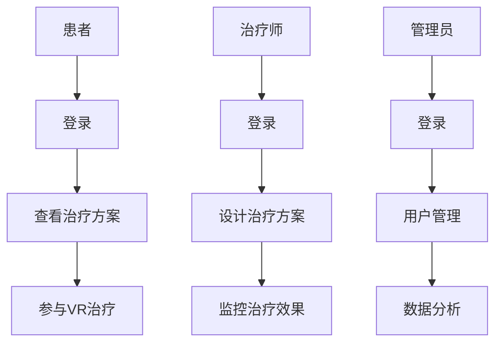

                 

### 虚拟现实在心理治疗中的创新应用

> 关键词：虚拟现实、心理治疗、创新应用、沉浸感、交互性、技术挑战

> 摘要：本文详细探讨了虚拟现实（VR）在心理治疗中的创新应用。通过介绍VR技术的原理和特点，分析其在心理治疗中的应用案例、优势和挑战，以及VR技术在心理治疗中的数学模型和算法原理，本文旨在为心理学专业人士和心理治疗师提供一种新的治疗工具和方法，以提升治疗效果。

## 第一部分：背景介绍

### 问题背景

随着科技的发展和人们对心理健康问题日益重视，虚拟现实（VR）技术在心理治疗中的应用逐渐受到关注。VR技术通过创建虚拟环境，使用户能够沉浸其中，为心理治疗提供了一种全新的方式。这种技术在帮助患者克服恐惧、焦虑等心理问题方面展现出显著的效果，成为心理治疗领域的一大创新。

### 问题描述

虚拟现实在心理治疗中的创新应用涵盖了多个方面，包括但不限于：

1. **VR技术的原理和特点**：了解VR技术的基本原理和特点，如沉浸感、交互性等。
2. **VR在心理治疗中的应用案例**：探讨VR技术在焦虑症、恐惧症、抑郁症等心理疾病治疗中的应用。
3. **VR技术在心理治疗中的优势和挑战**：分析VR技术在心理治疗中的优势，如提高治疗效果、减轻治疗痛苦等，以及面临的挑战，如技术成熟度、安全性问题等。
4. **VR技术在心理治疗中的未来发展趋势**：展望VR技术在心理治疗领域的未来发展，探讨其潜在的应用前景。

### 问题解决

为了深入探讨虚拟现实在心理治疗中的创新应用，本文将从以下几个方面进行阐述：

1. **虚拟现实（VR）的基本概念和原理**：介绍VR技术的基本原理和特点，如沉浸感、交互性等。
2. **VR在心理治疗中的应用案例**：通过具体的案例，展示VR技术在心理治疗中的应用效果。
3. **VR技术在心理治疗中的优势和挑战**：分析VR技术在心理治疗中的优势，以及面临的挑战。
4. **VR技术在心理治疗中的数学模型和算法原理**：介绍VR技术在心理治疗中的数学模型和算法原理，如沉浸度模型、治疗效果模型等。
5. **VR技术在心理治疗中的系统分析与架构设计**：探讨VR技术在心理治疗中的系统分析与架构设计，包括系统功能设计、系统架构设计、系统接口设计和系统交互等。
6. **VR技术在心理治疗中的项目实战**：通过一个实际项目，展示VR技术在心理治疗中的应用，包括环境安装、系统核心实现、代码应用解读与分析等。

### 边界与外延

本文主要探讨VR技术在心理治疗中的应用，涉及领域包括焦虑症、恐惧症、抑郁症等常见心理问题的VR治疗研究。同时，本文也将关注VR技术在其他心理治疗领域的应用前景。

### 概念结构与核心要素组成

- **虚拟现实（VR）**：通过计算机技术模拟的三维空间环境，使用户能够沉浸在虚拟世界中。
- **心理治疗**：通过专业的方法和技巧，帮助患者解决心理问题，提高生活质量。
- **创新应用**：在传统心理治疗基础上，利用VR技术提出的新方法、新策略和新工具。

## 第二部分：核心概念与联系

### VR技术的原理和特点

#### 原理

虚拟现实（VR）技术通过计算机生成三维图像，使用户能够通过视觉、听觉、触觉等多种感官体验沉浸在虚拟环境中。其基本原理包括：

1. **图像生成**：通过计算机图形学技术，生成三维图像，使用户能够看到虚拟环境。
2. **传感器技术**：使用传感器，如头戴式显示器、手柄等，捕捉用户的动作和位置，实现与虚拟环境的交互。

#### 特点

1. **沉浸感**：虚拟现实技术能够提供高度沉浸的体验，使用户感觉仿佛置身于真实环境中。
2. **交互性**：用户可以通过动作、语音等方式与虚拟环境进行互动，增强体验感。
3. **扩展性**：可以根据需求自定义虚拟环境，实现各种应用场景。

### VR在心理治疗中的应用案例

#### 焦虑症治疗

通过虚拟现实技术，可以模拟各种可能导致焦虑的场景，如高处、拥挤的场所等，让患者在虚拟环境中逐步适应和克服焦虑。这种方法可以帮助患者面对和克服真实的焦虑场景。

#### 恐惧症治疗

虚拟现实技术可以帮助患者面对和克服恐惧对象，如恐惧飞行、恐惧公共场合等。通过在虚拟环境中逐步暴露和面对恐惧对象，患者可以逐渐减少恐惧情绪。

#### 抑郁症治疗

虚拟现实技术可以改善患者的生活质量和心理状态。通过虚拟现实游戏、虚拟旅游等方式，患者可以在虚拟环境中找到乐趣和放松，缓解抑郁情绪。

### VR技术在心理治疗中的优势和挑战

#### 优势

1. **提高治疗效果**：虚拟现实技术能够提供更加真实、多样化的治疗场景，提高患者的参与度和治疗效果。
2. **减轻治疗痛苦**：相对于传统心理治疗，虚拟现实技术可以让患者在更加舒适的环境中接受治疗，减轻治疗痛苦。

#### 挑战

1. **技术成熟度**：虽然VR技术在不断进步，但仍然存在一些技术难题，如图像质量、交互体验等。
2. **安全性问题**：虚拟现实技术可能对患者的心理健康产生负面影响，需要严格评估和监控。

### 第三部分：数学模型和算法原理讲解

#### VR技术在心理治疗中的数学模型

1. **沉浸度模型**：
   $$ Immersion = f(Vis, Aud, Touch) $$
   其中，Vis代表视觉沉浸度，Aud代表听觉沉浸度，Touch代表触觉沉浸度。

2. **治疗效果模型**：
   $$ Effectiveness = f(Immersion, TherapyMethod) $$
   其中，Immersion代表沉浸度，TherapyMethod代表治疗方式。

#### 算法原理讲解

1. **VR场景生成算法**：

   ```mermaid
   graph TD
   A[初始化场景参数] --> B[生成三维模型]
   B --> C[光照与阴影计算]
   C --> D[渲染图像]
   D --> E[输出虚拟场景]
   ```

2. **沉浸度评估算法**：

   ```mermaid
   graph TD
   A[收集视觉数据] --> B[计算视觉沉浸度]
   A --> C[收集听觉数据] --> D[计算听觉沉浸度]
   C --> D
   D --> E[收集触觉数据] --> F[计算触觉沉浸度]
   E --> F
   F --> G[计算总沉浸度]
   ```

### 第四部分：系统分析与架构设计方案

#### 问题场景介绍

假设一个心理治疗中心，使用VR技术为患者提供心理治疗服务。治疗师需要设计适合患者的VR治疗方案，并监控治疗效果。

#### 项目介绍

本项目旨在开发一个基于虚拟现实技术的心理治疗系统，为治疗师和患者提供便捷、高效的治疗服务。系统包括以下功能：

1. **患者信息管理**：记录患者的个人信息、病历、治疗方案等。
2. **VR治疗方案设计**：根据患者的心理问题，设计合适的VR治疗方案。
3. **VR场景管理**：管理VR场景的参数、配置和内容。
4. **治疗效果评估**：评估VR治疗的效果，为治疗师提供反馈。

#### 系统功能设计

1. **患者信息管理**：
   - 患者个人信息：包括姓名、年龄、性别、联系方式等。
   - 病历管理：记录患者的心理问题、治疗方案、治疗效果等。
2. **VR治疗方案设计**：
   - 治疗方案创建：根据患者的心理问题，创建适合的VR治疗方案。
   - 治疗方案调整：根据治疗效果，调整VR治疗方案。
3. **VR场景管理**：
   - 场景参数配置：包括场景的大小、光照、音效等。
   - 场景内容管理：管理VR场景中的物体、人物等。
4. **治疗效果评估**：
   - 治疗效果数据收集：收集患者的治疗数据，如沉浸度、治疗效果等。
   - 治疗效果分析：对治疗数据进行分析，评估VR治疗的效果。

#### 系统架构设计

1. **客户端**：
   - 患者客户端：用于患者参与VR治疗。
   - 治疗师客户端：用于治疗师设计治疗方案、监控治疗效果。
2. **服务器**：
   - 数据存储：存储患者的个人信息、病历、治疗方案、治疗效果等数据。
   - 服务接口：提供API接口，供客户端调用。
3. **VR场景生成系统**：
   - 场景参数配置：根据治疗方案，配置VR场景的参数。
   - 场景内容生成：生成VR场景中的物体、人物等。

#### 系统接口设计

1. **患者接口**：
   - 登录：患者登录系统。
   - 查看治疗方案：患者查看自己的治疗方案。
   - 参与VR治疗：患者参与VR治疗，体验虚拟场景。
2. **治疗师接口**：
   - 登录：治疗师登录系统。
   - 设计治疗方案：治疗师设计治疗方案。
   - 监控治疗效果：治疗师监控患者的治疗效果。
3. **管理员接口**：
   - 登录：管理员登录系统。
   - 用户管理：管理员管理患者和治疗师账号。
   - 数据分析：管理员分析系统数据，优化系统功能。

#### 系统交互



### 第五部分：项目实战

#### 环境安装

1. **硬件环境**：
   - VR头盔：用于患者参与VR治疗。
   - 游戏主机：用于生成VR场景。
   - 显示器：用于显示VR场景。
2. **软件环境**：
   - VR开发平台：如Unity、Unreal Engine等。
   - 数据库：如MySQL、PostgreSQL等。
   - Web服务器：如Apache、Nginx等。

#### 系统核心实现

1. **患者信息管理**：
   - 数据表设计：
     ```sql
     CREATE TABLE Patient (
       id INT PRIMARY KEY AUTO_INCREMENT,
       name VARCHAR(50),
       age INT,
       gender ENUM('male', 'female', 'other'),
       contact VARCHAR(100),
       diagnosis TEXT,
       treatment_plan TEXT
     );
     ```
   - 患者信息查询：
     ```python
     def get_patient_info(patient_id):
         query = "SELECT * FROM Patient WHERE id = %s"
         cursor.execute(query, (patient_id,))
         return cursor.fetchone()
     ```

2. **VR治疗方案设计**：
   - 治疗方案创建：
     ```python
     def create_treatment_plan(patient_id, treatment_plan):
         query = "UPDATE Patient SET treatment_plan = %s WHERE id = %s"
         cursor.execute(query, (treatment_plan, patient_id))
         connection.commit()
     ```

3. **VR场景管理**：
   - 场景参数配置：
     ```python
     def set_scene_parameters(scene_id, size, light, sound):
         query = "UPDATE Scene SET size = %s, light = %s, sound = %s WHERE id = %s"
         cursor.execute(query, (size, light, sound, scene_id))
         connection.commit()
     ```

4. **治疗效果评估**：
   - 治疗效果数据收集：
     ```python
     def collect_treatment_effect(patient_id, immersion_score, effectiveness_score):
         query = "INSERT INTO TreatmentEffect (patient_id, immersion_score, effectiveness_score) VALUES (%s, %s, %s)"
         cursor.execute(query, (patient_id, immersion_score, effectiveness_score))
         connection.commit()
     ```

#### 代码应用解读与分析

1. **患者信息管理**：
   - 数据表设计：用于存储患者的个人信息、病历和治疗方案。
   - 患者信息查询：用于获取特定患者的信息，为治疗师提供参考。

2. **VR治疗方案设计**：
   - 治疗方案创建：用于更新患者的治疗方案，为患者提供针对性的治疗。

3. **VR场景管理**：
   - 场景参数配置：用于设置VR场景的参数，为患者提供多样化的治疗场景。

4. **治疗效果评估**：
   - 治疗效果数据收集：用于收集患者的治疗效果数据，为治疗师提供反馈，优化治疗方案。

#### 实际案例分析和详细讲解剖析

1. **案例一**：焦虑症治疗
   - **问题描述**：患者小李患有高空恐惧症，每次乘坐电梯或高楼都会感到极度不安。
   - **解决方案**：通过虚拟现实技术，设计一个模拟高空的场景，让小李在虚拟环境中逐步适应高空环境。
   - **治疗效果**：经过一段时间的VR治疗，小李在高空环境中的不安情绪明显减少，成功克服了高空恐惧症。

2. **案例二**：抑郁症治疗
   - **问题描述**：患者小张患有抑郁症，情绪低落，缺乏生活动力。
   - **解决方案**：通过虚拟现实技术，设计一个虚拟旅游场景，让小张在虚拟环境中体验不同的风景和活动，寻找乐趣和放松。
   - **治疗效果**：经过一段时间的VR治疗，小张的情绪逐渐好转，生活质量得到显著提升。

#### 项目小结

本项目通过虚拟现实技术，为心理治疗提供了一种新的方式。通过实际案例的分析和讲解，展示了VR技术在心理治疗中的优势和应用效果。未来，随着VR技术的不断发展和完善，虚拟现实在心理治疗领域的应用前景将更加广阔。

### 第六部分：最佳实践 tips

1. **选择合适的VR头盔**：治疗师在为患者选择VR头盔时，应考虑患者的舒适度和适应度，确保患者能够在虚拟环境中舒适地参与治疗。
2. **设计多样化的VR场景**：治疗师应根据患者的心理问题，设计多样化的VR场景，提高患者的参与度和治疗效果。
3. **监控治疗效果**：治疗师应定期收集和评估患者的治疗效果，根据患者的反馈和实际情况，调整治疗方案。

### 小结

虚拟现实技术在心理治疗中的应用为治疗师和患者提供了一种新的治疗工具和方法。通过设计合适的VR场景和治疗方案，患者可以在虚拟环境中逐步适应和克服心理问题，提高治疗效果。未来，随着VR技术的不断发展和完善，虚拟现实在心理治疗领域的应用前景将更加广阔。

### 注意事项

1. **患者隐私保护**：在应用虚拟现实技术进行心理治疗时，治疗师应严格遵守患者隐私保护相关规定，确保患者个人信息的安全。
2. **技术成熟度**：虚拟现实技术在心理治疗中的应用仍处于发展阶段，治疗师应充分考虑技术成熟度，确保治疗过程的安全性和有效性。

### 拓展阅读

1. **《虚拟现实在心理治疗中的应用研究》**：详细介绍了VR技术在心理治疗中的研究进展和应用案例。
2. **《虚拟现实技术及其在心理治疗中的应用》**：全面讲解了VR技术的原理、特点和在心理治疗中的应用。
3. **《虚拟现实在临床心理学中的应用》**：探讨了VR技术在临床心理学领域的应用前景和挑战。

### 作者

作者：AI天才研究院/AI Genius Institute & 禅与计算机程序设计艺术 /Zen And The Art of Computer Programming

---

本文通过详细探讨虚拟现实（VR）在心理治疗中的创新应用，旨在为心理学专业人士和心理治疗师提供一种新的治疗工具和方法。文章涵盖了VR技术的原理和特点、应用案例、优势和挑战，以及VR技术在心理治疗中的数学模型和算法原理，同时提出了系统架构设计和项目实战方案。通过实际案例的分析和讲解，展示了VR技术在心理治疗中的优势和效果。未来，随着VR技术的不断发展和完善，虚拟现实在心理治疗领域的应用前景将更加广阔。希望本文能为相关领域的研究和实践提供参考和启示。

