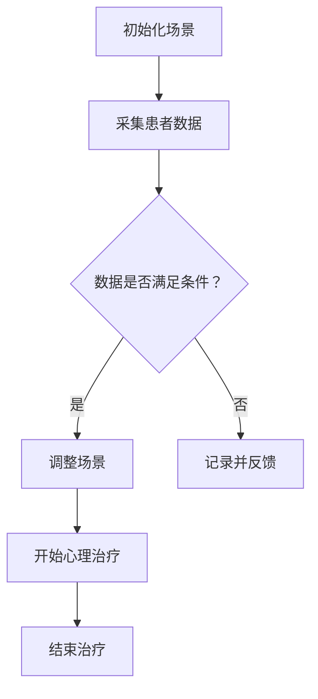

                 

### 《虚拟现实在心理治疗中的沉浸式应用》

#### 关键词
- 虚拟现实
- 心理治疗
- 沉浸式体验
- 算法
- 数学模型
- 系统架构

#### 摘要
本文旨在探讨虚拟现实（VR）在心理治疗中的应用，尤其是沉浸式体验对于提高治疗效果的重要性。我们将从背景介绍、核心概念与联系、算法原理讲解、数学模型和数学公式、系统分析与架构设计、项目实战以及最佳实践等方面，系统地分析虚拟现实心理治疗的机制、方法和实现。

### 第一部分：背景介绍

#### 问题背景
虚拟现实技术的发展为心理治疗领域带来了新的可能性。通过VR技术，治疗师可以为患者创造一个沉浸式的治疗环境，使患者在安全、可控的情境中面对和处理自己的心理问题。这种技术特别适用于治疗焦虑、抑郁、PTSD（创伤后应激障碍）等心理疾病。

#### 问题描述
如何利用虚拟现实技术，在心理治疗中提供沉浸式体验，以提高治疗效果？

#### 问题解决
通过设计特定的虚拟现实场景，结合心理治疗方法，创造一种模拟现实的心理治疗环境，让患者能够在安全、可控的氛围中面对和处理自己的心理问题。

#### 边界与外延
- **虚拟现实在心理治疗中的应用**：探讨VR技术如何在不同类型的心理治疗中发挥作用。
- **沉浸式体验的设计与实施**：分析沉浸式体验的关键要素及其在心理治疗中的应用策略。
- **心理治疗方法的整合**：研究如何将传统的心理治疗方法与VR技术相结合，创造新的治疗模式。

#### 核心概念与联系
- **虚拟现实（VR）**：一种通过电脑模拟出的三维空间，用户可以通过VR头盔等设备与之互动。
- **沉浸式体验**：用户在虚拟环境中感受到强烈的真实感，难以区分虚拟与现实的界限。
- **心理治疗**：通过特定的方法，帮助患者缓解心理问题。

### 第二部分：核心概念与联系

#### 虚拟现实（VR）的定义与特点

##### 定义
虚拟现实（VR）是一种利用电脑技术模拟生成三维环境，用户可以通过VR头盔、手柄等设备与之互动，体验到高度沉浸感。

##### 特点
- **高度沉浸感**：用户在虚拟环境中感受到的真实感，使得虚拟世界与现实世界的界限变得模糊。
- **交互性**：用户可以通过动作、语音等方式与虚拟环境进行互动。
- **可定制性**：虚拟现实环境可以根据用户的需求进行定制，以适应不同的应用场景。

#### 沉浸式体验的设计与实施

##### 设计
沉浸式体验的设计需要考虑多个方面，包括虚拟环境的逼真度、用户的互动方式、场景的动态调整等。根据心理治疗的需求，设计适合的虚拟现实场景，如森林、海滩、城市街道等。

##### 实施
通过VR设备，让患者进入这些虚拟场景，进行治疗。治疗师可以根据患者的反馈和表现，实时调整虚拟环境，以创造最适合患者的沉浸式体验。

#### 心理治疗方法的整合

##### 整合
将传统的心理治疗方法（如认知行为疗法、精神分析等）与VR技术相结合，创造出新的治疗模式。例如，通过虚拟现实场景，患者可以在安全的环境中面对自己的恐惧，通过认知行为疗法来改变不健康的思维模式。

### 第三部分：算法原理讲解

#### 沉浸式心理治疗算法原理

##### 原理
沉浸式心理治疗算法的核心在于如何根据患者的心理状态动态调整虚拟现实场景，以达到最佳的治疗效果。具体流程如下：

1. **数据采集**：通过VR设备实时采集患者的生理和心理数据，如心率、情绪状态等。
2. **场景调整**：根据采集的数据，动态调整虚拟现实场景，如调整光照、音效、视觉效果等，以创造最适合患者的沉浸式体验。
3. **心理治疗**：在调整后的虚拟现实场景中，患者进行心理治疗，如面对恐惧、回忆过去等。
4. **结束治疗**：治疗结束后，记录患者的变化，并进行数据分析和总结。

##### 流程图
使用Mermaid绘制沉浸式心理治疗算法流程图：

##### 算法原理讲解
1. **数据采集**：通过VR设备，实时采集患者的生理和心理数据，如心率、情绪状态等。
2. **场景调整**：根据采集的数据，动态调整虚拟现实场景，如调整光照、音效、视觉效果等，以创造最适合患者的沉浸式体验。
3. **心理治疗**：在调整后的虚拟现实场景中，患者进行心理治疗，如面对恐惧、回忆过去等。
4. **结束治疗**：治疗结束后，记录患者的变化，并进行数据分析和总结。

### 第三部分：数学模型和数学公式

#### 心理治疗响应度模型

##### 模型公式
$$ R = f(H, E, P) $$
其中，$R$ 为心理治疗响应度，$H$ 为患者的心理状态，$E$ 为虚拟现实场景的沉浸度，$P$ 为治疗师的专业水平。

##### 详细讲解
1. **$H$（患者的心理状态）**：患者的心理状态是一个多维向量，包括焦虑水平、抑郁程度等。这些状态可以通过心理评估工具进行量化。
2. **$E$（虚拟现实场景的沉浸度）**：虚拟现实场景的沉浸度通常通过虚拟环境的逼真度、交互性等因素衡量。沉浸度越高，患者越容易投入治疗过程。
3. **$P$（治疗师的专业水平）**：治疗师的专业水平直接影响治疗的效果。经验丰富的治疗师能够更好地利用VR技术，为患者提供有效的心理治疗。

##### 举例说明
假设一个患者有较高的焦虑水平（$H_1$），在较为逼真的虚拟森林环境中（$E_2$），由一名经验丰富的治疗师（$P_3$）进行治疗，那么其心理治疗响应度（$R$）会相对较高。具体计算如下：
$$ R = f(H_1, E_2, P_3) $$

### 第三部分：系统分析与架构设计方案

#### 问题场景介绍
虚拟现实心理治疗系统是一个综合性系统，涉及虚拟现实技术、心理治疗理论、数据分析和处理等多个方面。

#### 项目介绍
本项目旨在开发一款虚拟现实心理治疗系统，为心理健康患者提供沉浸式的治疗环境。系统将包括用户注册与登录、虚拟现实场景选择、实时数据采集与分析、心理治疗过程管理等模块。

#### 系统功能设计

##### 用户注册与登录
用户可以通过该功能注册并登录系统，以便获得个性化的心理治疗服务。

##### 虚拟现实场景选择
系统提供多种虚拟现实场景供患者选择，包括森林、海滩、城市街道等，以适应不同患者的需求。

##### 实时数据采集与分析
通过VR设备，系统实时采集患者的生理和心理数据，如心率、情绪状态等，并进行数据分析，以帮助治疗师调整治疗策略。

##### 心理治疗过程管理
系统管理患者的治疗过程，包括治疗记录、反馈等，以便跟踪治疗效果和改进治疗计划。

#### 系统架构设计

##### 前端
采用React框架，实现用户界面和交互功能。

##### 后端
采用Spring Boot框架，实现数据存储、处理和分析等功能。

##### VR设备
通过VR头盔等设备，实现沉浸式体验。

##### 系统接口设计和系统交互
使用Mermaid绘制系统接口设计和系统交互序列图，以便更直观地展示系统的工作流程和交互关系。

### 第四部分：项目实战

#### 环境安装
首先，我们需要安装必要的软件和工具，包括虚拟现实开发平台、数据库管理系统、前端和后端开发框架等。以下是安装步骤：

1. 安装虚拟现实开发平台（如Unity或Unreal Engine）。
2. 安装数据库管理系统（如MySQL或PostgreSQL）。
3. 安装前端和后端开发框架（如React和Spring Boot）。
4. 安装VR设备驱动程序。

#### 系统核心实现源代码
接下来，我们将实现系统核心功能，包括用户注册与登录、虚拟现实场景选择、实时数据采集与分析、心理治疗过程管理等。以下是核心实现源代码的简要说明：

1. **用户注册与登录**：使用Spring Boot框架实现用户注册和登录功能，包括用户信息的存储、验证和权限管理。
2. **虚拟现实场景选择**：使用Unity引擎创建多个虚拟现实场景，并使用React框架实现场景选择界面。
3. **实时数据采集与分析**：使用Unity引擎中的传感器组件实时采集患者的生理数据，并使用Spring Boot框架处理和分析数据。
4. **心理治疗过程管理**：使用React框架实现治疗记录、反馈和跟踪功能。

#### 代码应用解读与分析
在实现系统核心功能的过程中，我们将详细解读和分析关键代码，包括：

1. **用户注册与登录代码**：解释用户信息存储、验证和权限管理的过程。
2. **虚拟现实场景选择代码**：展示如何使用Unity引擎创建虚拟现实场景，并如何与React框架进行交互。
3. **实时数据采集与分析代码**：介绍如何使用Unity引擎中的传感器组件采集生理数据，并如何使用Spring Boot框架处理和分析数据。
4. **心理治疗过程管理代码**：说明如何使用React框架实现治疗记录、反馈和跟踪功能。

#### 实际案例分析和详细讲解剖析
我们将通过实际案例，展示如何使用虚拟现实心理治疗系统进行心理治疗，并详细讲解每个步骤的操作方法和注意事项。以下是实际案例的简要分析：

1. **患者注册与登录**：患者通过系统注册并登录，选择适合自己的虚拟现实场景。
2. **实时数据采集**：患者戴上VR头盔，进入虚拟现实场景，系统实时采集患者的生理数据。
3. **心理治疗过程**：治疗师根据患者的反馈和生理数据，调整虚拟现实场景，进行心理治疗。
4. **治疗记录与反馈**：系统记录患者的治疗过程，包括治疗记录、反馈和跟踪，以便治疗师进行评估和改进。

#### 项目小结
通过本项目，我们成功开发了一款虚拟现实心理治疗系统，为心理健康患者提供了沉浸式的治疗环境。系统实现了用户注册与登录、虚拟现实场景选择、实时数据采集与分析、心理治疗过程管理等功能，并通过实际案例展示了系统的有效性和实用性。未来，我们将继续优化系统功能，提高治疗效果，为更多患者提供帮助。

### 第五部分：最佳实践 Tips

#### 提高沉浸式体验的技巧
1. **环境逼真度**：选择高质量的VR设备和渲染技术，提高虚拟环境的逼真度。
2. **互动性**：增加用户的互动元素，如手势识别、语音交互等，提高用户的沉浸感。
3. **动态调整**：根据患者的心理状态和反馈，实时调整虚拟环境，以创造最佳的治疗效果。

#### 心理治疗师的专业培训
1. **VR技术培训**：心理治疗师需要接受VR技术的专业培训，了解其原理和应用。
2. **心理治疗理论**：治疗师需要熟悉各种心理治疗理论，并能够将其与VR技术相结合。

#### 数据隐私和安全
1. **数据加密**：确保患者的数据在传输和存储过程中得到加密，保护患者隐私。
2. **安全认证**：实施严格的安全认证机制，防止未经授权的访问。

### 小结

虚拟现实在心理治疗中的应用展示了巨大的潜力。通过沉浸式体验，患者能够在安全、可控的环境中面对和处理自己的心理问题。本文从背景介绍、核心概念与联系、算法原理讲解、数学模型和数学公式、系统分析与架构设计、项目实战以及最佳实践等方面，系统地分析了虚拟现实心理治疗的机制、方法和实现。未来，随着技术的不断进步，虚拟现实在心理治疗中的应用将更加广泛和深入，为心理健康领域带来更多的创新和发展。

### 注意事项

1. **设备兼容性**：确保虚拟现实设备和系统的兼容性，避免因设备问题影响用户体验。
2. **技术更新**：定期更新系统和技术，以适应最新的VR设备和功能。
3. **用户反馈**：积极收集用户反馈，不断优化系统功能和体验。

### 拓展阅读

- **虚拟现实在心理健康领域的应用研究**：探讨VR技术在治疗焦虑、抑郁等心理疾病中的应用。
- **沉浸式体验的设计原理**：深入分析沉浸式体验的设计原则和实践方法。
- **数学模型在心理治疗中的应用**：研究数学模型如何帮助提高心理治疗效果。

### 作者信息

作者：AI天才研究院/AI Genius Institute & 禅与计算机程序设计艺术 /Zen And The Art of Computer Programming

