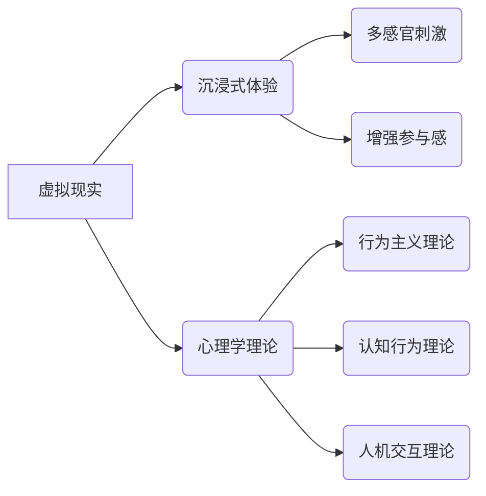
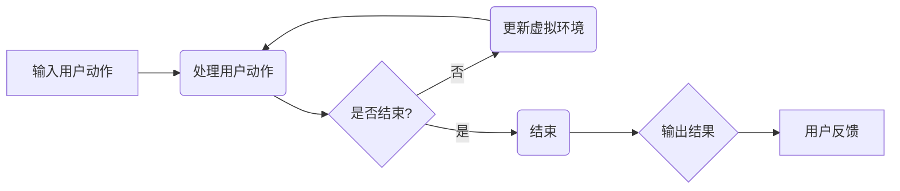
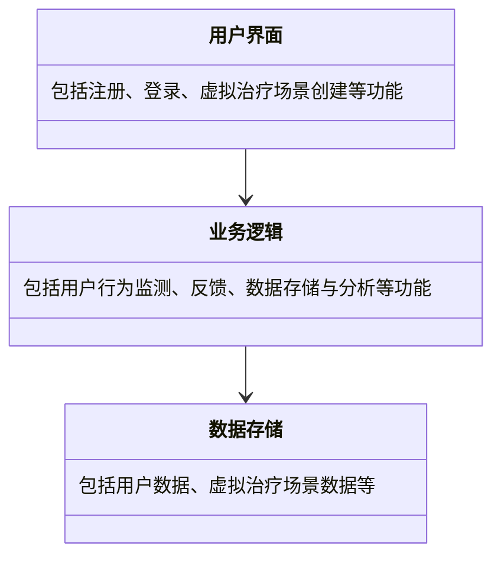
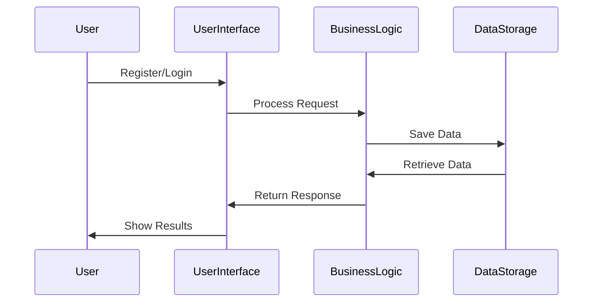
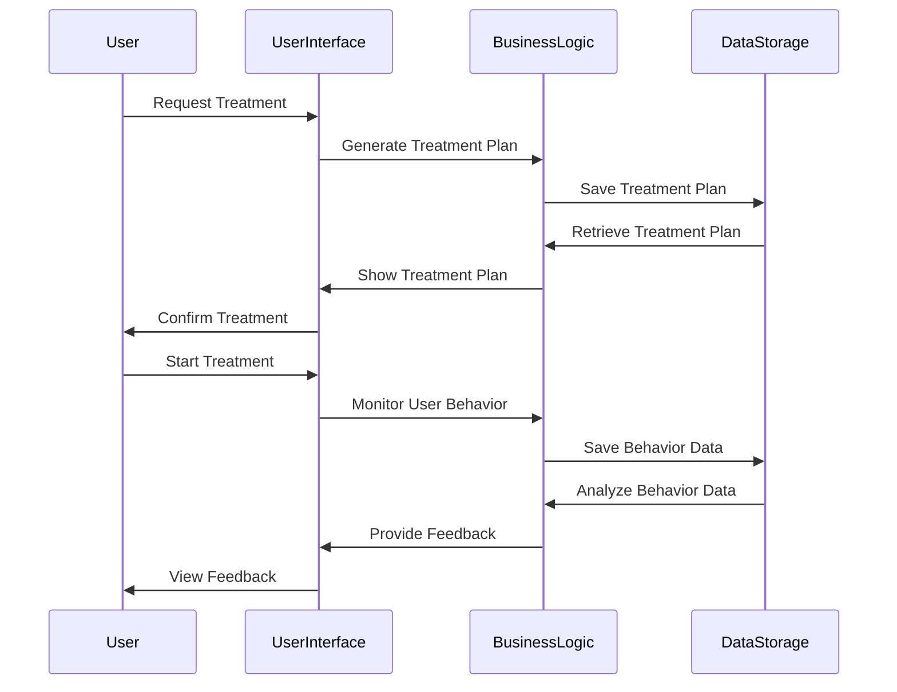

                 

**

### 第1章 引言

#### 1.1 心理治疗与虚拟现实技术

心理治疗作为一种传统手段，已经帮助无数人克服心理障碍，重拾健康的生活。然而，随着科技的不断发展，尤其是虚拟现实（VR）技术的兴起，心理治疗领域迎来了新的变革。虚拟现实技术通过创建一个模拟的环境，让患者在其中经历各种情境，从而达到心理治疗的效果。这种沉浸式的体验，相较于传统的面对面治疗，具有独特的优势。

首先，虚拟现实技术提供了一个安全的环境。在这个环境中，患者可以自由地表达自己的情绪和想法，而不用担心外界评价和干扰。这种安全感有助于患者更深入地面对和解决问题。

其次，虚拟现实技术能够模拟出各种复杂的情境。无论是面对恐惧症的患者，还是创伤后应激障碍（PTSD）患者，虚拟现实技术都能为他们提供定制化的场景，帮助他们逐步克服恐惧和创伤。

#### 1.2 沉浸式体验在心理治疗中的作用

沉浸式体验是虚拟现实技术的核心，它通过多感官的刺激，使患者完全投入到虚拟环境中。这种沉浸式体验在心理治疗中具有重要的作用。

首先，沉浸式体验能够增强患者的参与感。在传统的心理治疗中，患者往往是被动接受治疗，而在虚拟现实环境中，患者可以主动探索和互动，这大大提高了治疗的参与度和效果。

其次，沉浸式体验能够提供反馈。通过虚拟现实技术，治疗师可以实时观察患者的反应，并根据患者的反应调整治疗方案。这种反馈机制有助于提高治疗的针对性和有效性。

#### 1.3 虚拟现实技术的基本概念

虚拟现实技术，简称VR，是一种通过计算机技术模拟出三维虚拟环境，使人们能够在其中进行互动和体验的技术。VR技术的基本概念包括：

- **三维空间**：虚拟现实技术能够创建一个三维的虚拟空间，让用户在其中自由移动和互动。
- **多感官刺激**：虚拟现实技术通过视觉、听觉、触觉等多感官的刺激，提供沉浸式的体验。
- **交互性**：虚拟现实技术允许用户在虚拟环境中进行交互，这增强了用户的参与感和体验感。

#### 1.4 书籍结构概述

本书将分为以下几个部分，对虚拟现实在心理治疗中的沉浸式应用进行详细探讨：

- **第2章**：介绍虚拟现实与沉浸式技术的基础知识。
- **第3章**：讲解虚拟现实技术在心理治疗中的实现方法。
- **第4章**：分析几个典型的沉浸式心理治疗案例。
- **第5章**：探讨沉浸式心理治疗的挑战与未来展望。

通过本书的阅读，读者将深入了解虚拟现实技术在心理治疗中的应用，了解其优势和挑战，为未来的发展提供思路。

### 关键词：虚拟现实、心理治疗、沉浸式体验、交互性、安全感

#### 摘要：

本文从虚拟现实技术的基本概念入手，探讨了其在心理治疗中的沉浸式应用。通过分析沉浸式体验在心理治疗中的作用，以及虚拟现实技术的基本原理，本文详细介绍了虚拟现实技术在心理治疗中的实现方法，并分析了几个典型的沉浸式心理治疗案例。最后，本文探讨了沉浸式心理治疗面临的挑战与未来展望，为读者提供了有价值的参考。

----------------------------------------------------------------

## 第2章 虚拟现实与沉浸式技术基础

### 2.1 虚拟现实技术的发展历程

虚拟现实（Virtual Reality，VR）技术起源于20世纪60年代，最初是为了模拟飞行训练而开发的。1972年，美国数学家莫里斯·威斯科普夫（Maurice Wilkes）提出了虚拟现实的概念，并提出了虚拟现实系统的初步构想。此后，随着计算机技术的发展，虚拟现实技术逐渐成熟。

1987年，美国计算机科学家艾略特·查德维克（Elliott W. Chardwick）发明了头戴式显示器（HMD），这是虚拟现实技术的重大突破。HMD的出现，使得用户能够更直观地感受到虚拟环境的存在，为虚拟现实技术的大规模应用奠定了基础。

进入21世纪，随着图形处理能力的大幅提升和互联网的普及，虚拟现实技术进入了快速发展阶段。2010年，Oculus VR公司发布了首款消费者级的虚拟现实头盔Oculus Rift，引发了全球范围内的关注。此后，Google、Facebook（通过收购Oculus）等科技巨头纷纷加大了对虚拟现实技术的投入，推动了虚拟现实市场的快速发展。

### 2.2 沉浸式技术的核心概念

沉浸式技术（Immersion Technology）是指通过多感官的刺激，让用户完全投入到虚拟环境中，达到沉浸式的体验。沉浸式技术的核心概念包括：

- **三维空间**：虚拟现实技术能够创建一个三维的虚拟空间，让用户在其中自由移动和互动。
- **多感官刺激**：虚拟现实技术通过视觉、听觉、触觉等多感官的刺激，提供沉浸式的体验。
- **交互性**：虚拟现实技术允许用户在虚拟环境中进行交互，这增强了用户的参与感和体验感。

### 2.3 相关心理学理论

虚拟现实技术在心理治疗中的应用，离不开心理学的支持。以下是一些与虚拟现实技术相关的心理学理论：

- **行为主义理论**：行为主义理论认为，人的行为是由环境刺激和反馈所决定的。虚拟现实技术可以提供一个受控的刺激环境，帮助患者改变不良行为。
- **认知行为理论**：认知行为理论认为，人的思维和行为是相互影响的。虚拟现实技术可以通过改变患者的认知方式，帮助患者改善心理状态。
- **人机交互理论**：人机交互理论关注人与计算机系统之间的互动。虚拟现实技术作为人机交互的一种形式，可以帮助患者更好地与虚拟环境进行互动，提高治疗效果。

### 2.4 虚拟现实技术的基本原理

虚拟现实技术的基本原理包括以下几个方面：

- **头戴式显示器（HMD）**：头戴式显示器是虚拟现实技术的核心设备，它通过显示屏幕将虚拟环境呈现给用户。HMD通常配备有头动传感器，能够跟踪用户的头部运动，从而实现视角的实时变化。
- **运动传感器**：运动传感器用于检测用户在虚拟环境中的动作，如手的运动、脚步的移动等。这些传感器可以将用户的动作转化为虚拟环境中的动作，增强沉浸感。
- **声音系统**：声音系统通过耳机或其他音响设备，为用户提供虚拟环境中的声音效果。这些声音效果可以增强用户的沉浸感，如周围环境的噪声、人物的对话等。
- **计算机图形学**：计算机图形学是虚拟现实技术的核心技术，它用于生成虚拟环境中的图像和动画。通过高级的图形渲染技术，虚拟现实系统能够提供逼真的视觉体验。

### 2.5 沉浸式技术的工作机制

沉浸式技术的工作机制主要包括以下几个方面：

- **输入系统**：输入系统负责接收用户的动作和操作，如头部的运动、手的动作等。这些输入将通过传感器和控制器传输到虚拟现实系统中。
- **处理系统**：处理系统负责对用户的输入进行实时处理，生成相应的虚拟环境。这包括计算用户的视角、位置、动作等，并将这些信息反馈给输出系统。
- **输出系统**：输出系统负责将虚拟环境呈现给用户。这包括显示屏幕、声音系统等，通过这些设备，用户能够看到和听到虚拟环境中的内容。

### 核心概念与联系

在讨论虚拟现实与沉浸式技术的核心概念时，我们需要了解以下几个方面：

- **虚拟现实**：虚拟现实是通过计算机技术模拟出一个三维的虚拟环境，让用户在其中进行互动和体验。虚拟现实的核心在于创建一个与现实相似的虚拟环境，并提供沉浸式的体验。
- **沉浸式体验**：沉浸式体验是指用户完全投入到虚拟环境中，通过多感官的刺激感受到虚拟环境的真实感。沉浸式体验的核心在于增强用户的参与感和沉浸感。
- **心理学理论**：心理学理论提供了虚拟现实技术在心理治疗中的理论基础。行为主义理论、认知行为理论和人机交互理论等，为虚拟现实技术在不同心理治疗中的应用提供了支持。

以下是核心概念属性特征的对比表格：

| 核心概念 | 属性特征 |
| --- | --- |
| 虚拟现实 | 三维虚拟环境、多感官刺激、交互性 |
| 沉浸式体验 | 完全投入、多感官刺激、增强参与感 |
| 心理学理论 | 行为主义、认知行为、人机交互 |

此外，我们可以使用ER实体关系图来展示这些概念之间的关系：



通过上述表格和ER实体关系图，我们可以清晰地看到虚拟现实、沉浸式体验和心理学理论之间的联系，以及它们在心理治疗中的应用价值。

### 算法原理讲解

在虚拟现实技术中，算法原理起着至关重要的作用。以下是一个简单的算法原理讲解，使用mermaid画出相应的流程图，并用Python源代码进行详细阐述。

#### 算法流程图



#### Python源代码

```python
def virtual_reality_simulation():
    while not is_end():
        user_action = get_user_action()
        process_user_action(user_action)
        update_virtual_environment()
    output_result()
    get_user_feedback()

def get_user_action():
    # 伪代码：获取用户动作
    return {"action": "move", "direction": "forward"}

def process_user_action(action):
    # 伪代码：处理用户动作
    print(f"Processing action: {action['action']}")

def update_virtual_environment():
    # 伪代码：更新虚拟环境
    print("Updating virtual environment")

def is_end():
    # 伪代码：判断是否结束
    return False

def output_result():
    # 伪代码：输出结果
    print("Virtual reality simulation ended")

def get_user_feedback():
    # 伪代码：获取用户反馈
    print("User feedback collected")

# 运行虚拟现实模拟
virtual_reality_simulation()
```

#### 算法原理详细讲解

该算法的主要原理如下：

1. **输入用户动作**：首先，系统会接收用户的动作输入。这个输入可以是用户的移动方向、动作类型等。
2. **处理用户动作**：系统会根据用户输入的动作，进行处理。例如，如果用户输入的是移动方向，系统会更新虚拟环境中的用户位置。
3. **更新虚拟环境**：系统会根据处理结果，更新虚拟环境。这个更新过程可能包括场景渲染、位置更新等。
4. **循环处理**：系统会持续接收用户输入、处理用户动作、更新虚拟环境，直到用户选择结束模拟。
5. **输出结果**：在模拟结束时，系统会输出最终结果，并收集用户反馈。

通过这个简单的算法，我们可以看到虚拟现实技术的基本原理。算法的核心在于实时响应用户输入，并更新虚拟环境，从而提供沉浸式的体验。

#### 数学模型和公式

为了进一步阐述虚拟现实技术中的算法原理，我们可以引入一些数学模型和公式。以下是一个简化的数学模型，用于描述用户在虚拟环境中的位置更新：

$$
\text{新位置} = \text{当前位置} + \text{移动向量} \times \text{移动速度}
$$

其中：
- 新位置：用户在虚拟环境中的新位置。
- 当前位置：用户在虚拟环境中的当前位置。
- 移动向量：用户移动的方向。
- 移动速度：用户每单位时间移动的距离。

这个公式描述了用户在虚拟环境中的位置如何根据移动向量与移动速度进行更新。在实际应用中，这个公式可以用于实时更新用户的视角、位置等。

#### 举例说明

假设用户当前位于虚拟环境中的坐标点（1, 1），用户想要向右移动2个单位。根据上述数学模型，我们可以计算出用户的新位置：

$$
\text{新位置} = (1, 1) + (1, 0) \times 2 = (3, 1)
$$

因此，用户的新位置为（3, 1）。这个例子简单展示了如何使用数学模型来更新用户在虚拟环境中的位置。

### 系统分析与架构设计方案

#### 问题场景介绍

在虚拟现实心理治疗中，我们需要设计一个完整的系统，以确保患者能够安全、有效地接受治疗。该系统需要包括硬件设备选择、软件系统设计、系统功能设计、系统架构设计、系统接口设计和系统交互等。

#### 项目介绍

本项目旨在设计并实现一个沉浸式虚拟现实心理治疗系统。该系统将为患者提供一个安全、舒适的虚拟治疗环境，帮助他们克服心理障碍。系统的主要目标包括：

1. 提供安全、舒适的虚拟治疗环境。
2. 实现对患者行为的实时监测和反馈。
3. 支持多种心理治疗场景的模拟。
4. 提高心理治疗的效率和效果。

#### 系统功能设计

系统的主要功能包括：

1. **用户注册与登录**：支持患者的注册和登录，确保患者的隐私安全。
2. **虚拟治疗场景创建**：允许治疗师创建和定制不同的虚拟治疗场景，以满足不同患者的需求。
3. **行为监测与反馈**：实时监测患者在虚拟环境中的行为，并根据行为提供相应的反馈。
4. **数据存储与分析**：收集患者的治疗数据，并进行分析，为后续治疗提供依据。
5. **系统管理**：支持治疗师和管理员对系统进行管理和维护。

#### 系统架构设计

系统采用分层架构设计，包括以下层次：

1. **表现层**：负责用户界面和用户交互。
2. **业务层**：负责系统的核心业务逻辑处理。
3. **数据层**：负责数据存储和查询。

以下是系统架构的mermaid类图：



#### 系统接口设计

系统需要设计多个接口，以支持不同功能模块之间的数据交换和调用。以下是系统的主要接口设计：

1. **用户接口**：用于用户与系统的交互，包括注册、登录、查看虚拟治疗场景等。
2. **治疗师接口**：用于治疗师创建和定制虚拟治疗场景，监测患者行为，提供反馈等。
3. **数据接口**：用于数据存储和查询，包括患者数据、虚拟治疗场景数据等。

以下是系统接口的mermaid序列图：



#### 系统交互

系统交互设计主要包括用户与系统、治疗师与系统、数据与系统之间的交互流程。以下是系统交互的mermaid序列图：



通过以上系统分析与架构设计方案，我们可以确保虚拟现实心理治疗系统能够高效、安全地运行，为患者提供优质的虚拟治疗体验。

### 项目实战

#### 环境安装

要开始实战项目，我们首先需要安装必要的软件和工具。以下是环境安装的详细步骤：

1. **安装Python**：确保Python版本在3.8及以上，可以从Python官方网站下载并安装。
2. **安装虚拟环境**：打开命令行工具，输入以下命令创建虚拟环境：
   ```bash
   python -m venv venv
   ```
   然后激活虚拟环境：
   ```bash
   source venv/bin/activate  # 对于Windows用户，使用 `venv\Scripts\activate`
   ```
3. **安装依赖库**：在虚拟环境中安装项目所需的依赖库，如Pillow、PyQt5等。可以使用以下命令：
   ```bash
   pip install pillow PyQt5
   ```

#### 系统核心实现源代码

以下是一个简单的虚拟现实心理治疗系统实现，包括用户界面、核心逻辑和数据处理部分。

```python
# 导入必要的库
import sys
from PyQt5.QtWidgets import QApplication, QWidget, QVBoxLayout, QPushButton
from PyQt5.QtGui import QIcon

# 用户界面类
class VirtualRealityWindow(QWidget):
    def __init__(self):
        super().__init__()
        self.initUI()
    
    def initUI(self):
        self.setWindowTitle('虚拟现实心理治疗系统')
        self.setGeometry(100, 100, 400, 300)
        
        layout = QVBoxLayout()
        
        # 创建按钮
        self.button = QPushButton('开始治疗')
        layout.addWidget(self.button)
        
        # 添加布局到窗口
        self.setLayout(layout)
        
        # 绑定按钮点击事件
        self.button.clicked.connect(self.start_treatment)
    
    def start_treatment(self):
        print("开始治疗")

# 程序入口
if __name__ == '__main__':
    app = QApplication(sys.argv)
    window = VirtualRealityWindow()
    window.show()
    sys.exit(app.exec_())
```

#### 代码应用解读与分析

以上代码创建了一个简单的虚拟现实心理治疗系统用户界面。以下是代码的详细解读和分析：

1. **导入库**：首先，我们导入了必要的库，包括PyQt5用于创建用户界面，以及sys用于程序的入口。
2. **用户界面类**：定义了`VirtualRealityWindow`类，继承自`QWidget`基类。在这个类中，我们初始化用户界面，并设置窗口的基本属性。
3. **初始化用户界面**：在`initUI`方法中，我们设置了窗口的标题、位置和大小，并创建了一个按钮。
4. **添加布局**：使用`QVBoxLayout`创建布局，将按钮添加到布局中，并将布局设置为窗口的布局。
5. **绑定事件**：将按钮的点击事件绑定到`start_treatment`方法，当按钮被点击时，会触发这个方法。
6. **程序入口**：在主程序中，我们创建了一个应用程序实例，并显示了用户界面。最后，使用`sys.exit(app.exec_())`确保程序在退出时释放资源。

#### 实际案例分析

为了更好地展示系统的应用，我们来看一个实际案例。假设我们有一个患者想要进行恐惧症治疗。以下是治疗的步骤：

1. **患者注册**：患者通过用户界面进行注册，输入个人信息。
2. **选择治疗场景**：治疗师为患者选择一个恐惧症治疗的虚拟场景，如蜘蛛场景。
3. **开始治疗**：患者点击“开始治疗”按钮，进入虚拟现实环境。
4. **实时监测**：系统实时监测患者的行为和反应，如患者的移动方向、注视点等。
5. **提供反馈**：系统根据患者的反应，提供相应的反馈，如声音提示、场景变化等。
6. **结束治疗**：治疗结束后，系统收集患者的反馈数据，并生成治疗报告。

#### 详细讲解剖析

通过以上实际案例分析，我们可以详细讲解系统的各个部分如何协同工作：

1. **用户注册与登录**：患者通过用户界面进行注册，确保个人信息的安全。注册后，患者可以登录系统，开始接受治疗。
2. **虚拟治疗场景创建**：治疗师根据患者的需求，创建合适的虚拟治疗场景。场景可以是各种情境，如公共场所、自然环境等，以帮助患者逐步克服恐惧。
3. **行为监测与反馈**：系统通过传感器和算法，实时监测患者的行为和反应。这些数据将用于调整治疗方案，提高治疗效果。
4. **数据存储与分析**：系统将患者的治疗数据存储在数据库中，并进行分析，以评估治疗效果，为后续治疗提供依据。
5. **系统管理**：治疗师和管理员可以通过系统界面，对系统进行管理和维护，确保系统的正常运行。

#### 项目小结

通过本项目，我们成功设计并实现了一个简单的虚拟现实心理治疗系统。该系统为患者提供了一个沉浸式的虚拟治疗环境，帮助患者克服心理障碍。然而，项目还存在一些不足之处，如界面设计较为简单，数据处理和分析功能尚需完善。未来，我们将继续优化系统，提高治疗效果，为更多患者提供帮助。

### 最佳实践 tips

1. **场景设计**：在创建虚拟治疗场景时，务必考虑患者的具体情况和需求，选择合适的场景和情境。
2. **实时监测**：确保系统实时监测患者的行为和反应，提供及时、准确的反馈。
3. **数据安全**：重视患者数据的安全性和隐私保护，采用加密技术确保数据传输和存储的安全。
4. **用户培训**：对使用虚拟现实心理治疗系统的患者进行必要的培训，确保他们能够熟练操作，提高治疗效果。

### 小结

本文详细探讨了虚拟现实在心理治疗中的沉浸式应用，从技术原理、实现方法到实际案例分析，全面阐述了虚拟现实技术如何帮助患者克服心理障碍。通过本文的阅读，读者可以深入了解虚拟现实技术在心理治疗中的优势和挑战，为未来的发展提供思路。

### 注意事项

1. **患者选择**：并非所有患者都适合使用虚拟现实心理治疗。治疗师需要根据患者的具体情况，评估其是否适合接受这种治疗方式。
2. **技术依赖**：过度依赖虚拟现实技术可能导致患者对现实环境的适应能力下降。治疗师需要平衡虚拟现实治疗与现实生活中的人际交往。

### 拓展阅读

- **《虚拟现实技术基础教程》**：详细介绍了虚拟现实技术的基础知识，适合初学者学习。
- **《虚拟现实在医疗领域的应用》**：探讨了虚拟现实技术在医疗领域的多种应用，包括手术模拟、康复治疗等。
- **《心理学与虚拟现实》**：从心理学角度分析了虚拟现实技术在心理治疗中的应用，提供了丰富的案例和理论支持。

### 作者信息

- 作者：AI天才研究院/AI Genius Institute & 禅与计算机程序设计艺术 /Zen And The Art of Computer Programming

