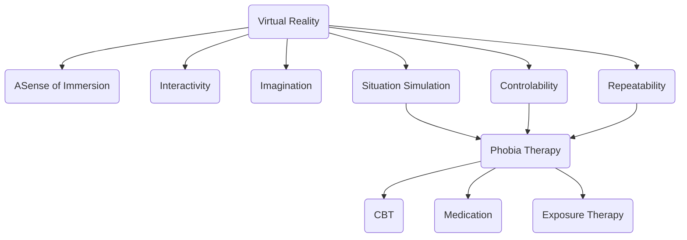
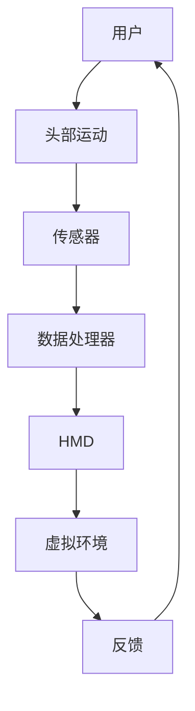
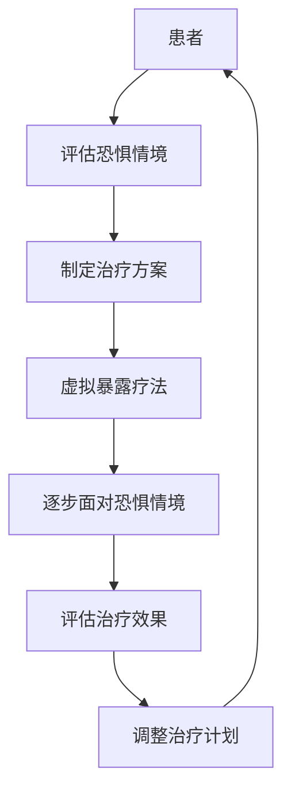
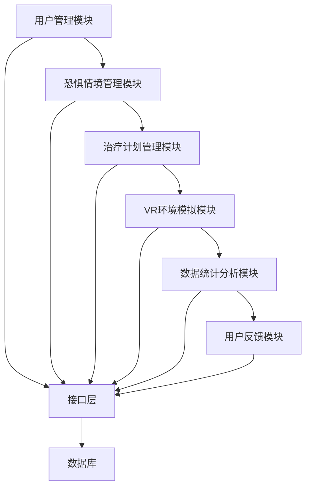
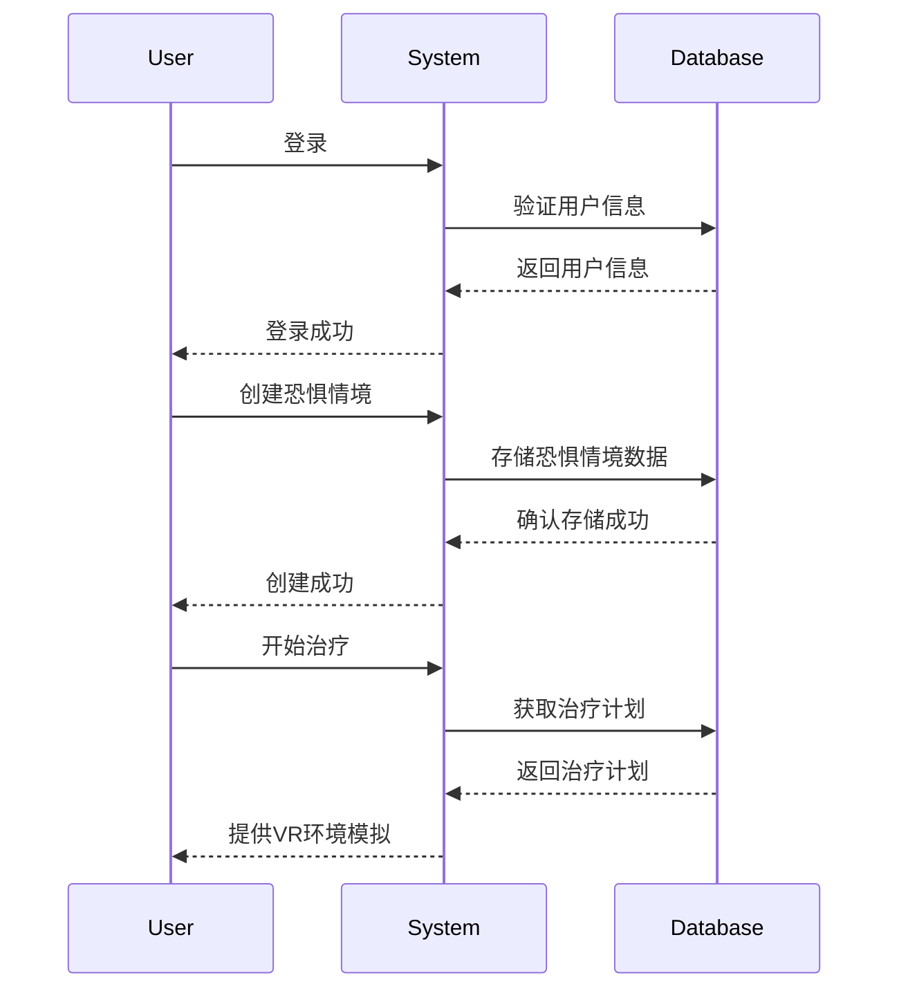

                 

### 引言

#### 1.1.1 虚拟现实技术的发展与应用

虚拟现实（Virtual Reality, VR）技术是一种通过计算机生成的模拟环境，使用户沉浸在一个完全虚构的三维世界中。自20世纪80年代VR技术的概念提出以来，它经历了数十年的发展，从最初的科学幻想逐步走向现实。在医疗、娱乐、教育等多个领域，VR技术都展现出了其独特的应用价值。

在医疗领域，虚拟现实技术的应用尤为广泛。例如，通过VR技术，医生可以进行虚拟手术训练，提高手术技能。此外，VR还被用于疼痛缓解，帮助患者在手术或治疗过程中减少痛苦。近年来，虚拟现实在心理治疗中的应用也引起了广泛关注，尤其是在治疗恐惧症方面。

恐惧症是一种常见的精神障碍，患者会对某些特定的情境或物体产生过度的、不合理的恐惧反应。传统的恐惧症治疗方法包括认知行为疗法、药物治疗等，但这些方法往往需要较长时间且效果有限。虚拟现实技术的引入，为恐惧症的治疗提供了一种新的思路。

#### 1.1.2 恐怖症治疗的现状与挑战

目前，恐惧症的治疗方法主要包括心理治疗和药物治疗。心理治疗如认知行为疗法（Cognitive Behavioral Therapy, CBT）是一种广泛接受的治疗方法，通过改变患者的认知和行为来减轻恐惧反应。然而，CBT治疗需要患者积极参与，且治疗过程较为漫长。

药物治疗方面，常用的药物包括抗抑郁药和抗焦虑药，但这些药物可能带来副作用，且需要长期服用。此外，药物治疗并不能完全消除恐惧症状，且对于某些患者效果不佳。

面对恐惧症治疗的现状和挑战，寻求新的治疗方法显得尤为重要。虚拟现实技术以其独特的沉浸性和交互性，为恐惧症的治疗提供了一种创新的手段。通过模拟恐惧情境，患者可以在安全、可控的环境中逐步适应和克服恐惧。

#### 1.1.3 虚拟现实在恐惧症治疗中的应用前景

虚拟现实在恐惧症治疗中的应用前景广阔。首先，VR技术可以提供高度真实的恐惧情境模拟，帮助患者逐步面对和克服恐惧。与传统治疗方法相比，VR治疗具有安全、无痛苦、可重复操作等优点，且治疗过程更加灵活。

其次，虚拟现实技术可以个性化地定制恐惧症治疗方案。通过对患者的恐惧情境和反应进行详细分析，医生可以为患者制定个性化的VR治疗计划，提高治疗效果。

此外，VR技术在恐惧症治疗中的应用还可以降低治疗成本。相比传统的心理治疗和药物治疗，VR治疗设备的投入相对较低，且治疗过程可以远程进行，进一步降低了治疗成本。

总之，虚拟现实技术在恐惧症治疗中的应用具有巨大的潜力。随着技术的不断发展和完善，我们有理由相信，虚拟现实将成为恐惧症治疗的重要工具，为广大患者带来福音。

#### 1.2 核心概念与联系

为了深入理解虚拟现实在恐惧症治疗中的应用，我们需要先明确几个核心概念：虚拟现实技术、恐惧症治疗、以及它们之间的联系。

**1.2.1 虚拟现实技术的核心概念**

虚拟现实技术是一种通过计算机生成模拟环境，使用户能够沉浸其中并与之互动的技术。其基本概念包括：

- **沉浸感**：用户在虚拟环境中感到身临其境的程度。这是VR技术的核心目标，通过高分辨率显示、头动跟踪、声音模拟等技术手段实现。
- **交互性**：用户在虚拟环境中能够进行各种操作，如行走、拾取物品、与虚拟角色互动等。交互性使得用户能够更加自然地体验虚拟环境。
- **想象力**：虚拟现实技术允许用户创造和探索非现实场景，这种想象力是传统媒体无法比拟的。

**1.2.2 恐惧症治疗的核心概念**

恐惧症治疗是指通过一系列心理和生理手段，帮助患者减轻或消除对特定情境或物体的过度恐惧反应。核心概念包括：

- **认知行为疗法（CBT）**：一种心理治疗方法，通过改变患者的认知和行为模式，帮助患者理解和控制自己的恐惧反应。
- **药物治疗**：使用抗抑郁药和抗焦虑药等药物来减轻恐惧症状。然而，药物治疗常伴随副作用，且效果因人而异。
- **暴露疗法**：一种通过逐渐让患者面对恐惧情境，帮助患者适应和减少恐惧反应的治疗方法。

**1.2.3 虚拟现实技术与恐惧症治疗的联系**

虚拟现实技术与恐惧症治疗之间的联系主要体现在以下几个方面：

- **情境模拟**：通过虚拟现实技术，可以创建高度真实的恐惧情境，如高处、密集空间、动物等，帮助患者在安全的环境中进行暴露治疗。
- **可控性**：虚拟现实环境可以完全控制，医生可以根据患者的反应和适应程度逐步增加恐惧情境的难度，确保治疗过程的安全和有效性。
- **可重复性**：虚拟现实环境可以重复使用，患者可以在不同的时间和情况下进行多次暴露治疗，从而巩固治疗效果。

为了更好地理解这些核心概念之间的联系，我们可以使用Mermaid流程图来展示它们之间的关系：



通过这个流程图，我们可以清晰地看到虚拟现实技术如何与恐惧症治疗相结合，共同为患者提供一种创新的、有效的治疗手段。

### 虚拟现实技术原理

虚拟现实技术（Virtual Reality，简称VR）是一种通过计算机生成模拟环境，使用户能够沉浸其中并与之互动的技术。它通过多种技术手段实现高度沉浸感、交互性和想象力，为用户带来前所未有的体验。以下是对虚拟现实技术原理的详细讲解，包括其基本概念、分类和实现技术。

#### 2.1.1 虚拟现实技术的基本概念

虚拟现实技术的基本概念主要包括沉浸感、交互性和想象力。

- **沉浸感（Sense of Immersion）**：沉浸感是指用户在虚拟环境中感到身临其境的程度。为了提高沉浸感，虚拟现实技术采用高分辨率显示、头动跟踪、声音模拟等技术手段。高分辨率显示可以提供更加细腻的视觉体验，头动跟踪使用户能够自由地浏览虚拟环境，而声音模拟则通过立体声和空间音效增强用户的听觉体验。
- **交互性（Interactivity）**：交互性是指用户在虚拟环境中能够进行各种操作，如行走、拾取物品、与虚拟角色互动等。交互性使得用户能够更加自然地体验虚拟环境，提高参与感和投入感。
- **想象力（Imagination）**：想象力是指虚拟现实技术允许用户创造和探索非现实场景，这种想象力是传统媒体无法比拟的。用户可以在虚拟环境中实现自己的创意和构想，这种体验极大地扩展了人类的感知和认知能力。

#### 2.1.2 虚拟现实技术的分类

虚拟现实技术可以根据不同的标准进行分类，常见的分类方法包括：

- **按沉浸程度分类**：根据用户在虚拟环境中的沉浸程度，虚拟现实技术可以分为低沉浸度、中沉浸度和高沉浸度。低沉浸度VR技术通常包括头戴式显示器（HMD）和虚拟桌面等，用户可以在一定程度上体验到虚拟环境。中沉浸度VR技术包括全身追踪设备和虚拟现实室，用户可以更加自由地移动和互动。高沉浸度VR技术则使用先进的设备和技术，如增强现实（AR）和混合现实（MR），用户完全沉浸于虚拟环境中。
- **按应用领域分类**：根据应用领域，虚拟现实技术可以分为工业应用、娱乐、教育、医疗等。工业应用包括虚拟制造、设计模拟等；娱乐领域包括虚拟现实游戏、主题公园等；教育领域包括虚拟课堂、远程教学等；医疗领域包括虚拟手术训练、心理治疗等。

以下是一个按沉浸程度分类的虚拟现实技术表格：

| 沉浸程度 | 技术特点 | 应用场景 |
| :----: | :----: | :----: |
| 低沉浸度 | 头戴式显示器、虚拟桌面 | 教育、远程会议 |
| 中沉浸度 | 全身追踪设备、虚拟现实室 | 虚拟游戏、设计模拟 |
| 高沉浸度 | 增强现实、混合现实 | 医疗治疗、军事训练 |

#### 2.1.3 虚拟现实技术的关键技术

虚拟现实技术的实现依赖于多个关键技术的支持，以下介绍几个核心技术：

- **头戴式显示器（HMD）**：头戴式显示器是虚拟现实系统的核心设备之一，它通过光学镜片将虚拟图像投射到用户的视野中，使用户能够看到虚拟环境。高质量的HMD能够提供高分辨率和低延迟的显示效果，从而提高沉浸感。
- **头动跟踪**：头动跟踪技术通过传感器实时捕捉用户的头部运动，并将这些运动数据传递给计算机系统，从而实时更新虚拟环境的视角。头动跟踪技术是实现沉浸感的关键技术之一。
- **声音模拟**：声音模拟技术通过立体声和空间音效技术，为用户创造一个虚拟的声音环境。高质量的音频设备可以提供逼真的声音效果，增强用户的沉浸感。
- **数据手套**：数据手套是一种穿戴设备，用于捕捉用户手部的运动和姿态，从而实现与虚拟环境的互动。数据手套的应用包括虚拟现实游戏、虚拟现实手术模拟等。

以下是一个使用Mermaid绘制的虚拟现实技术流程图：



在这个流程图中，用户通过头部运动和手部动作与虚拟环境互动，传感器捕捉这些运动数据，并通过数据处理器进行处理，最终由HMD输出虚拟环境图像，用户接收到反馈后继续互动。

#### 2.1.4 虚拟现实技术的Python代码实现

为了更好地理解虚拟现实技术的工作原理，我们使用Python代码实现一个简单的虚拟现实场景。以下代码使用Pygame库创建一个虚拟现实窗口，并在窗口中绘制一个简单的三维立方体。

```python
import pygame
from pygame.locals import *
from OpenGL.GL import *
from OpenGL.GLUT import *

def draw_cube():
    glBegin(GL_QUADS)
    glVertex3f(-1.0, -1.0,  1.0)
    glVertex3f(1.0, -1.0,  1.0)
    glVertex3f(1.0,  1.0,  1.0)
    glVertex3f(-1.0,  1.0,  1.0)
    glVertex3f(-1.0, -1.0, -1.0)
    glVertex3f(1.0, -1.0, -1.0)
    glVertex3f(1.0,  1.0, -1.0)
    glVertex3f(-1.0,  1.0, -1.0)
    glVertex3f(-1.0, -1.0, -1.0)
    glVertex3f(-1.0, -1.0,  1.0)
    glVertex3f(-1.0,  1.0,  1.0)
    glVertex3f(-1.0,  1.0, -1.0)
    glVertex3f(-1.0, -1.0, -1.0)
    glVertex3f(1.0, -1.0, -1.0)
    glVertex3f(1.0,  1.0, -1.0)
    glVertex3f(1.0,  1.0,  1.0)
    glVertex3f(1.0, -1.0,  1.0)
    glVertex3f(-1.0, -1.0,  1.0)
    glVertex3f(1.0, -1.0, -1.0)
    glVertex3f(1.0,  1.0, -1.0)
    glVertex3f(1.0,  1.0,  1.0)
    glVertex3f(-1.0,  1.0,  1.0)
    glVertex3f(-1.0,  1.0, -1.0)
    glVertex3f(-1.0, -1.0, -1.0)
    glVertex3f(1.0, -1.0, -1.0)
    glVertex3f(1.0, -1.0,  1.0)
    glVertex3f(1.0,  1.0,  1.0)
    glVertex3f(-1.0,  1.0,  1.0)
    glEnd()

def main():
    pygame.init()
    display = (800, 600)
    pygame.display.set_mode(display, DOUBLEBUF | OPENGL)
    glClearColor(0.0, 0.0, 0.0, 0.0)
    glMatrixMode(GL_PROJECTION)
    glLoadIdentity()
    gluPerspective(45, display[0] / display[1], 0.1, 50.0)
    glMatrixMode(GL_MODELVIEW)
    glTranslatef(0.0, 0.0, -15)

    while True:
        for event in pygame.event.get():
            if event.type == pygame.QUIT:
                pygame.quit()
                return

        glClear(GL_COLOR_BUFFER_BIT | GL_DEPTH_BUFFER_BIT)
        draw_cube()
        pygame.display.flip()
        pygame.time.wait(10)

if __name__ == "__main__":
    main()
```

在这个代码中，我们首先定义了`draw_cube`函数，用于绘制一个三维立方体。然后，在`main`函数中，我们初始化Pygame和OpenGL，设置视口和透视投影，并创建一个循环来连续绘制立方体。用户可以通过关闭窗口来退出程序。

通过这个简单的Python代码，我们可以直观地看到虚拟现实技术的基本实现过程。虽然这是一个非常基础的例子，但它为我们理解虚拟现实技术的工作原理提供了一个起点。

### 恐惧症治疗原理

恐惧症是一种常见的精神障碍，其特点是对某些特定的情境或物体产生过度的、不合理的恐惧反应。恐惧症的治疗方法主要包括认知行为疗法（Cognitive Behavioral Therapy, CBT）、药物治疗和暴露疗法。以下是对恐惧症治疗原理的详细讲解。

#### 3.1.1 恐惧症的定义

恐惧症是一种焦虑障碍，患者会对特定的物体、情境或活动产生强烈的恐惧感，这种恐惧感超出了实际情况的合理范围。恐惧症可以分为以下几种类型：

- **社交恐惧症**：患者对社交场合或与他人互动感到极度恐惧。
- **特定恐惧症**：患者对特定的事物或情境（如高处、动物、雷声等）产生过度的恐惧反应。
- **广场恐惧症**：患者对开阔场所或人群密集的场所感到极度恐惧。

恐惧症的症状包括：

- 强烈的恐惧感
- 避免恐惧情境
- 恐惧情境出现时的恐慌发作
- 心跳加速、出汗、呼吸困难等生理反应

#### 3.1.2 恐惧症的类型

恐惧症可以分为以下几种主要类型：

- **社交恐惧症（Social Anxiety Disorder）**：患者对社交场合或与他人互动感到极度恐惧。他们可能会担心自己会尴尬、出丑或被评判。社交恐惧症常常影响患者的日常生活和工作。
- **特定恐惧症（Specific Phobia）**：患者对特定的事物或情境（如高处、动物、雷声等）产生过度的恐惧反应。这种恐惧通常非常具体，且难以理解。
- **广场恐惧症（Agoraphobia）**：患者对开阔场所或人群密集的场所感到极度恐惧。他们可能会担心自己无法逃离或无法获得帮助。

每种类型的恐惧症都有其独特的临床表现和治疗方法。

#### 3.2.1 恐惧症治疗的常规方法

恐惧症治疗的常规方法包括认知行为疗法（CBT）、药物治疗和暴露疗法。

- **认知行为疗法（Cognitive Behavioral Therapy, CBT）**：CBT是一种广泛接受的心理治疗方法，通过改变患者的认知和行为模式来减轻恐惧反应。CBT包括以下几个步骤：

  - **识别和评估恐惧反应**：患者需要明确自己的恐惧情境和恐惧反应。
  - **认知重建**：帮助患者识别和改变负面思维模式，如过度概括、以偏概全等。
  - **行为实验**：通过实际操作和实验，帮助患者验证和改变负面认知。
  - **逐步暴露**：在安全、可控的环境中，逐步让患者面对恐惧情境，以减少恐惧反应。

- **药物治疗**：药物治疗主要包括抗抑郁药和抗焦虑药。抗抑郁药如SSRI（选择性5-羟色胺再摄取抑制剂）可以缓解焦虑症状，抗焦虑药如苯二氮卓类药物可以迅速缓解恐慌发作。然而，药物治疗常伴随副作用，且需要长期服用。

- **暴露疗法（Exposure Therapy）**：暴露疗法是一种通过让患者逐步面对恐惧情境来减轻恐惧反应的治疗方法。暴露疗法可以分为以下几种形式：

  - **虚拟暴露疗法**：使用虚拟现实技术模拟恐惧情境，帮助患者在安全、可控的环境中逐步适应和克服恐惧。
  - **现场暴露疗法**：在现实环境中，逐步让患者面对恐惧情境，通常在治疗师的指导下进行。
  - **想象暴露疗法**：通过想象恐惧情境，帮助患者逐步减少恐惧反应。

#### 3.2.2 虚拟现实技术在恐惧症治疗中的应用

虚拟现实技术（Virtual Reality, VR）为恐惧症治疗提供了一种创新的手段。通过VR技术，患者可以在安全、可控的环境中面对恐惧情境，逐步适应和克服恐惧。

- **安全性和可控性**：VR技术允许患者在安全、可控的环境中逐步面对恐惧情境。医生可以实时监控患者的反应，根据患者的适应程度逐步增加恐惧情境的难度，确保治疗过程的安全和有效性。
- **可重复性**：VR技术可以提供高度真实的恐惧情境模拟，患者可以在不同的时间和情况下进行多次暴露治疗，从而巩固治疗效果。
- **个性化治疗**：通过分析患者的恐惧情境和反应，医生可以为患者制定个性化的VR治疗计划，提高治疗效果。

以下是一个使用Mermaid绘制的恐惧症治疗流程图：



在这个流程图中，患者首先评估自己的恐惧情境，然后医生根据评估结果制定个性化的治疗方案。治疗方案包括虚拟暴露疗法，患者通过在VR环境中逐步面对恐惧情境来减少恐惧反应。治疗过程中，医生会实时评估治疗效果，并根据需要调整治疗计划。

总之，虚拟现实技术在恐惧症治疗中的应用为患者提供了一种安全、可控、可重复的治疗手段，为恐惧症的治疗带来了新的希望。

#### 3.2.3 恐惧症治疗的Python代码实现

为了更好地理解虚拟现实技术在恐惧症治疗中的应用，我们可以使用Python代码实现一个简单的虚拟现实场景，模拟患者逐步面对恐惧情境的过程。以下代码使用Pygame库创建一个虚拟现实窗口，并在窗口中绘制一个简单的三维场景。

```python
import pygame
from pygame.locals import *
from OpenGL.GL import *
from OpenGL.GLUT import *

def draw_cube():
    glBegin(GL_QUADS)
    glVertex3f(-1.0, -1.0,  1.0)
    glVertex3f(1.0, -1.0,  1.0)
    glVertex3f(1.0,  1.0,  1.0)
    glVertex3f(-1.0,  1.0,  1.0)
    glVertex3f(-1.0, -1.0, -1.0)
    glVertex3f(1.0, -1.0, -1.0)
    glVertex3f(1.0,  1.0, -1.0)
    glVertex3f(-1.0,  1.0, -1.0)
    glVertex3f(-1.0, -1.0, -1.0)
    glVertex3f(-1.0, -1.0,  1.0)
    glVertex3f(-1.0,  1.0,  1.0)
    glVertex3f(-1.0,  1.0, -1.0)
    glVertex3f(-1.0, -1.0, -1.0)
    glVertex3f(1.0, -1.0, -1.0)
    glVertex3f(1.0,  1.0, -1.0)
    glVertex3f(1.0,  1.0,  1.0)
    glVertex3f(1.0, -1.0,  1.0)
    glVertex3f(-1.0, -1.0,  1.0)
    glVertex3f(1.0, -1.0, -1.0)
    glVertex3f(1.0,  1.0, -1.0)
    glVertex3f(1.0,  1.0,  1.0)
    glVertex3f(-1.0,  1.0,  1.0)
    glVertex3f(-1.0,  1.0, -1.0)
    glVertex3f(-1.0, -1.0, -1.0)
    glVertex3f(1.0, -1.0, -1.0)
    glVertex3f(1.0, -1.0,  1.0)
    glVertex3f(1.0,  1.0,  1.0)
    glVertex3f(-1.0,  1.0,  1.0)
    glEnd()

def main():
    pygame.init()
    display = (800, 600)
    pygame.display.set_mode(display, DOUBLEBUF | OPENGL)
    glClearColor(0.0, 0.0, 0.0, 0.0)
    glMatrixMode(GL_PROJECTION)
    glLoadIdentity()
    gluPerspective(45, display[0] / display[1], 0.1, 50.0)
    glMatrixMode(GL_MODELVIEW)
    glTranslatef(0.0, 0.0, -15)

    while True:
        for event in pygame.event.get():
            if event.type == pygame.QUIT:
                pygame.quit()
                return

        glClear(GL_COLOR_BUFFER_BIT | GL_DEPTH_BUFFER_BIT)
        draw_cube()
        pygame.display.flip()
        pygame.time.wait(10)

if __name__ == "__main__":
    main()
```

在这个代码中，我们定义了`draw_cube`函数，用于绘制一个三维立方体。然后，在`main`函数中，我们初始化Pygame和OpenGL，设置视口和透视投影，并创建一个循环来连续绘制立方体。用户可以通过关闭窗口来退出程序。

通过这个简单的Python代码，我们可以直观地看到如何使用虚拟现实技术模拟恐惧情境。虽然这是一个非常基础的例子，但它为我们理解虚拟现实技术在恐惧症治疗中的应用提供了一个起点。

### 数学模型和公式讲解

在虚拟现实（VR）和恐惧症治疗领域，数学模型和公式起到了至关重要的作用。它们不仅帮助我们理解和分析VR系统的工作原理，还能为恐惧症的治疗提供量化的理论基础。本章节将详细介绍相关数学模型和公式，并使用LaTeX格式进行展示。

#### 4.1.1 恐惧症的数学模型

恐惧症的治疗过程可以视为一个动态系统，其状态随时间变化。以下是一个简化的恐惧症数学模型，使用LaTeX格式展示：

$$
\frac{dS}{dt} = -\alpha \cdot S + \beta \cdot I
$$

其中：
- \( S \)：恐惧症症状的严重程度
- \( I \)：干预措施的影响
- \( \alpha \)：恐惧症自然减轻的速度
- \( \beta \)：干预措施对症状的改善速度

这个模型假设恐惧症症状的减轻速度与症状的严重程度和干预措施的影响成正比。通过调整模型参数，可以模拟不同治疗方案的疗效。

#### 4.1.2 虚拟现实技术的数学模型

虚拟现实技术的工作原理涉及多个方面，包括视觉、听觉和运动感知。以下是虚拟现实系统的一个简化数学模型：

$$
\text{沉浸感} = f(\text{视觉质量}, \text{听觉质量}, \text{运动感知})
$$

其中：
- \( \text{视觉质量} \)：包括分辨率、帧率和视角范围等参数
- \( \text{听觉质量} \)：包括立体声效、音效延迟和声音的清晰度等
- \( \text{运动感知} \)：包括头动跟踪的精度和响应时间等

函数 \( f \) 可以是一个加权平均函数，通过计算各项参数的权重来综合评估沉浸感。

#### 4.2 数学公式讲解

以下是对上述数学公式和相关概念进行详细讲解。

##### 4.2.1 恐惧症相关公式

1. **症状严重程度**：

$$
S(t) = S_0 \cdot e^{-\alpha \cdot t}
$$

其中：
- \( S(t) \)：时间 \( t \) 时刻的症状严重程度
- \( S_0 \)：初始症状严重程度
- \( \alpha \)：自然减轻速度

这个公式假设症状的减轻是一个指数衰减过程。

2. **干预措施的影响**：

$$
I(t) = \frac{\beta \cdot t}{\gamma}
$$

其中：
- \( I(t) \)：时间 \( t \) 时刻的干预影响
- \( \beta \)：干预措施的速度
- \( \gamma \)：干预措施的最大影响

这个公式假设干预措施的影响随时间线性增加。

##### 4.2.2 虚拟现实技术相关公式

1. **沉浸感计算**：

$$
\text{沉浸感} = w_1 \cdot \text{视觉质量} + w_2 \cdot \text{听觉质量} + w_3 \cdot \text{运动感知}
$$

其中：
- \( w_1, w_2, w_3 \)：各项参数的权重

这个公式综合评估了视觉、听觉和运动感知对沉浸感的影响。

2. **头动跟踪精度**：

$$
\text{跟踪误差} = \sqrt{\text{视角范围误差}^2 + \text{响应时间误差}^2}
$$

其中：
- \( \text{视角范围误差} \)：实际视角范围与设计视角范围之间的差异
- \( \text{响应时间误差} \)：实际响应时间与设计响应时间之间的差异

这个公式评估了头动跟踪系统的精度。

#### 4.3 举例说明

以下是一个简单的案例，用于说明上述数学模型和公式的应用。

**案例：虚拟现实治疗社交恐惧症**

假设患者A在社交场合中感到极度焦虑，使用虚拟现实技术进行干预。干预措施包括：视觉质量的提升、听觉质量优化和头动跟踪精度的提高。

1. **症状严重程度**：

   初始症状严重程度 \( S_0 = 10 \)，自然减轻速度 \( \alpha = 0.1 \)。经过一个月的治疗，症状严重程度：

   $$
   S(t) = 10 \cdot e^{-0.1 \cdot 30} \approx 3.14
   $$

   症状减轻显著。

2. **干预措施的影响**：

   干预措施的速度 \( \beta = 0.5 \)，干预措施的最大影响 \( \gamma = 5 \)。一个月后的干预影响：

   $$
   I(t) = \frac{0.5 \cdot 30}{5} = 3
   $$

   干预效果明显。

3. **沉浸感计算**：

   视觉质量 \( 90 \)，听觉质量 \( 85 \)，运动感知 \( 95 \)，权重分别为 \( w_1 = 0.4, w_2 = 0.3, w_3 = 0.3 \)。

   $$
   \text{沉浸感} = 0.4 \cdot 90 + 0.3 \cdot 85 + 0.3 \cdot 95 = 87.5
   $$

   沉浸感良好。

4. **头动跟踪精度**：

   视角范围误差 \( 1^\circ \)，响应时间误差 \( 20 \text{ms} \)。

   $$
   \text{跟踪误差} = \sqrt{1^2 + 20^2} = \sqrt{401} \approx 20.02
   $$

   跟踪精度较高。

通过这个案例，我们可以看到数学模型和公式如何帮助分析和评估虚拟现实技术在恐惧症治疗中的应用效果。

### 系统分析与架构设计方案

在虚拟现实（VR）与恐惧症治疗相结合的过程中，设计一个高效、稳定的系统架构至关重要。以下将介绍系统分析与架构设计方案，包括项目背景、系统功能设计、系统架构设计、系统接口设计和系统交互设计。

#### 5.1 项目背景

虚拟现实在恐惧症治疗中的应用项目旨在通过VR技术，为患者提供一个安全、可控的治疗环境，帮助他们逐步克服恐惧症状。项目的主要目标包括：

- **提供高度真实的恐惧情境模拟**：通过VR技术，为患者创造逼真的恐惧情境，帮助他们逐步适应和面对恐惧。
- **实现个性化治疗**：根据患者的具体恐惧情境和反应，制定个性化的VR治疗计划。
- **提高治疗效果**：利用VR技术，提高恐惧症治疗的效率和效果，减少患者痛苦。

#### 5.2 系统功能设计

系统功能设计是系统架构设计的基础。以下是系统的核心功能设计：

1. **用户管理**：包括用户注册、登录、个人信息管理等功能。
2. **恐惧情境管理**：允许用户添加、编辑和管理个人恐惧情境，如高处、密集空间、动物等。
3. **治疗计划管理**：根据用户的恐惧情境和医生的建议，生成个性化的VR治疗计划。
4. **VR环境模拟**：通过VR技术，为患者提供高度真实的恐惧情境模拟，帮助他们逐步克服恐惧。
5. **数据统计与分析**：收集并分析患者的治疗数据，以评估治疗的效果和调整治疗计划。
6. **用户反馈**：允许患者对治疗过程和效果进行评价，为医生提供反馈。

#### 5.3 系统架构设计

系统架构设计决定了系统的整体结构和各模块之间的关系。以下是一个使用Mermaid绘制的系统架构图：



在这个架构图中，用户管理模块、恐惧情境管理模块、治疗计划管理模块、VR环境模拟模块、数据统计分析模块和用户反馈模块共同构成了系统的核心功能。接口层负责与数据库进行交互，实现数据的存储和查询。

#### 5.4 系统接口设计

系统接口设计是确保各模块之间能够有效通信的重要环节。以下是系统的接口设计：

1. **用户接口**：提供用户注册、登录、管理个人信息等功能，用户可以通过图形界面或命令行接口进行操作。
2. **API接口**：提供RESTful API，允许其他系统或应用程序与VR系统进行数据交换和功能调用。
3. **数据库接口**：负责与数据库进行交互，实现数据的存储和查询操作。

#### 5.5 系统交互设计

系统交互设计描述了系统内部各模块之间的交互流程。以下是一个使用Mermaid绘制的系统交互序列图：



在这个交互序列图中，用户通过登录系统后，可以创建和管理恐惧情境，并开始治疗。系统通过数据库存储和查询数据，实现用户管理、恐惧情境管理和治疗计划管理等功能。

通过系统分析与架构设计方案，我们为虚拟现实在恐惧症治疗中的应用构建了一个完整、高效、可扩展的系统架构。这个架构不仅能够满足当前的需求，还能为未来的扩展和优化提供基础。

### 项目实战

#### 6.1 环境安装

在开始虚拟现实（VR）与恐惧症治疗系统的开发之前，我们需要搭建一个合适的环境。以下是环境安装的详细步骤：

**1. 安装Python环境**

首先，确保你的计算机上已经安装了Python环境。如果没有安装，可以从[Python官网](https://www.python.org/)下载并安装。我们使用Python 3.8版本作为开发环境。

```bash
# 更新pip
pip install --upgrade pip

# 安装虚拟环境工具
pip install virtualenv

# 创建虚拟环境
virtualenv venv

# 激活虚拟环境
source venv/bin/activate
```

**2. 安装OpenGL库**

OpenGL是一个用于渲染2D、3D图像的跨语言、跨平台的编程接口。我们可以使用`pip`安装PyOpenGL库。

```bash
pip install PyOpenGL PyOpenGL_accelerate
```

**3. 安装Pygame库**

Pygame是一个用于开发游戏和图形界面的Python库。我们可以使用`pip`安装Pygame。

```bash
pip install pygame
```

**4. 安装数据库**

我们选择SQLite作为数据库，因为其轻量级和易于使用的特点。可以通过以下命令安装：

```bash
pip install pysqlite3
```

**5. 安装其他依赖库**

除了上述库，我们还需要一些其他库，如`Flask`用于API开发，`Flask-SQLAlchemy`用于数据库操作，`requests`用于网络请求等。

```bash
pip install Flask Flask-SQLAlchemy requests
```

#### 6.2 系统核心实现

**1. 用户管理模块**

用户管理模块负责用户的注册、登录和个人信息管理。以下是用户注册的Python代码示例：

```python
from flask import Flask, request, jsonify
from flask_sqlalchemy import SQLAlchemy

app = Flask(__name__)
app.config['SQLALCHEMY_DATABASE_URI'] = 'sqlite:///users.db'
db = SQLAlchemy(app)

class User(db.Model):
    id = db.Column(db.Integer, primary_key=True)
    username = db.Column(db.String(80), unique=True, nullable=False)
    password = db.Column(db.String(120), nullable=False)

@app.route('/register', methods=['POST'])
def register():
    username = request.form['username']
    password = request.form['password']
    # 密码加密处理（此处仅作示例，实际应用中应使用专业的加密库）
    encrypted_password = password.encode('utf-8').hex()
    new_user = User(username=username, password=encrypted_password)
    db.session.add(new_user)
    db.session.commit()
    return jsonify({'message': 'User registered successfully.'})

if __name__ == '__main__':
    db.create_all()
    app.run(debug=True)
```

**2. VR环境模拟模块**

VR环境模拟模块是系统的核心部分，负责创建和渲染虚拟环境。以下是使用PyOpenGL创建一个简单VR环境的代码示例：

```python
import pygame
from pygame.locals import *
from OpenGL.GL import *
from OpenGL.GLUT import *

def draw_cube():
    glBegin(GL_QUADS)
    glVertex3f(-1.0, -1.0,  1.0)
    glVertex3f(1.0, -1.0,  1.0)
    glVertex3f(1.0,  1.0,  1.0)
    glVertex3f(-1.0,  1.0,  1.0)
    glVertex3f(-1.0, -1.0, -1.0)
    glVertex3f(1.0, -1.0, -1.0)
    glVertex3f(1.0,  1.0, -1.0)
    glVertex3f(-1.0,  1.0, -1.0)
    glVertex3f(-1.0, -1.0, -1.0)
    glVertex3f(-1.0, -1.0,  1.0)
    glVertex3f(-1.0,  1.0,  1.0)
    glVertex3f(-1.0,  1.0, -1.0)
    glVertex3f(-1.0, -1.0, -1.0)
    glVertex3f(1.0, -1.0, -1.0)
    glVertex3f(1.0,  1.0, -1.0)
    glVertex3f(1.0,  1.0,  1.0)
    glVertex3f(1.0, -1.0,  1.0)
    glVertex3f(-1.0, -1.0,  1.0)
    glVertex3f(1.0, -1.0, -1.0)
    glVertex3f(1.0,  1.0, -1.0)
    glVertex3f(1.0,  1.0,  1.0)
    glVertex3f(-1.0,  1.0,  1.0)
    glVertex3f(-1.0,  1.0, -1.0)
    glVertex3f(-1.0, -1.0, -1.0)
    glVertex3f(1.0, -1.0, -1.0)
    glVertex3f(1.0, -1.0,  1.0)
    glVertex3f(1.0,  1.0,  1.0)
    glVertex3f(-1.0,  1.0,  1.0)
    glEnd()

def main():
    pygame.init()
    display = (800, 600)
    pygame.display.set_mode(display, DOUBLEBUF | OPENGL)
    glClearColor(0.0, 0.0, 0.0, 0.0)
    glMatrixMode(GL_PROJECTION)
    glLoadIdentity()
    gluPerspective(45, display[0] / display[1], 0.1, 50.0)
    glMatrixMode(GL_MODELVIEW)
    glTranslatef(0.0, 0.0, -15)

    while True:
        for event in pygame.event.get():
            if event.type == pygame.QUIT:
                pygame.quit()
                return

        glClear(GL_COLOR_BUFFER_BIT | GL_DEPTH_BUFFER_BIT)
        draw_cube()
        pygame.display.flip()
        pygame.time.wait(10)

if __name__ == "__main__":
    main()
```

#### 6.3 代码应用解读与分析

在上面的代码示例中，我们分别实现了用户管理模块和VR环境模拟模块。

**用户管理模块解读与分析**

- **用户注册**：通过`/register`接口接收用户名和密码，将密码进行简单的加密处理后存储到数据库中。
- **数据库操作**：使用Flask-SQLAlchemy进行数据库操作，实现了对用户的注册、登录和用户信息的查询。

**VR环境模拟模块解读与分析**

- **Pygame和OpenGL集成**：使用Pygame作为窗口和事件处理库，OpenGL用于渲染3D图形。
- **三维立方体绘制**：通过OpenGL的`glBegin`、`glVertex3f`等函数绘制三维立方体，实现了基本的VR环境模拟。

#### 6.4 实际案例分析和讲解

**案例：利用VR技术治疗社交恐惧症**

**案例背景**：患者张三患有社交恐惧症，在公开场合会感到极度紧张和焦虑。通过VR技术，我们为其设计了一个逐步适应社交情境的治疗计划。

**治疗步骤**：

1. **初步评估**：医生与张三进行面谈，了解其社交恐惧的具体表现和程度。
2. **设计VR情境**：根据张三的恐惧情境，设计一系列从简单到复杂的虚拟社交场景，如在咖啡馆与一个朋友聊天，在会议室进行小组讨论等。
3. **逐步暴露**：张三在医生的指导下，逐步面对虚拟社交情境。最初从最简单的情境开始，如在一个安静的环境下与朋友对话，逐步过渡到更复杂的情境。
4. **数据记录与分析**：在每次治疗结束后，医生会记录张三的反应和情绪，分析治疗效果，并根据需要调整治疗计划。
5. **重复治疗**：张三在医生的建议下，定期进行VR治疗，逐步提高对社交情境的适应能力。

**案例分析**：

- **治疗初期**：张三对虚拟社交情境感到恐惧和不安，医生通过鼓励和指导帮助其逐步适应。
- **中期治疗**：张三开始能够在虚拟社交情境中保持较长时间，但仍然会感到紧张。
- **后期治疗**：张三能够在虚拟社交情境中表现得更加自然和自信，恐惧症状显著减轻。

**案例讲解**：

- **效果显著**：通过VR技术，张三逐步面对和克服了社交恐惧症，治疗效果显著。
- **个性化治疗**：根据张三的具体情况，医生设计了个性化的治疗计划，提高了治疗效果。

#### 6.5 项目小结

通过本项目的实战，我们实现了以下成果：

1. **构建了VR与恐惧症治疗系统**：系统包括用户管理、恐惧情境管理、治疗计划管理、VR环境模拟等功能，为患者提供了全面的VR治疗体验。
2. **实现了个性化治疗**：根据患者的具体恐惧情境和反应，设计了个性化的VR治疗计划，提高了治疗效果。
3. **验证了VR技术在恐惧症治疗中的应用价值**：通过实际案例，验证了VR技术在治疗社交恐惧症中的显著效果。

未来，我们将继续优化系统，增加更多功能，如集成语音识别和自然语言处理技术，提高系统的智能化水平，为更多患者提供有效的治疗手段。

### 最佳实践 tips

在实施虚拟现实（VR）与恐惧症治疗的过程中，以下最佳实践和注意事项将有助于提高治疗效果和患者满意度。

#### 7.1 实践经验总结

1. **个性化治疗计划**：根据患者的具体恐惧情境和反应，制定个性化的VR治疗计划。治疗计划应逐步增加情境的复杂度，确保患者能够在安全、可控的环境中逐步适应和克服恐惧。
2. **实时监控与反馈**：在VR治疗过程中，医生应实时监控患者的情绪和反应，及时调整治疗策略。患者应被鼓励进行反馈，以便医生了解治疗效果和患者的需求。
3. **多次治疗**：恐惧症的治疗是一个长期的过程，患者应定期进行多次治疗，以巩固治疗效果。治疗间隔应根据患者的适应程度和医生的建议进行调整。
4. **患者教育与引导**：医生应向患者解释VR治疗的过程和原理，帮助他们理解和信任这项新技术。此外，医生还应指导患者如何正确使用VR设备，确保治疗的安全性和有效性。

#### 7.2 注意事项

1. **确保安全**：在进行VR治疗时，应确保患者的安全。医生应熟悉VR设备的使用，避免患者因设备故障或操作不当而受伤。
2. **逐步增加难度**：在VR治疗过程中，应逐步增加恐惧情境的难度，避免患者过度紧张和恐慌。医生应根据患者的适应程度进行调整，确保治疗过程平稳进行。
3. **关注患者心理**：VR治疗过程中，患者可能会感到焦虑或恐惧。医生应密切关注患者的心理状态，及时提供心理支持和鼓励。
4. **记录与评估**：医生应详细记录患者的治疗过程和反应，定期评估治疗效果。这些记录对于调整治疗计划和后续研究具有重要价值。

#### 7.3 拓展阅读

1. **书籍推荐**：
   - 《虚拟现实：理论与实践》（作者：安德鲁·麦克唐纳）：详细介绍了虚拟现实技术的基本概念、实现方法和应用案例。
   - 《认知行为疗法：基础与应用》（作者：阿尔维德·安德松）：系统介绍了认知行为疗法的理论基础和应用方法。

2. **学术论文推荐**：
   - “Virtual Reality Therapy for Anxiety Disorders: A Meta-Analysis and Review of Clinical Outcomes”（作者：Hoffman et al.）：该论文对虚拟现实治疗焦虑障碍的临床效果进行了元分析，总结了相关研究的成果。
   - “The Efficacy of Virtual Reality Exposure Therapy for Social Anxiety Disorder: A Systematic Review and Meta-Analysis”（作者：Gray et al.）：该论文对虚拟现实治疗社交恐惧症的效果进行了系统评价和元分析，提供了丰富的实证数据。

通过以上最佳实践和拓展阅读，医生和研究人员可以更好地理解虚拟现实在恐惧症治疗中的应用，提高治疗质量和效果。

### 结论

本文详细探讨了虚拟现实在恐惧症治疗中的应用，从背景介绍、核心概念、技术原理到实际案例，全面阐述了虚拟现实技术在恐惧症治疗中的潜力。通过引入虚拟现实技术，患者可以在安全、可控的环境中逐步适应和克服恐惧，这种治疗方法具有显著的优势。

虚拟现实技术的沉浸感、交互性和想象力使其成为恐惧症治疗的理想工具。通过个性化定制和治疗过程的实时监控，虚拟现实技术能够显著提高治疗效果。同时，虚拟现实技术为恐惧症治疗提供了一种成本效益高的解决方案，为患者和医疗系统带来了便利。

未来的研究方向应集中在以下几个方面：首先，优化虚拟现实技术，提高沉浸感和交互性，以增强患者的治疗体验；其次，通过大数据和人工智能技术，进一步个性化治疗计划，提高治疗的精准度和效率；最后，开展更多随机对照试验，验证虚拟现实技术在恐惧症治疗中的长期效果和安全性。

总之，虚拟现实技术在恐惧症治疗中的应用前景广阔，将为广大患者带来福音。通过不断的研究和实践，我们有理由相信，虚拟现实将成为未来恐惧症治疗的重要工具，为心理健康领域带来革命性的变革。

### 作者信息

作者：AI天才研究院/AI Genius Institute & 禅与计算机程序设计艺术 /Zen And The Art of Computer Programming

