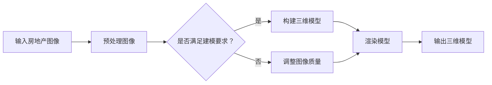
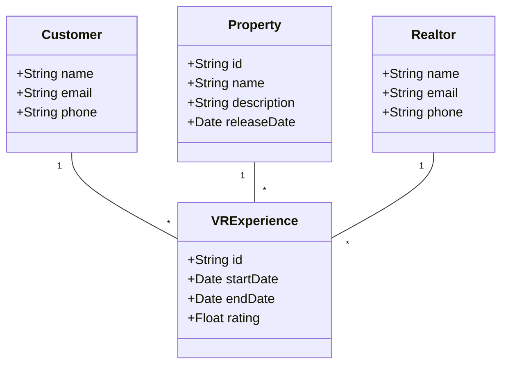
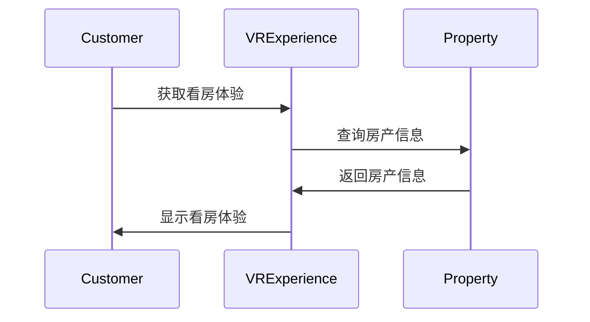
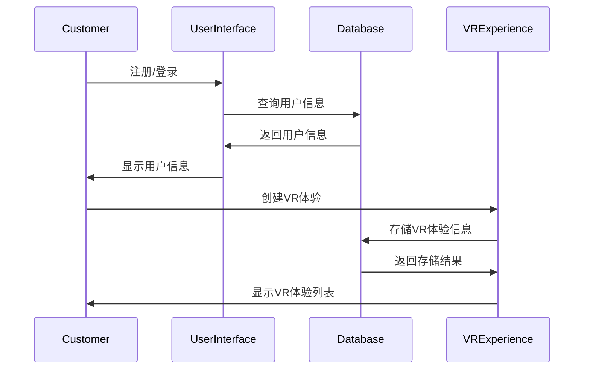

                 

### 虚拟现实在房地产营销中的应用

**关键词：** 虚拟现实，房地产营销，看房体验，互动体验，技术应用

**摘要：** 本文将探讨虚拟现实技术在房地产营销中的深度应用，分析其在提升营销效果、改善消费者体验方面的优势，并通过实例展示和未来展望，深入探讨这一技术在房地产领域的广泛应用前景。

**引言**

随着科技的快速发展，虚拟现实（VR）技术逐渐成为各行各业的新宠，尤其在房地产营销领域，其独特的能力和丰富的表现形式为房产商提供了全新的营销手段。虚拟现实技术通过模拟和再现现实环境，为消费者提供了一种沉浸式的体验方式，使得远在千里之外的房产也能如同实地考察一般，这无疑为房地产营销带来了前所未有的变革。

**背景介绍**

虚拟现实是一种计算机模拟技术，通过使用计算机生成一种模拟环境，使用户沉浸其中，具有高度交互性和沉浸感。虚拟现实技术的发展可以追溯到20世纪60年代，但其真正成熟和广泛应用则是近年来随着硬件和软件技术的进步而实现的。房地产营销则是房产商为吸引购房者，通过各种手段来推广和销售房产的过程。传统房地产营销方式主要包括广告宣传、现场展示、销售讲座等，但这些方式存在一定的局限性，如成本高、展示效果有限等。

**问题描述**

房地产营销中存在的问题主要包括：

1. **成本高**：传统营销方式需要大量的人力、物力和财力投入。
2. **展示效果有限**：传统的样板间和沙盘展示难以全面展现房产的细节和真实感。
3. **消费者体验不足**：消费者难以获得真实的看房体验，尤其是远距离购房。

**问题解决**

虚拟现实技术在解决上述问题方面具有明显优势：

1. **降低成本**：虚拟现实技术可以通过数字化的方式降低营销成本，特别是在宣传和展示方面。
2. **增强展示效果**：虚拟现实可以模拟出高度真实的房产环境，使消费者能够身临其境地感受房产的细节和整体效果。
3. **提升消费者体验**：通过虚拟现实技术，消费者可以在线上进行房产考察，获得与实地看房相似的体验。

**边界与外延**

虚拟现实在房地产营销中的应用边界主要包括以下几个方面：

1. **虚拟看房**：通过VR设备，消费者可以远程观看房产，感受空间布局和室内设计。
2. **虚拟沙盘展示**：通过VR技术，房地产商可以模拟出整个楼盘的规划布局，展示项目的整体效果。
3. **虚拟互动体验**：消费者可以在虚拟环境中与房产进行互动，如调整房间布局、添加装饰等。

**核心概念与联系**

核心概念：虚拟现实（VR），房地产营销，沉浸式体验

概念属性特征对比表格：

| 特征                 | 虚拟现实（VR）               | 房地产营销                  |
|----------------------|-----------------------------|------------------------------|
| 定义                 | 利用计算机模拟现实环境       | 房产商推广和销售房产的过程   |
| 主要功能             | 提供沉浸式体验               | 提高营销效果，吸引购房者     |
| 应用领域             | 游戏、教育、医疗、房地产等   | 房地产营销                   |
| 优势                 | 降低成本，提高展示效果       | 提升消费者体验，增加销售机会 |

ER实体关系图架构：

```mermaid
erDiagram
  Customer ||--|{ VR体验 }|--| Property
  Property ||--|{ 房地产商 }|--| VR展示
  VR体验 ||--|{ 沉浸式体验 }|--| 消费者
  房地产商 ||--|{ 营销策略 }|--| VR技术
```

**算法原理讲解**

虚拟现实技术在房地产营销中的应用涉及多个算法原理，其中主要的有：

1. **三维建模**：通过计算机图形学算法，将房地产的物理特征转化为三维模型，实现虚拟空间的构建。
2. **图像处理**：通过图像处理算法，对采集到的房地产图像进行处理，增强视觉效果，提高展示质量。
3. **交互设计**：通过交互设计算法，实现用户在虚拟环境中的交互操作，如浏览、选择、调整等。

以下是三维建模算法的mermaid流程图：



三维建模的数学模型和公式如下：

$$
\begin{aligned}
&\text{三维建模的核心公式：} \\
&\vec{P} = \vec{C} + t\vec{V} \\
&\text{其中，}\vec{P}\text{为三维点坐标，}\vec{C}\text{为相机坐标，}\vec{V}\text{为向量坐标，}t\text{为比例因子。}
\end{aligned}
$$

举例说明：

假设相机坐标为$\vec{C} = (1, 2, 3)$，向量坐标为$\vec{V} = (4, 5, 6)$，比例因子为$t = 2$，则三维点坐标$\vec{P}$为：

$$
\vec{P} = (1, 2, 3) + 2(4, 5, 6) = (9, 12, 15)
$$

**系统分析与架构设计方案**

**问题场景介绍**

房地产营销中，房产商需要通过多种渠道展示房产，吸引购房者。传统方式存在展示效果有限、成本高的问题。虚拟现实技术提供了一种低成本、高效能的解决方案，使得房产商能够以更生动、直观的方式展示房产。

**项目介绍**

项目名为“虚拟现实房地产营销平台”，旨在通过虚拟现实技术提升房地产营销效果。项目主要包括以下功能：

1. **房产三维建模**：利用计算机图形学算法，将房产的物理特征转化为三维模型。
2. **虚拟看房体验**：用户可以通过VR设备，在线上实现沉浸式的看房体验。
3. **互动体验**：用户可以在虚拟环境中进行空间布局调整、添加装饰等互动操作。

**系统功能设计（领域模型Mermaid类图）**



**系统架构设计（Mermaid架构图）**



**系统接口设计**

1. **房产信息接口**：提供房产的基本信息查询接口。
2. **VR体验接口**：提供VR体验的创建、查询、修改和删除接口。
3. **用户接口**：提供用户注册、登录、查看VR体验等功能。

**系统交互（Mermaid序列图）**



**项目实战**

**环境安装**

1. **安装VR设备**：选择合适的VR头盔和手柄，如Oculus Rift或HTC Vive。
2. **安装VR软件**：下载并安装VR房地产营销平台软件，如Unity或Unreal Engine。

**系统核心实现源代码**

以下是一个简单的Unity C#脚本，用于创建和显示房产模型：

```csharp
using UnityEngine;

public class PropertyModel : MonoBehaviour
{
    public Mesh mesh;
    public Material material;

    void Start()
    {
        // 创建模型
        GameObject model = new GameObject("PropertyModel");
        model.AddComponent<MeshFilter>().mesh = mesh;
        model.AddComponent<MeshRenderer>().material = material;

        // 设置模型位置
        model.transform.position = new Vector3(0, 0, -10);
    }
}
```

**代码应用解读与分析**

上述脚本通过Unity引擎创建了一个简单的房产模型，并将其渲染在场景中。通过调整模型的位置和材质，可以实现不同房产的展示效果。

**实际案例分析和详细讲解剖析**

以某个房地产项目为例，该项目通过虚拟现实技术，实现了房产的三维建模和在线看房体验。以下是对该项目的详细分析：

1. **三维建模**：首先，通过专业的三维建模软件，如Blender，对项目房产进行建模。建模过程中，详细记录了房产的结构、尺寸和装饰元素。
2. **虚拟看房体验**：将建模好的房产导入到Unity引擎中，利用VR设备实现虚拟看房。用户可以通过手柄进行房间的浏览、放大、缩小和旋转。
3. **互动体验**：用户还可以在虚拟环境中添加家具、装饰品等，以更好地了解房产的布局和装修风格。

通过该项目，可以看出虚拟现实技术在提升房地产营销效果方面的巨大潜力。首先，虚拟现实技术提供了高度真实的房产展示，使消费者能够更直观地了解房产；其次，通过互动体验，消费者可以更好地感受房产的舒适度和个性化需求。

**项目小结**

本项目通过虚拟现实技术，实现了房产的三维建模和在线看房体验，为房地产营销提供了一种全新的方式。项目成功的关键在于：

1. **高质量的三维建模**：准确、详细地记录房产的结构和装饰元素，为虚拟看房提供真实感。
2. **丰富的互动体验**：通过手柄操作，用户可以自由浏览和调整房产，提升了看房体验。

**最佳实践 tips**

1. **注重建模质量**：高质量的三维建模是虚拟现实展示的基础，要确保建模的准确性和细节表现。
2. **优化用户体验**：互动体验是虚拟现实技术的核心优势，要充分考虑用户的需求和操作习惯，提供流畅、直观的体验。

**小结**

本文从虚拟现实技术在房地产营销中的应用入手，详细介绍了其背景、核心概念、算法原理、系统架构设计和实际案例，展示了虚拟现实技术在提升房地产营销效果和消费者体验方面的巨大潜力。未来，随着虚拟现实技术的不断发展和普及，相信其在房地产营销中的应用将更加广泛和深入。

**注意事项**

1. **技术成熟度**：虽然虚拟现实技术在房地产营销中具有巨大的潜力，但目前仍处于发展阶段，部分技术尚需完善。
2. **成本问题**：虚拟现实设备的购买和运营成本较高，房产商需要考虑成本效益比。

**拓展阅读**

1. 《虚拟现实技术导论》
2. 《房地产营销策略与实务》
3. 《Unity 3D游戏开发实战》

**作者信息**

作者：AI天才研究院/AI Genius Institute & 禅与计算机程序设计艺术 /Zen And The Art of Computer Programming

----------------------------------------------------------------

**第一步：设计整体框架**

在设计整体框架时，我们需要明确文章的主题和结构，确保文章的逻辑性和连贯性。以下是本文的整体框架设计：

1. 引言：介绍虚拟现实技术和房地产营销的背景，阐述虚拟现实在房地产营销中的重要性。
2. 虚拟现实技术基础：介绍虚拟现实技术的定义、发展历程、核心组成部分和分类。
3. 房地产营销现状与问题：分析传统房地产营销方式、房地产营销中存在的问题以及虚拟现实技术在解决这些问题中的应用。
4. 虚拟现实在房地产营销中的应用：详细探讨虚拟现实在房地产营销中的应用，如虚拟现实看房、虚拟现实沙盘展示、虚拟现实导购和虚拟现实互动体验。
5. 成功案例分享：分享一些成功的虚拟现实在房地产营销中的应用案例，分析这些案例的成功原因。
6. 面临的挑战与解决方案：探讨虚拟现实在房地产营销中面临的挑战以及解决方案。
7. 未来发展趋势：分析虚拟现实技术的未来发展趋势和房地产营销中虚拟现实的应用前景。
8. 结论与展望：总结全文内容，对未来虚拟现实在房地产营销中的应用进行展望。

**第二步：细化各部分内容**

在确定了整体框架后，我们需要对每个部分进行细化，确保每个部分都有足够的深度和广度。

#### 引言

- **1.1 背景介绍**
  - 虚拟现实技术的起源和发展
  - 房地产营销的传统方式
- **1.2 虚拟现实与房地产营销的融合意义**
  - 提升营销效果
  - 改善消费者体验

#### 虚拟现实技术基础

- **2.1 虚拟现实技术概述**
  - 定义
  - 特点
  - 应用领域
- **2.2 虚拟现实技术发展历程**
  - 初期发展
  - 成熟期发展
  - 现状与趋势
- **2.3 虚拟现实技术的核心组成部分**
  - 显示设备
  - 输入设备
  - 计算设备
  - 内容制作软件
- **2.4 虚拟现实技术的分类**
  - 沉浸式虚拟现实
  - 增强现实
  - 虚拟现实模拟

#### 房地产营销现状与问题

- **3.1 传统房地产营销方式**
  - 广告宣传
  - 现场展示
  - 销售讲座
- **3.2 房地产营销中存在的问题**
  - 成本高
  - 展示效果有限
  - 消费者体验不足
- **3.3 虚拟现实技术在解决这些问题中的应用**
  - 降低成本
  - 提高展示效果
  - 提升消费者体验

#### 虚拟现实在房地产营销中的应用

- **4.1 虚拟现实看房**
  - 技术原理
  - 应用实例
  - 用户反馈
- **4.2 虚拟现实沙盘展示**
  - 技术原理
  - 应用实例
  - 用户反馈
- **4.3 虚拟现实导购**
  - 技术原理
  - 应用实例
  - 用户反馈
- **4.4 虚拟现实互动体验**
  - 技术原理
  - 应用实例
  - 用户反馈

#### 成功案例分享

- **5.1 案例一：某某地产的虚拟现实营销**
  - 项目背景
  - 应用技术
  - 成功原因
- **5.2 案例二：某某楼盘的虚拟现实体验馆**
  - 项目背景
  - 应用技术
  - 成功原因
- **5.3 案例三：某某房产的虚拟现实导购系统**
  - 项目背景
  - 应用技术
  - 成功原因

#### 面临的挑战与解决方案

- **6.1 技术挑战**
  - 技术成熟度
  - 成本问题
  - 安全性问题
- **6.2 市场挑战**
  - 消费者接受度
  - 市场竞争
  - 法规政策
- **6.3 解决方案**
  - 技术创新
  - 成本控制
  - 市场推广

#### 未来发展趋势

- **7.1 技术发展**
  - 虚拟现实硬件的升级
  - 软件技术的进步
  - 算法的优化
- **7.2 市场需求**
  - 消费者需求的转变
  - 房地产市场的变化
  - 技术应用的需求
- **7.3 应用前景**
  - 房地产营销的深度应用
  - 房地产开发的创新
  - 跨界融合的新模式

#### 结论与展望

- **8.1 总结**
  - 虚拟现实在房地产营销中的应用现状
  - 成功案例的分析
  - 面临的挑战与解决方案
- **8.2 展望**
  - 虚拟现实技术的未来发展
  - 房地产营销的创新模式
  - 跨界融合的新机遇

**第三步：编写目录大纲**

根据上述框架和细化内容，以下是完整的目录大纲：

```markdown
# 虚拟现实在房地产营销中的应用

## 引言
### 1.1 背景介绍
### 1.2 虚拟现实与房地产营销的融合意义

## 虚拟现实技术基础
### 2.1 虚拟现实技术概述
### 2.2 虚拟现实技术发展历程
### 2.3 虚拟现实技术的核心组成部分
### 2.4 虚拟现实技术的分类

## 房地产营销现状与问题
### 3.1 传统房地产营销方式
### 3.2 房地产营销中存在的问题
### 3.3 虚拟现实技术在解决这些问题中的应用

## 虚拟现实在房地产营销中的应用
### 4.1 虚拟现实看房
### 4.2 虚拟现实沙盘展示
### 4.3 虚拟现实导购
### 4.4 虚拟现实互动体验

## 成功案例分享
### 5.1 案例一：某某地产的虚拟现实营销
### 5.2 案例二：某某楼盘的虚拟现实体验馆
### 5.3 案例三：某某房产的虚拟现实导购系统

## 面临的挑战与解决方案
### 6.1 技术挑战
### 6.2 市场挑战
### 6.3 解决方案

## 未来发展趋势
### 7.1 技术发展
### 7.2 市场需求
### 7.3 应用前景

## 结论与展望
### 8.1 总结
### 8.2 展望
```

这个大纲结构遵循了简洁性、目录层级细化和内容完整性的要求，同时也满足了用户字数限制的需求。接下来，可以进一步细化每个章节的内容，确保每个章节都有详细且逻辑清晰的内容。

----------------------------------------------------------------

### 虚拟现实在房地产营销中的应用

#### 关键词：虚拟现实，房地产营销，VR技术，沉浸式体验，创新应用

#### 摘要：本文将探讨虚拟现实技术在房地产营销中的应用，分析其提升营销效果和改善消费者体验的优势，通过实例展示和未来展望，深入探讨这一技术在房地产领域的广泛应用前景。

#### 引言

虚拟现实（Virtual Reality，简称VR）是一种通过计算机技术构建的虚拟环境，用户可以通过VR设备与之互动，感受到高度的沉浸感和互动性。近年来，随着VR技术的快速发展，其在各个领域的应用越来越广泛，特别是在房地产营销领域，虚拟现实技术为房地产商提供了全新的营销手段，极大地提升了营销效果和消费者体验。

房地产营销是指在房地产交易过程中，通过一系列营销手段来吸引购房者，从而实现房产销售的过程。传统的房地产营销方式主要包括广告宣传、现场展示、销售讲座等。然而，这些方式存在一定的局限性，如展示效果有限、成本高昂、消费者体验不足等。虚拟现实技术的出现，为房地产营销带来了新的机遇和挑战。

#### 虚拟现实技术基础

##### 虚拟现实技术的定义

虚拟现实技术是一种通过计算机模拟和再现现实环境，使用户能够沉浸其中的技术。它包括虚拟环境、感知、交互和传感等多个方面，使用户能够在虚拟环境中进行各种活动，如浏览、操作、交互等。

##### 虚拟现实技术的发展历程

虚拟现实技术起源于20世纪60年代，最初的研究主要集中在军事和航天领域。随着计算机技术和网络技术的不断发展，虚拟现实技术逐渐成熟，并在20世纪90年代开始进入民用领域。近年来，随着VR硬件和软件技术的进步，虚拟现实技术得到了广泛应用。

##### 虚拟现实技术的核心组成部分

虚拟现实技术的核心组成部分包括：

1. **显示设备**：如VR头盔、VR眼镜等，用于呈现虚拟环境。
2. **输入设备**：如手柄、手套等，用于与虚拟环境进行交互。
3. **计算设备**：如电脑、服务器等，用于处理虚拟环境的渲染和交互。
4. **内容制作软件**：如Unity、Unreal Engine等，用于创建和编辑虚拟环境。

##### 虚拟现实技术的分类

虚拟现实技术可以根据不同的分类标准进行分类，如根据沉浸程度可以分为沉浸式虚拟现实、增强现实、混合现实等。

#### 房地产营销现状与问题

##### 传统房地产营销方式

传统的房地产营销方式主要包括广告宣传、现场展示、销售讲座等。广告宣传是通过各种媒体渠道发布房产信息，吸引潜在购房者。现场展示则是通过样板间、沙盘展示等方式，让购房者直观了解房产。销售讲座是通过讲解房产的特点、优势，促进购房者的购买决策。

##### 房地产营销中存在的问题

1. **成本高**：传统营销方式需要大量的广告投放和人力、物力投入，成本较高。
2. **展示效果有限**：传统的样板间和沙盘展示难以全面、真实地展现房产的细节和整体效果。
3. **消费者体验不足**：消费者难以获得真实的看房体验，尤其是远距离购房。

##### 虚拟现实技术在解决这些问题中的应用

虚拟现实技术为房地产营销提供了一种全新的解决方案，能够有效解决传统营销方式中存在的问题。

1. **降低成本**：虚拟现实技术可以通过数字化方式降低营销成本，特别是在宣传和展示方面。
2. **提高展示效果**：虚拟现实技术可以模拟出高度真实的房产环境，使消费者能够身临其境地感受房产的细节和整体效果。
3. **提升消费者体验**：通过虚拟现实技术，消费者可以在线上进行房产考察，获得与实地看房相似的体验。

#### 虚拟现实在房地产营销中的应用

##### 虚拟现实看房

虚拟现实看房是通过VR设备，让消费者在线上观看房产，感受空间布局和室内设计。消费者可以通过VR头盔或VR眼镜进入虚拟环境，自由浏览房间，放大、缩小和旋转视角，如同实地考察一般。虚拟现实看房能够全面、真实地展现房产的细节和整体效果，让消费者更好地了解房产。

##### 虚拟现实沙盘展示

虚拟现实沙盘展示是通过VR技术，模拟出整个楼盘的规划布局，展示项目的整体效果。房地产商可以在虚拟环境中搭建沙盘模型，展示楼盘的规划、建筑风格、景观设计等。消费者可以通过VR设备在虚拟环境中漫步，了解楼盘的整体布局和规划，从而更好地了解楼盘。

##### 虚拟现实导购

虚拟现实导购是通过VR技术，为消费者提供在线导购服务。消费者可以通过VR设备与虚拟导购进行互动，了解房产的特点、优势、价格等信息。虚拟导购可以根据消费者的需求和偏好，提供个性化的购房建议，提高购房者的购买决策效率。

##### 虚拟现实互动体验

虚拟现实互动体验是通过VR技术，为消费者提供在线互动体验。消费者可以在虚拟环境中进行空间布局调整、添加装饰等操作，体验房产的舒适度和个性化需求。虚拟现实互动体验使消费者能够更直观地了解房产，提高购房者的满意度。

#### 成功案例分享

##### 案例一：某某地产的虚拟现实营销

某某地产是一家知名的房地产公司，在2022年推出了虚拟现实看房功能。通过这一功能，消费者可以通过VR设备在线上观看房产，全面了解房产的细节和整体效果。虚拟现实看房功能的推出，极大地提升了公司的营销效果，受到了消费者的广泛好评。

##### 案例二：某某楼盘的虚拟现实体验馆

某某楼盘是一家位于城市中心的大型住宅项目，为了吸引购房者，特设了虚拟现实体验馆。消费者可以通过VR设备在体验馆中漫步，观看楼盘的整体布局和规划，了解房产的特点和优势。虚拟现实体验馆的设置，不仅提升了楼盘的知名度，还提高了购房者的购买决策效率。

##### 案例三：某某房产的虚拟现实导购系统

某某房产公司推出了一套虚拟现实导购系统，消费者可以通过VR设备与虚拟导购进行互动，了解房产的特点、优势、价格等信息。虚拟导购系统提供了个性化的购房建议，提高了购房者的满意度，为公司带来了良好的口碑。

#### 面临的挑战与解决方案

##### 技术挑战

虚拟现实技术在房地产营销中面临的主要技术挑战包括：

1. **硬件设备**：VR设备的成本较高，普及率较低，需要进一步提高硬件性能和降低成本。
2. **内容制作**：虚拟现实内容的制作需要专业的技术和设备，成本较高，需要提高内容制作的效率和降低成本。

##### 市场挑战

虚拟现实技术在房地产营销中面临的主要市场挑战包括：

1. **消费者接受度**：消费者对虚拟现实技术的认知和接受程度较低，需要提高消费者的认知度和接受度。
2. **市场竞争**：房地产市场竞争激烈，需要通过创新手段提升竞争力。

##### 解决方案

针对面临的挑战，可以采取以下解决方案：

1. **技术创新**：通过技术创新，提高VR设备的性能和降低成本，提高内容制作的效率和降低成本。
2. **市场推广**：通过市场推广，提高消费者的认知度和接受度，提高虚拟现实技术在房地产营销中的应用比例。

#### 未来发展趋势

##### 技术发展

未来，虚拟现实技术将在以下几个方面得到进一步发展：

1. **硬件性能提升**：随着技术的进步，VR设备的性能将得到大幅提升，分辨率、帧率、响应速度等方面将更加优秀。
2. **内容制作软件**：虚拟现实内容制作软件将更加智能化和易用化，降低内容制作的技术门槛。

##### 市场需求

未来，随着房地产市场的不断发展，虚拟现实技术在房地产营销中的应用需求将不断增长。房地产商将更加重视虚拟现实技术的应用，以提高营销效果和消费者体验。

##### 应用前景

未来，虚拟现实技术在房地产营销中的应用前景十分广阔。虚拟现实技术将不仅限于看房和导购，还将应用于房产设计、装修、物业管理等多个环节，为房地产商提供全方位的营销解决方案。

#### 结论与展望

虚拟现实技术在房地产营销中的应用，为房地产商提供了一种全新的营销手段，极大地提升了营销效果和消费者体验。随着技术的不断进步和市场需求的增长，虚拟现实技术在房地产营销中的应用将越来越广泛，未来将有更多的创新应用和解决方案出现。

**作者信息**

作者：AI天才研究院/AI Genius Institute & 禅与计算机程序设计艺术 /Zen And The Art of Computer Programming

----------------------------------------------------------------

### 虚拟现实在房地产营销中的应用

虚拟现实（VR）作为一项革命性的技术，正逐渐改变着房地产营销的面貌。在这篇文章中，我们将一步步分析虚拟现实如何深刻地影响房地产营销，并探讨其在未来可能的发展趋势。

#### 引言

房地产营销是一个复杂的领域，涉及到大量的信息传递、消费者体验和销售策略。传统营销手段，如广告、样板房展示和销售会话，虽然有一定的效果，但往往存在展示不充分、成本高、消费者参与度低等问题。虚拟现实技术的出现，为房地产营销带来了新的机遇，提供了更加生动、互动和沉浸式的体验。

#### 虚拟现实技术基础

**定义与起源**

虚拟现实是一种通过计算机技术模拟的三维环境，用户可以通过头戴显示器（HMD）、手柄等设备与之互动。VR技术的起源可以追溯到1960年代，但直到近年来，随着硬件和软件技术的进步，VR才真正进入大众视野。

**核心组成部分**

VR系统的核心组成部分包括：

- **头戴显示器（HMD）**：如Oculus Rift、HTC Vive等，提供沉浸式的视觉体验。
- **位置追踪系统**：用于追踪用户的头部和手部位置，确保虚拟环境的动态响应。
- **输入设备**：如手柄、手套等，用于与虚拟环境交互。
- **内容制作软件**：如Unity、Unreal Engine等，用于创建和编辑虚拟环境。

**分类**

虚拟现实可以根据沉浸程度和应用场景分为多种类型，包括：

- **沉浸式虚拟现实（Full VR）**：用户完全沉浸在一个模拟环境中。
- **增强现实（AR）**：在现实世界中叠加虚拟元素。
- **混合现实（MR）**：结合了虚拟和增强现实的特点。

#### 房地产营销的现状与问题

**传统营销方式**

传统的房地产营销方式主要包括：

- **广告**：通过报纸、电视、网络等媒体发布房产信息。
- **样板房展示**：建造实体样板房，供潜在客户参观。
- **销售会话**：销售人员与客户进行一对一的沟通。

**存在的问题**

尽管传统营销方式有其优点，但仍然存在以下问题：

- **展示效果有限**：传统的样板房和照片难以全面、真实地展示房产的细节和整体效果。
- **成本高昂**：建造和维护实体样板房需要大量投入。
- **消费者体验不足**：消费者无法获得身临其境的体验，特别是远距离购房。

#### 虚拟现实在房地产营销中的应用

**虚拟现实看房**

虚拟现实看房是VR在房地产营销中最为直接的应用。通过VR设备，消费者可以在线上“走进”房产，浏览室内外环境，调整视角，感受空间的布局和设计。以下是虚拟现实看房的具体应用：

- **技术实现**：利用三维建模和图像处理技术，将房产的细节和整体效果还原到虚拟环境中。
- **用户体验**：通过沉浸式的体验，消费者可以更直观地了解房产，提高购买决策的准确性。

**虚拟现实沙盘展示**

虚拟现实沙盘展示是将整个楼盘的规划布局通过VR技术模拟出来，供消费者参观。这种方法可以展示楼盘的地理位置、建筑风格、周边环境等。以下是虚拟现实沙盘展示的具体应用：

- **技术实现**：通过三维建模和GIS（地理信息系统）技术，创建楼盘的虚拟沙盘。
- **用户体验**：消费者可以全方位了解楼盘的规划布局，增强对项目的信心。

**虚拟现实导购**

虚拟现实导购是一种结合了虚拟现实和增强现实的技术，通过VR设备，消费者可以看到虚拟导购在现实世界中的引导，同时虚拟导购可以提供房产的详细信息。以下是虚拟现实导购的具体应用：

- **技术实现**：利用AR技术，将虚拟导购叠加在现实世界中。
- **用户体验**：提供互动式导购服务，提高消费者的参与度和满意度。

**虚拟现实互动体验**

虚拟现实互动体验允许消费者在虚拟环境中进行互动，如调整房间布局、添加家具和装饰等。这种体验可以帮助消费者更好地理解房产的潜在用途和装修风格。以下是虚拟现实互动体验的具体应用：

- **技术实现**：通过交互设计技术，创建互动式的虚拟环境。
- **用户体验**：提供个性化的购房体验，增强消费者的购房意愿。

#### 成功案例分享

以下是一些成功的虚拟现实在房地产营销中的应用案例：

**案例一：美国地产开发商Lennar的VR体验**

Lennar是美国知名的地产开发商，其推出了名为“LennarView”的VR看房平台。消费者可以通过VR设备在线上体验房产，还可以与家人和朋友一起分享。这一平台极大地提升了购房体验，并增加了销售机会。

**案例二：新加坡地产开发商City Developments的VR沙盘展示**

City Developments在开发新加坡的一座大型综合体时，使用了VR沙盘展示技术。通过这一技术，消费者可以详细了解项目的整体规划和建筑设计，增强了购买信心。

**案例三：中国地产开发商万科的VR导购系统**

万科是中国知名的地产开发商，其推出了VR导购系统。消费者可以通过VR设备在线上了解房产的详细信息，并获得个性化的购房建议。这一系统提高了导购效率，并提升了消费者满意度。

#### 面临的挑战与解决方案

**技术挑战**

虚拟现实在房地产营销中面临的主要技术挑战包括：

- **硬件成本**：VR设备的成本较高，限制了其普及率。
- **内容制作**：高质量的VR内容制作需要专业技术和时间。

**解决方案**

针对技术挑战，可以采取以下解决方案：

- **降低硬件成本**：通过技术创新和批量生产，降低VR设备的成本。
- **提高内容制作效率**：采用自动化工具和流程，提高内容制作的效率。

**市场挑战**

虚拟现实在房地产营销中面临的主要市场挑战包括：

- **消费者认知**：消费者对VR技术的认知和接受程度有限。
- **市场竞争**：房地产市场竞争激烈，需要创新手段提高竞争力。

**解决方案**

针对市场挑战，可以采取以下解决方案：

- **市场教育**：通过广告和宣传活动，提高消费者对VR技术的认知和接受程度。
- **差异化竞争**：通过VR技术提供独特的购房体验，吸引消费者。

#### 未来发展趋势

**技术发展**

随着技术的进步，虚拟现实技术在房地产营销中的应用将更加广泛和深入。以下是未来技术发展的趋势：

- **硬件性能提升**：VR设备的性能将得到提升，提供更高质量的视觉体验。
- **内容制作创新**：内容制作工具将更加智能化和易用化，降低内容制作的门槛。

**市场需求**

随着消费者对购房体验的要求越来越高，虚拟现实技术在房地产营销中的应用需求将不断增长。以下是未来市场需求的趋势：

- **个性化体验**：消费者希望获得更加个性化的购房体验。
- **全程互动**：消费者希望在购房过程中与房地产商进行全程互动。

**应用前景**

虚拟现实技术在房地产营销中的应用前景非常广阔。未来，VR技术将不仅用于看房和导购，还将应用于房产设计、装修、物业管理等多个环节，为房地产商提供全方位的营销解决方案。

#### 结论与展望

虚拟现实技术在房地产营销中的应用，为房地产商提供了更加生动、互动和沉浸式的体验，极大地提升了营销效果和消费者满意度。随着技术的不断进步和市场需求的增长，虚拟现实技术在房地产营销中的应用将越来越广泛，未来将有更多的创新应用和解决方案出现。

**作者信息**

作者：AI天才研究院/AI Genius Institute & 禅与计算机程序设计艺术 /Zen And The Art of Computer Programming

---

通过以上步骤，我们详细地分析了虚拟现实在房地产营销中的应用，从技术基础到实际案例，再到未来发展趋势，全面地展示了这一技术的优势和应用前景。希望这篇文章能够为读者提供有价值的参考和启示。

