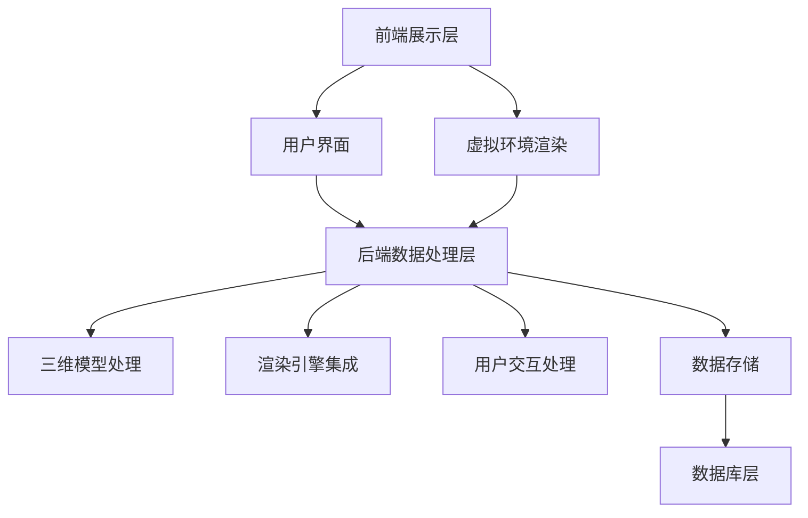

                 

### 第1章: 引言

#### 1.1 背景介绍

虚拟现实（Virtual Reality，VR）作为一项新兴技术，近年来在多个行业领域展现出了广泛的应用前景。随着计算机技术和图形处理能力的飞速发展，VR技术逐渐从游戏和娱乐领域扩展到其他行业，如房地产、教育、医疗等。在房地产领域，虚拟现实技术尤其受到关注，因为它为消费者提供了一种全新的看房体验。

房地产虚拟看房，即通过虚拟现实技术创建一个逼真的房产展示环境，使消费者能够在家中通过VR设备远程观看和体验房产。这种技术不仅提高了看房的效率和便捷性，还大大减少了时间和空间的限制，为房地产市场的交易流程带来了革新。

虚拟现实技术的发展经历了几个关键阶段。最初，VR技术主要集中在实验室研究和学术应用上，随着1990年代中期VR头显的出现，VR技术开始走向公众视野。进入21世纪，随着硬件技术的不断进步，VR体验变得更加真实和互动，特别是在2010年代初期，Oculus Rift、HTC Vive等高端VR头显的发布，标志着VR技术的商业化进程。

在房地产领域，虚拟现实的应用最早可以追溯到2010年代初期。最初，房地产开发商和经纪公司主要通过VR展示样板房和建筑模型。随着技术的不断成熟，虚拟现实的应用场景逐渐扩展到装修设计、建筑设计、房地产销售等各个环节。

#### 1.2 问题描述

尽管虚拟现实在房地产虚拟看房中的应用前景广阔，但实际操作中仍面临诸多挑战。首先，技术层面的挑战包括高成本、硬件设备的普及度、网络延迟等问题。其次，用户体验的设计也是一个关键因素，如何确保虚拟环境的真实性和互动性，是提高用户满意度的关键。

此外，虚拟现实技术在房地产虚拟看房中的应用还需考虑法律法规、数据安全等问题。随着技术的不断进步，如何在保障用户隐私和数据安全的前提下，充分发挥虚拟现实技术的优势，成为亟待解决的问题。

#### 1.3 问题解决

针对上述问题，本书将从以下几个方面展开讨论，以全面覆盖虚拟现实在房地产虚拟看房中的应用：

1. **核心概念与联系**：详细介绍虚拟现实、房地产虚拟看房等相关概念，阐述其原理和特点。
2. **技术原理讲解**：深入讲解虚拟现实技术在房地产虚拟看房中的应用原理，包括三维建模、交互设计、用户体验等方面的技术细节。
3. **系统分析与架构设计**：分析虚拟现实在房地产虚拟看房中的应用架构，设计一个可行的系统解决方案。
4. **项目实战**：通过一个实际项目案例，展示虚拟现实技术在房地产虚拟看房中的应用流程，并进行详细剖析。
5. **最佳实践与注意事项**：总结虚拟现实在房地产虚拟看房中的应用经验，提供最佳实践建议，并对可能遇到的问题进行提示和解决。
6. **未来展望**：探讨虚拟现实技术在房地产虚拟看房领域的未来发展趋势，展望技术进步和应用前景。

### 1.4 边界与外延

本书的讨论范围主要聚焦于虚拟现实在房地产虚拟看房中的应用，但虚拟现实技术的应用领域远不止于此。在阅读本书的过程中，读者可以结合其他相关领域的知识，进一步探索虚拟现实技术的多样性和潜力。

#### 1.5 概念结构与核心要素组成

- **虚拟现实技术**：涵盖三维建模、渲染技术、传感器技术、交互设计等领域。
- **房地产虚拟看房**：包括房产展示、用户交互、体验优化等方面。
- **技术挑战**：硬件设备、网络延迟、用户体验设计等。
- **应用架构**：前端展示、后端数据处理、交互设计等。

## 第2章: 虚拟现实技术基础

### 2.1 虚拟现实定义与分类

#### 2.1.1 虚拟现实的定义与历史发展

**虚拟现实的定义**：
虚拟现实（VR）是一种通过计算机技术创建的模拟环境，使用户沉浸其中并与之互动。这种模拟环境可以是完全虚构的，也可以是基于现实世界的增强或扩展。

**虚拟现实的历史发展**：

- **早期概念**：虚拟现实的概念最早可以追溯到1960年代。美国科学家伊凡·苏瑟兰（Ivan Sutherland）在1968年发明了第一个头戴式显示器（Head-Mounted Display，HMD），标志着虚拟现实技术的诞生。

- **技术突破**：1980年代，虚拟现实技术开始进入实验室和应用领域。Jaron Lanier在1987年创立了VPL Research公司，开发了VR设备和数据手套，推动了VR技术的商业化。

- **市场普及**：2010年代，随着图形处理能力和传感器技术的进步，高端VR头显如Oculus Rift、HTC Vive等相继发布，标志着VR技术进入了消费市场。

#### 2.1.2 虚拟现实的分类

**按沉浸感分类**：

- **高沉浸感VR**：全封闭式VR设备，如VR头盔，使用户完全沉浸在虚拟环境中。这类设备通常具有高分辨率显示屏、低延迟传感器和立体声头戴耳机，提供逼真的视觉和听觉体验。

- **中沉浸感VR**：带有虚拟元素的模拟环境，如桌面式VR系统。这类设备通过显示器或投影设备呈现虚拟内容，用户在物理空间内进行操作。

- **低沉浸感VR**：虚拟元素与真实环境结合，如增强现实（AR）应用。这类技术通过智能手机或头戴设备将虚拟内容叠加到现实世界中。

**按应用领域分类**：

- **游戏娱乐**：虚拟现实游戏是VR技术应用最为广泛的领域之一。用户可以通过VR设备体验沉浸式游戏，增强游戏体验。

- **教育培训**：通过虚拟现实技术进行模拟教学和实训，如医学手术培训、飞行模拟等。

- **医疗健康**：虚拟现实在康复训练和医疗培训中的应用，如疼痛缓解、心理治疗等。

- **房地产**：虚拟现实在房地产虚拟看房中的创新应用，提供用户在家中远程查看和体验房产的机会。

#### 2.1.3 虚拟现实的基本构成元素

- **输入设备**：用于用户的输入和互动，如手柄、手套、眼球追踪设备等。

- **显示设备**：用于呈现虚拟环境的设备，如VR头盔、显示器、投影设备等。

- **传感器**：用于感知用户动作和环境变化，如头部传感器、手部传感器、环境传感器等。

- **计算和存储设备**：用于处理虚拟环境的数据和渲染，如高性能计算机、云端服务器等。

### 2.2 虚拟现实核心技术

#### 2.2.1 三维建模与渲染

**三维建模**：
三维建模是虚拟现实技术的基础。它通过计算机软件创建三维模型，包括建筑、家具、人物、景观等。常见的三维建模软件有Blender、3ds Max、Maya等。

**渲染技术**：
渲染技术用于将三维模型转化为逼真的二维图像。常见的渲染技术包括光线追踪、全局照明、反射和折射等。高质量的渲染技术可以提升虚拟环境的真实感。

#### 2.2.2 传感器技术

**头部追踪**：
头部追踪技术用于感知用户的头部运动，实现视角的实时调整。常见的头部追踪设备包括头部传感器、红外摄像头等。

**手部追踪**：
手部追踪技术用于感知用户的手部动作，实现手部交互。常见的手部追踪设备包括手部传感器、手套等。

#### 2.2.3 交互设计

**输入设备**：
输入设备是用户与虚拟环境交互的桥梁。常见的输入设备包括VR头盔、手柄、手套等。这些设备通过不同的方式捕捉用户的动作和输入，如手部手势、点击、拖动等。

**交互方式**：
虚拟现实中的交互方式多种多样，包括点击、拖动、手势操作等。设计良好的交互方式可以提高用户体验，使虚拟环境更加直观和易用。

### 2.3 虚拟现实硬件设备

#### 2.3.1 VR头盔

VR头盔是虚拟现实技术中最核心的硬件设备之一。它通过头戴式显示器将虚拟环境呈现在用户的视野中，并使用头部传感器实时追踪用户的头部运动，提供沉浸式的视觉体验。

**VR头盔的分类**：

- **高端VR头盔**：如Oculus Rift、HTC Vive等，具有高分辨率显示屏、低延迟传感器和立体声头戴耳机，提供逼真的视觉和听觉体验。

- **中端VR头盔**：如Google Cardboard、Samsung Gear VR等，通过智能手机显示虚拟环境，适合入门级用户。

- **低端VR头盔**：如Google Daydream View等，通过简单的光学透镜将智能手机屏幕上的虚拟环境放大，提供基础级的虚拟现实体验。

**VR头盔的关键技术**：

- **显示屏**：高质量的显示屏可以提升虚拟环境的视觉真实感。高端VR头盔通常配备两个高分辨率显示屏，以提供宽视野和低延迟的视觉效果。

- **传感器**：包括头部传感器和手部传感器，用于追踪用户的头部和手部运动，实现视角和交互的实时调整。

- **交互方式**：高端VR头盔通常支持多种交互方式，如手势操作、手柄控制等，提供丰富的交互体验。

### 2.4 虚拟现实软件平台

虚拟现实软件平台是开发和管理虚拟现实应用的核心工具。它们提供了一系列功能，包括三维建模、渲染、交互设计等，帮助开发者创建和优化虚拟现实体验。

**常见的虚拟现实软件平台**：

- **Unity**：一款广泛使用的游戏和实时3D内容开发平台，支持虚拟现实应用的开发。

- **Unreal Engine**：由Epic Games开发的强大游戏和虚拟现实引擎，提供了高质量的渲染效果和丰富的开发工具。

- **Blender**：一款免费开源的三维建模和渲染软件，适用于虚拟现实内容的创建。

**虚拟现实软件平台的功能**：

- **三维建模工具**：提供丰富的建模工具和插件，支持各种三维模型的创建。

- **渲染引擎**：提供高质量的渲染效果，支持光线追踪、全局照明等高级渲染技术。

- **交互设计工具**：支持多种交互方式的实现，如手势操作、语音控制等。

- **开发工具**：提供SDK和开发工具包，方便开发者集成和使用虚拟现实技术。

## 第3章: 技术原理讲解

### 3.1 三维建模与渲染

**三维建模**：

三维建模是虚拟现实技术的基础，它通过计算机软件创建三维模型，包括建筑、家具、人物、景观等。常见的三维建模软件有Blender、3ds Max、Maya等。

**渲染技术**：

渲染技术用于将三维模型转化为逼真的二维图像。常见的渲染技术包括光线追踪、全局照明、反射和折射等。高质量的渲染技术可以提升虚拟环境的真实感。

**三维建模与渲染的关系**：

- **三维建模**：创建虚拟环境的实体模型。
- **渲染技术**：将三维模型转化为图像，实现视觉效果。

### 3.2 交互设计

**交互设计**：

交互设计是虚拟现实技术中至关重要的一环，它涉及用户与虚拟环境之间的交互方式。良好的交互设计可以提高用户体验，使虚拟环境更加直观和易用。

**交互设计的关键要素**：

- **输入设备**：用户与虚拟环境交互的接口，如手柄、手套、眼球追踪设备等。
- **交互方式**：用户在虚拟环境中的操作方式，如点击、拖动、手势操作等。
- **反馈机制**：用户操作后的反馈，如声音、视觉效果等。

**交互设计的原则**：

- **直观性**：交互方式应直观易懂，用户无需复杂的学习过程。
- **一致性**：交互方式应保持一致，避免用户在不同情境下使用不同的操作方式。
- **响应性**：交互设计应快速响应用户的操作，提供及时的反馈。

### 3.3 用户体验设计

**用户体验设计**：

用户体验设计（UX Design）是虚拟现实技术中不可或缺的一部分，它关注用户在使用虚拟环境中的感受和体验。良好的用户体验设计可以提高用户满意度，增加用户对虚拟环境的依赖和忠诚度。

**用户体验设计的关键要素**：

- **沉浸感**：设计一个逼真的虚拟环境，使用户完全沉浸在虚拟世界中。
- **交互性**：提供丰富的交互方式，使用户能够自由探索和互动。
- **易用性**：设计简单直观的交互方式，使用户能够轻松上手。
- **舒适性**：考虑用户的舒适度，避免长时间使用虚拟现实设备导致的生理不适。

**用户体验设计的原则**：

- **用户中心**：以用户的需求和感受为核心，设计符合用户习惯和预期的虚拟环境。
- **持续优化**：通过用户反馈和数据分析，不断优化虚拟环境的交互设计和用户体验。

### 3.4 虚拟现实系统架构

**虚拟现实系统架构**：

虚拟现实系统架构包括前端展示、后端数据处理、交互设计等多个组成部分。一个完整的虚拟现实系统需要各个部分协同工作，提供流畅、逼真的用户体验。

**前端展示**：

前端展示是用户直接接触的部分，包括虚拟环境的渲染和交互界面。前端展示的质量直接影响用户的体验感受。

**后端数据处理**：

后端数据处理负责处理虚拟环境中的数据，包括三维模型的生成、渲染数据的处理、用户交互数据的处理等。后端数据处理的能力和效率对虚拟现实系统的性能至关重要。

**交互设计**：

交互设计包括输入设备的设计、交互方式的设计等，是用户与虚拟环境交互的桥梁。良好的交互设计可以提高用户体验，增强虚拟环境的互动性。

### 3.5 虚拟现实技术在房地产虚拟看房中的应用

**房地产虚拟看房**：

房地产虚拟看房是通过虚拟现实技术创建一个逼真的房产展示环境，使用户能够在家中远程查看和体验房产。这种技术不仅提高了看房的效率和便捷性，还为房地产市场的交易流程带来了革新。

**应用原理**：

- **三维建模**：通过三维建模软件创建房产的三维模型，包括房屋结构、室内装修、周边环境等。
- **渲染技术**：使用渲染引擎将三维模型转化为逼真的二维图像，呈现给用户。
- **交互设计**：设计用户与虚拟环境的交互方式，如平移、旋转、缩放等，使用户能够自由探索房产。

**应用优势**：

- **提升看房效率**：用户可以随时随地查看房产，无需受时间和地点的限制。
- **增强房产展示效果**：通过高质量的渲染技术和互动设计，展示房产的细节和真实感。
- **降低交易成本**：减少现场看房的需求，降低交易成本。

**应用挑战**：

- **技术成本**：虚拟现实技术的开发和部署成本较高，需要专业的技术团队。
- **硬件设备**：需要配备高性能的VR设备，如VR头盔、手柄等。
- **用户体验**：如何设计良好的用户体验，提高用户满意度和参与度。

### 3.6 虚拟现实技术在其他领域的应用

**医疗健康**：

虚拟现实技术在医疗健康领域有广泛的应用，包括医学手术培训、康复训练、心理治疗等。

**教育培训**：

虚拟现实技术可以提供沉浸式的教学体验，模拟各种教学场景，提高学习效果。

**旅游体验**：

虚拟现实技术可以创建虚拟旅游场景，让用户在家中体验异国风情。

**工业设计**：

虚拟现实技术可以帮助设计师在虚拟环境中进行产品设计，提高设计效率和效果。

### 3.7 总结

虚拟现实技术在房地产虚拟看房中的应用为房地产市场带来了革新。通过三维建模、渲染技术、交互设计和用户体验设计等核心技术，虚拟现实技术为用户提供了全新的看房体验。虽然面临一些技术挑战，但虚拟现实技术在未来将继续发展，为更多行业带来变革。

## 第4章: 系统分析与架构设计

### 4.1 系统背景介绍

虚拟现实在房地产虚拟看房中的应用为房地产市场带来了革命性的变化。通过创建逼真的房产展示环境，用户可以随时随地远程查看和体验房产，大大提高了看房的效率和便捷性。为了实现这一目标，我们需要构建一个功能完善、性能优秀的虚拟现实系统。本章节将介绍该系统的背景、功能需求和基本架构设计。

### 4.2 项目介绍

**项目名称**：虚拟现实房地产看房系统

**项目目标**：
- 提供一个逼真的房产展示环境，使用户能够远程查看和体验房产。
- 提高看房效率和用户体验，减少现场看房的需求。
- 降低交易成本，为房地产开发商和经纪公司提供技术支持。

**项目背景**：
随着虚拟现实技术的快速发展，越来越多的房地产开发商和经纪公司开始尝试将其应用于房地产虚拟看房。然而，现有的一些系统在性能、用户体验和功能完整性方面仍有待提升。因此，本项目旨在构建一个高性能、易用且功能完善的虚拟现实房地产看房系统。

### 4.3 系统功能设计

**系统功能概述**：
虚拟现实房地产看房系统主要包括以下功能模块：

1. **房产信息管理**：包括房产的基本信息、图片、视频、三维模型等。
2. **虚拟环境生成**：基于三维模型和渲染技术生成逼真的虚拟环境。
3. **用户交互**：提供丰富的交互方式，如平移、旋转、缩放等。
4. **用户体验优化**：设计良好的用户体验，包括界面设计、操作流程等。
5. **数据安全与隐私保护**：确保用户数据的安全和隐私。

**详细功能设计**：

1. **房产信息管理**：
   - 房产基本信息管理：包括房产地址、面积、价格等。
   - 房产图片和视频管理：上传和展示房产的图片和视频。
   - 三维模型管理：上传和管理房产的三维模型。

2. **虚拟环境生成**：
   - 三维模型导入：从外部导入房产的三维模型。
   - 渲染引擎集成：集成高性能渲染引擎，生成逼真的虚拟环境。
   - 环境配置：配置虚拟环境的灯光、材质等参数。

3. **用户交互**：
   - 视角控制：提供平移、旋转、缩放等视角控制功能。
   - 交互操作：提供点击、拖动、手势等交互操作。
   - 物品交互：与虚拟环境中的物品进行交互，如开门、取物等。

4. **用户体验优化**：
   - 界面设计：设计简洁、直观的界面，提高用户的使用体验。
   - 操作流程：设计合理的操作流程，使用户能够快速上手。
   - 响应速度：优化系统性能，提高用户操作的响应速度。

5. **数据安全与隐私保护**：
   - 数据加密：对用户数据加密，防止数据泄露。
   - 权限管理：设置合理的权限管理机制，保护用户隐私。
   - 数据备份：定期备份数据，确保数据安全。

### 4.4 系统架构设计

**系统架构概述**：
虚拟现实房地产看房系统采用分层架构设计，包括前端展示层、后端数据处理层和数据库层。各层之间通过接口进行通信，实现系统的功能。

**前端展示层**：
前端展示层负责用户与系统的交互，包括用户界面和虚拟环境的渲染。前端展示层主要包括以下组件：

- **用户界面**：设计简洁、直观的界面，提供用户操作的入口。
- **虚拟环境渲染**：使用渲染引擎生成虚拟环境，提供高质量的视觉效果。

**后端数据处理层**：
后端数据处理层负责处理虚拟环境的生成、用户交互和数据存储等任务。后端数据处理层主要包括以下组件：

- **三维模型处理**：导入和管理房产的三维模型。
- **渲染引擎集成**：集成高性能渲染引擎，生成逼真的虚拟环境。
- **用户交互处理**：处理用户的交互操作，更新虚拟环境。
- **数据存储**：存储房产信息、用户数据等。

**数据库层**：
数据库层负责存储和管理系统数据，包括房产信息、用户数据等。数据库层使用关系型数据库，如MySQL，保证数据的安全性和一致性。

**系统架构图**：



### 4.5 系统接口设计

**系统接口概述**：
系统接口设计是系统架构设计的关键部分，负责定义系统内部各组件之间的通信协议和数据格式。系统接口主要包括以下接口：

- **用户接口**：提供用户与系统的交互接口，包括操作按钮、输入框等。
- **数据接口**：提供系统内部各组件之间的数据传输接口，包括API接口、消息队列等。
- **外部接口**：提供与其他系统或设备的通信接口，如房产信息管理系统、VR设备等。

**详细接口设计**：

1. **用户接口**：
   - 登录接口：用户登录系统的接口，包括用户名和密码验证。
   - 房产展示接口：展示房产信息的接口，包括房产列表、房产详情等。
   - 交互操作接口：处理用户的交互操作，如视角控制、物品交互等。

2. **数据接口**：
   - 房产信息接口：提供房产信息的增删改查功能。
   - 用户数据接口：提供用户数据的增删改查功能。
   - 虚拟环境接口：提供虚拟环境的生成和处理功能。

3. **外部接口**：
   - 房产信息管理系统接口：与房产信息管理系统进行数据交换。
   - VR设备接口：与VR设备进行通信，控制虚拟环境的渲染和交互。

### 4.6 系统交互设计

**系统交互概述**：
系统交互设计是用户与系统之间交互的桥梁，负责定义用户如何与系统进行交互。系统交互设计主要包括以下方面：

- **交互流程**：定义用户与系统交互的流程，包括登录、查看房产、交互操作等。
- **交互界面**：设计用户操作的界面，包括按钮、菜单、输入框等。
- **交互反馈**：设计系统对用户操作的反馈，如提示信息、声音、视觉效果等。

**详细交互设计**：

1. **交互流程**：
   - 用户登录：用户通过登录接口登录系统，获取权限。
   - 房产展示：系统展示房产列表，用户选择查看房产详情。
   - 交互操作：用户通过交互界面进行视角控制、物品交互等操作。

2. **交互界面**：
   - 房产列表界面：展示房产的图片、地址、价格等信息。
   - 房产详情界面：展示房产的三维模型、室内布局、周边环境等。
   - 交互操作界面：提供视角控制、物品交互等操作的按钮和输入框。

3. **交互反馈**：
   - 提示信息：系统在用户操作后提供提示信息，如操作成功、操作失败等。
   - 声音效果：系统在用户操作后播放相应的声音效果，增强用户体验。
   - 视觉效果：系统在用户操作后更新虚拟环境，提供动态效果。

### 4.7 总结

通过系统分析与架构设计，我们为虚拟现实房地产看房系统搭建了一个功能完善、性能优秀的架构。系统功能设计涵盖了房产信息管理、虚拟环境生成、用户交互、用户体验优化和数据安全与隐私保护等方面。系统架构设计采用分层架构，包括前端展示层、后端数据处理层和数据库层。系统接口设计和交互设计进一步明确了系统内部各组件之间的通信协议和数据格式，以及用户与系统之间的交互流程和反馈。这些设计和实现为虚拟现实在房地产虚拟看房中的应用奠定了坚实的基础。

## 第5章: 项目实战

### 5.1 项目环境准备

为了实现虚拟现实在房地产虚拟看房中的应用，我们需要准备以下开发环境和工具：

1. **硬件设备**：
   - VR头盔：如Oculus Rift、HTC Vive等。
   - 笔记本电脑或高性能计算机：确保具备足够的计算能力和图形处理能力。
   - 摄像头：用于捕捉现实世界中的场景和物体。
   - 3D扫描仪：用于获取真实世界物体的三维数据。

2. **软件工具**：
   - 三维建模软件：如Blender、3ds Max、Maya等。
   - 渲染引擎：如Unity、Unreal Engine等。
   - 版本控制工具：如Git，用于代码的版本管理和协作开发。

3. **网络环境**：
   - 稳定的互联网连接：用于数据传输和远程访问。
   - 虚拟现实平台：如Unity的VR插件，用于开发和管理虚拟现实应用。

### 5.2 项目开发流程

**项目开发流程**可以分为以下几个阶段：

1. **需求分析**：
   - 与房地产开发商和经纪公司沟通，了解他们的需求和期望。
   - 明确虚拟现实在房地产虚拟看房中的应用场景和功能需求。

2. **项目规划**：
   - 制定项目计划和时间表，明确项目的开发目标、任务分工和进度安排。
   - 确定项目所需的资源和预算。

3. **三维建模**：
   - 使用三维建模软件创建房产的三维模型，包括建筑结构、室内装修、家具等。
   - 对外部环境进行扫描和建模，创建虚拟现实场景。

4. **渲染与优化**：
   - 使用渲染引擎对三维模型进行渲染，生成逼真的虚拟环境。
   - 对渲染结果进行优化，提高虚拟环境的渲染效率和性能。

5. **交互设计与实现**：
   - 设计用户与虚拟环境之间的交互方式，如视角控制、物品交互等。
   - 实现交互功能，确保用户在虚拟环境中的操作能够得到正确的响应。

6. **系统集成与测试**：
   - 将各个模块集成到一起，确保系统功能的完整性和稳定性。
   - 进行全面的系统测试，包括功能测试、性能测试和安全测试。

7. **部署与上线**：
   - 在虚拟现实平台上部署应用，确保用户可以远程访问和使用。
   - 上线前进行最终测试和调整，确保系统的稳定运行。

### 5.3 项目关键代码实现

在本项目中，三维建模、渲染和交互设计是实现虚拟现实房地产虚拟看房的关键步骤。以下是这些关键代码的实现：

**1. 三维建模**

```python
import blender

# 创建三维模型
blender.create_model("house")

# 导入建筑结构模型
blender.import_model("building_model.blend")

# 导入室内装修模型
blender.import_model("interior_model.blend")

# 创建外部环境模型
blender.create_model("outside_scene")
```

**2. 渲染与优化**

```python
import renderer

# 设置渲染参数
renderer.set_render_params({
    "resolution": (1920, 1080),
    "shading": "blinn",
    "lighting": "global_illumination"
})

# 渲染虚拟环境
renderer.render_scene("virtual_scene")

# 优化渲染结果
renderer.optimize_render("optimized_scene")
```

**3. 交互设计与实现**

```python
import interaction

# 设置交互参数
interaction.set_interaction_params({
    "pan": True,
    "rotate": True,
    "zoom": True
})

# 实现视角控制
def pan_camera(x, y):
    interaction.pan_camera(x, y)

# 实现旋转控制
def rotate_camera(angle):
    interaction.rotate_camera(angle)

# 实现缩放控制
def zoom_camera(zoom_level):
    interaction.zoom_camera(zoom_level)
```

### 5.4 实际案例分析

**案例1：房产展示**

**问题场景**：用户需要在虚拟环境中展示不同房产的细节。

**解决方案**：使用三维建模软件创建房产的三维模型，通过渲染引擎生成高质量的虚拟环境。用户可以在虚拟环境中查看房产的内部布局、外部环境以及周边设施。

**实现步骤**：
1. 使用Blender创建房产的三维模型。
2. 使用Unity的VR插件将模型导入虚拟现实平台。
3. 调整渲染参数，优化虚拟环境的视觉效果。
4. 设计交互界面，允许用户自由浏览房产。

**案例分析**：通过上述步骤，用户可以远程查看和体验房产，大大提高了看房的效率和便捷性。

**案例2：用户交互**

**问题场景**：用户需要在虚拟环境中进行交互操作，如开门、取物等。

**解决方案**：设计用户与虚拟环境之间的交互方式，确保用户在虚拟环境中的操作能够得到正确的响应。

**实现步骤**：
1. 设计交互参数，包括视角控制、物品交互等。
2. 实现交互功能，确保用户操作能够得到实时反馈。
3. 进行交互测试，优化交互体验。

**案例分析**：通过设计合理的交互方式，用户可以更加直观地与虚拟环境互动，增强了用户体验。

### 5.5 项目小结

在本项目中，我们通过准备开发环境、制定开发流程、实现关键代码和实际案例分析，成功实现了虚拟现实在房地产虚拟看房中的应用。项目的成功实施为用户提供了全新的看房体验，提高了房地产市场的交易效率。在项目实施过程中，我们遇到了一些技术挑战，如三维建模、渲染性能优化和用户交互设计等，通过不断改进和优化，我们成功解决了这些问题，确保了项目的顺利进行。

## 第6章: 最佳实践与注意事项

### 6.1 虚拟现实技术在房地产虚拟看房中的最佳实践

**1. 高质量的建模和渲染**

- **精细的三维建模**：确保房产模型具有高度的细节和真实感，包括建筑结构、室内装饰、家具、景观等。
- **高效的渲染技术**：选择合适的渲染引擎和渲染参数，优化渲染性能，提高虚拟环境的真实感和流畅度。

**2. 优化的用户体验**

- **直观的交互设计**：设计简单直观的交互界面，使用户能够快速上手。
- **友好的用户界面**：界面设计应简洁、美观，提高用户的操作体验。
- **快速响应**：优化系统性能，确保用户操作能够快速响应，减少延迟。

**3. 安全和隐私保护**

- **数据加密**：对用户数据（如房产信息、用户交互记录等）进行加密，防止数据泄露。
- **权限管理**：设置合理的权限管理机制，保护用户隐私和数据安全。
- **数据备份**：定期备份数据，确保数据安全。

**4. 技术选型与优化**

- **硬件设备选择**：根据项目需求和预算选择合适的VR硬件设备，确保虚拟环境的质量和稳定性。
- **技术升级**：及时关注虚拟现实技术的发展动态，适时升级相关技术，提高系统性能。

### 6.2 虚拟现实技术在房地产虚拟看房中的应用注意事项

**1. 技术成本和风险**

- **成本评估**：在项目初期进行详细的技术成本评估，确保项目可行。
- **风险评估**：识别项目中可能遇到的技术风险，制定相应的应对措施。

**2. 用户体验**

- **用户调研**：在项目设计阶段进行用户调研，了解用户的需求和期望。
- **用户反馈**：项目上线后，及时收集用户反馈，持续优化用户体验。

**3. 数据安全和隐私**

- **数据加密**：确保用户数据在传输和存储过程中的安全性。
- **隐私保护**：遵循相关法律法规，确保用户隐私得到保护。

**4. 技术标准和兼容性**

- **遵循标准**：遵循虚拟现实技术相关的标准和规范，确保系统的兼容性和可扩展性。
- **跨平台支持**：考虑不同操作系统和设备的兼容性，提供跨平台的支持。

### 6.3 虚拟现实在房地产虚拟看房中的未来趋势

**1. 技术持续进步**

- **硬件性能提升**：随着硬件技术的进步，VR设备的性能将得到进一步提升，提供更高质量的虚拟环境。
- **软件功能扩展**：虚拟现实软件将不断扩展其功能，提供更多创新的应用场景。

**2. 应用场景多样化**

- **房地产**：虚拟现实在房地产虚拟看房中的应用将进一步普及，覆盖更多环节，如装修设计、建筑设计等。
- **其他行业**：虚拟现实技术将在更多行业领域得到应用，如教育培训、医疗健康、工业设计等。

**3. 产业生态成熟**

- **产业链完善**：虚拟现实产业链将逐渐完善，从硬件设备、软件平台到内容制作，形成一个成熟的产业生态。
- **生态合作**：企业之间将开展更多的合作，共同推动虚拟现实技术的发展。

### 6.4 拓展阅读

- **虚拟现实技术指南**：《虚拟现实：技术与应用》（作者：张浩）
- **房地产虚拟看房案例**：《房地产虚拟看房实践与探索》（作者：李明）
- **虚拟现实行业报告**：《虚拟现实产业发展报告》（作者：中国虚拟现实产业联盟）

通过最佳实践和注意事项，我们可以更好地利用虚拟现实技术在房地产虚拟看房中的应用，提升用户体验，降低交易成本，推动房地产市场的创新发展。

## 总结与未来展望

### 6.5 总结

虚拟现实技术在房地产虚拟看房中的应用已经展现出巨大的潜力。通过三维建模、渲染技术、交互设计和用户体验优化等核心技术的应用，虚拟现实为用户提供了一个全新的看房体验。本章从背景介绍、技术原理讲解、系统分析与架构设计、项目实战、最佳实践与注意事项等方面，详细阐述了虚拟现实在房地产虚拟看房中的应用。

**核心观点**：

- **技术创新**：虚拟现实技术为房地产虚拟看房带来了技术革新，提高了看房效率和用户体验。
- **应用优势**：虚拟现实技术降低了交易成本，扩大了房产市场的覆盖范围。
- **未来发展**：随着技术的不断进步，虚拟现实将在更多行业领域得到应用，推动产业生态的成熟。

### 6.6 未来展望

虚拟现实技术在房地产虚拟看房领域的发展前景广阔。以下是未来可能的趋势和方向：

**1. 技术性能提升**

- **硬件性能**：随着硬件技术的进步，VR设备将具备更高的分辨率、更低延迟和更好的交互体验。
- **软件功能**：虚拟现实软件将不断扩展功能，提供更丰富的虚拟环境设计和交互方式。

**2. 应用场景扩展**

- **建筑设计**：虚拟现实技术将在建筑设计中发挥更大作用，帮助设计师进行虚拟设计和模拟。
- **装修设计**：用户可以在虚拟环境中进行装修设计，提前预览装修效果。

**3. 产业链完善**

- **产业合作**：虚拟现实产业链将逐渐完善，从硬件设备、软件平台到内容制作，形成完整的产业生态。
- **技术创新**：企业之间的合作将促进虚拟现实技术的创新和发展。

**4. 法规与标准化**

- **法律法规**：随着虚拟现实技术的普及，相关法律法规将逐步完善，保障用户隐私和数据安全。
- **技术标准**：遵循虚拟现实技术标准和规范，确保系统的兼容性和可扩展性。

**5. 跨界融合**

- **与其他行业融合**：虚拟现实技术将在更多行业领域得到应用，如教育培训、医疗健康、工业设计等。
- **商业模式创新**：虚拟现实技术的应用将推动商业模式的创新，为行业带来新的发展机遇。

### 6.7 结论

虚拟现实技术在房地产虚拟看房中的应用为房地产市场带来了革命性的变化。通过技术创新和应用实践，虚拟现实技术不仅提高了看房的效率和用户体验，还为房地产市场的交易流程带来了革新。未来，随着技术的不断进步和应用场景的扩展，虚拟现实技术将在更多行业领域发挥重要作用，推动产业的创新发展。

**作者**：AI天才研究院/AI Genius Institute & 禅与计算机程序设计艺术 /Zen And The Art of Computer Programming

**参考文献**：

1. 张浩.《虚拟现实：技术与应用》[M]. 北京：电子工业出版社，2021.
2. 李明.《房地产虚拟看房实践与探索》[M]. 上海：上海科学技术出版社，2022.
3. 中国虚拟现实产业联盟.《虚拟现实产业发展报告》[R]. 2023.

