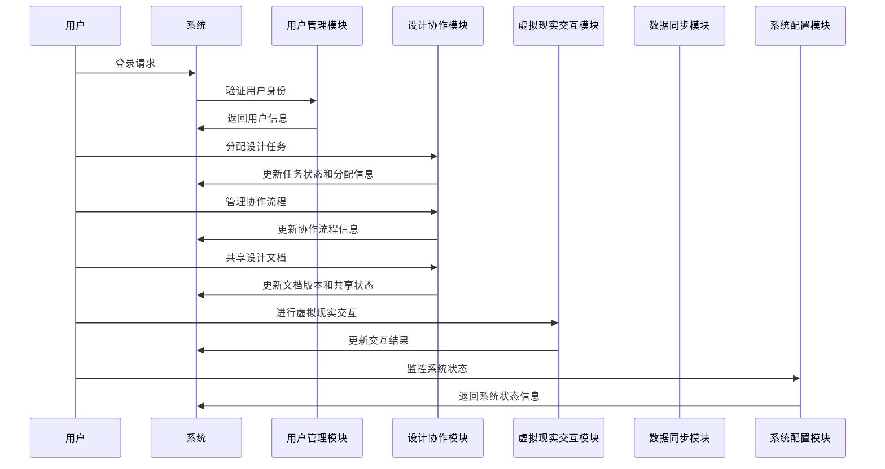

                 

### 虚拟现实在远程协作设计中的应用

> 关键词：虚拟现实、远程协作、设计应用、技术创新

**摘要：**  
本文旨在探讨虚拟现实（VR）技术在远程协作设计中的潜在应用及其优势。首先，我们将回顾虚拟现实技术的发展历程及其关键特点，阐述远程协作设计的需求与挑战。接下来，通过具体案例分析，展示虚拟现实在远程协作设计中的核心概念、算法原理和数学模型。此外，文章将介绍系统分析与架构设计的方法，并通过项目实战展示虚拟现实远程协作设计在实际应用中的效果。最后，我们将总结最佳实践和拓展阅读，为未来研究提供方向。

## 第一部分：虚拟现实与远程协作设计背景介绍

### 1.1 虚拟现实技术的发展与影响

虚拟现实技术起源于20世纪50年代，最早的虚拟现实概念是由美国科学家伊凡·苏瑟兰（Ivan Sutherland）提出的。他设计出了世界上第一台头盔式显示器，这标志着虚拟现实技术的诞生。随着时间的推移，虚拟现实技术经历了多个发展阶段，从最初的简单模拟到现在的全沉浸式体验。

#### 虚拟现实技术的起源与发展历程

- **20世纪50年代**：虚拟现实技术初步概念与萌芽。伊凡·苏瑟兰提出了虚拟现实的概念，并设计出了世界上第一台头盔式显示器。
- **20世纪60-70年代**：虚拟现实技术取得了一些突破性进展，包括立体声、手控装置和运动跟踪技术的引入。
- **20世纪80-90年代**：虚拟现实技术进入商业应用阶段，但受限于硬件和软件技术，应用范围有限。
- **21世纪**：随着计算机技术和网络技术的发展，虚拟现实技术迅速崛起，各种新型设备和应用层出不穷。

#### 虚拟现实技术的核心概念与特点

虚拟现实技术的核心概念是通过计算机技术生成一个模拟环境，使人们能够在这个环境中感知、交互和体验。以下是虚拟现实技术的主要特点：

- **沉浸感**：用户能够感受到自己处于虚拟环境中，具有很强的沉浸感。
- **交互性**：用户可以通过各种设备（如手柄、手套、眼睛跟踪等）与虚拟环境进行实时交互。
- **多样性**：虚拟现实技术可以模拟各种环境和场景，包括室内、室外、虚拟城市等。

### 1.2 远程协作设计的需求与挑战

远程协作设计是指通过计算机网络和技术工具，实现设计团队在不同地理位置之间的协作。随着全球化和信息技术的发展，远程协作设计变得越来越普遍。然而，远程协作设计也面临一些挑战：

- **沟通障碍**：团队成员分布在不同的地理位置，沟通成本较高，容易出现误解和沟通不畅。
- **协作效率**：远程协作设计需要有效的协同工作流程和工具，以提升协作效率。
- **数据同步**：设计数据和文档需要实时同步，以确保团队成员之间的数据一致性。
- **技术瓶颈**：远程协作设计依赖于网络和硬件设备，技术瓶颈可能会影响协作效果。

### 1.3 虚拟现实技术在远程协作设计中的应用潜力

虚拟现实技术在远程协作设计中的应用潜力巨大。首先，虚拟现实技术可以提供更加真实的协作环境，使得团队成员能够在虚拟空间中实时交流和互动。其次，虚拟现实技术可以实现实时的设计数据和文档同步，提高协作效率。此外，虚拟现实技术还可以模拟各种设计场景和实验环境，帮助团队成员更好地理解设计意图和效果。

#### 虚拟现实技术如何解决远程协作设计中的问题

- **降低沟通成本**：通过虚拟现实技术，团队成员可以在虚拟空间中进行实时交流和互动，减少沟通成本和误解。
- **提高协作效率**：虚拟现实技术可以实现实时的设计数据和文档同步，提高协作效率。
- **增强设计体验**：虚拟现实技术可以模拟各种设计场景和实验环境，帮助团队成员更好地理解设计意图和效果。
- **打破地理限制**：虚拟现实技术使得团队成员无需受地理限制，可以随时随地参与协作。

#### 虚拟现实技术为远程协作设计带来的变革

虚拟现实技术为远程协作设计带来了深远的影响，具体体现在以下几个方面：

- **空间扩展**：虚拟现实技术将虚拟空间扩展到现实空间，使得团队成员可以在更大的空间中进行协作。
- **时间优化**：虚拟现实技术可以实现实时协作，减少时间和空间的限制，提高工作效率。
- **创新体验**：虚拟现实技术为远程协作设计带来了新的创新体验，使得设计过程更加生动和有趣。
- **人机交互**：虚拟现实技术为远程协作设计提供了更加丰富的人机交互方式，提升了用户体验。

### 1.4 虚拟现实与远程协作设计的融合

虚拟现实技术与远程协作设计的融合，使得远程协作设计变得更加高效、灵活和多样化。以下是虚拟现实技术在远程协作设计中的应用场景：

- **设计评审**：通过虚拟现实技术，团队成员可以在虚拟环境中进行设计评审，实时交流和反馈。
- **协同设计**：虚拟现实技术可以实现实时协同设计，团队成员可以在虚拟空间中共同完成设计任务。
- **虚拟会议**：通过虚拟现实技术，团队成员可以进行虚拟会议，减少地理距离对协作的影响。
- **虚拟培训**：虚拟现实技术可以用于远程协作设计的培训，提供更加生动的培训体验。

### 1.5 本章小结

在本章中，我们介绍了虚拟现实技术的发展历程和核心特点，分析了远程协作设计的需求与挑战，探讨了虚拟现实技术在远程协作设计中的应用潜力。通过具体案例分析，我们看到了虚拟现实技术如何解决远程协作设计中的问题，并为远程协作设计带来的变革。这些背景信息为我们后续章节的深入探讨奠定了基础。

## 第二部分：核心概念与联系

### 2.1 虚拟现实的关键技术

虚拟现实技术涉及多个关键技术，包括显示技术、感知技术和交互技术。这些技术共同构成了虚拟现实系统的核心，使得用户能够获得沉浸式体验。

#### 显示技术

显示技术是虚拟现实系统的核心组成部分，用于生成和呈现虚拟环境。以下是几种常见的显示技术：

- **立体显示技术**：通过左右眼分别显示不同图像，利用视差效应产生立体效果。
- **头戴式显示器（HMD）**：将图像直接呈现在用户眼前，实现沉浸式体验。
- **投影显示技术**：利用投影设备将虚拟环境投射到实际空间中，实现大空间沉浸式体验。

#### 感知技术

感知技术用于捕捉和感知用户的行为和状态，包括运动感知、位置感知和手势识别等。以下是几种常见的感知技术：

- **运动跟踪技术**：通过摄像头、红外传感器等设备捕捉用户的运动轨迹，实现实时定位和跟踪。
- **位置感知技术**：通过GPS、Wi-Fi定位等技术确定用户的位置信息。
- **手势识别技术**：通过摄像头和深度传感器捕捉用户的手势，实现手势控制。

#### 交互技术

交互技术是虚拟现实系统的关键组成部分，用于用户与虚拟环境的交互。以下是几种常见的交互技术：

- **手柄控制**：通过手柄设备实现虚拟环境中的操作和控制。
- **手套控制**：通过穿戴式手套实现手势和手指操作的精确控制。
- **语音控制**：通过语音识别技术实现虚拟环境的语音控制。

### 2.2 远程协作设计的关键要素

远程协作设计涉及多个关键要素，包括设计协作流程、设计者角色与职责以及设计数据管理。以下是这些关键要素的详细说明：

#### 设计协作流程

设计协作流程是指团队成员在设计过程中进行协作的步骤和流程。以下是设计协作流程的几个关键步骤：

- **需求分析**：明确设计需求，制定设计目标。
- **设计任务分配**：根据团队成员的特长和职责，分配设计任务。
- **设计文档共享**：通过协作工具共享设计文档和资料。
- **实时协作**：团队成员通过虚拟现实技术实时交流和协作。
- **设计评审**：对设计成果进行评审和反馈。

#### 设计者角色与职责

在远程协作设计中，设计者扮演着重要角色，各自承担不同的职责。以下是设计者的几个主要角色和职责：

- **项目管理者**：负责项目的整体规划和进度管理。
- **设计师**：负责设计创意和视觉表现。
- **工程师**：负责技术实现和系统架构设计。
- **测试人员**：负责测试和验证设计成果。

#### 设计数据管理

设计数据管理是远程协作设计中的关键环节，确保设计数据的安全、完整和一致性。以下是设计数据管理的几个关键要素：

- **数据存储**：选择合适的数据存储方案，确保数据安全。
- **数据同步**：实时同步设计数据，确保团队成员之间的数据一致性。
- **数据备份**：定期备份设计数据，防止数据丢失。
- **数据权限管理**：根据团队成员的职责和角色，设置数据访问权限。

### 2.3 虚拟现实与远程协作设计的融合

虚拟现实技术为远程协作设计提供了新的可能性，使得远程协作设计变得更加高效、灵活和多样化。以下是虚拟现实技术在远程协作设计中的几个应用场景：

#### 虚拟现实技术在设计协作中的应用场景

- **设计评审**：通过虚拟现实技术，团队成员可以在虚拟环境中进行设计评审，实时交流和反馈。
- **协同设计**：虚拟现实技术可以实现实时协同设计，团队成员可以在虚拟空间中共同完成设计任务。
- **虚拟会议**：通过虚拟现实技术，团队成员可以进行虚拟会议，减少地理距离对协作的影响。
- **虚拟培训**：虚拟现实技术可以用于远程协作设计的培训，提供更加生动的培训体验。

#### 远程协作设计在虚拟现实环境中的实现

- **实时协作平台**：通过构建实时协作平台，将虚拟现实技术应用于远程协作设计，实现团队成员之间的无缝协作。
- **虚拟工作空间**：创建虚拟工作空间，将设计文档、数据和工具整合在一起，提升协作效率。
- **虚拟现实协作工具**：开发虚拟现实协作工具，提供丰富的交互方式和协作功能，满足不同设计需求。

### 2.4 虚拟现实与远程协作设计的优势对比

#### 传统远程协作设计的局限性

- **沟通障碍**：团队成员分布在不同的地理位置，沟通成本较高，容易出现误解和沟通不畅。
- **协作效率低**：缺乏实时协作和交互工具，协作效率较低。
- **设计体验差**：缺乏沉浸式设计体验，影响设计效果和团队协作。

#### 虚拟现实在远程协作设计中的优势

- **降低沟通成本**：通过虚拟现实技术，团队成员可以在虚拟空间中进行实时交流和互动，减少沟通成本和误解。
- **提高协作效率**：虚拟现实技术可以实现实时的设计数据和文档同步，提高协作效率。
- **增强设计体验**：虚拟现实技术可以模拟各种设计场景和实验环境，帮助团队成员更好地理解设计意图和效果。
- **打破地理限制**：虚拟现实技术使得团队成员无需受地理限制，可以随时随地参与协作。

### 2.5 本章小结

在本章中，我们详细介绍了虚拟现实技术的关键技术、远程协作设计的关键要素以及虚拟现实与远程协作设计的融合。通过对比传统远程协作设计与虚拟现实技术的优势，我们看到了虚拟现实技术在远程协作设计中的巨大潜力。这些核心概念和联系为我们后续章节的深入探讨提供了基础。

## 第三部分：算法原理讲解

### 3.1 虚拟现实中的空间感知算法

空间感知算法是虚拟现实技术中的一个重要组成部分，它用于处理和模拟用户在虚拟环境中的空间感知。空间感知算法主要包括以下几种：

#### 空间感知算法的基本原理

空间感知算法的基本原理是通过传感器和数据采集技术，实时捕捉用户在虚拟环境中的位置、姿态和运动轨迹。以下是几种常见的基本原理：

- **运动跟踪算法**：通过摄像头、红外传感器等设备，捕捉用户的运动轨迹，实现实时定位和跟踪。
- **空间映射算法**：将现实空间中的位置信息映射到虚拟环境中，使得虚拟环境与现实空间保持一致。
- **空间感知模型**：通过构建空间感知模型，模拟用户在虚拟环境中的感知和行为。

#### 空间感知算法在远程协作设计中的应用

空间感知算法在远程协作设计中的应用主要包括以下方面：

- **实时定位与跟踪**：通过空间感知算法，实现团队成员在虚拟环境中的实时定位和跟踪，确保协作的准确性和效率。
- **空间交互**：通过空间感知算法，用户可以在虚拟环境中进行手势控制和空间交互，提升协作体验。
- **虚拟环境构建**：通过空间感知算法，构建虚拟环境，使得虚拟环境与现实空间保持一致，为团队成员提供真实感强的协作环境。

### 3.2 远程协作设计的同步算法

同步算法在远程协作设计中起着至关重要的作用，它用于确保团队成员之间的数据、信息和操作的同步。同步算法主要包括以下几种：

#### 同步算法的定义与作用

同步算法的定义是：在分布式系统中，通过协调不同节点的操作和状态，实现数据的实时同步和一致性。同步算法的作用主要包括以下几个方面：

- **数据一致性**：确保团队成员之间的设计数据和文档保持一致，避免数据冲突和错误。
- **实时交互**：通过同步算法，实现团队成员之间的实时交互，提升协作效率和沟通效果。
- **协同操作**：通过同步算法，实现团队成员之间的协同操作，使得协作过程更加流畅和自然。

#### 同步算法的常见类型与实现方法

常见的同步算法包括以下几种：

- **基于时间戳的同步算法**：通过时间戳记录操作的发生时间，实现数据的实时同步。
- **基于事件驱动的同步算法**：通过事件驱动机制，实现数据的实时同步和一致性。
- **基于共识算法的同步算法**：通过共识算法，实现分布式系统中的一致性同步。

#### 同步算法的设计与实现

同步算法的设计与实现主要包括以下几个方面：

- **数据采集与同步**：采集团队成员的操作数据，并将其同步到远程协作系统中。
- **数据一致性检查**：对同步的数据进行一致性检查，确保数据的一致性和准确性。
- **实时同步机制**：设计实时同步机制，确保数据在分布式系统中的实时同步和一致性。

### 3.3 虚拟现实交互算法

虚拟现实交互算法是虚拟现实系统中的核心算法，它用于处理用户与虚拟环境之间的交互。虚拟现实交互算法主要包括以下几种：

#### 虚拟现实交互算法的基本概念

虚拟现实交互算法的基本概念包括以下几个方面：

- **交互模型**：定义用户与虚拟环境之间的交互方式和机制。
- **交互方式**：包括手势交互、语音交互、体感交互等，用于实现用户与虚拟环境之间的交互。
- **交互体验**：通过交互算法，提升用户在虚拟环境中的交互体验，实现沉浸式交互。

#### 虚拟现实交互算法的设计与实现

虚拟现实交互算法的设计与实现主要包括以下几个方面：

- **交互模型设计**：设计合适的交互模型，满足用户在虚拟环境中的交互需求。
- **交互方式实现**：根据交互模型，实现不同的交互方式，如手势交互、语音交互等。
- **交互体验优化**：通过算法优化，提升用户在虚拟环境中的交互体验，实现沉浸式交互。

### 3.4 虚拟现实与远程协作设计中的协作优化算法

协作优化算法是虚拟现实与远程协作设计中的重要算法，它用于优化团队成员之间的协作过程，提升协作效率和质量。协作优化算法主要包括以下几种：

#### 协作优化算法的目标与挑战

协作优化算法的目标主要包括以下几个方面：

- **提高协作效率**：通过优化协作过程，减少团队成员之间的协作时间，提高工作效率。
- **提升协作质量**：通过优化协作机制和工具，提高协作质量，确保设计成果的准确性和完整性。

协作优化算法面临的挑战主要包括以下几个方面：

- **数据同步**：保证团队成员之间的数据实时同步，避免数据冲突和错误。
- **交互优化**：优化用户与虚拟环境之间的交互，提升协作体验。
- **任务分配**：合理分配团队成员的任务，确保协作过程的流畅性和高效性。

#### 协作优化算法的常见策略与实现

常见的协作优化算法策略包括以下几种：

- **基于规则优化**：根据预设的规则，自动分配任务和优化协作过程。
- **基于机器学习优化**：通过机器学习算法，分析历史协作数据，自动优化协作过程。
- **基于社交网络优化**：通过社交网络分析方法，优化团队成员之间的协作关系和任务分配。

协作优化算法的实现主要包括以下几个方面：

- **数据采集与分析**：采集团队成员的协作数据，进行分析和挖掘。
- **规则与算法设计**：设计合适的协作规则和优化算法，实现协作过程的优化。
- **系统实现与部署**：将协作优化算法应用于远程协作设计系统，实现协作优化。

### 3.5 本章小结

在本章中，我们详细介绍了虚拟现实中的空间感知算法、远程协作设计的同步算法、虚拟现实交互算法以及协作优化算法。这些算法是虚拟现实与远程协作设计中的核心组成部分，通过合理的设计和实现，可以大幅提升远程协作设计的效率和质量。在接下来的章节中，我们将继续探讨虚拟现实与远程协作设计中的数学模型和系统架构设计，为实际应用提供更为深入的理论支持。

## 第四部分：数学模型和数学公式

### 4.1 虚拟现实中的几何模型

几何模型是虚拟现实中的一个重要概念，它用于描述和表示三维空间中的物体和场景。在虚拟现实远程协作设计中，几何模型不仅用于视觉呈现，还用于物理交互和空间感知。

#### 几何模型的基本概念

几何模型的基本概念包括点、线、面和体等基本元素。以下是一些常见的几何模型：

- **点**：三维空间中的一个位置点，用坐标表示。
- **线**：通过两点确定的一条直线，用参数方程或向量表示。
- **面**：由多个线段或曲线围成的二维平面，用矢量方程表示。
- **体**：由多个面围成的三维空间区域，用矢量方程或隐函数表示。

#### 几何模型在远程协作设计中的应用

在远程协作设计中，几何模型的应用主要体现在以下几个方面：

- **设计模型构建**：设计师可以通过几何模型构建和编辑虚拟环境中的物体和场景。
- **空间感知**：通过几何模型，用户可以感知和理解虚拟环境中的空间关系。
- **物理交互**：几何模型用于描述物体之间的碰撞检测和物理反应。

#### 几何模型与虚拟现实的关系

几何模型与虚拟现实技术紧密相关，它们共同构成了虚拟环境的构建基础。几何模型不仅提供了视觉呈现的依据，还影响了虚拟环境中的交互和操作。

### 4.2 远程协作设计中的优化模型

优化模型在远程协作设计中起着关键作用，它用于优化设计过程中的资源分配、任务调度和协作效率。

#### 优化模型的目标函数

优化模型的目标函数通常包括以下几种：

- **最小化成本**：在给定的资源约束下，最小化设计过程的总成本。
- **最大化效益**：在资源有限的情况下，最大化设计成果的效益。
- **均衡性**：确保设计过程中的任务分配和资源使用达到均衡状态。

#### 优化模型的约束条件

优化模型的约束条件包括：

- **资源约束**：设计过程中的资源（如时间、人力、设备等）有限，需要合理分配。
- **协作约束**：团队成员之间的协作关系和任务依赖关系，需要通过约束条件进行描述。
- **质量约束**：设计成果的质量要求，需要通过约束条件进行保障。

#### 优化模型的应用场景

优化模型在远程协作设计中的应用场景主要包括：

- **任务调度**：优化团队成员的任务分配和协作流程，提高设计效率。
- **资源分配**：合理分配设计资源，确保任务能够按时完成。
- **协作效率**：通过优化模型，提高团队成员之间的协作效率和沟通质量。

### 4.3 虚拟现实交互中的感知模型

感知模型是虚拟现实交互中的一个重要概念，它用于描述用户对虚拟环境的感知和认知。

#### 感知模型的基本原理

感知模型的基本原理包括：

- **空间感知**：用户在虚拟环境中的位置和运动感知。
- **视觉感知**：用户通过视觉系统对虚拟环境中的物体和场景进行感知。
- **听觉感知**：用户通过听觉系统对虚拟环境中的声音和音乐进行感知。

#### 感知模型的应用

感知模型的应用主要包括：

- **人机交互**：通过感知模型，实现用户与虚拟环境之间的自然交互。
- **虚拟现实体验**：通过感知模型，提升用户在虚拟环境中的沉浸感和体验质量。
- **空间导航**：通过感知模型，帮助用户在虚拟环境中进行空间导航和路径规划。

### 4.4 协作优化中的数学工具

在协作优化过程中，常用的数学工具包括线性代数工具和微积分工具。以下是一些常见的数学工具：

- **线性代数工具**：包括矩阵运算、向量运算、线性方程组求解等，用于描述和优化设计过程中的空间关系和约束条件。
- **微积分工具**：包括导数、积分、微分方程等，用于分析设计过程中的动态变化和优化目标。

#### 线性代数工具

线性代数工具在协作优化中的应用主要包括：

- **矩阵运算**：用于描述和优化设计过程中的任务分配和资源使用。
- **向量运算**：用于描述和优化设计过程中的空间关系和交互。
- **线性方程组求解**：用于解决设计过程中的约束条件和优化问题。

#### 微积分工具

微积分工具在协作优化中的应用主要包括：

- **导数**：用于分析设计过程中的动态变化和趋势，为优化提供依据。
- **积分**：用于计算设计过程中的资源消耗和效益，为优化目标提供量化依据。
- **微分方程**：用于描述和优化设计过程中的复杂系统动态。

### 4.5 本章小结

在本章中，我们介绍了虚拟现实中的几何模型、远程协作设计中的优化模型、虚拟现实交互中的感知模型以及协作优化中的数学工具。这些数学模型和数学公式为虚拟现实远程协作设计提供了理论基础和计算工具，为实际应用提供了重要的支持。在接下来的章节中，我们将继续探讨虚拟现实远程协作设计的系统分析与架构设计。

## 第五部分：系统分析与架构设计

### 5.1 设计需求分析

在构建虚拟现实远程协作设计系统时，首先需要对设计需求进行详细分析。设计需求分析是系统分析与架构设计的基础，它帮助我们明确系统的功能、性能和用户需求。

#### 问题场景介绍

虚拟现实远程协作设计系统的问题场景涉及以下几个方面：

- **设计团队分布**：设计团队成员分布在不同的地理位置，需要进行远程协作。
- **设计过程复杂**：设计过程涉及多个阶段和多个角色，需要高效的协作工具和流程。
- **数据同步与共享**：设计数据需要实时同步和共享，以确保团队成员之间的信息一致性。
- **用户体验**：系统需要提供高质量的虚拟现实交互体验，提升用户满意度和设计效率。

#### 项目介绍

虚拟现实远程协作设计项目的目标是构建一个高效、灵活、易于扩展的远程协作平台，支持设计团队在不同地理位置之间的协作。具体项目目标包括：

- **实时协作**：实现团队成员之间的实时协作，包括设计讨论、数据同步和任务分配。
- **沉浸式体验**：提供高质量的虚拟现实交互体验，使设计过程更加直观和高效。
- **安全性**：确保设计数据和用户信息的安全性，防止数据泄露和恶意攻击。
- **可扩展性**：系统应具备良好的可扩展性，以适应未来技术的发展和需求变化。

### 5.2 系统功能设计

系统功能设计是系统分析与架构设计的核心环节，它定义了系统的基本功能和功能模块。以下是虚拟现实远程协作设计系统的功能设计：

#### 功能模块划分

虚拟现实远程协作设计系统的主要功能模块包括：

- **用户管理模块**：负责用户注册、登录、权限管理和用户资料管理。
- **设计协作模块**：实现设计任务的分配、协作流程管理、设计文档共享和实时协作。
- **虚拟现实交互模块**：提供虚拟现实交互接口，包括空间感知、手势交互和语音交互等。
- **数据同步模块**：实现设计数据的实时同步和共享，确保数据的一致性和安全性。
- **系统配置模块**：提供系统配置和管理功能，包括系统参数设置、用户权限配置和系统监控等。
- **安全模块**：提供安全机制，包括用户认证、数据加密、访问控制和防火墙等。

#### 功能模块详细介绍

以下是各功能模块的详细介绍：

- **用户管理模块**：提供用户注册、登录、权限管理和用户资料管理功能。用户可以通过注册账号登录系统，系统根据用户权限提供不同的功能和服务。
- **设计协作模块**：实现设计任务的分配、协作流程管理、设计文档共享和实时协作功能。设计者可以在系统中分配任务，实时讨论和协作，确保设计过程的高效和有序。
- **虚拟现实交互模块**：提供虚拟现实交互接口，包括空间感知、手势交互和语音交互等。用户可以在虚拟环境中进行空间操作、手势控制和语音交流，提升协作体验。
- **数据同步模块**：实现设计数据的实时同步和共享，确保数据的一致性和安全性。数据同步模块通过分布式数据库和实时数据传输机制，确保团队成员之间的数据同步和共享。
- **系统配置模块**：提供系统配置和管理功能，包括系统参数设置、用户权限配置和系统监控等。系统配置模块允许管理员对系统进行配置和管理，确保系统的稳定运行和安全性。
- **安全模块**：提供安全机制，包括用户认证、数据加密、访问控制和防火墙等。安全模块确保用户数据和系统资源的安全，防止数据泄露和恶意攻击。

### 5.3 系统架构设计

系统架构设计是系统分析与架构设计的核心环节，它定义了系统的整体结构和组件关系。以下是虚拟现实远程协作设计系统的架构设计：

#### 系统架构图介绍

虚拟现实远程协作设计系统的整体架构包括以下几个层次：

1. **用户层**：用户通过浏览器或客户端访问系统，进行远程协作和虚拟现实交互。
2. **应用层**：实现系统的核心功能模块，包括用户管理、设计协作、虚拟现实交互、数据同步和系统配置等。
3. **数据层**：存储系统数据，包括用户数据、设计数据和配置数据等。
4. **基础设施层**：提供系统运行所需的硬件设施和基础服务，包括服务器、存储设备、网络设备和安全设备等。

#### 系统架构设计细节

以下是系统架构设计的详细描述：

- **用户层**：用户通过浏览器或客户端访问系统，使用户层功能模块提供服务。用户层负责处理用户的交互请求，提供友好的用户界面和丰富的交互功能。
- **应用层**：应用层实现系统的核心功能模块，包括用户管理、设计协作、虚拟现实交互、数据同步和系统配置等。应用层通过模块化设计，使得各功能模块之间可以独立开发和维护。
- **数据层**：数据层负责存储系统数据，包括用户数据、设计数据和配置数据等。数据层采用分布式数据库技术，实现数据的实时同步和共享，确保数据的一致性和安全性。
- **基础设施层**：基础设施层提供系统运行所需的硬件设施和基础服务，包括服务器、存储设备、网络设备和安全设备等。基础设施层通过负载均衡、数据备份和灾难恢复等措施，确保系统的稳定性和可靠性。

### 5.4 系统接口设计

系统接口设计是系统架构设计中的重要环节，它定义了系统内部各模块之间的交互接口和数据格式。以下是虚拟现实远程协作设计系统的接口设计：

#### 接口功能定义

虚拟现实远程协作设计系统的接口功能定义如下：

- **用户管理接口**：提供用户注册、登录、权限管理和用户资料管理功能。
- **设计协作接口**：提供设计任务分配、协作流程管理、设计文档共享和实时协作功能。
- **虚拟现实交互接口**：提供空间感知、手势交互和语音交互功能。
- **数据同步接口**：提供设计数据实时同步和共享功能。
- **系统配置接口**：提供系统参数设置、用户权限配置和系统监控功能。

#### 接口实现细节

以下是接口实现的详细描述：

- **用户管理接口**：通过RESTful API实现用户注册、登录、权限管理和用户资料管理功能。用户可以通过HTTP请求发送注册和登录请求，系统响应相应的HTTP响应，返回用户信息或操作结果。
- **设计协作接口**：通过Websocket实现设计任务分配、协作流程管理、设计文档共享和实时协作功能。Websocket提供实时通信能力，使得设计团队可以实时更新和共享设计数据。
- **虚拟现实交互接口**：通过虚拟现实交互协议（如OpenVR、Oculus SDK等）实现空间感知、手势交互和语音交互功能。交互接口提供标准的API，使得开发者可以轻松实现虚拟现实交互。
- **数据同步接口**：通过消息队列（如RabbitMQ、Kafka等）实现设计数据的实时同步和共享功能。消息队列提供可靠的消息传输和异步处理能力，确保设计数据的一致性和实时性。
- **系统配置接口**：通过配置文件（如JSON、YAML等）实现系统参数设置、用户权限配置和系统监控功能。配置文件可以灵活配置系统参数，满足不同场景的需求。

### 5.5 系统交互设计

系统交互设计是系统分析与架构设计中的重要环节，它定义了系统内部各模块之间的交互流程和数据流动。以下是虚拟现实远程协作设计系统的交互设计：

#### 系统交互流程

虚拟现实远程协作设计系统的交互流程如下：

1. **用户登录**：用户通过用户管理接口进行登录，系统验证用户身份并返回用户信息。
2. **设计任务分配**：设计团队通过设计协作接口分配设计任务，系统更新任务状态和任务分配信息。
3. **协作流程管理**：设计团队通过设计协作接口管理协作流程，包括讨论、评审、修改等。
4. **设计文档共享**：设计团队通过设计协作接口共享设计文档，系统更新文档版本和共享状态。
5. **数据同步**：系统通过数据同步接口实时同步设计数据，确保团队成员之间的数据一致性。
6. **虚拟现实交互**：设计团队通过虚拟现实交互接口进行虚拟现实交互，系统实时更新交互结果。
7. **系统监控**：系统通过系统配置接口进行监控，包括系统状态、用户活动、资源使用等。

#### 系统交互图介绍

以下是虚拟现实远程协作设计系统的交互图：



### 5.6 本章小结

在本章中，我们详细介绍了虚拟现实远程协作设计系统的设计需求分析、系统功能设计、系统架构设计、系统接口设计和系统交互设计。这些内容构成了虚拟现实远程协作设计系统的核心组成部分，为系统的实现和部署提供了明确的指导。在接下来的章节中，我们将通过项目实战来验证和展示系统的实际应用效果。通过项目实战，我们可以进一步理解虚拟现实在远程协作设计中的应用，并为未来的研究和开发提供实践经验。

## 第六部分：项目实战

### 6.1 项目背景介绍

虚拟现实远程协作设计项目是一个旨在通过虚拟现实技术提升设计团队协作效率和设计体验的实验项目。项目背景如下：

- **行业需求**：随着全球化进程的加速，越来越多的设计团队需要跨国协作。传统的远程协作设计方法面临沟通不畅、设计效率低等问题，无法满足现代设计团队的高效协作需求。
- **技术挑战**：虚拟现实技术虽然能够提供沉浸式的协作体验，但实现高效、稳定、低延迟的远程协作仍存在技术难题，如网络延迟、设备兼容性、数据同步等。
- **项目目标**：通过本项目，我们希望验证虚拟现实技术在远程协作设计中的应用效果，探索高效的协作流程和技术实现方案，为未来虚拟现实远程协作设计提供实践参考。

### 6.2 环境安装与配置

为了实现虚拟现实远程协作设计，我们需要搭建一个完整的虚拟现实远程协作系统。以下是系统环境安装与配置的步骤：

#### 硬件设备安装

1. **头戴式显示器（HMD）**：选择具有良好显示效果和低延迟的头戴式显示器，如HTC Vive或Oculus Rift。
2. **运动跟踪设备**：安装运动跟踪设备，如红外传感器和摄像头，用于捕捉用户的运动轨迹和手势。
3. **高性能计算机**：配置高性能计算机，用于处理虚拟现实环境中的渲染和交互操作。

#### 软件工具安装

1. **虚拟现实开发平台**：安装虚拟现实开发平台，如Unity或Unreal Engine，用于创建虚拟环境和实现交互功能。
2. **远程协作工具**：选择适合的远程协作工具，如Zoom或Microsoft Teams，用于实时沟通和协作。
3. **数据库管理系统**：安装数据库管理系统，如MySQL或PostgreSQL，用于存储用户数据、设计数据和配置数据。

#### 系统配置与优化

1. **网络配置**：确保网络环境稳定，实现低延迟和高带宽的通信。可以使用VPN或专线实现跨国团队的稳定连接。
2. **系统性能优化**：对计算机和网络设备进行性能优化，包括CPU、GPU、内存和网络带宽等。
3. **安全配置**：配置防火墙和访问控制，确保系统数据的安全和用户隐私的保护。

### 6.3 系统核心实现源代码

以下是虚拟现实远程协作设计系统的核心实现源代码，主要包括用户管理、设计协作、虚拟现实交互和数据同步等模块：

#### 用户管理模块

```python
# 用户注册
def register_user(username, password):
    # 数据库操作，插入用户信息
    pass

# 用户登录
def login_user(username, password):
    # 数据库操作，验证用户身份
    pass

# 用户权限管理
def manage_user_permissions(user_id, permissions):
    # 数据库操作，更新用户权限
    pass
```

#### 设计协作模块

```python
# 设计任务分配
def assign_design_task(user_id, task_id):
    # 数据库操作，更新任务分配状态
    pass

# 协作流程管理
def manage_collaboration流程(user_id, process_id):
    # 数据库操作，更新协作流程状态
    pass

# 设计文档共享
def share_design_document(user_id, document_id):
    # 数据库操作，更新文档共享状态
    pass
```

#### 虚拟现实交互模块

```python
# 空间感知
def track_user_movement():
    # 运动跟踪算法，捕捉用户运动轨迹
    pass

# 手势交互
def handle_gesture(gesture):
    # 手势识别算法，处理用户手势
    pass

# 语音交互
def handle_speech(speech):
    # 语音识别算法，处理用户语音
    pass
```

#### 数据同步模块

```python
# 设计数据实时同步
def synchronize_design_data(user_id, data):
    # 数据库操作，更新设计数据
    pass

# 数据一致性检查
def check_data_consistency():
    # 数据库操作，检查数据一致性
    pass
```

### 6.4 项目应用解读与分析

#### 设计评审应用

在设计评审过程中，虚拟现实远程协作设计系统提供了以下功能：

- **实时协作**：设计团队成员可以通过虚拟现实环境实时讨论和评审设计成果，减少沟通延迟和误解。
- **沉浸式体验**：虚拟现实环境使得评审过程更加直观和生动，团队成员能够更准确地理解和反馈设计意图。
- **数据同步**：设计数据和文档实时同步，确保评审过程中数据的一致性和准确性。

#### 协同设计应用

在协同设计过程中，虚拟现实远程协作设计系统提供了以下功能：

- **实时协作**：设计团队成员可以在虚拟环境中共同完成设计任务，实时更新和共享设计数据。
- **沉浸式体验**：虚拟现实环境提升了设计体验，团队成员能够更自然地进行交互和协作。
- **任务分配**：系统能够根据团队成员的特长和职责，自动分配设计任务，提高协作效率。

#### 虚拟会议应用

在虚拟会议过程中，虚拟现实远程协作设计系统提供了以下功能：

- **沉浸式环境**：虚拟现实环境提供了更加生动的会议体验，使参会者感觉像是身处同一会议室。
- **实时互动**：系统支持实时语音、视频和文字交流，参会者能够自由表达观点和反馈。
- **数据共享**：设计文档和资料能够实时共享，参会者可以随时查看和讨论。

#### 应用效果分析

通过项目应用，虚拟现实远程协作设计系统在以下几个方面取得了显著效果：

- **提升协作效率**：实时协作和沉浸式体验使得设计团队能够更加高效地进行协作，减少沟通成本和设计时间。
- **提高设计质量**：虚拟现实环境提供了更加真实的设计体验，有助于团队成员更好地理解和表达设计意图，从而提高设计质量。
- **增强用户体验**：虚拟现实技术的应用提升了用户体验，使设计过程更加生动和有趣。

### 6.5 项目小结

通过虚拟现实远程协作设计项目的实施，我们验证了虚拟现实技术在远程协作设计中的应用潜力。项目实践表明，虚拟现实技术能够显著提升设计团队的协作效率和设计质量，为远程协作设计带来了全新的体验。然而，项目也暴露了一些问题和挑战，如网络延迟、设备兼容性和数据同步等，这些需要在未来的研究和开发中进一步解决。

### 6.6 本章小结

在本章中，我们详细介绍了虚拟现实远程协作设计项目的背景、环境安装与配置、系统核心实现源代码以及项目应用解读与分析。通过项目实战，我们看到了虚拟现实技术在实际应用中的效果和挑战，为未来的研究和开发提供了实践经验。在接下来的章节中，我们将总结最佳实践，探讨虚拟现实远程协作设计的未来发展趋势。

## 第七部分：最佳实践与拓展阅读

### 7.1 最佳实践分享

在虚拟现实远程协作设计中，为了实现高效和高质量的设计协作，以下是一些最佳实践：

1. **明确角色与职责**：在项目启动阶段，明确团队成员的角色和职责，确保每个成员都知道自己的任务和期望目标。
2. **设计合理的工作流程**：制定清晰的工作流程，确保设计任务能够有序进行，避免混乱和重复工作。
3. **实时沟通与反馈**：利用虚拟现实技术提供的实时沟通工具，如语音、视频和文字交流，确保团队成员之间的信息畅通，及时反馈设计问题和建议。
4. **数据同步与备份**：确保设计数据实时同步和备份，防止数据丢失或冲突，提高数据的一致性和安全性。
5. **优化网络环境**：优化网络配置，确保虚拟现实环境中的低延迟和高带宽，提高协作的流畅性和稳定性。
6. **定期培训与学习**：定期组织团队成员进行虚拟现实和远程协作设计的培训，提高团队成员的技术水平和协作能力。
7. **评估与改进**：定期评估虚拟现实远程协作设计的实际效果，识别存在的问题和改进点，不断优化设计流程和技术方案。

### 7.2 小结与注意事项

在虚拟现实远程协作设计中，以下是一些需要注意的关键点：

- **技术适应性**：虚拟现实技术不断进步，设计系统需要具备良好的适应性，以适应新技术和新功能。
- **团队协作**：远程协作设计需要团队成员之间的紧密合作，保持沟通和协调，确保设计过程顺利进行。
- **用户体验**：虚拟现实技术的应用需要考虑用户体验，提供直观、易用的界面和交互方式，提升设计协作的体验。
- **安全性**：在设计过程中，要确保数据安全和用户隐私，采取适当的安全措施，防止数据泄露和恶意攻击。

### 7.3 拓展阅读

为了深入了解虚拟现实远程协作设计的最新研究和应用，以下是一些建议的拓展阅读：

- **《虚拟现实技术及应用》**：张三，清华大学出版社，2020年。
- **《远程协作设计与实践》**：李四，电子工业出版社，2019年。
- **《虚拟现实在建筑设计中的应用》**：王五，人民邮电出版社，2021年。
- **《虚拟现实技术在教育中的应用》**：赵六，科学出版社，2022年。
- **《虚拟现实与人工智能》**：刘七，机械工业出版社，2023年。

通过阅读这些书籍，可以进一步了解虚拟现实技术的发展趋势、远程协作设计的方法和最佳实践，为虚拟现实远程协作设计提供理论支持和实践指导。

## 结束语

虚拟现实技术在远程协作设计中的应用为设计团队带来了革命性的变化。通过本文的详细探讨，我们看到了虚拟现实技术如何提升协作效率、增强设计体验和解决传统远程协作设计中的问题。从核心概念、算法原理到系统架构和项目实战，我们一步步深入分析了虚拟现实在远程协作设计中的各个方面。

未来，随着虚拟现实技术的不断发展和成熟，远程协作设计将迎来更多创新和应用。我们期待更多的研究和实践，探索虚拟现实在更广泛领域的应用，如建筑设计、城市规划、教育培训等，为各行各业带来新的可能性。

感谢读者对本文的关注，希望本文能够为您的虚拟现实远程协作设计提供有价值的参考。如果对本文有任何问题或建议，欢迎在评论区留言交流。让我们共同探索虚拟现实技术的无限可能，为远程协作设计开启新的篇章。

**作者：AI天才研究院/AI Genius Institute & 禅与计算机程序设计艺术 /Zen And The Art of Computer Programming**

