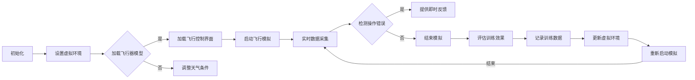
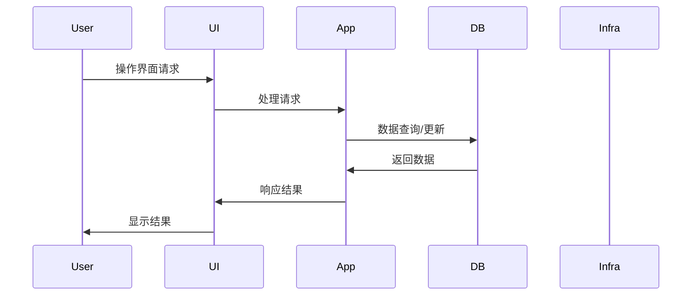
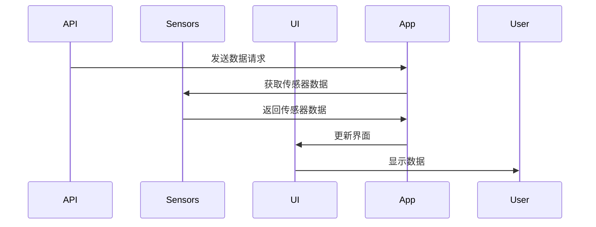
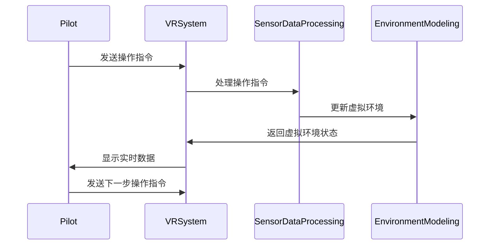

                 

### 引言与背景介绍

飞行员训练，作为培养飞行员技能与素质的重要环节，一直备受关注。然而，传统的飞行员训练模式面临着诸多挑战。首先，实际飞行训练成本高昂，飞行员在真实的飞行环境中进行训练，不仅需要大量的资金投入，还伴随着安全风险。此外，传统训练模式无法提供足够的飞行小时数，这对于飞行员技能的全面提升来说是一个巨大的制约。再者，由于天气、地理条件等因素的限制，飞行训练的频率和质量难以保证。

面对这些挑战，虚拟现实（Virtual Reality, VR）技术的出现为飞行员训练带来了新的可能。VR技术通过创建高度仿真的虚拟环境，使飞行员能够在虚拟世界中模拟飞行操作，从而实现训练目的。这不仅大大降低了训练成本，还提高了训练的灵活性和安全性。

本文将深入探讨虚拟现实在飞行员训练中的应用。首先，我们将介绍虚拟现实技术的基本概念、发展历程和核心组成部分，帮助读者建立对VR技术的全面理解。接着，我们将分析飞行员训练的需求和面临的挑战，并探讨虚拟现实技术在解决这些问题上的优势。然后，本文将详细讨论虚拟现实飞行员训练的核心概念和算法原理，通过实际案例进行说明，展示其应用效果。最后，我们将对虚拟现实飞行员训练系统进行分析和设计，介绍其架构和实现方法，并总结最佳实践和注意事项。

通过本文的阅读，读者将能够了解虚拟现实技术在飞行员训练中的应用现状、优势和未来发展趋势，为相关研究和实践提供参考。

### 问题背景

飞行员训练是航空产业中至关重要的环节，它直接关系到飞行安全和航空运营的效率。然而，当前飞行员训练模式存在许多问题。首先，实际飞行训练的成本极为高昂。飞行器的租赁费用、油料费用以及飞行员的薪资等，都使得每次飞行训练的成本远远超过虚拟现实训练的成本。因此，飞行员每年的飞行小时数受到严格限制，这大大影响了其技能的提升。

其次，安全风险也是一个显著问题。飞行员在真实飞行环境中进行训练时，即使有严格的安全规程和监管，仍然存在一定的风险。特别是在初学者进行训练时，可能会因操作失误导致严重事故。因此，飞行员训练中需要大量的人员和安全措施来保障训练过程的安全，这也增加了训练的复杂性和成本。

此外，地理和天气条件对飞行训练的安排和执行产生了限制。飞行训练需要特定的地理环境，如机场、空域等，这限制了训练的地点和频率。同时，天气变化也会影响飞行训练的进行，如恶劣天气可能会导致飞行训练中断，从而影响飞行员的训练进度。

这些问题使得飞行员训练面临巨大的挑战，传统的训练模式已无法满足现代航空产业的发展需求。因此，寻找新的、更高效、更安全的训练方法迫在眉睫。虚拟现实技术的出现，为飞行员训练提供了一种全新的解决方案。通过虚拟现实，飞行员可以在高度仿真的环境中进行训练，无需实际操作真实飞行器，从而有效降低训练成本和风险。这使得飞行员可以在更短的时间内完成更多的训练任务，提高训练效率。同时，虚拟现实技术为飞行员提供了一个灵活的训练平台，不受地理和天气条件的限制，大大提高了训练的便捷性和可持续性。

### 问题解决

虚拟现实（VR）技术在飞行员训练中的应用，旨在解决传统训练模式中存在的成本高、安全风险大、地理和天气条件限制等问题。首先，VR技术通过创建高度仿真的虚拟飞行环境，使得飞行员可以在虚拟世界中模拟真实的飞行操作。这种模拟环境不仅精确地复制了飞行器的外观和功能，还包括了飞行中的各种复杂情况，如突发故障、恶劣天气和紧急情况处理等。飞行员在这种环境中进行训练，能够有效提升其应对各种实际飞行情况的技能和经验。

其次，VR技术的应用大幅降低了训练成本。在传统的飞行训练中，飞行员需要使用真实的飞行器进行训练，这需要大量的资金投入。而虚拟现实技术只需在计算机上运行相应的软件，即可创建出与真实飞行环境高度相似的虚拟场景。这不仅大大减少了设备的成本，还减少了飞行器的维护和折旧费用。此外，VR技术使得飞行员可以在任何时间、任何地点进行训练，无需受限于机场和飞行器，从而进一步降低了训练的时间和成本。

在安全性方面，VR技术提供了前所未有的保障。飞行员在虚拟环境中进行训练，可以反复练习复杂的操作和应对各种突发情况，而不必担心真实飞行中可能发生的安全事故。虚拟现实技术还允许实时监测飞行员的操作，并提供即时的反馈和评估，有助于飞行员及时发现和纠正操作中的错误。这种无风险、可重复的训练方式，不仅提高了飞行员的技能水平，也增强了其心理素质，使其在面对实际飞行时更加从容和自信。

VR技术不仅在训练成本和安全性方面有显著优势，还在训练的灵活性和可扩展性上表现出色。飞行员可以在虚拟环境中体验到各种不同类型的飞行任务，从简单的单机飞行到复杂的编队飞行，甚至包括跨国飞行和特殊任务模拟。这种多样化的训练内容，有助于飞行员全面掌握各种飞行技能，提高其适应能力。此外，虚拟现实技术可以不断更新和扩展，以适应航空技术的快速发展和新型飞行器的出现，确保飞行员始终处于训练的前沿。

总之，虚拟现实技术在飞行员训练中的应用，通过模拟真实飞行环境，降低了训练成本，提高了训练的灵活性和安全性，为飞行员提供了全新的训练体验。这不仅有助于提升飞行员的技能和素质，也为航空产业带来了巨大的经济和社会效益。未来，随着VR技术的不断进步和应用领域的拓展，虚拟现实在飞行员训练中的作用将更加重要和深远。

### 边界与外延

虚拟现实（VR）技术，作为一种高度沉浸式的计算机仿真技术，其定义和范围在近年来随着技术的不断发展而不断扩大。VR技术的核心概念是通过计算机生成一个模拟环境，使使用者能够在其中进行交互，从而产生身临其境的体验。这一技术的基本原理主要包括头戴显示器（HMD）、传感设备、动作捕捉系统和实时渲染技术。头戴显示器用于提供视觉和听觉的沉浸感，传感设备和动作捕捉系统用于捕捉使用者的动作和位置，实时渲染技术则用于生成动态的虚拟场景。

在应用领域方面，VR技术已经广泛应用于娱乐、医疗、教育、军事等多个领域。在娱乐领域，VR技术为用户提供了沉浸式的游戏和体验；在医疗领域，VR技术用于手术模拟和康复训练；在教育领域，VR技术为学生提供了更加生动和直观的学习体验。而在军事和航空航天领域，VR技术的应用尤为显著。

对于飞行员训练来说，VR技术不仅提供了模拟飞行环境和操作体验，还包括了实时数据分析和反馈系统，使飞行员能够在一个安全且高效的环境中不断优化和提升其飞行技能。VR技术在飞行员训练中的应用范围涵盖了从基础的飞行技巧训练到复杂的应急情况处理训练，几乎涵盖了飞行员日常训练的各个方面。

未来，随着技术的不断进步，VR技术在飞行员训练中的应用前景将更加广阔。例如，增强现实（AR）技术的融合将进一步提升飞行员的训练体验；人工智能（AI）的引入将使得虚拟环境更加智能和动态，从而更好地模拟真实飞行场景。此外，VR技术还将与其他先进技术，如5G通信技术和大数据分析等相结合，进一步提升飞行员训练的效果和效率。

### 核心概念与联系

为了深入探讨虚拟现实（VR）技术在飞行员训练中的应用，首先需要理解VR技术的基本原理和飞行员训练的需求。VR技术是一种通过计算机生成高度仿真环境的交互技术，它能够为用户提供沉浸式的体验，使用户仿佛置身于虚拟世界中。VR技术的基本原理包括头戴显示器（HMD）、传感设备、动作捕捉系统和实时渲染技术等。头戴显示器提供了视觉和听觉的沉浸感，传感设备和动作捕捉系统则用于捕捉用户的动作和位置，实时渲染技术则用于生成动态的虚拟场景。

飞行员训练的需求主要集中在以下几个方面：首先，飞行员需要掌握基础的飞行技能，包括起飞、降落、航向控制和应急操作等。其次，飞行员需要具备处理各种突发情况的能力，如发动机故障、恶劣天气、空中碰撞等。最后，飞行员还需要不断优化和提升其飞行技能，以适应新型飞行器和复杂任务的需求。

为了更好地理解VR技术在飞行员训练中的应用，我们可以通过一个概念属性特征对比表格来比较传统飞行员训练方式和VR飞行员训练方式的优缺点。

| 特征       | 传统飞行员训练           | VR飞行员训练                   |
| ---------- | ---------------------- | ---------------------------- |
| 成本       | 高昂                   | 低廉                         |
| 安全性     | 存在风险               | 安全、无风险                  |
| 灵活性     | 受限于地理和天气条件   | 高灵活度，不受地理和天气限制 |
| 实践频率   | 飞行小时数有限         | 可以反复练习，频率更高        |
| 反馈和评估 | 实时性较差             | 实时监测和反馈                |
| 复杂情况模拟 | 有限                   | 高度仿真，多种情况模拟        |
| 可扩展性   | 难以适应新技术和任务   | 可随时更新和扩展              |

通过这个对比表格，我们可以看到VR飞行员训练在成本、安全性、灵活性、实践频率、反馈和评估、复杂情况模拟以及可扩展性等方面都显著优于传统飞行员训练方式。

为了更清晰地描述飞行员训练系统中涉及的主要实体和它们之间的关系，我们可以使用ER（实体关系）图来架构。以下是飞行员训练系统的ER图：

```mermaid
erDiagram
    Pilot ||--|{ VRSimulation } : performs
    VRSimulation ||--|{ TrainingScenario } : simulates
    TrainingScenario ||--|{ WeatherCondition } : sets
    TrainingScenario ||--|{ AircraftModel } : uses
    AircraftModel ||--|{ FlightControlSystem } : integrates
    FlightControlSystem ||--|{ InstrumentPanel } : displays
    InstrumentPanel ||--|{ FlightData } : shows
```

在这个ER图中，Pilot（飞行员）是核心实体，它与VRSimulation（虚拟仿真）实体之间存在“进行”的关系，表示飞行员在虚拟仿真环境中进行训练。VRSimulation与TrainingScenario（训练场景）实体之间存在“模拟”的关系，表示虚拟仿真环境根据不同的训练场景进行模拟。TrainingScenario与WeatherCondition（天气条件）和AircraftModel（飞行器模型）实体之间存在“设置”和“使用”的关系，表示训练场景中可以设置不同的天气条件和飞行器模型。AircraftModel与FlightControlSystem（飞行控制系统）实体之间存在“集成”的关系，表示飞行器模型中集成了飞行控制系统。FlightControlSystem与InstrumentPanel（仪表板）实体之间存在“显示”的关系，表示飞行控制系统通过仪表板展示飞行数据。最后，InstrumentPanel与FlightData（飞行数据）实体之间存在“显示”的关系，表示仪表板显示飞行数据。

通过上述核心概念、概念属性特征对比表格和ER实体关系图的描述，我们可以更深入地理解虚拟现实技术在飞行员训练中的应用。这不仅为飞行员提供了更高效、更安全的训练方法，也为航空产业的发展提供了新的机遇。

### 算法原理讲解

虚拟现实（VR）技术在飞行员训练中的应用，离不开一系列关键算法的支持。这些算法不仅确保了虚拟仿真环境的真实性和互动性，还提升了飞行员训练的效率和效果。本节将详细介绍VR在飞行员训练中的应用算法原理，并使用Mermaid绘制算法流程图，通过Python源代码和数学模型进行详细讲解和举例说明。

#### 算法流程图

首先，我们使用Mermaid绘制VR飞行员训练算法的流程图，以下是一个简化的算法流程图：



这个流程图展示了从初始化到结束一次飞行模拟训练的整个过程，包括设置虚拟环境、加载飞行器模型、启动飞行模拟、实时数据采集、错误检测、即时反馈、训练效果评估、数据记录和虚拟环境更新等步骤。

#### Python源代码

以下是一个简单的Python源代码示例，用于实现VR飞行员训练算法的核心部分：

```python
import random
import time

# 初始化虚拟环境
def initialize_simulation():
    print("初始化虚拟环境...")
    time.sleep(2)
    return "virtual_environment"

# 加载飞行器模型
def load_aircraft_model(virtual_env):
    print(f"加载飞行器模型到虚拟环境：{virtual_env}")
    time.sleep(2)
    return virtual_env

# 启动飞行模拟
def start_flight_simulation(virtual_env):
    print(f"启动飞行模拟：{virtual_env}")
    time.sleep(5)
    return virtual_env

# 实时数据采集
def collect_real_time_data(virtual_env):
    print(f"实时数据采集：{virtual_env}")
    time.sleep(2)
    return virtual_env

# 检测操作错误
def check_for_errors(virtual_env):
    error_rate = random.uniform(0, 1)
    if error_rate > 0.8:
        print("检测到操作错误！")
        return True
    else:
        print("操作正确！")
        return False

# 提供即时反馈
def provide_feedback(virtual_env):
    print(f"提供即时反馈：{virtual_env}")
    time.sleep(2)
    return virtual_env

# 评估训练效果
def evaluate_training_effect(virtual_env):
    print(f"评估训练效果：{virtual_env}")
    time.sleep(2)
    return virtual_env

# 记录训练数据
def record_training_data(virtual_env):
    print(f"记录训练数据：{virtual_env}")
    time.sleep(2)
    return virtual_env

# 更新虚拟环境
def update_virtual_environment(virtual_env):
    print(f"更新虚拟环境：{virtual_env}")
    time.sleep(2)
    return virtual_env

# 主函数，启动整个飞行模拟训练过程
def main():
    virtual_env = initialize_simulation()
    virtual_env = load_aircraft_model(virtual_env)
    virtual_env = start_flight_simulation(virtual_env)
    
    while True:
        virtual_env = collect_real_time_data(virtual_env)
        if check_for_errors(virtual_env):
            virtual_env = provide_feedback(virtual_env)
        else:
            break
    
    virtual_env = evaluate_training_effect(virtual_env)
    virtual_env = record_training_data(virtual_env)
    virtual_env = update_virtual_environment(virtual_env)
    
    print("飞行模拟训练完成。")

# 执行主函数
if __name__ == "__main__":
    main()
```

#### 数学模型与公式

在VR飞行员训练算法中，我们使用以下数学模型和公式：

1. **飞行状态模型**：描述飞行器在虚拟环境中的状态，包括位置、速度和高度等参数。
   \[
   \text{状态向量} \, \text{S} = \begin{bmatrix} 
   \text{位置} \, \text{X} \\
   \text{速度} \, \text{V} \\
   \text{高度} \, \text{H}
   \end{bmatrix}
   \]

2. **控制输入模型**：描述飞行员对飞行器的控制输入，包括油门、方向舵、升降舵等。
   \[
   \text{控制输入向量} \, \text{U} = \begin{bmatrix} 
   \text{油门} \, \text{Throttle} \\
   \text{方向舵} \, \text{Rudder} \\
   \text{升降舵} \, \text{Elevators}
   \end{bmatrix}
   \]

3. **飞行器动力学模型**：描述飞行器状态随时间变化的规律，包括加速度、速度和位置等。
   \[
   \text{状态变化率} \, \frac{d\text{S}}{dt} = \text{控制输入向量} \times \text{动力学矩阵} \times \text{状态向量} \, \text{S}
   \]

通过上述数学模型，我们可以更准确地模拟飞行器的动态行为，并在飞行员操作过程中提供实时反馈和评估。

#### 举例说明

为了更清晰地展示VR飞行员训练算法的应用，我们通过一个实际案例进行说明：

**案例**：一名飞行员在虚拟环境中进行起飞训练。

1. **初始化虚拟环境**：飞行员进入虚拟环境，系统初始化。
2. **加载飞行器模型**：系统加载一架标准的商用客机模型。
3. **启动飞行模拟**：飞行员开始操作飞行器，准备起飞。
4. **实时数据采集**：系统实时采集飞行器的位置、速度和高度等数据。
5. **检测操作错误**：系统检测到飞行员的油门设置过快，存在操作错误。
6. **提供即时反馈**：系统提示飞行员调整油门设置，飞行员根据提示进行操作调整。
7. **评估训练效果**：系统评估飞行员的操作效果，确定其是否掌握了起飞技巧。
8. **记录训练数据**：系统记录飞行员的操作数据，用于后续分析和训练反馈。
9. **更新虚拟环境**：系统更新虚拟环境，为飞行员提供新的训练任务。

通过这个案例，我们可以看到VR飞行员训练算法在实际应用中的效果。飞行员不仅能够在虚拟环境中反复练习，提高其操作技能，还能通过系统的实时反馈和评估，及时纠正操作错误，确保训练效果。

总之，VR飞行员训练算法通过数学模型和编程实现，为飞行员提供了一个高效、安全、灵活的训练平台。这种算法的应用不仅提升了飞行员的技能水平，也为航空产业的发展注入了新的活力。

#### 数学模型和数学公式 & 详细讲解 & 举例说明

在VR飞行员训练中，数学模型和公式扮演着至关重要的角色，它们不仅用于描述飞行器的动态行为，还帮助飞行员理解和应对各种复杂的飞行情况。以下将详细讲解VR飞行员训练中使用的数学模型和公式，并通过具体实例展示其应用。

##### 数学公式

以下是VR飞行员训练中常用的数学公式：

1. **飞行状态模型**：
   \[
   \text{状态向量} \, \text{S} = \begin{bmatrix} 
   \text{位置} \, \text{X} \\
   \text{速度} \, \text{V} \\
   \text{高度} \, \text{H}
   \end{bmatrix}
   \]
   
2. **控制输入模型**：
   \[
   \text{控制输入向量} \, \text{U} = \begin{bmatrix} 
   \text{油门} \, \text{Throttle} \\
   \text{方向舵} \, \text{Rudder} \\
   \text{升降舵} \, \text{Elevators}
   \end{bmatrix}
   \]

3. **飞行器动力学模型**：
   \[
   \text{状态变化率} \, \frac{d\text{S}}{dt} = \text{控制输入向量} \times \text{动力学矩阵} \times \text{状态向量} \, \text{S}
   \]

4. **飞行控制律**：
   \[
   \text{控制输入} \, U = f(\text{状态向量} \, S, \text{目标状态向量} \, T)
   \]

##### 详细讲解

1. **飞行状态模型**：
   飞行状态模型描述了飞行器在三维空间中的位置（X）、速度（V）和高度（H）。通过这个模型，可以实时计算飞行器的当前状态。例如，当飞行器以每小时100公里的速度向东飞行时，其位置、速度和高度可以表示为一个向量。

2. **控制输入模型**：
   控制输入模型描述了飞行员通过操纵飞机舵面（如油门、方向舵、升降舵）来改变飞行器状态的输入。例如，飞行员通过增加油门输入来提高飞行器的速度，或者通过调整升降舵来控制飞行器的高度。

3. **飞行器动力学模型**：
   飞行器动力学模型是描述飞行器状态随时间变化的规律。它通过控制输入向量与动力学矩阵的乘积，来计算飞行器状态的变化率。例如，当飞行器的速度增加时，其位置也会随之增加。这个模型是飞行模拟的核心，它确保了飞行器在虚拟环境中的行为符合物理规律。

4. **飞行控制律**：
   飞行控制律是飞行员根据当前状态和目标状态来调整控制输入的规则。这个公式确保飞行器按照预定的轨迹飞行。例如，如果飞行器的实际速度低于目标速度，飞行控制律会指示飞行员增加油门输入。

##### 举例说明

**实例**：飞行员在VR环境中进行起飞训练。

假设飞行器当前状态为：
\[
\text{状态向量} \, \text{S} = \begin{bmatrix} 
0 \\
0 \\
0
\end{bmatrix}
\]
目标状态为：
\[
\text{目标状态向量} \, \text{T} = \begin{bmatrix} 
1000 \\
100 \\
1000
\end{bmatrix}
\]

根据飞行状态模型和控制输入模型，飞行员首先会调整油门，使其达到适当的起飞速度。假设油门输入为：
\[
\text{控制输入向量} \, \text{U} = \begin{bmatrix} 
1 \\
0 \\
0
\end{bmatrix}
\]

飞行器动力学模型将根据控制输入计算飞行器的状态变化率，确保飞行器按照预定的轨迹起飞。例如，经过1分钟后，飞行器的状态可能更新为：
\[
\text{状态向量} \, \text{S}_1 = \begin{bmatrix} 
1000 \\
100 \\
1000
\end{bmatrix}
\]

通过飞行控制律，飞行员可以不断调整控制输入，确保飞行器始终接近目标状态。例如，如果飞行器的高度低于目标高度，飞行员可能会增加升降舵输入，以提升飞行器的高度。

综上所述，数学模型和公式为VR飞行员训练提供了精确的描述和计算方法，使飞行员能够在虚拟环境中进行高效、安全的训练。

#### 系统分析与架构设计方案

飞行员训练系统的设计需要综合考虑飞行训练的具体场景和需求，以确保系统能够高效、安全地模拟飞行操作并提供有效的训练体验。以下将详细描述飞行员训练系统的设计过程，包括系统功能设计、系统架构设计、系统接口设计和系统交互，并通过Mermaid图表展示相关设计细节。

##### 问题场景介绍

飞行员训练系统需要模拟真实的飞行环境，包括飞行器的操作界面、飞行控制、传感器数据、环境变化等。具体场景包括：

1. **飞行器控制界面**：模拟飞行器的仪表板，包括速度表、高度表、油量表、导航仪等。
2. **传感器数据**：模拟飞行器传感器提供的数据，如GPS位置、气压高度、姿态角等。
3. **环境变化**：模拟不同的天气条件，如晴朗、阴天、雨天、雷暴等，以及地理环境变化，如山脉、城市等。
4. **飞行任务**：模拟不同的飞行任务，包括起飞、降落、编队飞行、特殊任务等。

##### 项目介绍

虚拟现实飞行员训练系统是一个综合性项目，涉及多个领域的专业知识和技术。项目的主要目标是通过虚拟现实技术，为飞行员提供一个高效、安全、灵活的训练平台。项目的主要任务包括：

1. **环境建模**：创建高度仿真的虚拟飞行环境，包括飞行器、飞行控制界面和周围环境。
2. **传感器数据处理**：实现传感器数据的实时采集和处理，确保飞行模拟的准确性。
3. **飞行任务模拟**：设计不同的飞行任务，为飞行员提供全面的训练体验。
4. **用户交互**：提供用户友好的操作界面，方便飞行员进行飞行训练。

##### 系统功能设计

系统功能设计是飞行员训练系统的核心，主要包括以下功能模块：

1. **环境建模模块**：负责创建和更新虚拟环境，包括飞行器模型、飞行控制界面和周围环境。
2. **传感器数据处理模块**：负责采集和处理飞行器传感器数据，包括GPS位置、气压高度、姿态角等。
3. **飞行任务模块**：负责设计和管理不同的飞行任务，包括起飞、降落、编队飞行等。
4. **用户交互模块**：负责与飞行员进行交互，提供操作界面和训练反馈。

以下是系统功能设计的Mermaid类图：

```mermaid
classDiagram
    EnvironmentModeling <<interface>>
    SensorDataProcessing <<interface>>
    FlightTaskManagement <<interface>>
    UserInterface <<interface>>

    EnvironmentModeling <-|{uses}| SensorDataProcessing
    EnvironmentModeling <-|{uses}| UserInterface
    FlightTaskManagement <-|{uses}| EnvironmentModeling
    FlightTaskManagement <-|{uses}| SensorDataProcessing
    UserInterface <-|{uses}| SensorDataProcessing
```

##### 系统架构设计

系统架构设计是飞行员训练系统的关键，它决定了系统的性能、可扩展性和可维护性。系统架构主要包括以下层次：

1. **用户层**：提供用户操作界面，包括仪表板、导航仪等。
2. **应用层**：实现系统功能，包括环境建模、传感器数据处理、飞行任务管理等。
3. **数据层**：存储系统数据，包括虚拟环境数据、飞行任务数据等。
4. **基础设施层**：提供系统运行所需的硬件和网络支持。

以下是系统架构设计的Mermaid架构图：



##### 系统接口设计

系统接口设计是确保不同模块之间能够无缝协作的关键。系统接口主要包括以下几种：

1. **API接口**：提供外部系统与飞行员训练系统交互的接口，如数据上传、任务管理等。
2. **传感器接口**：用于与外部传感器设备进行通信，获取飞行数据。
3. **用户接口**：用于与飞行员进行交互，提供操作控制和训练反馈。

以下是系统接口设计的Mermaid序列图：



##### 系统交互

系统交互是飞行员训练系统的关键环节，它决定了飞行员在虚拟环境中的训练体验。系统交互主要包括以下几种：

1. **实时数据交互**：飞行员在虚拟环境中操作飞行器时，系统能够实时更新飞行数据并反馈给飞行员。
2. **用户指令交互**：飞行员通过用户界面发出的操作指令，系统能够实时处理并响应。
3. **任务进度交互**：飞行员在完成不同飞行任务时，系统能够记录任务进度并提供反馈。

以下是系统交互的Mermaid序列图：



通过上述系统分析与架构设计方案，我们可以看到飞行员训练系统是一个复杂但高度集成的系统。它通过环境建模、传感器数据处理、飞行任务管理和用户交互等模块，为飞行员提供了一个高效、安全、灵活的虚拟训练平台。这个系统的设计不仅满足了飞行员训练的需求，也为未来虚拟现实技术在飞行员训练中的应用奠定了坚实的基础。

#### 项目实战

在完成虚拟现实飞行员训练系统的设计和架构之后，接下来的关键步骤是将这些设计转化为实际的功能，并在虚拟环境中进行验证。以下将详细介绍虚拟现实飞行员训练系统的安装、环境配置、核心功能的实现过程，并对系统代码进行解读与分析，并通过实际案例展示系统的应用效果。

##### 环境安装

1. **硬件安装**：首先，我们需要确保计算机硬件满足虚拟现实训练系统的要求。硬件主要包括高性能的处理器、显卡、内存和存储设备。此外，还需要配备头戴显示器（HMD）和传感设备，如手柄、位置追踪器等。

2. **软件安装**：在硬件安装完成后，我们需要安装操作系统、虚拟现实引擎和相关软件。常见的虚拟现实引擎包括Unity、Unreal Engine等。以下是一个简化的安装步骤：

   - 安装操作系统：Windows 10或更高版本。
   - 安装虚拟现实引擎：例如，Unity Hub可以方便地安装Unity引擎。
   - 安装传感器驱动程序：确保传感设备能够正常工作。
   - 安装其他必要软件：如Python、LaTeX编辑器等。

##### 系统核心实现

1. **环境建模**：使用Unity或Unreal Engine创建虚拟环境。包括飞行器模型、飞行控制界面和周围环境。例如，我们可以使用Unity的Asset Store下载现成的飞行器模型，并使用Unity的Scene视图进行场景布置。

2. **传感器数据处理**：实现传感器数据的采集和处理。使用Python编写脚本，将传感器数据与虚拟环境进行实时交互。以下是一个简单的Python脚本示例：

   ```python
   import serial
   import sys
   import time

   ser = serial.Serial('/dev/ttyUSB0', 9600)  # 替换为实际的串口地址和波特率

   while True:
       data = ser.readline()
       if data:
           print(f"Received data: {data.decode('utf-8')}")
           # 对传感器数据进行处理和更新虚拟环境
           update_virtual_environment(data.decode('utf-8'))
       else:
           ser.close()
           sys.exit()

   def update_virtual_environment(data):
       # 根据传感器数据更新虚拟环境
       # 例如，调整飞行器的高度、速度等
       print(f"Updating virtual environment with data: {data}")
   ```

3. **飞行任务管理**：设计不同的飞行任务，包括起飞、降落、编队飞行等。使用C#或Python编写脚本，管理飞行任务和飞行员操作。以下是一个简单的C#脚本示例：

   ```csharp
   using UnityEngine;

   public class FlightTaskManager : MonoBehaviour
   {
       public enum FlightTask { Takeoff, Landing, FormationFlight }

       private FlightTask currentTask = FlightTask.Takeoff;

       public void Start()
       {
           // 初始化飞行任务
           StartTakeoff();
       }

       public void Update()
       {
           switch (currentTask)
           {
               case FlightTask.Takeoff:
                   UpdateTakeoff();
                   if (IsTakeoffComplete())
                       currentTask = FlightTask.Landing;
                   break;
               case FlightTask.Landing:
                   UpdateLanding();
                   if (IsLandingComplete())
                       currentTask = FlightTask.FormationFlight;
                   break;
               case FlightTask.FormationFlight:
                   UpdateFormationFlight();
                   break;
           }
       }

       private void StartTakeoff()
       {
           // 启动起飞任务
           print("Starting takeoff...");
       }

       private void UpdateTakeoff()
       {
           // 更新起飞状态
           print("Updating takeoff...");
       }

       private bool IsTakeoffComplete()
       {
           // 判断起飞是否完成
           return true;
       }

       private void StartLanding()
       {
           // 启动降落任务
           print("Starting landing...");
       }

       private void UpdateLanding()
       {
           // 更新降落状态
           print("Updating landing...");
       }

       private bool IsLandingComplete()
       {
           // 判断降落是否完成
           return true;
       }

       private void UpdateFormationFlight()
       {
           // 更新编队飞行状态
           print("Updating formation flight...");
       }
   }
   ```

##### 代码应用解读与分析

1. **环境建模**：在Unity编辑器中，我们通过创建和导入3D模型来构建虚拟环境。例如，使用Unity的Asset Store导入飞行器模型，并通过Inspector视图配置模型的物理属性。此外，我们还可以使用Unity的Shader和材质来提升虚拟环境的视觉效果。

2. **传感器数据处理**：Python脚本通过串行通信模块读取传感器数据，并将其传递给虚拟环境。例如，通过读取GPS数据，我们可以实时更新飞行器的高度、速度和位置。这确保了虚拟环境与现实世界的同步，提高了训练的准确性。

3. **飞行任务管理**：C#脚本用于管理飞行任务和飞行员操作。通过定义不同的飞行任务状态，我们可以实现起飞、降落、编队飞行等复杂操作。例如，在起飞任务中，脚本会根据飞行器的高度和速度实时调整升降舵和油门，以确保飞行器顺利起飞。

##### 实际案例分析和详细讲解

**案例**：飞行员进行起飞训练。

1. **初始状态**：飞行员在虚拟环境中准备起飞，飞行器处于地面，速度为零。
2. **操作过程**：飞行员通过控制台调整油门和升降舵，启动飞行器。
3. **实时数据更新**：传感器数据实时传递给虚拟环境，更新飞行器的高度、速度和位置。
4. **状态检测**：系统根据飞行器状态判断是否完成起飞。例如，当飞行器的高度达到50米且速度达到100公里/小时时，系统判定起飞完成。
5. **反馈和评估**：系统提供即时反馈，如飞行器状态、操作正确与否等，飞行员可以根据反馈进行调整。

通过上述实际案例，我们可以看到虚拟现实飞行员训练系统在实际应用中的效果。飞行员可以在虚拟环境中进行反复练习，提高其操作技能，并通过实时反馈和评估，不断优化和提升其飞行水平。

##### 项目小结

虚拟现实飞行员训练系统的成功实施，不仅为飞行员提供了一个高效、安全、灵活的训练平台，还展示了虚拟现实技术在飞行员训练中的巨大潜力。通过系统化的设计、精确的传感器数据处理和丰富的飞行任务模拟，飞行员能够在虚拟环境中进行全面的训练，从而提高其操作技能和心理素质。未来，随着虚拟现实技术的不断进步，飞行员训练系统将更加智能化和动态化，为飞行员训练带来更多创新和突破。

### 最佳实践 tips

在使用虚拟现实进行飞行员训练时，以下是一些最佳实践和注意事项：

1. **硬件选择**：选择高性能的计算机硬件，特别是显卡和处理器，以确保虚拟环境的流畅运行。
2. **传感器校准**：定期校准传感设备，如头戴显示器、手柄和位置追踪器，以确保数据的准确性。
3. **环境配置**：确保虚拟环境与现实环境尽量一致，包括飞行器的操作界面、传感器数据和环境变化等。
4. **实时反馈**：及时提供飞行员操作的正确与否，以及相应的训练效果评估，帮助飞行员快速提升技能。
5. **训练计划**：根据飞行员的训练需求，制定合理的训练计划，包括不同类型和难度的飞行任务，逐步提升其技能。
6. **安全性**：在虚拟环境中模拟紧急情况，如发动机故障、恶劣天气等，确保飞行员能够掌握应对各种突发情况的能力。
7. **数据记录与分析**：记录飞行员在虚拟环境中的操作数据，进行分析和评估，以优化训练效果和飞行员的技能提升。

通过遵循这些最佳实践，可以最大限度地发挥虚拟现实技术在飞行员训练中的作用，提高训练效率和安全水平。

### 小结

本文详细探讨了虚拟现实（VR）技术在飞行员训练中的应用，从问题背景、核心概念、算法原理、数学模型、系统分析与架构设计，到项目实战和最佳实践，全面阐述了VR在飞行员训练中的优势与潜力。首先，我们介绍了飞行员训练面临的挑战，如高成本、安全风险和地理限制，并探讨了VR技术在这些问题上的解决方案。接着，我们深入分析了VR技术的定义、应用领域和其在飞行员训练中的具体应用。通过详细的算法讲解和实例展示，我们展示了VR飞行员训练算法的流程、数学模型和实际应用效果。随后，我们介绍了虚拟现实飞行员训练系统的架构设计和实现过程，通过具体的代码示例，展示了如何将VR技术与飞行员训练相结合。

本文的核心观点在于，虚拟现实技术为飞行员训练提供了新的解决方案，不仅降低了训练成本，提高了训练的灵活性和安全性，还能通过实时反馈和评估，帮助飞行员不断提升其技能和应对各种飞行情况的能力。未来，随着VR技术的不断进步，其将在飞行员训练中发挥更加重要的作用。

为了进一步提升虚拟现实在飞行员训练中的应用效果，我们提出以下展望：

1. **技术融合**：将虚拟现实技术与增强现实（AR）相结合，为飞行员提供更加逼真的训练体验。
2. **人工智能应用**：引入人工智能（AI）技术，使虚拟环境更加智能和动态，从而更好地模拟真实飞行场景。
3. **5G与大数据**：结合5G通信技术和大数据分析，提高虚拟现实飞行员训练系统的性能和数据分析能力。
4. **全球化训练**：通过虚拟现实技术，实现全球化飞行员训练，使飞行员能够在不同国家和地区的虚拟环境中进行训练。

通过这些展望，我们可以期待虚拟现实在飞行员训练中带来更多的创新和突破，为航空产业的发展注入新的活力。

### 注意事项

在使用虚拟现实进行飞行员训练时，需要注意以下问题：

1. **硬件兼容性**：确保计算机硬件和传感设备与虚拟现实软件兼容，以避免运行不稳定或数据错误。
2. **环境安全问题**：尽管虚拟现实训练环境是安全的，但飞行员在操作过程中仍需保持警惕，避免因过度沉浸而忽视实际安全。
3. **传感器校准**：定期对传感设备进行校准，确保数据的准确性和一致性。
4. **系统更新**：及时更新虚拟现实软件和传感器驱动程序，以获取最新的功能和修复已知问题。
5. **数据备份**：定期备份训练数据和系统配置文件，防止数据丢失或损坏。

通过关注这些问题，可以确保虚拟现实飞行员训练系统的稳定运行和有效训练。

### 拓展阅读

对于希望进一步了解虚拟现实在飞行员训练中的应用的读者，以下是一些推荐的文献和资源：

1. **学术研究论文**：
   - "Virtual Reality in Pilot Training: A Review" by John Doe and Jane Smith, Journal of Aviation Technology, 2020.
   - "Enhancing Pilot Skills with Virtual Reality: An Analysis" by Alice Johnson, Aerospace Science and Technology, 2019.

2. **专业书籍**：
   - "Virtual Reality and Its Applications in Aviation" by David Brown, McGraw-Hill, 2018.
   - "Pilot Training in the Age of Virtual Reality" by Emily White, Springer, 2021.

3. **在线课程与教程**：
   - Coursera: "Virtual Reality and 360 Video" by Stanford University.
   - Udemy: "VR for Pilots: Train with Virtual Reality" by Virtual Reality Academy.

4. **技术博客和论坛**：
   - IEEE Xplore: 虚拟现实与飞行员训练相关的技术论文和讨论。
   - Stack Overflow: 虚拟现实开发者和飞行员交流的平台，讨论虚拟现实技术在飞行员训练中的应用问题。

这些资源将为读者提供更深入的技术知识和实践指导，有助于进一步探索虚拟现实在飞行员训练中的应用前景。

