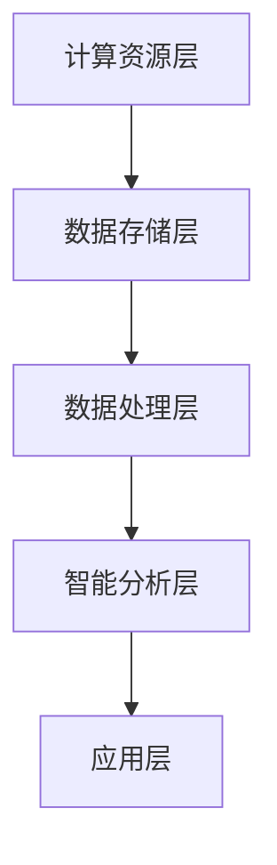
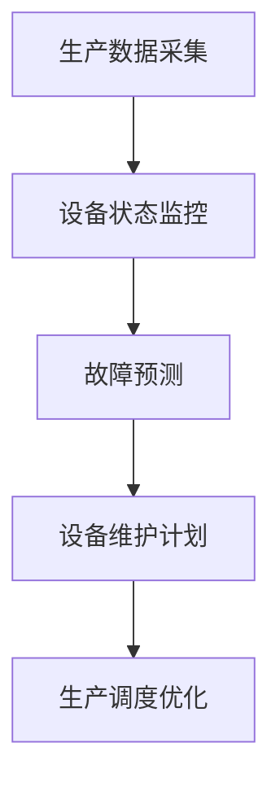
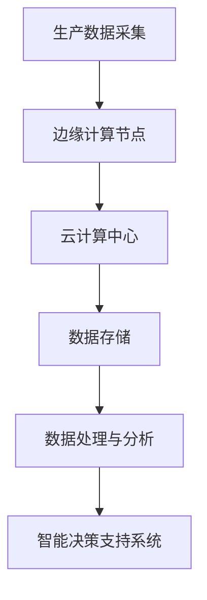
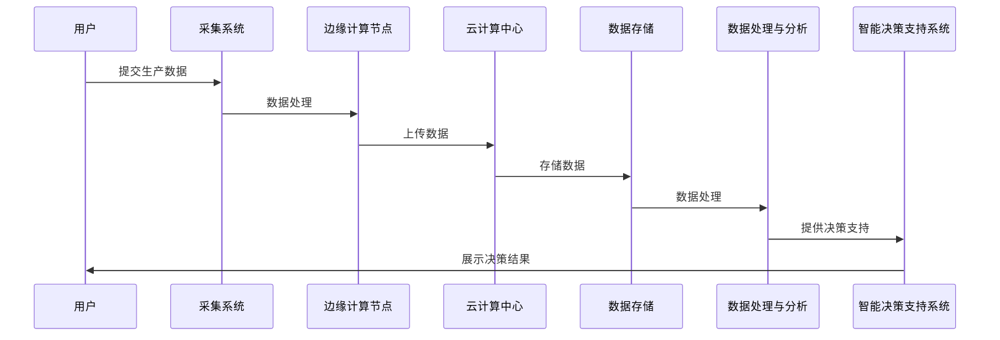

                 

# 《融合计算平台：企业数字化转型的技术基础》

## 关键词
- 融合计算平台
- 企业数字化转型
- 云计算
- 大数据
- 人工智能

## 摘要
本文将深入探讨融合计算平台在企业数字化转型中的重要性。通过逐步分析融合计算平台的核心概念、关键技术、应用场景和未来发展，本文旨在为企业提供数字化转型过程中的技术基础和实践指南。

## 第一部分：融合计算平台概述

### 第1章 融合计算平台概述

#### 1.1 背景介绍

在当今快速发展的数字化时代，企业面临着巨大的转型压力。数字化转型不仅是企业生存和发展的关键，更是提升竞争力的必然选择。在这一过程中，融合计算平台作为企业数字化转型的核心技术基础，扮演着至关重要的角色。

**问题背景**：企业在数字化转型过程中面临的挑战主要包括数据分散、系统集成难度大、决策效率低下等。这些挑战使得企业难以充分利用数据资源，无法实现智能化决策和高效运营。

**问题描述**：如何通过技术手段，实现企业内部各个业务系统的整合，提高数据利用率，提升决策效率，降低运营成本。

**问题解决**：融合计算平台通过整合多种计算技术与资源，为企业提供一个统一的技术架构，实现数据的高效集成和智能处理，从而解决数字化转型过程中遇到的问题。

**边界与外延**：融合计算平台主要涉及云计算、大数据和人工智能等技术，其应用范围包括企业内部各类业务系统，如财务、人力资源、生产制造等。

**概念结构与核心要素组成**：融合计算平台由计算资源层、数据存储层、数据处理层、智能分析层和应用层组成。计算资源层提供计算能力，数据存储层负责数据存储，数据处理层实现数据的采集、清洗和转换，智能分析层通过人工智能技术进行数据分析和决策支持，应用层则为用户提供业务应用。

### 1.2 融合计算平台的核心概念

**融合计算平台的定义**：融合计算平台是一种集成多种计算技术与资源的平台，旨在实现企业内部数据的高效集成、智能处理和利用。

**核心概念**：计算资源整合、数据处理与分析、智能化决策支持。

**属性特征对比表格**：

| 特性                 | 融合计算平台 | 传统计算平台 |
|----------------------|--------------|--------------|
| 计算资源整合         | 高度整合     | 分散         |
| 数据处理能力         | 强大         | 有限         |
| 决策支持             | 智能化       | 简单化       |
| 应用范围             | 广泛         | 狭窄         |
| 系统集成难度         | 低           | 高           |

### 1.3 融合计算平台的架构

融合计算平台的架构可以分为四个层次：计算资源层、数据存储层、数据处理层和智能分析层。

**ER实体关系图架构的 Mermaid 流程图**：



## 第二部分：融合计算平台的关键技术

### 第2章 融合计算平台的关键技术

#### 2.1 云计算技术

**云计算技术的定义与特点**：云计算是一种通过网络提供计算资源、存储资源和应用程序的服务模型。云计算具有弹性伸缩、按需分配、资源共享等特点。

**云计算技术在融合计算平台中的应用**：云计算技术可以提供强大的计算资源和存储能力，实现企业内部各个业务系统的资源整合和优化。例如，企业可以通过云服务提供商获取计算资源，根据业务需求动态调整资源使用，降低成本。

#### 2.2 大数据技术

**大数据技术的定义与处理流程**：大数据技术是一种用于处理海量数据的方法，包括数据采集、存储、处理、分析和应用等环节。

**大数据技术在融合计算平台中的应用**：大数据技术可以帮助企业实现对海量数据的快速处理和分析，为企业提供数据驱动的决策支持。例如，企业可以通过大数据技术分析客户行为数据，优化营销策略。

#### 2.3 人工智能技术

**人工智能技术的定义与分类**：人工智能技术是一种模拟人类智能行为的方法，包括机器学习、深度学习、自然语言处理等。

**人工智能技术在融合计算平台中的应用**：人工智能技术可以为企业提供智能化的决策支持，提升业务效率。例如，企业可以通过人工智能技术进行客户服务自动化，提高客户满意度。

## 第三部分：融合计算平台的应用场景

### 第3章 融合计算平台在企业中的应用场景

#### 3.1 制造业应用场景

**制造业应用场景介绍**：制造业在数字化转型过程中面临着生产效率低下、设备维护困难等问题。

**应用案例**：某制造企业通过融合计算平台实现了生产过程的智能监控和设备维护优化，提高了生产效率和设备利用率。

#### 3.2 零售业应用场景

**零售业应用场景介绍**：零售业在数字化转型过程中面临着库存管理困难、客户需求变化快等问题。

**应用案例**：某零售企业通过融合计算平台实现了智能库存管理和精准营销，提升了客户满意度和销售额。

#### 3.3 金融业应用场景

**金融业应用场景介绍**：金融业在数字化转型过程中面临着风险控制难、业务流程复杂等问题。

**应用案例**：某金融机构通过融合计算平台实现了风险预测和智能客户服务，提高了业务效率和客户满意度。

## 第四部分：融合计算平台的发展趋势

### 第4章 融合计算平台的发展趋势

#### 4.1 融合计算平台的技术演进

随着技术的不断进步，融合计算平台也在不断演进。未来，融合计算平台可能会在以下几个方面取得突破：

- **边缘计算**：将计算能力延伸到网络边缘，实现更快速的数据处理和响应。
- **量子计算**：利用量子计算技术提高数据处理速度和复杂度。
- **区块链**：通过区块链技术实现数据的安全共享和透明化。

#### 4.2 融合计算平台在数字化转型中的角色

融合计算平台在数字化转型中的角色将越来越重要。它不仅可以帮助企业实现业务系统的整合和优化，还可以提供智能化的决策支持，为企业创造更多的价值。

## 第五部分：案例研究

### 第5章 融合计算平台案例研究

#### 5.1 案例介绍

本案例研究选取了一家制造企业，通过融合计算平台实现了生产过程的智能监控和设备维护优化。

#### 5.2 系统分析与架构设计方案

**系统功能设计（领域模型 Mermaid 类图）**：



**系统架构设计（Mermaid 架构图）**：



**系统接口设计和系统交互（Mermaid 序列图）**：



#### 5.3 项目实施与关键技术

**环境安装**：项目采用云计算平台和边缘计算设备，实现生产数据的高效采集和处理。

**系统核心实现源代码**：

```python
# 生产数据采集
def collect_production_data():
    # 实现生产数据采集逻辑
    pass

# 设备状态监控
def monitor_device_status():
    # 实现设备状态监控逻辑
    pass

# 故障预测
def predict_device_failure():
    # 实现故障预测逻辑
    pass

# 设备维护计划
def plan_device_maintenance():
    # 实现设备维护计划逻辑
    pass

# 生产调度优化
def optimize_production_scheduling():
    # 实现生产调度优化逻辑
    pass
```

**代码应用解读与分析**：上述代码实现了生产数据采集、设备状态监控、故障预测、设备维护计划和生产调度优化等功能。通过这些功能，实现了生产过程的智能监控和优化。

#### 5.4 实际案例分析与详细讲解剖析

通过本案例研究，可以看出融合计算平台在制造业中的应用效果显著。通过数据采集和智能分析，企业能够实现生产过程的实时监控和优化，提高生产效率，降低设备故障率。

## 第六部分：最佳实践与总结

### 第6章 最佳实践与总结

#### 6.1 最佳实践

- **数据整合**：实现数据的高效整合是融合计算平台的关键。企业应采用统一的数据存储和数据处理框架，确保数据的一致性和完整性。
- **弹性伸缩**：云计算技术为融合计算平台提供了弹性伸缩的能力。企业应根据业务需求动态调整资源使用，降低成本。
- **安全合规**：在融合计算平台的建设过程中，应重视数据安全和合规性问题，确保数据的安全性和合法性。

#### 6.2 小结

融合计算平台是企业数字化转型的核心技术基础。通过整合云计算、大数据和人工智能等技术，融合计算平台能够实现企业内部数据的高效集成和智能处理，为企业提供智能化决策支持，提升业务效率和竞争力。

#### 6.3 注意事项

- **技术选型**：在融合计算平台的建设过程中，应选择适合企业业务需求和技术水平的技术方案。
- **团队协作**：融合计算平台的建设需要跨部门的协作，确保项目的顺利进行。

#### 6.4 拓展阅读

- **《云计算技术综述》**：详细介绍了云计算的基本概念、技术和应用场景。
- **《大数据技术导论》**：介绍了大数据的基本概念、技术和应用。
- **《人工智能：一种现代的方法》**：详细介绍了人工智能的基本概念、技术和应用。

## 作者信息

作者：AI天才研究院/AI Genius Institute & 禅与计算机程序设计艺术 /Zen And The Art of Computer Programming

