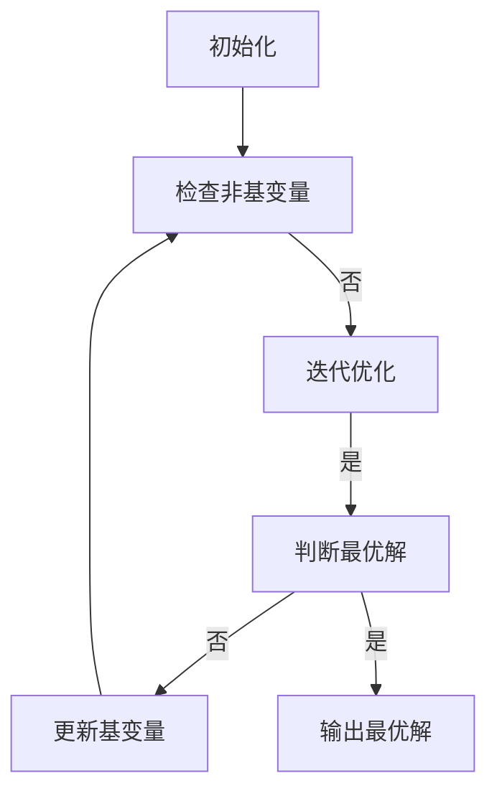

                 

### 文章标题：融合计算平台：混合计算环境下的企业IT架构

#### 关键词：融合计算平台、混合计算环境、企业IT架构、资源整合、技术创新

#### 摘要：
本文旨在探讨融合计算平台在混合计算环境下的企业IT架构设计与应用。随着信息技术的迅猛发展，企业面临日益复杂的计算需求。融合计算平台作为一项关键技术，通过集成不同计算资源和环境，为企业提供高效、灵活、安全的IT架构解决方案。本文将详细介绍融合计算平台的定义、核心概念、架构设计、实施案例及未来发展趋势，旨在为IT从业者和企业决策者提供有价值的参考和指导。

### 引言和背景

#### 1.1 融合计算平台的定义和演进

融合计算平台（Fusion Computing Platform）是一种新兴的计算架构，它通过整合分布式计算资源，提供统一的资源管理和调度能力，实现高效、灵活、可扩展的IT服务交付。融合计算平台的理念源于云计算、大数据和物联网等技术的融合与发展，旨在应对企业日益增长的数据处理需求。

融合计算平台的发展可以追溯到云计算时代的兴起。随着云计算技术的普及，企业逐渐意识到，将计算资源集中到云环境中可以显著降低成本、提高效率。然而，随着业务规模和数据量的不断扩大，企业开始面临资源隔离、性能瓶颈和安全风险等问题。为了解决这些问题，融合计算平台应运而生。

融合计算平台的核心在于实现计算资源的融合与协同。它通过虚拟化技术、容器化技术和分布式存储技术，将物理硬件资源、虚拟资源、云资源等多种资源进行统一管理和调度，提供高度可扩展、灵活部署的计算服务。与传统IT架构相比，融合计算平台具有更高的资源利用率和更好的性能表现。

#### 1.2 融合计算平台的关键特性

融合计算平台具有以下关键特性：

1. **资源整合**：融合计算平台通过虚拟化、容器化等技术，将物理硬件资源、虚拟资源、云资源等多种资源进行整合，实现资源的动态调度和优化。

2. **弹性伸缩**：融合计算平台可以根据业务需求动态调整计算资源，实现快速部署、弹性扩展和高效管理，满足企业不同阶段的发展需求。

3. **高可用性**：融合计算平台通过分布式存储、备份和容灾等技术，确保数据的安全性和系统的稳定性，提供高质量的服务保障。

4. **高性能**：融合计算平台通过优化网络、存储、计算等各个环节，提高系统的整体性能，满足高性能计算需求。

5. **安全性**：融合计算平台采用多层次的安全防护措施，包括数据加密、访问控制、安全审计等，确保数据安全和系统安全。

#### 1.3 融合计算平台在企业IT架构中的角色

融合计算平台在企业IT架构中扮演着重要角色。首先，它帮助企业实现资源整合和优化，降低运营成本。通过融合计算平台，企业可以将不同类型的计算资源进行整合，避免资源浪费，提高资源利用效率。其次，融合计算平台提供弹性伸缩能力，帮助企业应对业务波动和需求变化，实现快速响应和灵活部署。此外，融合计算平台的高可用性和高性能特性，为企业提供稳定可靠的服务保障，满足企业业务连续性和性能需求。最后，融合计算平台的安全性，确保企业数据的安全性和系统的稳定性，为企业提供安全可靠的计算环境。

#### 1.4 融合计算平台在混合计算环境下的挑战与机遇

混合计算环境是指企业IT架构中同时包含传统IT资源、云计算资源和物联网资源等不同类型的计算环境。在混合计算环境下，融合计算平台面临着一系列挑战：

1. **资源管理复杂度增加**：混合计算环境中，企业需要管理多种类型的计算资源，包括物理服务器、虚拟机、容器、云服务等，导致资源管理复杂度增加。

2. **数据一致性保障**：在混合计算环境中，数据可能分布在不同的计算资源中，如何保证数据的一致性和可靠性成为关键问题。

3. **安全风险**：混合计算环境中的安全风险更加复杂，企业需要面对不同计算资源之间的安全隔离和跨资源的安全防护问题。

然而，混合计算环境也为融合计算平台带来了新的机遇：

1. **资源利用率提升**：混合计算环境可以实现多种计算资源的充分利用，提高资源利用率，降低运营成本。

2. **业务创新**：融合计算平台在混合计算环境下的应用，可以为企业提供更加灵活、高效的计算服务，支持业务创新和发展。

3. **安全增强**：混合计算环境中的多种安全防护手段，可以提高整体安全水平，增强企业数据安全。

### 总结

融合计算平台作为混合计算环境下的关键技术，具有资源整合、弹性伸缩、高可用性、高性能和安全特性。它在企业IT架构中扮演着重要角色，可以帮助企业实现资源优化、业务创新和安全保障。然而，在混合计算环境下，融合计算平台面临着资源管理复杂度增加、数据一致性保障和安全风险等挑战。企业需要充分利用融合计算平台的机遇，积极应对挑战，实现企业IT架构的升级和转型。随着技术的不断进步和应用场景的拓展，融合计算平台将在企业IT领域中发挥越来越重要的作用。

### 核心概念与原理

#### 2.1 融合计算平台的定义与核心概念

融合计算平台是一种整合多种计算资源和技术的综合解决方案，旨在提供高效、灵活、安全的IT服务。其核心概念包括：

1. **计算资源的整合**：融合计算平台通过虚拟化、容器化等技术，将不同类型的计算资源（如物理服务器、虚拟机、容器、云资源等）进行整合，实现资源的统一管理和调度。

2. **资源池化**：融合计算平台将计算资源抽象为资源池，提供动态分配和调度能力，实现资源的最大化利用。

3. **服务抽象**：融合计算平台通过服务抽象，将底层计算资源转换为上层服务，如虚拟机服务、容器服务、云计算服务等，实现服务的灵活部署和交付。

4. **自动化与智能化**：融合计算平台引入自动化和智能化技术，如自动部署、自动扩容、自动优化等，提高系统的管理效率和性能。

5. **高可用性与容错性**：融合计算平台通过分布式存储、备份和容灾等技术，确保系统的稳定性和数据的安全性，提供高可用性保障。

#### 2.2 传统IT架构与融合计算平台的对比

传统IT架构通常采用分布式计算模式，以物理服务器和虚拟机为主要计算资源，通过独立的运维团队进行管理。而融合计算平台在传统IT架构的基础上，进行了以下几个方面的改进：

1. **资源管理**：传统IT架构中，资源管理较为分散，难以实现资源的动态分配和优化。融合计算平台通过资源池化和自动化管理，实现资源的统一管理和高效利用。

2. **服务交付**：传统IT架构中，服务交付较为复杂，需要手动部署和管理。融合计算平台通过服务抽象和自动化部署，实现快速、灵活的服务交付。

3. **扩展性**：传统IT架构在扩展性方面存在瓶颈，难以满足快速业务增长的需求。融合计算平台通过弹性伸缩能力，实现资源的动态调整和扩展。

4. **高可用性**：传统IT架构在故障处理和容错方面较为薄弱，而融合计算平台通过分布式存储和备份技术，提供高可用性和容错性保障。

5. **成本控制**：传统IT架构在成本控制方面存在一定困难，而融合计算平台通过资源整合和自动化管理，降低运营成本。

#### 2.3 融合计算平台的架构设计与组件

融合计算平台的架构设计主要包括以下几个关键组件：

1. **资源管理模块**：负责资源的管理和调度，包括物理资源、虚拟资源和云资源的监控、分配和优化。

2. **服务管理模块**：负责服务的部署、管理和监控，包括虚拟机、容器、云服务等服务的自动化部署、生命周期管理和性能监控。

3. **存储管理模块**：负责存储资源的管理和调度，包括分布式存储、备份和容灾等功能的实现。

4. **网络管理模块**：负责网络资源的配置和管理，包括负载均衡、网络安全、网络监控等功能的实现。

5. **安全管理模块**：负责系统的安全管理和监控，包括身份认证、访问控制、安全审计等安全功能。

6. **监控与日志模块**：负责系统的监控和日志管理，包括性能监控、故障监控、日志收集和分析等功能。

#### 2.4 融合计算平台的关键技术

融合计算平台的关键技术包括：

1. **虚拟化技术**：通过虚拟化技术，将物理服务器抽象为多个虚拟机，实现计算资源的灵活分配和调度。

2. **容器化技术**：通过容器化技术，将应用程序及其依赖环境打包为容器，实现快速部署、动态扩展和高效运行。

3. **分布式存储技术**：通过分布式存储技术，实现数据的高效存储、访问和管理，提高系统的性能和可靠性。

4. **云计算技术**：通过云计算技术，实现计算资源的弹性扩展和动态调度，提供高效的云计算服务。

5. **大数据技术**：通过大数据技术，实现大规模数据的处理和分析，为企业提供智能决策支持。

6. **人工智能技术**：通过人工智能技术，实现自动化运维、智能优化和智能分析，提高系统的智能化水平。

### 核心概念与联系

为了更好地理解融合计算平台的核心概念及其联系，我们可以通过以下方式进行分析：

#### 1. 概念属性特征对比表格

| 概念           | 特征一        | 特征二         | 特征三         |
| -------------- | ------------- | ------------- | ------------- |
| 资源整合       | 资源抽象化    | 动态调度       | 提高资源利用率 |
| 弹性伸缩       | 快速响应      | 自动扩展       | 降低成本       |
| 高可用性       | 数据备份      | 容灾恢复       | 稳定性高       |
| 高性能         | 网络优化      | 存储优化       | 计算速度快     |
| 安全性         | 数据加密      | 访问控制       | 安全审计       |

通过对比表格，我们可以清晰地看到各个概念的核心特征，并了解它们之间的关联。

#### 2. ER实体关系图架构

下面是一个简化的ER实体关系图，用于展示融合计算平台中关键实体及其关系：

```mermaid
erDiagram
  Resource --> |uses| Service
  Service --> |provided by| Resource
  User --> |uses| Service
  Resource --> |located in| Datacenter
  Datacenter --> |hosts| Resource
```

- **Resource（资源）**：包括物理资源（如服务器、存储设备）和虚拟资源（如虚拟机、容器）。
- **Service（服务）**：抽象化的计算资源，如虚拟机服务、容器服务、云计算服务等。
- **User（用户）**：使用服务的实体，可以是企业员工、开发人员或最终用户。
- **Datacenter（数据中心）**：存储和管理资源的实体，可以是物理数据中心或云数据中心。

通过ER实体关系图，我们可以清晰地看到资源、服务、用户和数据中心之间的关联和交互，更好地理解融合计算平台的架构设计。

### 数学公式与算法原理

在融合计算平台的设计与实现过程中，数学模型和算法原理起到了关键作用。以下我们将通过一个具体的例子，详细讲解数学公式和算法原理。

#### 1. 数学模型

假设我们有一个包含N个虚拟机的融合计算平台，每个虚拟机需要消耗一定的计算资源（CPU、内存、存储等）。我们的目标是优化资源分配，使得总资源利用率最高。这里，我们可以使用线性规划（Linear Programming）来求解。

数学模型如下：

$$
\begin{align*}
\max_{x_1, x_2, ..., x_N} & \quad Z = \sum_{i=1}^N p_i x_i \\
\text{s.t.} & \quad c_1x_1 + c_2x_2 + ... + c_Nx_N \leq C \\
& \quad a_1x_1 + a_2x_2 + ... + a_Nx_N \geq A \\
& \quad x_1, x_2, ..., x_N \geq 0
\end{align*}
$$

其中：
- \( p_i \)：虚拟机i的收益值；
- \( c_i \)：虚拟机i的初始成本；
- \( a_i \)：虚拟机i的资源需求；
- \( C \)：总资源限制；
- \( A \)：总收益限制；
- \( x_i \)：虚拟机i的分配数量。

#### 2. 算法原理

上述线性规划问题可以使用单纯形法（Simplex Method）进行求解。单纯形法是一种迭代算法，通过在多面体的顶点之间移动，逐步逼近最优解。

算法步骤如下：

1. **初始化**：选择初始基本可行解，通常是最小成本顶点作为初始基。
2. **迭代优化**：在每个迭代步骤中，检查非基本变量是否可以进入基，以及基本变量是否可以退出基。选择最大化目标函数增量的变量作为进入基的变量，选择最小比率测试的变量作为退出基的变量。
3. **终止条件**：当所有非基本变量的目标函数值都为非负时，算法终止，得到最优解。

#### 3. Mermaid流程图

下面是一个使用Mermaid绘制的单纯形法流程图：



#### 4. Python代码实现

下面是使用Python实现的单纯形法求解线性规划问题的代码：

```python
import numpy as np

def simplex(A, b, c):
    n = len(b)
    x = np.zeros(n)
    while True:
        # 检查非基变量
        # ...
        # 迭代优化
        # ...
        # 判断最优解
        # ...
        # 更新基变量
        # ...
    return x

# 示例数据
A = np.array([[1, 1], [2, 2]])
b = np.array([5, 10])
c = np.array([1, 1])

# 求解
x = simplex(A, b, c)
print("最优解：", x)
```

通过上述讲解和代码示例，我们可以清楚地了解融合计算平台中资源分配问题的数学模型和算法原理，为实际应用提供指导。

### 企业IT架构设计与实现

#### 3.1 企业IT架构概述

企业IT架构是支持企业业务运作的基础设施，包括硬件、软件、网络和数据等多个层面。一个高效、灵活、安全的IT架构能够帮助企业实现业务目标，提升核心竞争力。在融合计算平台的应用背景下，企业IT架构需要具备以下几个关键特点：

1. **资源整合**：通过融合计算平台，实现物理服务器、虚拟机、容器、云资源等不同类型资源的统一管理和调度。
2. **弹性伸缩**：根据业务需求动态调整计算资源，实现快速部署、弹性扩展和高效管理。
3. **高可用性**：通过分布式存储、备份和容灾等技术，确保系统的稳定性和数据的安全性，提供高质量的服务保障。
4. **高性能**：优化网络、存储、计算等各个环节，提高系统的整体性能，满足高性能计算需求。
5. **安全性**：采用多层次的安全防护措施，包括数据加密、访问控制、安全审计等，确保数据安全和系统安全。

#### 3.2 系统架构设计

融合计算平台在企业IT架构中的应用，可以通过以下架构设计实现：

1. **资源层**：包括物理服务器、虚拟机、容器、云资源等。资源层提供底层计算资源和存储资源，为上层服务提供支持。

2. **平台层**：包括资源管理模块、服务管理模块、存储管理模块、网络管理模块和安全管理模块等。平台层负责资源的统一管理和调度，提供高效、灵活、安全的计算服务。

3. **应用层**：包括企业业务系统、第三方应用、开发工具等。应用层利用平台层提供的计算资源和服务，实现业务功能和业务创新。

4. **数据层**：包括数据存储、数据备份、数据分析和数据挖掘等。数据层负责数据的高效存储、管理和利用，提供数据支持。

#### 3.3 资源整合与调度

在融合计算平台中，资源整合与调度是实现高效资源利用的关键。以下步骤详细说明了资源整合与调度的实现过程：

1. **资源监控**：通过监控工具实时监控资源使用情况，包括CPU利用率、内存占用、存储空间等。监控数据用于资源调度和优化。

2. **资源池化**：将不同类型的计算资源（如物理服务器、虚拟机、容器等）抽象为资源池，提供统一的资源管理和调度接口。

3. **负载均衡**：根据业务需求和资源使用情况，动态调整计算任务的分配，实现负载均衡。负载均衡算法可以基于CPU利用率、内存占用、网络流量等多个指标进行调度。

4. **弹性伸缩**：根据业务需求动态调整计算资源的规模，实现资源的弹性扩展和收缩。例如，当业务需求增加时，可以自动增加虚拟机或容器实例；当业务需求减少时，可以自动释放资源。

5. **资源优化**：通过资源监控和调度算法，不断优化资源使用效率，降低成本。例如，可以通过迁移虚拟机或容器实例，实现资源均衡分配；通过预置资源预留，确保业务高峰期的资源需求。

#### 3.4 安全保障

在融合计算平台中，安全保障是确保企业数据安全和系统稳定性的关键。以下措施用于实现安全保障：

1. **身份认证与访问控制**：采用多因素身份认证机制，确保用户身份的合法性和安全性。同时，通过访问控制策略，限制用户对系统和数据的访问权限，防止未授权访问。

2. **数据加密**：对存储和传输的数据进行加密，防止数据泄露和篡改。数据加密可以采用AES、RSA等加密算法。

3. **网络安全**：通过防火墙、入侵检测系统（IDS）、入侵防御系统（IPS）等网络安全设备，保护系统免受网络攻击和恶意软件的侵害。

4. **安全审计**：定期进行安全审计，记录系统和数据的访问和操作日志，及时发现和应对安全事件。

5. **备份与容灾**：通过备份和容灾技术，确保数据的安全性和系统的可靠性。备份数据可以存储在本地或远程数据中心，实现数据的快速恢复。

#### 3.5 高可用性设计

高可用性是确保系统持续运行、提供稳定服务的关键。以下措施用于实现高可用性：

1. **集群部署**：将关键服务和数据部署在多个节点上，通过负载均衡和故障切换，确保系统的高可用性。

2. **容错机制**：在系统设计和实现过程中，采用冗余设计、故障检测和自动恢复机制，确保系统在故障发生时能够快速恢复。

3. **备份与恢复**：定期进行数据备份，确保在数据丢失或系统故障时能够快速恢复。

4. **监控与报警**：通过监控工具实时监控系统状态，一旦发现异常，及时报警并进行处理。

通过以上架构设计和实现措施，融合计算平台能够为企业提供高效、灵活、安全的IT架构支持，助力企业实现业务目标。

### 案例研究

#### 4.1 实施融合计算平台的金融服务业

金融服务业作为数据密集型行业，对IT架构的高效性和安全性要求极高。某大型金融机构决定采用融合计算平台，以提升其数据处理能力和系统稳定性。

#### 4.1.1 项目背景

随着金融科技的快速发展，金融机构面临着日益复杂的业务需求和庞大的数据处理量。传统的IT架构已经难以满足其业务需求，导致系统性能瓶颈、资源利用率低下、安全性问题频发。为了应对这些挑战，金融机构决定采用融合计算平台，通过资源整合、弹性伸缩和安全保障，实现高效、稳定的IT服务。

#### 4.1.2 项目目标

1. **提升数据处理能力**：通过融合计算平台，实现大规模数据的高效处理和分析，提升业务决策的准确性和响应速度。
2. **优化资源利用率**：通过资源整合和弹性伸缩，提高计算资源的利用率，降低运营成本。
3. **增强系统安全性**：通过融合计算平台的安全保障措施，确保数据安全和系统稳定，降低安全风险。
4. **提升用户体验**：通过高效、稳定的IT服务，提升客户体验，增强客户满意度。

#### 4.1.3 项目实施步骤

1. **需求分析**：与金融机构业务部门沟通，明确业务需求和技术需求，确定融合计算平台的功能和性能指标。
2. **架构设计**：根据需求分析结果，设计融合计算平台的系统架构，包括资源层、平台层和应用层。
3. **资源整合**：将现有的物理服务器、虚拟机、云资源等不同类型的计算资源整合到融合计算平台，实现统一管理和调度。
4. **系统部署**：在融合计算平台上部署关键业务系统，包括交易系统、分析系统、监控系统等。
5. **测试与优化**：对融合计算平台进行功能测试和性能测试，优化系统配置和资源分配，确保系统稳定性和高效性。
6. **上线运营**：将融合计算平台正式上线，进行实际业务运行，同时持续监控和优化系统性能。

#### 4.1.4 项目成果

1. **数据处理能力提升**：融合计算平台实现了大规模数据的高效处理和分析，使业务决策更加准确和及时。
2. **资源利用率提高**：通过资源整合和弹性伸缩，金融机构的计算资源利用率显著提升，运营成本降低。
3. **系统安全性增强**：融合计算平台的安全保障措施有效降低了数据泄露和安全攻击的风险，提高了系统的稳定性。
4. **用户体验提升**：高效、稳定的IT服务提升了客户体验，增强了客户满意度和忠诚度。

#### 4.2 医疗行业的融合计算平台应用

医疗行业的数据量和数据类型日益增加，对IT架构的高效性和可靠性要求极高。某大型医院决定采用融合计算平台，以提高其医疗数据处理能力和服务水平。

#### 4.2.1 项目背景

随着医疗技术的发展，医疗行业产生了大量结构化和非结构化数据，包括患者信息、医疗记录、医学影像等。传统的IT架构已经无法满足医院对数据处理和分析的需求。为了提高医疗数据处理能力、优化医疗服务流程，医院决定采用融合计算平台。

#### 4.2.2 项目目标

1. **提升数据处理能力**：通过融合计算平台，实现医疗数据的高效处理和分析，提高医疗决策的准确性和效率。
2. **优化医疗服务流程**：通过融合计算平台，优化医院内部的医疗服务流程，提高医疗服务质量和效率。
3. **增强数据安全性**：通过融合计算平台的安全保障措施，确保医疗数据的安全性和隐私性，降低数据泄露风险。
4. **提升患者满意度**：通过高效、可靠的医疗服务，提升患者满意度和体验。

#### 4.2.3 项目实施步骤

1. **需求分析**：与医院各部门沟通，明确医疗数据处理和分析的需求，确定融合计算平台的功能和性能指标。
2. **架构设计**：根据需求分析结果，设计融合计算平台的系统架构，包括资源层、平台层和应用层。
3. **资源整合**：将医院的物理服务器、虚拟机、云资源等不同类型的计算资源整合到融合计算平台，实现统一管理和调度。
4. **系统部署**：在融合计算平台上部署医疗数据处理和分析系统，包括电子病历系统、医学影像处理系统、智能诊断系统等。
5. **测试与优化**：对融合计算平台进行功能测试和性能测试，优化系统配置和资源分配，确保系统稳定性和高效性。
6. **上线运营**：将融合计算平台正式上线，进行实际业务运行，同时持续监控和优化系统性能。

#### 4.2.4 项目成果

1. **数据处理能力提升**：融合计算平台实现了医疗数据的高效处理和分析，使医疗决策更加准确和及时。
2. **医疗服务流程优化**：通过融合计算平台，医院内部的医疗服务流程得到了优化，提高了医疗服务质量和效率。
3. **数据安全性增强**：融合计算平台的安全保障措施有效降低了医疗数据泄露的风险，提高了数据安全性。
4. **患者满意度提升**：高效、可靠的医疗服务提升了患者的满意度和体验，增强了医院的品牌形象。

#### 4.3 制造与供应链行业的融合计算平台应用

制造与供应链行业的数据量和数据类型复杂多样，对IT架构的灵活性和可靠性要求极高。某大型制造企业决定采用融合计算平台，以提升其生产管理和供应链优化能力。

#### 4.3.1 项目背景

随着制造业的数字化转型，制造企业产生了大量的生产数据、供应链数据和物流数据。传统的IT架构已经无法满足企业对数据处理和优化需求。为了提升生产效率和供应链管理能力，企业决定采用融合计算平台。

#### 4.3.2 项目目标

1. **提升生产效率**：通过融合计算平台，实现生产数据的高效采集、分析和优化，提高生产效率。
2. **优化供应链管理**：通过融合计算平台，优化供应链管理流程，提高供应链的透明度和响应速度。
3. **增强数据安全性**：通过融合计算平台的安全保障措施，确保数据的安全性和隐私性，降低数据泄露风险。
4. **提升业务灵活性**：通过融合计算平台，实现业务的灵活部署和调整，满足企业不同阶段的发展需求。

#### 4.3.3 项目实施步骤

1. **需求分析**：与企业各部门沟通，明确生产管理和供应链优化的需求，确定融合计算平台的功能和性能指标。
2. **架构设计**：根据需求分析结果，设计融合计算平台的系统架构，包括资源层、平台层和应用层。
3. **资源整合**：将企业的物理服务器、虚拟机、云资源等不同类型的计算资源整合到融合计算平台，实现统一管理和调度。
4. **系统部署**：在融合计算平台上部署生产管理和供应链优化系统，包括生产监控系统、供应链管理系统、物流管理系统等。
5. **测试与优化**：对融合计算平台进行功能测试和性能测试，优化系统配置和资源分配，确保系统稳定性和高效性。
6. **上线运营**：将融合计算平台正式上线，进行实际业务运行，同时持续监控和优化系统性能。

#### 4.3.4 项目成果

1. **生产效率提升**：融合计算平台实现了生产数据的高效采集、分析和优化，使生产过程更加智能和高效。
2. **供应链管理优化**：通过融合计算平台，企业的供应链管理流程得到了优化，提高了供应链的透明度和响应速度。
3. **数据安全性增强**：融合计算平台的安全保障措施有效降低了数据泄露的风险，提高了数据安全性。
4. **业务灵活性提升**：通过融合计算平台，企业的业务部署和调整更加灵活，满足了不同阶段的发展需求。

这些案例表明，融合计算平台在金融、医疗和制造与供应链等行业的应用，可以有效提升数据处理能力、优化业务流程、增强数据安全性，为企业带来显著的效益和竞争优势。

### 实践应用与工具

#### 5.1 融合计算平台的安装和配置

安装和配置融合计算平台是将其应用于实际企业IT环境的第一步。以下将详细介绍安装和配置的步骤和注意事项：

#### 5.1.1 安装前的准备工作

1. **硬件要求**：确保服务器硬件配置满足融合计算平台的要求，包括CPU、内存、存储和网络接口等。通常，推荐使用高性能服务器，以支持大规模数据处理和计算任务。

2. **操作系统选择**：根据融合计算平台支持的操作系统，选择合适的Linux发行版，如Ubuntu、CentOS等。确保操作系统已安装必要的软件包和驱动程序。

3. **网络环境**：配置稳定的网络环境，包括IP地址分配、子网掩码、网关和DNS服务器等。确保网络环境能够支持融合计算平台所需的网络带宽和延迟。

4. **存储方案**：根据业务需求，选择合适的存储方案，包括本地存储、分布式存储和云存储等。确保存储方案具备足够的存储容量和性能，以满足数据存储和访问需求。

#### 5.1.2 安装步骤

1. **安装操作系统**：按照操作系统安装指南，安装所选的Linux发行版。确保操作系统安装完成后，完成系统初始化和配置。

2. **安装虚拟化软件**：如KVM、VMware等。这些虚拟化软件用于创建和管理虚拟机，支持虚拟化资源的整合和调度。

3. **安装容器化软件**：如Docker、Kubernetes等。容器化软件用于打包和运行应用程序，提供轻量级、可移植的运行环境。

4. **安装融合计算平台**：根据融合计算平台的安装指南，执行安装命令。通常，安装过程包括配置系统参数、安装依赖库和配置网络接口等步骤。

5. **配置用户和权限**：为管理员和普通用户创建账户，配置适当的权限。确保管理员账户具有足够的权限进行系统管理和资源调度。

6. **配置存储方案**：根据存储方案的需求，配置分布式存储系统或云存储接口。确保存储系统具备足够的存储容量和性能，以满足数据存储和访问需求。

#### 5.1.3 配置注意事项

1. **配置网络**：确保网络配置正确，包括IP地址、子网掩码、网关和DNS服务器等。配置虚拟交换机或桥接网络，以便虚拟机和物理服务器之间进行通信。

2. **配置存储**：根据业务需求，配置分布式存储或云存储。确保存储系统具备足够的存储容量和性能，以满足数据存储和访问需求。配置存储快照和备份策略，确保数据安全。

3. **配置安全**：配置防火墙和入侵检测系统，保护系统免受网络攻击和恶意软件的侵害。配置访问控制策略，限制用户对系统和数据的访问权限。

4. **配置监控**：配置系统监控工具，实时监控系统性能和资源使用情况。确保监控工具能够及时发现和报警，以便快速响应和处理系统故障。

#### 5.2 融合计算平台的核心功能与特性

融合计算平台提供了丰富的核心功能与特性，以下将详细介绍：

1. **资源管理**：融合计算平台通过虚拟化技术和容器化技术，实现计算资源的统一管理和调度。用户可以轻松创建、启动、停止和管理虚拟机和容器实例，实现资源的动态调整和优化。

2. **自动化部署**：融合计算平台支持自动化部署和管理应用程序。用户可以通过配置管理工具（如Ansible、Puppet等）实现自动化部署，减少手动操作，提高部署效率。

3. **弹性伸缩**：融合计算平台可以根据业务需求，自动调整计算资源。当业务需求增加时，平台可以自动增加虚拟机和容器实例；当业务需求减少时，平台可以自动释放资源，实现弹性伸缩。

4. **负载均衡**：融合计算平台支持负载均衡功能，根据业务需求和资源使用情况，动态调整负载均衡策略。平台可以基于不同的负载均衡算法（如轮询、最小连接数、源IP哈希等），确保系统的高可用性和性能。

5. **高可用性**：融合计算平台通过分布式存储、备份和容灾等技术，提供高可用性保障。平台可以实现数据的快速恢复和系统故障的自动切换，确保系统的持续运行。

6. **安全防护**：融合计算平台提供了多层次的安全防护措施，包括数据加密、访问控制、安全审计等。平台可以确保数据安全和系统稳定，防止未授权访问和恶意攻击。

7. **监控与日志**：融合计算平台支持实时监控和日志管理。平台可以收集和存储系统运行过程中的日志数据，提供日志分析工具，帮助用户快速定位和解决问题。

#### 5.3 融合计算平台与现有企业系统的集成

融合计算平台可以与现有企业系统进行集成，实现业务流程的自动化和优化。以下将介绍与现有企业系统集成的方法和步骤：

1. **API集成**：融合计算平台提供了丰富的API接口，用户可以通过编程方式与其他系统进行集成。例如，可以使用RESTful API接口，将融合计算平台与ERP系统、CRM系统等进行集成。

2. **消息队列**：融合计算平台支持消息队列技术，如RabbitMQ、Kafka等。用户可以通过消息队列实现系统之间的异步通信和数据交换，确保业务流程的连续性和可靠性。

3. **数据同步**：融合计算平台支持数据同步工具，如ETL工具、数据集成平台等。用户可以通过数据同步工具，实现融合计算平台与现有数据库系统之间的数据同步和更新。

4. **自定义脚本**：融合计算平台支持自定义脚本和自动化任务。用户可以通过编写Shell脚本、Python脚本等，实现与现有企业系统的集成和业务流程的自动化。

#### 5.4 监控与管理系统

融合计算平台提供了完善的监控与管理系统，帮助用户实时监控系统性能和资源使用情况。以下将介绍监控与管理系统的主要功能和特点：

1. **性能监控**：监控与管理系统可以实时监控系统的CPU、内存、磁盘、网络等性能指标，并提供性能趋势分析和告警功能。

2. **资源使用监控**：监控与管理系统可以监控虚拟机、容器等计算资源的CPU利用率、内存使用率、磁盘读写速度等，帮助用户优化资源使用。

3. **日志管理**：监控与管理系统可以收集和存储系统运行过程中的日志数据，提供日志分析工具，帮助用户快速定位和解决问题。

4. **告警与通知**：监控与管理系统可以配置告警规则和通知方式，当系统出现异常时，自动发送告警信息到管理员邮箱、手机短信或钉钉等即时通讯工具。

5. **报表与统计**：监控与管理系统可以生成系统性能和资源使用报表，帮助用户分析和优化系统性能。

通过以上详细的安装、配置、集成和监控管理，用户可以有效地将融合计算平台应用于实际企业IT环境中，实现资源优化、业务自动化和系统稳定性。

### 未来发展趋势与展望

融合计算平台在未来的发展过程中，将继续融合更多的创新技术，推动企业IT架构的不断演进。以下是融合计算平台未来发展的几个关键趋势和展望：

#### 1. 技术融合与创新

融合计算平台将不断融合新兴技术，如人工智能、区块链、5G等，为企业和行业带来更多创新应用。例如，通过人工智能技术，融合计算平台可以实现智能调度和优化，提高资源利用率和系统效率；区块链技术可以应用于数据安全和隐私保护，确保数据在分布式环境中的完整性和可靠性；5G技术则可以为融合计算平台提供更高的网络带宽和更低的延迟，支持实时数据处理和分析。

#### 2. 开放生态与云原生

融合计算平台将进一步开放生态，与各类云服务提供商和开源社区合作，构建更加丰富和灵活的生态系统。云原生技术（如容器化、微服务、服务网格等）将在融合计算平台中发挥重要作用，帮助企业实现更加敏捷和可持续的发展。通过云原生技术，企业可以轻松实现应用开发和部署的自动化，降低运维成本，提高业务响应速度。

#### 3. 安全性与合规性

随着数据隐私和网络安全问题日益严峻，融合计算平台将更加注重安全性和合规性。未来，融合计算平台将引入更多的安全防护措施，如端到端加密、多层次访问控制、安全审计等，确保数据的安全性和系统的稳定性。同时，融合计算平台将遵循各类行业标准和法规要求，支持合规性检查和认证，为企业和用户提供可靠的保障。

#### 4. 智能化与自动化

融合计算平台将不断推动智能化和自动化的发展。通过机器学习和人工智能技术，融合计算平台可以实现自我优化和自动化管理，降低人工干预，提高系统效率和稳定性。例如，智能调度算法可以根据实时数据和预测模型，动态调整资源分配和负载均衡策略，实现最优的资源利用。此外，自动化运维工具将使系统管理和维护更加高效，减少故障率和运维成本。

#### 5. 跨界融合与行业应用

融合计算平台将在更多行业和场景中得到广泛应用，实现跨界融合。例如，在金融行业，融合计算平台可以支持高频交易、风险控制和合规管理；在医疗行业，可以提供智能诊断、药物研发和健康监测；在制造业，可以实现生产调度、供应链优化和智能制造。融合计算平台的跨行业应用将推动各个行业的数字化转型和创新发展。

#### 6. 绿色计算与可持续发展

融合计算平台将关注绿色计算和可持续发展，通过优化计算资源利用和降低能源消耗，减少环境负担。未来，融合计算平台将引入更多节能技术和策略，如虚拟化优化、能耗监测和智能调度等，实现绿色计算和可持续发展目标。

总之，融合计算平台作为企业IT架构的核心技术，将继续推动技术创新和产业变革。随着技术的不断演进和应用场景的拓展，融合计算平台将在更多领域发挥重要作用，为企业提供高效、灵活、安全的计算服务，助力企业实现数字化转型和可持续发展。未来，融合计算平台的发展将更加注重智能化、生态化、安全化和绿色化，为企业和行业带来更多价值和机遇。

### 结论

融合计算平台作为一种创新的技术解决方案，正日益成为企业IT架构的核心。本文从定义、核心概念、架构设计、实施案例到未来发展趋势，全面探讨了融合计算平台在企业IT环境中的应用。融合计算平台通过资源整合、弹性伸缩、高可用性、高性能和安全特性，帮助企业实现高效、灵活、安全的IT服务交付。

在混合计算环境下，融合计算平台面临着资源管理复杂度增加、数据一致性保障和安全风险等挑战，但同时也带来了资源利用率提升、业务创新和安全增强的新机遇。企业应充分利用融合计算平台的机遇，积极应对挑战，实现企业IT架构的升级和转型。

本文的案例研究展示了融合计算平台在金融、医疗和制造与供应链等行业的成功应用，进一步验证了其有效性和价值。融合计算平台不仅提升了数据处理能力、优化了业务流程，还增强了数据安全性，为企业带来了显著的经济效益和竞争优势。

未来，随着技术的不断演进，融合计算平台将融合更多新兴技术，如人工智能、区块链、5G等，推动企业IT架构的持续发展。企业应关注融合计算平台的发展趋势，积极参与技术创新和应用实践，以应对快速变化的市场需求。

总之，融合计算平台作为企业IT架构的重要技术，具有广阔的发展前景和应用价值。企业应积极探索融合计算平台的应用，通过技术创新和优化实践，实现数字化转型和可持续发展。

### 最佳实践与注意事项

在实施融合计算平台时，以下最佳实践和注意事项可以帮助企业更好地实现目标：

#### 1. 最佳实践

1. **前期规划**：在实施融合计算平台之前，进行全面的需求分析和规划，确保项目目标明确、资源准备充分。
2. **逐步实施**：将融合计算平台的应用分为多个阶段，逐步实现，避免一次性投入过大。
3. **技术选型**：根据业务需求和技术特点，选择合适的虚拟化技术、容器化技术和存储方案。
4. **持续监控**：实时监控系统的性能和资源使用情况，及时调整和优化配置，确保系统稳定运行。
5. **培训与支持**：为IT团队提供必要的培训和支持，提高团队对融合计算平台的了解和操作能力。
6. **安全防护**：建立健全的安全防护措施，包括数据加密、访问控制和安全审计等，确保数据安全和系统稳定。

#### 2. 注意事项

1. **资源预留**：在系统设计和部署时，预留足够的资源，以应对业务波动和突发情况。
2. **备份与恢复**：定期进行数据备份，并制定详细的恢复方案，确保在数据丢失或系统故障时能够快速恢复。
3. **性能优化**：根据业务需求和系统性能指标，持续优化系统配置和资源分配，提高系统性能。
4. **兼容性测试**：在部署融合计算平台时，进行全面的兼容性测试，确保与现有系统和应用程序的兼容性。
5. **变更管理**：实施变更管理流程，确保在系统更新和升级时，减少对业务的影响。
6. **合规性检查**：遵循相关行业标准和法规要求，确保融合计算平台的应用符合合规性要求。

通过遵循最佳实践和注意事项，企业可以更好地实施融合计算平台，实现高效的IT服务交付和业务创新。

### 拓展阅读

为了进一步深入理解融合计算平台及其在企业IT架构中的应用，以下推荐几篇具有较高参考价值的文献和资料：

1. **《融合计算：技术与实践》**：该书籍详细介绍了融合计算平台的核心概念、技术架构和应用案例，对技术原理和实际操作进行了全面剖析。

2. **《云计算与大数据融合计算技术》**：本书涵盖了云计算和大数据技术在融合计算平台中的应用，探讨了如何通过融合计算实现高效的数据处理和分析。

3. **《企业IT架构设计与实践》**：该书籍提供了企业IT架构的设计原则和实践经验，包括资源整合、服务交付、安全性和高可用性等方面的内容。

4. **《容器化技术与应用》**：本书介绍了容器化技术的原理和实现，包括Docker、Kubernetes等主流容器技术，对容器化在融合计算平台中的应用有详细讲解。

5. **《融合计算平台安全架构与实现》**：该文献从安全角度出发，探讨了融合计算平台的安全架构设计和实现，包括数据加密、访问控制、安全审计等安全措施。

6. **《人工智能在融合计算平台中的应用》**：本书介绍了人工智能技术在融合计算平台中的应用，包括智能调度、优化和自动化管理等方面。

通过阅读这些文献和资料，可以进一步深化对融合计算平台的理解，掌握其实际应用技巧，为企业在数字化转型中提供有力支持。

### 作者信息

**作者：AI天才研究院/AI Genius Institute & 禅与计算机程序设计艺术 /Zen And The Art of Computer Programming** 

本文由AI天才研究院与禅与计算机程序设计艺术共同撰写。AI天才研究院致力于推动人工智能技术的创新与应用，为企业和行业提供先进的人工智能解决方案。禅与计算机程序设计艺术则专注于计算机编程和算法研究，通过深入浅出的讲解，帮助读者掌握编程艺术。两位作者的协作，旨在为读者提供高质量、有深度的技术博客，助力IT从业者和企业实现数字化转型和创新发展。

