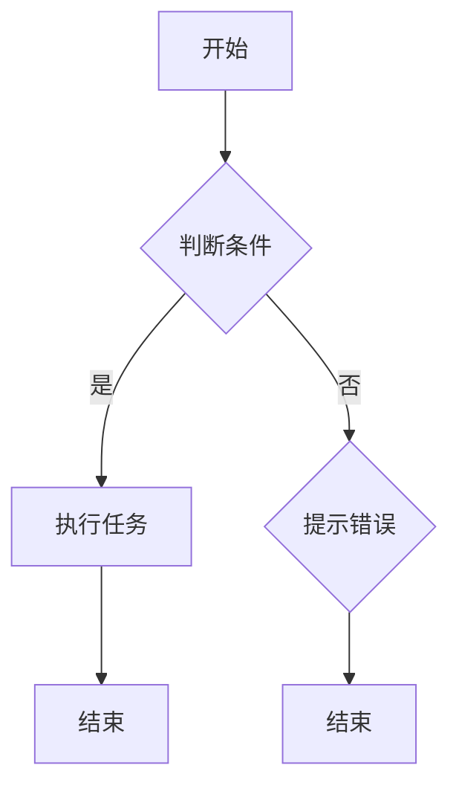

                 

### 《解密AIGC：ChatGPT提示词的魔力》

> 关键词：AIGC、ChatGPT、提示词、人工智能、自然语言处理

> 摘要：本文将深入探讨AIGC（人工智能生成内容）领域中的ChatGPT提示词魔力。通过逻辑清晰的分析与实例讲解，我们将揭示提示词在ChatGPT中的作用原理，以及如何设计有效的提示词，从而充分利用ChatGPT的强大能力。

### 第一部分：AIGC与ChatGPT概述

#### 第1章：AIGC时代概述

AIGC（Artificial Intelligence Generated Content，人工智能生成内容）是近年来人工智能领域的热门话题。它代表了一种全新的内容生成方式，能够利用人工智能技术自动生成文本、图像、音频等多种形式的内容。

##### 1.1 AIGC的概念与背景

AIGC的核心在于利用人工智能算法，特别是深度学习模型，来生成高质量、符合人类需求的内容。其背景可以追溯到2010年代深度学习技术的崛起，以及大数据和计算能力的提升。

##### 1.2 AIGC的应用领域与价值

AIGC的应用领域非常广泛，包括但不限于以下几个方面：

- **媒体与新闻**：自动化生成新闻报道、博客文章等。
- **娱乐与艺术**：创作音乐、绘画、电影剧本等。
- **教育与培训**：自动化生成教学材料、辅导学生作业。
- **客服与支持**：通过聊天机器人提供实时、个性化的客户服务。

##### 1.3 AIGC与AI、NLP的关系

AIGC是人工智能（AI）和自然语言处理（NLP）技术的融合。AI为AIGC提供了强大的计算能力和算法支持，而NLP则使得计算机能够理解、生成和处理人类语言。

#### 第2章：ChatGPT与AIGC

ChatGPT是由OpenAI开发的一种基于GPT（Generative Pre-trained Transformer）系列模型的大型语言模型。它能够理解并生成自然流畅的对话，是AIGC领域的重要应用之一。

##### 2.1 ChatGPT的核心原理

ChatGPT的核心原理是基于预训练的Transformer模型，通过大量的文本数据训练，使其具备了强大的语言理解和生成能力。

##### 2.2 ChatGPT的工作机制

ChatGPT的工作机制可以分为以下几个步骤：

1. **输入接收**：接收用户的输入语句。
2. **上下文理解**：模型根据输入语句和上下文信息进行理解。
3. **生成回答**：根据理解生成相应的回答。
4. **反馈修正**：用户对回答进行反馈，模型根据反馈进行优化。

##### 2.3 ChatGPT的优势与特点

- **强大的语言理解能力**：能够理解复杂、模糊的语句。
- **灵活的回答生成**：能够生成多样、符合逻辑的回答。
- **实时交互**：支持实时对话，响应速度快。

### 第二部分：深入解析ChatGPT提示词

#### 第3章：ChatGPT提示词的魔力

提示词在ChatGPT中的作用至关重要。它能够引导ChatGPT生成更准确、更符合人类预期的回答。

##### 3.1 提示词的定义与分类

- **定义**：提示词是指提供给ChatGPT的输入语句，用于引导模型生成回答。
- **分类**：根据用途和形式，提示词可以分为以下几类：
  - **开放式提示词**：引导模型生成多样性的回答。
  - **封闭式提示词**：限定模型回答的范围和内容。
  - **情境提示词**：为模型提供特定的背景信息。

##### 3.2 如何设计有效的提示词

- **明确目标**：明确提示词希望模型生成的回答类型和内容。
- **简洁明了**：避免使用复杂的语言，确保模型能够准确理解。
- **多样性**：提供多种形式的提示词，以便模型能够生成多样化的回答。
- **适应性**：根据模型和场景进行提示词的调整。

##### 3.3 案例解析：优秀提示词的设计

- **案例1**：如何设计一个提示词，让ChatGPT生成一个有趣的笑话？
  - **目标**：生成一个有趣的笑话。
  - **提示词**：“请用一句话描述一个搞笑的场景，然后给出这个场景的笑话。”
- **案例2**：如何设计一个提示词，让ChatGPT生成一篇关于人工智能的短文？
  - **目标**：生成一篇关于人工智能的短文。
  - **提示词**：“请以‘人工智能是未来的趋势’为主题，写一篇300字的短文。”

### 第三部分：深入解析ChatGPT提示词

#### 第4章：提示词的构成要素

提示词的构成要素决定了其能否有效引导ChatGPT生成高质量的回答。

##### 4.1 提示词的语法要素

- **基本语法**：提示词应遵循自然语言的基本语法规则，确保模型能够正确理解。
- **复杂语法**：对于复杂的问题，提示词需要使用更加复杂的语法结构，以便传达更详细的信息。

##### 4.2 复杂语法下的提示词构建

- **并列结构**：使用“和”、“又”等连接词，构建并列关系的提示词。
- **从句结构**：使用“如果”、“那么”等引导词，构建条件从句的提示词。
- **疑问句**：使用疑问句形式，引导ChatGPT生成回答。

##### 4.3 语法错误对ChatGPT回答的影响

- **理解偏差**：语法错误可能导致ChatGPT对问题的理解偏差，从而生成不准确的回答。
- **生成错误**：复杂的语法错误可能导致ChatGPT无法生成有效的回答。

### 第四部分：实战应用与案例分析

#### 第5章：ChatGPT在商业应用中的提示词设计

ChatGPT在商业应用中具有广泛的应用潜力，合理的提示词设计能够显著提升其效果。

##### 5.1 客服领域的提示词设计

- **目标**：提供高效、个性化的客户服务。
- **提示词设计**：如“请为我们的客户提供一个关于产品安装步骤的详细指导。”。

##### 5.2 市场营销领域的提示词设计

- **目标**：生成吸引消费者的营销文案。
- **提示词设计**：如“请为我们的新产品写一段300字的宣传语。”。

##### 5.3 教育领域的提示词设计

- **目标**：为学生提供个性化的学习辅导。
- **提示词设计**：如“请为这个问题提供一个详细的解答过程：什么是微积分？”。

#### 第6章：ChatGPT在个人项目中的应用

个人项目中的提示词设计需要结合项目具体需求和场景进行。

##### 6.1 项目背景与目标

- **背景**：开发一款智能问答系统。
- **目标**：使用ChatGPT生成高质量的问答。

##### 6.2 系统设计与实现

- **系统设计**：设计问答系统架构，包括问答模块、知识库模块等。
- **实现**：使用ChatGPT作为问答模块的核心，通过提示词设计实现问答功能。

##### 6.3 提示词设计实践与优化

- **实践**：根据项目需求，设计合适的提示词。
- **优化**：通过用户反馈和数据分析，不断优化提示词，提升问答系统的效果。

### 第7章：总结与展望

AIGC与ChatGPT的发展为人工智能应用带来了新的机遇和挑战。提示词设计作为关键环节，其重要性不容忽视。未来，随着技术的不断进步，AIGC将在更多领域得到应用，而ChatGPT的提示词设计也将变得更加智能化和高效。

#### 附录

本文所使用的Mermaid流程图、Python代码和LaTeX公式如下：



```python
# Python代码示例
import chatgpt

# 初始化ChatGPT模型
model = chatgpt.load_model('gpt')

# 设计提示词
prompt = "请为我们的客户提供一个关于产品安装步骤的详细指导。"

# 生成回答
response = model.generate(prompt)

print(response)
```

```latex
$$
1 + 1 = 2
$$

$$
f(x) = x^2
$$
```

### 作者信息

作者：AI天才研究院/AI Genius Institute & 禅与计算机程序设计艺术 /Zen And The Art of Computer Programming

在本文中，我们深入探讨了AIGC与ChatGPT的相关技术，揭示了提示词在ChatGPT中的关键作用。通过详细的实例分析和代码示例，读者可以更好地理解提示词的设计和应用。希望本文能为读者在AIGC和ChatGPT领域的研究和实践提供有价值的参考。未来的AIGC与ChatGPT将带来更多的创新和突破，让我们共同期待这个充满机遇和挑战的领域。

