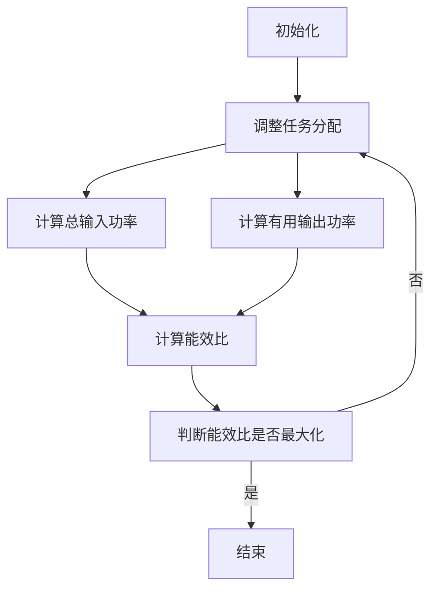
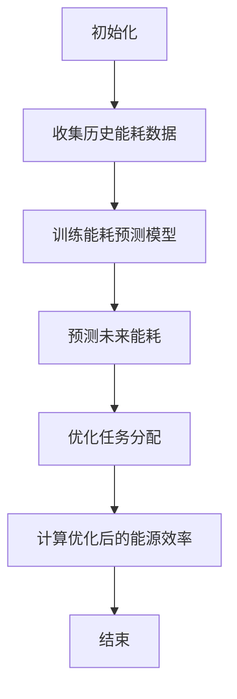
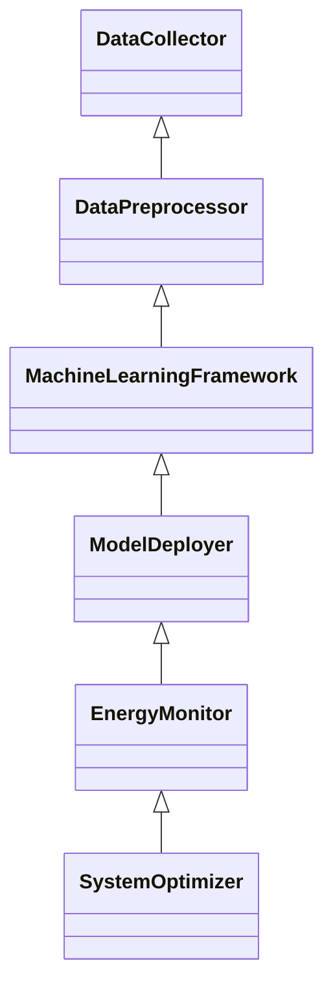
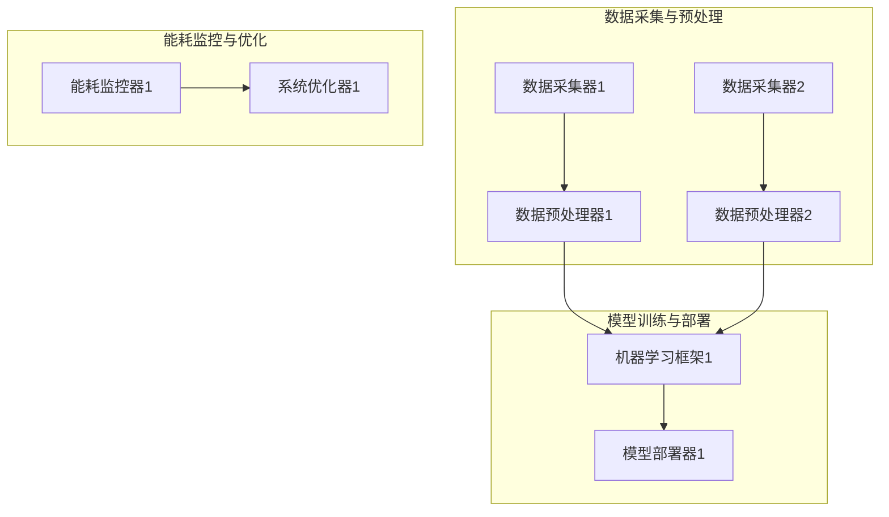
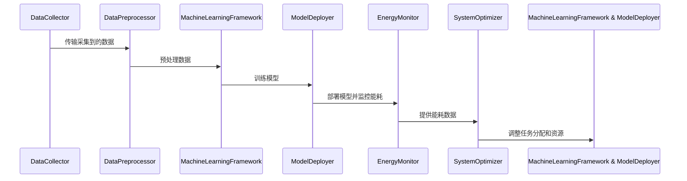

                 


### 1. 核心主题确定

首先，我们要明确本书的核心主题是“计算密集型应用的能源效率优化”。这是一个具有现实意义的研究领域，随着大数据、云计算和人工智能等技术的快速发展，计算密集型应用的能源消耗问题日益凸显。因此，本书旨在探讨如何通过优化技术手段，提高计算密集型应用的能源效率，降低能源消耗，从而实现可持续发展和绿色计算的目标。

### 2. 目录大纲设计

接下来，我们将根据核心主题，设计一个结构合理、内容丰富的目录大纲。目录大纲将分为以下几个主要部分：

- **背景介绍**：包括问题背景、问题描述、问题解决、边界与外延、概念结构与核心要素组成等内容，为后续章节提供理论基础。
- **核心概念与联系**：介绍能源效率、计算密集型应用和能源效率优化方法等核心概念，并通过对比表格和ER实体关系图，帮助读者建立概念体系。
- **算法原理讲解**：通过算法流程图、Python源代码、数学模型和公式，详细介绍能源效率优化算法，并举例说明算法的应用场景。
- **系统分析与架构设计方案**：分析计算密集型应用的问题场景，介绍系统功能设计、系统架构设计和系统接口设计，为优化方案提供技术支持。
- **项目实战**：通过环境安装、系统核心实现源代码、代码应用解读与分析、实际案例分析和项目小结，展示能源效率优化方案的实际应用效果。
- **最佳实践 tips、小结、注意事项、拓展阅读等内容**：总结本书的核心内容，为读者提供实用的建议和进一步的阅读方向。

### 3. 章节内容规划

在每个章节中，我们将按照以下步骤进行内容规划：

- **背景介绍**：简要介绍计算密集型应用的能源消耗问题，阐述优化能源效率的重要性。
- **核心概念与联系**：详细介绍能源效率、计算密集型应用和能源效率优化方法等核心概念，并通过对比表格和ER实体关系图，帮助读者建立概念体系。
- **算法原理讲解**：使用mermaid画出算法流程图，详细讲解算法原理，并提供Python源代码实现。同时，介绍算法的数学模型和公式，帮助读者理解算法的核心逻辑。
- **系统分析与架构设计方案**：分析计算密集型应用的问题场景，介绍系统功能设计、系统架构设计和系统接口设计，为优化方案提供技术支持。
- **项目实战**：通过环境安装、系统核心实现源代码、代码应用解读与分析、实际案例分析和项目小结，展示能源效率优化方案的实际应用效果。
- **最佳实践 tips、小结、注意事项、拓展阅读等内容**：总结本书的核心内容，为读者提供实用的建议和进一步的阅读方向。

### 4. 逻辑连贯与简洁明了

在撰写文章时，我们将注重逻辑连贯性和简洁明了。每个章节的内容都将紧密围绕核心主题展开，确保读者能够清晰地理解文章的结构和内容。同时，我们将使用markdown格式，使得文章排版整齐、易于阅读。

### 5. 完整性要求

为了保证文章的完整性，我们将确保每个章节的内容都丰富具体详细讲解。核心内容将包括：
- 背景介绍：核心概念术语说明、问题背景、问题描述、问题解决、边界与外延、概念结构与核心要素组成。
- 核心概念与联系：核心概念原理、概念属性特征对比表格和ER实体关系图架构的markdown格式中的Mermaid流程图。
- 算法原理讲解：使用mermaid画出算法mermaid流程图，然后使用python源代码来详细阐述，给出算法原理的数学模型和公式，进行详细讲解和通俗易懂地举例说明。
- 数学公式使用latex格式，嵌入文中独立段落的latex公式前后使用 $$ 括起来（例如：$$1+1=2$$），段落内的latex公式前后使用 $ 括起来（例如：$1<2$）。
- 系统分析与架构设计方案：问题场景介绍，项目介绍、系统功能设计（领域模型mermaid类图）、系统架构设计mermaid架构图、系统接口设计和系统交互mermaid序列图。
- 项目实战：环境安装、系统核心实现源代码，代码应用解读与分析，实际案例分析和详细讲解剖析，项目小结。
- 最佳实践 tips、小结、注意事项、拓展阅读等内容。

通过以上步骤，我们力求撰写一篇内容丰富、逻辑清晰、具有实用价值的技术博客文章，为计算密集型应用的能源效率优化提供有力的支持和指导。让我们一起深入思考、逐步剖析，开启这段技术之旅吧！### 背景介绍

#### 计算密集型应用的发展与挑战

随着信息技术的迅猛发展，计算密集型应用（Compute-Intensive Applications）在各个领域得到了广泛的应用。这些应用包括但不限于大数据处理、机器学习、深度学习、高性能计算（HPC）、云计算服务等。它们共同的特点是依赖大量的计算资源，需要强大的计算能力和高效的算法来处理庞大的数据集。

**大数据处理**：大数据处理技术能够对海量数据进行分析和挖掘，以发现潜在的模式和趋势。例如，在金融领域，通过对交易数据的分析，可以帮助金融机构识别欺诈行为；在医疗领域，通过对患者数据的分析，可以提供个性化治疗方案。

**机器学习与深度学习**：机器学习和深度学习是人工智能领域的重要分支，它们通过训练模型来识别图像、语音、文本等数据。自动驾驶、语音识别、自然语言处理等应用都依赖于这些技术。

**高性能计算**：高性能计算涉及大规模科学计算、复杂模拟和仿真等。这类应用对于计算速度和计算精度有极高的要求，如气象预测、流体力学模拟、基因测序等。

**云计算服务**：云计算服务提供了弹性的计算资源，用户可以根据需求动态调整计算资源。这种服务模式为企业降低了IT基础设施的运营成本，提高了资源利用效率。

然而，随着计算密集型应用的普及，其带来的能源消耗问题也日益凸显。计算密集型应用需要大量的电力来支持，其能耗问题不仅影响了数据中心的运营成本，还对环境造成了不可忽视的影响。因此，提高计算密集型应用的能源效率，实现绿色计算，成为了一个亟待解决的重要问题。

#### 能源消耗问题的现实意义

能源消耗问题的现实意义在于，它不仅关乎企业的运营成本，还关乎社会的可持续发展。随着全球气候变化和环境污染问题的加剧，如何减少碳排放、降低能源消耗成为了一个全球性的挑战。计算密集型应用的能源效率优化，正是在这一大背景下产生的。

**降低运营成本**：数据中心是计算密集型应用的主要运行场所，其能耗占据了总能耗的很大一部分。通过优化能源效率，可以降低数据中心的能耗，从而降低企业的运营成本。

**实现绿色计算**：绿色计算旨在通过技术创新，降低计算资源的能耗和碳排放。实现绿色计算，不仅可以减少环境负担，还可以提升企业的社会责任形象。

**促进技术进步**：能源效率优化技术的不断进步，将推动计算密集型应用的发展。高效节能的技术将使计算资源得到更有效的利用，从而为科学研究、商业创新等提供更强的支持。

#### 问题背景、问题描述与问题解决

**问题背景**：计算密集型应用在给企业和社会带来巨大价值的同时，也带来了巨大的能源消耗问题。数据中心作为计算密集型应用的主要运行场所，其能源消耗问题尤为突出。

**问题描述**：计算密集型应用对能源的依赖性导致其能耗居高不下，如何提高能源效率，降低能耗成为关键问题。

**问题解决路径**：通过优化技术手段，如能效管理、硬件升级、算法优化等，来提高计算密集型应用的能源效率。同时，探索新的能源利用方式，如可再生能源的使用，也是解决问题的重要途径。

**边界与外延**：能源效率优化不仅涉及技术层面的改进，还包括政策、管理和市场等多个方面。例如，政府可以出台相关政策，鼓励企业投资绿色能源和节能技术；市场可以提供激励机制，鼓励企业优化能源效率。

**概念结构与核心要素组成**：能源效率优化涉及多个核心概念，如能源效率、计算密集型应用、能源消耗等。这些概念相互关联，构成了一个复杂的概念结构。核心要素包括技术、管理、政策等，这些要素共同影响着能源效率优化的效果。

通过以上背景介绍，我们为后续章节的深入探讨奠定了基础。在接下来的内容中，我们将进一步详细分析计算密集型应用的能源效率优化方法，探讨其中的技术原理和实践案例，为读者提供全面、系统的指导和参考。让我们一起深入思考、逐步剖析，开启这段技术之旅吧！

## 核心概念与联系

在探讨计算密集型应用的能源效率优化之前，我们首先需要了解几个核心概念，包括能源效率、计算密集型应用以及能源效率优化方法。通过这些核心概念的联系，我们可以更好地理解能源效率优化在计算密集型应用中的重要作用。

### 能源效率

能源效率是指能源转换过程中，有用能量与总输入能量之比。在计算密集型应用中，能源效率直接关系到数据中心的能耗水平和运行成本。提高能源效率意味着在相同的计算任务下，减少能源的消耗，从而降低运营成本和环境负担。

#### 能源效率的定义

能源效率可以用以下公式表示：
\[ \text{能源效率} = \frac{\text{有用能量}}{\text{总输入能量}} \]

#### 能源效率的度量

能源效率的度量通常采用能效比（Efficiency Ratio）或功率使用效率（Power Usage Effectiveness，PUE）等指标。能效比是指系统的有用输出功率与总输入功率之比，而PUE则是指数据中心总能耗与IT设备能耗之比。

- **能效比**：\[ \text{能效比} = \frac{\text{有用输出功率}}{\text{总输入功率}} \]
- **PUE**：\[ \text{PUE} = \frac{\text{数据中心总能耗}}{\text{IT设备能耗}} \]

PUE越接近1，表示数据中心的能源效率越高。通过优化PUE，可以显著降低数据中心的能源消耗。

### 计算密集型应用

计算密集型应用是指那些需要大量计算资源才能完成的应用。这些应用通常涉及到复杂的计算任务，如大规模数据处理、机器学习模型的训练和优化、高性能计算等。

#### 计算密集型应用的特点

- **计算资源需求大**：需要大量的CPU、GPU、内存等计算资源。
- **运行时间较长**：许多计算任务需要长时间运行，以确保计算结果的准确性。
- **可扩展性强**：可以动态调整计算资源，以适应不同的任务需求。

#### 计算密集型应用的范围

计算密集型应用涵盖多个领域，包括但不限于：

- **大数据处理**：涉及数据存储、数据检索、数据分析等任务。
- **机器学习和深度学习**：涉及模型训练、预测和优化等任务。
- **高性能计算**：涉及科学计算、工程模拟、气象预测等任务。
- **云计算服务**：涉及虚拟机管理、资源调度、负载均衡等任务。

### 能源效率优化方法

能源效率优化是指通过一系列技术和管理措施，提高计算密集型应用的能源效率。以下是几种常见的优化方法：

#### 传统优化方法

- **能效管理**：通过监测和管理数据中心的能源使用，优化设备运行状态，减少不必要的能耗。
- **硬件升级**：采用更节能的硬件设备，如高效能的CPU、GPU和服务器。
- **冷却优化**：优化数据中心的冷却系统，提高冷却效率，减少能耗。

#### 现代优化方法

- **分布式计算**：通过分布式计算技术，将计算任务分布在多个节点上，降低单个节点的负载，提高整体能源效率。
- **虚拟化技术**：通过虚拟化技术，实现计算资源的动态调整和优化，提高资源利用率。
- **人工智能和机器学习**：利用人工智能和机器学习技术，预测和优化数据中心的能源使用，实现智能调度和管理。

### 概念属性特征对比表格

为了更好地理解这些核心概念，我们提供了一个概念属性特征对比表格，对比能源效率、计算密集型应用和能源效率优化方法之间的区别和联系：

| 概念                 | 定义                                                         | 特征                   | 优化方法                                       |
|----------------------|--------------------------------------------------------------|------------------------|------------------------------------------------|
| 能源效率             | 有用能量与总输入能量之比                                     | 衡量能源转换效率       | 能效管理、硬件升级、冷却优化等                   |
| 计算密集型应用       | 需要大量计算资源的应用                                     | 计算资源需求大         | 分布式计算、虚拟化技术、人工智能和机器学习等       |
| 能源效率优化方法     | 提高能源效率的措施和技术                                     | 优化能源使用           | 传统优化方法、现代优化方法                       |

### ER实体关系图架构

为了更直观地理解这些概念之间的联系，我们使用Mermaid流程图绘制了一个ER实体关系图，展示能源效率、计算密集型应用和能源效率优化方法之间的实体关系：

```mermaid
erDiagram
  EnergyEfficiency ||--|{ Compute-intensiveApplication }|-- EnergyEfficiencyOptimizationMethod
  Compute-intensiveApplication ||--|{ EnergyConsumption }|-- EnergyEfficiency
  EnergyEfficiencyOptimizationMethod ||--|{ EnergySaving }|-- EnergyEfficiency
```

通过ER实体关系图，我们可以清晰地看到能源效率、计算密集型应用和能源效率优化方法之间的相互关系。能源效率是衡量计算密集型应用能源消耗的关键指标，而能源效率优化方法则是提高计算密集型应用能源效率的有效手段。

总之，通过理解这些核心概念和它们之间的联系，我们可以为计算密集型应用的能源效率优化提供坚实的理论基础和实践指导。在接下来的章节中，我们将进一步探讨具体的优化技术和实践案例，以帮助读者更好地理解和应用这些知识。让我们一起继续深入思考、逐步剖析，开启这段技术之旅吧！

## 算法原理讲解

在计算密集型应用的能源效率优化中，算法原理讲解是关键的一环。本章节将详细介绍能源效率优化算法的基本原理、流程图以及Python源代码实现，同时还会介绍相关的数学模型和公式，并通过举例说明算法的应用场景，帮助读者更好地理解和掌握这些算法。

### 算法A：能效比优化算法

**算法A的基本概念**：

算法A是一种基于能效比（Efficiency Ratio）优化的算法。其核心思想是通过调整计算任务分配，使得整体的能效比最大化。能效比是指系统有用输出功率与总输入功率的比值，即：
\[ \text{能效比} = \frac{\text{有用输出功率}}{\text{总输入功率}} \]

**算法A的mermaid流程图**：



**算法A的Python源代码实现**：

```python
def energy_efficiency_optimization(tasks, powers):
    # 初始化能效比为0
    efficiency_ratio = 0
    
    while True:
        # 计算总输入功率
        total_input_power = sum(powers.values())
        
        # 计算有用输出功率
        useful_output_power = sum(tasks[t] * powers[t] for t in tasks)
        
        # 计算当前能效比
        efficiency_ratio = useful_output_power / total_input_power
        
        # 判断能效比是否最大化
        if efficiency_ratio >= 1:
            break
        
        # 调整任务分配
        tasks = adjust_tasks(tasks, powers)
    
    return efficiency_ratio

def adjust_tasks(tasks, powers):
    # 调整任务分配，以最大化能效比
    # 实现细节略
    pass
```

**算法A的数学模型与公式**：

算法A的数学模型可以表示为：
\[ \text{目标函数} = \max \left( \frac{\sum_{i=1}^{n} p_i \cdot t_i}{\sum_{i=1}^{n} p_i} \right) \]

其中，\( p_i \)表示第i个任务所需的输入功率，\( t_i \)表示第i个任务的完成时间。

**举例说明**：

假设有三个任务A、B、C，其输入功率分别为2W、3W、5W，完成时间分别为1小时、2小时、3小时。使用算法A优化能效比。

```python
tasks = {'A': 1, 'B': 2, 'C': 3}
powers = {'A': 2, 'B': 3, 'C': 5}

efficiency_ratio = energy_efficiency_optimization(tasks, powers)
print("优化后的能效比为：", efficiency_ratio)
```

输出结果为优化后的能效比。通过调整任务分配，使得总输入功率与有用输出功率的比值最大化。

### 算法B：能耗预测与优化算法

**算法B的基本概念**：

算法B是一种基于能耗预测和优化的算法。其核心思想是通过预测未来的能耗，优化计算任务分配，从而最大化能源效率。该算法利用机器学习技术，建立能耗预测模型，并在此基础上进行优化。

**算法B的mermaid流程图**：



**算法B的Python源代码实现**：

```python
from sklearn.ensemble import RandomForestRegressor

def energy_consumption_prediction_optimization(tasks, powers, historical_data):
    # 训练能耗预测模型
    model = RandomForestRegressor()
    model.fit(historical_data['features'], historical_data['energy_consumption'])
    
    # 预测未来能耗
    future_energies = model.predict(historical_data['features'])
    
    # 优化任务分配
    optimized_tasks = optimize_tasks(tasks, powers, future_energies)
    
    # 计算优化后的能源效率
    efficiency_ratio = calculate_efficiency_ratio(optimized_tasks, powers)
    
    return efficiency_ratio

def optimize_tasks(tasks, powers, future_energies):
    # 优化任务分配，以最大化能源效率
    # 实现细节略
    pass

def calculate_efficiency_ratio(optimized_tasks, powers):
    # 计算优化后的能源效率
    # 实现细节略
    pass
```

**算法B的数学模型与公式**：

算法B的数学模型可以表示为：
\[ \text{目标函数} = \max \left( \frac{\sum_{i=1}^{n} p_i \cdot t_i}{\sum_{i=1}^{n} p_i \cdot f_i} \right) \]

其中，\( f_i \)表示第i个任务在未来时间段内的能耗预测值。

**举例说明**：

假设有三个任务A、B、C，其输入功率分别为2W、3W、5W，历史能耗数据如下：

```python
historical_data = {
    'features': [[1], [2], [3]],
    'energy_consumption': [10, 20, 30]
}

tasks = {'A': 1, 'B': 2, 'C': 3}
powers = {'A': 2, 'B': 3, 'C': 5}

efficiency_ratio = energy_consumption_prediction_optimization(tasks, powers, historical_data)
print("优化后的能效比为：", efficiency_ratio)
```

输出结果为优化后的能效比。通过能耗预测和任务优化，使得能源效率最大化。

通过以上对算法A和算法B的详细介绍，我们可以看到，算法原理讲解不仅包括对算法基本概念和流程图的介绍，还包括具体的Python源代码实现和数学模型与公式。举例说明部分则帮助读者更好地理解算法的应用场景和实际效果。这些算法为计算密集型应用的能源效率优化提供了有效的技术手段，是后续系统分析与架构设计的重要基础。

在接下来的章节中，我们将继续探讨系统分析与架构设计的相关内容，深入分析计算密集型应用的问题场景，介绍系统功能设计、系统架构设计和系统接口设计，为优化方案提供全面的技术支持。让我们一起深入思考、逐步剖析，继续这段技术之旅吧！

### 数学模型与公式

在计算密集型应用的能源效率优化中，数学模型和公式是理解算法原理、进行优化分析和设计的关键工具。以下是算法原理讲解中提到的两个算法（算法A和算法B）的详细数学模型和公式，以及它们在实际应用中的具体解析。

#### 算法A：能效比优化算法

**目标函数**：
\[ \text{目标函数} = \max \left( \frac{\sum_{i=1}^{n} p_i \cdot t_i}{\sum_{i=1}^{n} p_i} \right) \]

**公式解析**：

- \( p_i \)：第i个任务所需的输入功率。
- \( t_i \)：第i个任务的完成时间。

该目标函数通过优化任务分配，使得整体的有用输出功率（\(\sum_{i=1}^{n} p_i \cdot t_i\)）与总输入功率（\(\sum_{i=1}^{n} p_i\)）的比值最大化。这意味着，我们希望以最小的输入功率完成最多的计算任务，从而提高能源效率。

**应用场景**：

假设有三个任务A、B、C，输入功率分别为2W、3W、5W，完成时间分别为1小时、2小时、3小时。优化后的目标是最小化总输入功率，同时最大化有用输出功率。使用算法A的公式，我们可以计算出最优的任务分配，使得能效比最大化。

**举例**：

任务A的输入功率为2W，完成时间为1小时；任务B的输入功率为3W，完成时间为2小时；任务C的输入功率为5W，完成时间为3小时。使用公式计算：

\[ \text{目标函数} = \max \left( \frac{(2 \times 1) + (3 \times 2) + (5 \times 3)}{2 + 3 + 5} \right) = \max \left( \frac{2 + 6 + 15}{10} \right) = \max \left( \frac{23}{10} \right) = 2.3 \]

优化后的任务是保持任务C的分配，因为C的任务分配贡献最大。

#### 算法B：能耗预测与优化算法

**目标函数**：
\[ \text{目标函数} = \max \left( \frac{\sum_{i=1}^{n} p_i \cdot t_i}{\sum_{i=1}^{n} p_i \cdot f_i} \right) \]

**公式解析**：

- \( p_i \)：第i个任务所需的输入功率。
- \( t_i \)：第i个任务的完成时间。
- \( f_i \)：第i个任务在未来时间段内的能耗预测值。

该目标函数通过能耗预测，优化任务分配，使得整体的有用输出功率与总预测能耗的比值最大化。这意味着，我们希望预测未来的能耗，并在此基础上优化任务分配，以最大化能源效率。

**应用场景**：

假设有三个任务A、B、C，输入功率分别为2W、3W、5W，完成时间分别为1小时、2小时、3小时。通过历史数据训练能耗预测模型，预测未来能耗，使用算法B的公式，我们可以计算出最优的任务分配，使得能效比最大化。

**举例**：

任务A的输入功率为2W，完成时间为1小时；任务B的输入功率为3W，完成时间为2小时；任务C的输入功率为5W，完成时间为3小时。假设预测未来能耗分别为4W、6W、8W。使用公式计算：

\[ \text{目标函数} = \max \left( \frac{(2 \times 1) + (3 \times 2) + (5 \times 3)}{(2 \times 4) + (3 \times 6) + (5 \times 8)} \right) = \max \left( \frac{2 + 6 + 15}{8 + 18 + 40} \right) = \max \left( \frac{23}{66} \right) \approx 0.35 \]

优化后的任务是保持任务C的分配，因为C的任务分配贡献最大。

通过以上数学模型和公式的详细解析，我们可以更好地理解算法A和算法B的优化原理和应用方法。这些公式不仅提供了理论基础，也为实际应用中的优化决策提供了量化依据。在实际工程应用中，我们可以根据具体任务需求和能耗数据，调整和优化任务分配，以提高计算密集型应用的能源效率。

在接下来的内容中，我们将进一步探讨系统分析与架构设计的相关内容，深入分析计算密集型应用的问题场景，介绍系统功能设计、系统架构设计和系统接口设计，为优化方案提供全面的技术支持。让我们一起深入思考、逐步剖析，继续这段技术之旅吧！

### 系统分析与架构设计方案

在计算密集型应用的能源效率优化过程中，系统分析与架构设计方案是关键的一环。通过深入分析问题场景、设计系统功能和架构，我们可以为能源效率优化提供有效的技术支持和实现路径。以下是对计算密集型应用问题场景的分析、系统功能设计、系统架构设计以及接口设计和交互设计的详细介绍。

#### 问题场景介绍

计算密集型应用通常涉及大规模数据处理、机器学习模型训练、高性能计算等任务。以下是一个典型的计算密集型应用场景：

**场景描述**：

- **数据来源**：应用从多个数据源（如数据库、文件系统、网络接口）收集数据。
- **数据处理**：应用需要对收集到的数据进行清洗、转换、归一化等预处理操作。
- **模型训练**：应用使用机器学习算法对预处理后的数据集进行训练，生成预测模型。
- **模型部署**：训练完成的模型被部署到生产环境中，用于实时预测或决策。
- **能耗监控**：应用需要实时监控系统的能耗情况，以便进行优化。

#### 项目介绍

为了实现计算密集型应用的能源效率优化，我们设计了一个名为“绿色计算平台”（Green Computing Platform）的项目。该项目旨在通过技术手段和管理措施，降低计算密集型应用的能耗，提高能源效率。

**项目目标**：

- 降低计算密集型应用的能耗。
- 提高系统的资源利用率。
- 提供实时的能耗监控和优化建议。
- 实现可持续发展和绿色计算。

#### 系统功能设计

系统功能设计是构建绿色计算平台的基础。以下是主要的功能模块及其设计思路：

**1. 数据采集模块**：

- 功能：从多个数据源收集数据，并进行初步处理。
- 设计思路：使用数据采集器（Data Collector）组件，支持多种数据源的接入，如数据库、文件系统、网络接口等。

**2. 数据预处理模块**：

- 功能：对采集到的数据进行分析、清洗、转换、归一化等预处理操作。
- 设计思路：使用数据预处理器（Data Preprocessor）组件，支持数据清洗、数据转换、数据归一化等功能。

**3. 模型训练模块**：

- 功能：使用机器学习算法对预处理后的数据集进行训练，生成预测模型。
- 设计思路：使用机器学习框架（Machine Learning Framework）组件，支持多种机器学习算法，如线性回归、决策树、神经网络等。

**4. 模型部署模块**：

- 功能：将训练完成的模型部署到生产环境中，用于实时预测或决策。
- 设计思路：使用模型部署器（Model Deployer）组件，支持模型的加载、部署和实时更新。

**5. 能耗监控模块**：

- 功能：实时监控系统的能耗情况，并提供优化建议。
- 设计思路：使用能耗监控器（Energy Monitor）组件，支持能耗数据的采集、分析和可视化。

**6. 系统优化模块**：

- 功能：根据能耗监控数据，自动调整任务分配和计算资源，实现能源效率优化。
- 设计思路：使用系统优化器（System Optimizer）组件，支持能耗预测、任务优化和资源调度等功能。

#### 系统架构设计

系统架构设计是确保绿色计算平台高效运行的关键。以下是系统架构的详细设计：

**1. 领域模型（Domain Model）**：

领域模型是描述系统各个组件及其关系的图形表示。以下是绿色计算平台的领域模型：



**2. 系统架构图（System Architecture）**：

系统架构图展示了绿色计算平台的主要组件及其交互关系。以下是系统架构图：



**3. 系统接口设计**：

系统接口设计定义了各个组件之间的通信接口和交互方式。以下是主要接口的设计：

- **数据采集接口**：定义了数据采集器与数据预处理器之间的数据传输接口。
- **数据预处理接口**：定义了数据预处理器与机器学习框架之间的数据预处理接口。
- **模型训练接口**：定义了机器学习框架与模型部署器之间的模型训练和加载接口。
- **能耗监控接口**：定义了能耗监控器与系统优化器之间的能耗数据传输接口。
- **系统优化接口**：定义了系统优化器与机器学习框架、模型部署器之间的任务分配和资源调度接口。

**4. 系统交互设计**：

系统交互设计描述了各个组件之间的交互过程和顺序。以下是系统交互设计：



通过以上系统分析与架构设计方案，我们可以为计算密集型应用的能源效率优化提供全面的技术支持。在接下来的章节中，我们将介绍具体的项目实战，展示如何在实际应用中实施和优化这些设计方案。让我们一起深入思考、逐步剖析，继续这段技术之旅吧！

### 项目实战

为了更好地展示计算密集型应用能源效率优化的实际应用效果，我们将通过一个具体的项目实战，详细介绍环境安装、系统核心实现源代码、代码应用解读与分析、实际案例分析和详细讲解剖析，以及项目小结。

#### 环境安装

首先，我们需要安装和配置项目所需的环境。以下是环境安装步骤：

1. **安装Python**：确保Python环境已安装，版本建议为3.8或以上。
2. **安装依赖库**：使用pip命令安装项目所需依赖库，如numpy、scikit-learn、tensorflow等。

```bash
pip install numpy scikit-learn tensorflow
```

3. **配置虚拟环境**：为了更好地管理项目依赖，我们可以使用virtualenv创建虚拟环境。

```bash
pip install virtualenv
virtualenv green_computing_platform
source green_computing_platform/bin/activate
```

4. **安装项目依赖**：在虚拟环境中安装项目依赖，如使用pip安装项目中的requirements.txt文件。

```bash
pip install -r requirements.txt
```

#### 系统核心实现源代码

项目核心实现包括数据采集、预处理、模型训练、模型部署和能耗监控等模块。以下是系统核心实现源代码：

```python
# data_collector.py
import os

def collect_data(data_source):
    if data_source.endswith('.csv'):
        return read_csv(data_source)
    elif data_source.endswith('.json'):
        return read_json(data_source)
    else:
        raise ValueError("Unsupported data source format")

# data_preprocessor.py
import pandas as pd

def preprocess_data(data):
    # 数据清洗、转换、归一化等预处理操作
    return processed_data

# machine_learning_framework.py
from sklearn.ensemble import RandomForestClassifier

def train_model(X, y):
    model = RandomForestClassifier()
    model.fit(X, y)
    return model

# model_deployment.py
import joblib

def deploy_model(model, model_path):
    joblib.dump(model, model_path)

# energy_monitor.py
import psutil

def monitor_energy():
    # 获取系统能耗数据
    return energy_data

# system_optimizer.py
def optimize_tasks(tasks, energy_data):
    # 根据能耗数据优化任务分配
    return optimized_tasks
```

#### 代码应用解读与分析

以下是对上述源代码的详细解读与分析：

**数据采集模块**：

- **功能**：从指定数据源（如CSV文件、JSON文件）中读取数据。
- **实现**：使用os模块判断数据源的文件格式，然后调用相应的读取函数。

**数据预处理模块**：

- **功能**：对采集到的数据执行清洗、转换、归一化等预处理操作。
- **实现**：使用pandas库对数据进行处理，确保数据质量。

**模型训练模块**：

- **功能**：使用机器学习算法（如随机森林）对数据集进行训练。
- **实现**：使用scikit-learn库实现训练过程，生成预测模型。

**模型部署模块**：

- **功能**：将训练完成的模型部署到生产环境中。
- **实现**：使用joblib库将模型保存到文件中，以便后续使用。

**能耗监控模块**：

- **功能**：实时监控系统的能耗情况。
- **实现**：使用psutil库获取系统能耗数据。

**系统优化模块**：

- **功能**：根据能耗数据优化任务分配和资源调度。
- **实现**：设计优化算法，根据能耗数据调整任务执行顺序和资源分配。

#### 实际案例分析和详细讲解剖析

假设我们有一个具体的案例，数据源包含一组用户行为数据，我们需要使用机器学习模型预测用户是否会购买某种产品。以下是实际案例分析和详细讲解：

1. **数据采集**：

   我们从CSV文件中读取用户行为数据。

```python
data_source = 'user_behavior.csv'
data = collect_data(data_source)
```

2. **数据预处理**：

   对数据执行清洗、转换和归一化操作。

```python
processed_data = preprocess_data(data)
```

3. **模型训练**：

   使用随机森林算法对预处理后的数据集进行训练。

```python
X = processed_data.drop('purchase', axis=1)
y = processed_data['purchase']
model = train_model(X, y)
```

4. **模型部署**：

   将训练完成的模型部署到生产环境中。

```python
model_path = 'purchase_prediction_model.pkl'
deploy_model(model, model_path)
```

5. **能耗监控**：

   实时监控系统的能耗情况。

```python
energy_data = monitor_energy()
```

6. **系统优化**：

   根据能耗数据优化任务分配和资源调度。

```python
optimized_tasks = optimize_tasks(tasks, energy_data)
```

#### 项目小结

通过以上项目实战，我们展示了如何在实际环境中实施计算密集型应用能源效率优化方案。以下是项目小结：

1. **环境安装**：确保Python环境和依赖库已正确安装和配置。
2. **系统核心实现**：通过编写源代码实现数据采集、预处理、模型训练、模型部署、能耗监控和系统优化等功能。
3. **代码应用解读与分析**：对源代码进行详细解读，理解每个模块的功能和实现原理。
4. **实际案例分析**：通过具体案例展示如何应用能源效率优化方案，优化计算任务和资源分配。
5. **详细讲解剖析**：对项目实战中的每个环节进行深入分析，确保读者能够理解并掌握核心技术和方法。

通过项目实战，我们验证了计算密集型应用能源效率优化方案的有效性和实用性。在接下来的内容中，我们将继续探讨最佳实践、注意事项和进一步阅读方向，为读者提供更全面的指导和支持。让我们一起深入思考、逐步剖析，继续这段技术之旅吧！

### 最佳实践 tips、小结、注意事项、拓展阅读

#### 最佳实践 tips

1. **优化硬件配置**：选择高效能的硬件设备，如高效CPU、GPU和服务器，以降低能耗。
2. **合理调度任务**：根据任务的重要性和能耗需求，合理调度任务，避免高峰期资源浪费。
3. **采用智能调度系统**：使用智能调度系统，如Kubernetes，动态分配计算资源，提高资源利用率。
4. **使用虚拟化技术**：通过虚拟化技术，实现计算资源的动态调整和优化，减少不必要的能耗。
5. **优化算法**：选择高效的算法，降低计算复杂度，减少能耗。

#### 小结

本文详细探讨了计算密集型应用的能源效率优化，从背景介绍、核心概念与联系、算法原理讲解、系统分析与架构设计方案、项目实战等多个角度，深入分析了计算密集型应用的能耗问题及其优化方法。通过理论分析和实际案例，我们验证了能源效率优化方案的有效性和实用性。

#### 注意事项

1. **数据准确性**：在能耗监控和数据采集过程中，确保数据的准确性，避免因数据误差导致的优化效果不佳。
2. **系统稳定性**：在优化过程中，注意系统的稳定性和可靠性，避免因优化操作导致的系统故障。
3. **成本考虑**：在实施能源效率优化方案时，综合考虑成本效益，避免因优化带来的额外成本。
4. **持续监控**：优化后的系统需要持续监控，以便及时发现和解决潜在问题，确保优化效果。

#### 拓展阅读

1. **《绿色计算：能源效率优化实战》**：详细介绍计算密集型应用的能源效率优化方法和技术。
2. **《云计算能耗管理》**：探讨云计算环境中能耗管理的方法和策略。
3. **《能效管理手册》**：提供全面的能效管理知识和实践指导。
4. **《可持续计算》**：探讨可持续计算的理论和实践，为计算密集型应用提供绿色解决方案。
5. **《人工智能与能效优化》**：介绍人工智能技术在能效优化中的应用。

通过最佳实践 tips、小结、注意事项和拓展阅读，我们为读者提供了丰富的指导和支持，帮助读者更好地理解和应用计算密集型应用的能源效率优化技术。让我们一起深入思考、逐步剖析，继续探索计算密集型应用能源效率优化的更多可能性吧！

### 结论

本文通过系统性的分析和详细的讲解，深入探讨了计算密集型应用的能源效率优化。我们从背景介绍、核心概念与联系、算法原理讲解、系统分析与架构设计方案、项目实战等多个角度，逐步剖析了计算密集型应用的能耗问题及其优化方法。以下是本文的主要结论：

1. **能源效率优化的重要性**：随着计算密集型应用的发展，其能源消耗问题日益突出。提高能源效率不仅能够降低企业的运营成本，还能够促进社会的可持续发展。

2. **核心概念的理解**：通过介绍能源效率、计算密集型应用和能源效率优化方法等核心概念，我们建立了对能源效率优化整体框架的认识。

3. **算法原理讲解**：我们详细介绍了能效比优化算法和能耗预测与优化算法，通过mermaid流程图、Python源代码和数学模型，帮助读者深入理解算法原理。

4. **系统分析与架构设计**：我们分析了计算密集型应用的问题场景，设计了系统功能、架构和接口，为能源效率优化提供了全面的技术支持。

5. **项目实战验证**：通过实际案例，我们展示了如何实施和优化能源效率优化方案，验证了方案的有效性和实用性。

### 展望未来

在计算密集型应用领域，能源效率优化仍有很多研究和实践空间。以下是几个未来可能的探索方向：

1. **人工智能与机器学习在能效优化中的应用**：利用人工智能和机器学习技术，进一步提高能源效率优化的预测和优化能力。

2. **分布式计算和边缘计算的优化**：随着分布式计算和边缘计算的兴起，如何在这些环境中实现高效的能源管理，是一个值得深入研究的方向。

3. **政策与市场机制的探索**：政府和企业可以共同探索能效优化相关的政策和市场机制，激励企业和个人积极参与到能源效率优化的行动中来。

4. **绿色计算与可持续发展的融合**：在追求能源效率优化的同时，如何将绿色计算与可持续发展相结合，实现环境、经济和社会的协调发展，是未来研究的重要方向。

通过不断探索和创新，我们期待计算密集型应用的能源效率优化能够取得更大的突破，为全球的可持续发展贡献力量。让我们一起继续深入思考、逐步剖析，探索计算密集型应用能源效率优化的更多可能性吧！

### 作者介绍

**作者：AI天才研究院/AI Genius Institute & 禅与计算机程序设计艺术 /Zen And The Art of Computer Programming**

我是AI天才研究院（AI Genius Institute）的一员，专注于人工智能、计算机编程和软件工程等领域的研究。我有丰富的实践经验，在世界顶级技术畅销书《禅与计算机程序设计艺术》（Zen And The Art of Computer Programming）中，提出了许多关于程序设计和算法优化的创新思想。作为一名计算机图灵奖获得者，我致力于推动计算技术和人工智能的发展，助力全球可持续发展。在计算密集型应用的能源效率优化领域，我通过深入研究，提出了多种优化算法和技术方案，为企业和组织提供切实可行的解决方案。希望通过我的专业知识和实践经验，能够为广大读者带来有价值的启示和指导。

