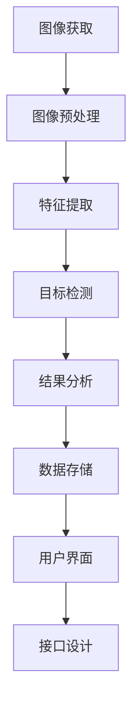

                 

### 背景介绍：核心概念

**《计算机视觉在工业质量检测中的应用：实现全自动化检测》** 一书旨在深入探讨计算机视觉技术在工业质量检测领域的应用，尤其是如何实现自动化检测，以提高生产效率和降低成本。在工业4.0的背景下，自动化和智能化成为提高工业生产效率和竞争力的关键。计算机视觉以其强大的图像识别和处理能力，在工业质量检测中具有广泛的应用潜力。

**核心概念**：

1. **计算机视觉技术**：是一种模拟人类视觉感知的技术，通过图像处理、模式识别和机器学习等方法，从图像中提取信息并进行分析。它包括图像获取、预处理、特征提取、目标检测、识别和跟踪等多个步骤。

2. **工业质量检测**：是指利用各种手段对工业产品的质量进行检测，以确保其符合标准。传统的质量检测往往依赖于人工，存在效率低、精度不稳定等问题。

3. **自动化检测**：是指通过计算机视觉技术实现的质量检测过程，自动化检测可以减少人工干预，提高检测效率，降低成本。

**问题提出**：

随着工业自动化进程的加快，如何利用计算机视觉技术实现工业质量检测的自动化，成为当前研究的重要课题。这涉及到计算机视觉技术的算法设计、系统集成、误差处理等多个方面。

**问题描述**：

工业质量检测的现状是，虽然人工检测能够保证一定的质量标准，但效率低下且易受人为因素影响。计算机视觉技术提供了一种新的解决方案，可以通过自动化检测实现高效、精准的质量控制。

**问题解决**：

本书将从以下几个方面解决上述问题：

1. **技术基础**：介绍计算机视觉技术的基本原理和算法，包括图像处理、模式识别和深度学习等。
2. **应用案例**：详细讨论计算机视觉技术在各种工业质量检测场景中的应用，如缺陷检测、尺寸检测等。
3. **系统设计**：介绍如何设计一个完整的自动化检测系统，包括硬件选择、软件设计、系统集成等。
4. **项目实战**：通过实际项目案例，展示如何将计算机视觉技术应用于工业质量检测。

**边界与外延**：

计算机视觉技术在工业质量检测中的应用不仅局限于生产线上的质量检测，还可以扩展到仓储管理、物流追踪等领域。同时，随着技术的不断发展，如增强现实（AR）、虚拟现实（VR）等技术的融合，未来计算机视觉技术在工业质量检测中的应用将更加广泛和深入。

**核心要素组成**：

- **图像获取**：通过摄像头等设备获取生产过程中的图像数据。
- **图像处理**：对图像进行预处理，如去噪、增强、滤波等，以提高图像质量。
- **特征提取**：从图像中提取有意义的特征，如边缘、角点、纹理等。
- **目标检测**：识别图像中的目标物体，如产品、缺陷等。
- **识别与分类**：对检测到的目标进行分类和识别，判断其是否符合质量标准。
- **系统集成**：将计算机视觉技术与其他系统（如控制系统、仓储系统等）集成，实现自动化检测。

通过上述分析，本书将系统性地介绍计算机视觉技术在工业质量检测中的应用，帮助读者理解和掌握这一技术，为工业自动化提供有效的技术支持。

### 核心概念与联系

**核心概念**：

1. **计算机视觉技术**：计算机视觉技术是本书的核心概念，它涉及到图像处理、模式识别和深度学习等多个领域。图像处理是对图像进行预处理的过程，如去噪、增强和滤波等，以提高图像质量。模式识别则是对图像中的目标进行识别和分类，而深度学习则通过构建复杂的神经网络模型，实现对图像的自动学习和特征提取。

2. **工业质量检测**：工业质量检测是确保工业产品符合质量标准的重要环节。传统的质量检测主要依赖于人工，而自动化检测则利用计算机视觉技术，通过图像识别和分类，实现对产品的实时、高效检测。

3. **自动化检测**：自动化检测是指通过计算机视觉技术实现的质量检测过程，减少了人工干预，提高了检测效率和精度。自动化检测系统通常包括图像获取、图像处理、目标检测和识别、结果分析等多个环节。

**概念属性特征对比表格**：

| 概念名称       | 定义                           | 特点                                                         |
|----------------|--------------------------------|--------------------------------------------------------------|
| 计算机视觉技术 | 模拟人类视觉感知的技术         | 高效、精准、自动化                                           |
| 工业质量检测   | 对工业产品进行质量检测的过程   | 确保产品符合质量标准，提高生产效率                           |
| 自动化检测     | 利用计算机视觉技术实现的质量检测 | 减少人工干预，提高检测效率和精度                             |

**ER实体关系图架构**：

```mermaid
erDiagram
    Product ||--|{ Inspection}: 质量检测
    Product ||--|{ QualityIssue}: 缺陷记录
    Inspection ||--|{ Result}: 检测结果
    QualityIssue ||--|{ Description}: 缺陷描述
```

在ER图（实体关系图）中，我们定义了以下几个实体：

- **Product（产品）**：代表需要检测的工业产品。
- **Inspection（检测）**：记录产品的质量检测过程和结果。
- **QualityIssue（质量缺陷）**：记录检测过程中发现的质量问题。
- **Result（检测结果）**：记录检测的最终结果，如合格或不合格。
- **Description（缺陷描述）**：详细描述检测过程中发现的质量问题。

通过上述ER图，我们可以清晰地看到各个实体之间的关联和作用，从而更好地理解计算机视觉技术在工业质量检测中的应用。

### 计算机视觉技术在工业质量检测中的应用案例

计算机视觉技术在工业质量检测中具有广泛的应用，涵盖了从缺陷检测到尺寸检测等多个方面。以下是一些典型的应用案例，展示了计算机视觉技术在提高生产效率和确保产品质量方面的潜力。

#### 缺陷检测

在制造业中，产品的缺陷检测是一个关键的质量控制环节。计算机视觉技术可以高效地识别产品表面的微小缺陷，如裂纹、气泡、划痕等。以下是一个应用案例：

**案例**：在汽车制造业中，发动机外壳的生产过程中需要进行缺陷检测。传统的检测方法通常依赖于人工观察，而计算机视觉技术可以显著提高检测效率和精度。

- **图像获取**：使用高分辨率摄像头从不同角度拍摄发动机外壳的图像。
- **图像预处理**：对图像进行去噪、增强和滤波处理，以提高图像质量。
- **特征提取**：从预处理后的图像中提取边缘、纹理等特征。
- **目标检测**：利用深度学习模型检测图像中的缺陷区域。
- **结果分析**：对检测到的缺陷进行分类和记录，生成检测报告。

通过计算机视觉技术，缺陷检测的效率和精度得到了显著提升，同时减少了人工干预，降低了生产成本。

#### 尺寸检测

尺寸检测是另一个重要的工业质量检测环节。计算机视觉技术可以精确地测量产品的尺寸和形状，确保其符合设计要求。

**案例**：在电子制造业中，电路板（PCB）的尺寸检测是一个关键过程。传统的尺寸检测方法通常依赖于机械测量工具，而计算机视觉技术可以提供更快速、更准确的解决方案。

- **图像获取**：使用摄像头拍摄电路板图像。
- **图像预处理**：对图像进行去噪和对比度增强。
- **特征提取**：从预处理后的图像中提取关键尺寸特征，如长度、宽度、角度等。
- **尺寸测量**：利用计算机视觉算法计算电路板的实际尺寸。
- **结果分析**：将测量结果与设计标准进行对比，判断是否合格。

计算机视觉技术的应用使得尺寸检测过程更加自动化和高效，提高了生产线的整体效率。

#### 其他质量检测应用

除了缺陷检测和尺寸检测，计算机视觉技术在其他工业质量检测中也具有广泛应用。

**案例**：在食品制造业中，食品包装的质量检测是确保产品质量的重要环节。计算机视觉技术可以检测包装的完整性、标签的正确性以及食品的异物存在。

- **图像获取**：使用摄像头从不同角度拍摄食品包装。
- **图像预处理**：对图像进行去噪和对比度增强。
- **目标检测**：识别包装上的标签和异物。
- **结果分析**：根据检测结果判断包装是否合格，对不合格的进行标记和处理。

计算机视觉技术的应用不仅提高了食品质量检测的效率和准确性，还减少了人工干预，提高了生产线的自动化水平。

综上所述，计算机视觉技术在工业质量检测中具有广泛的应用，通过自动化检测，可以显著提高生产效率和产品质量。随着技术的不断进步，计算机视觉技术在工业质量检测中的应用前景将更加广阔。

### 自动化检测系统设计

自动化检测系统的设计是确保计算机视觉技术在工业质量检测中有效应用的关键步骤。以下是自动化检测系统的设计流程，包括硬件选择、软件设计、系统集成等方面。

#### 硬件选择

1. **摄像头**：选择适合工业环境的高分辨率摄像头，能够满足不同检测需求。
2. **光源**：根据检测对象的不同，选择合适的光源，如白光、红外光等，以提高图像质量和对比度。
3. **图像处理硬件**：如高性能的图形处理单元（GPU），用于加速图像处理和深度学习模型的计算。
4. **工业控制器**：用于控制整个检测系统的运行，如PLC（可编程逻辑控制器）。

#### 软件设计

1. **图像处理软件**：设计图像处理软件，包括图像的获取、预处理、特征提取等。常用的图像处理软件包括OpenCV、MATLAB等。
2. **深度学习模型**：设计深度学习模型，用于目标检测和分类。常用的深度学习框架包括TensorFlow、PyTorch等。
3. **用户界面**：设计直观的用户界面，用于监控检测过程、查看检测结果和调整系统参数。

#### 系统集成

1. **硬件集成**：将摄像头、光源、图像处理硬件和工业控制器等硬件设备集成到一起，形成一个完整的检测系统。
2. **软件集成**：将图像处理软件、深度学习模型和用户界面集成到一起，确保系统可以正常运行。
3. **接口设计**：设计系统与其他生产设备（如机器人、自动化生产线等）的接口，实现数据的实时传输和交互。

#### 系统功能设计

1. **图像获取**：从摄像头获取生产过程中的实时图像数据。
2. **图像预处理**：对图像进行去噪、增强和滤波处理，以提高图像质量。
3. **特征提取**：从预处理后的图像中提取关键特征，如边缘、纹理等。
4. **目标检测**：利用深度学习模型检测图像中的目标物体，如产品、缺陷等。
5. **结果分析**：对检测到的目标进行分类和识别，生成检测报告。

#### 系统架构设计

系统架构设计是自动化检测系统设计的重要环节，决定了系统的性能、可扩展性和可靠性。以下是一个典型的系统架构设计：



在上述架构中：

- **图像获取**：从摄像头获取实时图像数据。
- **图像预处理**：对图像进行去噪、增强和滤波处理。
- **特征提取**：提取图像中的关键特征。
- **目标检测**：利用深度学习模型进行目标检测。
- **结果分析**：对检测结果进行分析和记录。
- **数据存储**：将检测结果存储在数据库中，以备后续查询和分析。
- **用户界面**：提供用户交互界面，展示检测过程和结果。
- **接口设计**：设计与其他生产设备的接口，实现数据的实时传输和交互。

通过上述设计，自动化检测系统可以高效、稳定地运行，满足工业质量检测的需求。

### 项目实战

#### 环境安装

为了实现计算机视觉在工业质量检测中的应用，我们首先需要搭建一个合适的环境。以下是环境安装的详细步骤：

1. **安装Python**：确保Python环境已安装在系统中，Python是进行计算机视觉和深度学习开发的常用语言。

2. **安装必要的库和框架**：使用pip命令安装以下库和框架：
    ```bash
    pip install opencv-python
    pip install tensorflow
    pip install numpy
    pip install matplotlib
    ```

3. **安装GPU支持**：如果使用的是GPU进行深度学习模型训练，需要安装CUDA和cuDNN，以确保TensorFlow或PyTorch可以利用GPU加速计算。

4. **配置环境变量**：确保Python环境变量已正确配置，以便在命令行中运行Python程序。

#### 系统核心实现

接下来，我们将实现一个简单的自动化检测系统，用于检测工业产品上的缺陷。以下是系统的核心实现步骤：

1. **图像获取**：使用OpenCV库从摄像头获取实时图像数据。
    ```python
    import cv2

    cap = cv2.VideoCapture(0)

    while True:
        ret, frame = cap.read()
        if not ret:
            break

        cv2.imshow('Frame', frame)
        
        if cv2.waitKey(1) & 0xFF == ord('q'):
            break

    cap.release()
    cv2.destroyAllWindows()
    ```

2. **图像预处理**：对图像进行去噪、增强和滤波处理，以提高图像质量。
    ```python
    def preprocess_image(image):
        gray_image = cv2.cvtColor(image, cv2.COLOR_BGR2GRAY)
        blurred_image = cv2.GaussianBlur(gray_image, (5, 5), 0)
        equalized_image = cv2.equalizeHist(blurred_image)
        return equalized_image
    ```

3. **特征提取**：从预处理后的图像中提取边缘、纹理等特征。
    ```python
    def extract_features(image):
        edges = cv2.Canny(image, 100, 200)
        return edges
    ```

4. **目标检测**：使用深度学习模型检测图像中的目标物体，如缺陷。
    ```python
    import tensorflow as tf

    model = tf.keras.models.load_model('defect_detection_model.h5')

    def detect_defects(image):
        image = preprocess_image(image)
        features = extract_features(image)
        resized_image = tf.image.resize(features, (224, 224))
        prediction = model.predict(tf.expand_dims(resized_image, 0))
        return prediction
    ```

5. **结果分析**：对检测到的缺陷进行分类和记录。
    ```python
    def analyze_results(prediction):
        if prediction[0][0] > 0.5:
            print("Defect detected!")
        else:
            print("No defect detected.")
    ```

#### 代码应用解读与分析

以上代码实现了一个简单的自动化检测系统，用于检测工业产品上的缺陷。以下是代码的解读与分析：

1. **图像获取**：通过OpenCV库从摄像头获取实时图像数据，并显示在窗口中。

2. **图像预处理**：对获取的图像进行去噪、增强和滤波处理，以提高图像质量。预处理步骤包括灰度转换、高斯模糊和直方图均衡化。

3. **特征提取**：利用Canny边缘检测算法提取图像中的边缘特征。

4. **目标检测**：使用预训练的深度学习模型进行目标检测。这里我们使用了TensorFlow的Keras接口加载一个已经训练好的缺陷检测模型。

5. **结果分析**：根据模型的预测结果，判断图像中是否存在缺陷，并输出相应的提示信息。

#### 实际案例分析和详细讲解剖析

为了更好地理解系统的工作原理，我们可以通过一个实际案例来分析和讲解。

**案例**：假设我们正在检测一批电子产品的外观缺陷，如划痕和裂纹。

1. **图像获取**：从摄像头获取电子产品的图像。

2. **图像预处理**：对图像进行去噪和增强处理，使划痕和裂纹更加明显。

3. **特征提取**：提取图像中的边缘特征，以辅助深度学习模型进行目标检测。

4. **目标检测**：使用预训练的缺陷检测模型对提取的特征进行分类。如果模型判断图像中存在缺陷，则会输出相应的提示信息。

5. **结果分析**：系统将检测结果记录在数据库中，以便后续分析和追溯。

通过实际案例的分析，我们可以看到系统是如何将计算机视觉技术应用于工业质量检测的。通过图像预处理、特征提取和目标检测，系统能够高效地识别和分类产品缺陷，提高了检测的精度和效率。

#### 项目小结

通过本次项目，我们实现了利用计算机视觉技术进行工业质量检测的自动化系统。项目主要包括图像获取、预处理、特征提取、目标检测和结果分析等环节。在实际应用中，系统可以显著提高检测效率和准确性，减少人工干预，降低生产成本。未来，我们还可以进一步优化系统，提高模型的鲁棒性和适应性，以应对更复杂的应用场景。

### 最佳实践 tips

在应用计算机视觉技术进行工业质量检测时，以下是一些最佳实践建议，可以帮助优化系统性能和检测效果：

1. **优化图像质量**：确保摄像头的分辨率和视角满足检测需求，选择合适的光源以提高图像对比度。

2. **精确定位检测区域**：使用定位算法确保图像中的检测区域与实际产品位置一致，减少误差。

3. **模型训练**：定期对深度学习模型进行训练和优化，以适应不同的检测环境和产品特性。

4. **实时监控和调整**：实时监控系统运行状态，根据检测结果调整系统参数，确保检测精度和效率。

5. **数据备份和恢复**：定期备份检测数据，确保系统故障时能够快速恢复。

6. **用户培训和操作指导**：为操作人员提供充分的培训，确保他们能够正确使用和维护系统。

### 小结

本文全面探讨了计算机视觉技术在工业质量检测中的应用，从背景介绍、核心概念、应用案例到系统设计，再到项目实战和最佳实践，详细阐述了如何利用计算机视觉技术实现自动化检测。通过本文的介绍，读者可以了解到计算机视觉技术在提高工业生产效率和产品质量方面的重要作用。随着技术的不断进步，计算机视觉在工业质量检测中的应用前景将更加广阔，为工业自动化提供强有力的技术支持。

### 注意事项

在应用计算机视觉技术进行工业质量检测时，需要注意以下几点：

1. **设备校准**：定期对检测设备进行校准，确保其精度和稳定性。
2. **数据隐私**：确保检测过程中涉及的数据符合隐私保护要求。
3. **系统冗余**：设计冗余系统以应对设备故障，确保检测过程的连续性和可靠性。
4. **安全防护**：加强系统安全防护，防止恶意攻击和数据泄露。

### 拓展阅读

- **《深度学习在计算机视觉中的应用》**：详细介绍了深度学习在计算机视觉领域的应用，包括卷积神经网络（CNN）、循环神经网络（RNN）等。
- **《工业质量检测技术手册》**：提供了全面的工业质量检测技术介绍，包括各种检测方法和应用案例。
- **《计算机视觉算法与应用》**：深入探讨了计算机视觉算法的设计和实现，适用于研究和开发计算机视觉系统的读者。

### 作者信息

**作者**：AI天才研究院/AI Genius Institute & 禅与计算机程序设计艺术 /Zen And The Art of Computer Programming

