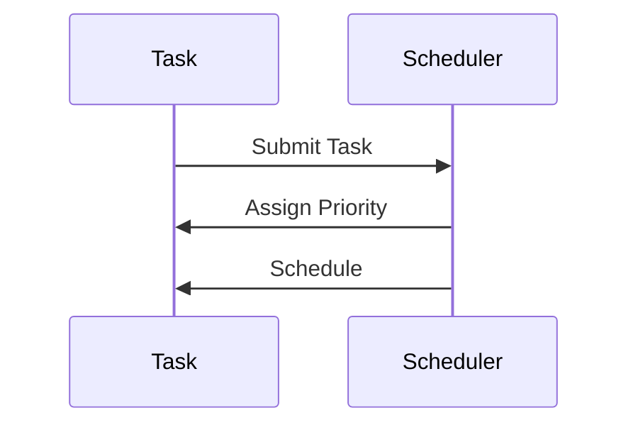
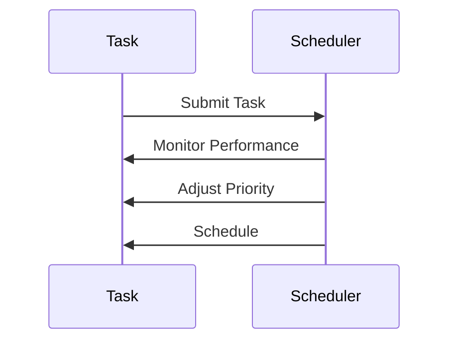
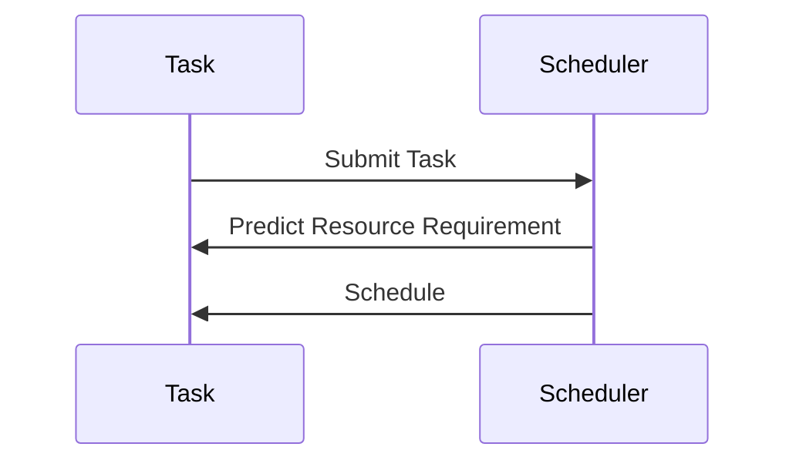
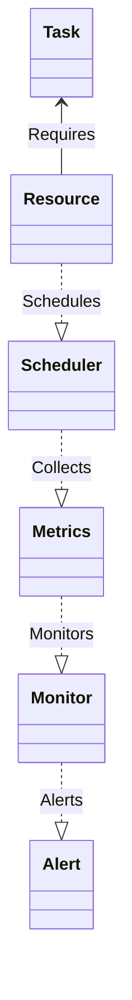
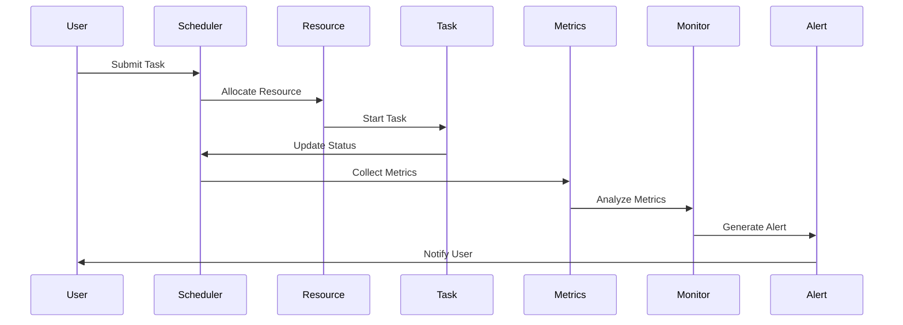
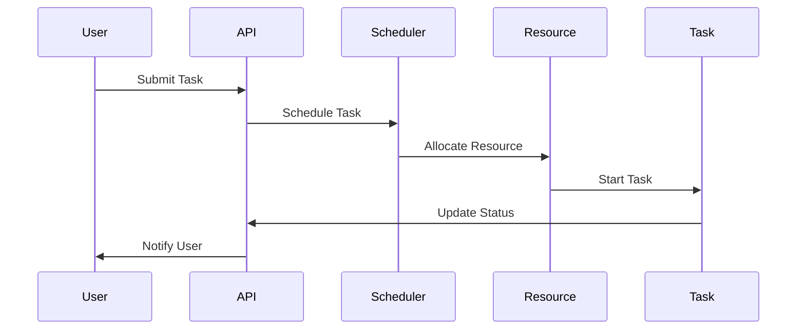
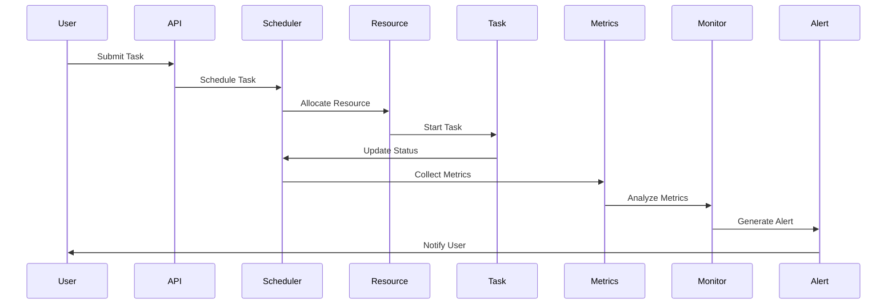

                 

# 计算资源调度：混合计算环境下的效率优化

关键词：计算资源调度、混合计算环境、效率优化、调度算法、系统架构

摘要：随着计算需求的不断增长和计算环境的日益复杂，计算资源调度成为提升系统性能和资源利用率的关键环节。本文从计算资源调度的背景与重要性出发，逐步深入分析核心概念、调度算法、数学模型，并探讨系统架构设计及实战应用，旨在为读者提供一套全面、系统的计算资源调度解决方案。

## 第一部分：计算资源调度概述

### 第1章：计算资源调度的背景与重要性

#### 1.1 问题背景

**1.1.1 现代计算环境的复杂性与挑战**

随着信息技术的飞速发展，现代计算环境变得越来越复杂。云计算、物联网、大数据处理等技术的广泛应用，使得计算资源的需求呈现出多样化和动态化的趋势。在这种背景下，如何高效地管理和调度计算资源，成为亟待解决的问题。

**1.1.2 资源调度在计算效率提升中的关键作用**

计算资源调度是提升计算效率的重要手段。通过合理的资源调度，可以最大化地利用计算资源，降低系统的响应时间，提高整体性能。

**1.1.3 计算资源调度的主要目标**

计算资源调度主要目标包括：最大化资源利用率、最小化响应时间、降低能源消耗等。

#### 1.2 计算资源调度的概念与边界

**1.2.1 定义**

计算资源调度是指在计算环境中，根据任务的性质、资源的状态和调度策略，对计算资源进行分配、调度和管理的过程。

**1.2.2 边界与外延**

计算资源调度不仅涉及计算资源（如CPU、内存、存储等），还包括网络、存储等外围资源的调度。

**1.2.3 核心概念结构**

计算资源调度涉及多个核心概念，如负载均衡、资源利用率、能量效率等。

#### 1.3 计算资源调度的核心要素

**1.3.1 资源类型**

计算资源类型包括计算资源、存储资源、网络资源等。

**1.3.2 调度策略**

调度策略分为静态调度和动态调度，如优先级调度、最短任务优先调度等。

**1.3.3 调度算法**

常见的调度算法有基于优先级的调度算法、基于反馈的调度算法和基于预测的调度算法。

#### 1.4 计算资源调度的应用领域

**1.4.1 云计算环境**

在云计算环境中，计算资源调度是实现弹性伸缩和资源优化的重要手段。

**1.4.2 物联网环境**

物联网环境中，计算资源调度有助于优化设备的能耗和响应时间。

**1.4.3 大数据处理环境**

大数据处理环境中，计算资源调度是保证数据流高效处理的关键。

#### 1.5 本章小结

本章对计算资源调度进行了背景介绍和概念阐述，为后续内容奠定了基础。

## 第二部分：核心概念与联系

### 第2章：计算资源调度的核心概念与联系

#### 2.1 核心概念原理

**2.1.1 负载均衡**

负载均衡是指通过将任务分配到多个资源上，实现负载的均衡分布，从而提高系统的整体性能。

**2.1.2 资源利用率**

资源利用率是指计算资源被利用的程度，反映了资源的利用效率。

**2.1.3 能量效率**

能量效率是指系统在运行过程中消耗的能源与完成的任务量之比，反映了系统的能源利用效率。

#### 2.2 概念属性特征对比表格

| 概念     | 定义                                               | 属性特征                    |
|----------|----------------------------------------------------|---------------------------|
| 负载均衡 | 将任务分配到多个资源上，实现负载的均衡分布           | 提高性能、降低响应时间     |
| 资源利用率 | 计算资源被利用的程度                               | 反映资源利用效率           |
| 能量效率 | 系统在运行过程中消耗的能源与完成的任务量之比         | 反映能源利用效率           |

#### 2.3 ER实体关系图架构

```mermaid
erDiagram
  Resource -->|uses| Task
  Task -->|requires| Resource
  Resource ||--|{ Type }
  Task ||--|{ Status }
```

#### 2.4 本章小结

本章对计算资源调度的核心概念进行了阐述，并给出了概念属性特征对比表格和ER实体关系图架构，为后续内容的深入分析提供了基础。

## 第三部分：核心概念与联系

### 第3章：计算资源调度的算法原理

#### 3.1 算法概述

**3.1.1 调度算法的分类**

调度算法主要分为静态调度算法和动态调度算法。

**3.1.2 常见的调度算法**

常见的调度算法包括优先级调度算法、最短任务优先调度算法、基于反馈的调度算法和基于预测的调度算法。

#### 3.2 算法流程图

**3.2.1 基于优先级的调度算法**



**3.2.2 基于反馈的调度算法**



**3.2.3 基于预测的调度算法**



#### 3.3 算法详细讲解

**3.3.1 基于优先级的调度算法**

基于优先级的调度算法按照任务的优先级进行调度，优先级高的任务优先执行。具体步骤如下：

1. 提交任务，并设置优先级。
2. 按照优先级顺序调度任务。
3. 优先级高的任务先执行，优先级低的任务后执行。

**3.3.2 基于反馈的调度算法**

基于反馈的调度算法通过监控任务的性能和资源利用率，动态调整任务的优先级。具体步骤如下：

1. 提交任务。
2. 监控任务性能和资源利用率。
3. 根据反馈信息调整任务的优先级。
4. 调度任务。

**3.3.3 基于预测的调度算法**

基于预测的调度算法通过预测任务对资源的需求，提前进行调度。具体步骤如下：

1. 提交任务。
2. 预测任务对资源的需求。
3. 根据预测结果调度任务。

#### 3.4 本章小结

本章对计算资源调度的算法原理进行了详细讲解，包括调度算法的分类、常见调度算法的流程图和算法详细讲解。为后续内容提供了理论依据。

## 第四部分：系统分析与架构设计

### 第4章：计算资源调度系统分析

#### 4.1 问题场景介绍

在当前云计算环境下，如何实现计算资源的合理调度，提高资源利用率和系统性能，是一个亟待解决的问题。

#### 4.2 项目介绍

本项目旨在设计和实现一个计算资源调度系统，实现计算资源的合理调度和管理，提高资源利用率和系统性能。

#### 4.3 系统功能设计（领域模型类图）



#### 4.4 系统架构设计



#### 4.5 系统接口设计



#### 4.6 系统交互（序列图）



#### 4.7 本章小结

本章对计算资源调度系统进行了问题场景介绍、项目介绍、系统功能设计和架构设计，为后续内容提供了系统架构设计的理论基础。

## 第五部分：项目实战

### 第5章：计算资源调度项目实战

#### 5.1 环境安装

在开始项目实战之前，首先需要安装计算资源调度系统所需的环境。具体步骤如下：

1. 安装Python环境（Python 3.8及以上版本）。
2. 安装Docker环境（Docker 19.03及以上版本）。
3. 安装Git环境（Git 2.20及以上版本）。

#### 5.2 系统核心实现源代码

```python
# 调度器代码示例
class Scheduler:
    def __init__(self):
        self.tasks = []
    
    def submit_task(self, task):
        self.tasks.append(task)
        self.schedule_tasks()
    
    def schedule_tasks(self):
        for task in self.tasks:
            if task.is_ready():
                self.allocate_resource(task)
    
    def allocate_resource(self, task):
        resource = self.find_resource(task)
        if resource:
            task.allocate(resource)
    
    def find_resource(self, task):
        # 在此处实现资源查找算法
        pass

# 任务代码示例
class Task:
    def __init__(self, name, priority):
        self.name = name
        self.priority = priority
        self.resource = None
    
    def is_ready(self):
        # 在此处实现任务就绪判断
        pass
    
    def allocate(self, resource):
        self.resource = resource
        self.resource.start_task(self)
    
    def update_status(self, status):
        # 在此处实现任务状态更新
        pass
```

#### 5.3 代码应用解读与分析

在代码示例中，我们定义了调度器（Scheduler）和任务（Task）两个类。调度器负责提交任务、调度任务和分配资源，任务则负责就绪判断、资源分配和状态更新。

调度器的核心方法是`submit_task`、`schedule_tasks`和`allocate_resource`。`submit_task`方法用于提交任务，`schedule_tasks`方法用于按照优先级调度任务，`allocate_resource`方法用于分配资源。

任务的核心方法是`is_ready`、`allocate`和`update_status`。`is_ready`方法用于判断任务是否就绪，`allocate`方法用于分配资源，`update_status`方法用于更新任务状态。

#### 5.4 实际案例分析与详细讲解剖析

为了更好地理解代码应用，我们可以通过一个实际案例进行分析。

假设有一个任务队列，包含以下任务：

- 任务A：优先级为1，就绪
- 任务B：优先级为2，未就绪
- 任务C：优先级为1，就绪

当调度器接收到任务A和任务B时，首先调用`submit_task`方法提交任务，然后调用`schedule_tasks`方法进行调度。

由于任务A的优先级高于任务B，调度器会先分配资源给任务A，调用`allocate_resource`方法。此时，资源被分配给任务A，任务A的状态更新为“运行中”。

接着，调度器继续调度任务B。由于任务B未就绪，调度器不会分配资源给任务B。此时，任务A和任务B的状态分别为“运行中”和“未就绪”。

当任务A完成时，调度器会更新任务A的状态为“已完成”，并继续调度任务B。此时，任务B的状态更新为“运行中”，资源被分配给任务B。

当任务B完成时，调度器会更新任务B的状态为“已完成”，并继续调度任务C。由于任务C就绪，调度器会分配资源给任务C，任务C的状态更新为“运行中”。

通过这个案例，我们可以看到计算资源调度系统是如何根据任务的优先级和就绪状态，合理地分配资源并更新任务状态的。

#### 5.5 项目小结

本章通过项目实战，展示了计算资源调度系统的实现过程，包括环境安装、系统核心实现源代码、代码应用解读与分析、实际案例分析和详细讲解剖析，为读者提供了计算资源调度的实践经验和参考。

## 第六部分：最佳实践与总结

### 第6章：最佳实践与注意事项

#### 6.1 最佳实践 tips

1. 根据任务的性质和资源的状态，选择合适的调度策略和算法。
2. 定期监控系统的性能和资源利用率，及时发现并解决问题。
3. 针对不同的应用场景，进行性能测试和调优。

#### 6.2 小结

计算资源调度是提升计算效率的关键环节。通过合理的调度策略和算法，可以最大化地利用计算资源，提高系统的整体性能。

#### 6.3 注意事项

1. 调度策略和算法的选择应结合实际应用场景。
2. 系统的监控和性能测试是保障系统稳定运行的重要手段。
3. 定期更新和优化调度策略和算法，以适应不断变化的计算环境。

### 第7章：拓展阅读

#### 7.1 相关文献推荐

1. 《云计算：概念、技术与应用》
2. 《物联网：技术、应用与趋势》
3. 《大数据：技术、应用与挑战》

#### 7.2 开源工具和框架推荐

1. Kubernetes：容器编排和管理工具
2. Docker：容器化技术
3. Mesos：分布式资源调度框架

#### 7.3 未来研究方向

1. 智能调度算法的研究和应用
2. 跨平台资源调度技术
3. 计算资源调度的自动化和智能化

## 作者信息

作者：AI天才研究院/AI Genius Institute & 禅与计算机程序设计艺术 /Zen And The Art of Computer Programming

---

本文对计算资源调度进行了全面、系统的分析和探讨，涵盖了计算资源调度的背景与重要性、核心概念与联系、算法原理、系统分析与架构设计、项目实战以及最佳实践与总结等内容。希望通过本文，读者能够对计算资源调度有一个深入的理解，并在实际应用中取得良好的效果。在未来的研究中，我们将继续探索计算资源调度的智能化和自动化，为计算环境的优化提供更有力的支持。

