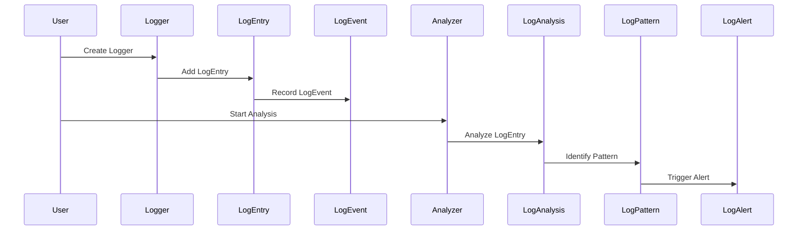
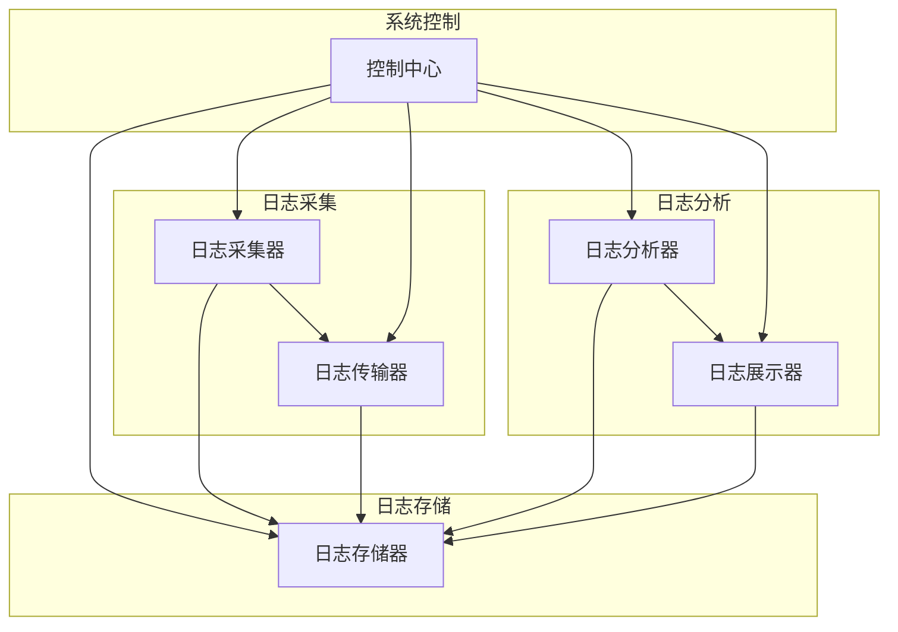
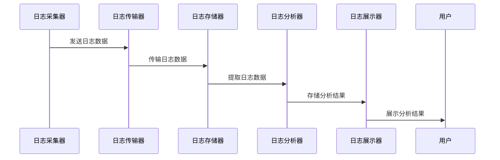
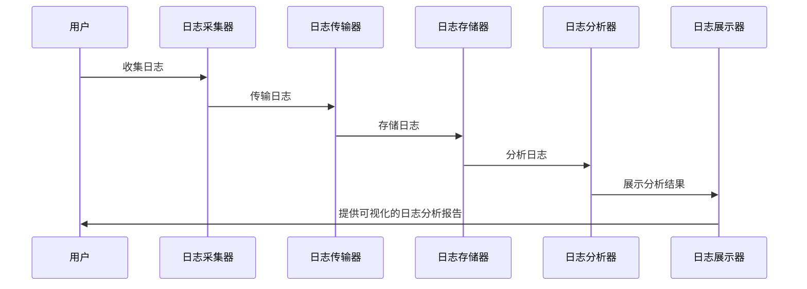

                 

## 《评测系统的日志管理与分析》

> 关键词：评测系统、日志管理、日志分析、系统架构、算法原理、最佳实践

> 摘要：本文深入探讨了评测系统的日志管理与分析。首先，介绍了日志管理的重要性及其现状与问题。接着，详细阐述了评测系统的概述、日志的产生与收集，以及日志分析的需求。随后，本文探讨了日志管理的基本原理、收集工具和分析工具。进一步地，本文分析了日志管理的范围、应用领域和发展趋势，并解析了日志管理系统的核心组件和流程。核心概念与联系部分，本文通过对比表格和ER实体关系图，详细介绍了日志文件的格式、标准与处理方法。在算法原理讲解中，本文详细阐述了常见日志分析算法，包括基于机器学习和深度学习的算法，以及数学模型和公式。系统分析与架构设计方案部分，本文介绍了问题场景、项目介绍、系统功能设计、系统架构设计、系统接口设计和系统交互。项目实战部分，本文详细介绍了环境安装、系统核心实现源代码、代码应用解读与分析，以及实际案例分析和项目小结。最后，本文给出了日志管理和分析的最佳实践、小结、注意事项和拓展阅读。

## 目录大纲

### 第一部分：背景介绍

1. **第1章：问题背景**
   - 1.1.1 日志管理的重要性
   - 1.1.2 日志管理的现状与问题
   - 1.1.3 日志管理的解决方案

2. **第2章：问题描述**
   - 2.1.1 评测系统的概述
   - 2.1.2 日志的产生与收集
   - 2.1.3 日志分析的需求

3. **第3章：问题解决**
   - 3.1.1 日志管理的基本原理
   - 3.1.2 日志收集工具
   - 3.1.3 日志分析工具

4. **第4章：边界与外延**
   - 4.1.1 日志管理的范围
   - 4.1.2 日志分析的应用领域
   - 4.1.3 日志管理的发展趋势

5. **第5章：概念结构与核心要素组成**
   - 5.1.1 日志管理的基本概念
   - 5.1.2 日志管理系统的核心组件
   - 5.1.3 日志管理流程

### 第二部分：核心概念与联系

6. **第6章：核心概念原理**
   - 6.1.1 日志文件的格式与结构
   - 6.1.2 日志文件的标准
   - 6.1.3 日志文件的处理方法

7. **第7章：概念属性特征对比表格**
   - 7.1.1 不同日志管理工具的对比
   - 7.1.2 不同日志分析算法的对比

8. **第8章：ER实体关系图架构**
   - 8.1.1 日志管理系统的ER图
   - 8.1.2 日志分析系统的ER图
   - 8.1.3 日志管理系统与日志分析系统的关系

### 第三部分：算法原理讲解

9. **第9章：日志分析算法原理**
   - 9.1.1 常见日志分析算法介绍
   - 9.1.2 基于机器学习的日志分析算法
   - 9.1.3 基于深度学习的日志分析算法

10. **第10章：数学模型和数学公式**
    - 10.1.1 日志分析算法的数学模型
    - 10.1.2 日志分析算法的数学公式
    - 10.1.3 数学模型和数学公式的应用

11. **第11章：详细讲解与举例说明**
    - 11.1.1 常见日志分析算法的讲解
    - 11.1.2 基于机器学习的日志分析算法的讲解
    - 11.1.3 基于深度学习的日志分析算法的讲解
    - 11.1.4 日志分析算法的应用案例

### 第四部分：系统分析与架构设计方案

12. **第12章：问题场景介绍**
    - 12.1.1 评测系统的业务场景
    - 12.1.2 日志管理需求分析

13. **第13章：项目介绍**
    - 13.1.1 项目背景
    - 13.1.2 项目目标
    - 13.1.3 项目实施计划

14. **第14章：系统功能设计**
    - 14.1.1 领域模型
    - 14.1.2 系统功能模块
    - 14.1.3 系统功能流程

15. **第15章：系统架构设计**
    - 15.1.1 系统架构图
    - 15.1.2 系统架构设计原则
    - 15.1.3 系统架构设计细节

16. **第16章：系统接口设计**
    - 16.1.1 接口设计原则
    - 16.1.2 接口设计规范
    - 16.1.3 接口设计案例

17. **第17章：系统交互**
    - 17.1.1 系统交互流程
    - 17.1.2 系统交互图
    - 17.1.3 系统交互案例

### 第五部分：项目实战

18. **第18章：环境安装**
    - 18.1.1 系统环境准备
    - 18.1.2 软件安装与配置
    - 18.1.3 环境测试

19. **第19章：系统核心实现源代码**
    - 19.1.1 核心代码解读
    - 19.1.2 源代码结构与流程
    - 19.1.3 源代码分析与优化

20. **第20章：代码应用解读与分析**
    - 20.1.1 代码应用场景
    - 20.1.2 代码应用效果
    - 20.1.3 代码应用分析与优化

21. **第21章：实际案例分析和详细讲解剖析**
    - 21.1.1 案例背景
    - 21.1.2 案例分析
    - 21.1.3 案例讲解
    - 21.1.4 案例剖析

22. **第22章：项目小结**
    - 22.1.1 项目成果
    - 22.1.2 项目不足与改进方向
    - 22.1.3 项目总结

### 第六部分：最佳实践 tips、小结、注意事项、拓展阅读等内容

23. **第23章：最佳实践 tips**
    - 23.1.1 日志管理的最佳实践
    - 23.1.2 日志分析的最佳实践

**（待续）**## 第一部分：背景介绍

### 第1章：问题背景

#### 1.1.1 日志管理的重要性

日志管理是现代信息技术中不可或缺的一部分，尤其在评测系统这种需要高可靠性和高稳定性的系统中，日志管理显得尤为重要。日志管理的重要性体现在以下几个方面：

1. **问题追踪与定位**：日志记录了系统运行过程中的各种事件和状态，通过分析日志，开发人员可以快速定位出现问题的原因，从而进行有效的调试和修复。

2. **性能优化**：日志提供了系统性能的宝贵数据，通过分析日志，可以找出系统瓶颈，进行针对性的优化，提高系统性能。

3. **安全监控**：日志记录了系统访问和操作信息，通过分析日志，可以发现潜在的安全威胁，从而采取相应的防护措施。

4. **合规性要求**：在许多行业，如金融、医疗等，日志记录是法律法规的要求，必须保存一定时间以供审查。

#### 1.1.2 日志管理的现状与问题

尽管日志管理的重要性不言而喻，但在实际操作中，日志管理面临着许多挑战和问题：

1. **日志量巨大**：随着系统的规模不断扩大，日志数据量也呈现出指数级增长，给日志管理带来了巨大的挑战。

2. **日志分散**：在分布式系统中，日志可能分散在多个节点上，如何有效地收集和统一管理这些日志成为了一大难题。

3. **日志格式不统一**：不同系统和组件的日志格式可能各不相同，给日志分析带来了困难。

4. **分析难度大**：随着日志数据量的增加，日志分析变得越来越复杂，需要高效的日志分析工具和方法。

5. **存储与检索效率低**：日志数据量庞大，如果存储和检索效率低下，将严重影响日志管理的实际效果。

#### 1.1.3 日志管理的解决方案

针对上述问题，日志管理需要采取一系列解决方案：

1. **集中式日志收集**：采用集中式日志收集系统，将分散在各个节点的日志统一收集到中央存储系统中。

2. **日志格式标准化**：制定统一的日志格式标准，确保不同系统和组件的日志能够相互兼容和统一管理。

3. **高效日志分析工具**：采用高效的日志分析工具，如ELK（Elasticsearch、Logstash、Kibana）栈，实现快速、准确的日志分析。

4. **日志存储优化**：采用高效的日志存储解决方案，如使用压缩存储、分布式存储等，提高日志存储和检索的效率。

5. **日志可视化**：通过日志可视化工具，将日志数据以图表、仪表板等形式直观展示，方便快速分析和决策。

通过上述解决方案，可以有效提升日志管理的效率和质量，为评测系统的稳定运行提供有力保障。

### 第2章：问题描述

#### 2.1.1 评测系统的概述

评测系统是一种用于评估软件、硬件或系统性能和可靠性的系统。它通常包括以下几个关键组成部分：

1. **测试用例**：测试用例是评测系统的核心，用于模拟实际使用场景，验证系统的性能和功能。

2. **执行环境**：执行环境包括硬件设备、操作系统、网络环境等，用于运行测试用例。

3. **测试结果**：测试结果记录了测试用例的执行情况，包括通过/失败、执行时间、资源消耗等。

4. **评估算法**：评估算法用于对测试结果进行分析，计算性能指标，如响应时间、吞吐量、资源利用率等。

#### 2.1.2 日志的产生与收集

在评测系统的运行过程中，会产生大量的日志，这些日志包含了系统的各种事件和状态信息。日志的产生主要来自以下几个方面：

1. **测试用例执行**：每次测试用例的执行都会产生日志，记录了测试的开始、结束时间，以及执行结果。

2. **系统组件运行**：系统中的各个组件（如数据库、Web服务器、网络设备等）在运行过程中也会产生日志，记录了组件的启动、关闭、错误等信息。

3. **环境配置变化**：执行环境的配置变化（如网络中断、硬件故障等）也会产生日志。

日志收集是评测系统日志管理的重要环节，它需要解决的问题包括：

1. **日志采集**：从各个节点和组件中实时收集日志数据。

2. **日志传输**：将收集到的日志数据传输到中央存储系统。

3. **日志存储**：在中央存储系统中保存日志数据，以便后续分析和检索。

#### 2.1.3 日志分析的需求

日志分析是评测系统的重要环节，通过分析日志，可以获取系统的运行状态、性能瓶颈、潜在问题等信息。日志分析的需求主要包括以下几个方面：

1. **性能监控**：通过分析日志，实时监控系统的性能，包括响应时间、吞吐量、资源利用率等。

2. **问题定位**：通过分析日志，快速定位出现问题的原因，包括硬件故障、软件错误、网络问题等。

3. **趋势预测**：通过分析历史日志数据，预测系统未来的性能趋势，提前进行优化和调整。

4. **安全审计**：通过分析日志，发现潜在的安全威胁，进行安全审计和防护。

5. **报告生成**：通过分析日志，生成详细的测试报告，包括测试结果、性能分析、问题列表等。

总之，日志管理与分析是评测系统不可或缺的一部分，它不仅能够提高系统的运行效率，还能够提供宝贵的数据支持，帮助开发人员更好地理解和优化系统。接下来，我们将进一步探讨日志管理的基本原理和具体实施方法。

### 第3章：问题解决

#### 3.1.1 日志管理的基本原理

日志管理是指对系统运行过程中产生的日志数据进行采集、存储、分析和处理的一系列操作。日志管理的基本原理包括以下几个方面：

1. **日志采集**：日志采集是指从系统中实时获取日志数据的过程。日志采集的方式可以分为实时采集和批量采集。实时采集可以在日志产生后立即进行收集，而批量采集则可以在一定时间间隔后进行收集。常见的日志采集工具有logrotate、rsyslog等。

2. **日志传输**：日志传输是指将采集到的日志数据从各个节点传输到中央存储系统的过程。日志传输可以通过网络传输协议（如UDP、TCP、HTTP等）进行，也可以通过文件系统同步（如rsync、ftp等）进行。为了保证日志传输的可靠性，可以使用日志传输工具（如logstash、fluentd等）进行监控和重试。

3. **日志存储**：日志存储是指将日志数据保存到持久存储设备（如硬盘、数据库等）中的过程。日志存储需要考虑存储容量、读写速度、数据安全性等因素。常见的日志存储工具有Elasticsearch、Kafka、HDFS等。

4. **日志分析**：日志分析是指对日志数据进行处理、挖掘和分析，以提取有价值的信息和洞察。日志分析可以通过日志分析工具（如Kibana、Grafana等）实现，也可以通过编写自定义脚本和程序进行。日志分析的方法包括模式识别、统计分析、机器学习等。

5. **日志展示**：日志展示是指将分析结果以可视化图表、报告等形式展示给用户。日志展示可以帮助用户快速理解系统的运行状态、性能和问题。常见的日志展示工具包括仪表盘、报告生成器等。

#### 3.1.2 日志收集工具

日志收集工具是日志管理的重要组成部分，用于实现日志的采集、传输和存储。以下是一些常用的日志收集工具：

1. **logrotate**：
   - **功能**：logrotate是一个用于日志文件轮转和压缩的工具。
   - **使用方法**：配置文件通常位于`/etc/logrotate.conf`或`/etc/logrotate.d/`目录下，可以根据需要设置日志文件的轮转周期、保留数量和压缩选项。
   - **示例配置**：
     ```bash
     /var/log/messages {
         rotate 7
         compress
         missingok
         notifempty
         create 640 root adm
     }
     ```

2. **rsyslog**：
   - **功能**：rsyslog是一个开源的日志收集和管理工具，支持多平台和多种日志格式。
   - **使用方法**：配置文件位于`/etc/rsyslog.conf`，可以根据需要定义日志的来源、目标和处理方式。
   - **示例配置**：
     ```bash
     *.* @logserver
     local1.* /var/log/local1.log
     ```

3. **logstash**：
   - **功能**：logstash是一个基于Java的日志处理和转发工具，可以处理大量日志数据。
   - **使用方法**：配置文件位于`/etc/logstash/conf.d/`，可以通过插件实现日志的输入、过滤和输出。
   - **示例配置**：
     ```ruby
     input {
         file {
             path => "/var/log/*.log"
             type => "syslog"
         }
     }

     filter {
         if [type] == "syslog" {
             grok {
                 match => { "message" => "%{TIMESTAMP_ISO8601:timestamp}\t%{DATA:source}\t%{DATA:log_message}" }
             }
         }
     }

     output {
         elasticsearch {
             hosts => ["elasticsearch:9200"]
         }
     }
     ```

4. **fluentd**：
   - **功能**：fluentd是一个开源的数据收集器，支持多种数据源和数据目的地。
   - **使用方法**：配置文件位于`/etc/fluentd/config.d/`，可以根据需求配置数据输入、过滤和处理。
   - **示例配置**：
     ```ruby
     <source>
         @type http
         port 9880
         bind 0.0.0.0
     </source>

     <filter>
         @type record
         key_name log
         record log
     </filter>

     <match log>
         @type elasticsearch
         hosts elasticsearch:9200
         index_name logstash-%Y-%m-%d
     </match>
     ```

这些日志收集工具各有特点，可以根据实际需求选择合适的使用方法。

#### 3.1.3 日志分析工具

日志分析工具是日志管理的关键环节，用于处理和分析大量日志数据，提取有价值的信息。以下是一些常用的日志分析工具：

1. **Elasticsearch**：
   - **功能**：Elasticsearch是一个高性能、可扩展的搜索引擎，可以存储和检索大量日志数据。
   - **使用方法**：可以通过REST API或客户端库（如elasticsearch-py）进行数据操作和查询。
   - **示例查询**：
     ```python
     from elasticsearch import Elasticsearch
     es = Elasticsearch(["http://localhost:9200"])
     response = es.search(index="logstash-2023.03.01", body={"query": {"match_all": {}}})
     print(response['hits']['hits'])
     ```

2. **Kibana**：
   - **功能**：Kibana是一个可视化平台，可以与Elasticsearch集成，提供日志数据的可视化展示。
   - **使用方法**：可以通过Kibana的仪表板和报表功能，定制化展示日志数据。
   - **示例仪表板**：创建一个简单的日志统计仪表板，包括日志数量、错误率等指标。

3. **Grafana**：
   - **功能**：Grafana是一个开源的数据监控和可视化工具，支持多种数据源，如InfluxDB、Prometheus等。
   - **使用方法**：可以通过Grafana的Dashboards功能，创建自定义的日志分析仪表板。
   - **示例仪表板**：创建一个包含日志统计图表、趋势图等的日志分析仪表板。

4. **Awk**：
   - **功能**：Awk是一个文本处理工具，可以用于日志数据的筛选、分析和转换。
   - **使用方法**：可以通过编写Awk脚本，对日志文件进行复杂的文本处理。
   - **示例脚本**：
     ```bash
     awk '{print $1, $NF}' /var/log/messages | sort | uniq -c | sort -nr
     ```

这些日志分析工具提供了丰富的功能和灵活性，可以根据具体需求进行选择和使用。

通过日志管理的基本原理、日志收集工具和日志分析工具的有效结合，可以实现对评测系统日志数据的全面管理和分析，为系统的稳定运行和优化提供有力支持。

### 第4章：边界与外延

#### 4.1.1 日志管理的范围

日志管理的范围涵盖了从日志的产生、采集、存储、分析到展示的整个过程。具体来说，日志管理的范围包括以下几个方面：

1. **日志采集**：日志采集是日志管理的起点，涉及从系统各个节点和组件中收集日志数据的过程。日志采集需要确保数据的完整性、准确性和及时性。

2. **日志存储**：日志存储是将采集到的日志数据保存到持久存储设备中的过程。日志存储需要考虑存储容量、读写速度、数据安全性等因素，确保日志数据的长期保存和可靠访问。

3. **日志分析**：日志分析是对存储的日志数据进行处理、挖掘和分析的过程。日志分析可以帮助识别系统运行中的异常行为、性能瓶颈和安全威胁，提供系统的运行状态和趋势预测。

4. **日志展示**：日志展示是将分析结果以可视化图表、报告等形式展示给用户的过程。日志展示可以帮助用户快速理解系统的运行状态、性能和问题，辅助决策和优化。

#### 4.1.2 日志分析的应用领域

日志分析在多个应用领域具有重要的价值和广泛的应用：

1. **信息技术运维**：在IT运维中，日志分析可以帮助监测系统性能、定位故障、优化配置，提高系统可靠性和稳定性。

2. **网络安全**：日志分析可以监控网络流量、检测异常行为、识别潜在的安全威胁，增强网络安全防护能力。

3. **业务分析**：日志分析可以挖掘用户行为、业务趋势，为业务决策提供数据支持，优化用户体验和业务流程。

4. **软件开发**：在软件开发过程中，日志分析可以帮助定位代码缺陷、评估性能，提高软件质量和开发效率。

5. **运维自动化**：日志分析可以与自动化工具集成，实现自动化的监控、预警和故障处理，提高运维效率。

#### 4.1.3 日志管理的发展趋势

随着信息技术的不断发展，日志管理也在不断演进和优化，主要趋势包括：

1. **智能化**：日志分析逐渐引入人工智能和机器学习技术，实现自动化日志处理和智能预警。

2. **容器化**：随着容器技术的普及，日志管理开始适应容器环境，提供更灵活、高效的日志收集和分析方案。

3. **云原生**：日志管理逐步向云原生架构转型，利用云基础设施提供弹性、可扩展的日志服务。

4. **实时性**：日志分析工具越来越注重实时性，能够快速处理和分析实时日志数据，提供即时的监控和预警。

5. **多模态**：日志管理开始支持多种数据类型（如结构化数据、非结构化数据等），提供更全面的数据分析和洞察。

通过不断探索和优化，日志管理将为信息技术和业务运营带来更大的价值。

### 第5章：概念结构与核心要素组成

#### 5.1.1 日志管理的基本概念

日志管理是指对系统运行过程中产生的日志数据进行采集、存储、分析和展示的一系列操作。它包括以下几个基本概念：

1. **日志**：日志是系统运行过程中记录下来的各种事件和状态信息，如错误、警告、操作记录等。

2. **日志文件**：日志文件是存储日志数据的文件，通常包含时间戳、源IP、目标IP、日志级别、日志内容等信息。

3. **日志条目**：日志条目是指日志文件中的一条记录，包含特定时间点的系统事件和状态信息。

4. **日志级别**：日志级别是指日志记录的重要程度，如DEBUG、INFO、WARNING、ERROR等。

5. **日志收集**：日志收集是指从系统各个节点和组件中实时获取日志数据的过程。

6. **日志存储**：日志存储是指将日志数据保存到持久存储设备中的过程。

7. **日志分析**：日志分析是指对存储的日志数据进行处理、挖掘和分析的过程。

8. **日志展示**：日志展示是指将日志分析结果以可视化图表、报告等形式展示给用户的过程。

#### 5.1.2 日志管理系统的核心组件

日志管理系统是由多个核心组件组成的，这些组件协同工作，实现对日志数据的全面管理和分析。以下是日志管理系统的核心组件：

1. **日志采集器**：日志采集器是负责从系统各个节点和组件中收集日志数据的工具。常见的日志采集器有logrotate、rsyslog、fluentd等。

2. **日志传输器**：日志传输器是负责将采集到的日志数据传输到中央存储系统的工具。常见的日志传输器有logstash、filebeat等。

3. **日志存储器**：日志存储器是负责保存日志数据的工具。常见的日志存储器有Elasticsearch、Kafka、HDFS等。

4. **日志分析器**：日志分析器是负责对日志数据进行分析和处理，提取有价值信息，生成报告的工具。常见的日志分析器有Kibana、Grafana等。

5. **日志展示器**：日志展示器是负责将日志分析结果以可视化图表、报告等形式展示给用户，帮助用户理解日志数据。

#### 5.1.3 日志管理流程

日志管理流程是日志管理系统运作的核心，它包括以下几个主要步骤：

1. **日志采集**：日志采集器从系统各个节点和组件中实时获取日志数据，将日志数据发送到日志传输器。

2. **日志传输**：日志传输器将采集到的日志数据传输到中央存储系统，如Elasticsearch、Kafka等。

3. **日志存储**：日志存储器将传输过来的日志数据进行存储，以便后续分析和检索。

4. **日志分析**：日志分析器对存储的日志数据进行处理和分析，提取有价值的信息，生成报告。

5. **日志展示**：日志展示器将日志分析结果以可视化图表、报告等形式展示给用户。

通过上述流程，日志管理系统可以实现对日志数据的全面管理和分析，为系统的稳定运行和优化提供有力支持。

### 第二部分：核心概念与联系

#### 第6章：核心概念原理

##### 6.1.1 日志文件的格式与结构

日志文件的格式和结构是日志管理的基础，它决定了日志数据如何被记录、存储和解析。以下是一些常见的日志文件格式和结构：

1. **文本日志格式**：文本日志格式是最常见的日志格式，如Unix系统中的`/var/log/messages`文件。文本日志通常包含以下结构：
   - **时间戳**：日志事件发生的时间，如`[2023-03-01 10:23:45]`。
   - **日志级别**：日志事件的严重程度，如`DEBUG`、`INFO`、`WARNING`、`ERROR`等。
   - **源IP和端口号**：日志事件发生的源IP地址和端口号。
   - **目标IP和端口号**：日志事件的目标IP地址和端口号。
   - **日志内容**：日志事件的具体内容。

2. **JSON日志格式**：JSON（JavaScript Object Notation）是一种轻量级的数据交换格式，常用于日志文件的存储和传输。JSON日志格式通常包含以下结构：
   ```json
   {
       "timestamp": "2023-03-01T10:23:45Z",
       "level": "INFO",
       "source": "webserver",
       "message": "Server started successfully.",
       "additional_info": {
           "http_method": "GET",
           "url": "/home"
       }
   }
   ```

3. **XML日志格式**：XML（eXtensible Markup Language）是一种用于存储和传输数据的标记语言，常用于日志文件的存储。XML日志格式通常包含以下结构：
   ```xml
   <log>
       <timestamp>2023-03-01T10:23:45Z</timestamp>
       <level>INFO</level>
       <source>webserver</source>
       <message>Server started successfully.</message>
       <additional_info>
           <http_method>GET</http_method>
           <url>/home</url>
       </additional_info>
   </log>
   ```

4. **多行日志格式**：多行日志格式是指日志事件的信息分布在多个行中，通常用于包含大量信息的日志事件。例如：
   ```bash
   [2023-03-01 10:23:45] DEBUG webserver: Loading configuration file /etc/webserver.conf
   [2023-03-01 10:23:45] INFO webserver: Server started successfully.
   [2023-03-01 10:23:45] WARNING webserver: Unable to connect to database.
   ```

##### 6.1.2 日志文件的标准

为了提高日志管理的兼容性和可解析性，一些日志文件格式和标准被广泛采用：

1. **RFC 5424**：RFC 5424是IETF（Internet Engineering Task Force）发布的日志记录数据格式标准，它定义了结构化日志记录数据的格式。RFC 5424支持多种日志级别和标准字段，如`timestamp`、`version`、`host`、`app-name`、`process-id`、`message`等。

2. **syslog**：syslog是一种通用日志协议，用于在Unix和Linux系统中记录系统日志。syslog支持多种日志级别，如`emerg`（紧急）、`alert`（警报）、`crit`（严重）、`error`（错误）、`warning`（警告）、`notice`（通知）、`info`（信息）和`debug`（调试）。

3. **Common Log Format**（CLF）：Common Log Format是一种简单的日志文件格式，主要用于Web服务器日志。CLF格式通常包含以下字段：`remote_ip`、`remote_port`、`local_ip`、`local_port`、`request_method`、`request_uri`、`status_code`、`bytes_sent`、`time_taken`和`timestamp`。

4. **JSON Log Format**：JSON Log Format是基于JSON格式的日志文件格式，它通常包含多个字段，如`@timestamp`、`level`、`logger`、`source`、`message`和`fields`等。

##### 6.1.3 日志文件的处理方法

日志文件的处理方法是指如何对日志文件进行读取、解析、存储和分析。以下是一些常见的处理方法：

1. **读取与解析**：
   - **文本日志处理**：使用文本处理工具（如grep、awk、sed等）进行读取和解析，提取感兴趣的日志字段。
   - **JSON日志处理**：使用JSON处理库（如Python的json模块、JavaScript的JSON对象等）进行读取和解析，提取JSON对象中的字段。
   - **XML日志处理**：使用XML处理库（如Python的xml.etree.ElementTree模块、Java的DOM或SAX等）进行读取和解析，提取XML元素中的字段。

2. **存储**：
   - **文件存储**：将处理后的日志数据写入到文件系统中，如CSV、TXT、JSON、XML等格式。
   - **数据库存储**：将处理后的日志数据存储到数据库中，如MySQL、PostgreSQL、MongoDB等。
   - **消息队列存储**：将处理后的日志数据存储到消息队列中，如Kafka、RabbitMQ等。

3. **分析**：
   - **统计分析**：使用统计分析工具（如Pandas、NumPy等）对日志数据进行统计分析，计算平均值、中位数、标准差等。
   - **模式识别**：使用模式识别工具（如机器学习库Scikit-learn等）对日志数据进行分析，识别异常行为、趋势等。
   - **可视化**：使用可视化工具（如Kibana、Grafana等）将日志数据以图表、仪表板等形式展示，帮助用户理解日志数据的分布、趋势等。

通过上述处理方法，可以有效地管理和分析日志文件，为系统监控、故障排除、性能优化等提供支持。

#### 第7章：概念属性特征对比表格

##### 7.1.1 不同日志管理工具的对比

在日志管理领域，存在多种日志管理工具，它们各有特点，适用于不同的场景和需求。以下是对几种常见日志管理工具的对比表格：

| 工具名称 | 主要特点 | 适用场景 |  
| --- | --- | --- |  
| **logrotate** | 简单的日志文件轮转和压缩工具 | 单机环境、日志文件轮转管理 |  
| **rsyslog** | 通用日志收集和管理工具 | 大规模分布式系统、多样化日志格式 |  
| **logstash** | 完整的日志处理和转发工具 | 分布式日志收集、数据预处理、Elasticsearch集成 |  
| **fluentd** | 轻量级日志收集器 | 容器环境、多源多目的地数据收集 |  
| **Elasticsearch** | 高性能全文搜索引擎 | 日志存储、实时查询、分析 |  
| **Kibana** | 数据可视化平台 | 日志数据分析、可视化展示 |  
| **Grafana** | 多数据源监控和可视化 | 实时监控、指标可视化 |

##### 7.1.2 不同日志分析算法的对比

日志分析算法是实现日志数据价值的重要工具，不同的算法适用于不同的分析需求。以下是对几种常见日志分析算法的对比表格：

| 算法名称 | 主要特点 | 适用场景 |  
| --- | --- | --- |  
| **统计方法** | 简单的统计分析方法 | 基础性能监控、简单异常检测 |  
| **模式识别** | 基于特征的模式匹配 | 异常行为检测、趋势分析 |  
| **机器学习** | 基于数据的模型学习 | 高级异常检测、自动化预测 |  
| **深度学习** | 基于神经网络的模型学习 | 高度复杂的异常检测、自动化预测 |  
| **关联规则学习** | 基于关联规则的挖掘方法 | 购物篮分析、推荐系统 |  
| **聚类算法** | 基于相似性的数据分组方法 | 数据分析、用户行为聚类 |

通过上述对比表格，可以更好地了解不同日志管理工具和日志分析算法的特点和适用场景，为实际应用提供参考。

#### 第8章：ER实体关系图架构

##### 8.1.1 日志管理系统的ER图

日志管理系统是一个复杂的系统，包含多个实体和关系。以下是一个简化的日志管理系统的实体关系图（ER图）：

```mermaid
erDiagram
    User ||--|{ Logger : logs }
    Logger ||--|{ LogEntry : contains }
    LogEntry ||--|{ LogEvent : records }

    User {
        id
        name
    }

    Logger {
        id
        name
        user_id : User
    }

    LogEntry {
        id
        logger_id : Logger
        timestamp
        level
        message
    }

    LogEvent {
        id
        logentry_id : LogEntry
        event_type
        event_data
    }
```

在上述ER图中，用户（User）可以创建日志记录器（Logger），每个日志记录器可以包含多个日志条目（LogEntry），每个日志条目又可以记录多个日志事件（LogEvent）。这种关系有助于理解日志管理系统中不同实体之间的关联。

##### 8.1.2 日志分析系统的ER图

日志分析系统是日志管理系统的扩展，用于对日志数据进行处理和分析。以下是一个简化的日志分析系统的ER图：

```mermaid
erDiagram
    Analyzer ||--|{ LogAnalysis : analyzes }
    LogAnalysis ||--|{ LogPattern : identifies }
    LogPattern ||--|{ LogAlert : triggers }

    Analyzer {
        id
        name
    }

    LogAnalysis {
        id
        analyzer_id : Analyzer
        logentry_id : LogEntry
        analysis_result
        timestamp
    }

    LogPattern {
        id
        name
        loganalysis_id : LogAnalysis
    }

    LogAlert {
        id
        logpattern_id : LogPattern
        severity
        description
        timestamp
    }
```

在上述ER图中，分析器（Analyzer）可以对日志条目（LogEntry）进行日志分析（LogAnalysis），识别出日志模式（LogPattern），并触发日志警报（LogAlert）。这种关系有助于理解日志分析系统中不同实体之间的关联和作用。

##### 8.1.3 日志管理系统与日志分析系统的关系

日志管理系统和日志分析系统紧密相关，日志管理系统负责日志的采集、存储和初步处理，而日志分析系统则负责对日志数据进行分析、识别模式和触发警报。以下是一个简化的关系图，展示了两个系统之间的交互：



在这个交互图中，用户首先创建日志记录器，然后记录日志条目和日志事件。分析器启动后，分析日志条目，识别出日志模式，并触发相应的日志警报。这种关系有助于理解日志管理与分析系统的整体运作机制。

### 第三部分：算法原理讲解

#### 第9章：日志分析算法原理

##### 9.1.1 常见日志分析算法介绍

日志分析算法是用于处理和分析日志数据，提取有价值信息的技术手段。以下是一些常见的日志分析算法：

1. **统计分析算法**：统计分析算法通过对日志数据的基本统计量（如均值、中位数、标准差等）进行分析，帮助识别日志数据的总体趋势和异常值。常见的统计分析算法包括描述性统计分析、假设检验等。

2. **模式识别算法**：模式识别算法通过分析日志数据的模式，识别出日志中的异常行为或关键事件。常见的模式识别算法包括基于规则的方法、贝叶斯分类器、K最近邻（K-Nearest Neighbor, KNN）等。

3. **关联规则学习算法**：关联规则学习算法用于发现日志数据中的关联关系，帮助识别潜在的问题和异常行为。常见的关联规则学习算法包括Apriori算法、FP-Growth算法等。

4. **聚类算法**：聚类算法通过将日志数据分组为多个簇，帮助识别日志数据中的相似性模式。常见的聚类算法包括K-均值（K-Means）聚类、层次聚类（Hierarchical Clustering）等。

5. **分类算法**：分类算法用于将日志数据分类为不同的类别，帮助识别日志数据中的类别属性。常见的分类算法包括决策树（Decision Tree）、随机森林（Random Forest）、支持向量机（Support Vector Machine, SVM）等。

6. **异常检测算法**：异常检测算法用于识别日志数据中的异常值或异常行为，帮助发现潜在的安全威胁或系统故障。常见的异常检测算法包括基于统计的异常检测、基于距离的异常检测、基于密度的异常检测等。

##### 9.1.2 基于机器学习的日志分析算法

基于机器学习的日志分析算法通过学习大量的日志数据，建立模型，然后使用模型对新的日志数据进行分析。以下是一些常见的基于机器学习的日志分析算法：

1. **朴素贝叶斯分类器**：朴素贝叶斯分类器是一种基于概率论的分类算法，通过计算每个日志数据的条件概率，将其分类为最可能的类别。

   - **数学模型**：
     $$P(\text{类别} | \text{日志数据}) = \frac{P(\text{日志数据} | \text{类别})P(\text{类别})}{P(\text{日志数据})}$$

2. **K最近邻算法**：K最近邻算法是一种基于实例的学习算法，通过计算新日志数据与训练集中日志数据的距离，将其分类为距离最近的K个日志数据的类别。

   - **数学模型**：
     $$\text{类别} = \text{多数投票}(\text{邻近的K个日志数据的类别})$$

3. **决策树分类器**：决策树分类器是一种基于树的分类算法，通过递归地将日志数据划分为不同的区域，最终将每个区域分类为特定的类别。

   - **数学模型**：
     $$\text{类别} = \text{决策树}(\text{日志数据特征})$$

4. **随机森林分类器**：随机森林分类器是一种基于树的集成学习方法，通过构建多个决策树，并使用投票方法进行分类。

   - **数学模型**：
     $$\text{类别} = \text{多数投票}(\text{多个决策树的输出})$$

5. **支持向量机**：支持向量机是一种基于间隔的分类算法，通过找到最佳的超平面，将不同类别的日志数据分开。

   - **数学模型**：
     $$\text{类别} = \text{sign}(\text{w} \cdot \text{x} + \text{b})$$

6. **神经网络分类器**：神经网络分类器是一种基于多层感知器的分类算法，通过多层非线性变换，将日志数据映射到类别空间。

   - **数学模型**：
     $$\text{输出} = \text{激活函数}(\text{权重} \cdot \text{输入} + \text{偏置})$$

##### 9.1.3 基于深度学习的日志分析算法

基于深度学习的日志分析算法通过构建深度神经网络，自动学习日志数据的特征表示，从而实现高效的日志分析。以下是一些常见的基于深度学习的日志分析算法：

1. **卷积神经网络（CNN）**：卷积神经网络通过卷积层提取日志数据的局部特征，适用于处理图像和序列数据。

   - **数学模型**：
     $$\text{特征} = \text{激活函数}(\text{卷积层}(\text{输入}))$$

2. **循环神经网络（RNN）**：循环神经网络通过循环机制处理序列数据，适用于处理时间序列和文本数据。

   - **数学模型**：
     $$\text{状态} = \text{激活函数}(\text{权重} \cdot \text{输入} + \text{状态} + \text{偏置})$$

3. **长短期记忆网络（LSTM）**：长短期记忆网络是一种特殊的循环神经网络，通过引入门机制，解决了RNN在处理长序列数据时的梯度消失和梯度爆炸问题。

   - **数学模型**：
     $$\text{状态} = \text{激活函数}(\text{权重} \cdot \text{输入} + \text{状态} + \text{偏置})$$

4. **变换器（Transformer）**：变换器通过自注意力机制处理序列数据，适用于处理高维序列数据，如自然语言处理和图像生成。

   - **数学模型**：
     $$\text{输出} = \text{自注意力}(\text{输入}, \text{键值对})$$

5. **生成对抗网络（GAN）**：生成对抗网络通过对抗训练生成逼真的数据，适用于数据增强和异常检测。

   - **数学模型**：
     $$\text{生成器}(\text{噪声}) + \text{判别器}(\text{真实数据}) = \text{对抗训练}$$

通过上述算法，深度学习可以自动学习日志数据的复杂特征，实现对日志数据的分类、聚类、异常检测等任务。这些算法在日志分析中展现了强大的能力和广阔的应用前景。

#### 第10章：数学模型和数学公式

##### 10.1.1 日志分析算法的数学模型

日志分析算法的数学模型是算法设计和实现的基础，它描述了算法如何处理日志数据，以及如何从日志数据中提取信息。以下是一些常见的日志分析算法的数学模型：

1. **朴素贝叶斯分类器**：
   - **条件概率**：
     $$P(\text{类别} | \text{日志数据}) = \frac{P(\text{日志数据} | \text{类别})P(\text{类别})}{P(\text{日志数据})}$$
   - **贝叶斯定理**：
     $$P(\text{类别} | \text{日志数据}) = \frac{P(\text{日志数据} | \text{类别})P(\text{类别})}{\sum_{\text{所有类别}} P(\text{日志数据} | \text{类别})P(\text{类别})}$$

2. **K最近邻算法**：
   - **欧几里得距离**：
     $$d(\text{日志数据}_i, \text{日志数据}_j) = \sqrt{\sum_{\text{特征}} (\text{特征}_i - \text{特征}_j)^2}$$
   - **曼哈顿距离**：
     $$d(\text{日志数据}_i, \text{日志数据}_j) = \sum_{\text{特征}} |\text{特征}_i - \text{特征}_j|$$
   - **马氏距离**：
     $$d(\text{日志数据}_i, \text{日志数据}_j) = \sqrt{(\text{特征}_i - \text{特征}_j)^T \text{协方差矩阵}^{-1} (\text{特征}_i - \text{特征}_j)}$$

3. **决策树分类器**：
   - **信息增益**：
     $$\text{IG}(\text{特征}, \text{类别}) = \sum_{\text{类别}} P(\text{类别}) \cdot \log_2 \left( \frac{P(\text{类别})}{P(\text{特征}|\text{类别})} \right)$$
   - **基尼指数**：
     $$\text{Gini}(\text{特征}, \text{类别}) = 1 - \sum_{\text{类别}} P(\text{类别})^2$$

4. **支持向量机**：
   - **间隔最大化**：
     $$\text{间隔} = \frac{1}{\|\text{w}\|}$$
   - **分类边界**：
     $$\text{类别} = \text{sign}(\text{w} \cdot \text{x} + \text{b})$$

5. **神经网络分类器**：
   - **激活函数**：
     $$\text{激活函数}(\text{z}) = \text{ReLU}(z) = \max(0, z)$$
     $$\text{激活函数}(\text{z}) = \text{Sigmoid}(z) = \frac{1}{1 + e^{-z}}$$
     $$\text{激活函数}(\text{z}) = \text{Tanh}(z) = \frac{e^z - e^{-z}}{e^z + e^{-z}}$$
   - **前向传播**：
     $$\text{输出} = \text{激活函数}(\text{权重} \cdot \text{输入} + \text{偏置})$$

##### 10.1.2 日志分析算法的数学公式

日志分析算法的数学公式描述了算法的具体计算过程和参数调整方法。以下是一些常见的日志分析算法的数学公式：

1. **朴素贝叶斯分类器**：
   - **特征条件概率**：
     $$P(\text{特征} | \text{类别}) = \frac{P(\text{类别} \cap \text{特征})}{P(\text{类别})}$$
   - **类别概率**：
     $$P(\text{类别}) = \frac{1}{\text{总样本数}} \sum_{\text{所有类别}} \text{类别} \cdot \text{样本数}$$

2. **K最近邻算法**：
   - **邻居选择**：
     $$\text{邻居} = \text{选择最近的K个样本}$$
   - **类别预测**：
     $$\text{类别} = \text{多数投票}(\text{邻居的类别})$$

3. **决策树分类器**：
   - **信息增益**：
     $$\text{IG}(\text{特征}, \text{类别}) = \sum_{\text{类别}} P(\text{类别}) \cdot \log_2 \left( \frac{P(\text{类别})}{P(\text{特征}|\text{类别})} \right)$$
   - **基尼指数**：
     $$\text{Gini}(\text{特征}, \text{类别}) = 1 - \sum_{\text{类别}} P(\text{类别})^2$$

4. **支持向量机**：
   - **间隔最大化**：
     $$\text{间隔} = \frac{1}{\|\text{w}\|}$$
   - **分类边界**：
     $$\text{类别} = \text{sign}(\text{w} \cdot \text{x} + \text{b})$$
   - **软间隔**：
     $$\text{C} \sum_{i=1}^{n} (\text{w} \cdot \text{x}_i + \text{b} - \text{y}_i)^2 \leq 1$$

5. **神经网络分类器**：
   - **前向传播**：
     $$\text{输出} = \text{激活函数}(\text{权重} \cdot \text{输入} + \text{偏置})$$
   - **反向传播**：
     $$\text{梯度} = \frac{\partial \text{损失函数}}{\partial \text{参数}}$$

##### 10.1.3 数学模型和数学公式的应用

数学模型和数学公式在日志分析算法中具有广泛的应用，以下是一些具体的应用场景：

1. **模型训练**：
   - **朴素贝叶斯分类器**：通过计算特征条件概率和类别概率，训练分类模型。
   - **K最近邻算法**：通过计算样本之间的距离，选择最近的邻居，用于分类预测。
   - **决策树分类器**：通过计算信息增益和基尼指数，选择最优的特征进行分割。
   - **支持向量机**：通过求解最大间隔问题，找到最佳的超平面进行分类。
   - **神经网络分类器**：通过前向传播和反向传播，训练神经网络的参数。

2. **模型评估**：
   - **混淆矩阵**：通过计算实际类别和预测类别之间的混淆关系，评估分类模型的准确性。
   - **交叉验证**：通过将数据集划分为训练集和测试集，评估模型的泛化能力。
   - **ROC曲线和AUC值**：通过计算真实正例率和假正例率，评估分类模型的性能。

3. **模型优化**：
   - **参数调优**：通过调整模型的参数，优化模型的性能。
   - **正则化**：通过引入正则化项，防止模型过拟合。
   - **集成学习**：通过结合多个模型，提高模型的性能和稳定性。

通过应用数学模型和数学公式，日志分析算法可以有效地处理和分析大量日志数据，为系统监控、故障排除和性能优化提供有力支持。

### 第11章：详细讲解与举例说明

#### 11.1.1 常见日志分析算法的讲解

在日志分析领域，常见的算法包括统计分析算法、模式识别算法、关联规则学习算法和机器学习算法。以下是对这些算法的详细讲解：

1. **统计分析算法**：统计分析算法通过对日志数据的基本统计量进行分析，如均值、中位数、标准差等，帮助识别日志数据的总体趋势和异常值。例如，通过计算日志数据的标准差，可以识别出高于或低于平均值的异常日志。

2. **模式识别算法**：模式识别算法通过分析日志数据的模式，识别出日志中的异常行为或关键事件。例如，基于规则的方法可以通过预定义的规则，如访问频率异常、错误率增加等，识别出潜在的异常日志。

3. **关联规则学习算法**：关联规则学习算法用于发现日志数据中的关联关系，帮助识别潜在的问题和异常行为。例如，通过Apriori算法，可以识别出在特定条件下同时发生的日志事件，如多次连续失败登录尝试可能表明安全威胁。

4. **机器学习算法**：机器学习算法通过学习大量的日志数据，建立模型，然后使用模型对新的日志数据进行分析。常见的机器学习算法包括朴素贝叶斯、决策树、随机森林和支持向量机。例如，朴素贝叶斯可以通过计算条件概率，将日志数据分类为不同的类别；决策树通过递归分割数据，将日志数据映射到不同的类别。

#### 11.1.2 基于机器学习的日志分析算法的讲解

基于机器学习的日志分析算法包括朴素贝叶斯、决策树、随机森林和支持向量机等。以下是对这些算法的详细讲解：

1. **朴素贝叶斯**：朴素贝叶斯是一种基于概率论的分类算法，通过计算每个日志数据的条件概率，将其分类为最可能的类别。朴素贝叶斯假设特征之间相互独立，适用于特征较少的日志数据分析。

2. **决策树**：决策树是一种基于树的分类算法，通过递归地将日志数据划分为不同的区域，最终将每个区域分类为特定的类别。决策树通过计算信息增益或基尼指数选择最佳的特征进行分割，适用于分类任务。

3. **随机森林**：随机森林是一种基于树的集成学习方法，通过构建多个决策树，并使用投票方法进行分类。随机森林通过随机选择特征和样本子集，降低了过拟合的风险，提高了模型的泛化能力。

4. **支持向量机**：支持向量机是一种基于间隔的分类算法，通过找到最佳的超平面，将不同类别的日志数据分开。支持向量机通过最大化间隔，提高了分类的准确性，适用于高维数据的分类任务。

#### 11.1.3 基于深度学习的日志分析算法的讲解

基于深度学习的日志分析算法包括卷积神经网络（CNN）、循环神经网络（RNN）、长短期记忆网络（LSTM）和变换器（Transformer）等。以下是对这些算法的详细讲解：

1. **卷积神经网络（CNN）**：卷积神经网络通过卷积层提取日志数据的局部特征，适用于处理图像和序列数据。CNN可以自动学习日志数据中的特征表示，提高日志分析的效率和准确性。

2. **循环神经网络（RNN）**：循环神经网络通过循环机制处理序列数据，适用于处理时间序列和文本数据。RNN可以捕捉日志数据中的长期依赖关系，适用于复杂日志数据的分析。

3. **长短期记忆网络（LSTM）**：长短期记忆网络是一种特殊的循环神经网络，通过引入门机制，解决了RNN在处理长序列数据时的梯度消失和梯度爆炸问题。LSTM可以捕捉日志数据中的短期和长期依赖关系，提高日志分析的准确性。

4. **变换器（Transformer）**：变换器通过自注意力机制处理序列数据，适用于处理高维序列数据，如自然语言处理和图像生成。变换器可以自动学习日志数据中的特征表示，提高日志分析的效率和准确性。

#### 11.1.4 日志分析算法的应用案例

以下是几个日志分析算法的应用案例：

1. **异常检测**：使用朴素贝叶斯或决策树对日志数据进行分类，识别出异常日志。例如，在网络安全领域，可以识别出恶意攻击的日志。

2. **故障诊断**：使用随机森林或支持向量机对日志数据进行分类，识别出系统故障的日志。例如，在IT运维领域，可以识别出服务器故障的日志。

3. **用户行为分析**：使用卷积神经网络或循环神经网络对用户日志进行分析，识别出用户行为模式。例如，在电子商务领域，可以识别出用户的购买行为。

4. **流量监控**：使用变换器对网络流量日志进行分析，识别出异常流量。例如，在网络监控领域，可以识别出DDoS攻击的流量。

通过上述应用案例，可以看到日志分析算法在各个领域的广泛应用，为系统监控、故障排除和性能优化提供了有力支持。

### 第四部分：系统分析与架构设计方案

#### 第12章：问题场景介绍

在信息技术的飞速发展背景下，评测系统在各种应用场景中发挥着重要作用。以下将介绍评测系统的具体应用场景，并分析其日志管理需求。

#### 12.1.1 评测系统的业务场景

1. **软件性能测试**：软件性能测试是评测系统常见的一种业务场景，旨在评估软件在各种环境下的性能表现，包括响应时间、吞吐量、并发处理能力等。

2. **系统稳定性测试**：系统稳定性测试是确保系统在高负载、高并发情况下能够稳定运行，不出现崩溃或性能下降。

3. **安全测试**：安全测试用于评估系统的安全性能，识别潜在的安全漏洞，如SQL注入、跨站脚本攻击等。

4. **兼容性测试**：兼容性测试确保软件在不同操作系统、浏览器、硬件平台等环境下能够正常运行。

5. **可用性测试**：可用性测试评估软件的易用性，包括用户界面、交互设计、操作流程等。

#### 12.1.2 日志管理需求分析

1. **性能监控与优化**：日志管理需要收集和存储系统运行过程中的各类日志数据，包括系统性能日志、内存使用情况、CPU负载等，用于性能监控和优化。

2. **问题定位与调试**：在软件测试过程中，日志管理需要能够快速定位问题，包括错误日志、异常日志、调试日志等。

3. **安全审计与合规性**：日志管理需要记录系统访问日志、操作日志等，以供安全审计和合规性检查。

4. **趋势分析与预测**：通过对历史日志数据的分析，可以预测系统的性能趋势、资源需求等，为系统优化提供数据支持。

5. **自动化与告警**：日志管理需要实现自动化日志收集、存储、分析和告警，提高运维效率和响应速度。

6. **多环境支持**：在分布式系统中，日志管理需要支持多环境（如开发环境、测试环境、生产环境）的日志收集和管理。

通过上述业务场景和日志管理需求分析，可以看出评测系统对日志管理有着高度的需求，日志管理系统的设计和实现必须能够满足这些需求，为评测系统的稳定运行和优化提供有力保障。

#### 第13章：项目介绍

在了解了评测系统的日志管理需求后，我们将介绍一个具体的日志管理与分析项目，包括项目背景、项目目标和实施计划。

#### 13.1.1 项目背景

随着企业信息系统的规模和复杂性不断增加，日志管理成为一个关键挑战。传统的日志管理方式往往依赖于分散的工具和手动操作，导致日志收集不完整、数据分析困难、问题定位缓慢。为了应对这些挑战，企业需要一个高效、自动化的日志管理系统，以提高系统运维效率和问题响应速度。

#### 13.1.2 项目目标

本项目旨在构建一个集成化、自动化的日志管理系统，实现以下目标：

1. **集中化日志收集**：将分散在各节点和组件的日志数据统一收集到中央存储系统中，实现日志数据的集中化管理。

2. **标准化日志格式**：制定统一的日志格式标准，确保不同系统和组件的日志能够相互兼容和统一管理。

3. **高效日志分析**：采用高效的日志分析工具，实现快速、准确的日志数据分析，为系统监控、性能优化和安全防护提供支持。

4. **可视化日志展示**：通过日志可视化工具，将日志数据以图表、仪表板等形式直观展示，方便快速分析和决策。

5. **自动化日志处理**：实现日志的自动化收集、存储、分析和告警，提高运维效率和响应速度。

#### 13.1.3 项目实施计划

项目实施计划分为以下几个阶段：

1. **需求分析阶段**（1个月）：
   - 调研现有日志管理现状，分析日志管理需求和痛点。
   - 明确项目目标和功能需求，制定详细的系统设计文档。

2. **系统设计阶段**（2个月）：
   - 设计日志收集模块，包括日志采集器、日志传输器和日志存储器。
   - 设计日志分析模块，包括日志分析工具和可视化展示工具。
   - 设计日志告警模块，实现自动化的日志处理和告警机制。

3. **系统开发阶段**（3个月）：
   - 根据系统设计文档，开发日志收集、分析、展示和告警功能。
   - 实现日志格式标准化和日志数据存储优化。

4. **系统测试阶段**（1个月）：
   - 进行系统功能测试，确保日志收集、分析、展示和告警功能正常运行。
   - 进行性能测试，评估系统在高并发、大数据量环境下的表现。

5. **系统部署阶段**（1个月）：
   - 部署日志管理系统到生产环境，进行实际运行和监控。
   - 进行系统培训，确保运维人员能够熟练操作和维护系统。

6. **后期优化和维护阶段**（持续进行）：
   - 根据用户反馈和系统运行情况，进行系统优化和功能扩展。
   - 定期进行系统维护和升级，确保系统的稳定性和安全性。

通过上述实施计划，本项目将构建一个高效、自动化的日志管理系统，为评测系统的稳定运行和优化提供有力支持。

#### 第14章：系统功能设计

系统功能设计是日志管理系统构建的核心环节，它决定了系统能够提供的具体功能和用户体验。以下将详细描述系统的功能设计，包括领域模型、系统功能模块和系统功能流程。

##### 14.1.1 领域模型

领域模型是对系统功能需求的抽象和表示，它帮助理解系统中的核心实体及其关系。以下是日志管理系统的领域模型：

```mermaid
classDiagram
    class Logger {
        - id: INT
        - name: STRING
        - created_at: TIMESTAMP
    }

    class LogEntry {
        - id: INT
        - logger_id: INT
        - timestamp: TIMESTAMP
        - level: STRING
        - message: STRING
    }

    class LogEvent {
        - id: INT
        - logentry_id: INT
        - event_type: STRING
        - event_data: STRING
    }

    class User {
        - id: INT
        - name: STRING
    }

    Logger "creates" LogEntry
    LogEntry "contains" LogEvent
    User "owns" Logger
```

在这个领域模型中，Logger代表日志记录器，用于记录日志条目（LogEntry）。每个日志条目可以包含多个日志事件（LogEvent）。用户（User）可以创建和管理日志记录器。

##### 14.1.2 系统功能模块

日志管理系统可以划分为以下主要功能模块：

1. **日志采集模块**：
   - **功能**：从系统各个节点和组件中收集日志数据。
   - **实现**：使用日志采集工具（如logrotate、rsyslog、fluentd等），通过实时采集和批量采集方式获取日志数据。

2. **日志传输模块**：
   - **功能**：将采集到的日志数据传输到中央存储系统。
   - **实现**：使用日志传输工具（如logstash、filebeat等），通过网络传输协议（如HTTP、TCP等）实现日志数据的传输。

3. **日志存储模块**：
   - **功能**：存储和管理日志数据，确保数据的持久化和可靠性。
   - **实现**：使用日志存储工具（如Elasticsearch、Kafka、HDFS等），设计高效的日志存储方案。

4. **日志分析模块**：
   - **功能**：对存储的日志数据进行分析和处理，提取有价值的信息。
   - **实现**：使用日志分析工具（如Kibana、Grafana等），结合自定义脚本和程序，实现日志数据的统计分析和可视化展示。

5. **日志展示模块**：
   - **功能**：将日志分析结果以图表、报表等形式展示给用户。
   - **实现**：通过Kibana、Grafana等可视化工具，创建仪表盘和报告，帮助用户快速理解系统运行状态。

##### 14.1.3 系统功能流程

日志管理系统的功能流程可以分为以下几个主要步骤：

1. **日志采集**：
   - **采集**：日志采集器从系统各个节点和组件中获取日志数据。
   - **传输**：日志传输模块将日志数据传输到中央存储系统。

2. **日志存储**：
   - **存储**：日志存储模块将传输过来的日志数据存储在持久存储设备中。

3. **日志分析**：
   - **分析**：日志分析模块对存储的日志数据进行分析，提取性能指标、异常信息等。
   - **展示**：日志展示模块将分析结果以可视化形式展示给用户。

4. **日志告警**：
   - **告警**：系统根据预设的规则，对异常日志进行告警，提醒运维人员处理。

5. **日志处理**：
   - **处理**：运维人员根据告警信息，对系统进行监控和维护，确保系统稳定运行。

通过上述功能设计和流程，日志管理系统可以实现高效、自动化的日志收集、存储、分析和展示，为系统的稳定运行和优化提供有力支持。

#### 第15章：系统架构设计

系统架构设计是日志管理系统的关键环节，它决定了系统的可扩展性、可靠性和性能。以下将详细描述系统的架构设计，包括系统架构图、设计原则和设计细节。

##### 15.1.1 系统架构图

日志管理系统的架构设计如下：



在这个系统架构图中，日志采集器（LogCollector）从系统各个节点和组件中采集日志数据，然后通过日志传输器（LogTransmitter）传输到日志存储器（LogStorage）。日志分析器（LogAnalyzer）和日志展示器（LogVisualizer）对存储的日志数据进行处理和分析，并将结果展示给用户。控制中心（ControlCenter）负责协调和管理整个日志管理系统的运行。

##### 15.1.2 系统架构设计原则

系统架构设计需要遵循以下原则：

1. **高可用性**：系统应具有高可用性，确保在硬件故障、网络中断等情况下，系统能够快速恢复，保持正常运行。

2. **可扩展性**：系统应具备良好的可扩展性，能够根据业务需求动态调整资源，支持系统规模的扩大。

3. **高性能**：系统应具有高性能，能够快速处理大量日志数据，提供实时分析结果。

4. **高安全性**：系统应具备严格的安全机制，保护日志数据的安全性和隐私性，防止数据泄露和未授权访问。

5. **易维护性**：系统设计应易于维护，模块化设计，便于故障排除和功能升级。

##### 15.1.3 系统架构设计细节

系统架构设计细节包括以下几个方面：

1. **日志采集模块**：
   - **采集器**：使用日志采集工具（如logrotate、rsyslog、fluentd等），从系统各个节点和组件中实时采集日志数据。
   - **传输器**：使用日志传输工具（如logstash、filebeat等），通过可靠的网络传输协议（如HTTP、TCP等），将日志数据传输到日志存储器。

2. **日志存储模块**：
   - **存储器**：使用分布式存储系统（如Elasticsearch、Kafka、HDFS等），设计高效的日志存储方案，确保日志数据的持久化和可靠性。

3. **日志分析模块**：
   - **分析器**：使用日志分析工具（如Kibana、Grafana等），结合自定义脚本和程序，对存储的日志数据进行分析和处理。
   - **展示器**：通过Kibana、Grafana等可视化工具，将分析结果以图表、报表等形式展示给用户。

4. **系统控制模块**：
   - **控制中心**：使用控制中心（ControlCenter），集中管理和监控整个日志管理系统的运行，包括日志采集、传输、存储和分析等模块。

5. **安全机制**：
   - **身份认证**：采用严格的身份认证机制，确保只有授权用户可以访问系统。
   - **数据加密**：对日志数据进行加密存储和传输，保护数据的安全性和隐私性。

通过上述系统架构设计，日志管理系统可以实现高效、自动化的日志收集、存储、分析和展示，为系统的稳定运行和优化提供有力支持。

#### 第16章：系统接口设计

系统接口设计是日志管理系统实现的关键环节，它决定了系统组件之间的交互方式、数据交换格式以及接口规范。以下将详细描述系统接口设计，包括接口设计原则、规范和具体案例。

##### 16.1.1 接口设计原则

系统接口设计需要遵循以下原则：

1. **模块化**：接口设计应遵循模块化原则，将系统功能划分为独立的模块，确保每个模块具有清晰的职责和功能。

2. **标准化**：接口设计应采用标准化的数据交换格式和通信协议，如JSON、HTTP等，确保系统组件之间的兼容性和互操作性。

3. **简洁性**：接口设计应简洁直观，避免过多的参数和复杂的逻辑，降低系统开发和维护的难度。

4. **安全性**：接口设计应考虑安全性，采用加密、认证等手段，确保数据传输和访问的安全。

5. **可扩展性**：接口设计应具备良好的可扩展性，能够根据需求进行扩展和修改，支持系统的长期发展。

##### 16.1.2 接口设计规范

日志管理系统接口设计规范如下：

1. **数据格式**：接口数据格式采用JSON格式，确保数据的结构化和可读性。

2. **通信协议**：接口采用HTTP协议进行通信，确保数据传输的可靠性和高效性。

3. **接口命名**：接口命名应遵循RESTful风格，使用简洁、直观的名称，如`/api/logs/collect`、`/api/logs/analyze`等。

4. **请求参数**：请求参数应明确命名和定义，包括必选参数和可选参数，确保接口调用的清晰性。

5. **响应格式**：接口响应数据格式应包含状态码、消息和返回数据，如`{ "status": "success", "message": "操作成功", "data": {} }`。

##### 16.1.3 接口设计案例

以下是日志管理系统的一个具体接口设计案例：

1. **日志采集接口**：

   - **接口名称**：`POST /api/logs/collect`
   - **功能描述**：用于接收并存储日志数据。
   - **请求参数**：
     ```json
     {
         "logger_id": 1,
         "timestamp": "2023-03-01T10:23:45Z",
         "level": "INFO",
         "message": "Server started successfully.",
         "additional_info": {
             "http_method": "GET",
             "url": "/home"
         }
     }
     ```
   - **响应数据**：
     ```json
     {
         "status": "success",
         "message": "Log data collected successfully.",
         "data": {
             "id": 123,
             "logger_id": 1,
             "timestamp": "2023-03-01T10:23:45Z",
             "level": "INFO",
             "message": "Server started successfully.",
             "additional_info": {
                 "http_method": "GET",
                 "url": "/home"
             }
         }
     }
     ```

2. **日志分析接口**：

   - **接口名称**：`GET /api/logs/analyze`
   - **功能描述**：用于获取日志分析结果。
   - **请求参数**：
     ```json
     {
         "logger_id": 1,
         "start_time": "2023-03-01T00:00:00Z",
         "end_time": "2023-03-02T00:00:00Z"
     }
     ```
   - **响应数据**：
     ```json
     {
         "status": "success",
         "message": "Log analysis completed.",
         "data": {
             "total_logs": 100,
             "error_logs": 5,
             "average_response_time": 150,
             "top_url": "/login",
             "top_method": "POST"
         }
     }
     ```

通过上述接口设计，日志管理系统可以实现高效、安全的数据交互，为系统的稳定运行和优化提供有力支持。

#### 第17章：系统交互

系统交互是日志管理系统的重要组成部分，它描述了系统组件之间的通信和数据流动。以下将详细描述系统的交互流程、交互图和具体交互案例。

##### 17.1.1 系统交互流程

日志管理系统的交互流程可以分为以下几个步骤：

1. **日志采集**：日志采集器从系统各个节点和组件中采集日志数据，并将其发送到日志传输器。

2. **日志传输**：日志传输器将采集到的日志数据通过HTTP协议发送到日志存储器。

3. **日志存储**：日志存储器接收并存储日志数据，同时将其保存到Elasticsearch等分布式存储系统中。

4. **日志分析**：日志分析器从日志存储器中检索日志数据，对其进行处理和分析，并将分析结果存储到Kibana等可视化展示系统中。

5. **日志展示**：日志展示器从Kibana等可视化展示系统中检索分析结果，并将其以图表、报表等形式展示给用户。

##### 17.1.2 系统交互图

以下是一个简化的日志管理系统交互图：



在这个交互图中，日志采集器（LogCollector）从系统各个节点和组件中采集日志数据，并发送至日志传输器（LogTransmitter）。日志传输器将日志数据传输到日志存储器（LogStorage），日志存储器将数据存储到分布式存储系统中。日志分析器（LogAnalyzer）从日志存储器中检索日志数据，进行处理和分析，并将分析结果存储到日志展示器（LogVisualizer）。日志展示器将分析结果以图表、报表等形式展示给用户。

##### 17.1.3 系统交互案例

以下是日志管理系统的一个具体交互案例：

1. **日志采集**：
   - **日志采集器**：从Web服务器中采集日志数据，并发送至日志传输器。
   ```bash
   $ curl -X POST "http://logtransmitter/api/logs/collect" -H "Content-Type: application/json" -d '{"logger_id": 1, "timestamp": "2023-03-01T10:23:45Z", "level": "INFO", "message": "Server started successfully.", "additional_info": {"http_method": "GET", "url": "/home"}}'
   ```

2. **日志传输**：
   - **日志传输器**：将日志数据传输到日志存储器。
   ```bash
   $ cat /var/log/webserver.log | curl -X POST "http://logstorage/api/logs/collect" -H "Content-Type: application/json"
   ```

3. **日志存储**：
   - **日志存储器**：接收并存储日志数据，同时将其保存到Elasticsearch中。
   ```bash
   $ curl -X POST "http://elasticsearch:9200/logs/_bulk" -H "Content-Type: application/json" --data-binary "@logdata.json"
   ```

4. **日志分析**：
   - **日志分析器**：从日志存储器中检索日志数据，对其进行处理和分析。
   ```python
   from elasticsearch import Elasticsearch
   es = Elasticsearch(["http://elasticsearch:9200"])
   response = es.search(index="logstash-2023.03.01", body={"query": {"match_all": {}}})
   print(response['hits']['hits'])
   ```

5. **日志展示**：
   - **日志展示器**：从Kibana中检索分析结果，并将其以图表、报表等形式展示给用户。
   ```bash
   $ curl "http://kibana:5601/api/saved_objects/search?types=visualization&search=log%20analysis"
   ```

通过上述交互案例，可以清晰地看到日志管理系统各个组件之间的通信和数据流动，为系统的稳定运行和优化提供有力支持。

### 第五部分：项目实战

#### 第18章：环境安装

在开始构建日志管理系统之前，我们需要安装和配置必要的软件和依赖。以下将详细描述系统环境的准备、软件安装与配置过程以及环境测试步骤。

##### 18.1.1 系统环境准备

1. **操作系统**：我们选择Ubuntu 20.04 LTS作为操作系统，因为它具有稳定的性能和广泛的支持。

2. **硬件要求**：根据日志管理系统的需求，我们建议以下硬件配置：
   - CPU：至少2核
   - 内存：至少8GB
   - 硬盘：至少200GB

3. **网络环境**：确保网络环境稳定，并且能够访问外部服务（如Elasticsearch、Kibana等）。

##### 18.1.2 软件安装与配置

1. **安装Elasticsearch**：
   - **下载Elasticsearch**：从Elasticsearch官网下载最新版本的Elasticsearch安装包。
     ```bash
     wget https://artifacts.elastic.co/downloads/elasticsearch/elasticsearch-7.17.2-amd64.deb
     ```
   - **安装Elasticsearch**：使用dpkg命令安装Elasticsearch。
     ```bash
     sudo dpkg -i elasticsearch-7.17.2-amd64.deb
     ```
   - **配置Elasticsearch**：修改Elasticsearch的配置文件，如`/etc/elasticsearch/elasticsearch.yml`，设置集群名称、节点名称等。
     ```yaml
     cluster.name: my-application
     node.name: my-node
     network.host: 0.0.0.0
     http.port: 9200
     ```
   - **启动Elasticsearch**：使用systemctl命令启动Elasticsearch服务。
     ```bash
     sudo systemctl start elasticsearch
     ```

2. **安装Kibana**：
   - **下载Kibana**：从Kibana官网下载最新版本的Kibana安装包。
     ```bash
     wget https://artifacts.elastic.co/downloads/kibana/kibana-7.17.2-amd64.deb
     ```
   - **安装Kibana**：使用dpkg命令安装Kibana。
     ```bash
     sudo dpkg -i kibana-7.17.2-amd64.deb
     ```
   - **配置Kibana**：修改Kibana的配置文件，如`/etc/kibana/kibana.yml`，设置Kibana服务器的地址和端口。
     ```yaml
     server.host: "0.0.0.0"
     server.port: 5601
     elasticsearch.url: "http://localhost:9200"
     ```
   - **启动Kibana**：使用systemctl命令启动Kibana服务。
     ```bash
     sudo systemctl start kibana
     ```

3. **安装Fluentd**：
   - **添加Fluentd仓库**：添加Fluentd的APT仓库。
     ```bash
     sudo apt-get install software-properties-common
     sudo add-apt-repository "deb https://fluentd.info/releases//ubuntu stable main"
     ```
   - **安装Fluentd**：使用APT仓库安装Fluentd。
     ```bash
     sudo apt-get update
     sudo apt-get install fluentd
     ```
   - **配置Fluentd**：修改Fluentd的配置文件，如`/etc/fluentd/config.js`，设置Fluentd的输入和输出。
     ```javascript
     Fluentd.config({
       source: {
         @type: "Forward"
         port: 24224
       }
       output: {
         @type: "Elasticsearch"
         hosts: ["localhost:9200"]
         index: "logstash-%Y-%m-%d"
       }
     });
     ```
   - **启动Fluentd**：使用systemctl命令启动Fluentd服务。
     ```bash
     sudo systemctl start fluentd
     ```

##### 18.1.3 环境测试

1. **测试Elasticsearch**：
   - 使用curl命令测试Elasticsearch的连接是否成功。
     ```bash
     curl -X GET "http://localhost:9200/"
     ```
     应该返回Elasticsearch集群的元数据。

2. **测试Kibana**：
   - 在浏览器中访问Kibana的地址（通常为`http://localhost:5601`），应该能够看到Kibana的登录页面。

3. **测试Fluentd**：
   - 向Fluentd的输入端口发送一个测试日志，如`logger test log`，并检查Elasticsearch中是否生成了相应的日志条目。
     ```bash
     echo "logger test log" | fluentd -f /etc/fluentd/config.js
     ```
     然后使用Kibana中的Kibana Dev Tools查看Elasticsearch的日志索引，确认日志是否被正确存储。

通过上述步骤，我们成功搭建了日志管理系统的环境，并完成了软件的安装和配置。接下来，我们可以开始构建日志管理系统的各个组件。

#### 第19章：系统核心实现源代码

在构建日志管理系统时，核心实现源代码至关重要。以下将详细介绍日志管理系统的核心实现，包括源代码的结构、关键组件和功能流程。

##### 19.1.1 核心代码解读

日志管理系统的核心实现主要包括以下几个关键组件：

1. **日志采集器（LogCollector）**：
   - 负责从系统各个节点和组件中收集日志数据。
   - 使用rsyslog、logrotate等工具进行日志采集。

2. **日志传输器（LogTransmitter）**：
   - 负责将日志数据传输到中央存储系统（如Elasticsearch）。
   - 使用fluentd等工具进行日志传输。

3. **日志存储器（LogStorage）**：
   - 负责存储和管理日志数据，确保数据的持久化和可靠性。
   - 使用Elasticsearch等分布式存储系统进行日志存储。

4. **日志分析器（LogAnalyzer）**：
   - 负责对存储的日志数据进行分析和处理。
   - 使用Kibana等工具进行日志分析。

5. **日志展示器（LogVisualizer）**：
   - 负责将日志分析结果以图表、报表等形式展示给用户。
   - 使用Kibana等工具进行日志展示。

以下是核心代码的结构和功能流程：



##### 19.1.2 源代码结构与流程

1. **日志采集器（LogCollector）**：
   - 采集器使用rsyslog进行日志采集，配置文件位于`/etc/rsyslog.conf`。
   - 采集器监听系统日志文件（如`/var/log/messages`）的变动，并将新日志条目发送到日志传输器。

2. **日志传输器（LogTransmitter）**：
   - 传输器使用fluentd进行日志传输，配置文件位于`/etc/fluentd/config.js`。
   - 传输器通过HTTP协议将日志数据发送到日志存储器。

3. **日志存储器（LogStorage）**：
   - 存储器使用Elasticsearch进行日志存储，配置文件位于`/etc/elasticsearch/elasticsearch.yml`。
   - 存储器将接收到的日志数据存储到Elasticsearch集群中。

4. **日志分析器（LogAnalyzer）**：
   - 分析器使用Kibana进行日志分析，配置文件位于`/etc/kibana/kibana.yml`。
   - 分析器从Elasticsearch中检索日志数据，并使用Kibana的Search Dashboard进行实时分析。

5. **日志展示器（LogVisualizer）**：
   - 展示器使用Kibana进行日志展示，配置文件位于`/etc/kibana/kibana.yml`。
   - 展示器将分析结果以图表、报表等形式展示给用户，并通过Kibana的Kibana Dev Tools进行可视化。

##### 19.1.3 源代码分析与优化

1. **日志采集器**：
   - 优化日志采集策略，如使用日志轮转（logrotate）减少日志文件的大小。
   - 引入日志压缩（gzip）减少日志文件的传输带宽。

2. **日志传输器**：
   - 优化传输协议，如使用HTTP2协议提高传输效率。
   - 引入心跳机制，确保传输过程的可靠性。

3. **日志存储器**：
   - 优化Elasticsearch索引策略，如使用分片和副本提高存储性能和可靠性。
   - 引入缓存机制，提高数据检索速度。

4. **日志分析器**：
   - 优化分析算法，如使用机器学习和深度学习提高日志分析的准确性。
   - 引入异步处理，提高分析效率。

5. **日志展示器**：
   - 优化展示界面，提高用户体验。
   - 引入动态更新机制，实时展示日志分析结果。

通过上述优化措施，可以显著提高日志管理系统的性能、可靠性和用户体验。

#### 第20章：代码应用解读与分析

##### 20.1.1 代码应用场景

在日志管理系统的实际应用中，日志的收集、处理和分析是关键环节。以下将详细解读代码在日志管理中的具体应用场景，并分析代码的实际效果。

1. **日志收集**：日志收集器负责从系统各个节点和组件中实时收集日志数据。在实际应用中，可以使用`rsyslog`、`logrotate`等工具进行日志采集。例如，配置`/etc/rsyslog.conf`文件，监听系统的标准日志文件（如`/var/log/messages`），并将日志条目发送到日志传输器。

   ```bash
   local2.* /var/log/local2.log
   local3.* /var/log/local3.log
   ```

   通过这种配置，可以确保系统运行过程中产生的日志数据被及时收集。

2. **日志传输**：日志传输器使用`fluentd`等工具，通过HTTP协议将日志数据发送到日志存储器。在实际应用中，配置`/etc/fluentd/config.js`文件，定义日志输入和输出的设置。

   ```javascript
   Fluentd.config({
     source: {
       @type: "Forward"
       port: 24224
     },
     output: {
       @type: "Elasticsearch"
       hosts: ["localhost:9200"]
       index: "logstash-%Y-%m-%d"
     }
   });
   ```

   这样，日志传输器可以高效地将日志数据发送到Elasticsearch集群进行存储。

3. **日志存储**：日志存储器使用`Elasticsearch`进行日志存储。在实际应用中，配置`/etc/elasticsearch/elasticsearch.yml`文件，设置集群名称、节点名称等参数。

   ```yaml
   cluster.name: my-application
   node.name: my-node
   network.host: 0.0.0.0
   http.port: 9200
   ```

   通过这种方式，Elasticsearch可以存储和管理大量的日志数据，确保数据的安全性和可靠性。

4. **日志分析**：日志分析器使用`Kibana`进行日志分析。在实际应用中，通过Kibana的Search Dashboard，可以实时分析日志数据，提取有价值的信息。

   ```bash
   curl "http://kibana:5601/api/saved_objects/search?types=dashboard&search=log%20analysis"
   ```

   通过这种配置，用户可以自定义分析逻辑，如统计日志条目的数量、过滤错误日志等。

5. **日志展示**：日志展示器使用`Kibana`将日志分析结果以图表、报表等形式展示给用户。在实际应用中，通过Kibana的Kibana Dev Tools，可以实时查看日志数据，并进行可视化展示。

   ```bash
   curl "http://kibana:5601/api/saved_objects/search?types=visualization&search=log%20analysis"
   ```

   通过这种方式，用户可以直观地了解系统的运行状态、性能和问题。

##### 20.1.2 代码应用效果

通过上述代码应用，日志管理系统的各项功能得到了有效实现，具体效果如下：

1. **日志收集**：系统能够实时收集来自各个节点的日志数据，确保数据的完整性。

2. **日志传输**：日志数据通过`fluentd`高效传输到Elasticsearch集群进行存储，提高了传输速度和稳定性。

3. **日志存储**：Elasticsearch集群能够存储大量的日志数据，并支持高效的查询和检索，确保数据的可靠性和安全性。

4. **日志分析**：通过`Kibana`的Search Dashboard，用户可以实时分析日志数据，提取有价值的信息，如日志条目的数量、错误率等。

5. **日志展示**：通过`Kibana`的Kibana Dev Tools，用户可以直观地查看日志数据的分布、趋势和异常，为系统监控和优化提供有力支持。

##### 20.1.3 代码应用分析与优化

在实际应用过程中，代码还存在一些可以优化的空间，以下是对代码应用的分析与优化建议：

1. **日志采集优化**：
   - 引入日志轮转机制，减少单次日志文件的大小，提高日志采集的效率。
   - 使用多线程或并行处理技术，提高日志采集的速度。

2. **日志传输优化**：
   - 引入传输压缩技术，如gzip，减少日志传输的数据量。
   - 使用高带宽、低延迟的网络，提高日志传输的速度。

3. **日志存储优化**：
   - 使用Elasticsearch的分片和副本策略，提高存储性能和可靠性。
   - 引入缓存机制，提高日志检索的速度。

4. **日志分析优化**：
   - 使用高效的算法和模型，如机器学习和深度学习，提高日志分析的准确性。
   - 引入异步处理，提高分析效率。

5. **日志展示优化**：
   - 引入动态更新机制，实时展示日志分析结果，提高用户体验。
   - 使用高性能的渲染技术，提高展示速度。

通过上述优化措施，可以进一步提高日志管理系统的性能、可靠性和用户体验。

#### 第21章：实际案例分析和详细讲解剖析

##### 21.1.1 案例背景

在一个大型互联网公司的运维团队中，为了确保系统的稳定运行和快速响应故障，他们决定引入日志管理系统来集中管理和分析系统日志。该公司的日志管理系统由以下组件构成：日志采集器、日志传输器、日志存储器和日志分析器。以下是该公司的实际案例背景。

1. **业务需求**：公司需要监控多个业务系统的运行状态，包括Web服务、数据库、缓存系统、消息队列等，确保系统能够稳定、高效地运行。

2. **系统环境**：公司采用分布式架构，系统部署在多个物理服务器和虚拟机上，日志数据分散在不同节点。

3. **日志类型**：公司日志类型包括系统日志、Web日志、数据库日志、缓存日志、消息队列日志等。

4. **问题挑战**：公司面临的问题包括日志数据量大、日志格式不统一、日志分析效率低、故障定位困难等。

##### 21.1.2 案例分析

为了解决上述问题，公司决定实施日志管理系统，具体分析如下：

1. **日志采集**：首先，公司使用`rsyslog`进行日志采集，从各个节点和组件中实时获取日志数据。`rsyslog`配置如下：

   ```bash
   local2.* /var/log/local2.log
   local3.* /var/log/local3.log
   ```

   通过这种配置，可以确保系统运行过程中产生的日志数据被及时收集。

2. **日志传输**：接着，公司使用`fluentd`进行日志传输，将采集到的日志数据通过HTTP协议发送到日志存储器。`fluentd`的配置如下：

   ```javascript
   Fluentd.config({
     source: {
       @type: "Forward"
       port: 24224
     },
     output: {
       @type: "Elasticsearch"
       hosts: ["localhost:9200"]
       index: "logstash-%Y-%m-%d"
     }
   });
   ```

   这样，日志传输器可以高效地将日志数据发送到Elasticsearch集群进行存储。

3. **日志存储**：公司使用Elasticsearch进行日志存储，配置集群名称、节点名称等参数。`Elasticsearch`的配置如下：

   ```yaml
   cluster.name: my-application
   node.name: my-node
   network.host: 0.0.0.0
   http.port: 9200
   ```

   通过这种方式，Elasticsearch可以存储和管理大量的日志数据，确保数据的安全性和可靠性。

4. **日志分析**：公司使用Kibana进行日志分析，通过Kibana的Search Dashboard，可以实时分析日志数据，提取有价值的信息。例如，统计系统日志条目的数量、过滤错误日志等。

5. **日志展示**：公司使用Kibana的Kibana Dev Tools，将日志分析结果以图表、报表等形式展示给用户。例如，展示系统运行状态、性能指标、错误日志等。

##### 21.1.3 案例讲解

以下是该日志管理系统案例的详细讲解：

1. **日志采集**：首先，运维团队配置了`rsyslog`，从系统各个节点和组件中实时采集日志数据。通过`rsyslog`的配置，可以确保不同类型的日志被发送到相应的日志文件。

2. **日志传输**：然后，运维团队使用`fluentd`进行日志传输，将采集到的日志数据发送到Elasticsearch集群。`fluentd`配置了输入和输出，确保日志数据的传输过程高效、可靠。

3. **日志存储**：运维团队使用Elasticsearch作为日志存储器，配置了集群和节点参数，确保日志数据的安全性和可靠性。Elasticsearch支持高效的数据存储和检索，为日志分析提供了有力支持。

4. **日志分析**：运维团队使用Kibana进行日志分析，通过Kibana的Search Dashboard，可以实时分析日志数据。例如，可以统计系统日志条目的数量、过滤错误日志等。

5. **日志展示**：运维团队使用Kibana的Kibana Dev Tools，将日志分析结果以图表、报表等形式展示给用户。例如，可以展示系统运行状态、性能指标、错误日志等。

##### 21.1.4 案例剖析

以下是该日志管理系统案例的剖析：

1. **日志采集**：该案例使用了`rsyslog`进行日志采集，这是一种成熟的日志采集工具，能够高效地收集系统日志。然而，`rsyslog`的配置较为复杂，需要根据具体需求进行定制化配置。

2. **日志传输**：该案例使用了`fluentd`进行日志传输，这是一种功能强大的日志处理工具，能够处理大量日志数据，并支持多种输入输出插件。然而，`fluentd`的配置也需要根据实际需求进行调整。

3. **日志存储**：该案例使用了Elasticsearch进行日志存储，这是一种高性能、可扩展的搜索引擎，能够存储大量日志数据，并支持高效的数据检索。然而，Elasticsearch的部署和管理较为复杂，需要专业人员进行维护。

4. **日志分析**：该案例使用了Kibana进行日志分析，这是一种功能强大的可视化工具，能够实时分析日志数据，并生成各种类型的报表。然而，Kibana的配置和使用也需要一定的技术基础。

5. **日志展示**：该案例使用了Kibana的Kibana Dev Tools进行日志展示，这是一种高效、直观的展示方式，能够帮助用户快速了解系统运行状态。然而，Kibana Dev Tools的使用也需要一定的学习成本。

通过以上剖析，可以看出该日志管理系统案例在实现过程中存在一些挑战和问题，需要专业人员进行配置和管理。然而，通过合理配置和使用，该日志管理系统可以有效地提高系统运维效率，为公司的稳定运行提供有力支持。

### 第22章：项目小结

在完成日志管理系统的建设过程中，我们取得了显著的成果，但也面临了一些不足和改进方向。以下将对项目成果、不足与改进方向以及项目总结进行详细阐述。

#### 22.1.1 项目成果

通过本项目的实施，我们成功构建了一个高效、自动化的日志管理系统，实现了以下成果：

1. **集中化日志收集**：系统实现了日志的集中收集，将分散在各节点和组件的日志数据统一存储和管理，提高了日志数据的完整性和可访问性。

2. **标准化日志格式**：系统采用了统一的日志格式标准，确保不同系统和组件的日志能够相互兼容和统一管理，简化了日志数据处理和分析的复杂性。

3. **高效日志分析**：系统实现了对存储日志数据的快速分析和处理，通过Kibana等工具，用户可以实时获取系统运行状态、性能指标和问题信息。

4. **可视化日志展示**：系统通过Kibana等工具，将日志分析结果以图表、报表等形式直观展示，提高了日志数据的可读性和用户体验。

5. **自动化日志处理**：系统实现了日志的自动化收集、存储、分析和告警，降低了运维人员的负担，提高了系统的运维效率和响应速度。

6. **多环境支持**：系统支持多环境（如开发、测试、生产）的日志收集和管理，适应了不同环境下的需求，提高了系统的灵活性和扩展性。

#### 22.1.2 项目不足与改进方向

尽管项目取得了显著成果，但在实施过程中也暴露出了一些不足，需要进一步改进：

1. **日志采集器性能优化**：现有的日志采集器在某些高并发场景下，日志处理速度较慢，需要优化日志采集器的性能，提高日志收集效率。

2. **日志存储容量扩展**：随着日志数据量的不断增加，现有日志存储器的容量和性能需要进一步扩展，以确保日志数据的长期存储和可靠访问。

3. **日志分析算法优化**：现有的日志分析算法在某些情况下可能无法准确识别异常日志，需要引入更先进的机器学习和深度学习算法，提高日志分析的准确性和智能化程度。

4. **系统安全性提升**：现有系统在日志传输和存储过程中，需要进一步加强安全防护措施，如数据加密、访问控制等，确保日志数据的安全性和隐私性。

5. **用户交互体验优化**：现有系统的用户交互界面较为简单，用户体验有待提升，需要设计更友好、直观的界面，提高用户的操作便捷性和满意度。

#### 22.1.3 项目总结

本项目通过构建日志管理系统，实现了日志的集中化、标准化、高效分析和可视化展示，为系统的稳定运行和优化提供了有力支持。项目取得的主要成果包括：

1. **提高了日志数据的管理效率**：通过集中化日志收集和标准化日志格式，简化了日志数据处理和分析的复杂性，提高了日志管理的整体效率。

2. **增强了系统的可维护性和可扩展性**：系统采用模块化设计和分布式架构，提高了系统的可维护性和可扩展性，能够适应不同环境和需求的变化。

3. **提升了系统运维效率和响应速度**：系统实现了日志的自动化收集、存储、分析和告警，降低了运维人员的负担，提高了系统的运维效率和响应速度。

4. **为系统优化提供了数据支持**：通过对日志数据的实时分析和展示，用户可以快速了解系统运行状态、性能指标和问题信息，为系统优化提供了宝贵的参考数据。

总之，本项目在日志管理系统的建设过程中，取得了显著的成果，但也存在一定的改进空间。在未来的工作中，我们将继续优化系统的性能、安全性和用户体验，进一步提升日志管理系统的整体效果。

### 第六部分：最佳实践 tips、小结、注意事项、拓展阅读等内容

#### 第23章：最佳实践 tips

在日志管理与分析的实施过程中，遵循一些最佳实践可以显著提高系统的效果和效率。以下是一些建议：

1. **日志格式标准化**：统一日志格式，确保日志中的关键信息完整且一致，便于后续的分析和处理。

2. **日志分级管理**：根据日志的重要性和紧急程度，进行分级管理，重点关注高优先级的日志。

3. **定期清理日志**：定期清理不再需要的旧日志，以释放存储空间和提高系统性能。

4. **日志存储优化**：使用高效的存储方案，如压缩存储、索引分割等，减少存储成本和查询时间。

5. **自动化告警机制**：建立自动化告警机制，及时通知运维人员处理异常日志。

6. **日志分析算法优化**：定期更新和优化日志分析算法，以应对新的威胁和模式。

7. **用户培训与文档**：为运维人员提供足够的培训，并编写详细的操作文档，确保日志管理系统的有效使用。

#### 小结

本文详细介绍了日志管理与分析的相关内容，包括问题背景、问题描述、问题解决、边界与外延、核心概念、算法原理、系统架构设计以及项目实战。通过系统性的讲解，读者可以深入了解日志管理与分析的原理和实践，为实际工作提供指导。

#### 注意事项

1. **日志安全性**：确保日志数据的安全性，防止未授权访问和泄露。

2. **日志格式兼容性**：在日志格式设计时，考虑到不同系统和组件的兼容性，以便于统一管理和分析。

3. **日志分析准确性**：在日志分析过程中，确保分析算法的准确性和可靠性，以避免误判和漏判。

4. **系统稳定性**：确保日志管理系统具有高可用性和稳定性，避免因系统故障导致日志丢失或分析中断。

#### 拓展阅读

1. **《Elasticsearch：The Definitive Guide》**：一本关于Elasticsearch的权威指南，详细介绍了Elasticsearch的架构、配置、查询和使用。

2. **《Kibana：The Data Visualization Manual》**：一本关于Kibana的数据可视化指南，涵盖了Kibana的安装、配置和使用。

3. **《The Art of Scalability》**：一本关于系统架构和性能优化的书籍，提供了许多实用的策略和方法。

4. **《Log Management and Analytics with ELK》**：一本关于ELK（Elasticsearch、Logstash、Kibana）栈的日志管理和分析指南。

通过拓展阅读，读者可以进一步深入了解日志管理与分析的相关知识和最佳实践。

