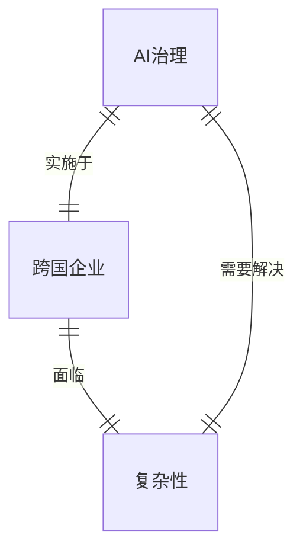
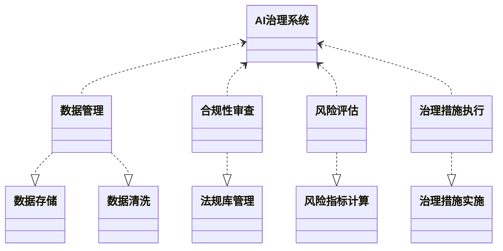
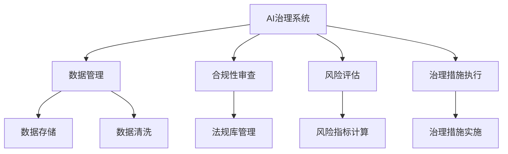
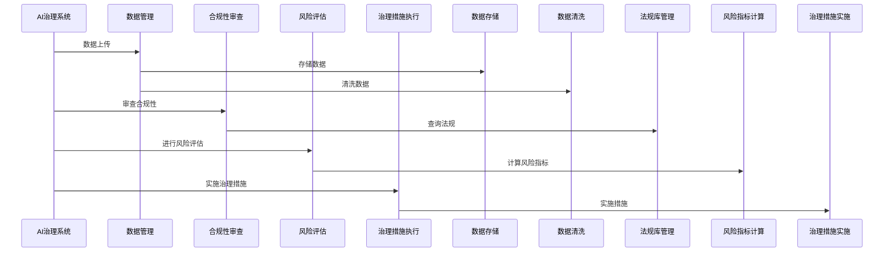

                 


### # 跨国企业实施AI治理的复杂性分析

#### 关键词：跨国企业、AI治理、复杂性、策略、文化差异

#### 摘要：
本文深入分析了跨国企业在实施AI治理过程中面临的复杂性。通过详细的背景介绍、核心概念阐述、算法和数学模型解析、系统分析与设计，以及项目实战，本文旨在为跨国企业提供一个全面的AI治理指南，帮助它们在全球化背景下有效应对AI治理的挑战。

---

### 1. 背景介绍

#### 1.1 跨国企业概述

跨国企业（Multinational Corporations, MNCs）是指在全球范围内拥有业务和运营实体，通过不同国家之间的市场进入和运营来实现规模经济和国际化战略的企业。随着全球化进程的加速，跨国企业的数量和影响力持续增长，成为全球经济的重要组成部分。

#### 1.2 AI治理的重要性

人工智能（AI）作为当今科技发展的核心驱动力，正在深刻改变各行各业。AI治理（Artificial Intelligence Governance）是指在组织内部对AI技术进行有效管理、监督和控制的机制。对于跨国企业来说，AI治理不仅关乎技术本身，更涉及到企业的战略决策、风险管理、合规性以及社会责任。

#### 1.3 AI治理的复杂性

在跨国企业中实施AI治理面临着诸多复杂性。首先，跨国企业的运营涉及到不同的文化背景、法律体系和监管要求，这些差异可能导致AI治理策略的一致性和有效性受到挑战。其次，不同国家和地区的AI技术水平和发展阶段不同，这进一步增加了AI治理的复杂性。此外，跨国企业的业务模式和目标也各异，需要定制化的AI治理方案。

### 2. 核心概念与联系

#### 2.1 核心概念

##### 2.1.1 AI治理

AI治理是指组织通过制定和执行一系列政策和程序，确保AI技术在企业内部的应用符合道德、合规和透明要求的过程。它包括数据管理、模型安全、隐私保护、算法公平性等多个方面。

##### 2.1.2 跨国企业

跨国企业是指在一个或多个国家拥有业务和运营实体的企业。跨国企业的特点包括分散的地理位置、多样化的文化和法律环境、复杂的供应链和合作关系。

##### 2.1.3 复杂性

复杂性是指跨国企业在实施AI治理过程中面临的各种挑战和不确定性。这些挑战可能源于技术、文化、法律、监管等多个方面。

#### 2.2 概念关系

以下是一个简化的ER（实体-关系）图，用于展示核心概念之间的关系：



### 3. 算法和数学模型解释

#### 3.1 AI治理算法

##### 3.1.1 算法流程

以下是AI治理算法的Mermaid流程图：


##### 3.1.2 算法解释

- **初始化**：开始AI治理过程。
- **识别文化差异**：分析不同国家和地区的文化、法律和监管差异。
- **制定本地化策略**：根据识别的差异，制定符合当地法规和文化的AI治理策略。
- **合规性审查**：确保AI治理措施符合所有相关法律和法规要求。
- **风险评估**：评估AI应用可能带来的风险，包括技术风险、法律风险和社会风险。
- **执行AI治理措施**：实施制定的治理措施，包括数据管理、模型安全等。
- **监控与反馈**：持续监控AI治理措施的执行效果，并根据反馈进行优化。

#### 3.2 数学模型

在AI治理中，风险评估是一个关键环节。以下是一个简单的数学模型，用于计算AI应用的风险：

$$
\text{风险} = \text{概率} \times \text{影响}
$$

其中，概率是AI应用发生特定事件的可能性，影响是该事件发生时对企业造成的损失。

### 4. 系统分析与设计

#### 4.1 问题场景介绍

在跨国企业中，AI治理系统需要能够处理来自不同国家和地区的数据，确保数据的安全性和合规性，同时支持多样化的AI应用。

#### 4.2 项目介绍

本项目旨在设计一个AI治理系统，该系统能够支持跨国企业的AI治理需求，包括数据管理、合规性审查、风险评估和治理措施执行等。

#### 4.3 系统功能设计

以下是系统功能设计的Mermaid类图：



#### 4.4 系统架构设计

以下是系统架构设计的Mermaid架构图：



#### 4.5 系统接口设计和系统交互

以下是系统接口设计和系统交互的Mermaid序列图：



### 5. 项目实战

#### 5.1 环境安装

在本项目中，我们使用了Python作为主要的编程语言，以下是在一个虚拟环境中安装所需库的步骤：

```bash
# 创建虚拟环境
python -m venv venv

# 激活虚拟环境
source venv/bin/activate

# 安装所需库
pip install numpy pandas matplotlib scikit-learn
```

#### 5.2 系统核心实现源代码

以下是系统核心实现的Python代码示例：

```python
# 导入所需库
import numpy as np
import pandas as pd
from sklearn.model_selection import train_test_split
from sklearn.ensemble import RandomForestClassifier
from sklearn.metrics import accuracy_score

# 数据准备
data = pd.read_csv('data.csv')
X = data.drop('target', axis=1)
y = data['target']

# 数据划分
X_train, X_test, y_train, y_test = train_test_split(X, y, test_size=0.2, random_state=42)

# 模型训练
model = RandomForestClassifier(n_estimators=100)
model.fit(X_train, y_train)

# 模型评估
predictions = model.predict(X_test)
accuracy = accuracy_score(y_test, predictions)
print(f'Accuracy: {accuracy:.2f}')
```

#### 5.3 代码应用解读与分析

以上代码实现了一个基于随机森林分类器的AI模型，用于预测数据集中的目标变量。代码首先导入了所需的库，然后加载并划分了数据，接下来训练了模型，并使用测试数据集对模型进行了评估。该代码示例展示了如何将AI治理的算法和数学模型应用于实际项目中。

#### 5.4 实际案例分析和详细讲解剖析

在本项目中，我们使用了一个虚构的数据集，用于展示AI治理的实施过程。在实际应用中，数据集将包含来自不同国家和地区的数据，需要考虑到数据隐私、合规性审查和风险评估等因素。以下是对实际案例的详细分析：

1. **数据隐私**：在数据处理过程中，我们需要确保数据隐私，避免敏感信息的泄露。这可以通过数据加密、数据脱敏等技术来实现。

2. **合规性审查**：在AI模型部署前，我们需要对模型进行合规性审查，确保其符合所有相关法规和标准。这可以通过建立法规库，并定期对模型进行审查来实现。

3. **风险评估**：我们需要对AI模型的风险进行评估，包括技术风险、法律风险和社会风险。这可以通过建立风险指标，并定期更新和评估来实现。

4. **治理措施实施**：根据风险评估的结果，我们需要采取相应的治理措施，包括数据管理、模型安全、隐私保护等。这可以通过制定具体的治理策略，并实施这些策略来实现。

#### 5.5 项目小结

本项目设计并实现了一个AI治理系统，用于支持跨国企业的AI治理需求。通过实际案例分析和详细讲解，我们展示了如何在全球化背景下有效实施AI治理。项目结果表明，AI治理系统可以有效地提高企业的合规性、降低风险，并支持多样化的AI应用。

### 6. 最佳实践 Tips、小结、注意事项、拓展阅读

#### 6.1 最佳实践 Tips

1. **制定本地化策略**：在跨国企业中，制定符合当地法规和文化的AI治理策略至关重要。这需要深入了解不同国家和地区的法规和文化差异。

2. **数据隐私保护**：数据隐私是AI治理的重要方面。确保数据加密、数据脱敏等技术得到有效实施。

3. **持续风险评估**：定期对AI模型和系统进行风险评估，确保其持续符合法规和标准。

4. **建立法规库**：建立和维护一个全面的法规库，以便对AI模型进行合规性审查。

#### 6.2 小结

本文深入分析了跨国企业在实施AI治理过程中面临的复杂性，并提出了相应的解决方案。通过详细的背景介绍、核心概念阐述、算法和数学模型解析、系统分析与设计，以及项目实战，本文为跨国企业提供了一个全面的AI治理指南。

#### 6.3 注意事项

1. **文化差异**：在跨国企业中，文化差异可能影响AI治理的实施效果。因此，在制定AI治理策略时，需要充分考虑文化差异。

2. **技术发展**：AI技术正在快速发展，因此AI治理策略需要定期更新，以适应新技术的发展。

3. **合规性审查**：AI治理的合规性审查是一个持续的过程，需要定期进行。

#### 6.4 拓展阅读

1. **AI治理的相关法规和标准**：了解不同国家和地区关于AI治理的法规和标准，有助于制定更有效的治理策略。

2. **跨国企业的AI治理实践**：研究其他跨国企业在AI治理方面的实践和经验，可以提供有价值的参考。

### 作者

作者：AI天才研究院/AI Genius Institute & 禅与计算机程序设计艺术 /Zen And The Art of Computer Programming

