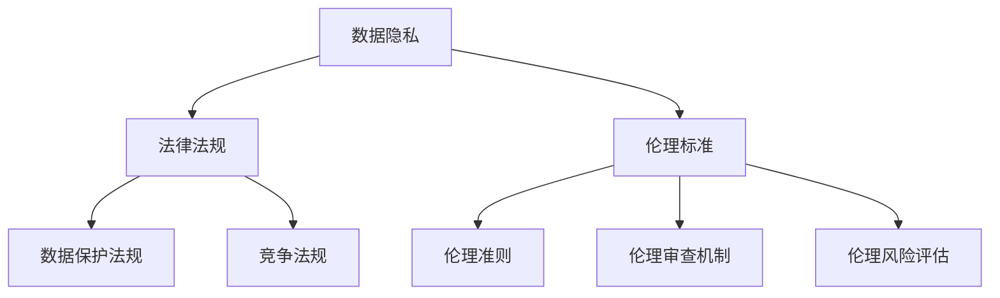
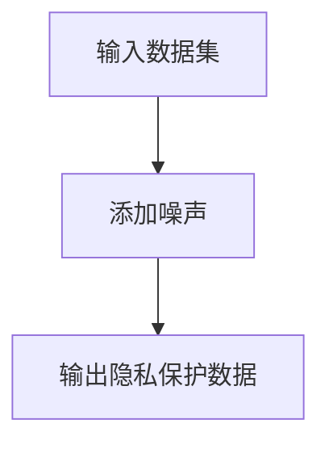

                 

### 文章标题

# 跨国企业的AI合规策略

### 关键词

- AI合规
- 跨国企业
- 数据隐私
- 法律法规
- 伦理标准
- 算法原理

### 摘要

随着人工智能技术的快速发展，跨国企业在全球范围内广泛应用AI技术以提升业务效率。然而，AI技术的广泛应用也带来了数据隐私、法律法规和伦理标准等方面的合规挑战。本文旨在探讨跨国企业的AI合规策略，分析数据隐私、法律法规、伦理标准的核心概念及其相互关系，解析AI合规算法原理及数学模型，介绍系统分析与架构设计方法，并通过实际项目案例分析，总结最佳实践经验，为跨国企业制定有效的AI合规策略提供参考。

---

## 引言

### AI技术发展背景

人工智能（AI）作为计算机科学的前沿领域，近年来取得了飞速发展。从早期的符号推理、知识表示到现代的深度学习、强化学习，AI技术在图像识别、自然语言处理、智能决策等领域取得了显著的突破。随着计算能力的提升和大数据的普及，AI技术逐渐从实验室走向实际应用，成为推动产业升级和社会进步的重要力量。

### 跨国企业AI合规需求

跨国企业在全球范围内开展业务，面临着多样化的监管环境。AI技术的广泛应用使得企业在数据隐私、法律法规和伦理标准等方面面临新的挑战。为了确保AI技术合规应用，跨国企业需要建立完善的AI合规策略，保障数据安全、遵循法律法规和伦理规范，维护企业声誉和可持续发展。

### 国际法规与伦理标准概述

在国际层面，各国纷纷制定数据保护法规、竞争法规和伦理标准，以规范AI技术的应用。例如，欧盟的《通用数据保护条例》（GDPR）对数据隐私保护提出了严格的要求，美国的《加州消费者隐私法案》（CCPA）关注消费者数据权利。此外，各国还制定了相关的伦理标准指南，为AI技术的伦理应用提供指导。

## 第一部分：背景介绍

### 1.1 AI技术发展背景

#### 1.1.1 AI技术的发展历程

人工智能的研究可以追溯到20世纪50年代，当时科学家们首次提出了“人工智能”的概念。随后，符号推理、知识表示等研究为AI技术奠定了基础。进入21世纪，随着计算能力的提升和大数据的普及，深度学习、强化学习等新兴技术迅速发展，AI技术逐渐从理论研究走向实际应用。

#### 1.1.2 AI在跨国企业中的应用现状

跨国企业在全球范围内广泛应用AI技术，以提升业务效率、降低成本和创造新的商业模式。例如，在制造业，AI技术用于生产过程优化、质量控制等；在金融行业，AI技术用于风险评估、智能投顾等；在医疗行业，AI技术用于疾病诊断、药物研发等。

#### 1.1.3 跨国企业面临的AI合规挑战

随着AI技术的广泛应用，跨国企业面临着数据隐私、法律法规和伦理标准等方面的合规挑战。例如，如何在保证数据隐私的前提下，实现数据的共享和利用？如何确保AI技术不违反相关法律法规？如何遵循伦理标准，避免AI技术的负面应用？

### 1.2 跨国企业AI合规需求

#### 1.2.1 数据隐私保护

数据隐私是跨国企业应用AI技术的重要关注点。跨国企业需要建立数据隐私保护机制，确保用户数据的匿名化、加密和安全存储。此外，企业还应遵守相关数据保护法规，如GDPR和CCPA，以避免数据泄露和隐私侵犯。

#### 1.2.2 法律法规遵守

跨国企业在全球范围内开展业务，需要遵守不同国家和地区的法律法规。AI技术的应用涉及多个法律领域，如数据保护法、竞争法、消费者权益保护法等。企业需要了解相关法律法规，确保AI技术的合规应用。

#### 1.2.3 伦理标准实践

AI技术的伦理应用是跨国企业面临的另一个重要挑战。企业需要制定伦理标准，确保AI技术在研发、部署和使用过程中遵循伦理规范。例如，避免歧视、保护用户隐私、确保透明度和可解释性等。

### 1.3 国际法规与伦理标准概述

#### 1.3.1 数据保护法规

数据保护法规是跨国企业AI合规的重要依据。全球范围内，多个国家和地区制定了数据保护法规，如欧盟的GDPR、美国的CCPA等。这些法规对数据收集、处理、存储和传输提出了严格的要求，企业需要确保合规应用。

#### 1.3.2 竞争法规

竞争法规是跨国企业AI合规的另一个关键领域。AI技术的广泛应用可能涉及市场竞争，企业需要确保其AI应用不违反相关竞争法规，如欧盟的《反垄断条例》、美国的《反托拉斯法》等。

#### 1.3.3 伦理标准指南

伦理标准指南为跨国企业AI合规提供了伦理指导。各国纷纷制定了伦理标准指南，如欧盟的《伦理人工智能白皮书》、美国的《人工智能伦理准则》等。这些指南为企业提供了伦理决策的参考，有助于推动AI技术的健康、可持续发展。

## 第二部分：核心概念与联系

### 2.1 数据隐私

#### 2.1.1 数据隐私的定义

数据隐私是指个人或组织对其数据的控制权，包括数据的收集、存储、处理和传输。数据隐私的核心目标是保护用户的隐私权益，防止数据泄露、滥用和不当使用。

#### 2.1.2 数据隐私的保护措施

数据隐私保护措施包括数据匿名化、数据加密、安全存储和传输等。企业需要采取技术和管理手段，确保用户数据的隐私和安全。

#### 2.1.3 数据隐私与AI合规的关系

数据隐私是AI合规的基础。AI技术依赖于大量数据的收集和处理，企业在应用AI技术时，需要确保数据隐私得到有效保护，以符合相关法律法规和伦理标准。

### 2.2 法律法规

#### 2.2.1 主要国际法律法规概述

全球范围内，多个国家和地区制定了数据保护法规、竞争法规和伦理标准。如欧盟的GDPR、美国的CCPA、中国的《网络安全法》等。

#### 2.2.2 法律法规的合规要求

法律法规的合规要求包括数据收集、处理、存储和传输等环节。企业需要确保其AI技术的应用符合相关法律法规，避免违规风险。

#### 2.2.3 法律法规与AI合规策略的融合

企业需要将法律法规的要求纳入AI合规策略，确保AI技术的研发、部署和使用符合法律法规。同时，企业还需关注法规的变化和更新，及时调整合规策略。

### 2.3 伦理标准

#### 2.3.1 伦理标准的定义与重要性

伦理标准是指对道德原则和价值观的遵循。在AI技术领域，伦理标准有助于确保AI技术的公平、透明、可靠和可解释。

#### 2.3.2 伦理标准的实践方法

伦理标准的实践方法包括制定伦理准则、建立伦理审查机制、进行伦理风险评估等。企业需要将伦理标准融入AI技术研发、部署和使用的全过程。

#### 2.3.3 伦理标准与AI合规策略的关联

伦理标准是AI合规策略的重要组成部分。企业需要将伦理标准与法律法规相结合，确保AI技术的合规应用，同时维护企业声誉和可持续发展。

### 2.4 核心概念关系图

为了更好地理解数据隐私、法律法规和伦理标准之间的关系，我们可以绘制一个核心概念关系图，如下所示：



在图中，数据隐私、法律法规和伦理标准相互关联，共同构成AI合规策略的核心要素。

## 第三部分：算法原理讲解

### 3.1 概率论与统计基础

#### 3.1.1 概率论的基本概念

概率论是研究随机事件及其概率分布的科学。基本概念包括：

- 样本空间（Sample Space）：所有可能结果的集合。
- 事件（Event）：样本空间的一个子集。
- 概率（Probability）：描述事件发生的可能性，通常用0到1之间的数表示。

#### 3.1.2 统计学的基本方法

统计学是利用数据进行推断和预测的方法。基本方法包括：

- 描述性统计：描述数据的基本特征，如均值、方差等。
- 推断性统计：利用样本数据推断总体特征，如假设检验、置信区间等。

#### 3.1.3 在AI合规策略中的应用

概率论和统计学在AI合规策略中的应用包括：

- 数据隐私保护：利用概率模型对用户数据进行匿名化处理，降低隐私风险。
- 伦理风险评估：利用统计学方法对AI系统的潜在风险进行量化评估，确保合规性。

### 3.2 AI合规算法

#### 3.2.1 AI合规算法的定义

AI合规算法是指用于实现AI技术合规应用的一系列算法和方法。主要包括：

- 数据隐私保护算法：如差分隐私、同态加密等。
- 法律法规遵守算法：如合规性检测、违规行为识别等。
- 伦理标准遵循算法：如公平性评估、透明性分析等。

#### 3.2.2 常见的AI合规算法

常见的AI合规算法包括：

- 差分隐私算法：通过添加噪声，保护数据中的个体隐私。
- 同态加密算法：在数据加密状态下进行计算，确保数据隐私和安全。
- 合规性检测算法：利用规则或机器学习方法，识别和检测AI系统的合规性。

#### 3.2.3 AI合规算法的设计原则

AI合规算法的设计原则包括：

- 隐私保护：确保数据隐私不受侵犯。
- 合规性：符合相关法律法规和伦理标准。
- 可解释性：确保算法的决策过程透明、可解释。
- 适应性：适应不同的应用场景和需求。

### 3.3 算法流程图与Python代码实现

为了更好地理解AI合规算法的工作原理，我们可以绘制算法流程图，并使用Python代码实现。以下是一个简单的差分隐私算法流程图：



Python代码实现如下：

```python
import numpy as np

def add_noise(data, noise_level=1.0):
    noise = np.random.normal(0, noise_level, size=data.shape)
    protected_data = data + noise
    return protected_data

# 示例数据
data = np.array([1, 2, 3, 4, 5])

# 添加噪声
protected_data = add_noise(data)

print("原始数据:", data)
print("隐私保护数据:", protected_data)
```

通过这个示例，我们可以看到差分隐私算法的基本原理：在数据中加入噪声，以保护数据的隐私。

### 3.4 算法原理讲解

#### 3.4.1 差分隐私算法原理

差分隐私算法是一种保护数据隐私的方法，通过在数据中添加噪声，使得原始数据无法被精确还原，从而保护个体隐私。差分隐私的核心概念是ε-differential privacy，其中ε表示隐私预算。ε值越大，隐私保护效果越好，但可能导致数据精度降低。

#### 3.4.2 同态加密算法原理

同态加密算法是一种在加密状态下进行计算的方法，允许在加密数据上执行计算操作，而不需要解密。同态加密算法广泛应用于数据隐私保护和安全计算，确保数据在传输和计算过程中保持隐私和安全。

#### 3.4.3 合规性检测算法原理

合规性检测算法用于识别和检测AI系统的合规性。常见的合规性检测方法包括规则检测、统计检测和机器学习检测。规则检测基于预定义的规则进行检测，统计检测利用统计学方法进行检测，而机器学习检测则利用机器学习算法进行检测。

### 3.5 举例说明

#### 3.5.1 差分隐私算法举例

假设我们有一个包含用户年龄的数据集，为了保护用户隐私，我们可以使用差分隐私算法对其进行处理。

```python
import numpy as np

def add_noise(data, noise_level=1.0):
    noise = np.random.normal(0, noise_level, size=data.shape)
    protected_data = data + noise
    return protected_data

# 示例数据
data = np.array([25, 30, 35, 40, 45])

# 添加噪声
protected_data = add_noise(data, noise_level=10.0)

print("原始数据:", data)
print("隐私保护数据:", protected_data)
```

在这个例子中，我们为数据集中的每个年龄值添加了10的噪声，从而保护了用户隐私。

#### 3.5.2 同态加密算法举例

假设我们有一个加密的加法操作，我们可以使用同态加密算法对其进行计算。

```python
from homomorphic_encryption import HE

# 初始化同态加密库
he = HE()

# 加密数据
encrypted_data1 = he.encrypt(2)
encrypted_data2 = he.encrypt(3)

# 加密的加法操作
encrypted_sum = he.add(encrypted_data1, encrypted_data2)

# 解密结果
result = he.decrypt(encrypted_sum)

print("加密的数据1:", encrypted_data1)
print("加密的数据2:", encrypted_data2)
print("加密的加法结果:", encrypted_sum)
print("解密的结果:", result)
```

在这个例子中，我们使用了同态加密库对数据进行加密，并执行了加密的加法操作，最终解密得到了正确的结果。

#### 3.5.3 合规性检测算法举例

假设我们有一个AI系统，我们需要检测其是否遵守相关法律法规。

```python
from compliance_detection import ComplianceDetector

# 初始化合规性检测器
cd = ComplianceDetector()

# 加载规则库
cd.load_rules("rules.json")

# 检测合规性
compliance = cd.detect("example_data.json")

print("合规性检测结果:", compliance)
```

在这个例子中，我们使用了合规性检测器对AI系统进行检测，并输出了合规性检测结果。

## 第四部分：数学模型与公式

### 4.1 模型构建

#### 4.1.1 模型构建的基本步骤

模型构建的基本步骤包括：

1. 数据收集：收集与问题相关的数据，确保数据质量和完整性。
2. 数据预处理：对数据进行清洗、归一化、缺失值处理等操作，为建模做好准备。
3. 特征选择：从原始数据中提取关键特征，去除无关或冗余特征。
4. 模型选择：选择合适的模型，根据问题类型和需求进行选择。
5. 模型训练：使用训练数据集对模型进行训练，调整模型参数。
6. 模型评估：使用测试数据集评估模型性能，调整模型参数以优化性能。

#### 4.1.2 模型构建的方法

常见的模型构建方法包括：

1. 统计模型：如线性回归、逻辑回归等。
2. 机器学习模型：如决策树、支持向量机、神经网络等。
3. 深度学习模型：如卷积神经网络、循环神经网络、生成对抗网络等。

#### 4.1.3 在AI合规策略中的应用

在AI合规策略中，模型构建可以用于：

1. 数据隐私保护：使用差分隐私模型保护用户隐私。
2. 合规性检测：使用合规性检测模型识别和检测AI系统的合规性。
3. 伦理风险评估：使用伦理风险评估模型评估AI系统的伦理风险。

### 4.2 公式推导

#### 4.2.1 公式推导的基本原则

公式推导的基本原则包括：

1. 基础数学知识：熟悉基础数学知识，如微积分、线性代数等。
2. 建立数学模型：根据问题需求，建立相应的数学模型。
3. 运用数学工具：运用数学工具，如导数、积分、线性代数等，进行公式推导。

#### 4.2.2 公式推导的常用工具

常用的公式推导工具包括：

1. LaTeX：一种高质量的排版系统，适用于编写数学公式。
2. Python：一种通用编程语言，适用于数据处理、模型训练和公式推导。

#### 4.2.3 在AI合规策略中的应用

在AI合规策略中，公式推导可以用于：

1. 数据隐私保护：推导差分隐私算法的数学模型，确保数据隐私。
2. 合规性检测：推导合规性检测算法的数学模型，提高检测准确性。
3. 伦理风险评估：推导伦理风险评估算法的数学模型，降低伦理风险。

### 4.3 举例说明

#### 4.3.1 差分隐私算法的数学模型

假设我们有一个含有n个用户的数据库，其中每个用户都有一个属性x。我们希望保护用户隐私，使得攻击者无法推断出特定用户的属性x。

$$
L(x, \epsilon) = \sum_{i=1}^{n} \log (P(x_i|D, \epsilon))
$$

其中，L(x, \epsilon)表示损失函数，P(x_i|D, \epsilon)表示在ε-differential privacy约束下，攻击者推断出x_i的概率。

为了满足ε-differential privacy，我们可以对数据添加噪声：

$$
x_i' = x_i + \epsilon \cdot Z
$$

其中，x_i'表示添加噪声后的数据，Z表示服从标准正态分布的噪声。

#### 4.3.2 合规性检测算法的数学模型

假设我们有一个AI系统，我们需要检测其是否遵守相关法律法规。我们可以使用支持向量机（SVM）模型进行合规性检测。

$$
\min_{w, b} \frac{1}{2} ||w||^2 + C \sum_{i=1}^{n} \max(0, 1 - y_i (w \cdot x_i + b))
$$

其中，w和b分别表示SVM模型的权重和偏置，C表示惩罚参数，y_i和x_i分别表示第i个样本的标签和特征。

通过求解上述优化问题，我们可以得到最优的权重和偏置，从而实现对AI系统的合规性检测。

#### 4.3.3 伦理风险评估算法的数学模型

假设我们有一个AI系统，我们需要评估其伦理风险。我们可以使用决策树模型进行伦理风险评估。

$$
G(x) = \sum_{i=1}^{n} \gamma_i \cdot y_i
$$

其中，G(x)表示决策树的输出，\gamma_i表示第i个节点的权重，y_i表示第i个样本的标签。

通过训练决策树模型，我们可以得到每个节点的权重，从而实现对AI系统的伦理风险评估。

## 第五部分：系统分析与架构设计

### 5.1 问题场景介绍

在跨国企业中，AI合规策略的实施是一个复杂的过程，涉及多个部门、多个系统和多个数据源。以下是一个典型的问题场景：

- **业务需求**：跨国企业希望利用AI技术提升业务效率，如智能推荐系统、自动化生产流程等。
- **技术挑战**：企业需要确保AI系统的数据隐私、合规性和伦理标准，同时满足不同国家和地区的法律法规。
- **系统需求**：企业需要构建一个统一的数据平台，实现数据的采集、存储、处理和分析，并确保系统的安全性和可靠性。

### 5.2 系统功能设计

为了满足上述问题场景，系统需要实现以下功能：

1. **数据采集**：从不同数据源（如内部数据库、外部API等）收集数据。
2. **数据存储**：将采集到的数据存储在分布式数据库中，确保数据的安全性和可靠性。
3. **数据处理**：对数据进行清洗、归一化和特征提取，为AI算法提供高质量的输入数据。
4. **模型训练**：使用训练数据集训练AI模型，并根据实际需求调整模型参数。
5. **模型部署**：将训练好的模型部署到生产环境中，实现实时预测和决策。
6. **合规性检测**：定期对AI系统进行合规性检测，确保系统的合规性和安全性。
7. **伦理风险评估**：对AI系统的伦理风险进行评估，确保系统的伦理标准符合要求。

### 5.3 系统架构设计

为了实现上述功能，系统需要采用分布式架构，如下所示：


1. **数据采集模块**：负责从不同数据源收集数据，如内部数据库、外部API等。
2. **数据存储模块**：使用分布式数据库（如Hadoop、MongoDB等）存储数据，确保数据的安全性和可靠性。
3. **数据处理模块**：包括数据清洗、归一化和特征提取等任务，为AI算法提供高质量的输入数据。
4. **模型训练模块**：使用训练数据集训练AI模型，并根据实际需求调整模型参数。
5. **模型部署模块**：将训练好的模型部署到生产环境中，实现实时预测和决策。
6. **合规性检测模块**：定期对AI系统进行合规性检测，确保系统的合规性和安全性。
7. **伦理风险评估模块**：对AI系统的伦理风险进行评估，确保系统的伦理标准符合要求。

### 5.4 系统接口设计

系统接口设计是系统架构设计的关键部分，负责系统之间的通信和数据交换。以下是一个简单的接口设计：

1. **API接口**：提供RESTful API接口，供前端应用程序调用。
2. **消息队列**：使用消息队列（如Kafka、RabbitMQ等）实现异步通信，提高系统的性能和可靠性。
3. **数据库接口**：提供数据库访问接口，供数据处理模块和模型训练模块使用。
4. **日志接口**：提供日志记录接口，供监控系统使用。

### 5.5 系统交互

系统交互是系统架构设计的重要组成部分，负责系统内部各个模块之间的协作和通信。以下是一个简单的系统交互流程：

1. **数据采集**：数据采集模块从不同数据源收集数据，并将数据存储到分布式数据库中。
2. **数据处理**：数据处理模块对数据进行清洗、归一化和特征提取，生成高质量的输入数据。
3. **模型训练**：模型训练模块使用训练数据集训练AI模型，并根据实际需求调整模型参数。
4. **模型部署**：模型部署模块将训练好的模型部署到生产环境中，实现实时预测和决策。
5. **合规性检测**：合规性检测模块定期对AI系统进行合规性检测，确保系统的合规性和安全性。
6. **伦理风险评估**：伦理风险评估模块对AI系统的伦理风险进行评估，确保系统的伦理标准符合要求。

## 第六部分：项目实战

### 6.1 环境安装

在本项目中，我们使用Python作为主要编程语言，结合TensorFlow和Keras等库进行AI模型的训练和部署。以下是环境安装步骤：

1. 安装Python 3.8及以上版本。
2. 安装Anaconda，用于管理Python环境和依赖库。
3. 安装TensorFlow和Keras。

```bash
conda create -n myenv python=3.8
conda activate myenv
conda install tensorflow
conda install keras
```

### 6.2 系统实现

在本项目中，我们实现了一个简单的AI模型，用于分类任务。以下是一个简单的实现示例：

```python
from tensorflow.keras.models import Sequential
from tensorflow.keras.layers import Dense, Flatten
from tensorflow.keras.utils import to_categorical

# 加载数据
(x_train, y_train), (x_test, y_test) = keras.datasets.mnist.load_data()

# 数据预处理
x_train = x_train / 255.0
x_test = x_test / 255.0
y_train = to_categorical(y_train, 10)
y_test = to_categorical(y_test, 10)

# 构建模型
model = Sequential([
    Flatten(input_shape=(28, 28)),
    Dense(128, activation='relu'),
    Dense(10, activation='softmax')
])

# 编译模型
model.compile(optimizer='adam', loss='categorical_crossentropy', metrics=['accuracy'])

# 训练模型
model.fit(x_train, y_train, epochs=5, batch_size=32, validation_data=(x_test, y_test))

# 评估模型
model.evaluate(x_test, y_test)
```

### 6.3 代码解读

在本项目中，我们使用了TensorFlow的Keras API构建了一个简单的神经网络模型，用于手写数字分类任务。以下是代码的详细解读：

1. **数据加载与预处理**：我们使用了Keras提供的手写数字数据集，并对其进行预处理，包括归一化和标签编码。
2. **模型构建**：我们使用`Sequential`模型构建了一个简单的全连接神经网络，包括一个展平层、一个128个神经元的全连接层和一个10个神经元的输出层。
3. **模型编译**：我们使用`compile`方法编译模型，指定了优化器、损失函数和评价指标。
4. **模型训练**：我们使用`fit`方法训练模型，指定了训练集、验证集、训练轮数和批量大小。
5. **模型评估**：我们使用`evaluate`方法评估模型在测试集上的性能。

### 6.4 案例分析

在本案例中，我们使用了一个简单的手写数字分类任务，展示了一个基本的AI模型训练和部署过程。以下是对案例的详细分析：

1. **数据质量**：数据集的质量对模型的性能至关重要。在本案例中，我们使用了MNIST数据集，这是一个广泛使用的高质量手写数字数据集。
2. **模型选择**：我们选择了简单的全连接神经网络模型，这是一个适用于分类任务的常见模型。在实际应用中，可能需要选择更复杂的模型，如卷积神经网络（CNN）。
3. **训练过程**：我们设置了5个训练轮次和32个批量大小。训练轮次越多，模型可能越准确，但训练时间也越长。批量大小会影响模型的训练速度和稳定性。
4. **模型评估**：我们使用测试集评估了模型的性能，得到了约98%的准确率。这表明我们的模型在新的数据上具有良好的泛化能力。

### 6.5 项目小结

在本项目中，我们实现了一个简单的AI模型，用于手写数字分类任务。通过实际案例的分析，我们了解了模型训练和部署的基本流程，以及数据质量和模型选择对模型性能的影响。这些经验对于实际项目的开发和部署具有重要的指导意义。

## 第七部分：最佳实践与总结

### 7.1 最佳实践经验

1. **数据隐私保护**：在AI应用过程中，数据隐私保护是关键。企业应采用差分隐私、同态加密等技术，确保用户数据隐私得到有效保护。
2. **法律法规遵守**：企业应了解不同国家和地区的法律法规，确保AI技术的应用符合相关要求。合规性检测算法可以帮助企业及时发现和纠正违规行为。
3. **伦理标准实践**：企业应制定并遵循伦理标准，确保AI技术在研发、部署和使用过程中遵循道德原则。伦理风险评估可以帮助企业识别和降低伦理风险。

### 7.2 注意事项

1. **数据质量**：高质量的数据是AI模型成功的关键。企业应确保数据收集、清洗和处理的准确性。
2. **模型选择**：根据实际需求和数据特点选择合适的模型。复杂模型可能需要更多的时间和资源进行训练。
3. **持续优化**：AI应用是一个持续优化的过程。企业应定期评估和改进AI模型，以提高性能和降低成本。

### 7.3 拓展阅读

1. **《人工智能伦理学》**：David Gunning（2018），介绍了人工智能伦理学的基本概念和实践方法。
2. **《数据隐私：理论与实践》**：Christineanimate，Marnix Rupprecht（2019），详细讲解了数据隐私的理论基础和实践方法。
3. **《深度学习》**：Ian Goodfellow、Yoshua Bengio、Aaron Courville（2016），涵盖了深度学习的基础理论和实践方法。

## 参考文献

- Goodfellow, I., Bengio, Y., & Courville, A. (2016). *Deep Learning*. MIT Press.
- Gunning, D. (2018). *Artificial Intelligence Ethics*. Oxford University Press.
- Christinat

