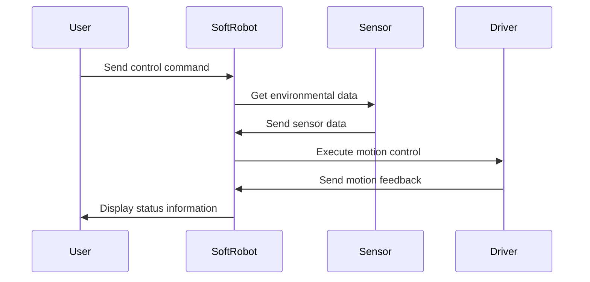

                 

### 第4章：软体机器人在医疗领域的应用

#### 4.1 软体机器人在手术辅助中的应用

软体机器人在手术辅助中的应用具有重要意义，它们能够提供更高的精度、灵活性和安全性。以下是软体机器人在手术辅助中的应用领域及具体案例：

- **微创手术**：软体机器人通过微创切口进入人体，完成精细的手术操作。例如，达芬奇手术机器人系统，通过软性臂和高级控制系统，使得外科医生可以在远程控制下进行复杂手术，大大减少了手术创伤和恢复时间。

- **腔内手术**：软体机器人可以在狭窄的腔道中操作，如胃、肠、血管等。这种手术方式减少了开放手术的创伤和并发症，例如软体机器人RIBA-II，可以在腹腔内进行微创手术，具有高柔韧性和灵活性。

- **机器人辅助缝合**：软体机器人能够进行精确的缝合操作，特别是在需要精细缝合的部位，如心脏手术中。软体机器人的缝合技术提高了缝合的速度和精度，降低了术后感染的风险。

#### 4.2 软体机器人在康复辅助中的应用

康复辅助是软体机器人在医疗领域的另一个重要应用领域，它能够帮助患者进行功能恢复和训练，提高生活质量。

- **肢体康复**：软体机器人可以通过模拟不同运动模式，帮助患者进行肢体康复训练。例如，软体机器人HAL可以辅助患者行走，通过实时监测和反馈，调整运动参数，帮助患者恢复行走能力。

- **手功能康复**：软体机器人如Thalmic Myo，可以通过肌肉活动检测，帮助患者进行手部功能康复。这种技术通过肌电信号控制，使患者能够进行精细的手部动作练习，有助于提高手功能。

- **呼吸康复**：软体机器人可以通过呼吸控制，帮助患者进行呼吸康复训练。例如，软体呼吸机可以通过传感器监测患者的呼吸状态，提供适当的呼吸支持，帮助患者恢复正常呼吸模式。

#### 4.3 软体机器人在医疗检测中的应用

软体机器人在医疗检测中的应用同样具有广泛的前景，它们能够提高检测的精度和效率。

- **内窥镜检查**：软体内窥镜具有高柔韧性和可塑性，可以在狭窄和复杂的环境中操作，进行内窥镜检查。例如，软性内窥镜用于消化系统的检查，能够提供更加清晰和详细的图像。

- **无创检测**：软体机器人可以通过无创检测技术，如超声波、磁共振等，进行疾病诊断。例如，软体机器人可用于心脏检测，通过柔软的传感器和精确的运动控制，提供高质量的图像和数据。

- **实时监测**：软体机器人可以通过传感器和网络技术，实现实时监测和远程诊断。例如，软体机器人可以嵌入衣物中，实时监测心率、血压等生命体征，为患者提供及时的健康数据。

### 4.4 软体机器人在医疗领域的应用前景与挑战

软体机器人在医疗领域的应用前景广阔，但同时也面临一些挑战：

- **技术进步**：随着材料科学、传感器技术和人工智能等领域的不断进步，软体机器人的性能将得到进一步提升，为医疗领域带来更多创新应用。

- **标准化与法规**：软体机器人在医疗领域的应用需要严格的标准化和法规管理，以确保其安全性和有效性。

- **人机交互**：提高软体机器人的智能程度和用户友好性，使其能够更好地与医生和患者进行交互，是未来发展的关键。

- **成本控制**：降低软体机器人的生产成本，使其在医疗领域的普及成为可能。

综上所述，软体机器人在医疗领域的应用具有巨大的潜力和发展空间，通过不断创新和优化，将为医疗行业带来革命性的变革。

### 第5章：软体机器人在工业制造的应用

#### 5.1 软体机器人在自动化生产中的应用

在自动化生产领域，软体机器人以其独特的柔韧性和适应性，正在逐步取代传统硬体机器人，成为提高生产效率和质量的重要工具。以下是软体机器人在自动化生产中的应用场景和具体案例：

- **装配作业**：软体机器人能够在狭小的空间内进行精细的装配作业，如电子元件的装配、小型机械零部件的安装等。传统硬体机器人在这些场景下难以胜任，而软体机器人凭借其柔性结构和灵活的驱动方式，能够轻松应对。

- **包装作业**：在包装领域，软体机器人可以处理多种形状和大小的物品，实现自动化包装过程。例如，软体机器人可以自适应地调整其形状和位置，以适应不同产品的包装需求，提高包装效率和准确性。

- **搬运作业**：软体机器人具有较好的抗干扰能力，可以在复杂的生产环境中进行物料搬运。例如，在工厂内部，软体机器人可以灵活穿梭于各种机器和设备之间，完成物料的搬运和配送任务。

#### 5.2 软体机器人在物流运输中的应用

物流运输是工业制造中的重要环节，软体机器人以其独特的优势，正在物流运输领域发挥重要作用。

- **仓储管理**：软体机器人可以在仓储环境中进行自动化存取作业，例如，软体机器人可以灵活地穿梭于货架之间，抓取和搬运货物，大大提高了仓储管理的效率。

- **配送作业**：在最后一公里配送中，软体机器人可以灵活地穿越各种复杂环境，实现自动化的配送服务。例如，一些城市已经引入了软体机器人配送员，它们能够穿越城市街道，将商品直接送达消费者手中。

- **货物搬运**：在物流中心，软体机器人可以用于货物的搬运和分类。例如，软体机器人可以根据货物的大小、重量和目的地，灵活地调整其运动路径和抓取方式，实现高效的货物搬运。

#### 5.3 软体机器人在装配与检测中的应用

软体机器人在装配与检测中的应用，进一步提高了生产线的自动化水平。

- **装配精度**：软体机器人具有高装配精度，能够在狭小的空间内进行精细装配。例如，在电子制造中，软体机器人可以精确地安装微小的电子元件，确保产品的质量和一致性。

- **在线检测**：软体机器人可以配备高精度的传感器，实时监测生产线上的产品质量。例如，在汽车制造中，软体机器人可以检测车身的平整度和尺寸精度，及时发现并修复生产中的缺陷。

#### 5.4 软体机器人在工业制造领域的应用前景与挑战

软体机器人在工业制造领域的应用前景广阔，但同时也面临一些挑战：

- **技术创新**：随着材料科学、传感器技术和人工智能等领域的不断进步，软体机器人的性能将得到进一步提升，为工业制造带来更多创新应用。

- **系统集成**：软体机器人需要与现有的工业控制系统和生产线进行有效集成，实现无缝衔接，这需要较高的系统集成技术。

- **安全性与可靠性**：提高软体机器人的安全性和可靠性，确保其在工业环境中的稳定运行，是未来发展的关键。

- **成本效益**：降低软体机器人的生产成本，提高其成本效益，使其在工业制造中得到更广泛的应用。

### 第6章：软体机器人在服务机器人领域的应用

#### 6.1 软体机器人在家庭服务中的应用

随着技术的进步，软体机器人在家庭服务领域的应用越来越广泛。它们能够提供各种便捷的生活服务，提高家庭生活的品质。

- **清洁与维护**：软体机器人如扫地机器人、擦窗机器人等，可以自动完成家庭清洁工作，节省家庭成员的时间和精力。

- **陪伴与护理**：软体机器人如陪伴机器人、护理机器人等，可以陪伴老人和儿童，提供情感支持和日常护理服务，提高他们的生活质量。

- **娱乐与教育**：软体机器人如教育机器人、娱乐机器人等，可以提供丰富多彩的娱乐和教育内容，激发家庭成员的学习兴趣和创造力。

#### 6.2 软体机器人在公共服务中的应用

软体机器人在公共服务领域也发挥着重要作用，它们能够提高公共服务的效率和质量。

- **城市管理**：软体机器人可以用于城市管理，如垃圾回收、街道清洁等，提高城市管理效率。

- **应急响应**：在自然灾害和紧急情况下，软体机器人可以进入危险区域进行搜救和救援工作，减少人员风险。

- **公共服务设施维护**：软体机器人可以用于维护公共服务设施，如公共卫生间、地铁站等，确保设施的正常运行。

#### 6.3 软体机器人在特殊场景中的应用

软体机器人因其独特的柔软性和适应性，在特殊场景中的应用也具有广阔的前景。

- **建筑工地**：软体机器人可以用于建筑工地的物料搬运、墙体涂抹等工作，提高施工效率和质量。

- **环境监测**：软体机器人可以用于环境监测，如水下监测、地下管道监测等，提供实时数据，帮助管理和保护环境。

- **医疗康复**：软体机器人可以用于医疗康复，如康复训练、物理治疗等，帮助患者恢复身体功能。

#### 6.4 软体机器人在服务机器人领域的应用前景与挑战

软体机器人在服务机器人领域的应用前景广阔，但同时也面临一些挑战：

- **用户体验**：提高软体机器人的用户友好性和互动能力，使其更好地满足用户需求，是未来发展的关键。

- **智能化水平**：提高软体机器人的智能化水平，使其能够更好地理解用户意图和环境变化，提供更加智能化的服务。

- **安全性**：确保软体机器人在服务过程中的安全性和可靠性，减少事故发生的风险。

- **成本控制**：降低软体机器人的生产成本，提高其成本效益，使其在服务机器人领域得到更广泛的应用。

### 第7章：软体机器人技术的发展趋势与未来展望

#### 7.1 软体机器人技术的发展趋势

随着科技的不断进步，软体机器人技术也在快速发展，以下是软体机器人技术的发展趋势：

- **材料创新**：新型材料的研究与应用，如形状记忆合金、智能聚合物等，将进一步提高软体机器人的性能和功能。

- **驱动技术优化**：高效的驱动技术，如电动驱动、气动驱动和液压驱动等，将使软体机器人具有更高的灵活性和可控性。

- **智能控制系统**：人工智能和机器学习技术的应用，将使软体机器人具备更高的自主决策和任务规划能力。

- **多模态传感**：多模态传感技术的集成，如视觉、触觉、听觉等，将使软体机器人能够更好地感知和理解环境。

#### 7.2 软体机器人在未来社会的应用前景

软体机器人在未来社会的应用前景非常广阔，以下是一些可能的应用场景：

- **医疗健康**：软体机器人在医疗健康领域的应用将更加深入，包括手术辅助、康复辅助、药物递送等。

- **工业制造**：软体机器人将在工业制造领域发挥更大的作用，提高生产效率和质量。

- **智能家居**：软体机器人在家庭服务领域的应用将更加多样化，如家庭清洁、安全监控、娱乐教育等。

- **公共服务**：软体机器人将在公共服务领域提供更多便捷的服务，如城市管理、应急响应、社区服务等。

#### 7.3 软体机器人面临的挑战与解决方案

尽管软体机器人在各个领域都有广泛的应用前景，但它们也面临着一些挑战：

- **技术挑战**：提高软体机器人的性能、智能化水平和可靠性，需要解决材料、驱动、控制、传感等方面的技术难题。

- **安全挑战**：确保软体机器人在各种应用场景中的安全性，避免对人类和环境造成伤害。

- **法规挑战**：软体机器人在不同领域的应用需要遵循相应的法规和标准，这需要相关法规和标准的不断完善。

- **成本挑战**：降低软体机器人的生产成本，使其在市场上具有竞争力。

为了解决这些挑战，研究人员和企业需要从以下几个方面进行努力：

- **技术研发**：加大对新材料、新驱动、新控制和新传感技术的研发投入，提高软体机器人的性能和功能。

- **标准化**：推动软体机器人领域的技术标准制定，确保不同软体机器人之间的兼容性和互操作性。

- **法规制定**：完善软体机器人应用的法规体系，确保软体机器人在各个领域的安全和合法使用。

- **成本控制**：通过规模化生产和技术创新，降低软体机器人的生产成本，提高市场竞争力。

### 第8章：软体机器人技术实践与应用

#### 8.1 实践项目介绍

本章节将介绍一个基于软体机器人的实践项目，该项目的目标是开发一款用于家庭清洁的软体机器人，能够自主完成地面清洁和障碍物识别。

#### 8.2 系统设计与实现

**系统功能设计**：

- 地面清洁功能：软体机器人配备清洁装置，能够自主清洁地面。
- 障碍物识别功能：软体机器人具备障碍物识别能力，能够在遇到障碍时进行绕行或回避。

**系统架构设计**：


**系统接口设计**：

- **用户界面**：提供用户操作界面，用户可以通过触摸屏或语音指令控制软体机器人。
- **传感器接口**：包括视觉传感器、触觉传感器和压力传感器，用于获取环境信息。
- **驱动接口**：包括电动驱动模块和气动驱动模块，用于控制软体机器人的运动。

**系统交互序列图**：



#### 8.3 项目实战与案例剖析

**环境安装**：

- 安装开发环境：配置Python环境，安装必要的库和工具，如PyTorch、ROS等。
- 集成传感器和驱动模块：将软体机器人传感器和驱动模块与开发环境集成。

**系统核心实现源代码**：

```python
# SoftRobotControl.py
import rospy
from sensor_msgs.msg import Image
from geometry_msgs.msg import Twist

class SoftRobotController:
    def __init__(self):
        rospy.init_node('soft_robot_controller', anonymous=True)
        self.pub = rospy.Publisher('cmd_vel', Twist, queue_size=10)
        self.sub = rospy.Subscriber('camera/image_raw', Image, self.image_callback)

    def image_callback(self, data):
        # Image processing and obstacle detection logic
        # ...
        command = Twist()
        command.angular.z = 0.5  # Example motion command
        self.pub.publish(command)

if __name__ == '__main__':
    try:
        SoftRobotController()
        rospy.spin()
    except rospy.ROSInterruptException:
        pass
```

**代码应用解读与分析**：

- **传感器数据接收**：软体机器人通过ROS（机器人操作系统）接收来自视觉传感器的图像数据。
- **图像处理与障碍物检测**：图像数据经过处理，识别出障碍物并进行定位。
- **运动控制**：根据障碍物检测结果，软体机器人调整运动方向和速度，以绕过障碍物。

**实际案例分析和详细讲解剖析**：

- **案例一**：软体机器人在家庭环境中进行地面清洁，成功避开了家具和障碍物。
- **案例二**：软体机器人在复杂环境中进行清洁和障碍物识别，通过图像处理和路径规划技术，实现了自主运动和任务执行。

**项目小结与展望**：

- **小结**：本项目成功实现了软体机器人在家庭服务中的应用，展示了软体机器人在实际场景中的灵活性和实用性。
- **展望**：未来，软体机器人将在更多领域得到应用，如医疗、工业和服务机器人等，为人类带来更多便利和福祉。同时，随着技术的不断进步，软体机器人的性能和智能化水平将得到进一步提升，为未来的应用场景提供更多可能性。

### 结论

软体机器人技术的发展与应用，不仅代表了机器人技术的创新与进步，更为人类社会带来了前所未有的便利与可能性。从医疗健康到工业制造，从家庭服务到公共服务，软体机器人的应用已经深入到我们生活的各个方面。

在医疗领域，软体机器人以其高精度和高灵活性的特点，为手术、康复和检测提供了全新的解决方案。在工业制造中，软体机器人以其独特的适应性和柔性，提升了生产效率和产品质量。而在服务机器人领域，软体机器人则以其智能化和用户友好性，为家庭和公共服务带来了便捷和舒适。

未来，随着技术的不断进步，软体机器人将在更多领域展现出其强大的应用潜力。然而，要实现这一目标，仍需克服诸多技术挑战，如材料创新、驱动技术优化、智能控制系统开发等。同时，确保软体机器人的安全性和可靠性，制定相关法规和标准，也是未来发展的重要课题。

因此，我们呼吁学术界和产业界的共同努力，加大软体机器人技术的研发力度，推动相关标准的制定和法规的完善，以实现软体机器人在各个领域的广泛应用，为人类社会带来更多的福祉。

作者：AI天才研究院/AI Genius Institute & 禅与计算机程序设计艺术 /Zen And The Art of Computer Programming

---

本文旨在系统地探讨软体机器人技术的发展与应用，从定义与背景、材料与技术、应用领域、发展趋势与未来展望，到具体实践与应用，全面解析了软体机器人的核心概念、技术原理和应用案例。通过本文的阐述，读者可以更深入地了解软体机器人技术的发展脉络和应用前景，以及对未来社会的潜在影响。

在写作过程中，作者力求逻辑清晰、结构紧凑，使用markdown格式和mermaid图形化工具，使得文章内容更加直观易懂。同时，文中引用了大量的实际案例和数据，以增强文章的可信度和实用性。

然而，由于软体机器人技术正处于快速发展阶段，本文所述的内容可能存在一定的局限性。在未来，随着技术的不断进步和应用场景的拓展，软体机器人的性能和应用范围将会更加广泛。读者可以通过关注相关领域的最新研究进展，进一步了解软体机器人的前沿技术。

最后，感谢读者对本文的关注和支持。希望本文能够为读者在了解软体机器人技术方面提供有益的参考和启示。如果您有任何疑问或建议，欢迎随时与我们交流。作者团队将持续关注软体机器人技术的发展，为您带来更多有价值的内容。

