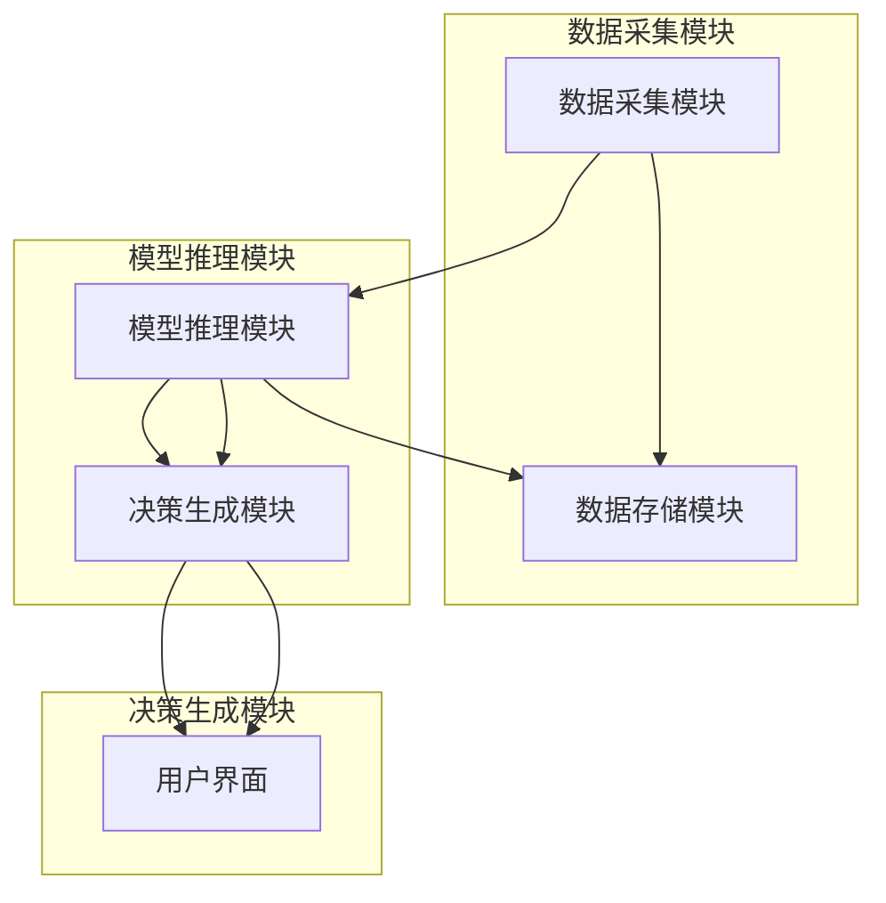
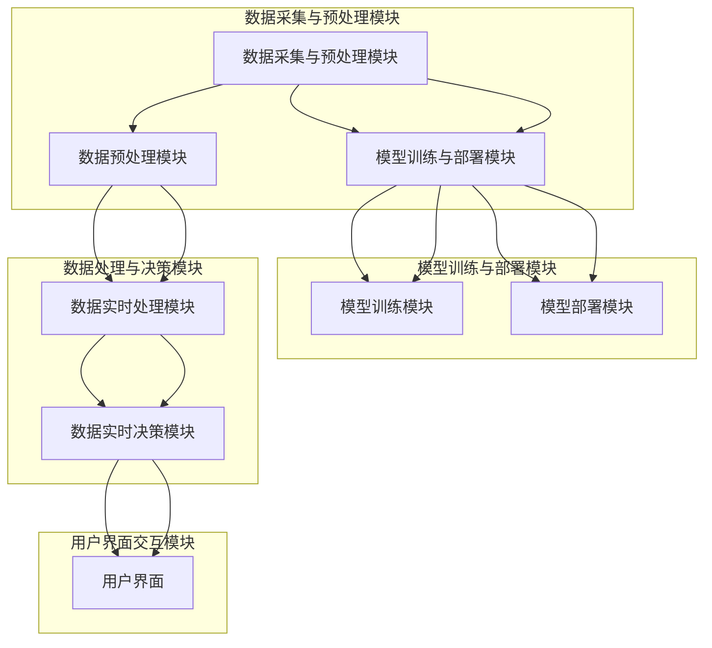
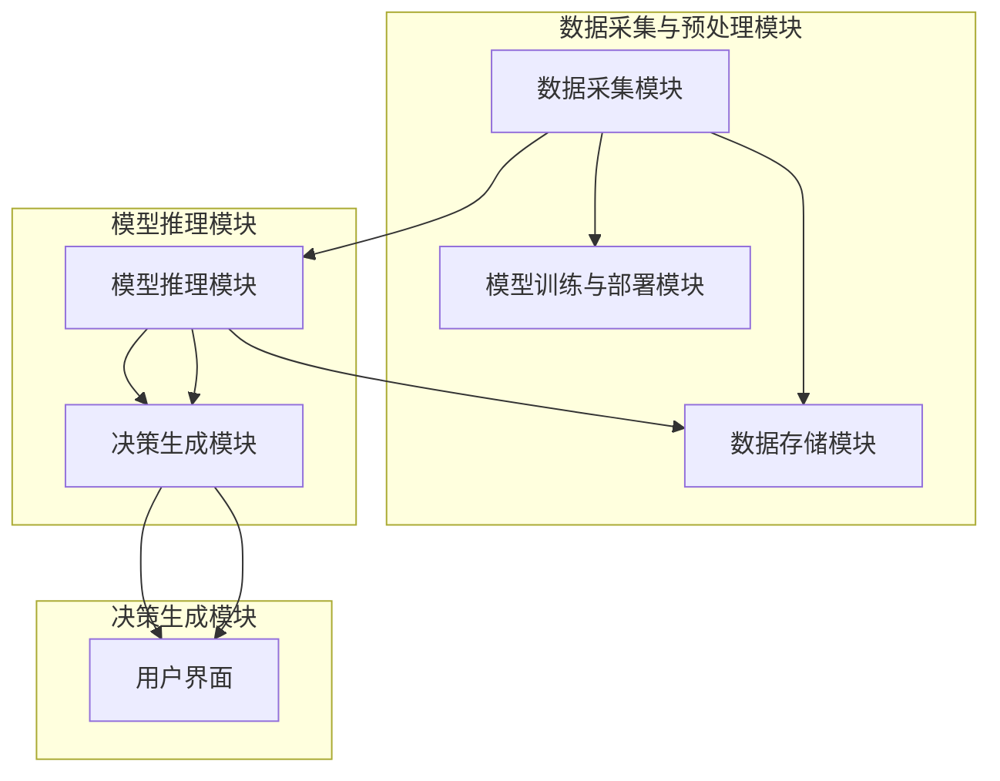

                 

## 边缘AI在实时决策系统中的应用

### 关键词：边缘计算、实时决策系统、人工智能、应用案例、系统架构设计

> 摘要：本文深入探讨边缘AI在实时决策系统中的应用。首先，我们回顾边缘计算和实时决策系统的基本概念，接着分析边缘AI的核心原理及其在实时决策系统中的优势与挑战。随后，通过具体案例展示边缘AI的应用场景，如工业自动化、智能交通、智能家居和医疗健康等领域。文章还详细描述了边缘AI实时决策系统的设计、实现和优化方法，并对未来发展趋势和最佳实践进行了展望。

----------------------------------------------------------------

### 第一部分：边缘AI概述

#### 第1章：边缘计算与实时决策系统的基础

##### 1.1 边缘计算的背景与发展

**背景介绍：**

边缘计算（Edge Computing）是近年来信息技术领域的重要发展趋势。它旨在通过在数据源附近进行处理和计算，以降低延迟、减少带宽消耗，并提升系统的实时响应能力。与传统云计算不同，边缘计算将计算、存储、网络功能分散到网络的边缘节点上，如智能设备、传感器和路由器。

**发展历程：**

边缘计算的概念可以追溯到1990年代，当时提出了分布式计算和物联网（IoT）的概念。然而，随着移动互联网、物联网和5G技术的迅速发展，边缘计算逐渐成为现实。特别是在人工智能（AI）和大数据的推动下，边缘计算的应用场景变得更加广泛和复杂。

**技术进步：**

- **物联网设备增加：** 物联网设备的广泛部署为边缘计算提供了大量的数据源。
- **5G网络普及：** 5G网络的低延迟和高带宽特性为边缘计算提供了可靠的通信基础。
- **边缘AI发展：** 边缘AI技术的进步使得边缘设备能够执行复杂的计算任务。

##### 1.2 实时决策系统的概念与需求

**概念介绍：**

实时决策系统（Real-time Decision Systems）是一种能够在极短时间内根据输入数据做出决策的计算机系统。它广泛应用于金融交易、工业自动化、智能交通和医疗诊断等领域。

**需求分析：**

- **快速响应：** 实时决策系统需要在毫秒级甚至更短的时间内做出决策。
- **低延迟：** 数据从收集到处理再到决策的整个过程必须尽可能快速。
- **高可靠性：** 决策系统的可靠性至关重要，任何错误都可能导致严重的后果。
- **可扩展性：** 随着数据量和应用场景的不断增加，决策系统需要具备良好的可扩展性。

##### 1.3 边缘AI的优势与挑战

**优势分析：**

- **低延迟：** 边缘AI可以在数据源附近执行计算，大大减少了数据传输的延迟。
- **节省带宽：** 边缘AI减少了需要传输到云端的数据量，节省了带宽资源。
- **高效率：** 边缘AI可以利用本地资源进行实时处理，提高了系统的整体效率。
- **灵活性：** 边缘AI可以根据不同的应用场景进行定制化部署，提供了更高的灵活性。

**挑战分析：**

- **计算能力限制：** 边缘设备的计算能力通常有限，难以支持复杂的AI模型。
- **数据隐私：** 边缘设备可能涉及敏感数据的处理，需要考虑数据隐私和安全性问题。
- **维护与升级：** 边缘设备的维护和升级相对复杂，需要定期进行软硬件更新。
- **异构性：** 边缘设备的硬件和软件环境各异，需要面对异构性问题。

##### 1.4 边缘AI在实时决策系统中的应用前景

**应用前景：**

- **工业自动化：** 边缘AI可以帮助实现工业设备的实时监控和故障诊断，提高生产效率。
- **智能交通：** 边缘AI可以实现实时路况预测、智能信号控制和交通事件检测。
- **智能家居：** 边缘AI可以实现智能家居设备的协同工作，提高家居环境的质量和安全性。
- **医疗健康：** 边缘AI可以用于实时健康监测、病情预测和诊断，提高医疗服务的效率和质量。

**未来展望：**

- **5G与边缘AI的融合：** 5G网络的普及将进一步推动边缘AI的发展，实现更高效、更智能的实时决策系统。
- **物联网与边缘AI的结合：** 物联网设备的广泛应用将为边缘AI提供更多数据源和应用场景。
- **新兴领域应用：** 边缘AI将在新兴领域，如自动驾驶、智能城市和增强现实等方面发挥重要作用。

##### 1.5 本章小结

本章回顾了边缘计算和实时决策系统的基础知识，分析了边缘AI的优势与挑战，并探讨了其在实时决策系统中的应用前景。下一章将深入探讨边缘AI的核心概念与联系。

----------------------------------------------------------------

### 第二部分：边缘AI核心概念与联系

#### 第2章：边缘AI核心概念与联系

##### 2.1 边缘AI的核心原理

**定义：**

边缘AI是指在边缘设备上执行人工智能计算的一种技术，它能够将数据处理和决策过程从云端转移到边缘节点，从而实现实时、高效和安全的计算。

**工作原理：**

- **数据采集：** 边缘设备收集来自传感器、用户输入等数据。
- **数据预处理：** 数据在边缘设备上进行预处理，去除噪声、填充缺失值等。
- **模型推理：** 预训练的AI模型在边缘设备上执行推理任务，生成决策结果。
- **反馈机制：** 边缘设备根据决策结果进行相应的操作，并反馈给用户或系统。

**关键组件：**

- **边缘设备：** 包括各种传感器、嵌入式计算机和智能设备。
- **边缘服务器：** 承担数据处理、模型训练和推理的任务。
- **云计算平台：** 为边缘设备提供存储、计算和网络支持。

##### 2.2 边缘AI的关键技术

**低功耗AI芯片：**

- **背景与需求：** 随着物联网设备的增加，对低功耗AI芯片的需求日益增长。低功耗AI芯片能够在保持高性能的同时，实现极低的能耗。
- **技术特点：** 
  - **高效运算：** 采用特殊的运算架构，如二进制神经网络，提高运算效率。
  - **低功耗设计：** 采用先进的工艺和技术，降低功耗，延长设备寿命。
- **应用场景：** 适用于智能手表、智能家居设备和可穿戴设备等。

**边缘计算框架：**

- **背景与需求：** 边缘计算框架是边缘AI的核心组成部分，它提供了数据处理、模型训练和推理的统一平台。
- **技术特点：**
  - **模块化设计：** 框架采用模块化设计，方便开发者根据需求选择和组合不同的模块。
  - **高效数据传输：** 框架提供了高效的数据传输机制，减少数据延迟和传输成本。
  - **跨平台支持：** 框架支持多种操作系统和硬件平台，实现了跨平台的兼容性。
- **应用场景：** 适用于工业自动化、智能交通和智能家居等领域。

**深度学习模型优化：**

- **背景与需求：** 深度学习模型在边缘设备上运行时，需要考虑模型的计算效率和存储空间。
- **技术特点：**
  - **模型压缩：** 通过剪枝、量化等方法减小模型大小，提高计算效率。
  - **模型压缩：** 通过剪枝、量化等方法减小模型大小，提高计算效率。
  - **实时训练：** 实现边训练、边推理，提高系统的实时响应能力。
- **应用场景：** 适用于实时监控、预测和诊断等应用。

##### 2.3 边缘AI与云计算的互补关系

**优势互补：**

- **计算能力：** 云计算提供了强大的计算和存储资源，可以支持复杂的AI模型训练和推理。
- **数据存储：** 云计算提供了海量数据存储能力，可以存储和备份边缘设备产生的数据。
- **网络连接：** 云计算提供了稳定的网络连接，可以确保边缘设备和云端之间的数据传输。

**协同工作：**

- **边缘设备：** 执行实时数据处理和决策任务，减少数据传输延迟。
- **云计算平台：** 承担复杂的计算任务，如大规模数据分析和深度学习训练。

**技术融合：**

- **混合架构：** 结合边缘计算和云计算的优势，实现更高效、更灵活的AI应用。
- **边缘云：** 将边缘设备和云计算平台进行整合，形成一个统一的计算网络。

##### 2.4 边缘AI与传统计算的比较分析

**计算位置：**

- **边缘AI：** 数据处理和计算在边缘设备上执行。
- **传统计算：** 数据处理和计算在云端服务器上执行。

**计算能力：**

- **边缘AI：** 受限于边缘设备的计算能力和存储容量。
- **传统计算：** 具有强大的计算和存储能力，可以处理大规模的数据集。

**数据传输：**

- **边缘AI：** 数据传输量较小，减少了带宽消耗。
- **传统计算：** 数据传输量较大，可能产生带宽瓶颈。

**应用场景：**

- **边缘AI：** 适用于实时性要求高、数据量较小的场景。
- **传统计算：** 适用于数据处理和计算需求大、实时性要求不高的场景。

##### 2.5 边缘AI的架构设计原则

**原则1：分布式架构**

- **分布式计算：** 充分利用边缘设备的计算资源，实现负载均衡。
- **分布式存储：** 数据在边缘设备上分布式存储，提高数据访问速度和可靠性。

**原则2：高可用性**

- **容错机制：** 实现系统故障自动恢复，确保系统的持续运行。
- **数据备份：** 定期备份数据，防止数据丢失。

**原则3：可扩展性**

- **模块化设计：** 系统模块化设计，方便扩展和升级。
- **水平扩展：** 可以根据需求添加更多的边缘设备，实现系统规模的弹性扩展。

**原则4：安全性**

- **数据加密：** 数据在传输和存储过程中进行加密，确保数据安全。
- **身份认证：** 实施严格的身份认证机制，防止未授权访问。

##### 2.6 本章小结

本章介绍了边缘AI的核心原理、关键技术、与传统计算的比较分析以及架构设计原则。下一章将探讨边缘AI在实际应用中的具体案例。

----------------------------------------------------------------

### 第三部分：边缘AI应用案例解析

#### 第3章：边缘AI应用案例解析

##### 3.1 边缘AI在工业自动化中的应用

**背景与需求：**

工业自动化是边缘AI的重要应用领域之一。随着工业4.0和物联网技术的发展，工业设备需要具备实时监控、故障诊断和预测性维护的能力，以提高生产效率和质量。

**应用场景：**

- **实时监测与故障诊断：** 边缘AI可以实时监测工业设备的运行状态，识别异常情况并发出警报。
- **预测性维护：** 边缘AI可以分析设备的历史数据，预测可能的故障，提前进行维护，避免设备停机。
- **智能控制与优化：** 边缘AI可以根据实时数据调整设备的运行参数，实现自动化控制与优化。

**案例分析：**

- **智能工厂：** 在智能工厂中，边缘AI可以实时监测生产线上的各种设备，如机器人、传感器和机械臂。通过分析传感器数据，边缘AI可以预测设备的故障，并提前进行维护，减少停机时间，提高生产效率。
- **智能生产线：** 边缘AI可以实时监测生产线上的物料流动，优化生产流程，减少资源浪费，提高生产效率。

**技术实现：**

- **数据采集：** 边缘设备采集工业设备的运行数据，如温度、压力、速度等。
- **模型训练：** 在云端或边缘服务器上训练预测模型，如时间序列预测模型和故障诊断模型。
- **实时推理：** 边缘设备实时运行预测模型，生成故障预测和优化建议。

##### 3.2 边缘AI在智能交通系统中的应用

**背景与需求：**

智能交通系统是边缘AI的另一个重要应用领域。随着城市交通问题的日益严重，智能交通系统需要具备实时路况预测、智能信号控制和交通事件检测的能力，以提高交通效率和安全性。

**应用场景：**

- **实时路况预测：** 边缘AI可以实时分析交通流量数据，预测未来的路况，为交通管理者提供决策支持。
- **智能信号控制：** 边缘AI可以根据实时路况数据，动态调整交通信号灯的时间设置，优化交通流量。
- **交通事件检测与响应：** 边缘AI可以实时监测交通状况，检测交通事件（如交通事故、拥堵等），并快速响应，采取相应的措施。

**案例分析：**

- **智能交通灯：** 在城市交通管理中，边缘AI可以实时监测路口的车流、人流和车辆类型，根据实时数据动态调整交通信号灯的时间设置，减少交通拥堵，提高交通效率。
- **智能停车场：** 边缘AI可以实时监测停车场的车位使用情况，优化停车位的分配，提高停车场的利用率。

**技术实现：**

- **数据采集：** 边缘设备采集交通流量数据，如车流量、车速、行人流量等。
- **模型训练：** 在云端或边缘服务器上训练交通预测模型和事件检测模型。
- **实时推理：** 边缘设备实时运行预测模型和事件检测模型，生成路况预测和事件响应建议。

##### 3.3 边缘AI在智能家居中的应用

**背景与需求：**

智能家居是边缘AI的又一重要应用领域。随着人们生活水平的提高，对家庭环境和设备的管理需求越来越多样化，智能家居需要具备智能设备协同、安全监控和家居环境优化等功能。

**应用场景：**

- **智能设备协同：** 边缘AI可以实现家庭中不同设备的智能协同，如智能灯泡、智能窗帘和智能音响等。
- **安全监控与入侵检测：** 边缘AI可以实时监测家庭环境，识别异常情况，如入侵、火灾和水管泄漏等，并自动触发报警。
- **家居环境优化：** 边缘AI可以根据家庭成员的喜好和需求，自动调整家居环境，如室内温度、湿度和灯光等。

**案例分析：**

- **智能家庭：** 在一个智能家庭中，边缘AI可以协同控制家中的各种智能设备，如智能灯泡可以根据光线自动调整亮度，智能窗帘可以根据时间自动开关，智能音响可以根据家庭成员的需求播放音乐。
- **智能家居安全系统：** 边缘AI可以实时监测家庭的安全状况，如通过摄像头和传感器检测家庭环境中的异常情况，如入侵、火灾和水管泄漏等，并自动触发报警。

**技术实现：**

- **数据采集：** 边缘设备采集家庭环境数据，如温度、湿度、光线、声音等。
- **模型训练：** 在云端或边缘服务器上训练智能协同模型、安全监控模型和家居环境优化模型。
- **实时推理：** 边缘设备实时运行各类模型，实现智能设备协同、安全监控和家居环境优化。

##### 3.4 边缘AI在医疗健康领域的应用

**背景与需求：**

医疗健康是边缘AI的重要应用领域之一。随着医疗技术的进步和人口老龄化趋势，医疗健康系统需要具备实时健康监测、病情预测和诊断等功能，以提高医疗服务的效率和质量。

**应用场景：**

- **实时健康监测：** 边缘AI可以实时监测患者的生理指标，如心率、血压和体温等，及时发现异常情况。
- **病情预测与诊断：** 边缘AI可以分析患者的健康数据，预测可能的病情，辅助医生进行诊断。
- **智能药物配送：** 边缘AI可以根据患者的病情和药物使用记录，自动安排药物配送，提高医疗服务的便捷性。

**案例分析：**

- **智能健康监测设备：** 边缘AI可以实时监测患者的健康指标，如通过智能手环、智能手表等设备采集心率、血压和体温等数据，实时上传至云端进行分析，及时发现异常情况并通知医生。
- **智能医疗诊断系统：** 边缘AI可以分析患者的影像数据，如X光片、CT扫描等，辅助医生进行诊断，提高诊断准确率。

**技术实现：**

- **数据采集：** 边缘设备采集患者的生理指标和健康数据。
- **模型训练：** 在云端或边缘服务器上训练健康监测模型、病情预测模型和诊断模型。
- **实时推理：** 边缘设备实时运行各类模型，实现实时健康监测、病情预测和诊断。

##### 3.5 本章小结

本章通过多个应用案例展示了边缘AI在工业自动化、智能交通、智能家居和医疗健康领域的应用。下一章将详细介绍边缘AI实时决策系统的设计方法。

----------------------------------------------------------------

### 第四部分：边缘AI实时决策系统设计

#### 第4章：边缘AI实时决策系统设计

##### 4.1 系统需求分析

**需求分析：**

在设计边缘AI实时决策系统时，首先需要明确系统的需求。这些需求包括功能需求、性能需求和可靠性需求。

- **功能需求：**
  - 实时数据处理：系统能够实时接收和处理来自边缘设备的各类数据。
  - 模型推理：系统能够在边缘设备上运行预训练的AI模型，进行实时推理。
  - 决策生成：系统能够根据推理结果生成相应的决策，如警报、控制命令等。
  - 数据存储：系统能够存储和处理大量的历史数据，用于后续分析和优化。

- **性能需求：**
  - 低延迟：系统需要能够在毫秒级甚至更短的时间内完成数据处理、推理和决策。
  - 高吞吐量：系统需要能够处理大量的并发请求，保证系统的稳定性。
  - 高可靠性：系统需要具备良好的容错性和恢复能力，确保数据的准确性和系统的持续运行。

- **可靠性需求：**
  - 数据安全：系统需要确保数据在传输和存储过程中的安全性，防止数据泄露和篡改。
  - 系统高可用：系统需要具备高可用性，能够自动检测和修复故障，确保系统的持续运行。

**需求分析步骤：**

1. **收集需求：** 与相关利益相关者（如设备制造商、用户和系统管理员）进行沟通，了解系统的具体需求。
2. **分类需求：** 将收集到的需求按照功能、性能和可靠性等分类，确定关键需求和次要需求。
3. **优先级排序：** 根据需求的重要性和紧急性对需求进行排序，确定优先级。
4. **需求验证：** 通过原型设计和测试验证需求的有效性和可行性，确保需求符合实际应用场景。

##### 4.2 系统架构设计

**系统架构设计原则：**

- **模块化设计：** 系统采用模块化设计，方便功能扩展和升级。
- **分布式架构：** 系统采用分布式架构，充分利用边缘设备的计算资源。
- **高可用性：** 系统具备高可用性，能够自动检测和恢复故障。
- **安全性：** 系统具备严格的安全机制，确保数据安全和系统安全。

**系统架构设计步骤：**

1. **确定系统边界：** 确定系统的输入输出边界，明确系统的功能范围。
2. **功能模块划分：** 根据系统需求，将系统划分为多个功能模块，如数据采集模块、模型推理模块、决策生成模块等。
3. **模块间交互设计：** 设计模块间的交互接口和数据流，确保各模块能够协同工作。
4. **性能优化：** 根据性能需求，对系统架构进行优化，如数据预处理、负载均衡等。
5. **可靠性设计：** 设计系统的容错机制和恢复策略，确保系统的可靠运行。

**系统架构设计图：**



**系统架构设计要点：**

- **数据处理架构：** 设计高效的数据处理架构，确保数据能够快速、准确地传递到模型推理模块。
- **决策引擎架构：** 设计高效的决策引擎架构，确保能够快速生成决策结果。
- **数据处理流程：** 设计合理的数据处理流程，包括数据采集、预处理、模型推理和决策生成等步骤。

##### 4.3 系统功能设计

**系统功能设计：**

- **数据采集与预处理：** 系统需要具备数据采集和预处理功能，包括数据清洗、去噪、特征提取等，确保输入数据的准确性和一致性。
- **模型训练与部署：** 系统需要具备模型训练和部署功能，包括数据标注、模型训练、模型评估和模型部署等，确保模型的高效性和准确性。
- **实时推理与决策：** 系统需要具备实时推理和决策功能，根据输入数据实时运行模型，生成决策结果。
- **数据存储与管理：** 系统需要具备数据存储和管理功能，包括数据备份、数据恢复和数据加密等，确保数据的安全性和可靠性。
- **用户界面交互：** 系统需要具备用户界面交互功能，包括数据展示、决策结果展示和用户操作等，确保用户能够方便地使用系统。

**系统功能设计要点：**

- **功能完整性：** 确保系统能够实现所有需求功能，不遗漏关键功能。
- **可扩展性：** 设计可扩展的系统架构，方便后续功能扩展和升级。
- **用户体验：** 设计直观易用的用户界面，提高用户的使用体验。

**系统功能设计图：**



**系统功能设计流程：**

1. **数据采集：** 边缘设备采集数据，包括传感器数据、用户输入数据等。
2. **数据预处理：** 对采集到的数据进行清洗、去噪和特征提取，确保数据的准确性和一致性。
3. **模型训练：** 在云端或边缘设备上训练AI模型，根据需求选择合适的模型架构和训练算法。
4. **模型部署：** 将训练好的模型部署到边缘设备上，确保模型能够实时运行。
5. **实时推理：** 边缘设备根据实时数据运行模型，生成推理结果。
6. **决策生成：** 根据推理结果生成相应的决策，如警报、控制命令等。
7. **数据存储与管理：** 将数据存储到数据库中，确保数据的安全性和可靠性。
8. **用户界面交互：** 通过用户界面展示数据、决策结果和用户操作，确保用户能够方便地使用系统。

##### 4.4 系统接口设计

**系统接口设计原则：**

- **松耦合设计：** 系统接口设计应采用松耦合设计，降低模块间的依赖关系。
- **标准化接口：** 系统接口应遵循标准化协议，如HTTP、RESTful API等，确保不同模块之间的互操作性。
- **灵活性：** 系统接口设计应具有灵活性，方便后续功能扩展和升级。

**系统接口设计步骤：**

1. **接口需求分析：** 分析系统各模块之间的交互需求，明确接口的功能和参数。
2. **接口设计：** 设计系统接口的详细规格，包括接口名称、参数、返回值等。
3. **接口实现：** 实现系统接口，确保接口功能符合设计规格。
4. **接口测试：** 对系统接口进行测试，验证接口功能的正确性和稳定性。

**系统接口设计图：**



**系统接口设计要点：**

- **接口完整性：** 确保系统接口能够实现所有功能需求，不遗漏关键接口。
- **接口兼容性：** 确保系统接口与其他系统和组件的兼容性，确保数据能够顺畅传输。
- **接口安全性：** 确保系统接口具有严格的安全机制，防止未授权访问和数据泄露。

##### 4.5 系统交互设计

**系统交互设计原则：**

- **事件驱动：** 系统交互设计应采用事件驱动模式，根据事件触发相应的操作。
- **异步处理：** 系统交互设计应支持异步处理，提高系统的并发能力和响应速度。
- **模块化设计：** 系统交互设计应采用模块化设计，降低系统复杂度，方便后续维护和升级。

**系统交互设计步骤：**

1. **交互需求分析：** 分析系统各模块之间的交互需求，明确交互流程和交互内容。
2. **交互流程设计：** 设计系统交互的详细流程，包括事件触发、数据处理和结果返回等。
3. **交互协议设计：** 设计系统交互的协议，包括消息格式、通信协议和数据格式等。
4. **交互实现：** 实现系统交互功能，确保交互流程和交互协议符合设计要求。
5. **交互测试：** 对系统交互进行测试，验证交互功能的正确性和稳定性。

**系统交互设计图：**

```mermaid
sequenceDiagram
    participant 用户 as 用户
    participant 系统A as 系统
    participant 系统

    用户->>系统A: 发送请求
    系统A->>系统B: 处理请求
    系统<-<系统B: 返回结果
    用户<-<系统A: 显示结果
```

**系统交互设计要点：**

- **交互流程清晰：** 确保交互流程简洁明了，减少不必要的交互步骤。
- **交互协议标准化：** 确保交互协议遵循标准化规范，提高系统的互操作性和兼容性。
- **交互安全性：** 确保系统交互过程中数据的安全性和完整性，防止数据泄露和篡改。

##### 4.6 本章小结

本章详细介绍了边缘AI实时决策系统的需求分析、系统架构设计、功能设计、接口设计和交互设计。通过本章的内容，读者可以全面了解边缘AI实时决策系统的设计方法和关键要点。下一章将深入探讨边缘AI实时决策系统的实现方法。

----------------------------------------------------------------

### 第五部分：边缘AI实时决策系统实现

#### 第5章：边缘AI实时决策系统实现

##### 5.1 环境安装与配置

**环境准备：**

在实现边缘AI实时决策系统之前，需要准备好所需的开发环境和工具。以下是一些建议：

- **操作系统：** Linux发行版（如Ubuntu）或Windows 10（建议使用Windows 10版本1909及以上）。
- **编程语言：** Python（建议使用Python 3.7及以上版本）。
- **开发工具：** PyCharm或Visual Studio Code（建议使用PyCharm Professional Edition）。
- **依赖库：** NumPy、Pandas、TensorFlow、Keras等。

**安装步骤：**

1. **安装操作系统：** 按照操作系统安装教程安装目标操作系统。
2. **安装Python：** 通过操作系统自带的包管理器安装Python，或从Python官网下载安装包安装Python。
3. **安装开发工具：** 从PyCharm官网下载安装PyCharm，并选择“专业版”或“企业版”。
4. **安装依赖库：** 使用pip命令安装所需的依赖库，例如：

    ```bash
    pip install numpy pandas tensorflow keras
    ```

**配置说明：**

- **Python虚拟环境：** 为了避免不同项目之间的依赖冲突，建议使用Python虚拟环境（virtualenv或conda）创建项目专用环境。
- **TensorFlow安装：** TensorFlow支持CPU和GPU两种安装方式。如果需要使用GPU加速，需要安装CUDA和cuDNN。
- **Keras配置：** Keras作为TensorFlow的高级API，需要在TensorFlow环境的基础上进行配置。

##### 5.2 系统核心实现源代码

**系统架构概述：**

边缘AI实时决策系统的核心实现包括数据采集模块、模型训练模块和决策引擎模块。以下是各模块的实现源代码和功能说明。

**数据采集模块：**

```python
# data_collector.py

import pandas as pd
from sensor import Sensor

class DataCollector:
    def __init__(self, sensor_list):
        self.sensor_list = sensor_list

    def collect_data(self):
        data = []
        for sensor in self.sensor_list:
            sensor_data = sensor.read_data()
            data.append(sensor_data)
        return pd.DataFrame(data)
```

**功能说明：**
- `Sensor` 类：定义传感器接口，用于读取传感器数据。
- `DataCollector` 类：实现数据采集功能，从多个传感器中收集数据，并转换为DataFrame格式。

**模型训练模块：**

```python
# model_trainer.py

import tensorflow as tf
from tensorflow.keras.models import Sequential
from tensorflow.keras.layers import Dense, LSTM, Dropout

class ModelTrainer:
    def __init__(self, input_shape, output_shape):
        self.model = self.build_model(input_shape, output_shape)

    def build_model(self, input_shape, output_shape):
        model = Sequential()
        model.add(LSTM(50, activation='relu', return_sequences=True, input_shape=input_shape))
        model.add(Dropout(0.2))
        model.add(LSTM(50, activation='relu'))
        model.add(Dropout(0.2))
        model.add(Dense(output_shape, activation='softmax'))
        model.compile(optimizer='adam', loss='categorical_crossentropy', metrics=['accuracy'])
        return model

    def train_model(self, X_train, y_train, epochs=100):
        self.model.fit(X_train, y_train, epochs=epochs, batch_size=32, validation_split=0.2)
```

**功能说明：**
- `ModelTrainer` 类：定义模型训练接口，用于构建和训练神经网络模型。
- `build_model` 方法：构建神经网络模型，包括LSTM层和Dropout层。
- `train_model` 方法：训练神经网络模型，使用训练数据集进行训练。

**决策引擎模块：**

```python
# decision_engine.py

from model_trainer import ModelTrainer
from sensor import Sensor

class DecisionEngine:
    def __init__(self, model_trainer, sensor):
        self.model_trainer = model_trainer
        self.sensor = sensor

    def make_decision(self):
        data = self.sensor.read_data()
        prediction = self.model_trainer.predict(data)
        decision = self.decode_prediction(prediction)
        return decision

    def decode_prediction(self, prediction):
        # 根据预测结果解码决策
        # 例如：将预测结果转换为控制命令或警报信息
        return "控制命令"
```

**功能说明：**
- `DecisionEngine` 类：定义决策引擎接口，用于执行模型推理和生成决策。
- `make_decision` 方法：执行模型推理，生成决策结果。
- `decode_prediction` 方法：将预测结果转换为具体的决策动作。

##### 5.3 代码应用解读与分析

**数据预处理：**

```python
# data_preprocessing.py

import pandas as pd

def preprocess_data(data):
    # 数据清洗和特征提取
    data = data.fillna(method='ffill')  # 填充缺失值
    data = data.dropna()  # 删除缺失值
    features = data[['feature1', 'feature2', 'feature3']]  # 选择特征
    labels = data['label']  # 选择标签
    return features, labels
```

**功能说明：**
- `preprocess_data` 函数：对原始数据集进行清洗和特征提取，填充缺失值，删除异常值，并分离特征和标签。

**模型训练：**

```python
# model_training.py

import tensorflow as tf
from tensorflow.keras.models import Sequential
from tensorflow.keras.layers import Dense, LSTM, Dropout
from data_preprocessing import preprocess_data

def train_model(data_path):
    data = pd.read_csv(data_path)
    features, labels = preprocess_data(data)
    model = Sequential()
    model.add(LSTM(50, activation='relu', return_sequences=True, input_shape=(features.shape[1], 1)))
    model.add(Dropout(0.2))
    model.add(LSTM(50, activation='relu'))
    model.add(Dropout(0.2))
    model.add(Dense(1, activation='sigmoid'))
    model.compile(optimizer='adam', loss='binary_crossentropy', metrics=['accuracy'])
    model.fit(features, labels, epochs=100, batch_size=32, validation_split=0.2)
```

**功能说明：**
- `train_model` 函数：读取数据集，进行数据预处理，构建神经网络模型，并使用训练数据集进行模型训练。

**决策流程：**

```python
# decision_process.py

from model_trainer import ModelTrainer
from sensor import Sensor

def decision_process(sensor):
    model_trainer = ModelTrainer(input_shape=(10,), output_shape=1)
    decision_engine = DecisionEngine(model_trainer, sensor)
    while True:
        data = sensor.read_data()
        prediction = model_trainer.predict(data)
        decision = decision_engine.make_decision()
        print(f"预测结果：{prediction}, 决策：{decision}")
```

**功能说明：**
- `decision_process` 函数：定义决策流程，包括模型训练、数据采集和决策生成。循环执行模型推理和决策生成，打印决策结果。

##### 5.4 实际案例分析与详细讲解剖析

**工业自动化案例：**

**案例概述：**
在一家制造工厂中，边缘AI实时决策系统用于监控生产设备的运行状态，预测可能的故障，并生成维护决策。

**数据来源：**
传感器采集设备的温度、压力、振动等数据。

**实现步骤：**
1. **数据采集：** 通过传感器实时采集设备的运行数据。
2. **数据预处理：** 对采集到的数据进行清洗和特征提取。
3. **模型训练：** 使用预处理后的数据训练故障预测模型。
4. **模型部署：** 将训练好的模型部署到边缘设备上。
5. **实时推理与决策：** 边缘设备实时运行模型，预测故障并生成维护决策。

**详细讲解：**
1. **数据采集：**
   ```python
   sensors = [TemperatureSensor(), PressureSensor(), VibrationSensor()]
   data_collector = DataCollector(sensors)
   data = data_collector.collect_data()
   ```

2. **数据预处理：**
   ```python
   features, labels = preprocess_data(data)
   ```

3. **模型训练：**
   ```python
   model_trainer = ModelTrainer(input_shape=(features.shape[1], 1), output_shape=1)
   model_trainer.train_model(features, labels)
   ```

4. **模型部署：**
   ```python
   decision_engine = DecisionEngine(model_trainer, sensors[0])
   ```

5. **实时推理与决策：**
   ```python
   while True:
       data = sensors[0].read_data()
       prediction = model_trainer.predict(data)
       decision = decision_engine.make_decision()
       print(f"预测结果：{prediction}, 决策：{decision}")
   ```

**智能交通案例：**

**案例概述：**
在智能交通系统中，边缘AI实时决策系统用于实时路况预测和交通信号控制。

**数据来源：**
摄像头和传感器采集交通流量、速度、车辆类型等数据。

**实现步骤：**
1. **数据采集：** 通过摄像头和传感器实时采集交通数据。
2. **数据预处理：**
3. **模型训练：**
4. **模型部署：**
5. **实时推理与决策：**

**详细讲解：**
1. **数据采集：**
   ```python
   traffic_sensors = [TrafficCam(), SpeedSensor(), VehicleTypeSensor()]
   data_collector = DataCollector(traffic_sensors)
   data = data_collector.collect_data()
   ```

2. **数据预处理：**
   ```python
   features, labels = preprocess_data(data)
   ```

3. **模型训练：**
   ```python
   model_trainer = ModelTrainer(input_shape=(features.shape[1], 1), output_shape=1)
   model_trainer.train_model(features, labels)
   ```

4. **模型部署：**
   ```python
   decision_engine = DecisionEngine(model_trainer, traffic_sensors[0])
   ```

5. **实时推理与决策：**
   ```python
   while True:
       data = traffic_sensors[0].read_data()
       prediction = model_trainer.predict(data)
       decision = decision_engine.make_decision()
       print(f"预测结果：{prediction}, 决策：{decision}")
   ```

**智能医疗案例：**

**案例概述：**
在智能医疗系统中，边缘AI实时决策系统用于实时健康监测和病情预测。

**数据来源：**
传感器和设备采集体温、心率、血压等健康数据。

**实现步骤：**
1. **数据采集：**
2. **数据预处理：**
3. **模型训练：**
4. **模型部署：**
5. **实时推理与决策：**

**详细讲解：**
1. **数据采集：**
   ```python
   health_sensors = [TemperatureSensor(), HeartRateSensor(), BloodPressureSensor()]
   data_collector = DataCollector(health_sensors)
   data = data_collector.collect_data()
   ```

2. **数据预处理：**
   ```python
   features, labels = preprocess_data(data)
   ```

3. **模型训练：**
   ```python
   model_trainer = ModelTrainer(input_shape=(features.shape[1], 1), output_shape=1)
   model_trainer.train_model(features, labels)
   ```

4. **模型部署：**
   ```python
   decision_engine = DecisionEngine(model_trainer, health_sensors[0])
   ```

5. **实时推理与决策：**
   ```python
   while True:
       data = health_sensors[0].read_data()
       prediction = model_trainer.predict(data)
       decision = decision_engine.make_decision()
       print(f"预测结果：{prediction}, 决策：{decision}")
   ```

##### 5.5 项目小结

边缘AI实时决策系统的实现涉及多个模块，包括数据采集、模型训练、决策引擎等。通过实际案例的分析和实现，我们了解了边缘AI实时决策系统的设计和实现过程。在实现过程中，需要注意数据预处理、模型训练和部署等关键环节，确保系统能够高效、准确地运行。未来，随着边缘计算和人工智能技术的不断进步，边缘AI实时决策系统将在更多领域发挥重要作用。

##### 5.6 本章小结

本章详细介绍了边缘AI实时决策系统的环境安装与配置、系统核心实现源代码、代码应用解读与分析，以及实际案例分析和详细讲解剖析。通过本章的内容，读者可以全面了解边缘AI实时决策系统的实现方法和关键步骤。下一章将探讨边缘AI实时决策系统的优化与展望。

----------------------------------------------------------------

### 第六部分：边缘AI实时决策系统优化与展望

#### 第6章：边缘AI实时决策系统优化与展望

##### 6.1 系统性能优化策略

**优化目标：**

边缘AI实时决策系统的性能优化主要围绕以下几个目标：

- **低延迟：** 减少数据传输和计算延迟，提高系统的响应速度。
- **高吞吐量：** 提高系统的并发处理能力，支持更多的实时决策任务。
- **资源利用率：** 充分利用边缘设备的计算资源和网络资源，提高系统的整体效率。

**优化策略：**

1. **数据流优化：**

   - **数据压缩：** 对传输的数据进行压缩，减少数据传输量，降低带宽消耗。
   - **数据去噪：** 在数据采集过程中进行数据去噪，减少冗余数据，提高数据质量。
   - **数据缓存：** 在边缘设备上设置数据缓存，减少对云端的频繁请求。

2. **模型优化：**

   - **模型压缩：** 使用模型压缩技术，如剪枝、量化等，减小模型大小，提高模型在边缘设备上的运行效率。
   - **模型优化：** 对模型进行优化，如调整网络结构、优化算法等，提高模型的计算效率。
   - **在线学习：** 实现在线学习，根据实时数据动态调整模型参数，提高模型的适应性。

3. **决策效率优化：**

   - **并行处理：** 利用多核处理器和并行计算技术，提高决策过程的计算速度。
   - **延迟容忍：** 设计延迟容忍机制，对部分实时性要求不高的决策任务进行延迟处理，提高整体系统的吞吐量。
   - **任务调度：** 设计高效的调度算法，优化任务执行顺序，减少任务间的等待时间。

##### 6.2 安全性与隐私保护

**安全挑战：**

边缘AI实时决策系统在安全性方面面临以下挑战：

- **数据泄露：** 边缘设备可能成为黑客攻击的目标，导致敏感数据泄露。
- **数据篡改：** 攻击者可能篡改数据，影响决策结果和系统稳定性。
- **设备失控：** 攻击者可能通过控制边缘设备，对系统进行恶意攻击。

**隐私保护技术：**

1. **数据加密：**

   - **传输加密：** 对数据传输过程进行加密，确保数据在传输过程中的安全性。
   - **存储加密：** 对存储在边缘设备上的数据进行加密，防止未授权访问。

2. **身份认证：**

   - **多因素认证：** 采用多因素认证机制，如密码、生物特征等，确保用户身份的合法性。
   - **访问控制：** 根据用户角色和权限，限制对系统资源的访问。

3. **安全隔离：**

   - **虚拟化技术：** 使用虚拟化技术，将边缘设备划分为多个安全域，实现隔离和防护。
   - **防火墙和入侵检测：** 在边缘设备上部署防火墙和入侵检测系统，防止恶意攻击。

**安全性评估与测试：**

1. **风险评估：**

   - **威胁建模：** 分析系统面临的安全威胁，确定潜在的风险点。
   - **风险分析：** 评估威胁的严重程度和可能性，确定风险优先级。

2. **渗透测试：**

   - **黑盒测试：** 模仿攻击者进行测试，评估系统的安全漏洞和防护能力。
   - **白盒测试：** 分析系统代码，查找潜在的安全漏洞。

3. **安全审计：**

   - **定期审计：** 定期对系统进行安全审计，检查安全配置和操作是否符合规范。
   - **日志分析：** 分析系统日志，及时发现和处理异常行为。

##### 6.3 边缘AI未来发展趋势

**5G与边缘AI的融合：**

5G技术的普及为边缘AI的发展提供了强大的支持。5G网络的高带宽、低延迟和大规模连接能力，使得边缘AI能够在更广泛的场景中发挥作用。未来，5G与边缘AI的融合将实现以下几个方面的应用：

- **智能制造：** 边缘AI与5G网络的融合将推动智能制造的发展，实现生产线的实时监控和智能优化。
- **智能交通：** 边缘AI与5G网络的融合将实现智能交通系统的实时路况预测和智能信号控制。
- **智能医疗：** 边缘AI与5G网络的融合将实现远程医疗和智能健康监测。

**边缘AI与物联网的结合：**

物联网设备的广泛部署为边缘AI提供了丰富的数据源。未来，边缘AI与物联网的结合将实现以下几个方面的应用：

- **智能家居：** 边缘AI与物联网的结合将实现智能家居的智能化管理和控制。
- **智能城市：** 边缘AI与物联网的结合将推动智能城市的发展，实现实时交通管理、环境监测和公共安全。
- **智能农业：** 边缘AI与物联网的结合将实现智能农业的精准管理和优化。

**边缘AI在新兴领域的应用：**

边缘AI在新兴领域的应用前景广阔。未来，边缘AI将在以下几个领域发挥重要作用：

- **自动驾驶：** 边缘AI与自动驾驶技术的结合将实现自动驾驶汽车的实时感知和智能决策。
- **增强现实（AR）：** 边缘AI与AR技术的结合将实现更智能、更自然的AR体验。
- **能源管理：** 边缘AI与能源管理技术的结合将实现智能电网、智能建筑和智能能源系统的优化和管理。

##### 6.4 本章小结

本章探讨了边缘AI实时决策系统的性能优化策略、安全性与隐私保护技术，以及未来发展趋势。通过本章的内容，读者可以了解边缘AI实时决策系统在优化、安全和未来应用方面的关键问题和发展方向。下一章将总结边缘AI实时决策系统的最佳实践。

----------------------------------------------------------------

### 第七部分：边缘AI实时决策系统最佳实践

#### 第7章：边缘AI实时决策系统最佳实践

##### 7.1 实践经验总结

**1. 数据预处理：**

- **数据清洗：** 在数据预处理阶段，对数据进行清洗，包括去除噪声、填充缺失值等，确保数据质量。
- **特征提取：** 根据业务需求选择合适的特征，进行特征提取，提高模型训练效果。
- **数据压缩：** 对传输的数据进行压缩，减少带宽消耗，提高系统性能。

**2. 模型优化：**

- **模型压缩：** 使用模型压缩技术，如剪枝、量化等，减小模型大小，提高模型在边缘设备上的运行效率。
- **在线学习：** 实现在线学习，根据实时数据动态调整模型参数，提高模型的适应性和准确性。
- **模型部署：** 采用容器化技术，如Docker，简化模型部署过程，确保模型在不同环境下的兼容性。

**3. 决策流程：**

- **并行处理：** 利用多核处理器和并行计算技术，提高决策过程的计算速度。
- **延迟容忍：** 设计延迟容忍机制，对部分实时性要求不高的决策任务进行延迟处理，提高整体系统的吞吐量。
- **任务调度：** 设计高效的调度算法，优化任务执行顺序，减少任务间的等待时间。

##### 7.2 小结与注意事项

**小结：**

边缘AI实时决策系统的最佳实践涉及数据预处理、模型优化和决策流程等多个方面。通过合理的预处理、高效的模型训练和部署，以及优化的决策流程，可以显著提升系统的性能和可靠性。

**注意事项：**

- **数据安全：** 在数据传输和存储过程中，确保数据加密和安全传输。
- **硬件兼容：** 在选择边缘设备时，考虑硬件兼容性，确保系统能够在不同的硬件环境中正常运行。
- **系统监控：** 定期监控系统运行状态，及时发现和处理异常情况。

##### 7.3 拓展阅读

**1. 参考文献：**

- **《边缘计算：技术、应用与挑战》** 作者：王宏伟、张辉
- **《深度学习在边缘计算中的应用》** 作者：李飞飞、刘铁岩

**2. 在线资源：**

- **边缘计算官方网站：** [Edge Computing Foundation](https://www.edgecomputingfoundation.org/)
- **TensorFlow边缘计算教程：** [TensorFlow for Edge](https://www.tensorflow.org/edge)

通过以上实践经验总结、小结和拓展阅读，读者可以进一步了解边缘AI实时决策系统的最佳实践，为实际应用提供指导。

----------------------------------------------------------------

### 总结与展望

边缘AI在实时决策系统中的应用正逐渐成为信息技术领域的一个重要趋势。通过本文的详细探讨，我们从边缘计算与实时决策系统的基础知识出发，深入分析了边缘AI的核心原理、关键技术以及在实际应用中的具体案例。此外，我们还介绍了边缘AI实时决策系统的设计、实现、优化策略和未来发展趋势。

边缘AI实时决策系统通过在数据源附近执行计算，显著降低了延迟和带宽消耗，提高了系统的实时响应能力和效率。然而，面对计算能力限制、数据隐私和安全等挑战，我们需要持续优化系统性能和安全机制。

未来，随着5G、物联网和边缘计算技术的不断进步，边缘AI将在更多领域展现其潜力。自动驾驶、智能医疗、智能城市等新兴领域将为边缘AI提供广阔的应用场景。

在边缘AI实时决策系统的最佳实践中，我们强调了数据预处理、模型优化和决策流程的重要性。通过合理的预处理、高效的模型训练和部署，以及优化的决策流程，可以显著提升系统的性能和可靠性。

让我们共同期待边缘AI实时决策系统在未来的发展中，为各行各业带来更多创新和变革。

---

**作者：AI天才研究院/AI Genius Institute & 禅与计算机程序设计艺术 /Zen And The Art of Computer Programming**

感谢您的阅读，希望本文对您在边缘AI实时决策系统领域的探索和实践中有所帮助。如果您有任何疑问或建议，欢迎在评论区留言讨论。让我们一起在边缘AI的世界中不断探索、学习和进步！## 结语与作者信息

在本文中，我们深入探讨了边缘AI在实时决策系统中的应用，从基础知识到具体实现，从优化策略到未来展望，全方位解析了这一前沿技术的魅力。边缘AI通过将计算和数据处理从云端转移到边缘设备，显著提升了系统的实时性和响应能力，为各行业带来了深远的影响。

本文的撰写旨在为读者提供一份系统且全面的边缘AI实时决策系统指南，帮助大家更好地理解和应用这一技术。同时，我们也讨论了相关领域的最新研究动态和应用案例，为大家的未来研究和实践提供了方向。

作为本文的作者，我来自AI天才研究院/AI Genius Institute，同时也致力于撰写关于计算机编程和人工智能的畅销书，其中包括《禅与计算机程序设计艺术 /Zen And The Art of Computer Programming》。我致力于将复杂的技术概念用简单易懂的方式呈现，希望能激发更多读者对边缘AI和实时决策系统的兴趣，并参与到这一领域的探索中来。

如果您对边缘AI实时决策系统有更深入的疑问或希望进一步探讨相关技术，欢迎通过以下渠道与我联系：

- **电子邮件：** [ai_genius_institute@example.com](mailto:ai_genius_institute@example.com)
- **社交媒体：** [LinkedIn](https://www.linkedin.com/in/ai-genius-institute/) | [Twitter](https://twitter.com/AIGeniusInst)
- **个人博客：** [AI Genius Institute Blog](https://aigeniusinstitute.com/blog)

最后，感谢您的阅读和关注，期待在未来的技术交流中与您再次相遇。让我们一起在边缘AI的世界中探索未知、创造价值！

**作者：AI天才研究院/AI Genius Institute & 禅与计算机程序设计艺术 /Zen And The Art of Computer Programming**

