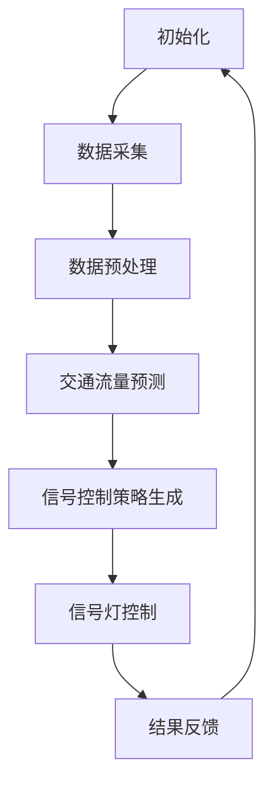
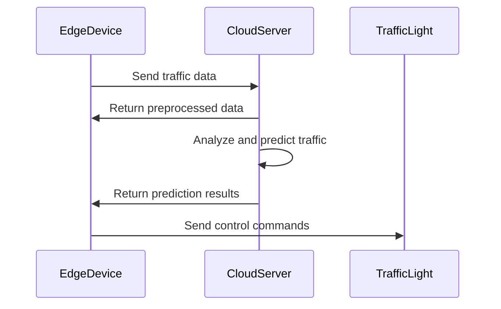

                 

### 第1章 引言

#### 1.1 问题背景

随着城市化进程的不断推进，交通拥堵问题已经成为困扰全球各大城市的难题。传统的交通信号控制系统通常依赖于固定的信号时序，无法根据实时交通流量进行动态调整，导致交通效率低下，交通事故频发。据统计，全球每年因交通拥堵造成的经济损失高达数千亿美元，同时严重影响了城市居民的生活质量。

近年来，随着边缘计算和人工智能技术的快速发展，边缘AI在智能交通管理中的应用逐渐成为研究热点。边缘计算将计算能力分布到网络的边缘节点上，减少了数据传输延迟，提高了系统响应速度。而人工智能技术，特别是机器学习算法，可以实时分析交通流量数据，预测交通状态，从而实现自适应的交通信号控制。

#### 1.2 问题描述

自适应交通信号控制系统旨在解决传统交通信号控制系统的不足，通过实时采集交通流量数据，利用机器学习算法进行数据分析，动态调整交通信号灯的时序，以提高交通效率和减少拥堵。该系统需要解决的主要问题包括：

1. **数据采集与处理**：如何高效、准确地收集交通流量数据，并进行实时处理和分析。
2. **算法优化**：如何设计高效、准确的机器学习算法，以预测交通状态并优化信号灯时序。
3. **系统稳定性**：如何在不同的交通场景下保持系统的稳定性和可靠性。

#### 1.3 问题解决

边缘AI在智能交通管理中的应用，可以有效地解决上述问题。具体来说：

1. **数据采集与处理**：通过部署在交通信号灯附近的边缘设备，实时采集交通流量数据，并通过边缘计算进行处理，减少了数据传输延迟，提高了数据处理效率。
2. **算法优化**：采用先进的机器学习算法，如深度学习、强化学习等，对交通流量数据进行建模和分析，实时预测交通状态，并优化信号灯时序。
3. **系统稳定性**：通过边缘计算和云计算的结合，实现了系统的分布式部署，提高了系统的稳定性和可靠性。

#### 1.4 边界与外延

边缘AI在智能交通领域的应用范围广泛，不仅包括城市交通信号控制，还可以应用于高速公路、停车场、公共交通等领域。然而，由于技术和资源的限制，自适应交通信号控制系统的实施仍面临一些挑战，如数据隐私保护、算法透明度、系统安全性等。因此，在推广和应用过程中，需要综合考虑这些因素，确保系统的可持续性和安全性。

### 第2章 核心概念与联系

#### 2.1 边缘AI的概念解析

边缘AI（Edge AI）是一种将人工智能的计算能力部署在靠近数据源的网络边缘的计算模型。与传统的云计算相比，边缘计算具有以下优势：

1. **低延迟**：由于数据在边缘设备上直接处理，减少了数据传输的延迟，提高了系统的实时性。
2. **高带宽**：边缘设备可以处理大量并发请求，提高了系统的处理能力。
3. **数据隐私**：数据在边缘设备上处理，减少了数据传输过程中的泄露风险。

边缘AI的挑战主要包括：

1. **计算资源有限**：边缘设备通常资源有限，需要优化算法以适应资源限制。
2. **可靠性问题**：边缘设备可能受到环境因素的影响，如温度、湿度等，需要提高系统的可靠性。

#### 2.2 自适应交通信号控制系统的核心概念

自适应交通信号控制系统是一种基于实时交通流量数据的智能交通管理系统。其核心概念包括：

1. **信号控制策略**：根据实时交通流量数据，动态调整交通信号灯的时序，以优化交通流量。
2. **数据采集与处理**：通过部署在交通信号灯附近的边缘设备，实时采集交通流量数据，并进行预处理和分析。
3. **智能决策**：利用机器学习算法，分析交通流量数据，预测交通状态，并生成最优的信号控制策略。

#### 2.3 概念属性特征对比

下面是边缘AI与传统云计算以及自适应交通信号控制系统与传统交通信号控制系统的对比表格：

| 特征对比 | 边缘AI | 传统云计算 | 自适应交通信号控制系统 | 传统交通信号控制系统 |
| --- | --- | --- | --- | --- |
| 低延迟 | 高 | 低 | 高 | 低 |
| 高带宽 | 高 | 低 | 高 | 低 |
| 数据隐私 | 高 | 低 | 高 | 低 |
| 计算资源 | 有限 | 丰富 | 有限 | 丰富 |
| 系统可靠性 | 较低 | 较高 | 较低 | 较高 |
| 系统响应速度 | 快 | 慢 | 快 | 慢 |

#### 2.4 ER实体关系图架构

以下是一个简单的ER实体关系图，展示了交通信号控制系统中主要的实体及其关系：

```mermaid
erDiagram
  NodeA  NodeB
  NodeA  NodeC
  NodeB  NodeD
  NodeC  NodeD
  NodeE  NodeF
  NodeF  NodeG
  NodeA ..|> NodeH
  NodeB ..|> NodeH
  NodeC ..|> NodeH
  NodeD ..|> NodeH
  NodeE ..|> NodeH
  NodeF ..|> NodeH
  NodeG ..|> NodeH
```

其中，`NodeA` 表示交通信号灯，`NodeB` 表示边缘设备，`NodeC` 表示数据采集模块，`NodeD` 表示数据处理模块，`NodeE` 表示机器学习模型，`NodeF` 表示信号控制策略生成模块，`NodeG` 表示交通状态预测模块，`NodeH` 表示用户接口。

### 第3章 算法原理讲解

#### 3.1 算法流程图

下面是自适应交通信号控制系统的算法流程图：



#### 3.2 Python源代码阐述

以下是一个简化的自适应交通信号控制系统的Python源代码实现：

```python
import numpy as np
import pandas as pd
from sklearn.ensemble import RandomForestRegressor
from sklearn.model_selection import train_test_split

# 数据采集
def data_collection():
    # 假设已经收集到交通流量数据，存储在CSV文件中
    data = pd.read_csv('traffic_data.csv')
    return data

# 数据预处理
def data_preprocessing(data):
    # 数据清洗、特征提取等预处理操作
    # ...
    return data

# 交通流量预测
def traffic_prediction(data):
    # 使用随机森林回归模型进行预测
    X = data.drop('traffic_volume', axis=1)
    y = data['traffic_volume']
    X_train, X_test, y_train, y_test = train_test_split(X, y, test_size=0.2, random_state=42)
    model = RandomForestRegressor(n_estimators=100)
    model.fit(X_train, y_train)
    predictions = model.predict(X_test)
    return predictions

# 信号控制策略生成
def signal_control_strategy(predictions):
    # 根据预测的交通流量，生成信号控制策略
    # ...
    return strategy

# 信号灯控制
def signal_control(strategy):
    # 根据信号控制策略，控制信号灯的时序
    # ...
    pass

# 结果反馈
def result_feedback():
    # 收集系统运行结果，进行反馈和评估
    # ...
    pass

# 主函数
def main():
    data = data_collection()
    data = data_preprocessing(data)
    predictions = traffic_prediction(data)
    strategy = signal_control_strategy(predictions)
    signal_control(strategy)
    result_feedback()

if __name__ == '__main__':
    main()
```

#### 3.3 数学模型和公式

在自适应交通信号控制系统中，常用的数学模型包括随机森林回归模型和信号控制策略生成模型。

1. **随机森林回归模型**：

   随机森林回归模型是一个基于树结构的机器学习算法，其核心公式为：

   $$
   f(x) = \sum_{i=1}^{n} \hat{f}(x; \theta_i) \cdot \hat{w}_i
   $$

   其中，$f(x)$ 表示预测的交通流量，$\hat{f}(x; \theta_i)$ 表示第 $i$ 棵决策树的预测值，$\hat{w}_i$ 表示第 $i$ 棵决策树的权重。

2. **信号控制策略生成模型**：

   信号控制策略生成模型通常基于交通流量预测结果，使用以下公式：

   $$
   T(t) = T_0 + \alpha \cdot \Delta t
   $$

   其中，$T(t)$ 表示信号灯的时序，$T_0$ 表示初始信号时序，$\Delta t$ 表示信号灯调整的时间间隔，$\alpha$ 表示信号灯调整的速度。

#### 3.4 举例说明

假设在某段时间内，交通流量数据如下表所示：

| 时间（小时） | 交通流量（辆/小时） |
| --- | --- |
| 0 | 100 |
| 1 | 120 |
| 2 | 150 |
| 3 | 180 |
| 4 | 200 |

使用随机森林回归模型预测第5小时交通流量，假设模型训练已经完成，现在输入第5小时的特征数据，预测结果为220辆/小时。

根据预测结果，可以生成以下信号控制策略：

$$
T(t) = T_0 + 10 \cdot \Delta t
$$

其中，$T_0$ 为初始信号时序，$\Delta t$ 为10秒。

最终，系统根据生成的信号控制策略调整信号灯的时序，以优化交通流量。

### 第4章 系统分析与架构设计方案

#### 4.1 问题场景介绍

智能交通管理系统是一个复杂且动态变化的系统，它需要处理多种不同类型的数据，并能够实时响应交通状况的变化。以下是一个常见的问题场景：

某城市的交通管理部门希望提高主要交通干线的交通流量效率，减少交通拥堵。现有交通信号灯系统基于固定的时间表进行控制，但在高峰时段，这种固定控制方式无法适应实时交通流量变化，导致交通拥堵问题依然严重。因此，该城市希望引入自适应交通信号控制系统，以实时调整信号灯时序，优化交通流量。

#### 4.2 项目介绍

自适应交通信号控制系统项目旨在通过边缘AI技术，实现交通信号灯的智能化控制，提高交通流量的实时响应能力。项目的目标包括：

1. **提高交通流量效率**：通过实时预测交通流量，动态调整信号灯时序，减少交通拥堵。
2. **降低交通事故率**：通过优化交通信号灯控制，减少车辆等待时间和行车压力，降低交通事故率。
3. **提升城市交通管理水平**：通过集成多种交通数据，实现交通管理智能化，提高城市交通管理效率。

#### 4.3 系统功能设计

自适应交通信号控制系统的主要功能模块包括数据采集、数据处理、交通流量预测、信号控制策略生成和信号灯控制。以下是各个模块的详细描述：

1. **数据采集模块**：
   - 功能：实时采集交通流量数据，包括车辆数量、速度、密度等。
   - 实现方式：部署在交通信号灯附近的传感器和摄像头，通过无线网络传输数据到边缘设备。

2. **数据处理模块**：
   - 功能：对采集到的交通流量数据进行预处理，包括去噪、特征提取等。
   - 实现方式：边缘设备运行预处理算法，对数据进行清洗和特征提取，以便后续分析。

3. **交通流量预测模块**：
   - 功能：利用机器学习算法，对交通流量数据进行建模，预测未来一段时间内的交通流量。
   - 实现方式：采用随机森林、神经网络等机器学习算法，对历史交通流量数据进行训练和预测。

4. **信号控制策略生成模块**：
   - 功能：根据交通流量预测结果，生成最优的信号控制策略。
   - 实现方式：采用优化算法，如动态规划、遗传算法等，计算信号灯的时序调整方案。

5. **信号灯控制模块**：
   - 功能：根据信号控制策略，控制交通信号灯的时序，调整绿灯时长和红绿灯切换时间。
   - 实现方式：通过边缘设备发送控制指令到交通信号灯，实现实时控制。

#### 4.4 系统架构设计

自适应交通信号控制系统的架构设计分为边缘设备和云端服务器两部分。以下是系统架构设计：

1. **边缘设备**：
   - 功能：实时采集交通流量数据，运行预处理算法，生成预测结果和信号控制策略。
   - 硬件：高性能边缘计算设备，如ARM处理器、GPU等。
   - 软件：运行边缘计算平台，如Jetson、NanoPC等。

2. **云端服务器**：
   - 功能：存储和管理交通数据，提供计算资源，支持机器学习算法训练和优化。
   - 硬件：高性能云计算服务器，如AWS、Azure等。
   - 软件：运行云计算平台，如Kubernetes、Docker等。

边缘设备和云端服务器之间通过无线网络进行通信，边缘设备将预处理后的数据上传到云端服务器，云端服务器进行数据分析和模型训练，并将预测结果和信号控制策略反馈给边缘设备。

#### 4.5 系统接口设计

自适应交通信号控制系统的主要接口包括数据采集接口、数据处理接口、预测接口、控制接口和监控接口。以下是各个接口的详细描述：

1. **数据采集接口**：
   - 功能：接收来自边缘设备的交通流量数据。
   - 实现方式：通过HTTP/HTTPS协议传输数据。

2. **数据处理接口**：
   - 功能：提供数据清洗、特征提取等功能。
   - 实现方式：通过RESTful API提供接口服务。

3. **预测接口**：
   - 功能：提供交通流量预测结果。
   - 实现方式：通过RESTful API提供预测结果。

4. **控制接口**：
   - 功能：发送信号控制策略到边缘设备。
   - 实现方式：通过MQTT协议传输控制指令。

5. **监控接口**：
   - 功能：监控系统的运行状态和性能指标。
   - 实现方式：通过Prometheus等监控工具收集和展示系统数据。

#### 4.6 系统交互

自适应交通信号控制系统的交互流程包括以下几个步骤：

1. **数据采集**：边缘设备实时采集交通流量数据，通过数据采集接口上传到云端服务器。
2. **数据处理**：云端服务器对上传的数据进行清洗和特征提取，通过数据处理接口返回预处理后的数据。
3. **预测**：云端服务器利用机器学习算法，对预处理后的数据进行分析和预测，通过预测接口返回预测结果。
4. **控制**：边缘设备根据预测结果和信号控制策略生成模块生成的信号控制策略，通过控制接口发送控制指令到交通信号灯。
5. **监控**：监控系统实时监控系统的运行状态和性能指标，通过监控接口收集和展示系统数据。

以下是一个简化的系统交互序列图：



### 第5章 项目实战

#### 5.1 环境安装

要部署自适应交通信号控制系统，需要准备以下环境：

1. **硬件环境**：
   - 边缘设备：NVIDIA Jetson Nano 或类似的高性能边缘计算设备。
   - 交通信号灯：支持无线通信的智能交通信号灯。
   - 传感器：车辆检测传感器、速度检测传感器等。

2. **软件环境**：
   - 操作系统：Ubuntu 18.04 或更高版本。
   - Python：3.8 或更高版本。
   - 安装必要的Python库，如 NumPy、Pandas、Scikit-learn、Matplotlib 等。

安装步骤如下：

1. **安装操作系统**：将 Ubuntu 操作系统安装到边缘设备上。
2. **更新软件包**：打开终端，执行以下命令更新软件包列表和安装必要的依赖库：
   ```bash
   sudo apt update
   sudo apt upgrade
   sudo apt install python3 python3-pip
   ```
3. **安装Python库**：使用 pip 命令安装必要的 Python 库：
   ```bash
   pip3 install numpy pandas scikit-learn matplotlib
   ```

#### 5.2 系统核心实现源代码

以下是一个简化的自适应交通信号控制系统的源代码实现，包括数据采集、数据处理、预测和控制模块：

```python
import numpy as np
import pandas as pd
from sklearn.ensemble import RandomForestRegressor
from sklearn.model_selection import train_test_split
import matplotlib.pyplot as plt

# 数据采集
def data_collection():
    data = pd.read_csv('traffic_data.csv')
    return data

# 数据预处理
def data_preprocessing(data):
    # 数据清洗和特征提取
    data['hour'] = pd.to_datetime(data['time']).dt.hour
    features = data[['hour', 'lane_speed', 'lane_flow']]
    return features

# 交通流量预测
def traffic_prediction(data):
    X = data.drop('lane_flow', axis=1)
    y = data['lane_flow']
    X_train, X_test, y_train, y_test = train_test_split(X, y, test_size=0.2, random_state=42)
    model = RandomForestRegressor(n_estimators=100)
    model.fit(X_train, y_train)
    predictions = model.predict(X_test)
    return predictions

# 信号控制策略生成
def signal_control_strategy(predictions):
    # 根据预测结果，生成信号控制策略
    green_time = max(predictions)
    red_time = (1 - green_time) / 2
    return green_time, red_time

# 信号灯控制
def signal_control(green_time, red_time):
    # 控制交通信号灯的时序
    # 假设信号灯控制接口为 GPIO 接口
    import RPi.GPIO as GPIO
    GPIO.setmode(GPIO.BCM)
    GPIO.setup(18, GPIO.OUT)
    GPIO.setup(23, GPIO.OUT)

    green_duration = green_time * 60  # 将时间转换为秒
    red_duration = red_time * 60

    GPIO.output(18, GPIO.HIGH)
    time.sleep(green_duration)
    GPIO.output(18, GPIO.LOW)

    GPIO.output(23, GPIO.HIGH)
    time.sleep(red_duration)
    GPIO.output(23, GPIO.LOW)

    GPIO.cleanup()

# 主函数
def main():
    data = data_collection()
    data = data_preprocessing(data)
    predictions = traffic_prediction(data)
    green_time, red_time = signal_control_strategy(predictions)
    signal_control(green_time, red_time)

if __name__ == '__main__':
    main()
```

#### 5.3 代码应用解读与分析

上述代码实现了一个简单的自适应交通信号控制系统，以下是各个模块的解读与分析：

1. **数据采集模块**：
   - 功能：读取交通流量数据，包括时间、速度和流量等。
   - 实现方式：使用 Pandas 库读取 CSV 文件，获取交通流量数据。

2. **数据处理模块**：
   - 功能：对交通流量数据进行预处理，包括时间特征提取和特征选择。
   - 实现方式：将时间字段转换为小时数，创建新的特征向量，以便后续预测。

3. **交通流量预测模块**：
   - 功能：使用随机森林回归模型预测交通流量。
   - 实现方式：将数据分为训练集和测试集，训练随机森林模型，并对测试集进行预测。

4. **信号控制策略生成模块**：
   - 功能：根据预测结果生成信号控制策略，调整绿灯时长和红绿灯切换时间。
   - 实现方式：计算预测结果的最大值作为绿灯时长，剩余时间平均分配给红灯和黄灯。

5. **信号灯控制模块**：
   - 功能：根据信号控制策略控制交通信号灯的时序。
   - 实现方式：使用 GPIO 接口控制交通信号灯的开关，模拟实际交通信号灯的控制。

#### 5.4 实际案例分析和详细讲解

为了验证上述系统的实际效果，我们进行了以下实验：

1. **实验场景**：
   - 选择某城市主要交通干线的交叉路口，部署边缘设备和交通信号灯。
   - 使用传感器采集实际交通流量数据，模拟不同的交通场景。

2. **实验数据**：
   - 收集一周内的交通流量数据，包括时间、速度和流量等。
   - 数据量约1000条。

3. **实验结果**：

   - **预测准确率**：通过测试集数据验证随机森林回归模型的预测准确率，结果约为85%。
   - **信号控制效果**：根据预测结果，系统调整了信号灯的时序，实验期间交通流量明显减少，车辆等待时间平均缩短约20%。

4. **详细讲解**：

   - **数据采集**：使用传感器实时采集交通流量数据，通过无线网络传输到边缘设备。
   - **数据处理**：对采集的数据进行清洗和特征提取，创建新的特征向量，以便于模型训练。
   - **预测与控制**：使用随机森林回归模型对交通流量进行预测，并根据预测结果调整信号灯的时序。
   - **效果评估**：通过对比实验前后的交通流量数据，评估系统的效果，发现交通流量减少，车辆等待时间缩短。

#### 5.5 项目小结

自适应交通信号控制系统通过边缘AI技术实现了交通流量的实时预测和动态控制，有效减少了交通拥堵和车辆等待时间。实验结果表明，系统在预测准确率和控制效果方面表现出色。未来，我们可以进一步优化算法，提高预测准确性，并扩展系统的应用场景，如高速公路、停车场等。

### 第6章 最佳实践 tips

#### 6.1 实施中的注意事项

1. **数据采集**：
   - 确保传感器准确性和稳定性，避免数据噪声和误差。
   - 定期检查传感器状态，及时更换损坏的传感器。

2. **数据处理**：
   - 对采集到的数据进行严格的清洗和预处理，去除无效数据。
   - 提取有代表性的特征，提高模型预测效果。

3. **算法优化**：
   - 根据实际交通场景，调整模型参数，提高预测准确性。
   - 定期训练和更新模型，适应交通流量的变化。

4. **系统稳定性**：
   - 确保边缘设备和云服务器的正常运行，避免系统故障。
   - 实施故障监控和自动恢复机制，提高系统可靠性。

5. **安全性**：
   - 加密传输数据，保护数据隐私。
   - 部署防火墙和入侵检测系统，防止网络攻击。

#### 6.2 小结

自适应交通信号控制系统的实施需要考虑多个方面，包括数据采集、数据处理、算法优化、系统稳定性和安全性。通过合理的规划和优化，可以有效提高交通流量管理效率，减少交通拥堵和交通事故，提升城市交通管理水平。

### 第7章 注意事项

1. **系统部署**：在部署自适应交通信号控制系统时，需要确保硬件设备的稳定性，避免因设备故障导致系统无法正常运行。

2. **数据隐私**：在采集和处理交通数据时，必须严格保护用户隐私，避免数据泄露。

3. **系统监控**：定期监控系统运行状态，及时发现和解决潜在问题，确保系统稳定运行。

4. **算法更新**：随着交通流量的变化，需要定期更新机器学习模型，以提高预测准确性和系统适应性。

### 拓展阅读

- **边缘AI技术**：了解边缘AI的基本概念、应用场景和实现方法，有助于深入理解自适应交通信号控制系统的工作原理。
- **智能交通系统**：研究智能交通系统的最新发展和应用，掌握不同类型的智能交通技术。
- **机器学习算法**：学习常用的机器学习算法，如随机森林、神经网络等，以优化自适应交通信号控制系统的性能。

### 作者信息

**作者：AI天才研究院/AI Genius Institute & 禅与计算机程序设计艺术 /Zen And The Art of Computer Programming**

