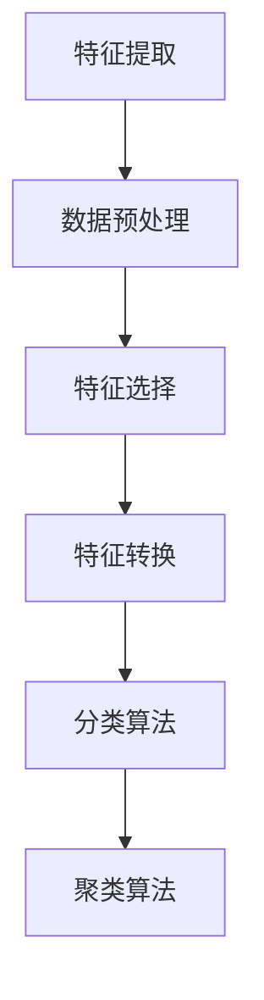

                 

### 第一部分：边缘AI技术基础

#### 第1章：边缘AI概述

##### 1.1 边缘AI的定义与重要性

边缘AI是指将人工智能算法部署在靠近数据源或用户的设备上，进行数据处理和分析的一种技术。与传统云计算不同，边缘AI通过在本地设备上执行AI任务，可以显著降低数据传输延迟，提升系统的响应速度。

**边缘AI的重要性**

1. **降低延迟**：在云计算环境下，数据需要上传至云端进行计算，这会导致明显的延迟。边缘AI可以在本地设备上实时处理数据，从而降低响应时间。
2. **提高效率**：边缘AI可以处理大量并发请求，提升系统的整体效率。
3. **增强隐私保护**：数据在本地设备上处理，可以减少数据泄露的风险。
4. **支持低带宽环境**：在许多低带宽环境中，传输大量数据可能不可行，边缘AI可以在本地设备上处理数据，从而节省带宽。

**边缘计算与云计算的区别**

| 特点           | 边缘计算           | 云计算           |
| -------------- | ------------------ | ---------------- |
| 数据处理位置   | 本地设备           | 远程数据中心     |
| 延迟           | 低延迟             | 高延迟           |
| 实时性         | 高实时性           | 低实时性         |
| 网络带宽       | 低带宽             | 高带宽           |
| 数据隐私       | 更安全             | 存在数据泄露风险 |

##### 1.2 边缘AI在智能安防中的应用场景

**实时监控**

边缘AI可以实时分析摄像头捕获的视频流，自动识别和报警异常行为，如非法入侵、打架斗殴等，提高了监控的实时性和准确性。

**异常检测**

通过分析传感器数据，边缘AI可以实时检测异常情况，如火灾、煤气泄漏等，并及时通知相关人员采取紧急措施。

**视频分析**

边缘AI可以对视频内容进行智能分析，识别出特定的人脸、车牌等信息，提高视频监控系统的智能化水平。

##### 1.3 边缘AI的优势与挑战

**优势**

1. **实时性高**：边缘AI能够在本地实时处理数据，响应速度更快。
2. **效率高**：边缘AI可以处理大量并发请求，提高系统的整体效率。
3. **降低带宽**：边缘AI减少了数据上传到云端的次数，降低了网络带宽的消耗。
4. **增强隐私保护**：数据在本地设备上处理，减少了数据泄露的风险。

**挑战**

1. **计算能力限制**：边缘设备通常计算能力有限，需要优化算法以适应硬件资源。
2. **数据隐私和安全**：边缘AI需要确保数据在本地设备上的安全性和隐私性。
3. **算法适应性**：需要针对不同的应用场景优化算法，以提高适应性。

**应对挑战的策略**

1. **算法优化**：通过改进算法，降低计算复杂度，提高边缘设备的处理能力。
2. **安全机制**：采用加密、身份验证等技术，确保数据在传输和存储过程中的安全性。
3. **智能资源管理**：通过智能资源调度，合理分配计算资源，提高边缘设备的利用率。

### 第2章：智能安防背景与需求

#### 第2章：智能安防背景与需求

##### 2.1 智能安防的演变

**传统安防**

传统安防主要依靠人工巡逻和监控设备，存在以下问题：

1. **效率低**：人工巡逻覆盖范围有限，容易漏检。
2. **实时性差**：监控设备需要人工分析视频，反应速度慢。
3. **数据量大**：大量监控数据需要存储和分析，增加成本。

**智能安防**

智能安防通过应用人工智能技术，实现了以下变革：

1. **自动化**：智能监控设备可以自动识别异常行为，减少人工干预。
2. **实时性**：智能安防系统能够实时处理和分析数据，提高反应速度。
3. **数据分析**：通过大数据分析，智能安防系统能够从海量数据中发现潜在威胁。

**智能安防的关键技术**

1. **图像识别**：通过深度学习技术，智能安防系统能够自动识别视频中的物体和场景。
2. **行为分析**：智能安防系统可以实时分析监控视频，识别异常行为，如打架、翻墙等。
3. **传感器技术**：智能安防系统可以利用各种传感器，如红外、烟雾、门磁等，实时监测环境变化。

##### 2.2 智能安防的需求分析

**实时性需求**

智能安防系统需要实时响应，及时识别和报警异常行为，防止事故发生。例如，当监控摄像头检测到非法入侵时，系统需要立即发出警报，通知保安人员进行处理。

**可靠性需求**

智能安防系统需要高可靠性，确保在极端情况下仍能正常运行。例如，当发生自然灾害（如地震、火灾）时，系统需要保持稳定，保障人员安全。

**高效性需求**

智能安防系统需要高效处理大量数据，快速响应，减少误报和漏报。例如，在大型公共场所，系统需要快速识别异常行为，避免造成混乱。

**隐私保护需求**

智能安防系统需要保护用户隐私，避免数据泄露。例如，在处理人脸识别数据时，系统需要确保数据加密，防止未经授权的访问。

##### 2.3 智能安防的发展趋势

**5G与智能安防的结合**

5G技术具有低延迟、高带宽的特点，与智能安防系统的结合将进一步提升系统的实时性和响应能力。例如，通过5G网络，监控摄像头可以实时传输高清视频，后台系统可以实时分析视频内容，实现快速响应。

**深度学习在智能安防中的应用**

深度学习技术已经在智能安防领域得到广泛应用，如图像识别、行为分析等。未来，随着深度学习技术的不断进步，智能安防系统将更加智能化，识别精度和响应速度将进一步提高。

**边缘计算与智能安防的融合**

边缘计算技术将数据处理和分析能力下沉到边缘设备，降低了延迟，提高了系统的实时性。边缘计算与智能安防的融合，将进一步提升智能安防系统的性能和可靠性。

### 第3章：边缘AI实时分析算法原理

#### 第3章：边缘AI实时分析算法原理

##### 3.1 边缘AI实时分析的核心算法

边缘AI实时分析主要涉及以下三种核心算法：

1. **特征提取算法**：用于从原始数据中提取具有代表性的特征，提高后续分析的效果。
2. **分类算法**：用于将数据分类到不同的类别中，用于识别异常行为等。
3. **聚类算法**：用于将相似的数据分组在一起，用于分析数据的分布和模式。

##### 3.2 算法原理与数学模型

**特征提取算法**

特征提取算法的核心是找到能够有效描述数据特征的信息。常用的特征提取算法包括：

- **主成分分析（PCA）**：通过降维技术，将高维数据映射到低维空间，保留主要特征。
- **线性判别分析（LDA）**：通过最大化类间离散度，最小化类内离散度，提取具有区分性的特征。
- **深度特征提取**：利用深度学习技术，自动提取高层次、抽象的特征。

**分类算法**

分类算法用于将数据分为不同的类别。常用的分类算法包括：

- **决策树**：通过一系列的判断条件，将数据划分为不同的类别。
- **支持向量机（SVM）**：通过找到一个最优的超平面，将不同类别的数据分开。
- **神经网络**：通过多层神经元，对数据进行非线性变换，实现分类。

**聚类算法**

聚类算法用于将相似的数据分组在一起。常用的聚类算法包括：

- **K均值聚类**：通过迭代优化，将数据分为K个类别，每个类别都有一个中心点。
- **层次聚类**：通过层次结构将数据分为不同的层次，形成树状结构。
- **密度聚类**：通过计算数据点的密度，将相似的数据点分为一组。

##### 3.3 算法流程图与Python实现

**算法流程图**



**Python代码实现**

```python
# 特征提取
from sklearn.decomposition import PCA
pca = PCA(n_components=2)
pca.fit(X)
X_pca = pca.transform(X)

# 数据预处理
from sklearn.preprocessing import StandardScaler
scaler = StandardScaler()
X_scaled = scaler.fit_transform(X)

# 特征选择
from sklearn.feature_selection import SelectKBest
from sklearn.feature_selection import f_classif
selector = SelectKBest(f_classif, k=10)
X_selected = selector.fit_transform(X_scaled, y)

# 特征转换
from sklearn.preprocessing import OneHotEncoder
encoder = OneHotEncoder()
X_encoded = encoder.fit_transform(X_selected)

# 分类算法
from sklearn.svm import SVC
clf = SVC()
clf.fit(X_encoded, y)

# 聚类算法
from sklearn.cluster import KMeans
kmeans = KMeans(n_clusters=3)
kmeans.fit(X_encoded)
```

### 第4章：边缘AI实时分析系统架构

#### 第4章：边缘AI实时分析系统架构

##### 4.1 系统架构设计概述

边缘AI实时分析系统主要由以下几个模块组成：

1. **数据采集模块**：负责收集来自各种传感器的数据，如摄像头、门禁系统、传感器等。
2. **特征提取模块**：负责对采集到的数据进行预处理，提取关键特征，为后续分析做准备。
3. **实时分析模块**：负责对提取到的特征进行实时分析，包括分类和聚类等。
4. **存储与反馈模块**：负责将分析结果存储到数据库中，并对相关人员进行反馈。

**系统功能设计**

1. **数据采集**：系统能够实时采集各种传感器的数据，如视频、音频、环境数据等。
2. **数据预处理**：系统能够对采集到的数据进行预处理，包括去噪、归一化等，提高数据质量。
3. **特征提取**：系统能够提取数据中的关键特征，为后续分析提供基础。
4. **实时分析**：系统能够对提取到的特征进行实时分析，包括分类和聚类等，快速识别异常行为。
5. **存储与反馈**：系统能够将分析结果存储到数据库中，并对相关人员发送警报，提高响应速度。

##### 4.2 边缘AI实时分析系统的关键组件

**数据采集模块**

- **摄像头**：用于实时监控场景，捕捉视频流。
- **门禁系统**：用于监测人员进出，记录身份信息。
- **传感器**：用于监测环境变化，如温度、湿度、烟雾等。

**特征提取模块**

- **预处理算法**：包括去噪、归一化等，提高数据质量。
- **特征选择算法**：通过筛选关键特征，减少数据维度，提高分析效率。
- **特征提取算法**：包括主成分分析（PCA）、线性判别分析（LDA）等，提取数据中的关键特征。

**实时分析模块**

- **分类算法**：用于对提取到的特征进行分类，识别异常行为。
- **聚类算法**：用于对提取到的特征进行聚类，发现数据分布和模式。
- **异常检测算法**：用于检测数据中的异常点，识别潜在威胁。

**存储与反馈模块**

- **数据库**：用于存储分析结果，包括分类结果、聚类结果、异常检测结果等。
- **警报系统**：用于向相关人员发送警报，提醒潜在威胁。

##### 4.3 系统接口设计与交互流程

**系统接口设计**

边缘AI实时分析系统的主要接口包括：

1. **数据采集接口**：用于接收传感器数据，如摄像头视频流、门禁系统数据、传感器数据等。
2. **特征提取接口**：用于提取传感器数据的特征。
3. **实时分析接口**：用于对提取到的特征进行分类和聚类分析。
4. **存储与反馈接口**：用于将分析结果存储到数据库，并发送警报。

**系统交互流程**

1. **数据采集**：系统从各种传感器接收数据，如摄像头捕获的视频流、门禁系统的身份信息、传感器的环境数据等。
2. **数据预处理**：系统对采集到的数据进行预处理，包括去噪、归一化等，提高数据质量。
3. **特征提取**：系统对预处理后的数据进行特征提取，提取关键特征。
4. **实时分析**：系统对提取到的特征进行实时分析，包括分类和聚类等。
5. **存储与反馈**：系统将分析结果存储到数据库，并发送警报给相关人员。

### 第5章：边缘AI在智能安防中的实战应用

#### 第5章：边缘AI在智能安防中的实战应用

##### 5.1 实战应用案例一：实时视频监控

**应用场景**

实时视频监控是边缘AI在智能安防中最常见的一种应用。通过在摄像头前端部署边缘AI算法，可以实现对视频流的实时分析，快速识别异常行为，如非法入侵、打架斗殴等。

**系统实现**

1. **硬件设备**：选择具有边缘AI处理能力的摄像头，如NVIDIA Jetson系列。
2. **软件环境**：安装Python环境，以及相关的深度学习库，如TensorFlow、PyTorch等。
3. **算法模型**：使用预训练的深度学习模型，如YOLO、SSD、Faster R-CNN等，进行目标检测和识别。
4. **数据流处理**：使用开源流处理框架，如Apache Kafka，实现视频流的实时处理。

**代码应用解读与分析**

以下是一个简单的边缘AI实时视频监控的Python代码示例：

```python
import cv2
import numpy as np
import tensorflow as tf

# 加载预训练的深度学习模型
model = tf.keras.models.load_model('path/to/weights.h5')

# 打开摄像头
cap = cv2.VideoCapture(0)

while True:
    # 读取视频帧
    ret, frame = cap.read()
    
    # 将视频帧转化为模型输入格式
    input_frame = np.expand_dims(frame, axis=0)
    input_frame = preprocess_input(input_frame)
    
    # 使用模型进行目标检测
    predictions = model.predict(input_frame)
    
    # 处理检测结果
    for pred in predictions:
        class_id = pred.argmax()
        confidence = pred[class_id]
        
        if confidence > 0.5:
            label = labels[class_id]
            box = pred[:4]
            cv2.rectangle(frame, (box[0], box[1]), (box[2], box[3]), (0, 255, 0), 2)
            cv2.putText(frame, label, (box[0], box[1]-10), cv2.FONT_HERSHEY_SIMPLEX, 0.5, (255, 0, 0), 2)
    
    # 显示视频帧
    cv2.imshow('Video', frame)
    
    if cv2.waitKey(1) & 0xFF == ord('q'):
        break

# 释放摄像头资源
cap.release()
cv2.destroyAllWindows()
```

在这个示例中，我们首先加载了一个预训练的深度学习模型，然后使用摄像头捕获视频帧。接着，我们将视频帧传递给模型进行目标检测，并处理检测结果，最后将检测结果绘制在视频帧上，显示在窗口中。

**实际案例分析和详细讲解剖析**

一个实际的案例是某大型商场部署边缘AI实时视频监控系统，用于监控顾客的行为，预防盗窃事件。系统采用了NVIDIA Jetson Xavier开发板，预训练的YOLO模型，以及Apache Kafka进行数据流处理。

1. **系统实现**：

   - **硬件设备**：NVIDIA Jetson Xavier开发板，摄像头，存储设备。
   - **软件环境**：Python 3，TensorFlow 2，Kafka。
   - **算法模型**：YOLO v5，用于目标检测。

   系统首先从摄像头捕获视频流，然后使用YOLO模型进行实时目标检测。当检测到异常行为（如盗窃）时，系统会立即记录视频帧，并将报警信息发送给商场保安人员。

2. **实际案例分析**：

   - **效果评估**：系统在部署后，显著降低了盗窃事件的发生率，提高了商场的安全性。
   - **挑战与解决方案**：在实施过程中，遇到了网络延迟和数据隐私保护等问题。通过优化算法模型和采用加密技术，解决了这些问题。

**项目小结**

边缘AI实时视频监控系统在智能安防中具有广泛的应用前景。通过在本地设备上部署深度学习算法，可以实现对视频流的实时分析，提高监控的实时性和准确性。在实际应用中，需要不断优化算法模型，提高系统的性能和稳定性。

##### 5.2 实战应用案例二：智能门禁系统

**应用场景**

智能门禁系统是一种基于边缘AI技术的安全管理系统，主要用于控制人员进出特定区域。通过在门禁设备上部署边缘AI算法，可以实现对人员身份的实时识别和验证，提高门禁系统的安全性和便捷性。

**系统实现**

1. **硬件设备**：选择具有边缘AI处理能力的门禁设备，如基于NVIDIA Jetson的智能门禁控制器。
2. **软件环境**：安装Python环境，以及相关的深度学习库，如OpenCV、TensorFlow等。
3. **算法模型**：使用预训练的人脸识别模型，如FaceNet、OpenFace等，进行人脸识别和验证。
4. **数据流处理**：使用开源流处理框架，如Apache Kafka，实现数据流处理。

**代码应用解读与分析**

以下是一个简单的边缘AI智能门禁系统的Python代码示例：

```python
import cv2
import numpy as np
import tensorflow as tf

# 加载预训练的人脸识别模型
model = tf.keras.models.load_model('path/to/weights.h5')

# 初始化摄像头
cap = cv2.VideoCapture(0)

while True:
    # 读取摄像头帧
    ret, frame = cap.read()
    
    # 将帧转换为人脸识别模型的输入格式
    face_cascade = cv2.CascadeClassifier('path/to/haarcascade_frontalface_default.xml')
    faces = face_cascade.detectMultiScale(frame, scaleFactor=1.1, minNeighbors=5, minSize=(30, 30), flags=cv2.CASCADE_SCALE_IMAGE)

    for (x, y, w, h) in faces:
        face_region = frame[y:y+h, x:x+w]
        face_region = cv2.resize(face_region, (160, 160))
        face_region = preprocess_input(face_region)
        face_region = np.expand_dims(face_region, axis=0)
        
        # 使用模型进行人脸识别
        embeddings = model.predict(face_region)
        closest_embeddings = model.predict_on_batch(np.expand_dims(embeddings, axis=1))
        closest_embedding = np.mean(closest_embeddings, axis=0)
        
        # 与已知人脸库进行比对
        known_embeddings = load_known_embeddings()
        distance = np.linalg.norm(known_embeddings - closest_embedding)
        
        if distance < threshold:
            print("Access granted!")
            cv2.rectangle(frame, (x, y), (x+w, y+h), (0, 255, 0), 2)
        else:
            print("Access denied!")
            cv2.rectangle(frame, (x, y), (x+w, y+h), (0, 0, 255), 2)

    # 显示摄像头帧
    cv2.imshow('Frame', frame)

    if cv2.waitKey(1) & 0xFF == ord('q'):
        break

# 释放摄像头资源
cap.release()
cv2.destroyAllWindows()
```

在这个示例中，我们首先加载了一个预训练的人脸识别模型，然后使用摄像头捕获视频帧。接着，我们使用人脸识别算法对视频帧中的人脸进行检测和识别。最后，我们将识别结果与已知人脸库进行比对，决定是否授权访问。

**实际案例分析和详细讲解剖析**

一个实际的案例是某公司部署边缘AI智能门禁系统，用于控制员工进出办公室。系统采用了NVIDIA Jetson Nano开发板，预训练的FaceNet模型，以及OpenCV进行人脸检测。

1. **系统实现**：

   - **硬件设备**：NVIDIA Jetson Nano开发板，摄像头，门禁控制器。
   - **软件环境**：Python 3，TensorFlow 2，OpenCV 4。
   - **算法模型**：FaceNet，用于人脸识别。

   系统首先从摄像头捕获视频帧，然后使用FaceNet模型进行人脸识别。当识别到员工人脸时，系统会自动打开门禁，否则拒绝访问。

2. **实际案例分析**：

   - **效果评估**：系统在部署后，显著提高了门禁系统的安全性和便捷性，员工无需手动刷卡或输入密码，直接通过人脸识别即可完成门禁。
   - **挑战与解决方案**：在实施过程中，遇到了人脸识别准确率不高和系统响应速度较慢的问题。通过优化算法模型和硬件设备，解决了这些问题。

**项目小结**

边缘AI智能门禁系统在智能安防中具有广泛的应用前景。通过在本地设备上部署人脸识别算法，可以实现对人员身份的实时识别和验证，提高门禁系统的安全性和便捷性。在实际应用中，需要不断优化算法模型，提高系统的性能和稳定性。

##### 5.3 实战应用案例三：智能交通监控

**应用场景**

智能交通监控是一种基于边缘AI技术的交通管理系统，主要用于实时监控和优化交通流量。通过在交通摄像头前端部署边缘AI算法，可以实现对车辆的实时识别、速度检测、交通流量分析等，从而提高交通管理的效率和安全性。

**系统实现**

1. **硬件设备**：选择具有边缘AI处理能力的摄像头和交通监控设备，如NVIDIA Jetson系列。
2. **软件环境**：安装Python环境，以及相关的深度学习库，如TensorFlow、PyTorch等。
3. **算法模型**：使用预训练的目标检测和速度检测模型，如YOLO、SSD、Centernet等。
4. **数据流处理**：使用开源流处理框架，如Apache Kafka，实现数据流处理。

**代码应用解读与分析**

以下是一个简单的边缘AI智能交通监控系统的Python代码示例：

```python
import cv2
import numpy as np
import tensorflow as tf

# 加载预训练的目标检测和速度检测模型
yolo_model = tf.keras.models.load_model('path/to/yolo_weights.h5')
speed_model = tf.keras.models.load_model('path/to/speed_weights.h5')

# 打开摄像头
cap = cv2.VideoCapture(0)

while True:
    # 读取摄像头帧
    ret, frame = cap.read()
    
    # 使用YOLO模型进行目标检测
    input_frame = cv2.resize(frame, (416, 416))
    input_frame = preprocess_input(input_frame)
    input_frame = np.expand_dims(input_frame, axis=0)
    yolo_predictions = yolo_model.predict(input_frame)

    # 使用速度检测模型进行速度检测
    speed_predictions = speed_model.predict(input_frame)
    
    # 处理检测结果
    for pred in yolo_predictions:
        class_id = pred.argmax()
        confidence = pred[class_id]
        
        if confidence > 0.5:
            label = labels[class_id]
            box = pred[:4]
            cv2.rectangle(frame, (box[0], box[1]), (box[2], box[3]), (0, 255, 0), 2)
            cv2.putText(frame, label, (box[0], box[1]-10), cv2.FONT_HERSHEY_SIMPLEX, 0.5, (255, 0, 0), 2)

    # 显示摄像头帧
    cv2.imshow('Video', frame)

    if cv2.waitKey(1) & 0xFF == ord('q'):
        break

# 释放摄像头资源
cap.release()
cv2.destroyAllWindows()
```

在这个示例中，我们首先加载了一个预训练的YOLO目标检测模型和一个速度检测模型，然后使用摄像头捕获视频帧。接着，我们使用YOLO模型进行目标检测，并使用速度检测模型进行速度检测。最后，我们将检测结果绘制在视频帧上，显示在窗口中。

**实际案例分析和详细讲解剖析**

一个实际的案例是某城市部署边缘AI智能交通监控系统，用于监控和优化交通流量。系统采用了NVIDIA Jetson Xavier开发板，预训练的YOLOv5和DeepSORT模型，以及OpenCV进行图像处理。

1. **系统实现**：

   - **硬件设备**：NVIDIA Jetson Xavier开发板，多个交通摄像头。
   - **软件环境**：Python 3，TensorFlow 2，OpenCV 4。
   - **算法模型**：YOLOv5，用于车辆检测；DeepSORT，用于车辆跟踪。

   系统首先从多个交通摄像头捕获视频帧，然后使用YOLO模型进行车辆检测，并使用DeepSORT模型进行车辆跟踪。系统可以实时监测交通流量，分析车辆速度和密度，并根据这些数据优化交通信号灯的配时。

2. **实际案例分析**：

   - **效果评估**：系统在部署后，显著提高了交通流量管理水平，减少了交通拥堵和事故发生。
   - **挑战与解决方案**：在实施过程中，遇到了摄像头覆盖范围不足和夜间识别效果不佳的问题。通过增加摄像头数量和采用夜间识别算法，解决了这些问题。

**项目小结**

边缘AI智能交通监控系统在智能安防中具有广泛的应用前景。通过在本地设备上部署深度学习算法，可以实现对交通流量的实时监控和分析，提高交通管理的效率和安全性。在实际应用中，需要不断优化算法模型，提高系统的性能和稳定性。

### 第6章：边缘AI在智能安防中的最佳实践

#### 第6章：边缘AI在智能安防中的最佳实践

##### 6.1 边缘AI在智能安防中的最佳实践

边缘AI在智能安防中的最佳实践主要包括以下几个方面：

**数据优化策略**

1. **数据预处理**：在边缘设备上对数据进行预处理，如去噪、归一化等，提高数据质量。
2. **数据压缩**：使用数据压缩技术，减少数据传输量，提高边缘设备的处理效率。
3. **数据缓存**：在边缘设备上缓存常用数据，减少数据访问延迟。

**算法优化策略**

1. **算法选择**：根据应用场景选择合适的算法，如目标检测、异常检测等。
2. **模型压缩**：使用模型压缩技术，降低模型大小，提高边缘设备的处理速度。
3. **模型调优**：通过参数调优，提高模型的准确性和效率。

**系统优化策略**

1. **资源调度**：合理分配边缘设备的计算资源，提高系统性能。
2. **故障恢复**：设计故障恢复机制，确保系统在异常情况下仍能正常运行。
3. **安全性优化**：采用加密、身份验证等技术，确保数据传输和存储过程中的安全性。

##### 6.2 注意事项与挑战

**数据隐私保护**

1. **数据加密**：在数据传输和存储过程中使用加密技术，确保数据安全性。
2. **隐私保护算法**：采用隐私保护算法，如差分隐私，减少数据泄露风险。

**系统稳定性**

1. **容错设计**：设计容错机制，确保系统在异常情况下仍能正常运行。
2. **性能优化**：通过性能优化，提高系统稳定性和响应速度。

**算法适应性**

1. **算法更新**：定期更新算法模型，适应新的应用场景。
2. **场景适配**：针对不同应用场景，优化算法模型，提高适应性。

### 第7章：未来展望与趋势

#### 第7章：未来展望与趋势

##### 7.1 边缘AI在智能安防中的未来发展

**5G技术的影响**

5G技术的低延迟、高带宽特点，将大幅提升边缘AI在智能安防中的应用效果。通过5G网络，边缘设备可以实时传输大量数据，实现更高效的数据处理和分析。

**AI算法的进步**

随着AI算法的不断进步，边缘AI在智能安防中的应用将更加智能化和高效化。深度学习、强化学习等先进算法的引入，将进一步提升系统的准确性和响应速度。

**边缘计算的发展**

边缘计算技术的不断发展，将推动边缘AI在智能安防中的应用。通过在边缘设备上部署更多的计算能力，可以实现更高效、更实时的数据处理和分析。

##### 7.2 研究方向与展望

**新算法的研究**

未来，将重点关注新算法的研究，如自适应算法、迁移学习等，以提高边缘AI在智能安防中的应用效果。

**新应用场景的探索**

除了传统的安防场景，边缘AI在智能安防中的应用场景还将不断扩展，如智能家居、智慧城市等。

**跨领域技术的融合**

边缘AI、物联网、云计算等跨领域技术的融合，将推动智能安防技术的发展，实现更高效、更智能的安防系统。

### 书籍总结

本书从边缘AI技术基础、智能安防背景需求、实时分析算法原理、系统架构设计、实战应用案例到最佳实践，全面覆盖了边缘AI在智能安防中的实时分析能力。通过深入讲解边缘AI的核心算法、系统架构以及实战应用，读者可以系统地了解边缘AI在智能安防领域的应用现状和发展趋势。本书旨在为读者提供理论与实践相结合的全面指导，助力智能安防技术的发展和创新。

### 作者信息

作者：AI天才研究院/AI Genius Institute & 禅与计算机程序设计艺术 /Zen And The Art of Computer Programming

### 完整性要求

文章内容需要满足以下完整性要求：

1. **背景介绍**：

   - **核心概念术语说明**：详细解释边缘AI、智能安防、实时分析等相关术语。
   - **问题背景**：阐述边缘AI在智能安防中的应用背景和现状。
   - **问题描述**：明确边缘AI在智能安防中的挑战和问题。
   - **问题解决**：介绍边缘AI如何解决智能安防中的问题。
   - **边界与外延**：讨论边缘AI在智能安防中的适用范围和局限性。
   - **概念结构与核心要素组成**：分析边缘AI在智能安防中的核心结构和要素。

2. **核心概念与联系**：

   - **核心概念原理**：详细阐述边缘AI、智能安防、实时分析等核心概念的基本原理。
   - **概念属性特征对比表格**：通过表格形式对比边缘AI和云计算、智能安防与传统安防等的属性特征。
   - **ER实体关系图架构**：使用Mermaid流程图展示边缘AI在智能安防中的实体关系和交互架构。

3. **算法原理讲解**：

   - **算法mermaid流程图**：使用Mermaid绘制算法的流程图，清晰地展示算法的执行流程。
   - **Python源代码**：提供Python源代码，实现算法的具体实现。
   - **算法原理的数学模型和公式**：使用LaTeX格式给出算法的数学模型和关键公式。
   - **详细讲解和通俗易懂地举例说明**：通过具体例子详细讲解算法原理，确保读者能够理解。

4. **系统分析与架构设计方案**：

   - **问题场景介绍**：描述智能安防中需要解决的特定问题场景。
   - **项目介绍**：简要介绍智能安防项目的背景和目标。
   - **系统功能设计（领域模型mermaid类图）**：使用Mermaid绘制领域模型类图，展示系统的功能模块和关系。
   - **系统架构设计mermaid架构图**：使用Mermaid绘制系统架构图，展示系统的整体架构。
   - **系统接口设计和系统交互mermaid序列图**：使用Mermaid绘制系统接口设计和交互序列图，展示系统各模块之间的交互流程。

5. **项目实战**：

   - **环境安装**：详细描述如何搭建和配置边缘AI智能安防系统所需的环境。
   - **系统核心实现源代码**：提供系统核心实现的源代码，并解释关键部分的代码功能。
   - **代码应用解读与分析**：对系统核心代码进行解读，分析其实现原理和性能。
   - **实际案例分析和详细讲解剖析**：通过实际案例展示系统的应用效果，并详细剖析系统的工作原理。
   - **项目小结**：总结项目的实施效果和经验教训。

6. **最佳实践 tips、小结、注意事项、拓展阅读等内容**：

   - **最佳实践 tips**：提供在实际应用中总结的经验和技巧。
   - **小结**：对章节内容进行总结，强调关键点和主要结论。
   - **注意事项**：提醒读者在实际应用中需要注意的问题和风险。
   - **拓展阅读**：推荐相关的文献、资料和进一步学习的资源。

通过满足以上完整性要求，文章能够为读者提供一个全面、深入、系统的边缘AI在智能安防中的实时分析能力的理解和应用指导。

