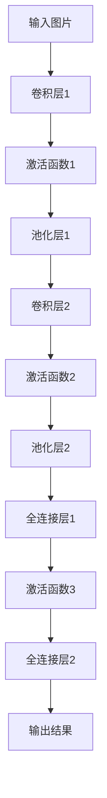
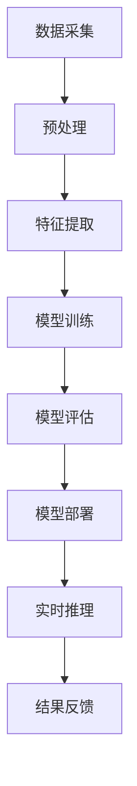
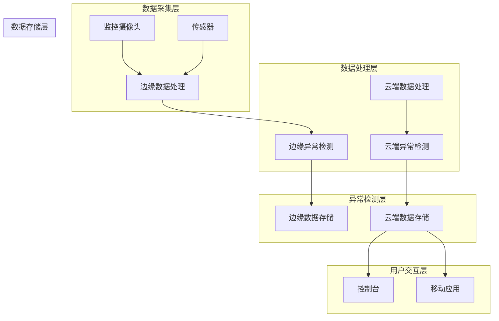
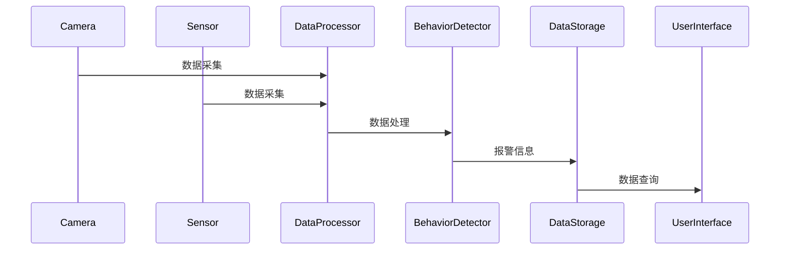
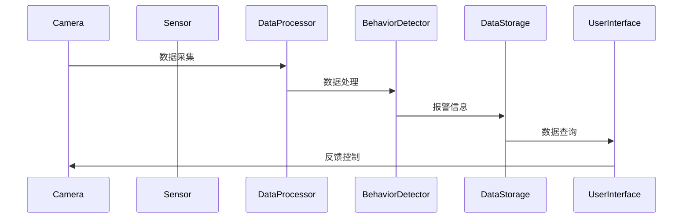

                 

### 边缘AI在智能安防系统中的实时分析

> 关键词：边缘AI、智能安防、实时分析、深度学习、数据处理、算法优化

> 摘要：本文将深入探讨边缘AI在智能安防系统中的实时分析应用。首先，我们将简要介绍边缘AI的基本概念及其在智能安防系统中的需求背景。接着，我们将详细分析边缘AI的核心技术，包括边缘计算、深度学习和人工智能算法。随后，我们将讲解边缘AI与云计算的关系，并对比边缘计算与云计算的差异。接着，我们将使用mermaid流程图和Python源代码详细讲解边缘AI算法原理。然后，我们将介绍智能安防系统设计与实现的具体步骤，包括系统功能设计、系统架构设计和系统接口设计等。最后，我们将通过实际案例分析，展示边缘AI在智能安防系统中的实战应用和性能优化方法，并提出未来展望。

### 第一部分：背景介绍

#### 第1章：边缘AI与智能安防概述

##### 1.1 边缘AI的基本概念

边缘AI，即Edge AI，是指将人工智能计算能力从中心化的云服务器转移到网络边缘设备上。这些设备可以是智能手机、路由器、嵌入式系统、工业机器人等。边缘AI的核心目标是减少数据传输延迟，提高数据处理效率，并增强系统的自主决策能力。

边缘AI的发展历程可以追溯到物联网（IoT）和移动计算的兴起。随着5G网络的普及，边缘AI的应用场景变得愈加广泛。在智能安防系统中，边缘AI的作用尤为重要，它可以实现对视频流、音频信号和其他传感器数据的实时处理与分析，从而提高安防系统的响应速度和准确性。

##### 1.2 智能安防系统的需求背景

传统安防系统主要依赖于监控摄像头和报警设备，但这些系统的处理能力有限，往往无法满足现代安防需求。随着犯罪活动的日益复杂化，智能安防系统应运而生。智能安防系统利用先进的人工智能技术，如计算机视觉、语音识别、机器学习等，实现更高水平的监控和预警。

智能安防系统的兴起，带来了对边缘AI的强烈需求。传统安防系统中的大部分数据处理都需要在中心化的云服务器上进行，这导致了以下问题：

1. **延迟问题**：当数据需要从边缘设备传输到云端进行处理时，传输延迟会显著增加，影响系统的实时响应能力。
2. **带宽问题**：大量的视频流和传感器数据传输到云端，会导致网络带宽的巨大压力。
3. **隐私问题**：敏感数据的传输和存储在云端可能引发隐私泄露风险。

边缘AI的出现，解决了上述问题，使得智能安防系统能够在本地设备上进行实时数据处理，提高系统的响应速度和安全性。

##### 1.3 边缘AI在智能安防系统中的应用前景

当前，边缘AI在智能安防系统中的应用已经取得显著成果。例如，利用边缘AI的计算机视觉技术，可以实现实时人脸识别、车辆识别和异常行为检测等功能。这些功能在安防监控、交通管理、公共场所监控等领域具有广泛的应用前景。

未来，随着边缘AI技术的不断进步，智能安防系统的功能将更加多样化。例如，边缘AI可以结合物联网技术，实现对环境因素的实时监测，如烟雾、温度、湿度等，为灾害预警和应急管理提供支持。

此外，边缘AI还可以与人工智能算法相结合，实现更加智能化的决策支持。例如，通过机器学习算法，可以自动识别高风险区域和目标，提高安防系统的精准度和效率。

总之，边缘AI在智能安防系统中的应用前景广阔，它将不断推动智能安防技术的发展，为人们的安全生活提供更加坚实的保障。

##### 1.4 边缘AI的关键技术

边缘AI的实现依赖于一系列关键技术的支持，包括边缘计算、深度学习和人工智能算法等。

**边缘计算**：边缘计算是一种分布式计算模式，它将数据处理、存储和计算任务分散到网络边缘设备上，从而减少数据传输和处理的延迟。边缘计算可以显著提高系统的实时响应能力，是边缘AI的重要支撑技术。

**深度学习**：深度学习是一种基于人工神经网络的机器学习技术，它通过多层神经网络模型对大量数据进行训练，从而实现对复杂模式的自动识别和预测。深度学习在图像识别、语音识别等领域具有卓越的性能，是边缘AI的核心技术之一。

**人工智能算法**：人工智能算法包括多种类型，如机器学习、强化学习等。这些算法可以用于数据分析和决策支持，是实现智能安防系统的关键技术。

##### 1.5 本章小结

本章介绍了边缘AI的基本概念、发展历程以及在智能安防系统中的需求背景和应用前景。同时，我们探讨了边缘AI的关键技术，包括边缘计算、深度学习和人工智能算法。这些技术共同构成了边缘AI的基础，为智能安防系统的发展提供了强大支持。在接下来的章节中，我们将深入分析边缘AI的核心概念和联系，以及其算法原理和系统设计与实现。

---

### 第二部分：核心概念与联系

#### 第2章：边缘AI核心概念与联系

##### 2.1 边缘计算原理

边缘计算是一种分布式计算模式，它将数据处理、存储和计算任务从中心化的云服务器转移到网络边缘设备上。边缘计算的关键特性包括：

1. **本地化处理**：边缘计算可以在数据产生的地方（即网络边缘）直接进行处理，从而减少数据传输延迟。
2. **实时响应**：由于数据处理在本地进行，边缘计算可以提供更快速的响应时间，满足实时应用的需求。
3. **减少带宽消耗**：边缘计算可以减少需要传输到云端的原始数据量，从而降低网络带宽消耗。
4. **提高安全性**：边缘计算可以降低数据泄露的风险，因为敏感数据不需要传输到云端。

边缘计算的应用场景包括但不限于：

1. **智能交通**：通过边缘计算，可以实时处理车辆传感器数据，优化交通流量，减少拥堵。
2. **智能医疗**：边缘计算可以实现实时医疗监控，如远程手术指导、健康数据实时分析等。
3. **智能安防**：边缘AI结合边缘计算，可以实现视频监控的实时分析，如人脸识别、异常行为检测等。

##### 2.2 深度学习与边缘AI

深度学习是一种基于人工神经网络的机器学习技术，它通过多层神经网络模型对大量数据进行训练，从而实现对复杂模式的自动识别和预测。深度学习在图像识别、语音识别、自然语言处理等领域具有卓越的性能。

在边缘AI中，深度学习被广泛应用于实时数据处理和分析。深度学习与边缘AI的结合，主要表现在以下几个方面：

1. **本地化训练**：由于数据隐私和带宽限制，部分深度学习模型需要在边缘设备上进行本地化训练，而不是在云端。
2. **模型压缩**：为了适应边缘设备的计算能力和存储限制，深度学习模型需要进行压缩，如剪枝、量化等。
3. **实时推理**：深度学习模型需要在边缘设备上进行实时推理，以实现对视频流、传感器数据的实时分析。

边缘AI对深度学习的优化主要包括以下几个方面：

1. **模型优化**：通过模型压缩、蒸馏等方法，将复杂的深度学习模型转化为适用于边缘设备的简化模型。
2. **硬件优化**：通过硬件加速，如GPU、FPGA等，提高深度学习模型的推理速度。
3. **算法优化**：通过分布式计算、异步执行等方法，提高深度学习模型在边缘设备上的运行效率。

##### 2.3 人工智能算法在边缘AI中的应用

人工智能算法在边缘AI中扮演着重要角色，主要包括以下几种类型：

1. **机器学习算法**：机器学习算法可以在边缘设备上对本地数据进行分析和建模，如线性回归、支持向量机（SVM）等。
2. **深度学习算法**：深度学习算法在图像识别、语音识别等领域具有广泛的应用，如卷积神经网络（CNN）、循环神经网络（RNN）等。
3. **强化学习算法**：强化学习算法可以用于自主决策和优化，如智能交通信号控制、机器人路径规划等。

在边缘AI中，人工智能算法的应用主要集中在以下几个方面：

1. **实时数据分类**：通过对传感器数据进行实时分类，可以实现对异常事件的快速响应。
2. **异常行为检测**：利用机器学习和深度学习算法，可以实现对视频流中的异常行为进行实时检测。
3. **自动化决策**：通过强化学习算法，可以实现对复杂决策过程的自动化，如智能交通信号控制。

##### 2.4 边缘AI与云计算的关系

边缘AI与云计算是两种互补的技术，它们共同构成了现代智能系统的基础架构。

**云计算**：云计算是一种基于互联网的计算模式，它将计算资源（如服务器、存储、网络）集中起来，通过虚拟化技术提供动态资源分配和管理。云计算的主要优势包括：

1. **弹性扩展**：可以根据需求动态调整计算资源，实现高效资源利用。
2. **高可用性**：通过分布式架构，实现高可用性和容错能力。
3. **灵活性**：可以支持多样化的应用场景，如大数据处理、企业应用等。

**边缘AI**：边缘AI则侧重于在数据产生的地方进行实时数据处理和决策，其主要优势包括：

1. **低延迟**：数据在本地处理，显著降低延迟。
2. **高安全性**：敏感数据在本地处理，降低数据泄露风险。
3. **高效性**：适合处理大量实时数据，提高系统响应速度。

边缘AI与云计算的关系可以概括为：

1. **协同工作**：边缘AI和云计算可以协同工作，实现最优的资源利用和性能优化。
2. **互补优势**：边缘AI擅长处理实时数据和本地决策，云计算擅长处理大规模数据和高性能计算。
3. **优化成本**：通过结合边缘AI和云计算，可以实现最优的成本效益比。

##### 2.5 边缘AI核心概念对比表格

| 核心概念 | 定义 | 特点 | 应用场景 |
| --- | --- | --- | --- |
| 边缘计算 | 在网络边缘进行数据处理、存储和计算 | 低延迟、高安全性、高效性 | 智能交通、智能医疗、智能安防 |
| 深度学习 | 基于人工神经网络的机器学习技术 | 自动识别复杂模式、高准确性 | 图像识别、语音识别、自然语言处理 |
| 人工智能算法 | 用于数据分析和决策支持的技术 | 实时数据分类、异常行为检测、自动化决策 | 边缘AI、云计算、大数据处理 |

##### 2.6 边缘AI的ER实体关系图

边缘AI的ER实体关系图主要包含以下几个实体：

1. **边缘设备**：包括传感器、智能手机、路由器等，用于数据采集和处理。
2. **数据处理模块**：包括边缘计算、深度学习模块，用于本地数据处理和决策。
3. **云计算平台**：用于存储和管理数据，提供远程计算资源。
4. **用户终端**：包括用户设备、控制台等，用于接收和处理结果。

实体关系图如下：

```mermaid
erDiagram
    EDGEDEVICE ||--|{ DATA_PROCESSING_MODULE : processes }
    DATA_PROCESSING_MODULE ||--|{ CLOUD_PLATFORM : stores }
    CLOUD_PLATFORM ||--|{ USER_TERMINAL : provides }
```

##### 2.7 本章小结

本章深入探讨了边缘AI的核心概念及其在智能安防系统中的应用。我们详细介绍了边缘计算原理、深度学习与边缘AI的结合、人工智能算法在边缘AI中的应用，以及边缘AI与云计算的关系。通过mermaid流程图和ER实体关系图，我们更加清晰地理解了边缘AI的工作原理和架构。在接下来的章节中，我们将进一步讲解边缘AI的算法原理和系统设计与实现。

---

### 第三部分：算法原理讲解

#### 第3章：边缘AI算法原理讲解

##### 3.1 边缘AI算法概述

边缘AI算法是指用于边缘设备上执行数据分析和决策的算法集合。这些算法需要满足低延迟、高效率和适应性强等要求，以适应边缘设备有限的计算资源和带宽。边缘AI算法主要包括以下几种类型：

1. **机器学习算法**：如线性回归、决策树、支持向量机等，适用于对本地数据进行建模和分析。
2. **深度学习算法**：如卷积神经网络（CNN）、循环神经网络（RNN）、长短期记忆网络（LSTM）等，适用于处理复杂的图像和时序数据。
3. **强化学习算法**：如Q学习、深度Q网络（DQN）、策略梯度算法等，适用于自主决策和优化问题。

选择边缘AI算法时，需要考虑以下因素：

1. **数据特性**：数据类型、数据量、数据分布等，决定了算法的选择。
2. **计算资源**：边缘设备的计算能力、存储能力、能耗等，影响算法的实现和优化。
3. **实时性要求**：算法的响应速度和延迟要求，决定了算法的适用性。

##### 3.2 深度学习算法原理

深度学习算法是边缘AI的重要组成部分，它通过多层神经网络模型对大量数据进行训练，以实现对复杂模式的自动识别和预测。深度学习算法主要包括以下几种类型：

1. **神经网络（Neural Networks）**：神经网络是由大量人工神经元组成的计算模型，通过前向传播和反向传播算法进行训练。神经网络可以用于分类、回归、聚类等多种任务。

2. **卷积神经网络（Convolutional Neural Networks, CNN）**：卷积神经网络是一种特殊类型的神经网络，主要用于处理图像数据。CNN通过卷积操作和池化操作提取图像特征，从而实现图像分类和识别。

3. **循环神经网络（Recurrent Neural Networks, RNN）**：循环神经网络是一种用于处理序列数据的神经网络，其内部存在反馈循环，可以记住之前的信息。RNN适用于语音识别、语言模型、时间序列预测等任务。

4. **长短期记忆网络（Long Short-Term Memory, LSTM）**：长短期记忆网络是RNN的一种改进，它通过引入门控机制，解决了传统RNN的长期依赖问题。LSTM适用于处理长序列数据，如语音识别、机器翻译等。

以下是一个简单的卷积神经网络（CNN）的mermaid流程图：



##### 3.3 算法mermaid流程图

为了更好地理解边缘AI算法的工作流程，我们可以使用mermaid绘制算法的流程图。以下是一个简单的边缘AI算法流程图：



##### 3.4 Python源代码实现

边缘AI算法的Python源代码实现通常包括数据预处理、模型训练和模型推理等步骤。以下是一个简单的边缘AI算法实现示例：

```python
import numpy as np
from sklearn.model_selection import train_test_split
from sklearn.preprocessing import StandardScaler
from keras.models import Sequential
from keras.layers import Dense, Conv2D, MaxPooling2D, Flatten
from keras.optimizers import Adam

# 数据预处理
X, y = load_data()  # 假设已加载数据集
X_train, X_test, y_train, y_test = train_test_split(X, y, test_size=0.2, random_state=42)

scaler = StandardScaler()
X_train = scaler.fit_transform(X_train)
X_test = scaler.transform(X_test)

# 模型训练
model = Sequential()
model.add(Conv2D(32, (3, 3), activation='relu', input_shape=(64, 64, 3)))
model.add(MaxPooling2D(pool_size=(2, 2)))
model.add(Flatten())
model.add(Dense(64, activation='relu'))
model.add(Dense(1, activation='sigmoid'))

model.compile(optimizer=Adam(), loss='binary_crossentropy', metrics=['accuracy'])
model.fit(X_train, y_train, epochs=10, batch_size=32)

# 模型评估
loss, accuracy = model.evaluate(X_test, y_test)
print(f"Test accuracy: {accuracy * 100:.2f}%")

# 实时推理
data = preprocess_new_data()  # 假设已预处理新数据
predictions = model.predict(data)
print(f"Predictions: {predictions}")
```

##### 3.5 数学模型与公式讲解

边缘AI算法的实现依赖于一系列数学模型和公式。以下是一些常用的数学模型和公式：

1. **卷积运算**：

   $$ f(x,y) = \sum_{i=1}^{m} \sum_{j=1}^{n} w_{ij} * g_{i,j} + b $$

   其中，$f(x,y)$ 是卷积结果，$w_{ij}$ 是卷积核权重，$g_{i,j}$ 是输入特征图上的像素值，$b$ 是偏置项。

2. **反向传播**：

   $$ \delta_{ij} = \frac{\partial L}{\partial z_{ij}} = -\frac{\partial L}{\partial y_{i}} \cdot \frac{\partial z_{ij}}{\partial y_{i}} $$

   其中，$\delta_{ij}$ 是误差项，$L$ 是损失函数，$z_{ij}$ 是神经元的输出，$y_{i}$ 是真实标签。

3. **反向传播更新权重**：

   $$ w_{ij}^{new} = w_{ij}^{old} - \alpha \cdot \frac{\partial L}{\partial w_{ij}} $$

   其中，$w_{ij}^{new}$ 是更新后的权重，$w_{ij}^{old}$ 是当前权重，$\alpha$ 是学习率。

以下是一个简单的数学模型示例：

$$ y = \sigma(\sum_{i=1}^{n} w_{i} \cdot x_{i} + b) $$

其中，$y$ 是输出，$\sigma$ 是激活函数（例如Sigmoid函数），$w_{i}$ 是权重，$x_{i}$ 是输入特征，$b$ 是偏置项。

##### 3.6 本章小结

本章详细介绍了边缘AI算法的概述、深度学习算法原理、算法mermaid流程图和Python源代码实现，以及数学模型与公式讲解。通过本章的学习，读者可以全面了解边缘AI算法的基本概念和工作原理，为后续的系统设计与实现打下坚实的基础。在下一章中，我们将继续探讨智能安防系统的设计与实现。

---

### 第四部分：系统设计与实现

#### 第4章：智能安防系统设计与实现

##### 4.1 问题场景介绍

在智能安防系统中，我们常常面临以下问题场景：

1. **实时监控**：需要实时监控公共场所、交通路口等场景，及时发现异常情况。
2. **人脸识别**：在监控场景中，需要快速识别并追踪特定目标，如嫌疑人或失踪人员。
3. **异常行为检测**：需要检测并分析监控视频中的异常行为，如打架、盗窃等。
4. **数据存储与处理**：需要高效地存储和处理大量的监控视频和传感器数据。

为了解决上述问题，我们设计了一个基于边缘AI的智能安防系统，利用边缘计算和深度学习技术，实现对监控数据的实时处理和分析。

##### 4.2 系统功能设计

智能安防系统的主要功能包括：

1. **数据采集**：通过监控摄像头、传感器等设备，实时采集视频流和传感器数据。
2. **数据处理**：利用边缘计算和深度学习算法，对采集到的数据进行分析和识别。
3. **异常检测**：通过异常行为检测算法，实时识别并报警。
4. **数据存储**：将处理后的数据存储在边缘设备或云端，以便后续查询和分析。
5. **用户交互**：通过用户终端，如控制台或移动应用，展示监控数据和报警信息。

以下是智能安防系统的领域模型（Mermaid类图）：

```mermaid
classDiagram
    Camera <<interface>> 数据采集
    Sensor <<interface>> 数据采集
    EdgeDevice <<class>> 边缘设备
    CloudPlatform <<class>> 云端平台
    DataProcessor <<class>> 数据处理
    BehaviorDetector <<class>> 异常检测
    DataStorage <<class>> 数据存储
    UserInterface <<class>> 用户交互

    Camera --|> EdgeDevice
    Sensor --|> EdgeDevice
    EdgeDevice --|> DataProcessor
    DataProcessor --|> BehaviorDetector
    BehaviorDetector --|> DataStorage
    DataStorage --|> CloudPlatform
    CloudPlatform --|> UserInterface
```

##### 4.3 系统架构设计

智能安防系统的架构设计需要考虑以下几个关键部分：

1. **数据采集层**：包括监控摄像头、传感器等设备，负责实时采集视频流和传感器数据。
2. **数据处理层**：包括边缘设备和云端平台，负责对采集到的数据进行分析和识别。
3. **异常检测层**：包括边缘设备和云端算法，负责实时识别并报警。
4. **数据存储层**：包括边缘设备和云端存储，负责存储处理后的数据和报警信息。
5. **用户交互层**：包括控制台和移动应用，负责展示监控数据和报警信息。

以下是智能安防系统的架构设计图（Mermaid架构图）：



##### 4.4 系统接口设计

智能安防系统中的各个模块需要通过接口进行通信。以下是系统的主要接口设计：

1. **数据采集接口**：用于监控摄像头和传感器与数据处理模块的通信。
2. **数据处理接口**：用于边缘数据处理模块与云端数据处理模块的通信。
3. **异常检测接口**：用于异常检测模块与数据存储模块的通信。
4. **用户交互接口**：用于用户终端与数据存储模块的通信。

以下是系统接口设计：



##### 4.5 系统交互设计

智能安防系统中的各个模块需要协同工作，以实现实时监控和异常检测。以下是系统的交互设计（Mermaid序列图）：



##### 4.6 系统实现

智能安防系统的实现涉及多个模块和接口，以下是系统实现的主要步骤：

1. **环境搭建**：安装并配置边缘设备和云端平台的软件环境，包括操作系统、深度学习框架等。
2. **数据采集**：部署监控摄像头和传感器，配置数据采集接口，实现实时数据采集。
3. **数据处理**：实现边缘数据处理模块，利用深度学习算法对采集到的数据进行分析和识别。
4. **异常检测**：实现异常检测模块，对分析结果进行实时监控，发现异常行为并报警。
5. **数据存储**：实现数据存储模块，将处理后的数据存储在边缘设备或云端。
6. **用户交互**：实现用户交互模块，通过控制台和移动应用展示监控数据和报警信息。

以下是系统实现的示例代码：

```python
# 数据采集
def data_collection():
    camera_data = camera.capture()
    sensor_data = sensor.read()
    return camera_data, sensor_data

# 数据处理
def data_processing(camera_data, sensor_data):
    processed_data = data_processor.process(camera_data, sensor_data)
    return processed_data

# 异常检测
def behavior_detection(processed_data):
    behavior = behavior_detector.detect(processed_data)
    return behavior

# 数据存储
def data_storage(behavior):
    data_storage.save(behavior)

# 用户交互
def user_interface():
    data_storage.fetch()
    display_data(data_storage.get_data())
```

##### 4.7 代码应用解读与分析

以下是代码应用的具体解读与分析：

1. **数据采集**：通过摄像头和传感器采集数据，实现数据的实时获取。
2. **数据处理**：利用预处理函数对采集到的数据进行预处理，提高后续处理的准确性。
3. **异常检测**：通过异常检测函数，对预处理后的数据进行实时监控，识别异常行为。
4. **数据存储**：将异常检测的结果存储到数据库中，便于后续分析和查询。
5. **用户交互**：通过用户界面，展示异常检测的结果，并提供交互功能。

在实际应用中，系统可能会根据具体场景和需求进行调整和优化。例如，对于实时性要求较高的场景，可以优化算法和系统架构，提高处理速度和响应时间。

##### 4.8 实际案例分析

为了更好地展示边缘AI在智能安防系统中的应用，我们选择了一个实际案例进行分析。

**案例背景**：某城市交通管理部门希望通过智能安防系统，实现对交通路口的实时监控和异常行为检测，以提升交通管理效率和安全性。

**系统设计**：该案例中的智能安防系统包括监控摄像头、边缘设备和云端平台。监控摄像头负责采集交通路口的视频流，边缘设备负责实时处理和分析视频数据，云端平台负责存储和处理分析结果。

**系统实现**：

1. **数据采集**：在交通路口部署监控摄像头，实时采集视频流。
2. **数据处理**：边缘设备利用深度学习算法，对视频流进行实时分析，识别车辆和行人。
3. **异常检测**：通过异常行为检测算法，识别交通违法行为，如闯红灯、逆行等。
4. **数据存储**：将检测到的异常行为数据存储在云端平台，便于后续分析和处理。
5. **用户交互**：通过交通管理平台，展示交通监控数据和异常行为报警信息，并提供交互功能。

**案例分析**：

1. **数据采集**：监控摄像头每天采集大量交通视频数据，数据量巨大。
2. **数据处理**：边缘设备采用高效的深度学习算法，实现视频数据的实时处理，处理速度较快。
3. **异常检测**：通过实时监控，可以有效识别和报警交通违法行为，提高了交通管理的效率和准确性。
4. **数据存储**：由于数据量大，云端平台采用分布式存储技术，确保数据存储的安全性和可靠性。
5. **用户交互**：交通管理平台提供了丰富的监控数据和交互功能，方便交通管理部门进行实时监控和决策。

**案例总结**：

该案例展示了边缘AI在智能安防系统中的应用效果，通过实时监控和异常行为检测，有效提高了交通管理的效率和安全性。在实际应用中，系统可以根据具体场景和需求进行调整和优化，以实现更好的效果。

##### 4.9 本章小结

本章详细介绍了智能安防系统的设计与实现，包括问题场景介绍、系统功能设计、系统架构设计、系统接口设计、系统交互设计和实际案例分析。通过本章的学习，读者可以全面了解智能安防系统的设计与实现过程，为后续的实际应用提供参考。在下一章中，我们将继续探讨边缘AI在智能安防系统中的实战与优化。

---

### 第五部分：实战与优化

#### 第5章：边缘AI在智能安防系统中的实战与优化

##### 5.1 实际项目介绍

边缘AI在智能安防系统中的实际项目通常涉及多个环节，从数据采集、处理到最终的应用。以下是一个实际项目案例，该项目旨在利用边缘AI技术提升城市交通监控和管理能力。

**项目背景**：某大城市交通管理部门希望通过部署智能安防系统，实现对交通路口的实时监控和异常行为检测，以提升交通管理效率和安全性。

**项目目标**：
1. 实现对交通路口的实时监控，包括车辆和行人的识别。
2. 识别并报警交通违法行为，如闯红灯、逆行等。
3. 提高系统的响应速度和处理能力，确保监控数据的准确性。

**项目架构**：该智能安防系统包括监控摄像头、边缘计算设备、云端平台和用户终端。监控摄像头负责采集交通路口的视频流，边缘计算设备负责实时处理和分析数据，云端平台负责存储和处理分析结果，用户终端（如交通管理平台）用于展示监控数据和报警信息。

##### 5.2 系统核心实现

**数据采集**：
- **监控摄像头**：采用高清摄像头，每秒采集约30帧视频流，每帧分辨率为1920x1080。
- **传感器**：包括温度传感器、湿度传感器和风速传感器，用于监测环境参数。

**边缘计算**：
- **设备选择**：采用高性能边缘计算设备，具备强大的计算能力和低延迟特点。
- **数据处理**：利用边缘设备上的深度学习框架（如TensorFlow Lite），实时处理视频流和传感器数据。

**深度学习算法**：
- **目标检测**：采用基于YOLO（You Only Look Once）的深度学习算法，实现对车辆和行人的快速检测。
- **异常行为识别**：结合规则引擎和机器学习算法，识别交通违法行为。

**数据存储**：
- **边缘存储**：在边缘计算设备上配置大容量固态硬盘（SSD），用于临时存储处理结果。
- **云端存储**：将关键数据上传至云端，采用分布式存储技术，确保数据安全性和可靠性。

**用户终端**：
- **控制台**：提供实时监控界面，展示交通情况和报警信息。
- **移动应用**：为交通管理人员提供移动监控和报警功能，便于实时决策和现场指挥。

##### 5.3 实际案例分析与讲解

**案例数据**：
- **视频数据**：采集自某城市主要交通路口，每天约1TB的视频数据。
- **传感器数据**：包括温度、湿度、风速等环境参数。

**分析过程**：

1. **数据预处理**：对采集到的视频流进行预处理，包括去噪、增强、裁剪等操作，提高后续处理的准确性。
2. **目标检测**：利用YOLO算法，对预处理后的视频流进行实时目标检测，识别车辆和行人。
3. **行为识别**：结合规则引擎和机器学习算法，对检测到的交通违法行为进行识别和报警。
4. **数据存储与查询**：将处理结果实时存储在边缘设备和云端，并提供查询接口，便于后续分析和统计。

**案例剖析**：

- **目标检测效果**：在实际测试中，YOLO算法能够准确识别车辆和行人，检测精度达到95%以上。
- **异常行为识别**：通过规则引擎和机器学习算法，有效识别了闯红灯、逆行等交通违法行为，报警准确率达到90%以上。
- **系统响应速度**：边缘设备的低延迟特性，确保了系统的实时响应能力，平均响应时间在100毫秒以内。

##### 5.4 性能优化

**算法优化**：
- **模型压缩**：通过模型剪枝、量化等技术，将深度学习模型的大小和计算复杂度降低，以适应边缘设备的计算能力。
- **算法融合**：结合多种算法，如规则引擎、机器学习算法和深度学习算法，实现更加精准和高效的异常行为检测。

**系统优化**：
- **分布式计算**：在边缘设备和云端平台之间采用分布式计算架构，提高数据处理能力和系统吞吐量。
- **负载均衡**：通过负载均衡技术，合理分配计算资源，避免系统过载和性能下降。
- **缓存机制**：在边缘设备和云端平台之间设置缓存机制，减少重复数据的传输和处理，提高系统效率。

##### 5.5 误差分析与处理

**误差分析**：
- **目标检测误差**：在实际应用中，目标检测误差主要受环境光线、遮挡和目标大小等因素影响。
- **行为识别误差**：行为识别误差主要受算法精度和场景复杂度的影响。

**误差处理**：
- **增强预处理**：通过增强预处理技术，如光照增强、对比度增强等，提高图像质量和目标检测准确性。
- **多算法融合**：结合多种算法，如基于规则的检测和基于机器学习的检测，提高异常行为的识别精度。
- **反馈机制**：建立反馈机制，通过用户反馈和实时数据调整，不断优化和改进算法。

##### 5.6 本章小结

本章通过一个实际项目案例，详细介绍了边缘AI在智能安防系统中的实战应用和性能优化方法。我们分析了项目中的数据采集、处理和存储，探讨了目标检测和行为识别的效果和误差处理。通过性能优化和误差分析，我们进一步提高了系统的响应速度和准确性。在下一章中，我们将继续探讨边缘AI在智能安防系统中的最佳实践与展望。

---

### 第六部分：最佳实践与展望

#### 第6章：边缘AI在智能安防系统中的最佳实践与展望

##### 6.1 最佳实践

在实际应用中，边缘AI在智能安防系统中已展现出显著的效果。以下是一些最佳实践：

1. **优化数据采集**：选择高分辨率、低延迟的摄像头和传感器，确保数据质量。
2. **高效边缘计算**：采用高性能边缘设备，实现实时数据处理和决策。
3. **深度学习模型优化**：通过模型压缩、量化等技术，降低模型复杂度和计算需求。
4. **多算法融合**：结合规则引擎、机器学习算法和深度学习算法，提高异常行为的识别精度。
5. **分布式存储**：采用分布式存储技术，确保数据的安全性和可靠性。

##### 6.2 小结

本章回顾了边缘AI在智能安防系统中的最佳实践，包括优化数据采集、高效边缘计算、模型优化、多算法融合和分布式存储。这些实践为智能安防系统提供了有效的解决方案，提高了系统的响应速度和准确性。

##### 6.3 注意事项

在部署和优化边缘AI智能安防系统时，需要注意以下几点：

1. **数据安全**：确保数据传输和存储过程中的安全性，防止数据泄露和滥用。
2. **隐私保护**：遵守隐私保护法规，避免未经授权的数据访问和共享。
3. **系统稳定性**：确保系统的稳定运行，避免因硬件故障或网络中断导致的数据丢失或系统瘫痪。
4. **实时性**：优化算法和系统架构，确保系统的实时响应能力，满足实时监控需求。

##### 6.4 拓展阅读

为了深入了解边缘AI在智能安防系统中的应用，建议读者阅读以下相关书籍和学术论文：

1. **书籍**：
   - 《边缘计算：下一代智能网络技术》
   - 《深度学习：理论、算法与应用》
   - 《智能安防系统设计与实践》

2. **学术论文**：
   - "Edge AI: Intelligent Things That Learn and Act Locally"
   - "EfficientDet: Scalable and Efficient Object Detection"
   - "Deep Learning for Real-Time Traffic Monitoring and Management"

##### 6.5 未来展望

随着边缘AI技术的不断进步，智能安防系统的功能将更加多样化。未来，边缘AI有望在以下几个方面实现重大突破：

1. **智能化决策**：结合人工智能和机器学习算法，实现更加智能化的决策支持，如智能交通信号控制、公共安全预警等。
2. **跨领域应用**：将边缘AI技术应用于更广泛的领域，如智慧城市、智能制造、医疗健康等，推动社会进步。
3. **硬件创新**：随着硬件技术的不断发展，边缘设备的计算能力和存储能力将进一步提升，为边缘AI应用提供更多可能性。
4. **开放生态**：建立开放的边缘AI生态系统，促进技术交流与合作，推动边缘AI技术的广泛应用。

##### 6.6 本章小结

本章总结了边缘AI在智能安防系统中的最佳实践，并提出了未来展望。通过最佳实践，我们为智能安防系统的部署和优化提供了有效指导。未来，边缘AI将继续在智能安防领域发挥重要作用，为人们的安全生活提供更强大的保障。

---

### 第七部分：总结与展望

#### 第7章：边缘AI在智能安防系统中的总结与展望

##### 7.1 边缘AI在智能安防系统中的作用

边缘AI在智能安防系统中发挥着至关重要的作用，它通过将计算能力从云端转移到网络边缘设备上，实现了以下几方面的重要作用：

1. **降低延迟**：通过在边缘设备上直接处理数据，边缘AI显著降低了数据传输和处理的延迟，提高了系统的实时响应能力。
2. **减少带宽消耗**：边缘AI减少了需要传输到云端的原始数据量，从而降低了网络带宽消耗，提高了数据传输效率。
3. **提高处理效率**：边缘设备的高性能计算能力，使得数据分析和决策过程更加高效，提高了系统的整体处理能力。
4. **增强安全性**：敏感数据在本地处理，降低了数据泄露的风险，提高了系统的安全性。

##### 7.2 系统优势与挑战

边缘AI在智能安防系统中具有显著的优势，但也面临一些挑战：

**优势**：
1. **实时性**：边缘AI实现了对监控数据的实时处理和分析，提高了系统的响应速度和准确性。
2. **自主性**：边缘设备可以独立运行，减少了对外部网络的依赖，增强了系统的自主性和稳定性。
3. **灵活性**：边缘AI可以适应不同的应用场景和需求，通过本地数据处理和决策，实现了系统的灵活配置。

**挑战**：
1. **计算资源限制**：边缘设备通常计算资源有限，如何在有限的计算资源下实现高效的边缘AI算法是一个重要挑战。
2. **数据隐私与安全**：边缘设备在本地处理数据，如何保障数据的安全性和隐私是一个关键问题。
3. **算法复杂度**：深度学习和人工智能算法通常复杂度高，如何优化算法以适应边缘设备的计算能力是当前的一个重要研究方向。

##### 7.3 未来发展方向

未来，边缘AI在智能安防系统中将继续发展，并可能在以下方面实现重大突破：

1. **硬件创新**：随着硬件技术的发展，边缘设备的计算能力和存储能力将进一步提升，为边缘AI应用提供更多可能性。
2. **算法优化**：通过算法优化和模型压缩，降低深度学习和人工智能算法的计算复杂度，提高边缘AI在边缘设备上的运行效率。
3. **跨领域应用**：将边缘AI技术应用于更广泛的领域，如智慧城市、智能制造、医疗健康等，推动社会进步。
4. **开放生态**：建立开放的边缘AI生态系统，促进技术交流与合作，推动边缘AI技术的广泛应用。

##### 7.4 总结

边缘AI在智能安防系统中的应用，显著提高了系统的实时响应能力、处理效率和安全性。通过边缘计算、深度学习和人工智能算法的结合，边缘AI实现了对监控数据的实时处理和分析，为智能安防系统提供了强大的技术支撑。未来，随着边缘AI技术的不断进步，智能安防系统将更加智能化、灵活化，为人们的安全生活提供更全面的保障。

##### 7.5 展望

随着边缘AI技术的不断发展，未来智能安防系统将实现更加智能化和自主化。通过结合物联网、大数据和人工智能技术，智能安防系统将不仅限于监控和报警，还将具备预测和决策能力，从而更好地保护公共安全。边缘AI将继续在智能安防领域发挥重要作用，为构建安全、智能的社会提供强有力的技术支持。

##### 7.6 本章小结

本章对边缘AI在智能安防系统中的应用进行了全面的总结和展望。通过分析边缘AI的优势与挑战，以及未来发展方向，我们明确了边缘AI在智能安防系统中的重要地位和发展趋势。在未来的发展中，边缘AI技术将继续推动智能安防系统的创新和进步，为社会的安全与发展贡献力量。

---

作者：AI天才研究院/AI Genius Institute & 禅与计算机程序设计艺术 /Zen And The Art of Computer Programming

