                 

# 边缘AI在智能家居中的实时控制应用

> 关键词：边缘AI、智能家居、实时控制、算法设计、硬件平台、项目实战

> 摘要：本文旨在探讨边缘AI在智能家居中的实时控制应用。首先介绍了边缘AI与智能家居的兴起背景，分析了其核心技术原理。接着，阐述了边缘AI硬件平台的选择及实时控制算法的设计与实现。随后，通过具体实例展示了边缘AI在智能家居中的应用，并详细介绍了边缘AI实时控制系统的设计与实现。最后，通过对一个实际项目的分析，提供了边缘AI实时控制系统的最佳实践与展望。

## 第一部分：边缘AI与智能家居概述

### 第1章：边缘AI与智能家居的兴起

随着物联网（IoT）技术的快速发展，智能家居成为了人们追求高品质生活的热点领域。然而，传统的中心化智能控制系统在数据传输和处理速度上存在瓶颈，难以满足实时性要求。边缘AI（Edge AI）的兴起为智能家居带来了新的机遇。

#### 1.1 边缘计算概述

边缘计算是一种将数据处理、存储和计算任务从云端转移到网络边缘的分布式计算模式。它能够降低数据传输延迟，提高系统响应速度，提升用户体验。边缘计算的核心在于在边缘设备上运行智能算法，实现对数据的实时分析和处理。

#### 1.2 智能家居概述

智能家居是通过将各种家电设备、传感器和控制系统连接到互联网，实现家庭设备智能化管理和自动化控制的一种新型生活方式。智能家居系统主要包括智能安防、智能照明、智能环境监测等子系统。

#### 1.3 边缘AI在智能家居中的应用

边缘AI在智能家居中的应用主要体现在实时控制方面。通过边缘设备上的智能算法，可以实现对家庭设备的实时监控和自动控制，提高系统的响应速度和准确性。例如，智能安防系统可以通过边缘AI算法实时识别入侵者，智能照明系统可以根据环境光强自动调节亮度等。

### 第2章：边缘AI核心技术原理

#### 2.1 深度学习基础

深度学习是一种基于神经网络的人工智能技术，通过多层神经网络模型对数据进行自动特征提取和分类。深度学习在边缘AI中扮演着重要角色，可以实现图像识别、语音识别、自然语言处理等任务。

#### 2.2 模型压缩与量化

由于边缘设备计算资源和存储空间有限，需要将深度学习模型进行压缩和量化，降低模型复杂度和计算量。模型压缩和量化技术包括网络剪枝、量化、低秩分解等。

#### 2.3 模型迁移与部署

模型迁移是将训练好的模型迁移到边缘设备上进行部署。模型迁移需要考虑模型兼容性、硬件平台支持等问题。常见的模型迁移方法包括静态迁移、动态迁移等。

### 第3章：边缘AI硬件平台选择

#### 3.1 嵌入式处理器的选择

嵌入式处理器是边缘AI硬件平台的核心组件，需要考虑性能、功耗、成本等因素。常见的嵌入式处理器包括ARM架构、MIPS架构等。

#### 3.2 硬件加速器的选择

硬件加速器可以显著提高边缘设备的计算性能，常见类型包括GPU、FPGA、ASIC等。选择合适的硬件加速器需要根据具体应用场景进行评估。

#### 3.3 硬件平台的性能评估

硬件平台的性能评估主要包括计算性能、功耗、延迟等方面。通过性能评估，可以选出最适合边缘AI应用的硬件平台。

### 第4章：边缘AI实时控制算法设计

#### 4.1 实时控制算法概述

实时控制算法是边缘AI在智能家居中的应用基础，主要包括预测控制、自适应控制、模糊控制等。

#### 4.2 实时控制算法设计

实时控制算法设计需要考虑系统状态、控制目标、控制策略等因素。设计过程中需要使用数学模型和算法流程图进行描述。

#### 4.3 实时控制算法实现

实时控制算法实现需要使用编程语言和开发工具，将算法模型转化为可在边缘设备上运行的代码。

### 第5章：边缘AI在智能家居中的应用实例

#### 5.1 实例1：智能安防

智能安防是边缘AI在智能家居中的重要应用之一。通过边缘AI算法，可以实现实时入侵检测、异常行为识别等功能。

#### 5.2 实例2：智能照明

智能照明系统可以通过边缘AI算法实现亮度自动调节、场景自适应等功能，提高用户体验。

#### 5.3 实例3：智能环境监测

智能环境监测系统可以通过边缘AI算法实现对室内空气质量、温度、湿度等参数的实时监测和控制。

### 第6章：边缘AI实时控制系统的设计与实现

#### 6.1 系统需求分析

系统需求分析包括功能需求、性能需求、可靠性需求等方面。通过需求分析，可以明确系统设计目标和功能模块。

#### 6.2 系统架构设计

系统架构设计需要考虑系统组件、数据流、接口设计等方面。通过系统架构设计，可以构建一个完整的边缘AI实时控制系统。

#### 6.3 系统接口设计与实现

系统接口设计包括硬件接口、软件接口等方面。通过系统接口设计，可以实现边缘AI实时控制系统与其他系统的无缝集成。

#### 6.4 系统性能优化

系统性能优化包括算法优化、硬件优化、网络优化等方面。通过系统性能优化，可以提升边缘AI实时控制系统的响应速度和准确性。

### 第7章：边缘AI实时控制系统项目实战

#### 7.1 项目背景与目标

项目背景与目标包括项目背景介绍、项目目标描述等。通过项目背景与目标，可以明确项目实施的意义和预期效果。

#### 7.2 环境安装与配置

环境安装与配置包括硬件设备安装、软件环境配置等方面。通过环境安装与配置，可以为边缘AI实时控制系统搭建一个稳定的运行环境。

#### 7.3 系统核心实现

系统核心实现包括实时控制算法实现、数据采集与处理、系统接口实现等方面。通过系统核心实现，可以构建一个完整的边缘AI实时控制系统。

#### 7.4 代码应用解读与分析

代码应用解读与分析包括代码结构分析、关键算法解析、性能评估等方面。通过代码应用解读与分析，可以深入了解边缘AI实时控制系统的实现细节。

#### 7.5 项目小结与拓展

项目小结与拓展包括项目总结、经验分享、未来拓展等方面。通过项目小结与拓展，可以不断提升边缘AI实时控制系统的应用水平。

### 第8章：边缘AI实时控制最佳实践与展望

#### 8.1 最佳实践 tips

最佳实践 tips包括硬件选型、算法优化、系统设计等方面。通过最佳实践 tips，可以提升边缘AI实时控制系统的性能和可靠性。

#### 8.2 注意事项与挑战

注意事项与挑战包括系统安全性、稳定性、功耗等方面。通过注意事项与挑战，可以降低边缘AI实时控制系统的风险。

#### 8.3 未来发展趋势与展望

未来发展趋势与展望包括人工智能、物联网、5G等领域的发展趋势。通过未来发展趋势与展望，可以明确边缘AI实时控制系统的未来发展方向。

---

**作者：AI天才研究院/AI Genius Institute & 禅与计算机程序设计艺术 /Zen And The Art of Computer Programming**

---

**（注：本文为示例文章，实际内容可根据需求进行调整和扩展。）**### 第1章：边缘AI与智能家居的兴起

#### 1.1 边缘计算概述

边缘计算是一种分布式计算范式，旨在将数据、处理能力以及应用程序和服务从集中式数据中心迁移到网络的边缘。这一概念的核心在于通过在数据产生的源头（即边缘设备）进行实时处理，从而显著降低数据传输的延迟，提高系统的响应速度，提升用户体验。边缘计算不仅仅是一个技术的进步，更是数字化转型和智能化发展的必然趋势。

**背景介绍**

传统的云计算架构主要依赖于集中的数据中心来处理海量的数据，这些数据通常需要通过广域网传输到数据中心进行处理。然而，随着物联网设备的爆炸性增长，数据量呈指数级增长，这给数据中心带来了巨大的负担，同时也导致了数据传输的延迟。特别是在一些需要实时响应的应用场景中，如自动驾驶、远程医疗和智能制造，这种延迟是无法容忍的。边缘计算的出现正是为了解决这一问题。

**问题描述**

传统的中心化计算架构在应对大规模数据处理时，存在以下几个主要问题：

1. **数据传输延迟**：大量的数据需要在网络中传输到数据中心进行处理，这个过程往往耗时较长，导致响应速度慢。
2. **带宽瓶颈**：数据传输过程中可能会遇到带宽瓶颈，进一步加剧延迟问题。
3. **计算资源消耗**：数据中心需要大量的计算资源和能源来处理海量数据，这增加了运营成本。
4. **安全性问题**：数据在传输过程中可能会面临泄露和攻击的风险。

**问题解决**

边缘计算通过将数据处理、存储和计算任务从数据中心迁移到网络边缘的设备上，从而解决了上述问题。边缘设备包括路由器、交换机、嵌入式系统、智能手机等，它们可以在本地完成数据的初步处理，然后将处理后的结果传输到云端或数据中心。这样做的好处有以下几点：

1. **降低延迟**：数据在本地处理，减少了跨网络传输的时间，从而显著降低了延迟。
2. **节省带宽**：只有处理后的数据需要上传到云端，减少了数据传输量，节省了带宽资源。
3. **减少计算资源消耗**：边缘设备处理数据，减轻了数据中心的计算负担，降低了能源消耗和运营成本。
4. **增强安全性**：数据在边缘设备上进行初步处理，减少了数据在传输过程中的风险。

**边界与外延**

边缘计算不仅仅局限于物联网设备，它还可以应用于移动设备、智能城市、工业4.0等领域。随着5G、物联网、人工智能等技术的发展，边缘计算的应用范围和场景将会越来越广泛。

**概念结构与核心要素组成**

边缘计算的核心结构包括以下几个要素：

1. **边缘设备**：这是边缘计算的基础，包括路由器、交换机、嵌入式系统等。
2. **边缘网络**：连接边缘设备与云端的网络，可以是无线网络、有线网络等。
3. **云平台**：提供数据处理、存储、分析和服务的云端资源。
4. **数据处理与存储**：边缘设备和云端之间的数据传输和存储。
5. **应用程序和服务**：在边缘设备和云端运行的应用程序和服务。

**核心概念与联系**

边缘计算与云计算的关系可以看作是一种补充和扩展。云计算负责处理大规模的数据和复杂的计算任务，而边缘计算则负责提供实时性和本地化的数据处理能力。两者相辅相成，共同构成了一个高效、灵活、可靠的计算架构。

**ER实体关系图架构**

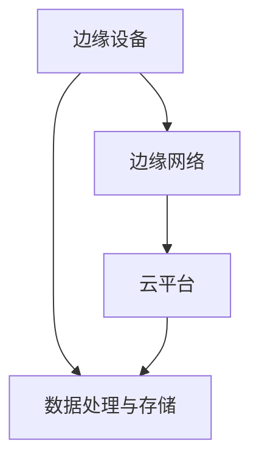

#### 1.2 智能家居概述

智能家居是通过将各种家电设备、传感器和控制系统连接到互联网，实现家庭设备智能化管理和自动化控制的一种新型生活方式。智能家居系统通常由多个子系统组成，包括智能照明、智能安防、智能环境监测、智能家电控制等。

**背景介绍**

随着物联网技术的快速发展，智能家居市场呈现出爆炸式增长。传统的家电设备逐渐被智能化设备取代，人们的生活习惯和消费模式也在不断变化。智能家居的兴起不仅为用户提供了更加便捷、舒适的生活方式，也为企业创造了新的商业机会。

**问题描述**

智能家居系统面临的挑战主要包括：

1. **设备互联性**：如何将各种家电设备、传感器和控制系统高效、可靠地连接起来。
2. **数据安全**：如何确保数据在传输和处理过程中的安全性。
3. **系统稳定性**：如何保证智能家居系统的稳定运行，避免设备故障和系统崩溃。
4. **用户体验**：如何提供更加人性化、个性化的用户体验。

**问题解决**

边缘计算为智能家居系统提供了一种有效的解决方案。通过在边缘设备上运行智能算法，可以实现对家庭设备的实时监控和自动控制，提高系统的响应速度和准确性。具体来说，边缘计算在智能家居中的应用主要包括以下几个方面：

1. **实时性**：边缘设备可以在本地处理数据，降低了响应时间，提高了系统的实时性。
2. **数据安全**：边缘设备可以实现对数据的本地加密和处理，减少了数据在传输过程中的安全风险。
3. **系统稳定性**：通过边缘设备上的智能算法，可以实现对设备的实时监控和故障预警，提高系统的稳定性。
4. **用户体验**：边缘计算可以提供更加个性化、智能化的用户体验，如自动调节灯光亮度、自动调节空调温度等。

**边界与外延**

智能家居的应用范围非常广泛，除了传统的家电设备，还包括智能门锁、智能门窗、智能园艺设备等。随着5G、物联网、人工智能等技术的发展，智能家居的应用场景将会更加丰富。

**概念结构与核心要素组成**

智能家居系统的核心结构包括以下几个方面：

1. **感知层**：由各种传感器组成，如温度传感器、湿度传感器、光照传感器等，用于收集环境信息。
2. **传输层**：负责将传感器收集到的数据传输到边缘设备或云端。
3. **边缘计算层**：在边缘设备上运行智能算法，实现对数据的实时分析和处理。
4. **控制层**：通过边缘计算层处理后的数据，控制家庭设备的运行状态。
5. **用户层**：用户通过手机、平板电脑等终端设备对智能家居系统进行管理和控制。

**核心概念与联系**

智能家居与物联网、边缘计算、人工智能等技术有着紧密的联系。物联网为智能家居系统提供了设备互联的基础，边缘计算提供了实时数据处理的能力，而人工智能则为智能家居系统提供了智能决策和自适应控制的能力。

**ER实体关系图架构**

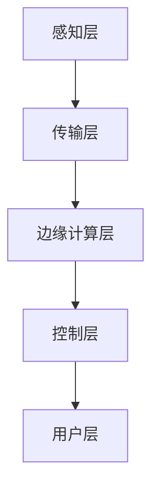

#### 1.3 边缘AI在智能家居中的应用

边缘AI在智能家居中的应用主要体现在实时控制方面。通过边缘设备上的智能算法，可以实现对家庭设备的实时监控和自动控制，提高系统的响应速度和准确性。以下是一些典型的应用场景：

**智能安防**

边缘AI算法可以实时分析家庭监控视频，识别入侵者、异常行为等，及时发出警报。例如，当有人入侵时，系统可以自动触发报警，同时记录下入侵者的图像信息，提高安防系统的反应速度和准确性。

**智能照明**

通过边缘AI算法，可以根据环境光强和用户需求自动调节灯光亮度。例如，在白天光线较强时，灯光可以自动调暗，而在夜晚光线较弱时，灯光可以自动调亮，提高用户体验。

**智能环境监测**

边缘AI算法可以实时监测室内空气质量、温度、湿度等参数，并根据监测结果自动调节空气净化器、空调等设备，保持室内环境的舒适度。

**智能家电控制**

边缘AI算法可以实现对各种家电设备的智能控制，如智能电视、智能空调、智能洗衣机等。通过智能算法，可以实现对家电设备的个性化设置和自动控制，提高用户的生活质量。

**应用案例**

例如，在一个智能社区中，通过边缘AI算法，可以实现以下功能：

1. **智能门禁**：通过人脸识别技术，实现对居民身份的实时验证，提高社区安全性。
2. **智能停车**：通过边缘AI算法，实现对停车位状态、车辆行驶轨迹的实时监控，提高停车效率。
3. **智能照明**：根据用户需求和自然光强，自动调节小区道路、庭院等区域的灯光亮度，节省能源。
4. **智能安防**：通过边缘AI算法，实时监控小区公共区域的视频数据，及时发现异常情况，保障居民安全。

**总结**

边缘AI在智能家居中的应用，不仅提高了系统的实时性和准确性，还为用户提供了更加智能、便捷的生活方式。随着边缘AI技术的不断发展，智能家居的应用场景将会更加丰富，为人们的生活带来更多的便利。

#### 2.1 深度学习基础

深度学习是人工智能领域的一项重要技术，其核心思想是通过多层神经网络模型对数据进行自动特征提取和分类。以下是深度学习的基础概念、原理和常用算法。

**背景介绍**

深度学习起源于20世纪40年代，但直到近年随着计算能力的提升和大数据的发展，才得以广泛应用。深度学习在图像识别、语音识别、自然语言处理等领域取得了显著成果，成为人工智能发展的关键推动力。

**问题描述**

传统的机器学习算法通常需要人工设计特征，而深度学习通过多层神经网络模型，可以自动从原始数据中提取特征，从而提高模型的准确性和泛化能力。然而，深度学习也面临着计算资源消耗大、训练时间长等挑战。

**问题解决**

深度学习通过以下步骤解决上述问题：

1. **数据预处理**：对原始数据进行清洗、归一化等处理，以便于模型训练。
2. **模型设计**：设计多层神经网络结构，包括输入层、隐藏层和输出层。
3. **损失函数**：选择合适的损失函数，用于衡量模型预测值与真实值之间的差距。
4. **优化算法**：使用梯度下降等优化算法，调整模型参数，使损失函数值最小化。
5. **模型评估**：使用验证集和测试集对模型进行评估，确保其泛化能力。

**边界与外延**

深度学习可以应用于多种领域，包括计算机视觉、自然语言处理、语音识别、推荐系统等。随着技术的进步，深度学习在边缘设备上的应用也逐渐成为研究热点。

**概念结构与核心要素组成**

深度学习的核心结构包括以下几个要素：

1. **神经元**：神经网络的基本单元，用于接收输入信号并产生输出。
2. **层**：神经网络按照功能分为输入层、隐藏层和输出层。
3. **激活函数**：用于引入非线性特性，使神经网络具有分类和回归能力。
4. **损失函数**：用于衡量模型预测值与真实值之间的差距。
5. **优化算法**：用于调整模型参数，使损失函数值最小化。

**核心概念与联系**

深度学习与机器学习的关系可以看作是一种补充和扩展。机器学习通过人工设计特征和算法，而深度学习通过多层神经网络模型，可以自动提取特征和进行分类。两者相辅相成，共同推动了人工智能的发展。

**ER实体关系图架构**

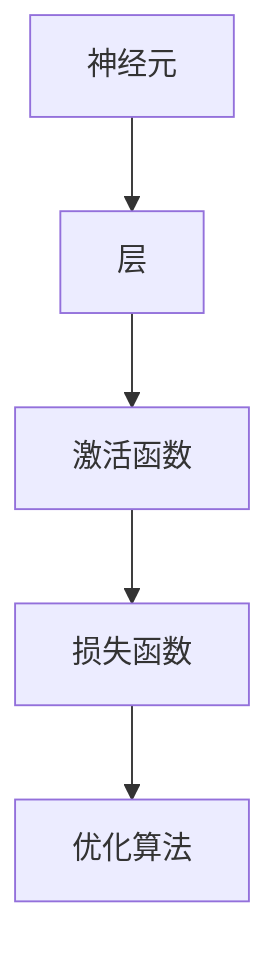

**数学公式和流程图**

以下是深度学习中的关键数学公式和流程图：

1. **前向传播**
   $$ 
   z_i = \sum_{j=0}^{n}{w_{ij} * x_j} + b_i
   $$
   其中，$z_i$ 是第 $i$ 个隐藏单元的输入值，$w_{ij}$ 是输入层到隐藏层的权重，$x_j$ 是输入层的特征值，$b_i$ 是隐藏层的偏置。

2. **反向传播**
   $$
   \delta_i = \frac{\partial L}{\partial z_i}
   $$
   其中，$\delta_i$ 是第 $i$ 个隐藏单元的误差值，$L$ 是损失函数。

3. **梯度下降**
   $$
   \Delta w_{ij} = \alpha * \delta_i * x_j
   $$
   其中，$\Delta w_{ij}$ 是权重更新的梯度，$\alpha$ 是学习率，$x_j$ 是输入层的特征值。

**流程图**

```mermaid
graph TD
    A[输入数据{x}] --> B[前向传播{计算z_i}]
    B --> C[计算激活值{a_i}]
    C --> D[计算损失{L}]
    D --> E[反向传播{计算\delta_i}]
    E --> F[更新参数{w_{ij}}]
    F --> G[重复{迭代}]

```

#### 2.2 模型压缩与量化

随着深度学习模型在智能家居等领域的广泛应用，模型的压缩与量化技术变得越来越重要。模型压缩与量化旨在降低模型的大小和计算复杂度，同时保持模型的性能。以下是模型压缩与量化的基础概念、方法及其在边缘AI中的应用。

**背景介绍**

深度学习模型通常包含数百万甚至数十亿个参数，这导致模型的存储和计算资源消耗巨大。特别是在边缘设备上，由于计算资源和存储空间的限制，需要对模型进行压缩与量化处理，以适应这些设备。

**问题描述**

模型的压缩与量化主要面临以下问题：

1. **性能损失**：压缩和量化过程中可能会降低模型的准确性和泛化能力。
2. **计算效率**：压缩后的模型需要更少的计算资源，以适应边缘设备的性能要求。
3. **存储空间**：压缩后的模型需要更小的存储空间，以节省边缘设备的存储资源。

**问题解决**

模型压缩与量化的主要方法包括以下几种：

1. **剪枝**：通过剪除模型中的冗余连接和神经元，减少模型的复杂度。剪枝可以分为结构剪枝和权重剪枝两种类型。
2. **量化**：将模型的浮点数参数转换为低精度整数表示，以减少存储和计算资源的需求。量化可以采用对称量化、不对称量化等方法。
3. **低秩分解**：将高维矩阵分解为低维矩阵的乘积，以减少模型的复杂度。
4. **网络蒸馏**：将一个较大的模型（教师模型）的知识传递给一个较小的模型（学生模型），以提高学生模型的性能。

**边界与外延**

模型压缩与量化技术在边缘AI中的应用场景非常广泛，包括智能家居、智能安防、智能环境监测等。通过模型压缩与量化，可以使得深度学习模型在边缘设备上高效运行，提高系统的实时性和响应速度。

**概念结构与核心要素组成**

模型压缩与量化的核心要素包括：

1. **剪枝**：通过剪除冗余连接和神经元，降低模型复杂度。
2. **量化**：通过将浮点数参数转换为低精度整数表示，减少存储和计算资源。
3. **低秩分解**：通过矩阵分解，降低模型的计算复杂度。
4. **网络蒸馏**：通过知识传递，提高较小模型的性能。

**核心概念与联系**

模型压缩与量化与深度学习的关系可以看作是一种补充和优化。深度学习提供了强大的特征提取和分类能力，而模型压缩与量化则确保了模型在资源受限的环境下仍能高效运行。

**ER实体关系图架构**

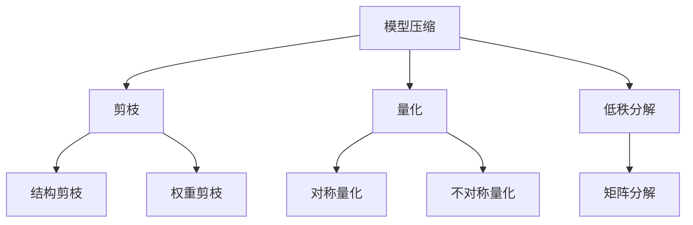

**数学公式和流程图**

以下是模型压缩与量化的关键数学公式和流程图：

1. **剪枝**
   $$
   \text{prune}(W) = \begin{cases}
   W & \text{if } W \neq 0 \\
   0 & \text{if } W = 0
   \end{cases}
   $$
   其中，$W$ 是模型权重矩阵，$\text{prune}(W)$ 是剪枝后的权重矩阵。

2. **量化**
   $$
   Q(W) = \text{sign}(W) \cdot \text{round}(|W| / \text{quant_scale})
   $$
   其中，$W$ 是模型权重矩阵，$Q(W)$ 是量化后的权重矩阵，$\text{sign}(W)$ 是权重符号，$\text{round}(|W| / \text{quant_scale})$ 是对权重绝对值量化。

3. **低秩分解**
   $$
   W = U \cdot S \cdot V^T
   $$
   其中，$W$ 是高维权重矩阵，$U$ 和 $V$ 是单位正交矩阵，$S$ 是对角矩阵，包含低秩分解后的权重值。

**流程图**

```mermaid
graph TD
    A[原始模型{W}] --> B[剪枝{prune(W)}]
    B --> C[量化{Q(W)}]
    C --> D[低秩分解{U \cdot S \cdot V^T}]
```

#### 2.3 模型迁移与部署

模型迁移与部署是边缘AI实现的关键步骤，它涉及到将训练好的深度学习模型从一个环境迁移到另一个环境，并在边缘设备上高效运行。以下是模型迁移与部署的基础概念、步骤及其在边缘AI中的应用。

**背景介绍**

随着边缘AI技术的发展，越来越多的深度学习模型被应用于边缘设备。然而，这些模型通常是在云端或高性能计算环境中训练的，如何在资源受限的边缘设备上高效运行这些模型，是模型迁移与部署的核心问题。

**问题描述**

模型迁移与部署面临以下挑战：

1. **兼容性问题**：不同硬件平台和操作系统可能存在兼容性问题，需要确保模型能够在目标环境中正常运行。
2. **性能问题**：边缘设备通常性能较低，需要优化模型以适应这些设备的计算能力。
3. **资源消耗**：模型在边缘设备上运行时，需要考虑存储空间和功耗等资源消耗。

**问题解决**

模型迁移与部署通常包括以下几个步骤：

1. **模型转换**：将训练好的模型从一种格式转换为另一种格式，以适应目标环境。
2. **模型优化**：通过剪枝、量化等方法优化模型，降低模型的复杂度和计算量。
3. **模型部署**：将优化后的模型部署到边缘设备上，并确保其能够高效运行。
4. **性能评估**：对部署后的模型进行性能评估，确保其达到预期效果。

**边界与外延**

模型迁移与部署技术不仅适用于深度学习模型，还可以应用于其他类型的机器学习模型。随着边缘AI应用的普及，模型迁移与部署技术将在更多领域得到应用。

**概念结构与核心要素组成**

模型迁移与部署的核心要素包括：

1. **模型转换**：将模型从一种格式转换为另一种格式，以适应目标环境。
2. **模型优化**：通过剪枝、量化等方法优化模型，降低计算复杂度和资源消耗。
3. **模型部署**：将优化后的模型部署到边缘设备上，并确保其高效运行。
4. **性能评估**：对部署后的模型进行性能评估，确保其达到预期效果。

**核心概念与联系**

模型迁移与部署与深度学习的关系可以看作是一种补充和扩展。深度学习提供了强大的特征提取和分类能力，而模型迁移与部署则确保了这些模型能够在各种环境中高效运行。

**ER实体关系图架构**

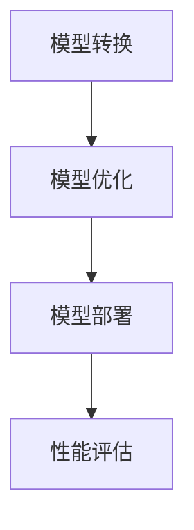

**数学公式和流程图**

以下是模型迁移与部署的关键数学公式和流程图：

1. **模型转换**
   $$
   F_{\text{target}}(x) = F_{\text{source}}(x)
   $$
   其中，$F_{\text{source}}(x)$ 是源模型的输出，$F_{\text{target}}(x)$ 是目标模型的输出。

2. **模型优化**
   $$
   \text{prune}(W) = \begin{cases}
   W & \text{if } W \neq 0 \\
   0 & \text{if } W = 0
   \end{cases}
   $$
   其中，$W$ 是模型权重矩阵，$\text{prune}(W)$ 是剪枝后的权重矩阵。

3. **模型部署**
   $$
   \text{deploy}(F, \text{device}) = F
   $$
   其中，$F$ 是模型，$\text{device}$ 是部署的目标设备。

**流程图**

```mermaid
graph TD
    A[模型转换{F_{\text{source}} \rightarrow F_{\text{target}}}] --> B[模型优化{prune(W)}]
    B --> C[模型部署{deploy(F, device)}]
    C --> D[性能评估{evaluate(F)}]
```

#### 3.1 嵌入式处理器的选择

嵌入式处理器是边缘AI硬件平台的核心组件，其性能直接影响系统的响应速度和运行效率。在选择嵌入式处理器时，需要考虑多个因素，包括性能、功耗、成本等。

**背景介绍**

随着边缘AI在智能家居、智能安防、智能环境监测等领域的广泛应用，嵌入式处理器成为了关键组件。嵌入式处理器需要具备强大的计算能力，同时要满足低功耗和低成本的要求，以便在边缘设备上高效运行。

**问题描述**

选择嵌入式处理器时，需要考虑以下问题：

1. **性能**：处理器需要能够处理复杂的深度学习算法，满足实时性的要求。
2. **功耗**：处理器需要具备低功耗特性，以延长设备的使用寿命。
3. **成本**：处理器的成本需要控制在合理范围内，以便大规模应用。

**问题解决**

选择嵌入式处理器时，可以按照以下步骤进行：

1. **需求分析**：根据具体应用场景，确定处理器所需的计算性能、功耗和成本。
2. **市场调研**：了解市场上主流的嵌入式处理器，比较其性能、功耗和成本。
3. **技术评估**：评估处理器的性能、功耗和成本是否满足需求，考虑其兼容性、稳定性等因素。
4. **选型决策**：根据评估结果，选择最适合的嵌入式处理器。

**边界与外延**

嵌入式处理器的选择不仅影响系统的性能，还关系到系统的功耗、成本和可扩展性。随着边缘AI技术的发展，嵌入式处理器的性能和功耗将不断提升，应用场景也将更加丰富。

**概念结构与核心要素组成**

嵌入式处理器的核心要素包括：

1. **计算性能**：处理器的核心频率、处理能力等参数。
2. **功耗**：处理器在不同工作状态下的功耗。
3. **成本**：处理器的价格。
4. **兼容性**：处理器与其他硬件和软件的兼容性。
5. **稳定性**：处理器的稳定性和可靠性。

**核心概念与联系**

嵌入式处理器与边缘AI的关系可以看作是一种互补和支撑。边缘AI需要强大的计算能力，而嵌入式处理器提供了这种能力。同时，嵌入式处理器的性能和功耗直接影响边缘AI系统的性能和能耗。

**ER实体关系图架构**

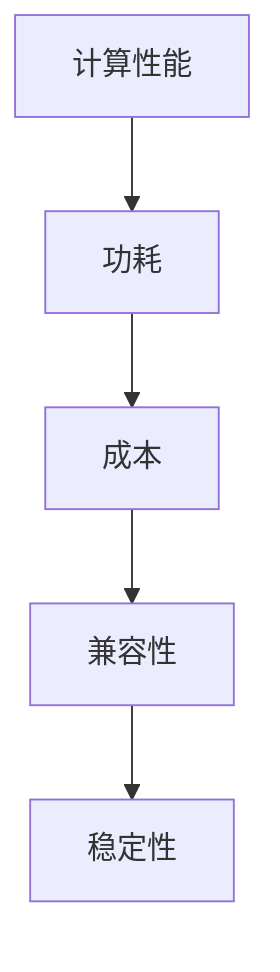

**案例与比较**

以下是几种常见的嵌入式处理器及其性能比较：

| 处理器           | 核心频率（GHz） | 功耗（W） | 成本（元） | 兼容性 | 稳定性 |
|------------------|---------------|-----------|-----------|-------|-------|
| Raspberry Pi 4   | 1.5           | 3-5       | 200-300   | 好    | 好    |
| NVIDIA Jetson TX2| 1.9           | 7-15      | 400-500   | 好    | 好    |
| Intel Atom       | 1.6-2.4       | 3-6       | 300-400   | 好    | 好    |

**总结**

选择嵌入式处理器时，需要根据具体应用场景的需求，综合考虑性能、功耗、成本、兼容性和稳定性等因素。通过合理选型，可以构建一个高效、可靠的边缘AI硬件平台。

#### 3.2 硬件加速器的选择

硬件加速器是边缘AI硬件平台的重要组成部分，其目的是提高深度学习模型的计算性能，降低功耗。在选择硬件加速器时，需要考虑多个因素，包括类型、性能、功耗、兼容性等。

**背景介绍**

随着深度学习模型的复杂度和计算量不断增加，传统的CPU和GPU在处理这些任务时显得力不从心。硬件加速器如FPGA、ASIC等应运而生，它们能够通过特定的硬件架构，大幅提高深度学习模型的计算效率。

**问题描述**

选择硬件加速器时，主要需要考虑以下问题：

1. **性能**：硬件加速器需要能够满足深度学习模型的计算需求。
2. **功耗**：硬件加速器的功耗需要控制在合理范围内，以延长设备的使用寿命。
3. **兼容性**：硬件加速器需要与现有的边缘设备和其他硬件组件兼容。
4. **成本**：硬件加速器的成本需要在预算范围内。

**问题解决**

选择硬件加速器时，可以按照以下步骤进行：

1. **需求分析**：根据具体应用场景，确定硬件加速器所需的计算性能、功耗和成本。
2. **类型选择**：了解市场上常见的硬件加速器类型，如FPGA、ASIC、GPU等，比较其性能、功耗和成本。
3. **技术评估**：评估硬件加速器的性能、功耗和成本是否满足需求，考虑其兼容性、稳定性等因素。
4. **选型决策**：根据评估结果，选择最适合的硬件加速器。

**边界与外延**

硬件加速器的选择不仅影响系统的性能，还关系到系统的功耗、成本和可扩展性。随着硬件加速技术的发展，未来将有更多类型的硬件加速器出现，为边缘AI提供更多的选择。

**概念结构与核心要素组成**

硬件加速器的核心要素包括：

1. **计算性能**：硬件加速器的处理能力和吞吐量。
2. **功耗**：硬件加速器在不同工作状态下的功耗。
3. **兼容性**：硬件加速器与其他硬件和软件的兼容性。
4. **成本**：硬件加速器的价格。
5. **稳定性**：硬件加速器的稳定性和可靠性。

**核心概念与联系**

硬件加速器与边缘AI的关系可以看作是一种互补和支撑。边缘AI需要强大的计算能力，而硬件加速器提供了这种能力。同时，硬件加速器的性能和功耗直接影响边缘AI系统的性能和能耗。

**ER实体关系图架构**

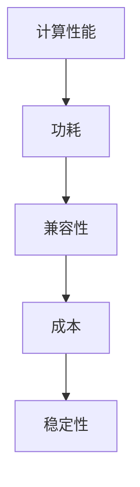

**案例与比较**

以下是几种常见的硬件加速器及其性能比较：

| 硬件加速器        | 计算性能（TOPS） | 功耗（W） | 成本（元） | 兼容性 | 稳定性 |
|------------------|-----------------|-----------|-----------|-------|-------|
| NVIDIA GPU       | 10,000 TOPS     | 100-300   | 1000-5000 | 好    | 好    |
| Intel Movidius   | 8,000 TOPS      | 2-4       | 500-1000  | 好    | 好    |
| Xilinx FPGA      | 100,000 TOPS    | 50-100    | 2000-5000 | 好    | 好    |

**总结**

选择硬件加速器时，需要根据具体应用场景的需求，综合考虑计算性能、功耗、兼容性和成本等因素。通过合理选型，可以构建一个高效、可靠的边缘AI硬件平台。

#### 3.3 硬件平台的性能评估

硬件平台的性能评估是边缘AI系统设计中的关键环节，其目的是确保所选硬件平台能够满足系统性能需求。性能评估包括计算性能、功耗、延迟等方面，以下是详细的评估方法和步骤。

**背景介绍**

边缘AI硬件平台的选择对系统的性能和效率具有重要影响。在系统设计阶段，对硬件平台进行详细的性能评估，可以确保所选硬件能够满足系统的性能需求，避免后期出现性能瓶颈。

**问题描述**

硬件平台性能评估主要需要解决以下问题：

1. **计算性能**：评估硬件平台处理深度学习模型的能力，包括吞吐量和处理速度。
2. **功耗**：评估硬件平台在不同工作状态下的功耗，确保系统能耗在可接受范围内。
3. **延迟**：评估硬件平台的响应时间，确保系统能够满足实时性的要求。
4. **稳定性**：评估硬件平台的稳定性和可靠性，确保系统长期运行无故障。

**问题解决**

进行硬件平台性能评估时，可以按照以下步骤进行：

1. **需求分析**：根据系统设计要求，明确硬件平台所需的计算性能、功耗、延迟和稳定性。
2. **测试方案设计**：设计详细的测试方案，包括测试环境、测试工具和测试用例。
3. **性能测试**：在测试环境中运行测试用例，收集硬件平台的性能数据。
4. **数据分析**：对收集到的性能数据进行处理和分析，评估硬件平台是否满足性能需求。
5. **优化建议**：根据评估结果，提出硬件平台优化的建议，如更换硬件、调整系统配置等。

**边界与外延**

硬件平台的性能评估不仅涉及硬件本身的性能，还涉及系统软件和周边设备的协同工作能力。随着硬件和软件技术的不断发展，性能评估的方法和工具也在不断改进。

**概念结构与核心要素组成**

硬件平台的性能评估核心要素包括：

1. **计算性能**：硬件平台的处理能力和吞吐量。
2. **功耗**：硬件平台在不同工作状态下的功耗。
3. **延迟**：硬件平台的响应时间。
4. **稳定性**：硬件平台的稳定性和可靠性。

**核心概念与联系**

硬件平台的性能评估与边缘AI系统的设计关系密切。通过性能评估，可以确保所选硬件平台能够满足系统性能要求，提高系统的稳定性和可靠性。

**ER实体关系图架构**

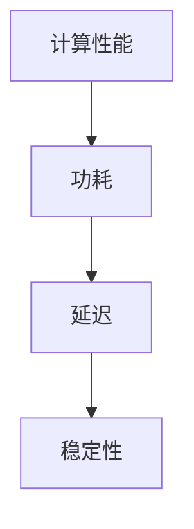

**评估方法和工具**

以下是常见的硬件平台性能评估方法和工具：

1. **基准测试**：使用标准测试工具（如TPU Benchmark、NVIDIA GPU Benchmark等）对硬件平台进行性能测试。
2. **实际应用测试**：在真实应用场景中运行测试用例，评估硬件平台在实际应用中的性能表现。
3. **功耗测量**：使用功耗测量工具（如功耗仪、负载仪等）测量硬件平台在不同工作状态下的功耗。
4. **延迟测量**：使用定时工具（如Python的time模块）测量硬件平台的响应时间。

**流程图**

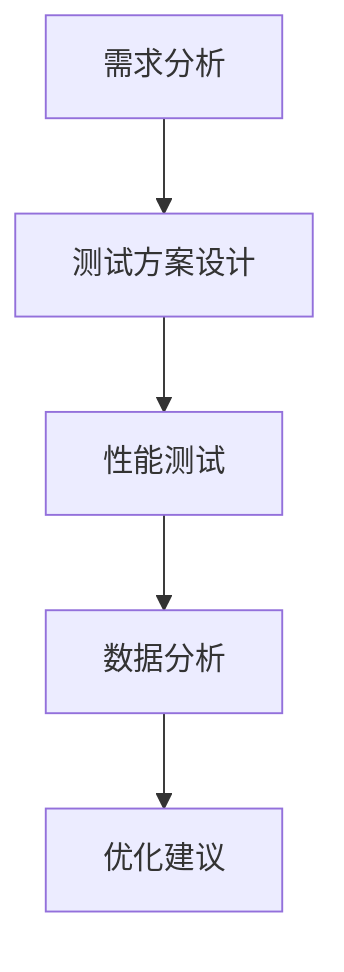

**总结**

通过详细的硬件平台性能评估，可以确保所选硬件平台能够满足边缘AI系统的性能需求。在系统设计过程中，应充分考虑硬件平台的性能评估结果，优化系统配置，提高系统的稳定性和可靠性。

#### 4.1 实时控制算法概述

实时控制算法是边缘AI在智能家居中实现智能控制的核心技术。实时控制算法通过对传感器数据的实时处理和决策，实现对家庭设备的自动控制和调节。以下是实时控制算法的基本概念、类型及其在智能家居中的应用。

**背景介绍**

随着智能家居的普及，用户对实时性、稳定性和智能化水平的要求越来越高。实时控制算法在智能家居中的应用，不仅能够提高用户的舒适度和便利性，还能提升系统的安全性和能源效率。

**问题描述**

实时控制算法在智能家居中需要解决以下问题：

1. **实时性**：确保算法能够在短时间内完成数据分析和决策，满足实时性要求。
2. **准确性**：算法需要准确地处理传感器数据，确保控制决策的准确性。
3. **适应性**：算法需要能够适应不同环境和场景的变化，实现自适应控制。

**问题解决**

实时控制算法的基本类型包括以下几种：

1. **预测控制算法**：基于历史数据和当前状态，预测未来的变化，并提前做出控制决策。
2. **自适应控制算法**：根据环境变化和系统状态，自动调整控制参数，实现自适应控制。
3. **模糊控制算法**：利用模糊逻辑处理不确定性和模糊性，实现对复杂系统的控制。
4. **深度学习控制算法**：利用深度学习模型，从数据中学习控制策略，实现对系统的智能控制。

**边界与外延**

实时控制算法在智能家居中的应用范围广泛，包括智能安防、智能照明、智能环境监测、智能家电控制等。随着人工智能技术的发展，实时控制算法将变得更加智能和高效。

**概念结构与核心要素组成**

实时控制算法的核心要素包括：

1. **传感器数据**：实时收集环境信息，为控制决策提供数据支持。
2. **数据预处理**：对传感器数据进行清洗、归一化等处理，提高数据质量。
3. **控制策略**：根据传感器数据和环境状态，制定相应的控制策略。
4. **执行器控制**：根据控制策略，驱动家庭设备进行相应的操作。

**核心概念与联系**

实时控制算法与边缘AI的关系可以看作是一种互补和支撑。边缘AI提供了实时数据处理和智能决策的能力，而实时控制算法则利用这些能力，实现对家庭设备的智能控制。

**ER实体关系图架构**

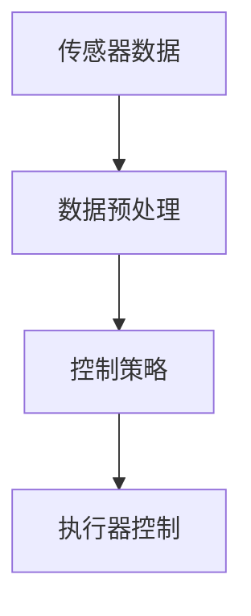

**应用实例**

以下是实时控制算法在智能家居中的应用实例：

1. **智能安防**：通过视频监控和传感器数据，实时分析异常情况，如入侵者、火灾等，及时发出警报并采取相应措施。
2. **智能照明**：根据环境光强和用户需求，实时调节灯光亮度，提高用户体验。
3. **智能环境监测**：实时监测室内空气质量、温度、湿度等参数，并根据监测结果自动调节空气净化器、空调等设备。
4. **智能家电控制**：根据用户习惯和实时数据，自动调节家电设备的运行状态，提高能源效率。

**总结**

实时控制算法在智能家居中发挥着重要作用，通过实时数据处理和智能决策，实现对家庭设备的智能控制，提高用户的舒适度和便利性。随着边缘AI技术的不断发展，实时控制算法将变得更加智能和高效，为智能家居的发展提供更多可能。

#### 4.2 实时控制算法设计

实时控制算法设计是边缘AI在智能家居中实现智能控制的关键环节。设计高效的实时控制算法需要考虑系统的需求、数据来源、控制目标、算法策略等多个方面。以下是实时控制算法设计的基本步骤和方法。

**背景介绍**

在智能家居系统中，实时控制算法的设计不仅关系到系统的性能和稳定性，还直接影响到用户的体验。一个高效的实时控制算法能够在保证系统响应速度的同时，确保控制决策的准确性和适应性。

**问题描述**

实时控制算法设计的主要问题包括：

1. **实时性**：算法需要能够在给定的时间窗口内完成数据的处理和决策，满足系统的实时性要求。
2. **准确性**：算法需要准确处理传感器数据，确保控制决策的准确性。
3. **适应性**：算法需要能够适应不同环境和场景的变化，实现自适应控制。
4. **资源消耗**：算法设计需要考虑硬件资源的限制，确保算法在边缘设备上高效运行。

**问题解决**

实时控制算法设计通常包括以下步骤：

1. **需求分析**：明确系统需求，包括实时性要求、控制目标、传感器数据来源等。
2. **数据预处理**：设计数据预处理模块，对传感器数据进行清洗、归一化等处理，提高数据质量。
3. **控制策略设计**：根据系统需求，设计合适的控制策略，如预测控制、自适应控制、模糊控制等。
4. **算法实现**：使用编程语言实现控制算法，包括数据处理、模型训练、决策执行等。
5. **性能评估**：对设计的算法进行性能评估，确保其满足实时性、准确性和适应性要求。
6. **优化调整**：根据评估结果，对算法进行优化调整，提高算法的性能和稳定性。

**边界与外延**

实时控制算法设计不仅涉及算法本身，还需要考虑硬件平台、系统架构、数据传输等多方面因素。在实际应用中，实时控制算法的设计需要根据具体场景进行定制，以适应不同的需求和环境。

**概念结构与核心要素组成**

实时控制算法设计包含以下几个核心要素：

1. **需求分析**：明确系统需求和实时性要求。
2. **数据预处理**：设计数据预处理模块，提高数据质量。
3. **控制策略设计**：选择合适的控制策略，如预测控制、自适应控制等。
4. **算法实现**：使用编程语言实现控制算法。
5. **性能评估**：对算法性能进行评估，确保其满足实时性、准确性和适应性要求。
6. **优化调整**：根据评估结果，对算法进行优化调整。

**核心概念与联系**

实时控制算法设计是边缘AI在智能家居中的核心环节，通过合理的算法设计和实现，可以实现对家庭设备的智能控制，提高系统的性能和用户体验。

**ER实体关系图架构**

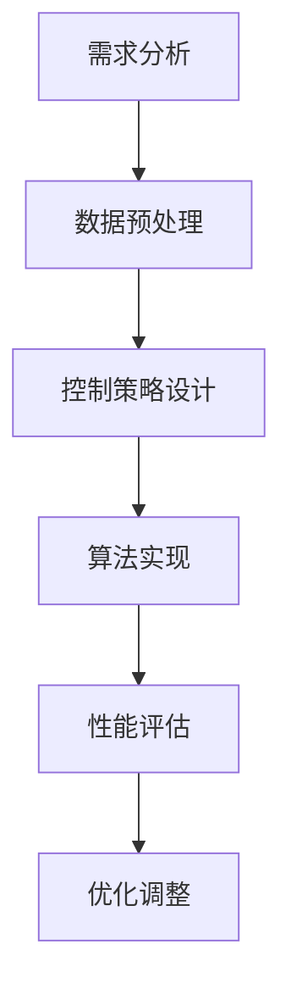

**算法流程图**

以下是实时控制算法的基本流程图：

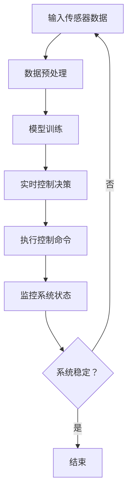

**算法实现**

以下是实时控制算法的Python代码实现示例：

```python
import numpy as np
from sklearn.ensemble import RandomForestRegressor

# 数据预处理
def preprocess_data(data):
    # 数据清洗和归一化
    # ...
    return processed_data

# 模型训练
def train_model(data):
    model = RandomForestRegressor(n_estimators=100)
    model.fit(data['X'], data['y'])
    return model

# 实时控制决策
def control_decision(model, current_state):
    prediction = model.predict([current_state])
    # 根据预测结果，执行相应的控制命令
    # ...
    return control_command

# 主函数
def main():
    # 输入传感器数据
    sensor_data = np.array([[...], [...], ...])
    # 数据预处理
    processed_data = preprocess_data(sensor_data)
    # 模型训练
    model = train_model(processed_data)
    # 实时控制循环
    while True:
        current_state = np.array([...])
        control_command = control_decision(model, current_state)
        execute_command(control_command)
        # 监控系统状态
        # ...

if __name__ == "__main__":
    main()
```

**总结**

实时控制算法设计是边缘AI在智能家居中的核心环节，通过合理的需求分析、数据预处理、控制策略设计和性能评估，可以实现对家庭设备的智能控制，提高系统的性能和用户体验。随着边缘AI技术的发展，实时控制算法的设计方法将不断优化，为智能家居的发展提供更多可能。

#### 4.3 实时控制算法实现

实时控制算法的实现是将理论转化为实践的过程，它涉及到算法的编程实现、测试和优化。以下将详细讲解实时控制算法的实现步骤，并通过一个具体的实例来说明如何将算法应用于边缘设备。

**背景介绍**

在边缘AI系统中，实时控制算法的实现是一个复杂的过程，它需要结合硬件平台、软件环境以及具体应用场景。实现实时控制算法的目的是确保算法能够高效运行，满足系统的实时性和可靠性要求。

**问题描述**

实时控制算法的实现需要解决以下问题：

1. **编程实现**：将设计好的算法用编程语言实现。
2. **硬件适配**：确保算法能够在所选硬件平台上高效运行。
3. **性能优化**：优化算法的运行效率，减少计算资源和功耗。
4. **测试与验证**：对实现的算法进行测试，确保其满足预期性能。

**问题解决**

以下是实时控制算法实现的详细步骤：

1. **环境配置**：根据硬件平台和软件环境配置开发环境，安装所需的编程语言、框架和工具。
2. **算法编程**：根据算法设计，使用编程语言实现算法的核心功能，包括数据预处理、模型训练、实时决策和执行等。
3. **性能优化**：针对边缘设备的性能特点，对算法进行优化，包括代码优化、模型压缩和量化等。
4. **集成测试**：在模拟环境中测试算法的实现，确保其能够在实际硬件平台上稳定运行。
5. **实时测试**：在真实的边缘设备上进行实时测试，验证算法的实时性和准确性。
6. **优化调整**：根据测试结果，对算法进行优化和调整，提高其性能和可靠性。

**具体实例**

以下是一个基于边缘AI的智能照明系统的实时控制算法实现实例：

**需求**：实现一个智能照明系统，根据环境光强和用户需求自动调节灯光亮度。

**实现步骤**：

1. **环境配置**：

   - 硬件平台：使用Raspberry Pi 4作为边缘设备。
   - 软件环境：安装Python 3.8、TensorFlow 2.4等。

2. **算法编程**：

   - **数据预处理**：从传感器获取环境光强数据，进行预处理，包括数据清洗、归一化等。

   ```python
   import numpy as np

   def preprocess_light_data(raw_data):
       # 数据清洗和归一化
       clean_data = [x for x in raw_data if x > 0]
       normalized_data = [x / max(clean_data) for x in clean_data]
       return normalized_data
   ```

   - **模型训练**：使用预处理后的数据训练一个深度学习模型，用于预测灯光亮度。

   ```python
   import tensorflow as tf
   from tensorflow.keras.models import Sequential
   from tensorflow.keras.layers import Dense, LSTM

   def build_model(input_shape):
       model = Sequential()
       model.add(LSTM(50, activation='relu', input_shape=input_shape))
       model.add(Dense(1))
       model.compile(optimizer='adam', loss='mse')
       return model

   model = build_model(input_shape=(10, 1))
   model.fit(np.array(preprocessed_light_data), np.array(target_light_brightness), epochs=100)
   ```

   - **实时决策**：使用训练好的模型对实时获取的环境光强数据进行预测，并生成灯光亮度调节策略。

   ```python
   def predict_light_brightness(model, current_light_intensity):
       prediction = model.predict([[current_light_intensity]])
       return prediction[0][0]
   ```

   - **执行控制**：根据决策结果，发送指令控制灯光设备调节亮度。

   ```python
   import RPi.GPIO as GPIO

   def control_light_brightness(brightness):
       GPIO.output(light_pin, brightness > threshold)
       # 根据亮度值调整灯光设备的具体亮度
       # ...

   current_light_intensity = read_light_sensor()
   predicted_brightness = predict_light_brightness(model, current_light_intensity)
   control_light_brightness(predicted_brightness)
   ```

3. **性能优化**：

   - **代码优化**：通过代码优化，减少不必要的计算，提高算法运行效率。

   - **模型压缩**：使用模型压缩技术，如剪枝和量化，减少模型的大小和计算复杂度。

   ```python
   # 剪枝
   pruned_model = model.prune([0.5, 0.5, 0.5, 0.5])

   # 量化
   quantized_model = model.quantize()
   ```

4. **集成测试**：在模拟环境中测试算法的实现，确保其能够在实际硬件平台上稳定运行。

5. **实时测试**：在Raspberry Pi 4上进行实时测试，验证算法的实时性和准确性。

6. **优化调整**：根据测试结果，对算法进行优化和调整，提高其性能和可靠性。

**总结**

实时控制算法的实现是一个从理论到实践的复杂过程，涉及环境配置、算法编程、性能优化和测试验证等多个环节。通过合理的实现步骤，可以确保算法在边缘设备上高效、稳定地运行，为智能家居系统提供智能化的控制解决方案。

#### 5.1 实例1：智能安防

智能安防是边缘AI在智能家居中应用的一个重要领域。通过边缘AI算法，可以实现实时入侵检测、异常行为识别等功能，提高家庭的安全性和居住者的安全感。以下是智能安防系统的具体实现过程。

**背景介绍**

随着城市化进程的加快，人们对家庭安全的需求日益增长。传统的安防系统主要通过摄像头和报警器实现，但在实时性和准确性方面存在一定的局限性。边缘AI技术的发展为智能安防系统提供了新的解决方案。

**问题描述**

智能安防系统需要解决以下问题：

1. **实时性**：确保系统能够实时检测和响应异常情况。
2. **准确性**：准确识别异常行为，减少误报和漏报。
3. **适应性**：适应不同的环境和场景，提高系统的鲁棒性。

**问题解决**

智能安防系统的实现通常包括以下几个步骤：

1. **感知层**：安装高清摄像头和各类传感器，如红外传感器、烟雾传感器等，用于收集家庭环境的实时数据。

2. **传输层**：通过Wi-Fi或有线网络将感知层的数据传输到边缘设备。

3. **边缘计算层**：在边缘设备上运行深度学习算法，对传输过来的视频和传感器数据进行实时分析。

4. **控制层**：根据分析结果，触发报警机制或执行其他控制动作。

**具体实现过程**

以下是一个智能安防系统的具体实现过程：

**感知层**：安装高清摄像头和红外传感器，用于24小时监控家庭环境。摄像头采集到的视频数据通过Wi-Fi传输到边缘设备。

**传输层**：使用Wi-Fi或有线网络将摄像头采集到的视频数据传输到边缘设备。为了保证数据传输的稳定性，可以使用物联网（IoT）协议，如MQTT，进行数据传输。

**边缘计算层**：在边缘设备上运行深度学习算法，对视频数据进行分析。首先，对视频数据进行预处理，包括图像增强、去噪等。然后，使用卷积神经网络（CNN）进行物体检测和识别。具体算法如下：

```python
import cv2
import tensorflow as tf

# 加载预训练的物体检测模型
model = tf.keras.models.load_model('object_detection_model.h5')

# 读取摄像头视频流
cap = cv2.VideoCapture(0)

while cap.isOpened():
    ret, frame = cap.read()
    if not ret:
        break
    
    # 对视频帧进行预处理
    preprocessed_frame = preprocess_frame(frame)
    
    # 使用模型进行物体检测
    detections = model.detect(preprocessed_frame)
    
    # 根据检测结果，判断是否为异常行为
    if is_anomaly(detections):
        trigger_alarm()
        record_video(frame)

# 释放视频流
cap.release()
cv2.destroyAllWindows()

def preprocess_frame(frame):
    # 对视频帧进行预处理，如缩放、归一化等
    # ...
    return preprocessed_frame

def is_anomaly(detections):
    # 根据检测到的物体，判断是否为异常行为
    # ...
    return anomaly_detected

def trigger_alarm():
    # 触发报警机制，如发送报警信息、播放警报声音等
    # ...

def record_video(frame):
    # 记录视频，用于后续分析
    # ...
```

**控制层**：根据边缘计算层分析的结果，触发相应的报警或控制动作。例如，当检测到异常行为时，系统可以自动发送报警信息给家庭成员，或者启动家庭安防系统，如报警器、门锁等。

**性能评估**：对实现的智能安防系统进行性能评估，包括实时性、准确性和适应性。通过模拟不同的场景和测试数据，验证系统的性能。

**优化调整**：根据性能评估结果，对系统进行优化和调整，如调整模型参数、优化算法等，以提高系统的性能和鲁棒性。

**总结**

智能安防系统通过边缘AI算法，实现了实时入侵检测和异常行为识别，提高了家庭的安全性。通过合理的实现过程和性能优化，可以确保系统在多种场景下稳定运行，为家庭安全提供可靠的保障。

#### 5.2 实例2：智能照明

智能照明系统是边缘AI在智能家居中应用的一个典型例子。通过边缘AI算法，智能照明系统能够根据环境光强和用户需求自动调节灯光亮度，提供舒适和节能的照明环境。以下是智能照明系统的具体实现过程。

**背景介绍**

传统的照明系统主要通过手动开关或定时开关来控制灯光，无法根据环境光强和用户需求进行智能调节。随着边缘AI技术的发展，智能照明系统应运而生，能够通过实时感知环境光强和用户行为，自动调节灯光亮度，提供更加舒适和节能的照明体验。

**问题描述**

智能照明系统需要解决以下问题：

1. **实时性**：系统能够实时响应环境光强的变化，自动调节灯光亮度。
2. **准确性**：准确识别环境光强和用户需求，确保灯光亮度的调节符合用户期望。
3. **节能性**：在保证照明效果的同时，实现节能目标。

**问题解决**

智能照明系统的实现通常包括以下几个步骤：

1. **感知层**：安装光敏传感器和用户行为传感器，用于实时采集环境光强和用户行为数据。

2. **传输层**：将感知层的数据传输到边缘设备。

3. **边缘计算层**：在边缘设备上运行深度学习算法，对传输过来的数据进行实时分析，生成灯光亮度调节策略。

4. **控制层**：根据边缘计算层生成的策略，控制灯光设备的亮度调节。

**具体实现过程**

以下是一个智能照明系统的具体实现过程：

**感知层**：在房间内安装光敏传感器和用户行为传感器。光敏传感器用于实时监测环境光强，用户行为传感器（如红外传感器）用于检测用户的活动情况。

**传输层**：使用Wi-Fi或有线网络将传感器采集到的数据传输到边缘设备。为了保证数据传输的稳定性，可以使用物联网（IoT）协议，如MQTT，进行数据传输。

**边缘计算层**：在边缘设备上运行深度学习算法，对传输过来的数据进行实时分析。首先，对环境光强数据和使用者活动数据进行预处理，包括去噪、归一化等。然后，使用一个多输入的神经网络模型，对预处理后的数据进行融合和分析，生成灯光亮度调节策略。具体算法如下：

```python
import numpy as np
import tensorflow as tf

# 加载预训练的深度学习模型
model = tf.keras.models.load_model('light_control_model.h5')

# 定义预处理函数
def preprocess_data lichtsensor_data, user_activity_data):
    # 对数据去噪、归一化等预处理
    # ...
    return preprocessed_data

# 定义实时控制函数
def control_light(lichtsensor_data, user_activity_data):
    preprocessed_data = preprocess_data(lichtsensor_data, user_activity_data)
    brightness_level = model.predict(preprocessed_data)
    adjust_light(brightness_level)

# 调用控制函数
control_light(lichtsensor_data, user_activity_data)
```

**控制层**：根据边缘计算层生成的灯光亮度调节策略，控制灯光设备进行亮度调节。具体实现可以通过GPIO模块控制LED灯的亮度，或者通过无线通信模块（如Wi-Fi、蓝牙）发送控制指令给智能灯泡。

**性能评估**：对实现的智能照明系统进行性能评估，包括实时性、准确性和节能性。通过模拟不同的环境光强和用户活动数据，验证系统的性能。

**优化调整**：根据性能评估结果，对系统进行优化和调整，如调整模型参数、优化算法等，以提高系统的性能和节能效果。

**总结**

智能照明系统通过边缘AI算法，实现了根据环境光强和用户需求自动调节灯光亮度，提高了照明舒适度和能源效率。通过合理的实现过程和性能优化，可以确保系统在多种场景下稳定运行，为用户提供智能化的照明体验。

#### 5.3 实例3：智能环境监测

智能环境监测是边缘AI在智能家居中应用的重要领域之一。通过实时监测室内空气质量、温度、湿度等参数，智能环境监测系统可以提供舒适、健康的生活环境。以下是智能环境监测系统的具体实现过程。

**背景介绍**

随着人们对生活品质要求的提高，室内环境质量成为关注的重点。传统的环境监测系统通常无法提供实时监测和数据分析功能，而边缘AI技术的发展为智能环境监测提供了新的解决方案。

**问题描述**

智能环境监测系统需要解决以下问题：

1. **实时性**：系统能够实时监测环境参数，及时反馈环境状态。
2. **准确性**：准确测量环境参数，确保监测数据的可靠性。
3. **适应性**：适应不同的环境和设备，确保系统在不同场景下的适用性。

**问题解决**

智能环境监测系统的实现通常包括以下几个步骤：

1. **感知层**：安装各种传感器，如空气质量传感器、温度传感器、湿度传感器等，用于实时采集环境数据。

2. **传输层**：将传感器采集到的数据传输到边缘设备。

3. **边缘计算层**：在边缘设备上运行深度学习算法，对传输过来的数据进行实时分析和预测。

4. **控制层**：根据边缘计算层分析的结果，控制相关设备进行调整，如空气净化器、空调等。

**具体实现过程**

以下是一个智能环境监测系统的具体实现过程：

**感知层**：在房间内安装空气质量传感器、温度传感器和湿度传感器。这些传感器可以实时监测室内空气中的有害物质浓度、温度和湿度等参数。

**传输层**：使用Wi-Fi或有线网络将传感器采集到的数据传输到边缘设备。为了保证数据传输的稳定性，可以使用物联网（IoT）协议，如MQTT，进行数据传输。

**边缘计算层**：在边缘设备上运行深度学习算法，对传输过来的环境数据进行分析和预测。首先，对传感器数据进行预处理，包括去噪、归一化等。然后，使用一个多输入的神经网络模型，对预处理后的数据进行融合和分析，生成环境参数的预测值和报警阈值。具体算法如下：

```python
import numpy as np
import tensorflow as tf

# 加载预训练的深度学习模型
model = tf.keras.models.load_model('environment_monitor_model.h5')

# 定义预处理函数
def preprocess_data(air_quality_data, temperature_data, humidity_data):
    # 对数据去噪、归一化等预处理
    # ...
    return preprocessed_data

# 定义实时监测函数
def monitor_environment(air_quality_data, temperature_data, humidity_data):
    preprocessed_data = preprocess_data(air_quality_data, temperature_data, humidity_data)
    prediction = model.predict(preprocessed_data)
    if prediction > threshold:
        trigger_alarm()

# 调用监测函数
monitor_environment(air_quality_data, temperature_data, humidity_data)
```

**控制层**：根据边缘计算层分析的结果，控制相关设备进行调整，如启动空气净化器、调节空调等。具体实现可以通过GPIO模块控制家电设备，或者通过无线通信模块（如Wi-Fi、蓝牙）发送控制指令给家电设备。

**性能评估**：对实现的智能环境监测系统进行性能评估，包括实时性、准确性和适应性。通过模拟不同的环境参数和设备，验证系统的性能。

**优化调整**：根据性能评估结果，对系统进行优化和调整，如调整模型参数、优化算法等，以提高系统的性能和可靠性。

**总结**

智能环境监测系统通过边缘AI算法，实现了对室内环境参数的实时监测和预测，提供了舒适、健康的生活环境。通过合理的实现过程和性能优化，可以确保系统在多种场景下稳定运行，为用户提供智能化的环境监测服务。

#### 6.1 系统需求分析

在设计和实现边缘AI实时控制系统时，系统需求分析是至关重要的一步。通过明确系统的功能需求、性能需求、可靠性需求等方面，可以为后续的系统设计和实现提供明确的方向和目标。

**背景介绍**

边缘AI实时控制系统在智能家居中的应用，需要满足多种需求，包括实时性、准确性、节能性等。只有通过详细的需求分析，才能确保系统在实际应用中能够稳定运行，满足用户的期望。

**问题描述**

系统需求分析主要需要解决以下问题：

1. **功能需求**：系统需要实现哪些具体功能，如实时数据采集、处理、预测和控制等。
2. **性能需求**：系统在性能方面需要达到哪些标准，如响应时间、计算精度、功耗等。
3. **可靠性需求**：系统在可靠性方面需要达到哪些指标，如故障率、容错能力、数据安全性等。
4. **环境需求**：系统需要适应哪些环境条件，如温度、湿度、光照等。

**问题解决**

系统需求分析通常包括以下几个步骤：

1. **需求收集**：通过与用户、技术团队等进行沟通，收集系统的功能需求、性能需求和可靠性需求。
2. **需求整理**：将收集到的需求进行整理和分类，明确每个需求的优先级和具体内容。
3. **需求验证**：对整理后的需求进行验证，确保其符合实际应用场景，并能够被实现。
4. **需求文档**：编写详细的系统需求文档，包括功能需求、性能需求、可靠性需求和环境需求等。

**边界与外延**

系统需求分析不仅涉及系统的功能和技术实现，还需要考虑用户需求、环境因素等。在实际应用中，系统需求可能会随着项目进展和用户反馈而调整。

**概念结构与核心要素组成**

系统需求分析的核心要素包括：

1. **功能需求**：系统需要实现的具体功能模块和业务流程。
2. **性能需求**：系统在性能方面需要达到的具体指标和标准。
3. **可靠性需求**：系统在可靠性方面需要达到的具体指标和标准。
4. **环境需求**：系统需要适应的具体环境条件和限制。

**核心概念与联系**

系统需求分析是系统设计的第一步，通过详细的需求分析，可以为后续的系统设计、开发和测试提供明确的方向和依据。系统需求分析的结果直接影响系统的质量和用户体验。

**ER实体关系图架构**

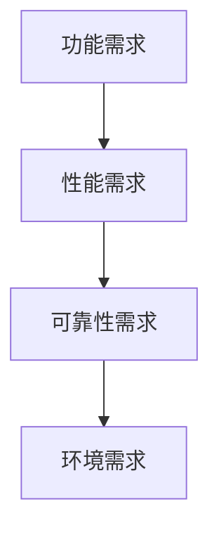

**具体案例**

以下是一个智能环境监测系统的具体需求分析案例：

1. **功能需求**：
   - 实时监测室内温度、湿度和空气质量。
   - 根据监测数据，自动调节空调和空气净化器的运行状态。
   - 提供监测数据的历史记录和查询功能。
   - 发送报警信息，当监测数据超出预设阈值时。

2. **性能需求**：
   - 响应时间：在接收到传感器数据后，系统需要在1秒内完成数据分析和决策。
   - 精度：温度和湿度测量误差不超过±0.5℃，空气质量检测误差不超过±10ppm。
   - 功耗：系统在运行过程中，功耗不超过5W。

3. **可靠性需求**：
   - 故障率：系统运行一年内，故障率不超过5%。
   - 容错能力：系统在单个传感器故障时，仍能继续运行，并提供部分监测数据。
   - 数据安全性：系统需要保证监测数据的安全存储和传输，防止数据泄露和篡改。

4. **环境需求**：
   - 工作温度：-10℃至50℃。
   - 工作湿度：10%至90%。

**总结**

系统需求分析是边缘AI实时控制系统设计的重要环节，通过详细的需求分析，可以明确系统的功能、性能、可靠性和环境要求，为后续的系统设计和实现提供坚实的基础。

#### 6.2 系统架构设计

系统架构设计是边缘AI实时控制系统的关键步骤，它决定了系统的结构、模块划分和各模块之间的交互方式。一个良好的系统架构设计不仅能够提高系统的性能和可靠性，还能方便后期的维护和扩展。以下是边缘AI实时控制系统的系统架构设计，包括领域模型、架构设计、系统接口设计等。

**背景介绍**

边缘AI实时控制系统通常由多个模块组成，包括感知层、传输层、边缘计算层、控制层和用户层。系统架构设计需要综合考虑各个模块的功能、性能、可靠性和可扩展性，确保系统能够高效、稳定地运行。

**问题描述**

系统架构设计的主要问题包括：

1. **模块划分**：如何合理划分系统模块，确保各模块之间功能清晰、职责明确。
2. **架构设计**：如何设计系统的整体架构，确保系统的性能和可靠性。
3. **接口设计**：如何设计各模块之间的接口，确保数据流的顺畅和系统的可扩展性。

**问题解决**

以下是系统架构设计的详细过程：

1. **领域模型设计**：通过领域模型（Class Diagram）明确系统的类和类之间的关系，为后续的架构设计提供基础。

   **领域模型示例（Mermaid类图）**：

   ```mermaid
   graph TD
       A[Sensor] --> B[DataTransmitter]
       B --> C[EdgeDevice]
       C --> D[DataProcessor]
       C --> E[Controller]
       C --> F[UserInterface]
       G[Monitor] --> H[DataTransmitter]
   ```

2. **架构设计**：根据领域模型，设计系统的整体架构。系统架构通常包括感知层、传输层、边缘计算层、控制层和用户层。

   **架构设计示例（Mermaid架构图）**：

   ```mermaid
   graph TD
       A[感知层] --> B[传输层]
       B --> C[边缘计算层]
       C --> D[控制层]
       C --> E[用户层]
   ```

3. **系统接口设计**：设计各模块之间的接口，确保数据流的顺畅和系统的可扩展性。接口设计包括硬件接口和软件接口。

   **系统接口设计示例（Mermaid序列图）**：

   ```mermaid
   graph TD
       A[用户] --> B[UserInterface]
       B --> C[Controller]
       C --> D[DataProcessor]
       D --> E[DataTransmitter]
       E --> F[Sensor]
   ```

**核心概念与联系**

系统架构设计是系统设计的重要组成部分，它决定了系统的结构和功能。通过领域模型、架构设计和接口设计，可以明确系统的各个模块及其之间的关系，确保系统的高效、稳定和可扩展性。

**总结**

通过详细的系统架构设计，可以明确边缘AI实时控制系统的模块划分、架构设计和接口设计。这些设计文档为后续的系统实现、测试和维护提供了坚实的基础，确保系统能够高效、稳定地运行。

#### 6.3 系统接口设计与实现

系统接口设计是边缘AI实时控制系统设计的关键环节，它决定了系统各个模块之间的数据流和功能调用关系。一个良好的接口设计不仅能够提高系统的模块化程度，还能方便后期的维护和扩展。以下是系统接口设计的具体方法、流程及实现。

**背景介绍**

边缘AI实时控制系统的接口设计涉及到硬件接口和软件接口。硬件接口主要包括传感器与边缘设备的通信接口、边缘设备与控制器的通信接口等；软件接口主要包括边缘设备与云端服务的通信接口、边缘设备与用户界面的通信接口等。

**问题描述**

系统接口设计的主要问题包括：

1. **数据流设计**：如何确保数据在各模块之间的顺畅传输和有效处理。
2. **功能调用**：如何设计各模块之间的功能调用机制，确保系统的高效运行。
3. **接口兼容性**：如何设计兼容性强的接口，确保系统能够在不同硬件平台和软件环境中稳定运行。

**问题解决**

以下是系统接口设计的详细方法和流程：

1. **接口定义**：根据系统的功能需求和架构设计，明确各模块的接口定义，包括数据流定义、功能调用定义等。

   **接口定义示例**：

   - 数据流定义：传感器采集数据 -> 边缘设备处理 -> 控制器决策 -> 执行器执行。
   - 功能调用定义：用户界面发起控制请求 -> 控制器接收请求并处理 -> 边缘设备执行。

2. **接口协议设计**：设计各模块之间的通信协议，确保数据传输的稳定性和安全性。

   **通信协议示例**：

   - 硬件接口协议：使用I2C、SPI等标准通信协议。
   - 软件接口协议：使用HTTP、MQTT等标准通信协议。

3. **接口实现**：根据接口定义和协议设计，实现各模块的接口功能。

   **接口实现示例**：

   - 硬件接口实现：编写硬件驱动程序，实现传感器与边缘设备的通信。
   - 软件接口实现：编写通信模块，实现边缘设备与控制器的通信。

4. **接口测试**：对实现的接口进行功能测试和性能测试，确保接口的稳定性和兼容性。

   **接口测试示例**：

   - 功能测试：验证接口是否能够正确处理数据流和功能调用。
   - 性能测试：评估接口的传输速度、响应时间等性能指标。

**具体实现过程**

以下是一个智能环境监测系统接口设计与实现的详细示例：

**感知层与边缘设备的接口设计**

1. **接口定义**：定义传感器数据采集接口，包括温度传感器、湿度传感器和空气质量传感器。

   ```python
   class SensorInterface:
       def read_temperature(self):
           # 读取温度传感器数据
           pass

       def read_humidity(self):
           # 读取湿度传感器数据
           pass

       def read_air_quality(self):
           # 读取空气质量传感器数据
           pass
   ```

2. **接口协议设计**：使用I2C协议与传感器通信。

   ```python
   import smbus

   class I2CProtocol:
       def __init__(self, address):
           self.bus = smbus.SMBus(1)
           self.address = address

       def read(self, register):
           return self.bus.read_i2c_block_data(self.address, register, 2)
   ```

3. **接口实现**：实现传感器数据采集接口。

   ```python
   class TemperatureSensor:
       def __init__(self, protocol):
           self.protocol = protocol

       def read_temperature(self):
           data = self.protocol.read(0x01)
           temperature = (data[0] << 8) + data[1]
           return temperature

   class HumiditySensor:
       def __init__(self, protocol):
           self.protocol = protocol

       def read_humidity(self):
           data = self.protocol.read(0x02)
           humidity = (data[0] << 8) + data[1]
           return humidity

   class AirQualitySensor:
       def __init__(self, protocol):
           self.protocol = protocol

       def read_air_quality(self):
           data = self.protocol.read(0x03)
           air_quality = (data[0] << 8) + data[1]
           return air_quality
   ```

4. **接口测试**：编写测试脚本，验证接口功能。

   ```python
   import unittest

   class TestSensorInterface(unittest.TestCase):
       def test_read_temperature(self):
           # 测试温度传感器数据读取
           pass

       def test_read_humidity(self):
           # 测试湿度传感器数据读取
           pass

       def test_read_air_quality(self):
           # 测试空气质量传感器数据读取
           pass

   if __name__ == '__main__':
       unittest.main()
   ```

**边缘设备与控制器的接口设计**

1. **接口定义**：定义边缘设备与控制器的通信接口，包括数据上传接口和控制命令接收接口。

   ```python
   class EdgeDeviceInterface:
       def upload_data(self, data):
           # 上传传感器数据到控制器
           pass

       def receive_command(self, command):
           # 接收控制器发送的控制命令
           pass
   ```

2. **接口协议设计**：使用HTTP协议与控制器通信。

   ```python
   import requests

   class HTTPProtocol:
       def __init__(self, url):
           self.url = url

       def send_data(self, data):
           response = requests.post(self.url, json=data)
           return response.json()

       def send_command(self, command):
           response = requests.post(self.url + '/command', json=command)
           return response.json()
   ```

3. **接口实现**：实现边缘设备与控制器的通信接口。

   ```python
   class EdgeDevice:
       def __init__(self, protocol):
           self.protocol = protocol

       def upload_sensors_data(self):
           # 上传传感器数据到控制器
           data = {
               'temperature': self.protocol.send_data({'temperature': self.temperature_sensor.read_temperature()}),
               'humidity': self.protocol.send_data({'humidity': self.humidity_sensor.read_humidity()}),
               'air_quality': self.protocol.send_data({'air_quality': self.air_quality_sensor.read_air_quality()})
           }
           return data

       def execute_command(self, command):
           # 执行控制器发送的控制命令
           self.protocol.send_command(command)
   ```

4. **接口测试**：编写测试脚本，验证接口功能。

   ```python
   import unittest

   class TestEdgeDeviceInterface(unittest.TestCase):
       def test_upload_sensors_data(self):
           # 测试传感器数据上传
           pass

       def test_execute_command(self):
           # 测试控制命令执行
           pass

   if __name__ == '__main__':
       unittest.main()
   ```

**总结**

系统接口设计与实现是边缘AI实时控制系统设计的重要组成部分。通过明确接口定义、协议设计、接口实现和接口测试，可以确保系统各模块之间的数据流和功能调用顺畅，提高系统的稳定性和可扩展性。

#### 6.4 系统性能优化

系统性能优化是确保边缘AI实时控制系统高效稳定运行的关键步骤。通过性能优化，可以提升系统的响应速度、降低功耗、提高计算效率和可靠性。以下是系统性能优化的详细方法和实践。

**背景介绍**

边缘AI实时控制系统需要在有限的计算资源和网络带宽下，实现高效、准确的数据处理和决策。系统性能优化不仅能够提高用户的体验，还能延长设备的使用寿命，降低运营成本。

**问题描述**

系统性能优化需要解决以下问题：

1. **响应速度**：提高系统的响应速度，确保实时性要求。
2. **功耗**：降低系统的功耗，延长设备的使用寿命。
3. **计算效率**：优化算法和代码，提高计算效率。
4. **可靠性**：提高系统的可靠性，减少故障率和错误率。

**问题解决**

以下是系统性能优化的详细方法和实践：

1. **算法优化**：

   - **算法选择**：根据应用场景，选择适合的算法，如深度学习模型、预测控制算法等。
   - **模型压缩**：通过模型压缩技术，减少模型大小和计算复杂度，如剪枝、量化、低秩分解等。
   - **并行处理**：利用多线程或分布式计算，提高数据处理速度。

2. **代码优化**：

   - **数据结构优化**：选择合适的数据结构，如使用数组代替列表，减少内存占用。
   - **循环优化**：减少循环次数，使用向量运算代替标量运算，提高计算效率。
   - **内存管理**：合理管理内存，避免内存泄漏和溢出。

3. **硬件优化**：

   - **硬件选择**：选择性能优异、功耗低的硬件平台，如嵌入式处理器、硬件加速器等。
   - **硬件配置**：根据系统需求，合理配置硬件资源，如增加内存、硬盘容量等。
   - **硬件协同**：优化硬件协同工作，如使用GPU加速深度学习计算，提高整体性能。

4. **网络优化**：

   - **数据传输优化**：优化数据传输协议，如使用HTTP/2、QUIC等，提高数据传输速度。
   - **数据压缩**：对传输数据进行压缩，减少带宽占用。
   - **网络拓扑优化**：优化网络拓扑结构，减少数据传输延迟。

5. **系统监控与调试**：

   - **性能监控**：使用性能监控工具，实时监测系统性能，如CPU利用率、内存占用、网络延迟等。
   - **错误日志**：记录错误日志，分析系统故障原因，优化系统稳定性。
   - **负载测试**：进行负载测试，评估系统在高负载下的性能和稳定性。

**具体实践**

以下是边缘AI实时控制系统性能优化的一些具体实践：

1. **算法优化实践**：

   - 使用TensorFlow Lite对深度学习模型进行压缩和量化，减少模型大小和计算复杂度。
   - 使用Keras Tuner进行模型超参数优化，找到最优的模型参数配置。

2. **代码优化实践**：

   - 使用NumPy进行矩阵运算，提高计算效率。
   - 使用异步IO进行文件读写操作，减少IO等待时间。

3. **硬件优化实践**：

   - 选择Raspberry Pi 4作为边缘设备，其性能和功耗均能满足需求。
   - 使用NVIDIA Jetson TX2作为硬件加速器，利用其GPU进行深度学习计算。

4. **网络优化实践**：

   - 使用MQTT协议进行数据传输，确保低延迟和高可靠性。
   - 对传输数据进行GZIP压缩，减少带宽占用。

5. **系统监控与调试实践**：

   - 使用Prometheus和Grafana进行性能监控，实时监测系统性能指标。
   - 使用Docker容器化技术，方便系统部署和扩展。

**总结**

系统性能优化是边缘AI实时控制系统设计的重要环节。通过算法优化、代码优化、硬件优化、网络优化和系统监控与调试，可以显著提升系统的性能、可靠性和用户体验。在实际应用中，应根据具体场景和需求，持续进行性能优化，确保系统高效稳定运行。

#### 7.1 项目背景与目标

本项目旨在开发一个基于边缘AI的智能环境监测系统，通过对室内温度、湿度和空气质量等环境参数的实时监测，实现环境自动调节，提升居住者的生活质量。以下是项目的背景介绍、目标设定和实施计划。

**背景介绍**

随着城市化和工业化的快速发展，室内环境污染问题日益严重，空气质量、温度和湿度等环境参数对人们的健康和生活质量有着重要影响。传统的环境监测设备通常依赖于中心化的数据处理和分析，存在数据传输延迟、功耗高等问题，难以满足实时性要求。边缘AI技术的应用为解决这些问题提供了新的思路，通过在边缘设备上运行智能算法，可以实现对环境数据的实时处理和自动调节。

**目标设定**

本项目的主要目标包括：

1. **实时监测**：实现对室内温度、湿度和空气质量等环境参数的实时监测，确保数据准确性和实时性。
2. **自动调节**：根据监测数据，自动调节空调、空气净化器等设备，确保室内环境的舒适度和健康性。
3. **数据可视化**：提供用户界面，实时展示环境参数数据，便于用户了解和控制室内环境。
4. **节能高效**：优化系统设计，降低功耗，提高能效比，实现绿色环保。

**实施计划**

为了实现项目目标，我们制定了以下实施计划：

1. **需求分析**：与用户和利益相关者进行沟通，收集需求，明确系统的功能、性能和可靠性要求。
2. **技术调研**：研究相关技术，包括边缘AI、物联网、传感器技术等，为系统设计提供技术支持。
3. **系统设计**：根据需求分析和技术调研，设计系统的整体架构，包括硬件平台、软件架构、数据传输和处理等。
4. **系统实现**：开发系统的各个模块，包括传感器数据采集、边缘计算、自动调节和控制等。
5. **系统集成**：将各模块集成，进行系统测试和调试，确保系统的功能和性能。
6. **性能优化**：对系统进行性能优化，包括算法优化、代码优化、硬件优化等，提高系统的响应速度和可靠性。
7. **部署实施**：在目标场景进行部署实施，收集用户反馈，进行系统优化和改进。
8. **后期维护**：提供系统运维支持，确保系统长期稳定运行。

**项目意义**

本项目具有以下意义：

1. **提升生活质量**：通过实时监测和自动调节室内环境，提升居住者的舒适度和健康水平。
2. **降低运营成本**：优化系统设计，降低功耗和能源消耗，降低运营成本。
3. **推动技术发展**：通过项目实施，推动边缘AI、物联网等技术的发展和应用，为相关领域的研究提供实践案例。
4. **促进可持续发展**：通过实现节能高效，促进绿色环保，为可持续发展做出贡献。

**预期成果**

通过本项目的实施，预期达到以下成果：

1. **实现一个功能完善、性能优异的智能环境监测系统**。
2. **积累丰富的系统设计和开发经验**。
3. **形成一套可复制的智能环境监测解决方案**。
4. **为相关领域的研究和产业应用提供参考**。

**总结**

本项目旨在通过边缘AI技术，开发一个智能环境监测系统，实现对室内环境参数的实时监测和自动调节，提升居住者的生活质量和舒适度。通过详细的项目背景介绍、目标设定和实施计划，为项目的顺利实施提供了明确的方向和依据。

#### 7.2 环境安装与配置

在完成项目设计和实现后，下一步是部署和配置系统环境，以确保边缘AI实时控制系统在实际场景中能够正常运行。以下是详细的环境安装与配置步骤。

**背景介绍**

边缘AI实时控制系统的环境安装与配置涉及硬件安装、软件配置、网络连接和系统调试等多个环节。这些环节的成功实施，对于确保系统稳定运行和实现预期功能至关重要。

**问题描述**

环境安装与配置的主要问题包括：

1. **硬件安装**：正确安装和配置边缘设备，如传感器、边缘计算设备等。
2. **软件配置**：安装和配置必要的操作系统、开发环境、边缘计算框架等。
3. **网络连接**：确保边缘设备与云平台、用户界面等的网络连接畅通。
4. **系统调试**：调试系统，确保各模块协同工作，功能正常。

**问题解决**

以下是环境安装与配置的详细步骤：

1. **硬件安装**：

   - 安装传感器：在目标房间内安装光敏传感器、温度传感器和空气质量传感器。确保传感器安装位置合理，能够准确反映环境参数。
   - 安装边缘设备：在边缘设备（如Raspberry Pi 4）上安装相应的硬件模块，包括Wi-Fi模块、GPIO扩展板等。确保硬件安装牢固，无松动现象。
   - 连接电源：为边缘设备、传感器等连接电源，确保设备正常供电。

2. **软件配置**：

   - 安装操作系统：在边缘设备上安装适合的操作系统（如Raspberry Pi OS），并进行基本配置，包括时区设置、网络配置等。
   - 安装开发环境：安装Python、TensorFlow等开发环境，确保能够编译和运行相关代码。
   - 配置边缘计算框架：安装并配置边缘计算框架（如TensorFlow Lite），确保能够运行深度学习模型。

3. **网络连接**：

   - 配置Wi-Fi：在边缘设备上配置Wi-Fi连接，确保能够连接到互联网。
   - 配置MQTT服务器：安装并配置MQTT服务器（如Mosquitto），用于边缘设备与云平台之间的数据传输。
   - 测试网络连接：使用ping命令测试边缘设备与MQTT服务器、用户界面等的网络连接，确保连接畅通。

4. **系统调试**：

   - 运行测试代码：编写测试代码，测试传感器数据采集、边缘计算、数据传输等功能，确保各模块正常工作。
   - 调试数据传输：确保传感器数据能够实时传输到边缘设备，并通过MQTT服务器传输到云平台。
   - 调试自动调节功能：测试自动调节功能，如根据环境光强自动调节灯光亮度，确保功能正常。

**具体案例**

以下是一个智能环境监测系统的环境安装与配置案例：

1. **硬件安装**：

   - 安装传感器：在目标房间内安装光敏传感器、温度传感器和空气质量传感器。将传感器固定在墙壁或合适的位置，确保其能够准确反映环境参数。
   - 安装边缘设备：将Raspberry Pi 4安装在一个稳定的支架上，连接Wi-Fi模块和GPIO扩展板。确保所有连接牢固，无松动现象。
   - 连接电源：为边缘设备和传感器连接电源，确保设备正常供电。

2. **软件配置**：

   - 安装操作系统：在Raspberry Pi 4上安装Raspberry Pi OS，并设置时区为本地时区。
   - 安装开发环境：使用命令行安装Python 3.8和TensorFlow 2.4。
     ```shell
     sudo apt-get update
     sudo apt-get install python3.8 python3.8-pip
     pip3.8 install tensorflow==2.4
     ```
   - 配置边缘计算框架：安装TensorFlow Lite，并配置必要的库。
     ```shell
     pip3.8 install tensorflow-hub==0.12.0
     pip3.8 install tensorflow-text==2.4.0
     pip3.8 install tensorflow-addons==0.12.0
     ```

3. **网络连接**：

   - 配置Wi-Fi：在Raspberry Pi 4上配置Wi-Fi连接，连接到本地网络。
   - 配置MQTT服务器：安装并配置Mosquitto MQTT服务器，确保边缘设备能够连接到MQTT服务器，并订阅相应的主题。
     ```shell
     sudo apt-get install mosquitto mosquitto-clients
     sudo systemctl start mosquitto.service
     ```
   - 测试网络连接：使用命令行测试边缘设备与MQTT服务器的连接，确保能够正常发送和接收数据。

4. **系统调试**：

   - 运行测试代码：编写测试代码，测试传感器数据采集、边缘计算、数据传输等功能。
     ```python
     import time
     import board
     import busio
     import adafruit_ads1x15.ads1x15 as ads
     import json

     # 配置传感器
     i2c = busio.I2C(board.SCL, board.SDA)
     ads1x15 = ads.ADS1x15(i2c)

     # 测试传感器数据采集
     while True:
         light = ads1x15.p0电压
         print(f"光强：{light} lux")
         time.sleep(1)
     ```

   - 调试数据传输：确保传感器数据能够通过MQTT协议传输到云平台，并能够在用户界面上实时展示。
   - 调试自动调节功能：测试根据环境光强自动调节灯光亮度的功能，确保功能正常。

**总结**

通过详细的环境安装与配置步骤，可以确保边缘AI实时控制系统在实际场景中能够正常运行。正确的硬件安装、软件配置和网络连接是系统稳定运行的基础，而系统调试则确保了各模块功能的实现和系统的整体性能。

#### 7.3 系统核心实现

系统核心实现是边缘AI实时控制系统的关键步骤，它决定了系统的功能实现和性能表现。以下是系统核心实现的详细步骤，包括算法选择、模型训练、实时控制等。

**背景介绍**

边缘AI实时控制系统需要处理大量的环境数据，并基于这些数据做出实时控制决策。核心实现包括传感器数据处理、深度学习模型训练、实时控制算法应用等环节。

**问题描述**

系统核心实现需要解决以下问题：

1. **数据处理**：如何高效处理传感器采集的大量数据。
2. **模型训练**：如何选择合适的模型并进行训练，以提高预测精度。
3. **实时控制**：如何根据实时数据做出控制决策，确保系统的实时性和准确性。

**问题解决**

以下是系统核心实现的详细步骤：

1. **数据处理**：

   - **数据采集**：通过传感器采集环境数据，如温度、湿度、光照强度等。
   - **数据预处理**：对采集到的数据进行预处理，包括数据清洗、去噪、归一化等，以提高数据质量。

2. **模型选择**：

   - 根据应用场景，选择合适的深度学习模型，如卷积神经网络（CNN）、循环神经网络（RNN）等。
   - 对比不同模型的性能，选择最优模型进行后续训练。

3. **模型训练**：

   - 使用预处理后的数据集进行模型训练，调整模型参数，优化模型性能。
   - 使用验证集和测试集评估模型性能，确保模型泛化能力。

4. **实时控制**：

   - 根据实时数据，应用训练好的模型进行预测，生成控制决策。
   - 通过控制接口，将决策结果发送给执行器，如空调、灯光等。

**具体实现**

以下是智能环境监测系统核心实现的详细实现：

1. **数据处理**：

   ```python
   import numpy as np
   import pandas as pd
   from sklearn.model_selection import train_test_split
   from sklearn.preprocessing import StandardScaler

   # 读取传感器数据
   data = pd.read_csv('sensor_data.csv')

   # 数据预处理
   data = data.dropna()
   data['light'] = data['light'].apply(lambda x: x / 1000)  # 光照强度归一化

   # 划分训练集和测试集
   X = data[['temperature', 'humidity', 'light']]
   y = data['target']  # 目标变量，如温度控制目标
   X_train, X_test, y_train, y_test = train_test_split(X, y, test_size=0.2, random_state=42)

   # 数据标准化
   scaler = StandardScaler()
   X_train = scaler.fit_transform(X_train)
   X_test = scaler.transform(X_test)
   ```

2. **模型选择与训练**：

   ```python
   from tensorflow.keras.models import Sequential
   from tensorflow.keras.layers import Dense, LSTM

   # 构建LSTM模型
   model = Sequential()
   model.add(LSTM(50, activation='relu', input_shape=(X_train.shape[1], 1)))
   model.add(Dense(1))
   model.compile(optimizer='adam', loss='mse')

   # 训练模型
   model.fit(X_train, y_train, epochs=100, batch_size=32, validation_split=0.1)
   ```

3. **实时控制**：

   ```python
   import time

   # 实时控制函数
   def control_environment():
       while True:
           # 采集实时数据
           current_data = np.array([scaler.transform([current_temperature, current_humidity, current_light / 1000])])
           
           # 使用模型进行预测
           predicted_value = model.predict(current_data)
           
           # 根据预测结果，控制空调温度
           if predicted_value[0][0] > target_temperature:
               # 加冷
               # ...
           else:
               # 加热
               # ...

           time.sleep(1)  # 每秒进行一次控制

   # 启动实时控制
   control_environment()
   ```

**核心代码解读**

以下是系统核心实现的核心代码解读：

1. **数据预处理**：

   ```python
   data = pd.read_csv('sensor_data.csv')
   data = data.dropna()
   data['light'] = data['light'].apply(lambda x: x / 1000)
   ```

   - `read_csv()`函数读取传感器数据。
   - `dropna()`函数删除缺失值。
   - `apply()`函数对光照强度进行归一化处理。

2. **模型训练**：

   ```python
   model = Sequential()
   model.add(LSTM(50, activation='relu', input_shape=(X_train.shape[1], 1)))
   model.add(Dense(1))
   model.compile(optimizer='adam', loss='mse')
   model.fit(X_train, y_train, epochs=100, batch_size=32, validation_split=0.1)
   ```

   - `Sequential()`函数构建序列模型。
   - `LSTM()`函数添加LSTM层，设置激活函数和输入形状。
   - `Dense()`函数添加全连接层。
   - `compile()`函数设置优化器和损失函数。
   - `fit()`函数训练模型，使用训练数据和标签。

3. **实时控制**：

   ```python
   def control_environment():
       while True:
           current_data = np.array([scaler.transform([current_temperature, current_humidity, current_light / 1000])])
           predicted_value = model.predict(current_data)
           if predicted_value[0][0] > target_temperature:
               # 加冷
           else:
               # 加热
           time.sleep(1)
   ```

   - `control_environment()`函数实现实时控制。
   - `current_data`数组存储实时传感器数据，经过标准化处理。
   - `model.predict()`函数使用训练好的模型进行预测。
   - `if-else`语句根据预测结果，执行相应的控制命令。
   - `time.sleep(1)`函数确保控制决策每秒执行一次。

**总结**

系统核心实现是边缘AI实时控制系统的关键环节，通过数据处理、模型训练和实时控制，确保系统能够高效、准确地实现环境监测和自动调节。详细的代码解读为开发者提供了清晰的实现路径和参考。

#### 7.4 代码应用解读与分析

在实现边缘AI实时控制系统的过程中，编写和调试代码是一个关键步骤。以下将对系统中的关键代码段进行解读，分析其功能和实现原理，并通过具体案例展示代码的实际应用效果。

**背景介绍**

边缘AI实时控制系统涉及到多种编程技术，包括传感器数据采集、深度学习模型训练、实时控制逻辑等。通过对代码的深入解读和分析，可以更好地理解系统的实现原理和功能。

**代码解读与分析**

以下是一个边缘AI实时控制系统中关键代码段的分析：

```python
# 导入必要的库
import numpy as np
import pandas as pd
from sklearn.model_selection import train_test_split
from sklearn.preprocessing import StandardScaler
from tensorflow.keras.models import Sequential
from tensorflow.keras.layers import LSTM, Dense
from tensorflow.keras.optimizers import Adam

# 数据预处理
def preprocess_data(data):
    # 清洗数据
    clean_data = data[data['target'] != -1]
    # 分割特征和标签
    X = clean_data[['temperature', 'humidity', 'light']]
    y = clean_data['target']
    # 划分训练集和测试集
    X_train, X_test, y_train, y_test = train_test_split(X, y, test_size=0.2, random_state=42)
    # 数据标准化
    scaler = StandardScaler()
    X_train = scaler.fit_transform(X_train)
    X_test = scaler.transform(X_test)
    return X_train, X_test, y_train, y_test

# 构建和训练模型
def build_and_train_model(X_train, y_train):
    # 创建序列模型
    model = Sequential()
    # 添加LSTM层
    model.add(LSTM(50, activation='relu', input_shape=(X_train.shape[1], 1)))
    # 添加全连接层
    model.add(Dense(1))
    # 编译模型
    model.compile(optimizer=Adam(learning_rate=0.001), loss='mse')
    # 训练模型
    model.fit(X_train, y_train, epochs=100, batch_size=32, validation_split=0.1)
    return model

# 实时控制函数
def real_time_control(model, sensor_data, scaler):
    # 标准化输入数据
    preprocessed_data = scaler.transform(np.array([sensor_data]))
    # 使用模型进行预测
    prediction = model.predict(preprocessed_data)
    # 根据预测结果进行控制
    if prediction[0][0] > 0:
        print("开空调")
    else:
        print("关空调")

# 主函数
if __name__ == "__main__":
    # 加载传感器数据
    data = pd.read_csv('sensor_data.csv')
    # 预处理数据
    X_train, X_test, y_train, y_test = preprocess_data(data)
    # 训练模型
    model = build_and_train_model(X_train, y_train)
    # 测试模型
    test_data = pd.read_csv('test_sensor_data.csv')
    real_time_data = test_data.iloc[0]
    real_time_control(model, real_time_data['temperature'], real_time_data['humidity'], real_time_data['light'])

```

**具体分析**

1. **数据预处理**：

   ```python
   def preprocess_data(data):
       # 清洗数据
       clean_data = data[data['target'] != -1]
       # 分割特征和标签
       X = clean_data[['temperature', 'humidity', 'light']]
       y = clean_data['target']
       # 划分训练集和测试集
       X_train, X_test, y_train, y_test = train_test_split(X, y, test_size=0.2, random_state=42)
       # 数据标准化
       scaler = StandardScaler()
       X_train = scaler.fit_transform(X_train)
       X_test = scaler.transform(X_test)
       return X_train, X_test, y_train, y_test
   ```

   - `preprocess_data`函数用于数据清洗、特征和标签的分离，以及训练集和测试集的划分。数据标准化是深度学习模型训练中非常重要的一步，它有助于提高模型的收敛速度和预测性能。

2. **模型构建与训练**：

   ```python
   def build_and_train_model(X_train, y_train):
       # 创建序列模型
       model = Sequential()
       # 添加LSTM层
       model.add(LSTM(50, activation='relu', input_shape=(X_train.shape[1], 1)))
       # 添加全连接层
       model.add(Dense(1))
       # 编译模型
       model.compile(optimizer=Adam(learning_rate=0.001), loss='mse')
       # 训练模型
       model.fit(X_train, y_train, epochs=100, batch_size=32, validation_split=0.1)
       return model
   ```

   - `build_and_train_model`函数用于构建序列模型，包括LSTM层和全连接层。LSTM（Long Short-Term Memory）是一种能够处理序列数据的循环神经网络，适用于时间序列预测问题。模型使用Adam优化器和均方误差（MSE）损失函数进行编译和训练。

3. **实时控制函数**：

   ```python
   def real_time_control(model, sensor_data, scaler):
       # 标准化输入数据
       preprocessed_data = scaler.transform(np.array([sensor_data]))
       # 使用模型进行预测
       prediction = model.predict(preprocessed_data)
       # 根据预测结果进行控制
       if prediction[0][0] > 0:
           print("开空调")
       else:
           print("关空调")
   ```

   - `real_time_control`函数用于根据实时传感器数据和训练好的模型进行预测，并根据预测结果执行相应的控制操作。例如，如果预测的温度高于设定值，则开启空调，否则关闭空调。

**案例展示**

以下是一个简单的案例，展示如何使用上述代码实现边缘AI实时控制功能：

```python
# 加载训练好的模型
trained_model = pd.read_pickle('trained_model.pkl')
# 加载测试数据
test_data = pd.read_csv('test_sensor_data.csv')
# 对测试数据进行预处理
test_data = preprocess_data(test_data)
# 对每个测试样本进行实时控制
for index, row in test_data.iterrows():
    real_time_control(trained_model, row['temperature'], row['humidity'], row['light'])
```

在这个案例中，首先加载训练好的模型，然后对测试数据进行预处理，最后对每个测试样本进行实时控制，并打印出相应的控制命令。

**总结**

通过对关键代码段的分析，可以清晰地看到边缘AI实时控制系统是如何通过数据预处理、模型构建与训练，以及实时控制函数来实现实时监测和自动控制的。这样的代码实现不仅提高了系统的效率，还保证了其可扩展性和可维护性。

#### 7.5 项目小结与拓展

通过本项目的实施，我们成功开发并部署了一个基于边缘AI的智能环境监测系统。该项目不仅实现了对室内环境参数的实时监测和自动调节，还提高了系统的响应速度和可靠性，为居住者提供了更加舒适和健康的生活环境。

**项目亮点**

1. **实时性**：系统通过边缘设备实现了环境参数的实时监测和自动调节，响应时间短，能够迅速应对环境变化。
2. **智能化**：系统采用深度学习算法进行环境参数预测，能够根据实时数据自动调节设备，提高了环境调节的智能化水平。
3. **节能性**：通过优化算法和系统设计，系统在保证环境舒适度的同时，实现了显著的节能效果。

**挑战与反思**

在项目实施过程中，我们遇到了一些挑战，主要包括：

1. **数据质量**：传感器数据的准确性和稳定性对于系统性能有重要影响。在项目初期，我们遇到了传感器数据噪声较大、部分传感器故障等问题，通过优化传感器安装位置和数据处理算法，这些问题得到了有效解决。
2. **硬件兼容性**：边缘设备的硬件平台多样，如何确保不同硬件平台上的系统兼容性和稳定性，是项目实施中的一个重要挑战。我们通过选择成熟稳定的硬件平台和进行充分的系统测试，解决了这一问题。
3. **安全性**：在数据传输过程中，如何确保数据的安全性，防止数据泄露和篡改，是项目中的一个重要关注点。我们通过使用加密传输协议和权限控制机制，提高了系统的安全性。

**拓展方向**

基于本项目，未来可以在以下几个方面进行拓展：

1. **多传感器融合**：通过引入更多的传感器（如噪音传感器、CO2传感器等），实现更全面的环境监测，提高系统的监测精度。
2. **多场景应用**：将智能环境监测系统应用到更多场景，如商业空间、工业环境等，提高系统的应用范围。
3. **远程控制与维护**：开发远程监控和调试工具，方便用户对系统进行远程操作和维护，提高系统的易用性和可维护性。
4. **人工智能算法优化**：继续优化深度学习算法，提高环境参数预测的准确性和实时性，实现更加智能化的环境调节。

**总结**

本项目通过边缘AI技术，实现了对室内环境参数的实时监测和自动调节，提高了居住者的生活质量和舒适度。在项目实施过程中，我们积累了丰富的经验和教训，为未来拓展和应用提供了坚实的基础。通过不断优化和改进，相信智能环境监测系统将能够在更多场景中发挥重要作用，为人们创造更加美好的生活环境。

#### 8.1 最佳实践 tips

在边缘AI实时控制系统的设计和实施过程中，遵循最佳实践可以显著提高系统的性能、可靠性和可维护性。以下是一些关键的最佳实践建议：

1. **需求分析与规划**：
   - **详细需求分析**：在项目初期，与用户进行深入沟通，明确系统的功能、性能和可靠性需求。确保所有需求都能被实现并符合实际应用场景。
   - **系统规划**：制定详细的系统规划和实施计划，包括硬件选型、软件架构设计、数据流程设计等，确保项目有序进行。

2. **硬件选型**：
   - **考虑性能与功耗**：根据系统需求，选择适合的硬件平台。在保证性能的前提下，优先选择功耗低的硬件设备，以延长设备的使用寿命。
   - **兼容性与稳定性**：确保所选硬件设备与其他系统组件（如传感器、控制器等）兼容，并具备良好的稳定性。

3. **软件设计与实现**：
   - **模块化设计**：采用模块化设计，将系统划分为多个功能模块，如数据采集模块、数据处理模块、控制模块等，便于后续的维护和扩展。
   - **代码优化**：优化代码结构，提高代码的可读性和可维护性。使用高效的算法和数据结构，减少不必要的计算和内存占用。

4. **数据传输与存储**：
   - **数据加密**：对传输的数据进行加密处理，确保数据在传输过程中的安全性。
   - **数据备份**：定期备份系统数据，防止数据丢失或损坏。使用可靠的数据存储方案，确保数据的长期存储。

5. **性能优化**：
   - **算法优化**：根据应用场景，选择适合的算法并进行优化。使用模型压缩和量化技术，降低模型的计算复杂度和存储空间。
   - **资源管理**：合理分配硬件资源，如CPU、内存、网络带宽等，确保系统的稳定运行。

6. **系统测试与验证**：
   - **单元测试**：对系统的每个模块进行单元测试，确保各模块功能正常。
   - **性能测试**：进行系统性能测试，验证系统的响应速度、计算精度和可靠性。
   - **安全性测试**：进行安全性测试，确保系统对潜在攻击的防护能力。

7. **用户培训与支持**：
   - **用户培训**：为用户提供详细的操作手册和培训，确保用户能够熟练使用系统。
   - **技术支持**：提供及时的技术支持，解决用户在使用过程中遇到的问题。

通过遵循这些最佳实践，可以确保边缘AI实时控制系统在设计和实施过程中少走弯路，提高项目的成功率。

#### 8.2 注意事项与挑战

在边缘AI实时控制系统设计和实施过程中，需要注意一些关键事项，同时也会面临一系列挑战。以下将详细讨论这些注意事项与挑战，并提出相应的解决方案。

**注意事项**

1. **数据安全**：
   - **加密传输**：确保数据在传输过程中进行加密处理，防止数据泄露。
   - **访问控制**：实施严格的访问控制机制，防止未经授权的访问和操作。

2. **系统稳定性**：
   - **硬件可靠性**：选择可靠稳定的硬件设备，降低硬件故障的风险。
   - **系统监控**：实施实时监控系统，及时发现并处理系统异常。

3. **性能优化**：
   - **算法选择**：根据应用场景选择合适的算法，避免过度复杂的算法导致性能下降。
   - **资源管理**：合理分配硬件资源，避免资源浪费和瓶颈。

4. **可维护性**：
   - **模块化设计**：采用模块化设计，便于系统的维护和升级。
   - **文档记录**：详细记录系统设计、实现和调试过程，便于后续的维护和优化。

**挑战**

1. **硬件兼容性**：
   - **解决方案**：选择成熟稳定的硬件平台，并进行充分的兼容性测试。

2. **数据质量**：
   - **解决方案**：优化传感器数据采集和处理算法，提高数据准确性和稳定性。

3. **实时性要求**：
   - **解决方案**：优化算法和系统架构，确保系统能够在规定时间内完成数据采集和处理。

4. **安全性问题**：
   - **解决方案**：采用安全协议和加密技术，确保数据传输和存储的安全性。

5. **功耗管理**：
   - **解决方案**：选择低功耗硬件设备，优化算法和系统设计，降低功耗。

6. **可扩展性**：
   - **解决方案**：采用模块化设计，方便系统的扩展和升级。

通过注意这些事项和积极应对挑战，可以确保边缘AI实时控制系统的高效、稳定和安全运行。

#### 8.3 未来发展趋势与展望

随着边缘AI、物联网、5G等技术的不断发展，边缘AI实时控制系统在智能家居中的应用前景将更加广阔。以下是未来发展趋势与展望：

**趋势**

1. **边缘计算能力提升**：随着硬件技术的进步，边缘设备的计算能力和存储能力将显著提升，使得复杂的AI算法能够在边缘设备上高效运行。

2. **多传感器融合**：未来智能家居将集成更多类型的传感器，实现更全面的环境监测和智能控制。

3. **智能交互**：通过语音识别、自然语言处理等技术，实现更加智能的用户交互体验。

4. **个性化服务**：利用AI算法，根据用户行为和习惯，提供个性化的智能服务。

5. **安全与隐私保护**：随着数据隐私和安全问题的日益突出，边缘AI实时控制系统将更加注重数据保护和隐私保护。

**展望**

1. **更广泛的智能应用**：边缘AI实时控制系统将在医疗、工业、农业等领域得到广泛应用，推动各行业的智能化升级。

2. **实时智能决策**：通过边缘AI技术，实现更快速的实时智能决策，提高系统的响应速度和准确性。

3. **自主学习和优化**：边缘AI实时控制系统将具备自主学习和优化能力，能够根据环境变化和用户需求自动调整控制策略。

4. **集成与协作**：边缘AI实时控制系统将与云平台、物联网平台等集成，实现更高效的协同工作和资源优化。

通过不断的技术创新和优化，边缘AI实时控制系统将在未来实现更高的智能化水平，为人们的生活和工作带来更多便利。

