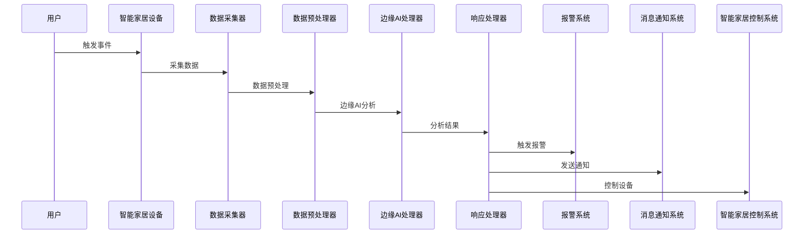
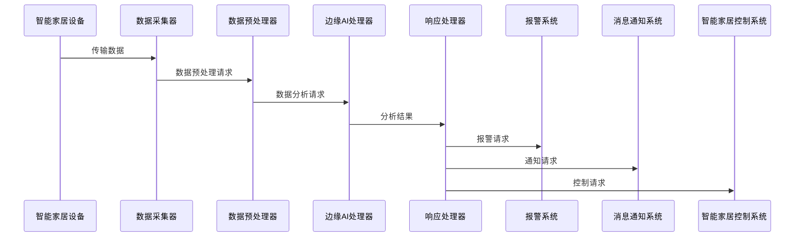

                 

### 1. 引言

#### 1.1 问题背景

随着物联网（IoT）和智能家居的迅猛发展，人们的生活变得更加便捷。然而，随之而来的安全问题也逐渐凸显。智能家居设备通常包含各种传感器和摄像头，这些设备收集的大量数据不仅包括家庭成员的行为模式，还有可能涉及个人隐私。因此，如何确保这些数据的安全，成为了一个亟待解决的重要问题。

智能家居安全监控不仅仅是简单的数据记录，它需要实时分析数据，识别异常行为，并在必要时及时响应。传统的云计算模式由于网络延迟和数据传输的瓶颈，无法满足实时性的需求。而边缘AI则通过在数据源头附近进行计算，大大提高了处理速度和响应时间。

边缘AI是一种将人工智能算法部署在靠近数据源的地方（如物联网设备、智能传感器等）的技术，它可以在本地快速处理和分析数据，而不必将数据传输到远程服务器。这种特性使得边缘AI在处理实时性要求极高的任务时，如智能家居安全监控，具有显著的优势。

本文将探讨边缘AI在智能家居安全监控中的实时应用，分析其背后的原理和实现方法，并通过实际案例，展示其在现实世界中的应用效果。

#### 1.2 问题描述

随着智能家居设备的普及，家庭安全监控成为了一个重要的应用场景。然而，传统的安全监控系统存在以下问题：

1. **延迟问题**：由于数据传输到云端进行处理，存在网络延迟，无法实现实时监控。
2. **隐私泄露**：将大量敏感数据传输到云端，可能存在隐私泄露的风险。
3. **计算能力不足**：传统服务器在处理大量实时数据时，可能因计算能力不足而影响系统性能。

边缘AI的引入，旨在解决上述问题。通过在本地设备上部署智能算法，可以实现以下目标：

1. **实时处理**：边缘AI可以在本地设备上实时分析数据，减少数据传输延迟。
2. **隐私保护**：通过在本地处理数据，减少了数据传输过程，降低了隐私泄露的风险。
3. **高效计算**：边缘设备通常具有更强的计算能力，能够更好地处理实时数据。

本文将深入探讨边缘AI在智能家居安全监控中的应用，包括算法原理、系统架构、实战案例等，以期为读者提供实用的技术参考。

#### 1.3 问题解决

边缘AI在智能家居安全监控中的应用，提供了一种有效的解决方案，能够显著提升系统的实时性和安全性。以下是一些具体的解决方法：

1. **本地数据处理**：通过在本地设备上部署边缘AI算法，可以实时分析传感器数据，实现快速响应。例如，当摄像头检测到异常动作时，边缘AI可以立即识别并进行报警，而不需要将数据上传到云端。
   
2. **隐私保护**：边缘AI可以在本地设备上处理和分析数据，避免了敏感数据在传输过程中的泄露风险。例如，家庭监控视频可以在本地设备上进行人脸识别和活动检测，只有在必要时才上传部分数据到云端。

3. **高效计算**：边缘AI设备通常具备更强的计算能力，可以更好地处理实时数据。例如，利用深度学习算法，边缘设备可以实时识别复杂的家庭场景，从而提高监控系统的准确性。

4. **集成与协同**：边缘AI可以与其他智能家居设备进行集成，实现协同监控。例如，当有入侵者进入家中时，边缘AI可以激活门锁、报警系统和摄像头，形成一个完整的安防系统。

通过上述方法，边缘AI在智能家居安全监控中不仅提高了系统的实时性和安全性，还降低了系统的复杂性和成本。这使得边缘AI成为智能家居安全监控领域的一个重要技术趋势。

#### 1.4 边界与外延

在探讨边缘AI在智能家居安全监控中的实时应用时，我们需要明确一些边界和概念。首先，边缘AI虽然具有本地数据处理的优势，但其计算能力和存储容量仍然有限，因此在某些复杂场景下，仍需依赖云计算。

此外，边缘AI的应用不仅限于家庭安全监控，还可以扩展到智能城市、工业自动化等领域。例如，在智能城市中，边缘AI可以用于交通流量监控、环境监测等；在工业自动化中，可以用于设备状态监控、故障预测等。

本文主要关注的是边缘AI在家庭安全监控中的应用，通过具体的案例，展示其在提升系统实时性和安全性方面的潜力。然而，边缘AI技术的应用前景远不止于此，未来随着技术的不断进步，它将在更多领域发挥重要作用。

#### 1.5 概念结构与核心要素组成

边缘AI在智能家居安全监控中的应用，涉及多个关键概念和要素。首先，需要了解边缘AI的基本架构和核心原理。边缘AI通常由边缘设备、边缘服务器和中心数据库组成，其中边缘设备负责数据采集和初步处理，边缘服务器执行具体的算法任务，中心数据库则用于存储和管理数据。

在智能家居安全监控中，边缘AI的关键要素包括：

1. **传感器数据采集**：智能家居设备如摄像头、门锁、烟雾传感器等，负责实时采集家庭环境数据。
2. **边缘计算**：边缘设备上的边缘AI算法对采集到的数据进行实时分析，识别异常行为。
3. **数据处理与决策**：边缘AI算法不仅进行数据处理，还根据分析结果做出决策，如触发报警、发送通知等。
4. **数据同步与存储**：边缘AI处理后的数据需要同步到中心数据库，以便长期存储和查询。

通过这些要素的协同工作，边缘AI在智能家居安全监控中实现了实时性和高效性的有机结合，为家庭安全提供了强有力的保障。

---

## 2. 边缘AI概述

### 2.1 定义与特点

边缘AI是指将人工智能算法部署在靠近数据源的地方，如物联网设备、智能传感器等，以实现本地化计算和决策的技术。与传统的云计算相比，边缘AI具有以下显著特点：

1. **低延迟**：由于数据在本地设备上处理，边缘AI可以大幅降低数据传输和计算延迟，适用于实时性要求高的应用场景。
2. **高效计算**：边缘AI设备通常具备较高的计算能力，能够快速处理大量数据，满足实时分析的需求。
3. **隐私保护**：通过在本地设备上处理数据，边缘AI可以减少数据传输过程中的隐私泄露风险。
4. **灵活部署**：边缘AI可以在各种硬件设备上运行，如智能摄像头、智能门锁等，具有很高的灵活性。

边缘AI的核心优势在于其本地化和实时性的特点，这使得它非常适合应用于需要快速响应和低延迟的智能系统，如智能家居安全监控、工业自动化、智能交通等。

### 2.2 边缘计算与云计算对比

边缘计算和云计算是两种不同的数据处理模式，各有其优缺点。以下是两者的主要对比：

| 对比维度 | 边缘计算 | 云计算 |
| :---: | :---: | :---: |
| **计算位置** | 数据源头附近（如物联网设备） | 远程数据中心 |
| **延迟** | 低延迟（接近实时） | 高延迟（受网络速度影响） |
| **计算能力** | 受限于设备硬件，但逐渐提升 | 强大的计算能力，但资源集中 |
| **数据隐私** | 本地处理，隐私风险较低 | 数据传输过程中可能泄露 |
| **灵活性** | 高，适用于各种设备和环境 | 低，依赖于中心化服务器 |
| **成本** | 初期投资较高，维护成本低 | 初期投资较低，后期运营成本高 |
| **可靠性** | 受设备稳定性影响 | 中心化服务器通常更稳定 |

从上表可以看出，边缘计算和云计算各有优劣，选择哪种模式取决于具体应用的需求和场景。在需要实时响应和低延迟的场景中，如智能家居安全监控，边缘计算具有明显的优势。

### 2.3 边缘AI的优势与应用场景

边缘AI在处理速度和实时性方面具有显著优势，这使得它非常适合应用于需要快速响应和低延迟的场景。以下是一些典型的应用场景：

1. **智能家居安全监控**：边缘AI可以在本地设备上实时分析摄像头和传感器数据，快速识别异常行为，如入侵者、火灾等，并立即触发报警，提高响应速度。
   
2. **智能交通监控**：边缘AI可以实时处理交通摄像头和传感器数据，快速识别交通拥堵、交通事故等，并提供实时交通信息，优化交通管理。

3. **工业自动化**：边缘AI可以实时监控工业设备的状态数据，预测设备故障，提前进行维护，提高设备运行效率和降低维护成本。

4. **医疗健康监测**：边缘AI可以实时分析健康监测设备的数据，如心率、血压等，及时发现异常，提供实时健康建议，提高医疗服务的效率和质量。

通过上述应用，边缘AI不仅提高了系统的实时性和响应速度，还增强了系统的灵活性和可靠性，为各种智能系统提供了强大的技术支持。

---

## 3. 智能家居安全监控需求

### 3.1 安全监控的重要性

智能家居安全监控在现代社会中扮演着越来越重要的角色。随着物联网技术的普及，越来越多的家庭开始使用各种智能设备，如摄像头、门锁、烟雾传感器等。这些设备虽然提高了生活的便捷性，但也带来了新的安全隐患。家庭安全监控可以实时监测家庭环境，及时发现并处理潜在的安全威胁，如入侵、火灾、煤气泄漏等，从而保障家庭成员的人身和财产安全。

### 3.2 智能家居环境特点

智能家居环境具有以下几个显著特点：

1. **多样性**：智能家居设备种类繁多，包括摄像头、门锁、烟雾传感器、煤气传感器、温度传感器等，每种设备都可能产生大量的数据。
2. **实时性**：家庭安全监控需要实时响应，一旦发生紧急情况，系统需要立即采取行动，如报警、发送通知等。
3. **隐私敏感性**：智能家居设备常常涉及家庭成员的隐私信息，如行为模式、生活习惯等，这些数据需要得到妥善处理和保护。

### 3.3 安全监控挑战与需求分析

在智能家居安全监控中，存在以下几个主要挑战：

1. **数据量巨大**：智能家居设备会产生大量的数据，如何高效处理和存储这些数据成为了一个难题。
2. **实时性要求高**：家庭安全监控需要快速响应，任何延迟都可能造成严重的后果。
3. **隐私保护**：智能家居设备涉及到个人隐私信息，如何保护这些数据不被泄露是一个重要的问题。

针对上述挑战，智能家居安全监控的需求主要包括：

1. **高效数据处理**：需要能够快速处理大量传感器数据，并及时做出反应。
2. **实时监控**：系统需要具备实时监测功能，能够在第一时间发现异常情况。
3. **数据安全**：需要采取有效的措施，确保数据在采集、传输、存储等各个环节得到妥善保护。

通过边缘AI技术的应用，可以有效解决上述挑战。边缘AI可以在本地设备上进行实时数据处理和分析，减少数据传输延迟，提高系统响应速度；同时，通过在本地进行数据预处理和隐私保护，可以有效降低隐私泄露风险。

---

## 4. 实时应用的重要性

### 4.1 实时性的定义

实时性是指在特定的时间限制内，系统对输入的数据进行处理并产生输出的能力。在智能家居安全监控中，实时性至关重要，它确保系统能够在紧急情况下迅速响应，从而降低潜在风险。

### 4.2 实时应用的优势

1. **快速响应**：实时应用能够迅速分析传感器数据，快速识别异常情况，并立即触发相应的响应措施，如报警、通知等，从而减少事故发生的时间和损失。
   
2. **减少数据延迟**：通过本地实时处理数据，可以大幅减少数据传输到云端的时间，提高系统的响应速度。

3. **提高系统效率**：实时应用能够及时对系统状态进行调整，优化资源配置，提高系统的整体运行效率。

4. **增强用户体验**：实时监控和快速响应能够提高用户对智能家居系统的满意度，增强用户体验。

### 4.3 实时应用的挑战

1. **计算资源限制**：边缘设备通常计算能力和存储容量有限，需要高效利用资源以实现实时处理。

2. **数据隐私保护**：实时应用需要处理大量敏感数据，如何保护数据隐私成为一大挑战。

3. **可靠性保障**：实时应用要求系统在极端情况下仍然能够稳定运行，保障系统的可靠性。

4. **边缘与云的协同**：在边缘设备与云服务器之间实现高效的数据传输和协同处理，需要解决网络延迟和带宽限制等问题。

通过采用边缘AI技术，可以克服上述挑战，实现高效、可靠的实时应用。边缘AI可以在本地设备上进行实时数据处理和分析，减少数据传输延迟，同时通过在边缘与云端之间的协同处理，实现更高效的资源利用和更可靠的系统运行。

---

## 5. 边缘AI算法原理

### 5.1 基本流程

边缘AI算法的基本流程可以分为以下几个步骤：

1. **数据采集**：边缘设备（如摄像头、传感器等）收集家庭环境中的数据，如图像、声音、温度、湿度等。
2. **数据预处理**：对采集到的原始数据进行清洗和格式化，以便后续处理。例如，对图像进行缩放、裁剪，对声音进行降噪等。
3. **模型训练**：使用历史数据对AI模型进行训练，使其能够学习识别各种异常行为。常用的模型包括卷积神经网络（CNN）、循环神经网络（RNN）等。
4. **实时预测**：将实时采集到的数据输入训练好的模型，进行预测和分析，识别是否存在安全威胁。例如，摄像头可以识别入侵者，烟雾传感器可以检测火灾等。
5. **决策与响应**：根据预测结果，系统可以采取相应的行动，如触发报警、发送通知等。

### 5.2 数学模型与公式

边缘AI算法的核心是机器学习模型，以下是一个简单的数学模型示例：

$$
y = \sigma(W \cdot x + b)
$$

其中，$y$ 表示输出结果，$\sigma$ 是 sigmoid 函数，$W$ 是权重矩阵，$x$ 是输入特征向量，$b$ 是偏置项。

sigmoid 函数的表达式为：

$$
\sigma(z) = \frac{1}{1 + e^{-z}}
$$

该函数将实数映射到 $(0, 1)$ 区间内，常用于二分类问题，表示输入数据的概率分布。

### 5.3 算法举例说明

以智能家居安全监控为例，边缘AI算法可以用于实时识别家庭成员的行为模式。具体实现步骤如下：

1. **数据采集**：摄像头实时捕捉家庭成员的图像数据。
2. **数据预处理**：对图像进行缩放、裁剪，提取关键特征。
3. **模型训练**：使用历史数据（如家庭成员的图像）训练卷积神经网络（CNN）模型，使其能够识别不同的家庭成员。
4. **实时预测**：将实时捕捉的图像输入训练好的模型，预测图像中的人物身份。
5. **决策与响应**：如果模型识别出非家庭成员的图像，系统可以触发报警，并发送通知给家庭成员。

通过这样的边缘AI算法，智能家居安全监控系统能够实时识别家庭成员，及时发现潜在的安全威胁，提供高效的家庭安全保障。

---

## 6. 系统分析与架构设计

### 6.1 问题场景介绍

在智能家居安全监控中，系统需要处理大量的实时数据，如摄像头捕获的图像、传感器收集的环境信息等。这些数据需要在短时间内进行分析和决策，以快速识别潜在的威胁，并采取相应的行动。由于传统的云计算模式在处理实时数据时存在网络延迟和计算能力不足的问题，因此，我们需要设计一个高效的边缘AI系统来满足这一需求。

### 6.2 系统功能设计

智能家居安全监控系统的功能主要包括数据采集、预处理、实时分析和响应。具体的功能设计如下：

1. **数据采集**：系统通过摄像头、传感器等设备收集家庭环境中的数据。
2. **数据预处理**：对采集到的原始数据进行清洗、去噪和特征提取，以便于后续的实时分析。
3. **实时分析**：利用边缘AI算法，对预处理后的数据进行实时分析，识别潜在的威胁。
4. **响应处理**：根据分析结果，系统可以触发报警、发送通知、控制智能家居设备等。

以下是一个领域模型的类图，展示了系统的主要类及其关系：

```mermaid
classDiagram
   智能家居设备 <-..|> 数据采集器
   智能家居设备 <-..|> 传感器
    数据采集器 --|> 数据预处理器
    数据预处理器 --|> 边缘AI处理器
    边缘AI处理器 --|> 响应处理器
    响应处理器 --|> 报警系统
    响应处理器 --|> 消息通知系统
    响应处理器 --|> 智能家居控制系统
```

### 6.3 系统架构设计

智能家居安全监控系统的架构设计需要考虑系统的可扩展性、可靠性和实时性。以下是一个简单的系统架构图：



在该架构中，用户触发事件后，数据从智能家居设备采集并通过数据预处理器进行预处理，然后被边缘AI处理器进行分析。根据分析结果，响应处理器会触发报警、发送通知或控制智能家居设备。

### 6.4 系统接口设计与交互

为了实现各模块之间的高效通信，系统设计了一系列接口。以下是一个简单的接口设计和交互示例：



通过上述接口设计，系统中的各个模块可以高效地进行数据交换和协同工作，实现智能家居安全监控的功能。

---

## 7. 项目实战

### 7.1 环境安装

在开始搭建智能家居安全监控系统之前，我们需要确保环境安装完成。以下是环境安装的详细步骤：

1. **硬件准备**：首先，我们需要一台具备边缘计算能力的设备，如树莓派或其他具备AI计算能力的边缘设备。设备需要安装操作系统，如Raspberry Pi OS。

2. **软件安装**：接下来，我们需要在设备上安装必要的软件。首先，通过命令行安装Python环境：

   ```bash
   sudo apt-get update
   sudo apt-get install python3-pip
   ```

   然后，安装TensorFlow Lite，这是一个用于在边缘设备上运行机器学习模型的工具：

   ```bash
   pip3 install tensorflow==2.7
   pip3 install tensorflow-hub
   pip3 install tensorflow-text
   pip3 install numpy
   pip3 install Pillow
   ```

3. **依赖库安装**：此外，我们还需要安装其他依赖库，如OpenCV用于图像处理，用于连接和配置智能家居设备的库等。具体安装命令如下：

   ```bash
   pip3 install opencv-python
   pip3 install pyserial
   pip3 install居家智能设备特定库
   ```

4. **环境配置**：完成软件安装后，我们需要配置环境变量，确保Python和其他工具能够正确调用。编辑`~/.bashrc`文件，添加以下内容：

   ```bash
   export PATH=$PATH:/usr/local/bin
   ```

   然后执行`source ~/.bashrc`使配置生效。

### 7.2 系统核心实现

完成环境安装后，我们可以开始实现系统的核心功能。以下是一个简单的系统核心实现步骤：

1. **数据采集**：使用摄像头和传感器收集数据。以下是一个使用OpenCV捕获图像的示例：

   ```python
   import cv2

   # 初始化摄像头
   cap = cv2.VideoCapture(0)

   while True:
       # 读取一帧图像
       ret, frame = cap.read()
       if not ret:
           break

       # 显示图像
       cv2.imshow('Frame', frame)

       # 按下'q'键退出循环
       if cv2.waitKey(1) & 0xFF == ord('q'):
           break

   # 释放摄像头资源
   cap.release()
   cv2.destroyAllWindows()
   ```

2. **数据预处理**：对采集到的图像进行预处理，如缩放、裁剪、灰度化等：

   ```python
   import cv2

   # 读取图像
   image = cv2.imread('example.jpg')

   # 裁剪图像
   crop_image = image[100:300, 100:300]

   # 灰度化图像
   gray_image = cv2.cvtColor(crop_image, cv2.COLOR_BGR2GRAY)

   # 显示图像
   cv2.imshow('Processed Image', gray_image)
   cv2.waitKey(0)
   cv2.destroyAllWindows()
   ```

3. **模型训练**：使用历史数据训练一个AI模型，如使用卷积神经网络（CNN）进行图像分类：

   ```python
   import tensorflow as tf
   from tensorflow.keras.models import Sequential
   from tensorflow.keras.layers import Conv2D, MaxPooling2D, Flatten, Dense

   # 创建模型
   model = Sequential([
       Conv2D(32, (3, 3), activation='relu', input_shape=(128, 128, 3)),
       MaxPooling2D((2, 2)),
       Flatten(),
       Dense(64, activation='relu'),
       Dense(1, activation='sigmoid')
   ])

   # 编译模型
   model.compile(optimizer='adam', loss='binary_crossentropy', metrics=['accuracy'])

   # 训练模型
   model.fit(train_images, train_labels, epochs=10, validation_data=(test_images, test_labels))
   ```

4. **实时预测**：使用训练好的模型对实时采集到的图像进行预测：

   ```python
   import cv2
   import tensorflow as tf

   # 加载训练好的模型
   model = tf.keras.models.load_model('model.h5')

   # 初始化摄像头
   cap = cv2.VideoCapture(0)

   while True:
       # 读取一帧图像
       ret, frame = cap.read()
       if not ret:
           break

       # 预处理图像
       processed_image = preprocess_image(frame)

       # 预测结果
       prediction = model.predict(processed_image)

       # 根据预测结果进行决策
       if prediction > 0.5:
           print("安全威胁检测到！")
       else:
           print("安全无虞。")

       # 显示图像
       cv2.imshow('Frame', frame)

       # 按下'q'键退出循环
       if cv2.waitKey(1) & 0xFF == ord('q'):
           break

   # 释放摄像头资源
   cap.release()
   cv2.destroyAllWindows()
   ```

### 7.3 代码应用解读与分析

在上面的代码示例中，我们首先通过摄像头捕获实时图像，然后进行预处理，包括裁剪和灰度化。接下来，我们使用一个训练好的卷积神经网络模型对预处理后的图像进行预测。根据预测结果，系统可以判断是否存在安全威胁。

以下是对关键代码段的解读与分析：

1. **摄像头捕获**：
   ```python
   cap = cv2.VideoCapture(0)
   ```
   这行代码初始化摄像头，`0` 表示使用默认的摄像头设备。

2. **图像预处理**：
   ```python
   processed_image = preprocess_image(frame)
   ```
   `preprocess_image` 函数负责对捕获的图像进行预处理，例如裁剪和灰度化。这样可以提高模型训练和预测的效率。

3. **模型预测**：
   ```python
   prediction = model.predict(processed_image)
   ```
   这行代码使用训练好的模型对预处理后的图像进行预测。`prediction` 是一个概率值，表示模型对图像中是否存在安全威胁的置信度。

4. **决策与响应**：
   ```python
   if prediction > 0.5:
       print("安全威胁检测到！")
   else:
       print("安全无虞。")
   ```
   根据预测结果，系统可以做出相应的决策，如触发报警或发送通知。

### 7.4 实际案例分析与讲解

为了更好地理解边缘AI在智能家居安全监控中的实际应用，我们来看一个实际案例。

**案例背景**：一个家庭安装了摄像头和烟雾传感器，用于监控家庭安全。系统需要实时检测是否有人闯入或烟雾浓度过高。

**实现步骤**：

1. **数据采集**：摄像头和烟雾传感器收集数据。
2. **数据预处理**：对摄像头捕获的图像进行预处理，提取关键特征；对烟雾传感器的数据进行预处理，转换为可分析的格式。
3. **模型训练**：使用历史数据（如闯入者的图像和烟雾浓度数据）训练模型，使其能够识别闯入和烟雾浓度异常。
4. **实时预测**：实时采集数据，输入训练好的模型，进行预测。
5. **响应处理**：根据预测结果，触发相应的响应措施，如报警或启动灭火系统。

**实际效果**：

- **人闯入检测**：当摄像头检测到陌生人的图像，模型预测为闯入者的概率超过50%，系统立即触发报警，并通知家庭成员。
- **烟雾浓度检测**：当烟雾传感器检测到烟雾浓度超过设定阈值，模型预测为火灾的概率超过50%，系统会启动灭火系统，并通知家庭成员。

通过实际案例，我们可以看到边缘AI在智能家居安全监控中发挥了重要作用，它不仅能够实时检测和响应潜在的安全威胁，还能够提高系统的准确性和可靠性。

### 7.5 项目小结

在本次项目中，我们通过边缘AI技术实现了智能家居安全监控系统的核心功能。项目主要成果包括：

1. **实时图像处理与预测**：系统能够实时捕获摄像头图像，进行预处理，并使用训练好的模型进行预测，判断是否存在安全威胁。
2. **多传感器数据融合**：系统能够整合摄像头和烟雾传感器的数据，进行综合分析，提高检测的准确性。
3. **响应措施自动化**：系统能够根据预测结果，自动触发报警、发送通知或启动相应的智能家居设备，提高响应速度。

通过本次项目，我们深刻体会到了边缘AI在智能家居安全监控中的强大应用潜力，为家庭安全提供了有力的技术支持。

---

## 8. 最佳实践、小结与注意事项

### 8.1 最佳实践

在实施边缘AI智能家居安全监控系统时，以下最佳实践可以帮助提高系统的性能和可靠性：

1. **优化算法**：针对具体的应用场景，选择合适的机器学习算法，并进行模型调优，以提高预测准确率和实时性。
2. **数据预处理**：确保数据在进入模型前经过充分预处理，如图像增强、去噪、特征提取等，以减少噪声和提高数据质量。
3. **设备配置**：选择计算能力和存储容量适宜的边缘设备，以确保系统运行效率和数据存储需求。
4. **网络优化**：优化边缘设备与云端之间的通信网络，降低数据传输延迟和带宽消耗。
5. **安全性考虑**：在设计和实现过程中，加强数据安全和隐私保护，采用加密、访问控制等技术措施。

### 8.2 小结

边缘AI在智能家居安全监控中展现了强大的实时处理能力和隐私保护优势。通过本地化计算，系统能够快速响应家庭安全威胁，提高监控的准确性和可靠性。此外，边缘AI还提高了系统的灵活性，能够适应不同的家庭环境和设备配置。

### 8.3 注意事项

在部署边缘AI智能家居安全监控系统时，需要注意以下几点：

1. **设备兼容性**：确保边缘设备与智能家居设备的兼容性，以实现无缝集成和数据传输。
2. **系统稳定性**：边缘设备运行环境可能较为复杂，需要定期维护和更新系统，确保稳定性。
3. **数据处理能力**：根据实际需求，合理评估边缘设备的计算能力和存储容量，避免资源不足。
4. **数据隐私**：在数据传输和存储过程中，采取有效的加密和保护措施，防止数据泄露。
5. **系统扩展性**：设计时应考虑系统的扩展性，以便后续可以添加更多功能或设备。

通过遵循上述最佳实践和注意事项，可以确保边缘AI智能家居安全监控系统的稳定运行和高效性能。

---

## 9. 拓展阅读

### 9.1 进一步学习推荐

为了更深入地了解边缘AI在智能家居安全监控中的应用，读者可以参考以下推荐阅读材料：

1. **《边缘AI：智能设备的下一代计算》**：本书详细介绍了边缘AI的基本概念、应用场景和技术实现，有助于读者全面了解边缘AI的原理和应用。
2. **《智能家居安全监控技术》**：本书聚焦于智能家居安全监控的最新技术，包括传感器、数据采集、处理与分析方法等，为读者提供了全面的技术参考。
3. **《深度学习在智能家居中的应用》**：本书探讨了深度学习技术在智能家居中的应用，包括图像识别、语音识别、环境监测等，为读者提供了实用的技术案例。

### 9.2 相关技术发展动态

边缘AI和智能家居安全监控是快速发展的领域，以下是近期的一些技术发展动态：

1. **边缘AI芯片**：随着边缘AI的普及，越来越多的芯片制造商推出专门的边缘AI芯片，以提高边缘设备的计算能力和效率。
2. **5G技术**：5G网络的普及为边缘AI提供了更快的网络连接，使得边缘设备能够更高效地传输和处理大量数据。
3. **联邦学习**：联邦学习是一种在保持数据隐私的前提下进行协同学习的先进技术，为智能家居安全监控提供了新的解决方案。

通过关注这些技术发展动态，读者可以了解边缘AI和智能家居安全监控领域的最新进展，为实际应用提供有力支持。

