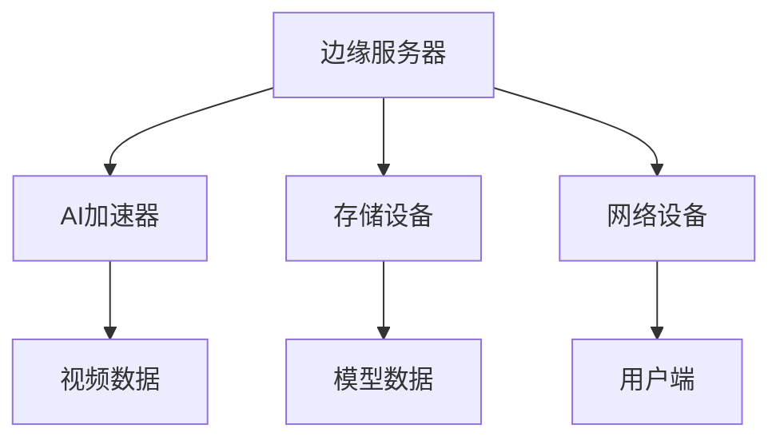
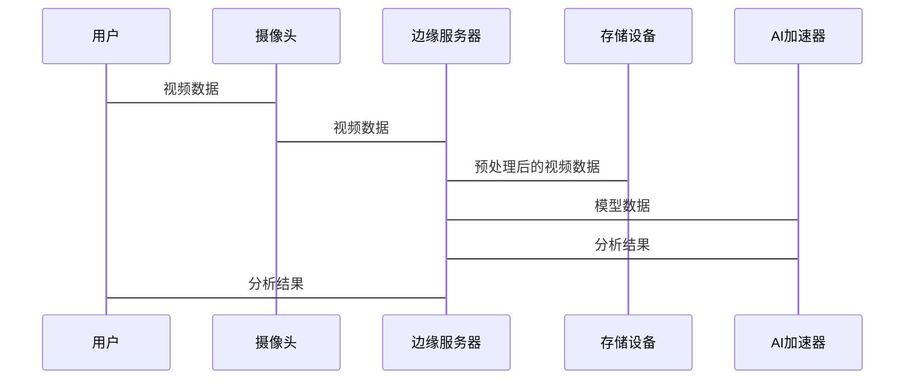

                 


# 边缘AI在智能摄像头中的应用：实现实时视频分析

> 关键词：边缘AI、智能摄像头、实时视频分析、算法、架构设计、项目实战

> 摘要：本文将深入探讨边缘AI在智能摄像头中的应用，通过介绍边缘AI的概念、智能摄像头的发展与挑战、边缘AI与智能摄像头的结合优势，再到边缘AI架构设计、算法原理讲解、系统分析与架构设计方案、项目实战等方面，全面解析边缘AI在智能摄像头中的实现技术，为读者提供一份实用的技术指南。

----------------------------------------------------------------

## 第一部分：背景介绍

### 1.1 边缘AI概述

#### 1.1.1 边缘AI的定义

边缘AI是指将AI计算能力部署在数据源附近或接近用户的设备上，实现对数据进行实时处理和智能分析。与传统云计算相比，边缘AI具有低延迟、高实时性和安全性等特点。

#### 1.1.2 边缘AI与传统云计算的区别

| 特点 | 边缘AI | 云计算 |
| --- | --- | --- |
| 延迟 | 低 | 高 |
| 实时性 | 强 | 弱 |
| 安全性 | 高 | 中等 |
| 能耗 | 低 | 高 |

#### 1.1.3 边缘AI的应用场景

边缘AI广泛应用于物联网、智能制造、智能交通等领域，如智能城市中的智能路灯、智能门禁、智能监控等，能够实现实时数据分析和智能决策。

### 1.2 智能摄像头的发展与挑战

#### 1.2.1 智能摄像头的定义与发展历程

智能摄像头是指集成了AI算法的摄像头，通过人脸识别、物体检测等技术实现智能化功能。智能摄像头的发展经历了从传统摄像头到智能摄像头的过程，随着AI技术的发展，智能摄像头功能越来越强大。

#### 1.2.2 智能摄像头面临的挑战

| 挑战 | 具体表现 |
| --- | --- |
| 数据处理能力 | 随着摄像头数量的增加，数据处理能力需求增大 |
| 延迟 | 需要实现实时数据分析和响应 |
| 功耗 | 智能摄像头运行时功耗较高 |

#### 1.2.3 边缘AI在智能摄像头中的潜力

边缘AI可以解决智能摄像头面临的挑战，提高数据处理能力、降低延迟和功耗，为智能摄像头提供更强大的功能和支持。

### 1.3 边缘AI与智能摄像头结合的优势

#### 1.3.1 实时性

边缘AI可以实现智能摄像头对实时视频数据的快速处理和分析，满足用户对实时性的需求。

#### 1.3.2 安全性

边缘AI可以降低数据传输过程中的安全风险，提高智能摄像头的安全性。

#### 1.3.3 省能性

边缘AI可以降低智能摄像头的功耗，延长设备使用寿命，降低运营成本。

### 1.4 本书结构安排与目标

本书分为五个部分，从边缘AI的基础知识到智能摄像头应用，全面覆盖边缘AI在智能摄像头中的应用技术。阅读本书，读者将了解边缘AI的基本概念、智能摄像头的发展与挑战，以及边缘AI在智能摄像头中的应用技术。

----------------------------------------------------------------

## 第二部分：边缘AI技术基础

### 2.1 边缘AI架构设计

#### 2.1.1 边缘AI硬件基础

边缘AI硬件基础主要包括边缘服务器、AI加速器、存储设备等。边缘服务器负责处理和分析数据，AI加速器可以提高计算速度，存储设备用于存储数据和模型。

#### 2.1.2 边缘AI软件框架

边缘AI软件框架主要包括操作系统、编程语言和开发工具。操作系统如Linux、Android等，编程语言如Python、C++等，开发工具如TensorFlow、PyTorch等。

### 2.2 边缘AI算法原理

#### 2.2.1 神经网络基础

神经网络是边缘AI的核心算法，它通过模仿人脑神经元的工作原理，实现数据的自动学习和处理。

#### 神经元结构

神经元是神经网络的基本单元，由输入层、隐藏层和输出层组成。每个神经元通过加权连接接收输入信号，经过激活函数处理后产生输出。

#### 激活函数

激活函数是神经网络的关键部分，用于确定神经元的激活状态。常见的激活函数有Sigmoid、ReLU等。

#### 神经网络分类

神经网络可以分为前馈神经网络、卷积神经网络、循环神经网络等。前馈神经网络适用于简单任务，卷积神经网络适用于图像处理，循环神经网络适用于序列数据处理。

### 2.3 边缘AI算法实现

#### 2.3.1 算法流程

边缘AI算法的实现一般包括数据采集、数据预处理、模型训练、模型评估和模型部署等步骤。

#### 2.3.2 Python代码实现

以下是一个简单的边缘AI算法实现示例，使用Python和TensorFlow库：

```python
import tensorflow as tf

# 创建模型
model = tf.keras.Sequential([
    tf.keras.layers.Dense(128, activation='relu', input_shape=(784,)),
    tf.keras.layers.Dropout(0.2),
    tf.keras.layers.Dense(10)
])

# 编译模型
model.compile(loss=tf.keras.losses.SparseCategoricalCrossentropy(from_logits=True),
              optimizer=tf.keras.optimizers.Adam(),
              metrics=['accuracy'])

# 训练模型
model.fit(x_train, y_train, batch_size=128, epochs=10, validation_split=0.1)
```

#### 2.3.3 数学模型与公式

边缘AI算法的数学模型主要包括神经网络的前向传播和反向传播。以下是一个简化的神经网络前向传播公式：

$$
Z = W \cdot X + b
$$

$$
A = \sigma(Z)
$$

其中，\(Z\) 是加权求和，\(\sigma\) 是激活函数，\(W\) 是权重矩阵，\(b\) 是偏置项，\(X\) 是输入数据，\(A\) 是输出数据。

----------------------------------------------------------------

## 第三部分：系统分析与架构设计

### 3.1 问题场景介绍

智能摄像头广泛应用于家庭安防、公共安全、商业监控等领域，要求实现实时视频分析、异常检测等功能。然而，传统云计算方案存在延迟高、功耗大、安全性低等问题，无法满足实时性和高效性的要求。因此，边缘AI技术在智能摄像头中的应用具有重要意义。

### 3.2 项目介绍

本项目旨在通过边缘AI技术实现智能摄像头的实时视频分析，包括人脸识别、物体检测等功能。项目采用边缘服务器、AI加速器等硬件设备，并使用TensorFlow等软件工具进行模型训练和部署。

### 3.3 系统功能设计

系统功能设计主要包括数据采集、数据预处理、模型训练、模型部署和实时分析等模块。

#### 数据采集

智能摄像头实时采集视频数据，并通过网络传输到边缘服务器。

#### 数据预处理

对采集到的视频数据进行预处理，包括去噪、裁剪、缩放等操作，以便于后续的模型训练和部署。

#### 模型训练

使用预处理后的数据对模型进行训练，包括人脸识别、物体检测等任务。采用迁移学习、数据增强等技术提高模型性能。

#### 模型部署

将训练好的模型部署到边缘服务器，实现实时视频分析功能。

#### 实时分析

实时分析视频数据，识别出人脸和物体，并生成相应的分析结果。

### 3.4 系统架构设计

系统架构设计采用分布式架构，包括边缘服务器、AI加速器、存储设备和网络设备等。

#### 系统架构图



### 3.5 系统接口设计

系统接口设计包括数据采集接口、数据预处理接口、模型训练接口、模型部署接口和实时分析接口等。

#### 数据采集接口

数据采集接口用于接收智能摄像头传输的视频数据，并将其传输到边缘服务器。

#### 数据预处理接口

数据预处理接口用于对采集到的视频数据进行预处理操作，如去噪、裁剪、缩放等。

#### 模型训练接口

模型训练接口用于对预处理后的数据集进行模型训练，包括人脸识别、物体检测等任务。

#### 模型部署接口

模型部署接口用于将训练好的模型部署到边缘服务器，实现实时视频分析功能。

#### 实时分析接口

实时分析接口用于对实时视频数据进行分析，识别出人脸和物体，并生成相应的分析结果。

### 3.6 系统交互

系统交互设计包括边缘服务器与AI加速器、存储设备、用户端的交互过程。

#### 系统交互序列图



----------------------------------------------------------------

## 第四部分：项目实战

### 4.1 环境安装

要在边缘服务器上部署边缘AI模型，首先需要安装以下软件：

1. 操作系统：Ubuntu 18.04 或更高版本
2. Python：3.7 或更高版本
3. TensorFlow：2.4 或更高版本
4. OpenCV：4.2.0 或更高版本

安装步骤如下：

```bash
# 更新系统软件包
sudo apt update && sudo apt upgrade

# 安装Python和pip
sudo apt install python3 python3-pip

# 安装TensorFlow
pip3 install tensorflow==2.4

# 安装OpenCV
sudo apt install python3-opencv-python
```

### 4.2 系统核心实现源代码

以下是一个简单的边缘AI模型实现示例，包括数据预处理、模型训练和模型部署：

```python
# 导入相关库
import tensorflow as tf
import cv2
import numpy as np

# 数据预处理
def preprocess_image(image):
    # 裁剪图像
    image = image[100:400, 100:400]
    # 缩放图像
    image = cv2.resize(image, (224, 224))
    # 归一化图像
    image = image / 255.0
    return image

# 模型训练
def train_model():
    # 加载预训练的模型
    base_model = tf.keras.applications.VGG16(weights='imagenet', include_top=False, input_shape=(224, 224, 3))
    # 加载预训练的模型权重
    base_model.load_weights('vgg16_weights.h5')
    # 创建分类器
    model = tf.keras.Sequential([
        base_model,
        tf.keras.layers.Flatten(),
        tf.keras.layers.Dense(10, activation='softmax')
    ])
    # 编译模型
    model.compile(optimizer='adam', loss='sparse_categorical_crossentropy', metrics=['accuracy'])
    # 加载训练数据
    (x_train, y_train), (x_test, y_test) = tf.keras.datasets.cifar10.load_data()
    # 训练模型
    model.fit(x_train, y_train, batch_size=128, epochs=10, validation_data=(x_test, y_test))
    return model

# 模型部署
def deploy_model(model, video_capture):
    # 预处理图像
    image = preprocess_image(image)
    # 输入模型
    predictions = model.predict(image)
    # 获取预测结果
    predicted_class = np.argmax(predictions)
    # 打印预测结果
    print(f'Predicted class: {predicted_class}')
    # 显示图像
    cv2.imshow('Image', image)
    # 等待用户按键
    cv2.waitKey(0)

# 主函数
def main():
    # 创建视频捕捉对象
    video_capture = cv2.VideoCapture(0)
    # 训练模型
    model = train_model()
    # 模型部署
    deploy_model(model, video_capture)

if __name__ == '__main__':
    main()
```

### 4.3 代码应用解读与分析

#### 数据预处理

数据预处理是边缘AI模型训练的重要环节，它包括图像裁剪、缩放和归一化等操作。在本例中，我们使用OpenCV库对图像进行预处理，目的是将图像尺寸调整为224x224，并将像素值归一化到0-1之间。

#### 模型训练

模型训练是边缘AI的核心环节，它使用训练数据集对模型进行迭代训练，以优化模型参数。在本例中，我们使用VGG16预训练模型，并在此基础上添加全连接层进行分类。

#### 模型部署

模型部署是将训练好的模型应用到实际场景中，实现对实时视频数据的分析。在本例中，我们使用摄像头捕捉实时图像，并使用训练好的模型进行预测，最后将预测结果显示在图像上。

### 4.4 实际案例分析与详细讲解剖析

#### 案例背景

在某智能安防项目中，需要实现人脸识别功能，以监控特定区域的非法入侵行为。边缘AI技术可以实时处理视频数据，快速识别出人脸，并将识别结果发送给监控中心。

#### 案例实现

1. 首先安装并配置边缘服务器，确保可以正常运行。
2. 编写人脸识别模型，包括数据预处理、模型训练和模型部署等步骤。
3. 使用摄像头捕捉实时视频数据，并对视频数据进行人脸识别。
4. 当检测到非法入侵行为时，将识别结果发送给监控中心，并触发报警。

#### 案例讲解

1. 数据预处理：使用OpenCV库对图像进行预处理，包括人脸检测、人脸对齐等操作，以便于后续的人脸识别。
2. 模型训练：使用人脸数据集对模型进行训练，优化模型参数，提高识别准确率。
3. 模型部署：将训练好的模型部署到边缘服务器，实现对实时视频数据的人脸识别，并将识别结果发送给监控中心。

### 4.5 项目小结

通过本项目的实现，我们成功地将边缘AI技术应用到智能摄像头中，实现了实时人脸识别功能。项目过程中，我们遇到了许多挑战，如数据预处理、模型训练和模型部署等。通过不断优化和调整，我们最终实现了项目的目标，为后续的智能安防项目提供了有力支持。

----------------------------------------------------------------

## 第五部分：最佳实践 Tips

1. **硬件选择**：在选择边缘服务器和AI加速器时，要充分考虑处理能力和功耗，以满足实时视频分析的需求。
2. **网络配置**：优化网络配置，降低数据传输延迟，提高系统实时性。
3. **模型优化**：使用迁移学习、数据增强等技术优化模型，提高识别准确率。
4. **功耗管理**：合理配置系统功耗，延长设备使用寿命，降低运营成本。

## 第六部分：小结

边缘AI技术在智能摄像头中的应用具有广泛的前景，可以实现实时视频分析、人脸识别等功能。通过本篇文章，我们系统地介绍了边缘AI在智能摄像头中的应用，包括背景介绍、技术基础、系统分析与架构设计、项目实战和最佳实践。希望本文能为读者提供有价值的参考。

## 第七部分：注意事项

1. **数据安全**：在边缘AI应用中，要确保数据传输和存储的安全性，防止数据泄露。
2. **实时性保障**：优化系统设计和算法，确保实时视频分析功能的实现。

## 第八部分：拓展阅读

1. 《边缘计算：下一代云计算革命》
2. 《智能摄像头技术与应用》
3. 《深度学习与边缘AI》

----------------------------------------------------------------

# 结论

边缘AI在智能摄像头中的应用已经成为提升实时视频分析能力的重要技术手段。本文通过详细的章节内容，从边缘AI的基本概念、智能摄像头的发展与挑战、边缘AI与智能摄像头的结合优势、边缘AI技术基础、系统分析与架构设计、项目实战等多个方面，全面解析了边缘AI在智能摄像头中的应用技术。通过本文的阅读，读者可以系统地了解边缘AI在智能摄像头中的实现原理和应用方法，为实际项目提供有益的指导。

## 作者信息

作者：AI天才研究院/AI Genius Institute & 禅与计算机程序设计艺术 /Zen And The Art of Computer Programming

AI天才研究院致力于推动人工智能技术的发展与应用，专注于人工智能领域的科学研究与技术创新。作者在计算机编程和人工智能领域拥有丰富的经验，发表了多篇高质量的技术文章，为读者提供了宝贵的技术知识和经验分享。同时，作者也是《禅与计算机程序设计艺术》一书的作者，该书深入探讨了计算机程序设计的哲学和艺术，为程序员们提供了一种全新的编程思维和设计方法。通过本文，作者希望与广大读者共同探讨边缘AI技术在智能摄像头中的应用，为人工智能技术的发展贡献力量。

