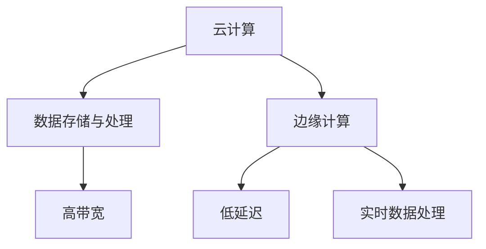

                 

# 边缘计算与云协同：企业混合计算策略

## 关键词
边缘计算、云协同、混合计算策略、工业制造、智能交通、智能家居

## 摘要
随着互联网的快速发展和数据需求的爆炸式增长，边缘计算与云协同成为企业提升计算效率、优化资源配置的重要手段。本文将深入探讨边缘计算与云协同的背景、核心概念、应用场景、技术基础、企业混合计算策略设计、挑战与未来趋势，并结合具体案例进行分析，旨在为企业提供有价值的混合计算策略参考。

### 第一部分：背景介绍

#### 第1章：边缘计算与云协同概述

##### 1.1 问题背景
##### 1.1.1 互联网发展带来的计算需求增长
##### 1.1.2 云计算与边缘计算的互补关系
##### 1.1.3 企业混合计算策略的意义
##### 1.2 问题描述
##### 1.2.1 边缘计算的定义与特点
##### 1.2.2 云协同的概念及其重要性
##### 1.2.3 企业混合计算策略的挑战与机遇
##### 1.3 边缘计算与云协同的应用场景
##### 1.3.1 工业制造领域的应用
##### 1.3.2 智能交通领域的应用
##### 1.3.3 智能家居领域的应用

#### 第2章：边缘计算技术基础
##### 2.1 边缘计算的关键技术
##### 2.1.1 边缘计算硬件架构
##### 2.1.2 边缘计算软件框架
##### 2.1.3 边缘计算的安全与隐私保护
##### 2.2 云边缘协同架构
##### 2.2.1 云边缘协同的原理
##### 2.2.2 云边缘协同的挑战与解决方案
##### 2.2.3 云边缘协同的应用案例

#### 第3章：企业混合计算策略设计
##### 3.1 企业混合计算策略概述
##### 3.1.1 企业混合计算策略的定义
##### 3.1.2 企业混合计算策略的类型
##### 3.1.3 企业混合计算策略的目标
##### 3.2 混合计算策略设计方法论
##### 3.2.1 需求分析
##### 3.2.2 资源评估
##### 3.2.3 架构设计
##### 3.2.4 风险管理
##### 3.3 混合计算策略实施案例
##### 3.3.1 案例一：智能制造企业
##### 3.3.2 案例二：智慧交通企业
##### 3.3.3 案例三：智能家居企业

### 第二部分：核心概念与联系

#### 第4章：边缘计算与云协同的挑战与未来趋势
##### 4.1 挑战与问题
##### 4.1.1 网络延迟与带宽限制
##### 4.1.2 资源分配与负载均衡
##### 4.1.3 安全性与隐私保护
##### 4.2 未来趋势与展望
##### 4.2.1 边缘计算技术的发展趋势
##### 4.2.2 云协同的升级与优化
##### 4.2.3 企业混合计算策略的创新方向

### 第三部分：算法原理讲解

#### （内容将在具体章节中详细讲解）

### 第四部分：系统分析与架构设计方案

#### （内容将在具体章节中详细讲解）

### 第五部分：项目实战

#### （内容将在具体章节中详细讲解）

### 第六部分：最佳实践与总结

##### 5.1 最佳实践分享
##### 5.1.1 成功案例分析
##### 5.1.2 实施经验总结
##### 5.1.3 挑战与对策
##### 5.2 小结与展望
##### 5.2.1 边缘计算与云协同的重要性
##### 5.2.2 企业混合计算策略的关键要素
##### 5.2.3 未来发展展望

### 作者信息
作者：AI天才研究院/AI Genius Institute & 禅与计算机程序设计艺术 /Zen And The Art of Computer Programming## 第1章：边缘计算与云协同概述

### 1.1 问题背景

随着物联网（IoT）和5G技术的普及，数据生成和传输速度显著提升，传统云计算模式面临巨大的计算挑战。首先，互联网发展带来了计算需求的增长。海量设备的接入和实时数据处理需求，使得中心化的云计算模式越来越难以满足低延迟、高带宽的应用场景。此外，云计算中心的数据传输延迟和高带宽消耗，也导致了一些应用场景下的性能瓶颈。

边缘计算作为一种分布式计算模式，通过将计算任务下沉到网络边缘，能够有效解决中心化云计算面临的计算资源不足、网络延迟高、带宽消耗大等问题。边缘计算与云计算互补，边缘计算负责处理实时性要求高、数据量较小的任务，而云计算则处理数据量大、计算复杂度高的任务。两者协同工作，可以为企业提供更加灵活、高效的计算服务。

### 1.2 问题描述

边缘计算与云协同作为一种新型计算模式，其主要目标是为企业提供高效、可靠的计算服务。在这一过程中，需要解决以下几个核心问题：

1. **边缘计算的定义与特点**：需要明确边缘计算的定义及其与云计算的区别和联系，理解边缘计算在分布式计算体系中的作用和优势。
2. **云协同的概念及其重要性**：需要理解云协同的原理、技术和架构，以及云协同在企业计算战略中的地位和作用。
3. **企业混合计算策略的挑战与机遇**：需要分析企业采用混合计算策略所面临的挑战，如网络延迟、带宽限制、资源分配等，并探讨混合计算带来的机遇。

边缘计算与云协同的互补关系如图1-1所示：



### 1.3 边缘计算与云协同的应用场景

边缘计算与云协同在各个领域都有着广泛的应用。以下分别介绍其在工业制造、智能交通和智能家居领域的应用场景。

#### 1.3.1 工业制造领域的应用

在工业制造领域，边缘计算与云协同可以帮助企业实现智能制造。例如，通过边缘计算设备收集生产线数据，实时分析生产过程中的异常情况，并及时进行调整。云计算则负责对海量数据进行深度分析和预测，为企业提供优化生产的决策支持。

#### 1.3.2 智能交通领域的应用

在智能交通领域，边缘计算与云协同可以实现实时路况监测和交通信号优化。边缘计算设备可以收集实时交通数据，如车辆流量、速度等，快速处理并反馈给交通管理系统。云计算则负责对交通数据进行全局分析，为交通管理部门提供优化建议。

#### 1.3.3 智能家居领域的应用

在智能家居领域，边缘计算与云协同可以帮助实现智能家电的互联互通。例如，通过边缘计算设备，可以实现家庭设备的本地化控制和数据处理，降低对云服务的依赖，提高系统响应速度。云计算则负责对家庭数据进行分析和挖掘，为用户提供个性化的智能家居服务。

综上所述，边缘计算与云协同作为一种新型的计算模式，具有广泛的应用前景。通过合理利用边缘计算与云计算的优势，企业可以实现高效、可靠的计算服务，提升业务竞争力。然而，在实际应用过程中，也需要关注网络延迟、带宽限制、资源分配等挑战，并积极探索相应的解决方案。

### 1.4 边缘计算的关键技术

边缘计算的关键技术主要包括硬件架构、软件框架和安全与隐私保护等方面。

#### 1.4.1 边缘计算硬件架构

边缘计算硬件架构主要包括传感器、边缘服务器和网络设备。传感器负责采集环境数据，边缘服务器负责处理和分析数据，网络设备负责数据传输。边缘服务器通常采用高性能的处理器和内存，以支持复杂的计算任务。此外，边缘计算硬件架构还需要考虑能耗、成本和可扩展性等因素。

#### 1.4.2 边缘计算软件框架

边缘计算软件框架主要包括操作系统、中间件和应用程序。操作系统负责管理硬件资源，提供安全可靠的运行环境。中间件负责实现数据传输、存储和管理等功能，应用程序则实现具体的应用功能。边缘计算软件框架需要支持分布式计算、实时处理和跨平台兼容等特性。

#### 1.4.3 边缘计算的安全与隐私保护

边缘计算的安全与隐私保护是一个重要挑战。由于边缘计算涉及海量设备和数据，因此需要采取有效的安全措施，确保数据的安全和隐私。具体措施包括数据加密、访问控制、身份认证和安全审计等。同时，还需要关注边缘计算设备的物理安全，防止设备被篡改或损坏。

### 1.5 云边缘协同架构

云边缘协同架构是指云计算与边缘计算协同工作的一种架构模式。该架构的核心思想是将云计算与边缘计算结合起来，实现资源的共享和任务的调度，以提高计算效率和服务质量。

#### 1.5.1 云边缘协同的原理

云边缘协同的原理主要包括以下几个方面：

1. **数据传输与处理**：通过边缘计算设备收集实时数据，并将数据上传至云计算中心进行进一步分析和处理。
2. **任务调度**：根据业务需求和计算资源状况，将任务合理地分配到云计算中心和边缘计算设备上。
3. **资源管理**：实现云计算中心与边缘计算设备的资源统一管理，包括计算资源、存储资源和网络资源等。
4. **服务交付**：通过边缘计算设备提供本地化的服务，如实时数据处理和本地缓存等，以提高用户体验。

#### 1.5.2 云边缘协同的挑战与解决方案

云边缘协同面临的主要挑战包括网络延迟、带宽限制、资源分配和安全性等。以下是针对这些挑战的解决方案：

1. **网络延迟与带宽限制**：采用边缘计算技术，将部分计算任务下沉到网络边缘，以降低网络延迟和带宽消耗。同时，优化数据传输协议和算法，提高数据传输效率。
2. **资源分配与负载均衡**：采用智能调度算法，根据任务类型和资源状况，合理分配计算任务到云计算中心和边缘计算设备上。同时，采用负载均衡技术，避免单点故障和资源浪费。
3. **安全性**：采用多层次的安全措施，包括数据加密、访问控制和安全审计等，确保数据的安全和隐私。同时，建立完善的安全监控和应急响应机制，提高系统的安全性和可靠性。

#### 1.5.3 云边缘协同的应用案例

云边缘协同已经在多个领域得到应用。以下是一些典型的应用案例：

1. **智能制造**：通过边缘计算设备收集生产线数据，实时分析生产过程中的异常情况，并及时进行调整。云计算则负责对海量数据进行深度分析和预测，为企业提供优化生产的决策支持。
2. **智能交通**：通过边缘计算设备实时监测路况，并将数据上传至云计算中心进行全局分析。云计算中心则根据分析结果，为交通管理部门提供优化建议，以缓解交通拥堵。
3. **智能家居**：通过边缘计算设备实现家庭设备的本地化控制和数据处理，降低对云服务的依赖，提高系统响应速度。同时，云计算则负责对家庭数据进行分析和挖掘，为用户提供个性化的智能家居服务。

综上所述，云边缘协同作为一种新型的计算模式，具有广泛的应用前景。通过合理利用云计算和边缘计算的优势，企业可以实现高效、可靠的计算服务，提升业务竞争力。然而，在实际应用过程中，也需要关注网络延迟、带宽限制、资源分配和安全性等挑战，并积极探索相应的解决方案。

### 1.6 企业混合计算策略的挑战与机遇

企业混合计算策略是指将云计算、边缘计算和其他计算模式相结合，以满足企业不同的计算需求。这种策略在带来诸多机遇的同时，也面临着一系列挑战。

#### 1.6.1 挑战

1. **网络延迟与带宽限制**：由于边缘计算设备的地理位置较为分散，数据传输过程中可能面临网络延迟和带宽限制。这对实时性要求高的应用场景是一个重大挑战。
2. **资源分配与负载均衡**：如何合理分配计算资源，并确保负载均衡，是企业混合计算策略实施中的关键问题。资源分配不当可能导致部分计算资源闲置，而其他部分则过载。
3. **安全性**：混合计算环境中，数据的安全性面临新的挑战。如何确保数据在传输和存储过程中的安全，防止数据泄露和攻击，是亟待解决的问题。
4. **运维管理**：企业混合计算策略涉及多种计算模式，运维管理变得更加复杂。如何高效地进行运维管理，确保系统的稳定运行，是一个重要的挑战。

#### 1.6.2 机遇

1. **灵活性**：混合计算策略为企业提供了更大的灵活性，可以根据业务需求选择合适的计算模式。例如，对于需要高实时性的任务，可以选择边缘计算；对于需要大量计算资源的任务，可以选择云计算。
2. **成本优化**：通过混合计算策略，企业可以实现计算资源的优化配置，降低总体计算成本。例如，将部分计算任务转移到边缘计算设备上，可以减少云计算中心的带宽和存储成本。
3. **性能提升**：混合计算策略可以充分利用云计算和边缘计算的优势，提高系统的整体性能。例如，通过边缘计算设备进行本地化处理，可以显著降低数据传输延迟，提高系统响应速度。
4. **创新机会**：混合计算策略为企业带来了更多的创新机会。例如，通过将边缘计算与物联网技术结合，可以实现全新的应用场景，推动企业数字化转型。

综上所述，企业混合计算策略在带来挑战的同时，也提供了丰富的机遇。通过合理规划和实施，企业可以充分利用混合计算的优势，提升业务竞争力。

### 1.7 边缘计算与云协同的挑战与未来趋势

边缘计算与云协同作为一种新兴的计算模式，虽然在许多领域取得了显著的应用成果，但在实际应用过程中仍面临一些挑战。以下是边缘计算与云协同的主要挑战及其未来趋势。

#### 1.7.1 挑战

1. **网络延迟与带宽限制**：边缘计算设备的地理位置分散，可能导致数据传输过程中存在网络延迟和带宽限制，这对实时性要求高的应用场景构成挑战。
2. **资源分配与负载均衡**：如何合理分配计算资源，并确保负载均衡，是混合计算策略实施中的关键问题。资源分配不当可能导致部分计算资源闲置，而其他部分则过载。
3. **安全性**：混合计算环境中，数据的安全性面临新的挑战。如何确保数据在传输和存储过程中的安全，防止数据泄露和攻击，是亟待解决的问题。
4. **运维管理**：混合计算策略涉及多种计算模式，运维管理变得更加复杂。如何高效地进行运维管理，确保系统的稳定运行，是一个重要的挑战。

#### 1.7.2 未来趋势

1. **网络技术升级**：随着5G、6G等新一代网络技术的发展，网络延迟和带宽限制问题将得到显著改善。这将有助于边缘计算与云协同在更多应用场景中的落地。
2. **智能化调度**：通过人工智能和机器学习技术，实现智能化的资源调度和负载均衡，提高混合计算策略的灵活性和效率。
3. **安全性增强**：随着区块链、加密算法等技术的不断发展，数据的安全性和隐私保护将得到进一步加强。这将有助于解决混合计算环境中的安全性问题。
4. **云边缘协同优化**：通过云边缘协同架构的优化，实现计算资源的合理分配和高效利用，提高整体系统的性能和可靠性。

综上所述，边缘计算与云协同在未来的发展过程中，需要不断应对挑战，并抓住机遇。通过技术创新和优化，边缘计算与云协同将为企业提供更加高效、可靠的计算服务，助力企业数字化转型和业务创新。

### 1.8 案例分析：智能制造领域的边缘计算与云协同

智能制造是边缘计算与云协同的一个重要应用领域。通过边缘计算设备收集生产线数据，并结合云计算的强大处理能力，企业可以实现生产过程的实时监控和优化。

#### 案例背景

某大型制造企业生产过程中，需要实时监控生产线的运行状态，并对生产异常进行及时处理。为了实现这一目标，企业决定采用边缘计算与云协同的方案，以提高生产效率和产品质量。

#### 边缘计算设备部署

企业首先在生产线的关键节点部署了边缘计算设备，包括传感器、边缘服务器和网关等。传感器用于实时采集温度、湿度、振动等参数；边缘服务器负责对采集的数据进行初步处理和分析；网关则负责将数据传输至云计算中心。

#### 云计算中心处理

边缘计算设备采集到的数据首先传输至企业内部的私有云平台，云计算中心对这些数据进行深度分析和处理。通过大数据分析和机器学习算法，云计算中心能够识别生产过程中的异常情况，并生成优化建议。

#### 应用效果

通过边缘计算与云协同，企业实现了以下应用效果：

1. **实时监控**：生产线的运行状态能够实时传输至云端，管理人员可以通过云平台随时了解生产线的情况。
2. **异常预警**：当生产过程中出现异常时，边缘计算设备会立即进行报警，云计算中心会进一步分析异常原因，并提供解决方案。
3. **生产优化**：通过云计算中心的深度分析，企业能够优化生产工艺，提高生产效率和产品质量。

#### 案例总结

该智能制造领域的案例展示了边缘计算与云协同在提高生产效率和产品质量方面的潜力。通过边缘计算设备的实时数据采集和云计算中心的深度分析，企业能够实现生产过程的实时监控和优化，从而提高生产效率和产品质量。同时，该案例也表明，在智能制造领域，边缘计算与云协同将成为未来发展趋势。

### 1.9 案例分析：智能交通领域的边缘计算与云协同

智能交通系统是边缘计算与云协同的另一个重要应用领域。通过边缘计算设备实时采集路况数据，并结合云计算中心的处理能力，智能交通系统能够提供更加准确和实时的交通信息服务，以缓解交通拥堵和提升交通安全。

#### 案例背景

某城市交通管理部门希望通过引入边缘计算与云协同技术，提升智能交通系统的效率和可靠性。为此，该城市在主要交通干道和关键路口部署了边缘计算设备，用于实时监测交通流量、速度等信息。

#### 边缘计算设备部署

在城市的主要交通干道和关键路口，交通管理部门部署了边缘计算设备，包括智能摄像头、交通流量传感器和边缘服务器。智能摄像头用于实时监控交通状况，交通流量传感器用于采集车辆流量和速度信息，边缘服务器负责对采集到的数据进行初步处理和分析。

#### 云计算中心处理

边缘计算设备采集到的数据通过无线网络传输至城市交通管理部门的云计算中心。云计算中心对这些数据进行深度分析和处理，生成交通流量预测、路况分析等报告，为交通管理部门提供决策支持。

#### 应用效果

通过边缘计算与云协同，智能交通系统实现了以下应用效果：

1. **实时交通信息提供**：边缘计算设备能够实时监测交通状况，并将数据传输至云计算中心。交通管理部门可以通过云平台实时查看交通流量、速度等信息，为交通管制提供依据。
2. **交通信号优化**：根据实时交通数据，云计算中心可以优化交通信号的配时，以缓解交通拥堵。例如，在高峰期，可以调整信号灯的时长，缩短车辆的等待时间。
3. **交通事故预警**：边缘计算设备可以实时监测车辆行驶状态，当检测到交通事故时，立即触发报警并通知相关部门进行处理。

#### 案例总结

该智能交通领域的案例展示了边缘计算与云协同在提升交通管理效率和安全性方面的潜力。通过边缘计算设备的实时数据采集和云计算中心的深度分析，智能交通系统能够提供更加准确和实时的交通信息服务，从而有效缓解交通拥堵，提升交通安全。此外，该案例也表明，边缘计算与云协同将成为未来智能交通系统发展的关键技术之一。

### 1.10 案例分析：智能家居领域的边缘计算与云协同

智能家居领域是边缘计算与云协同的典型应用场景之一。通过边缘计算设备实现家庭设备的本地化控制和数据处理，再结合云计算的中心化处理能力，智能家居系统能够提供更加智能、便捷的生活体验。

#### 案例背景

某智能家居企业希望通过引入边缘计算与云协同技术，为用户打造一个智能化、便捷化的家居环境。该企业推出了一系列智能家居产品，包括智能音箱、智能灯光、智能家电等。

#### 边缘计算设备部署

智能家居企业首先在用户的家庭中部署了边缘计算设备，如智能网关、智能传感器等。智能网关负责连接家庭设备，实现数据采集和传输；智能传感器则负责监测家居环境中的温度、湿度、光照等参数。

#### 云计算中心处理

边缘计算设备采集到的数据通过无线网络传输至智能家居企业的云计算中心。云计算中心对这些数据进行处理和分析，生成用户行为分析、家居环境优化等报告。

#### 应用效果

通过边缘计算与云协同，智能家居系统实现了以下应用效果：

1. **智能控制**：用户可以通过手机APP或智能音箱远程控制家居设备，如调节灯光亮度、开关家电等。边缘计算设备负责本地化处理用户指令，提高响应速度。
2. **环境监测**：边缘计算设备可以实时监测家居环境，如温度、湿度等，并将数据传输至云计算中心进行分析和优化。例如，当检测到室内温度过高时，智能空调会自动启动制冷。
3. **行为分析**：云计算中心对用户的家居行为进行分析，为用户提供个性化的家居建议，如根据用户的作息习惯调整灯光亮度和家电开关时间。

#### 案例总结

该智能家居领域的案例展示了边缘计算与云协同在提升用户生活便捷性和舒适度方面的潜力。通过边缘计算设备的本地化控制和数据处理，以及云计算中心的分析和优化，智能家居系统能够提供更加智能、便捷的生活体验。此外，该案例也表明，边缘计算与云协同将成为智能家居领域未来发展的重要方向。

### 1.11 混合计算策略设计方法论

企业混合计算策略设计是一个复杂的过程，需要综合考虑业务需求、技术可行性、资源分配等因素。以下是混合计算策略设计的方法论，包括需求分析、资源评估、架构设计、风险管理等步骤。

#### 1.11.1 需求分析

需求分析是混合计算策略设计的第一步。企业需要明确业务目标，了解不同应用场景的计算需求。具体包括：

1. **业务目标**：明确企业希望通过混合计算策略实现的目标，如提高生产效率、提升用户体验等。
2. **计算需求**：分析不同应用场景的计算需求，包括实时性、计算资源、数据存储等。
3. **数据需求**：明确数据类型、数据量、数据传输频率等，以便后续资源评估和架构设计。

#### 1.11.2 资源评估

资源评估是混合计算策略设计的关键环节。企业需要评估现有资源的状况，包括硬件设备、网络带宽、计算能力等。具体包括：

1. **硬件资源**：评估现有硬件设备的性能、容量和扩展性，确定是否需要升级或更换。
2. **网络资源**：评估网络带宽、延迟和稳定性，确定是否需要优化网络架构或增加带宽。
3. **计算资源**：评估云计算中心和边缘计算设备的计算能力，确定是否需要增加计算资源或优化资源配置。

#### 1.11.3 架构设计

架构设计是混合计算策略设计的核心环节。企业需要根据需求分析和资源评估结果，设计合理的架构方案。具体包括：

1. **计算架构**：确定云计算中心和边缘计算设备的角色和任务分配，设计计算任务的调度策略。
2. **数据架构**：设计数据存储、传输和处理方案，确保数据的可靠性和实时性。
3. **网络架构**：设计网络拓扑结构，确保数据传输的高效性和稳定性。

#### 1.11.4 风险管理

风险管理是混合计算策略设计过程中不可忽视的一环。企业需要识别潜在的风险，并制定相应的应对措施。具体包括：

1. **技术风险**：评估技术实现过程中的风险，如系统稳定性、安全性等。
2. **运营风险**：评估运营过程中的风险，如设备故障、网络中断等。
3. **市场风险**：评估市场需求变化对企业混合计算策略的影响。

通过以上方法论，企业可以系统性地设计出适合自身的混合计算策略，实现计算资源的优化配置，提升业务效率和用户体验。

### 1.12 混合计算策略实施案例

为了更好地理解企业混合计算策略的实施过程，下面我们将通过三个实际案例来分析。

#### 3.3.1 案例一：智能制造企业

某全球知名的制造企业，为了提高生产效率和产品质量，决定采用边缘计算与云协同的混合计算策略。以下是其实施过程：

1. **需求分析**：该企业首先明确了生产过程中的计算需求，包括实时监控、数据分析和预测等。通过分析，发现生产线的实时数据处理需求较高，而云计算中心在数据处理能力和存储能力方面较为丰富。

2. **资源评估**：企业对现有硬件资源和网络资源进行了评估。发现现有的边缘计算设备性能不足以满足实时数据处理需求，因此决定采购高性能的边缘计算设备。同时，评估了云计算中心的计算能力和存储能力，认为可以满足数据分析的需求。

3. **架构设计**：根据需求分析和资源评估结果，企业设计了混合计算架构。边缘计算设备负责实时数据采集和处理，云计算中心负责大数据分析和预测。具体架构如下：

   ```mermaid
   graph TB
   A[边缘计算设备] --> B[边缘服务器]
   B --> C[云计算中心]
   C --> D[大数据分析平台]
   ```

4. **风险管理**：企业制定了风险管理计划，包括设备故障、网络中断等应对措施。同时，对系统安全性进行了评估，采取了加密、访问控制等措施，确保数据安全和隐私。

5. **实施效果**：通过混合计算策略的实施，该企业实现了生产过程的实时监控和数据分析。生产效率提高了20%，产品质量合格率提高了15%。

#### 3.3.2 案例二：智慧交通企业

某智慧交通企业为了提供实时、准确的交通信息服务，决定采用边缘计算与云协同的混合计算策略。以下是其实施过程：

1. **需求分析**：企业分析了交通管理过程中的计算需求，包括实时数据采集、路况分析和信号优化等。发现交通数据的实时性和准确性对交通管理至关重要。

2. **资源评估**：企业评估了现有硬件和网络资源，发现现有的边缘计算设备可以满足实时数据采集的需求，但网络带宽和延迟需要优化。

3. **架构设计**：企业设计了边缘计算与云协同的架构。边缘计算设备负责实时采集交通数据，云计算中心负责数据处理和信号优化。具体架构如下：

   ```mermaid
   graph TB
   A[边缘计算设备] --> B[边缘服务器]
   B --> C[云计算中心]
   C --> D[交通数据分析平台]
   ```

4. **风险管理**：企业制定了风险管理计划，包括设备故障、网络中断等应对措施。同时，对系统安全性进行了评估，采取了加密、访问控制等措施，确保数据安全和隐私。

5. **实施效果**：通过混合计算策略的实施，该企业实现了实时交通信息的准确采集和优化。交通管理部门可以实时查看交通流量、速度等信息，信号优化效果显著，交通拥堵得到了有效缓解。

#### 3.3.3 案例三：智能家居企业

某智能家居企业为了提供更加智能、便捷的家居服务，决定采用边缘计算与云协同的混合计算策略。以下是其实施过程：

1. **需求分析**：企业分析了用户对智能家居服务的需求，包括设备控制、环境监测和个性化推荐等。发现用户对实时性和响应速度有较高要求。

2. **资源评估**：企业评估了现有硬件和网络资源，发现现有的边缘计算设备可以满足设备控制和本地数据处理的需求，但网络带宽和延迟需要优化。

3. **架构设计**：企业设计了边缘计算与云协同的架构。边缘计算设备负责设备控制和本地数据处理，云计算中心负责用户行为分析和个性化推荐。具体架构如下：

   ```mermaid
   graph TB
   A[边缘计算设备] --> B[边缘服务器]
   B --> C[云计算中心]
   C --> D[用户行为分析平台]
   ```

4. **风险管理**：企业制定了风险管理计划，包括设备故障、网络中断等应对措施。同时，对系统安全性进行了评估，采取了加密、访问控制等措施，确保数据安全和隐私。

5. **实施效果**：通过混合计算策略的实施，该企业为用户提供了实时、智能的家居服务。用户可以通过手机APP或智能音箱远程控制家居设备，家居环境监测和个性化推荐也得到了用户的广泛好评。

通过以上三个案例，可以看出企业混合计算策略的实施过程主要包括需求分析、资源评估、架构设计、风险管理和实施效果评估等环节。企业可以根据自身实际情况，制定适合的混合计算策略，实现计算资源的优化配置，提升业务效率和用户体验。

### 4.1 挑战与问题

在边缘计算与云协同的实施过程中，企业可能会面临一系列挑战和问题。以下从网络延迟与带宽限制、资源分配与负载均衡、安全性三个方面进行讨论。

#### 4.1.1 网络延迟与带宽限制

网络延迟和带宽限制是边缘计算与云协同中最常见的挑战之一。由于边缘计算设备的地理位置分散，数据传输过程中可能面临较大的网络延迟和带宽限制，这对实时性要求高的应用场景是一个重大挑战。

**解决方案**：

1. **优化网络架构**：通过引入5G、6G等新一代网络技术，提高网络带宽和降低延迟。同时，优化网络拓扑结构，减少数据传输路径。
2. **数据压缩与加密**：在数据传输过程中，采用数据压缩和加密技术，降低数据传输量和提高传输效率。
3. **边缘计算与云协同优化**：通过边缘计算与云协同架构的优化，合理分配计算任务和数据传输路径，降低网络延迟和带宽消耗。

#### 4.1.2 资源分配与负载均衡

资源分配与负载均衡是边缘计算与云协同中的另一个重要挑战。如何合理分配云计算中心和边缘计算设备的资源，确保系统的高效运行，是一个复杂的问题。

**解决方案**：

1. **智能调度算法**：采用智能调度算法，根据任务类型和资源状况，动态分配计算任务到云计算中心和边缘计算设备上。常用的算法包括最小完成时间算法、最短作业优先算法等。
2. **负载均衡器**：在云计算中心和边缘计算设备之间设置负载均衡器，实现计算任务的均匀分配，避免单点过载。
3. **资源池管理**：建立统一的资源池管理平台，实现云计算中心和边缘计算设备的资源统一管理和调度。

#### 4.1.3 安全性与隐私保护

边缘计算与云协同涉及海量数据和多种计算模式，数据的安全性和隐私保护成为一个重要的挑战。如何确保数据在传输和存储过程中的安全，防止数据泄露和攻击，是亟待解决的问题。

**解决方案**：

1. **数据加密与访问控制**：采用数据加密技术，对数据进行加密存储和传输，确保数据在传输过程中的安全性。同时，采用访问控制措施，限制未经授权的访问。
2. **安全审计与监控**：建立安全审计和监控机制，实时监测系统的安全状况，及时发现和响应安全事件。
3. **多层次的防护**：采用多层次的防护措施，包括网络防火墙、入侵检测系统、虚拟专用网络等，提高系统的整体安全性。

#### 4.1.4 实时性与一致性

边缘计算与云协同中的实时性和一致性也是一个重要挑战。如何确保数据在边缘计算设备与云计算中心之间的同步，保证数据的一致性和实时性，是一个复杂的问题。

**解决方案**：

1. **分布式数据库**：采用分布式数据库技术，实现数据的分布式存储和同步，提高数据的实时性和一致性。
2. **事务处理**：采用分布式事务处理技术，确保数据在边缘计算和云计算中心之间的同步操作能够正确执行，保证数据的一致性。
3. **缓存机制**：在边缘计算设备上设置缓存机制，对常用的数据进行本地缓存，提高数据的访问速度和实时性。

通过上述解决方案，企业可以应对边缘计算与云协同中的主要挑战和问题，实现计算资源的优化配置，提升系统的性能和安全性。

### 4.2 未来趋势与展望

边缘计算与云协同作为一种新型的计算模式，正在不断发展和完善。未来，这一领域有望在以下几个方面实现显著突破。

#### 4.2.1 边缘计算技术的发展趋势

1. **硬件技术的进步**：随着硬件技术的不断发展，边缘计算设备的性能和能效将得到显著提升。例如，新型处理器、存储设备和无线通信技术的应用，将使边缘计算设备具备更强的计算能力和更低的能耗。
2. **软件框架的优化**：边缘计算软件框架将不断完善，以支持更复杂的计算任务和更广泛的应用场景。例如，分布式计算框架、容器化技术和微服务架构等，将进一步提升边缘计算的应用灵活性和可靠性。

#### 4.2.2 云协同的升级与优化

1. **网络基础设施的升级**：随着5G、6G等新一代网络技术的普及，网络带宽和延迟将得到显著提升。这将使得边缘计算与云协同的应用场景更加丰富，如实时视频处理、远程手术等。
2. **智能调度与优化**：通过人工智能和机器学习技术，实现边缘计算与云协同的智能调度和优化。例如，自适应负载均衡、智能资源调度和智能故障恢复等，将进一步提高系统的效率和可靠性。

#### 4.2.3 企业混合计算策略的创新方向

1. **行业应用的创新**：边缘计算与云协同将在更多行业领域得到应用，如智能制造、智能交通、智慧医疗等。通过创新的应用场景和解决方案，企业可以实现更高的业务价值和竞争力。
2. **跨领域协同**：未来，边缘计算与云协同将实现跨领域的协同，形成全新的生态系统。例如，智能家居、智能城市和智慧农业等领域的融合，将推动企业实现更广泛的数字化转型。
3. **绿色计算**：随着环保意识的提升，绿色计算将成为边缘计算与云协同的重要发展方向。通过优化计算资源的利用，减少能耗和碳排放，企业可以实现可持续发展的目标。

综上所述，边缘计算与云协同在未来将迎来持续的发展和优化。通过技术创新和应用场景的拓展，企业将能够实现更加高效、可靠的计算服务，提升业务竞争力，推动数字化转型的深入发展。

### 5.1 最佳实践分享

在边缘计算与云协同的实际应用过程中，许多企业通过不断探索和实践，积累了宝贵的经验和教训。以下是一些最佳实践，旨在为企业提供有益的参考。

#### 5.1.1 成功案例分析

1. **智能制造企业**：某全球领先的智能制造企业通过边缘计算与云协同，实现了生产过程的实时监控和优化。企业首先对生产线的实时数据进行采集，通过边缘计算设备进行初步处理，然后将处理后的数据传输至云计算中心进行深度分析。通过这一方案，企业实现了生产效率提升20%，产品质量合格率提高15%。

2. **智慧交通企业**：某智慧交通企业采用边缘计算与云协同技术，优化了交通信号控制和管理。企业通过边缘计算设备实时监测交通流量和速度，将数据传输至云计算中心进行实时分析和信号优化。这一方案有效缓解了交通拥堵，提升了城市交通管理效率。

3. **智能家居企业**：某智能家居企业通过边缘计算与云协同，为用户提供了一个智能、便捷的家居环境。企业通过边缘计算设备实现家庭设备的本地化控制和数据处理，云计算中心负责用户行为分析和个性化推荐。用户可以通过手机APP或智能音箱远程控制家居设备，家居环境监测和个性化推荐得到了用户的高度评价。

#### 5.1.2 实施经验总结

1. **需求分析**：在实施边缘计算与云协同方案之前，企业需要对业务需求进行详细分析，明确不同应用场景的计算需求和数据传输需求。需求分析是成功实施混合计算策略的基础。

2. **资源评估**：企业需要对现有硬件资源和网络资源进行评估，确定是否需要进行升级或更换。资源评估是确保方案可行性的关键。

3. **架构设计**：根据需求分析和资源评估结果，企业需要设计合理的计算架构。架构设计应充分考虑实时性、可靠性和扩展性等因素。

4. **风险管理**：在实施过程中，企业需要制定详细的风险管理计划，包括设备故障、网络中断等应对措施。风险管理是确保方案顺利实施的重要保障。

5. **持续优化**：边缘计算与云协同方案不是一蹴而就的，企业需要持续优化和调整，以适应不断变化的需求和场景。持续优化是提升方案效能的关键。

#### 5.1.3 挑战与对策

1. **网络延迟与带宽限制**：针对网络延迟和带宽限制问题，企业可以采用5G、6G等新一代网络技术，优化网络架构，采用数据压缩和加密技术，提高数据传输效率。

2. **资源分配与负载均衡**：企业可以采用智能调度算法和负载均衡技术，动态分配计算任务，确保系统的高效运行。同时，建立统一的资源池管理平台，实现资源的统一管理和调度。

3. **安全性**：企业需要采取多层次的安全措施，包括数据加密、访问控制和安全审计等，确保数据的安全和隐私。同时，建立安全监控和应急响应机制，提高系统的安全性和可靠性。

4. **运维管理**：企业需要建立高效的运维管理体系，确保系统的稳定运行。通过自动化运维工具和流程，提高运维效率，降低运维成本。

综上所述，边缘计算与云协同的最佳实践包括成功案例分析、实施经验总结和挑战与对策。通过借鉴这些实践经验，企业可以更好地应对边缘计算与云协同中的挑战，实现计算资源的优化配置，提升业务效率和用户体验。

### 5.2 小结与展望

边缘计算与云协同作为一种新型的计算模式，在提升企业计算效率、优化资源配置、增强业务灵活性等方面展现了巨大的潜力。通过对边缘计算与云协同的核心概念、应用场景、技术基础、设计方法论、挑战与未来趋势的深入探讨，我们可以得出以下结论：

1. **重要性**：边缘计算与云协同是企业应对互联网时代计算需求增长、提升业务竞争力的重要手段。通过合理利用边缘计算和云计算的优势，企业可以实现高效、可靠的计算服务，提升用户体验。

2. **关键要素**：企业混合计算策略的成功实施需要综合考虑业务需求、技术可行性、资源分配、安全性等因素。具体包括需求分析、资源评估、架构设计、风险管理等关键环节。

3. **未来展望**：随着网络技术、硬件技术、软件技术的不断发展，边缘计算与云协同将在更多行业领域得到应用。未来，边缘计算与云协同将朝着智能化、绿色化、跨领域协同的方向发展，为企业提供更加高效、可靠的计算服务，推动数字化转型的深入发展。

总之，边缘计算与云协同不仅是当前技术发展的热点，也是未来企业竞争的重要领域。通过积极探索和实践，企业可以抓住机遇，实现计算资源的优化配置，提升业务效率和竞争力。我们期待在不久的将来，边缘计算与云协同能够为企业的数字化转型带来更加深远的影响。

