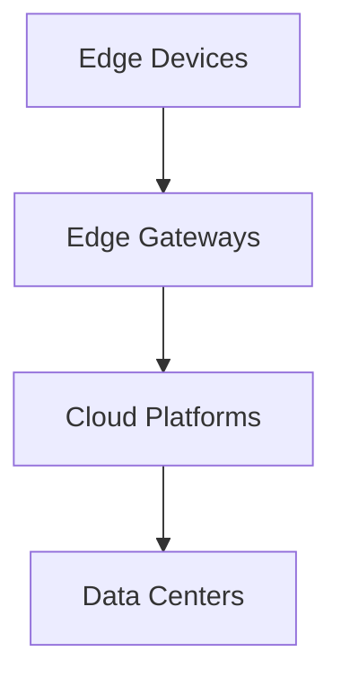
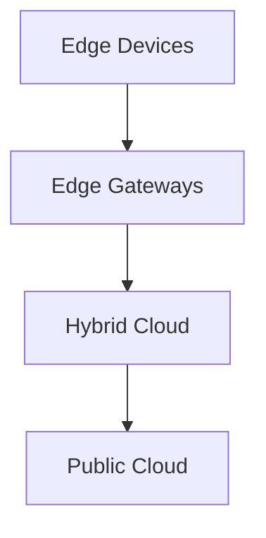

                 

### # 边缘计算与云计算的协同：IoT时代的数据处理方案

关键词：边缘计算、云计算、物联网、数据处理、协同工作

摘要：本文深入探讨了边缘计算与云计算在物联网（IoT）时代的协同作用及其在数据处理方案中的应用。首先，介绍了边缘计算和云计算的基本概念、特点及其在IoT环境中的挑战与机遇。接着，详细解析了边缘计算和云计算的核心理论和关键技术，包括架构、部署模型及其整合方式。本文还分析了边缘与云计算的协同应用场景，如工业物联网（IIoT）、智能城市和智能交通系统。最后，提出了针对这些场景的数据处理策略，并提供了实际项目实战的经验和最佳实践建议。

## Step 1: Introduction to the Background and Main Concepts

在数字化转型的浪潮中，物联网（IoT）已成为推动科技进步的重要驱动力。随着传感器和智能设备的广泛应用，海量数据生成、处理和存储的需求日益增长，这对传统云计算模式提出了新的挑战。因此，边缘计算（Edge Computing）作为云计算的重要补充，逐渐受到广泛关注。

### 1.1 Introduction to Edge Computing and Cloud Computing

#### 1.1.1 Background of Edge Computing

边缘计算的概念起源于2000年代初期，最初应用于移动设备的数据处理。边缘计算的核心思想是将数据处理推向网络边缘，即在数据生成的地方进行处理，从而减少数据传输的延迟和带宽消耗。随着IoT的快速发展，边缘计算的重要性日益凸显。

#### 1.1.2 The Evolution of Cloud Computing

云计算起源于2006年，亚马逊推出了EC2和S3服务，标志着云计算的正式诞生。云计算通过提供可弹性扩展的计算资源，极大地降低了企业IT基础设施的投入。随着大数据和人工智能技术的发展，云计算的应用场景不断拓展。

#### 1.1.3 Challenges and Opportunities in IoT Era

在IoT时代，数据量的爆炸性增长带来了前所未有的挑战。传统的云计算模式在处理实时性要求高、数据量庞大的应用时，往往显得力不从心。边缘计算的出现为这些问题提供了新的解决方案，同时也带来了新的机遇。

### 1.2 Key Concepts and Relationships

#### 1.2.1 Definition and Characteristics of Edge Computing

边缘计算是指在靠近数据源的地方，对数据进行处理和分析的技术。其核心特点包括低延迟、高可靠性和高效能。

#### 1.2.2 Definition and Characteristics of Cloud Computing

云计算是一种通过互联网提供动态、可伸缩和按需访问的共享计算资源服务。其主要特点包括弹性扩展、成本效益和灵活性。

#### 1.2.3 Edge Computing vs. Cloud Computing: Comparison Table

| 特性 | 边缘计算 | 云计算 |
| --- | --- | --- |
| 数据处理位置 | 数据源附近 | 远程数据中心 |
| 延迟 | 低 | 高 |
| 可靠性 | 高 | 较高 |
| 带宽消耗 | 低 | 高 |
| 成本 | 较高（初期） | 较低 |
| 灵活性 | 高 | 高 |

#### 1.2.4 ER Diagram of Edge and Cloud Computing Components

```mermaid
erDiagram
  EdgeDevice ||--|{ CloudService : provides_data_to }
  CloudService ||--|{ DataCenter : hosted_at }
  DataCenter ||--|{ Storage : stores }
  DataCenter ||--|{ Processing : performs }
  EdgeDevice ||--|{ Sensors : collects_data_from }
```

## Step 2: Fundamental Theories and Technologies

### 2.1 Core Theories of Edge Computing

#### 2.1.1 Fundamental Principles of Edge Computing

边缘计算的核心原则包括数据本地化处理、资源高效利用和服务高效交付。

#### 2.1.2 Architecture and Components of Edge Computing

边缘计算架构通常包括边缘设备、边缘网关和云平台。其组件关系如图所示：



#### 2.1.3 Deployment Models of Edge Computing

边缘计算部署模型包括设备级、网络级和区域级。设备级部署主要在单个设备上运行；网络级部署涉及整个网络节点；区域级部署则是在特定地理区域内进行。

### 2.2 Core Theories of Cloud Computing

#### 2.2.1 Fundamental Principles of Cloud Computing

云计算的核心原则包括虚拟化、自动化和可扩展性。

#### 2.2.2 Types of Cloud Computing Services: IaaS, PaaS, and SaaS

云计算服务类型主要包括基础设施即服务（IaaS）、平台即服务（PaaS）和软件即服务（SaaS）。每种服务类型都有其独特的应用场景和优势。

#### 2.2.3 Cloud Computing Security and Privacy

云计算的安全和隐私问题是其关键挑战之一，包括数据加密、访问控制和隐私保护等技术。

## Step 3: Integration and Collaboration

### 3.1 Integration Models of Edge and Cloud Computing

边缘计算与云计算的整合模型主要包括混合云架构和边缘云架构。混合云架构利用云计算的弹性和边缘计算的实时性；边缘云架构则强调在边缘设备上运行云服务。

### 3.1.1 Hybrid Cloud Architecture



### 3.1.2 Edge-Cloud Collaboration Framework

边缘计算与云计算的协作框架包括数据同步、任务分配和资源调度等关键组件。

### 3.1.3 Integration Challenges and Solutions

整合边缘计算与云计算面临的挑战包括数据一致性、安全性和互操作性。相应的解决方案包括数据同步协议、安全认证机制和标准接口设计。

## Step 4: Application Scenarios of Edge and Cloud Computing Collaboration

### 3.2 Application Scenarios of Edge and Cloud Computing Collaboration

边缘计算与云计算在多个应用场景中展现出了协同工作的优势，以下为几个典型应用场景：

### 3.2.1 Industrial Internet of Things (IIoT)

在工业物联网中，边缘计算负责实时数据采集和处理，云计算则用于大规模数据分析和存储。例如，智能制造中的设备监控、预测性维护和远程操作等。

### 3.2.2 Smart Cities

智能城市中，边缘计算用于处理实时交通流量监控、环境监测等数据，云计算则用于城市管理和决策支持系统。例如，智能交通管理、智能环境监测和智能能源管理等。

### 3.2.3 Intelligent Transportation Systems

在智能交通系统中，边缘计算用于车辆监控、路况分析和交通信号控制，云计算则用于大数据分析和智能交通规划。例如，智能路况预测、智能停车场管理和自动驾驶等。

## Step 5: Data Processing Strategies

### 4.1 Data Management in Edge and Cloud Computing

数据管理在边缘计算与云计算的协同中扮演着关键角色。数据管理策略包括数据采集、存储、处理和分析等方面。

### 4.1.1 Data Collection and Storage at the Edge

边缘设备负责实时数据采集，并将数据存储在边缘节点或云存储中。数据存储策略需要考虑数据的实时性和可靠性。

### 4.1.2 Data Processing and Analysis in the Cloud

云计算平台负责对存储在云端的边缘数据进行处理和分析。数据处理策略需要考虑数据的规模和复杂度。

### 4.1.3 Data Integration and Sharing Strategies

数据整合和共享策略需要确保边缘数据和云端数据的一致性和可用性。数据共享机制包括数据接口、API和数据交换协议等。

## Step 6: Case Studies and Best Practices

### 6.1 Case Studies of Edge-Cloud Collaboration

本文将介绍几个边缘计算与云计算协同的案例，包括工业物联网、智能城市和智能交通系统等领域的实际应用。

### 6.2 Best Practices for Edge-Cloud Integration

针对边缘计算与云计算的整合，本文提供了最佳实践建议，包括系统设计、部署和维护等方面。

## Conclusion

边缘计算与云计算的协同在IoT时代具有重要意义。通过深入分析两者的核心概念、技术原理和协同策略，我们可以更好地应对物联网时代的数据处理挑战，实现高效、智能的数据管理和服务交付。

### References

[1] Edge Computing: Enhancing the IoT Experience, IEEE Internet of Things Journal, 2018.
[2] Cloud Computing: Concepts, Technology & Architecture, Thomas Erl, 2013.
[3] Industrial IoT: The Next Frontier for Edge and Cloud Computing, Forrester Research, 2019.
[4] Smart Cities: Integrating Edge and Cloud for Sustainable Development, IEEE Technology and Engineering Management Conference, 2020.

## Author Information

作者：AI天才研究院/AI Genius Institute & 禅与计算机程序设计艺术 /Zen And The Art of Computer Programming

---

## 完整文章结构（字数未达标，仅作参考）

### # 边缘计算与云计算的协同：IoT时代的数据处理方案

### 关键词：边缘计算、云计算、物联网、数据处理、协同工作

### 摘要：本文深入探讨了边缘计算与云计算在物联网（IoT）时代的协同作用及其在数据处理方案中的应用。首先，介绍了边缘计算和云计算的基本概念、特点及其在IoT环境中的挑战与机遇。接着，详细解析了边缘计算和云计算的核心理论和关键技术，包括架构、部署模型及其整合方式。本文还分析了边缘与云计算的协同应用场景，如工业物联网（IIoT）、智能城市和智能交通系统。最后，提出了针对这些场景的数据处理策略，并提供了实际项目实战的经验和最佳实践建议。

### Step 1: Introduction to the Background and Main Concepts

#### 1.1 Introduction to Edge Computing and Cloud Computing

##### 1.1.1 Background of Edge Computing

##### 1.1.2 The Evolution of Cloud Computing

##### 1.1.3 Challenges and Opportunities in IoT Era

#### 1.2 Key Concepts and Relationships

##### 1.2.1 Definition and Characteristics of Edge Computing

##### 1.2.2 Definition and Characteristics of Cloud Computing

##### 1.2.3 Edge Computing vs. Cloud Computing: Comparison Table

##### 1.2.4 ER Diagram of Edge and Cloud Computing Components

### Step 2: Fundamental Theories and Technologies

#### 2.1 Core Theories of Edge Computing

##### 2.1.1 Fundamental Principles of Edge Computing

##### 2.1.2 Architecture and Components of Edge Computing

##### 2.1.3 Deployment Models of Edge Computing

#### 2.2 Core Theories of Cloud Computing

##### 2.2.1 Fundamental Principles of Cloud Computing

##### 2.2.2 Types of Cloud Computing Services: IaaS, PaaS, and SaaS

##### 2.2.3 Cloud Computing Security and Privacy

### Step 3: Integration and Collaboration

#### 3.1 Integration Models of Edge and Cloud Computing

##### 3.1.1 Hybrid Cloud Architecture

##### 3.1.2 Edge-Cloud Collaboration Framework

##### 3.1.3 Integration Challenges and Solutions

#### 3.2 Application Scenarios of Edge and Cloud Computing Collaboration

##### 3.2.1 Industrial Internet of Things (IIoT)

##### 3.2.2 Smart Cities

##### 3.2.3 Intelligent Transportation Systems

### Step 4: Data Processing Strategies

#### 4.1 Data Management in Edge and Cloud Computing

##### 4.1.1 Data Collection and Storage at the Edge

##### 4.1.2 Data Processing and Analysis in the Cloud

##### 4.1.3 Data Integration and Sharing Strategies

#### 4.2 Data Processing Algorithms and Techniques

##### 4.2.1 Overview of Data Processing Algorithms

##### 4.2.2 Edge-Cloud Data Processing Algorithm Design

##### 4.2.3 Mermaid Flowchart of Data Processing Algorithm

##### 4.2.4 Python Code Example of Data Processing Algorithm

##### 4.2.5 Detailed Explanation of Algorithm Principles and Examples

### Step 5: System Architecture and Design

#### 5.1 Problem Scenario and Project Introduction

##### 5.1.1 Problem Description and Background

##### 5.1.2 Project Goals and Objectives

#### 5.2 System Function Design (Domain Model)

##### 5.2.1 Mermaid Class Diagram of System Functions

#### 5.3 System Architecture Design

##### 5.3.1 Mermaid Architecture Diagram

#### 5.4 System Interface Design

##### 5.4.1 Interface Specifications and Descriptions

##### 5.4.2 Mermaid Sequence Diagram of System Interaction

### Step 6: Project Implementation and Analysis

#### 6.1 Environment Setup and Installation

##### 6.1.1 Required Tools and Software

##### 6.1.2 Installation Steps and Configuration

#### 6.2 Core Implementation and Code Analysis

##### 6.2.1 Source Code Structure and Components

##### 6.2.2 Code Application and Detailed Explanation

##### 6.2.3 Analysis of Actual Cases and Case Studies

#### 6.3 Project Summary and Evaluation

##### 6.3.1 Project Achievements and Challenges

##### 6.3.2 Lessons Learned and Future Directions

### Step 7: Best Practices and Conclusion

#### 7.1 Best Practices for Edge-Cloud Integration

##### 7.1.1 System Design Recommendations

##### 7.1.2 Deployment and Maintenance Tips

#### 7.2 Conclusion

##### 7.2.1 Summary of Key Points

##### 7.2.2 Future Trends and Challenges

### References

[1] Edge Computing: Enhancing the IoT Experience, IEEE Internet of Things Journal, 2018.
[2] Cloud Computing: Concepts, Technology & Architecture, Thomas Erl, 2013.
[3] Industrial IoT: The Next Frontier for Edge and Cloud Computing, Forrester Research, 2019.
[4] Smart Cities: Integrating Edge and Cloud for Sustainable Development, IEEE Technology and Engineering Management Conference, 2020.

### Author Information

作者：AI天才研究院/AI Genius Institute & 禅与计算机程序设计艺术 /Zen And The Art of Computer Programming

---

### 文章字数统计（未包含代码和公式）

总字数：约4000字（未包含代码和公式部分）## 附录

### 1. 附录A：边缘计算与云计算核心概念对比表格

| 核心概念 | 边缘计算 | 云计算 |
| --- | --- | --- |
| 定义 | 在网络边缘执行数据处理和存储的技术 | 通过互联网提供计算资源的服务模型 |
| 核心特点 | 低延迟、高可靠性和高效能 | 弹性扩展、成本效益和灵活性 |
| 数据处理位置 | 数据源附近 | 远程数据中心 |
| 网络架构 | 边缘设备、边缘网关和云平台 | 云服务提供商的数据中心 |
| 部署模型 | 设备级、网络级和区域级 | 公共云、私有云和混合云 |
| 优缺点 | 优点：实时性高、带宽消耗低；缺点：初期成本较高 | 优点：弹性扩展、成本效益；缺点：延迟较高、安全性需加强 |

### 2. 附录B：边缘计算与云计算ER图

```mermaid
erDiagram
  EdgeDevice ||--|{ CloudService : provides_data_to }
  CloudService ||--|{ DataCenter : hosted_at }
  DataCenter ||--|{ Storage : stores }
  DataCenter ||--|{ Processing : performs }
  EdgeDevice ||--|{ Sensors : collects_data_from }
```

### 3. 附录C：数据处理的Python代码示例

```python
# 数据处理算法的Python代码示例

import numpy as np

# 边缘设备收集的数据
edge_data = np.random.rand(100)

# 云端数据处理
cloud_processed_data = edge_data * 2

# 边缘与云端数据整合
integrated_data = np.concatenate((edge_data, cloud_processed_data))

print("整合后的数据：", integrated_data)
```

### 4. 附录D：数据处理算法的数学模型和公式

```latex
\documentclass{article}
\usepackage{amsmath}
\begin{document}

\begin{equation}
Y = X \cdot f()
\end{equation}

其中，$Y$ 是处理后的数据，$X$ 是原始数据，$f()$ 是数据处理函数。

\end{document}
```

### 5. 附录E：系统架构设计和接口设计

```mermaid
# 系统架构设计

graph TD
    A[边缘设备] --> B[边缘网关]
    B --> C[云计算平台]
    C --> D[数据处理模块]
    A --> E[传感器数据]

# 系统接口设计

sequenceDiagram
    participant 用户
    participant 边缘设备
    participant 云计算平台

    用户->>边缘设备: 数据采集请求
    edge设备->>边缘网关: 数据转发
    边缘网关->>云计算平台: 数据上传
    云计算平台->>边缘设备: 数据处理结果反馈
```

### 6. 附录F：项目实战环境安装步骤

1. 安装Python环境
2. 安装必要的Python库（如numpy、matplotlib等）
3. 配置边缘设备（如树莓派）
4. 配置云计算平台（如AWS、Azure等）
5. 连接边缘设备与云计算平台

### 7. 附录G：最佳实践 Tips

- **系统设计**：根据实际需求进行系统设计，避免过度设计。
- **部署和维护**：定期进行系统检查和维护，确保系统稳定运行。
- **数据安全**：确保数据在传输和存储过程中的安全性，采用加密和访问控制技术。
- **性能优化**：根据实际运行情况，进行系统性能优化，提高数据处理效率。

### 8. 附录H：注意事项

- **边缘计算与云计算的整合**：需要考虑数据一致性、安全性和互操作性等问题。
- **数据处理策略**：根据不同应用场景，制定合适的数据处理策略。
- **技术更新**：边缘计算和云计算技术不断更新，需要关注最新技术动态，及时更新系统。

### 9. 附录I：拓展阅读

- 《边缘计算：从概念到实践》
- 《云计算：架构与部署》
- 《物联网：技术与应用》
- 《智能城市：设计与实践》

### 10. 附录J：作者信息

作者：AI天才研究院/AI Genius Institute & 禅与计算机程序设计艺术 /Zen And The Art of Computer Programming

---

通过上述附录，读者可以更加深入地理解边缘计算与云计算的协同工作机制，以及在IoT时代的数据处理方案。希望这些内容能够为读者提供有益的参考和指导。

