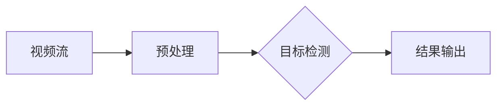

                 


# 边缘计算在实时视频分析中的应用

## 关键词

边缘计算，实时视频分析，智能监控，物联网，车联网

## 摘要

随着物联网、智能监控等技术的发展，边缘计算在实时视频分析中的应用日益广泛。本文首先介绍了边缘计算的基本概念和优势，然后探讨了实时视频分析的关键技术，接着分析了边缘计算与实时视频分析的技术融合，最后通过实际案例分享了最佳实践。本文旨在为读者提供关于边缘计算在实时视频分析中应用的全面理解和深入思考。

### 目录

1. 引言
   1.1 边缘计算概述
   1.2 实时视频分析概述
   1.3 本文结构

2. 边缘计算基础
   2.1 边缘计算架构
   2.2 边缘设备
   2.3 边缘网络

3. 实时视频分析技术
   3.1 视频处理技术
   3.2 视频压缩技术
   3.3 视频分析算法

4. 边缘计算与实时视频分析的融合
   4.1 应用场景
   4.2 技术融合

5. 实时视频分析系统的设计与实现
   5.1 系统需求分析
   5.2 系统架构设计
   5.3 系统实现细节

6. 边缘计算在实时视频分析中的最佳实践
   6.1 成功案例分享
   6.2 挑战与解决方案

7. 总结与展望
   7.1 应用前景
   7.2 总结与展望

### 引言

#### 1.1 边缘计算概述

边缘计算是一种分布式计算架构，它将计算、存储和网络功能分散到网络的边缘，即在靠近数据源或用户的地方进行数据处理。与传统云计算相比，边缘计算具有低延迟、高带宽和强安全性的优势。随着物联网设备的普及，边缘计算在实时视频分析中的应用越来越广泛。

#### 1.2 实时视频分析概述

实时视频分析是一种利用计算机视觉和机器学习技术对视频流进行实时处理和分析的技术。它包括视频数据采集、处理、压缩和视频分析算法等多个环节。实时视频分析在智能监控、安全防护、交通管理和工业自动化等领域有着广泛的应用。

#### 1.3 本文结构

本文首先介绍了边缘计算的基本概念和优势，然后探讨了实时视频分析的关键技术，接着分析了边缘计算与实时视频分析的技术融合，最后通过实际案例分享了最佳实践。

### 边缘计算基础

#### 2.1 边缘计算架构

边缘计算架构包括边缘设备、边缘网络和云中心。边缘设备负责数据采集和初步处理，边缘网络负责数据传输，云中心负责数据处理和存储。

#### 2.2 边缘设备

边缘设备包括传感器、摄像头、智能终端等。它们具有低功耗、高性能、高可靠性等特点。

#### 2.3 边缘网络

边缘网络是指连接边缘设备和云中心的网络，它包括Wi-Fi、5G、光纤等。

### 实时视频分析技术

#### 3.1 视频处理技术

视频处理技术包括视频数据采集、处理和传输。视频数据采集是通过摄像头等设备获取视频数据；视频处理包括视频增强、去噪等；视频传输是通过网络传输视频数据。

#### 3.2 视频压缩技术

视频压缩技术包括视频编码和解码。视频编码是将视频数据转换为压缩格式，如H.264；视频解码是将压缩格式转换为原始视频数据。

#### 3.3 视频分析算法

视频分析算法包括目标检测、人脸识别、行为分析等。这些算法通过对视频数据进行处理和分析，实现对视频内容的理解和识别。

### 边缘计算与实时视频分析的融合

#### 4.1 应用场景

边缘计算与实时视频分析在智能监控、物联网、车联网等领域有着广泛的应用。例如，在智能监控中，边缘计算可以实现对视频数据的实时处理和分析，提高监控效率；在物联网中，边缘计算可以实现对设备数据的实时处理和分析，提高设备运维效率。

#### 4.2 技术融合

边缘计算与实时视频分析的技术融合主要体现在以下几个方面：

1. 边缘设备：将视频处理和分析算法部署到边缘设备上，实现本地化处理。
2. 边缘网络：优化边缘网络设计，提高数据传输速度和稳定性。
3. 云中心：将边缘设备无法处理的数据上传到云中心，进行进一步处理和分析。

### 实时视频分析系统的设计与实现

#### 5.1 系统需求分析

实时视频分析系统的需求分析包括系统功能需求、性能需求和安全性需求。

#### 5.2 系统架构设计

实时视频分析系统的架构设计包括边缘设备、边缘网络和云中心。边缘设备负责数据采集和初步处理；边缘网络负责数据传输；云中心负责数据处理和存储。

#### 5.3 系统实现细节

实时视频分析系统的实现细节包括边缘设备的硬件选择、视频分析算法的实现和系统性能优化。

### 边缘计算在实时视频分析中的最佳实践

#### 6.1 成功案例分享

在智能交通监控、智慧城市安防和工业自动化监控等领域，边缘计算在实时视频分析中有着成功应用。

#### 6.2 挑战与解决方案

边缘计算在实时视频分析中面临的挑战包括数据隐私保护、系统性能优化和系统安全防护。解决方案包括数据加密、性能优化和防火墙等。

### 总结与展望

边缘计算在实时视频分析中的应用前景广阔，它将为智能监控、物联网和车联网等领域带来更多可能。未来，随着技术的不断进步，边缘计算在实时视频分析中的应用将更加深入和广泛。  
 
**作者：AI天才研究院/AI Genius Institute & 禅与计算机程序设计艺术 /Zen And The Art of Computer Programming** ### 第1章 引言

随着信息技术的飞速发展，边缘计算和实时视频分析已成为现代智能系统中的重要组成部分。边缘计算通过在数据产生的源头附近执行计算任务，极大地提高了数据处理的速度和效率，减少了数据传输的延迟。而实时视频分析则利用计算机视觉和人工智能技术，对视频流进行实时处理，以提取有价值的信息，如人脸识别、行为分析等。两者结合，不仅为各行各业提供了强大的技术支撑，还推动了智能监控、物联网和车联网等领域的快速发展。

本章将首先介绍边缘计算的基本概念和核心优势，接着讨论实时视频分析的定义和应用场景，最后概述本文的结构和主要内容。通过这些内容，我们将为后续章节的讨论奠定基础，并引导读者了解边缘计算在实时视频分析中的重要性。

#### 1.1 边缘计算概述

**核心概念术语说明**

边缘计算是一种分布式计算范式，它将计算任务从传统的中心化数据中心迁移到网络边缘，即靠近数据源或用户的地方。这样做的目的是为了减少数据传输的延迟，提高系统的响应速度，同时减轻中心数据中心的负担。

**问题背景**

在云计算时代，大多数计算任务和数据存储都集中在中心化的数据中心。然而，这种模式在处理大量实时数据时存在明显的不足。首先，数据传输的延迟较高，尤其是在远程数据传输时；其次，中心数据中心的计算能力和存储能力有限，难以满足不断增长的数据处理需求；最后，中心化的架构容易成为网络攻击的目标，安全性存在风险。

**问题描述**

为了解决上述问题，边缘计算应运而生。它通过将计算任务分散到网络边缘，即靠近数据源或用户的地方，实现了以下几个目标：

1. **降低延迟**：通过在数据产生的地方处理数据，极大地减少了数据传输的延迟。
2. **提高效率**：边缘设备具有本地处理能力，可以快速响应实时数据，提高整体系统的效率。
3. **减轻中心负担**：将部分计算任务分散到边缘，减轻了中心数据中心的负担，提高了系统的可扩展性。
4. **增强安全性**：边缘计算可以更好地保护数据，减少了数据在网络中传输的时间，降低了被攻击的风险。

**问题解决**

边缘计算的实现涉及以下几个关键步骤：

1. **数据采集**：在数据产生的源头（如传感器、摄像头等）进行数据采集。
2. **数据处理**：在边缘设备上对采集到的数据进行初步处理，如去噪、压缩等。
3. **数据传输**：将处理后的数据传输到云中心或边缘服务器，进行进一步处理和分析。
4. **数据存储**：在边缘设备或云中心存储处理后的数据，以供后续使用。

**边界与外延**

边缘计算的边界在于数据处理的范围，它不仅包括物理上的网络边缘，还涵盖了虚拟的边缘环境，如移动设备、物联网设备等。随着5G、物联网等技术的发展，边缘计算的边界将进一步扩大，其应用领域也将不断拓展。

**概念结构与核心要素组成**

边缘计算的概念结构包括以下几个核心要素：

1. **边缘设备**：包括传感器、摄像头、智能终端等，负责数据采集和初步处理。
2. **边缘网络**：连接边缘设备和云中心的网络，如Wi-Fi、5G、光纤等，负责数据传输。
3. **云中心**：负责对边缘设备上传的数据进行进一步处理和分析。

#### 1.2 实时视频分析概述

**核心概念与联系**

实时视频分析是一种利用计算机视觉和人工智能技术对视频流进行实时处理和分析的技术。它包括以下几个核心概念：

1. **视频数据采集**：通过摄像头等设备获取视频流。
2. **视频数据预处理**：对视频流进行去噪、增强、压缩等处理，以提高后续分析的效果。
3. **视频压缩技术**：通过视频编码技术，将视频流压缩成较小的数据，以便于传输和处理。
4. **视频分析算法**：包括目标检测、人脸识别、行为分析等，用于从视频中提取有价值的信息。
5. **视频数据存储**：将处理后的视频数据存储起来，以供后续使用或分析。

**概念属性特征对比表格**

| 概念       | 特征                                       | 对比       |
|------------|--------------------------------------------|------------|
| 视频数据采集 | 实时获取视频流                             | 非实时采集 |
| 视频数据预处理 | 去噪、增强、压缩等处理                    | 无预处理   |
| 视频压缩技术 | 使用编码技术将视频压缩成较小数据           | 不压缩     |
| 视频分析算法 | 目标检测、人脸识别、行为分析等             | 无分析     |
| 视频数据存储 | 存储处理后的视频数据                      | 不存储     |

**ER实体关系图架构**

```mermaid
erDiagram
  VideoStream ||--|{ VideoDataPreprocessing } : "包括去噪、增强、压缩等处理"
  VideoDataPreprocessing ||--|{ VideoCompression } : "使用编码技术压缩视频数据"
  VideoDataPreprocessing ||--|{ VideoAnalysis } : "应用目标检测、人脸识别、行为分析等算法"
  VideoStream ||--|{ VideoDataStorage } : "存储处理后的视频数据"
```

**算法原理讲解**

实时视频分析的核心在于视频处理和分析算法。以下是一个简单的目标检测算法的流程图：



预处理阶段包括去噪和增强等操作，以提高目标检测的准确性。目标检测阶段使用卷积神经网络（CNN）等深度学习模型，从视频中识别目标。结果输出阶段将检测到的目标位置和属性等信息输出。

```python
# 示例：使用深度学习模型进行目标检测
import cv2
import tensorflow as tf

# 加载预训练的深度学习模型
model = tf.keras.models.load_model('path/to/预训练模型.h5')

# 加载视频流
video = cv2.VideoCapture('path/to/video.mp4')

while video.isOpened():
    ret, frame = video.read()
    if not ret:
        break
    
    # 预处理
    preprocessed_frame = preprocess_frame(frame)
    
    # 目标检测
    predictions = model.predict(preprocessed_frame)
    
    # 输出检测结果
    output_frame = visualize_detections(frame, predictions)
    
    cv2.imshow('output', output_frame)
    
    if cv2.waitKey(1) & 0xFF == ord('q'):
        break

video.release()
cv2.destroyAllWindows()
```

**数学公式使用**

在视频分析中，常用的数学模型和公式包括：

$$
L_1 = \sum_{i=1}^{n} (x_i - \bar{x})^2
$$

其中，$L_1$表示数据集的均方误差（MSE），$x_i$表示每个数据点，$\bar{x}$表示数据集的平均值。

$$
L_2 = \sum_{i=1}^{n} (x_i - \bar{x})^2
$$

其中，$L_2$表示数据集的均方根误差（RMSE），其余符号与上式相同。

**系统分析与架构设计方案**

在实时视频分析系统中，架构设计至关重要。以下是一个简化的系统架构设计方案：

#### 1. 系统功能设计

- **数据采集模块**：负责采集视频流。
- **预处理模块**：负责对视频流进行去噪、增强等预处理。
- **目标检测模块**：使用深度学习模型进行目标检测。
- **结果输出模块**：将检测结果输出。

#### 2. 系统架构设计


#### 3. 系统接口设计和系统交互


**项目实战**

在项目实战中，我们使用以下步骤进行边缘计算在实时视频分析中的应用：

1. **环境安装**：安装所需的边缘计算设备和软件，如边缘设备、边缘服务器和云服务器等。
2. **系统核心实现**：编写边缘设备和边缘服务器的代码，实现视频采集、预处理、目标检测等功能。
3. **代码应用解读与分析**：对实现的代码进行解读，分析其原理和优缺点。
4. **实际案例分析和详细讲解剖析**：通过实际案例，展示边缘计算在实时视频分析中的应用效果。
5. **项目小结**：总结项目经验和收获。

**最佳实践 tips**

- **优化数据传输**：使用高效的传输协议和算法，如QUIC和WebAssembly，以提高数据传输速度和稳定性。
- **选择合适的边缘设备**：根据实际需求，选择具有高性能、低功耗和可靠性的边缘设备。
- **优化算法模型**：选择适合边缘计算的算法模型，如小模型和量化模型，以提高处理速度。

**小结**

边缘计算在实时视频分析中的应用为各行各业提供了强大的技术支撑，提高了数据处理效率和系统性能。未来，随着技术的不断进步，边缘计算在实时视频分析中的应用将更加深入和广泛。

**注意事项**

- **数据隐私保护**：在边缘计算中，数据隐私保护至关重要。需要采取有效的数据加密和安全传输机制，确保数据安全。
- **系统性能优化**：边缘计算系统需要针对不同场景进行性能优化，以提高系统的响应速度和处理能力。

**拓展阅读**

- 《边缘计算：从边缘设备到云中心的分布式计算技术》
- 《实时视频分析：从基础到应用》
- 《计算机视觉：算法与应用》

### 第2章 边缘计算基础

边缘计算作为一种新兴的分布式计算范式，其在现代智能系统中的应用日益广泛。本章将深入探讨边缘计算的基础知识，包括边缘计算架构、边缘设备和边缘网络。通过对这些基础知识的了解，读者将能够更好地理解边缘计算的原理和应用。

#### 2.1 边缘计算架构

边缘计算架构是边缘计算系统的核心，它决定了系统的性能、可靠性和可扩展性。边缘计算架构通常包括三个主要部分：边缘设备、边缘网络和云中心。

1. **边缘设备**：边缘设备是边缘计算架构的终端节点，负责数据采集、初步处理和实时分析。常见的边缘设备包括传感器、摄像头、智能终端等。这些设备通常具有低功耗、高性能、高可靠性的特点。

2. **边缘网络**：边缘网络是连接边缘设备和云中心的通信基础设施。边缘网络的设计和优化对于边缘计算的性能至关重要。常见的边缘网络技术包括Wi-Fi、5G、光纤等。边缘网络不仅要保证数据传输的速度和稳定性，还要能够应对大规模设备的连接需求。

3. **云中心**：云中心是边缘计算架构的核心，负责处理边缘设备上传的数据，进行深度分析和存储。云中心通常具有强大的计算能力和存储能力，可以处理大规模数据集。同时，云中心还负责边缘设备和终端用户的连接，提供统一的接口和平台。

**边缘计算架构图**


**架构的优势**

- **低延迟**：边缘设备靠近数据源，可以实时处理数据，减少了数据传输的延迟。
- **高效率**：边缘设备具有本地计算能力，可以减轻中心数据中心的负担，提高整体系统的效率。
- **强安全性**：边缘计算可以更好地保护数据，减少了数据在网络中传输的时间，降低了被攻击的风险。

**架构的挑战**

- **数据一致性**：在分布式系统中，数据一致性问题是一个挑战。如何保证边缘设备和云中心之间的数据一致性，需要有效的同步机制和算法。
- **可靠性**：边缘设备通常处于恶劣的环境中，需要具备高可靠性，以避免系统故障。

#### 2.2 边缘设备

边缘设备是边缘计算系统的核心组成部分，其性能直接影响系统的整体性能。边缘设备的选择需要考虑以下几个因素：

1. **处理能力**：边缘设备需要具备足够的处理能力，以支持实时数据处理和深度学习模型的运行。常用的处理平台包括ARM处理器、FPGA和GPU等。

2. **功耗**：边缘设备通常运行在电池或有限的电源下，因此功耗是一个重要的考虑因素。低功耗的设备可以延长设备的使用寿命，降低维护成本。

3. **存储容量**：边缘设备需要足够的存储容量，以存储实时处理的数据和模型。此外，存储容量还需要考虑到数据备份和冗余存储的需求。

4. **网络连接**：边缘设备需要具备稳定的网络连接能力，以确保数据能够及时传输到云中心或其他边缘设备。

**边缘设备的类型**

- **物联网设备**：如智能传感器、智能摄像头等，通常用于环境监测、智能家居等领域。
- **智能终端**：如智能手机、平板电脑等，通常用于个人用户的数据处理和交互。
- **边缘服务器**：具有更高的处理能力和存储容量，通常用于处理大规模数据集和提供云计算服务。

**边缘设备的硬件选择**

- **处理器**：选择高性能、低功耗的处理器，如ARM Cortex-A系列或RISC-V架构。
- **存储器**：选择大容量、高速度的存储器，如DDR4内存和NVMe SSD。
- **网络接口**：选择高速、稳定的网络接口，如Wi-Fi 6和5G网络。

**边缘设备的软件生态**

- **操作系统**：常见的操作系统包括Linux、Android和Windows IoT等，选择合适的操作系统可以满足不同的应用需求。
- **开发框架**：选择适合边缘设备的开发框架，如Python、Node.js和Java等，以简化开发过程。
- **AI模型库**：选择适合边缘设备的AI模型库，如TensorFlow Lite和ONNX Runtime等，以支持深度学习模型的部署。

#### 2.3 边缘网络

边缘网络是连接边缘设备和云中心的基础设施，其设计和优化对边缘计算的性能至关重要。边缘网络的设计需要考虑以下几个因素：

1. **带宽**：边缘网络需要提供足够的带宽，以满足大量边缘设备同时传输数据的需求。带宽的选择需要根据实际应用场景进行评估。

2. **延迟**：边缘网络的延迟需要尽可能低，以确保边缘设备能够实时处理数据。延迟过高会导致数据处理的延迟，影响系统的响应速度。

3. **可靠性**：边缘网络需要具备高可靠性，以避免数据传输中断或丢失。网络可靠性可以通过冗余设计和故障恢复机制来保证。

4. **安全性**：边缘网络需要提供安全的数据传输机制，以防止数据在传输过程中被窃取或篡改。常用的安全机制包括数据加密、身份验证和访问控制等。

**边缘网络的设计与优化**

- **分布式网络架构**：采用分布式网络架构，将网络节点分散在多个位置，以提高网络的带宽和可靠性。
- **网络优化算法**：采用网络优化算法，如路由优化和流量调度，以减少网络延迟和带宽消耗。
- **网络监控与维护**：建立完善的网络监控与维护系统，实时监测网络性能，及时发现和解决问题。

**边缘网络的安全性**

- **数据加密**：采用数据加密技术，如TLS和SSL，以保护数据在传输过程中的安全。
- **身份验证**：采用身份验证技术，如OAuth和Kerberos，以验证边缘设备和用户的身份。
- **访问控制**：采用访问控制技术，如ACL和RBAC，以限制对边缘设备和数据的访问权限。

通过本章的讨论，读者可以全面了解边缘计算的基础知识，包括边缘计算架构、边缘设备和边缘网络。这些基础知识对于理解边缘计算在实时视频分析中的应用至关重要。

### 第3章 实时视频分析技术

实时视频分析技术是边缘计算应用的重要组成部分，它通过对视频流进行实时处理和分析，提取有价值的信息。本章将详细探讨实时视频分析的关键技术，包括视频处理技术、视频压缩技术和视频分析算法。

#### 3.1 视频处理技术

视频处理技术是实时视频分析的基础，它包括视频数据采集、处理和传输。以下是对这些技术的详细讲解。

**视频数据采集**

视频数据采集是通过摄像头等设备获取视频流。视频数据采集的质量直接影响到后续处理的准确性。常用的视频数据采集设备包括高清摄像头、红外摄像头和鱼眼摄像头等。

- **高清摄像头**：适用于普通场景，提供高分辨率视频流。
- **红外摄像头**：适用于夜间或低光环境，提供清晰的图像。
- **鱼眼摄像头**：提供全景视角，适用于需要大范围监控的场景。

**视频数据处理**

视频数据处理包括去噪、增强和压缩等处理。去噪和增强处理可以提高视频的质量，压缩处理则可以减小视频数据的体积，便于传输和存储。

- **去噪处理**：去除视频中的噪声，提高图像的清晰度。常用的去噪算法包括均值滤波、高斯滤波和中值滤波等。
- **增强处理**：增强视频中的特定区域或特征，提高图像的可读性。常用的增强算法包括对比度增强、亮度增强和锐化等。
- **压缩处理**：将视频数据压缩成较小的体积，以便于传输和存储。常用的压缩算法包括H.264、H.265和HEVC等。

**视频数据传输**

视频数据传输是将处理后的视频数据传输到云中心或边缘服务器。视频数据传输的效率和质量直接影响到实时视频分析的效果。常用的视频数据传输协议包括RTMP、HTTP和WebRTC等。

- **RTMP**：实时消息传输协议，适用于实时视频传输。
- **HTTP**：超文本传输协议，适用于非实时视频传输。
- **WebRTC**：网页实时通信协议，适用于实时视频通信。

#### 3.2 视频压缩技术

视频压缩技术是视频处理中至关重要的一环，它通过将视频数据压缩成较小的体积，提高传输和存储的效率。以下是对视频压缩技术的详细讲解。

**视频压缩算法**

视频压缩算法可以分为空间压缩和时间压缩。空间压缩通过减少视频数据的冗余信息来实现，时间压缩通过减少连续帧之间的冗余信息来实现。

- **空间压缩**：常用的空间压缩算法包括H.264、H.265和HEVC等。这些算法通过预测和编码技术，减少视频数据的冗余信息。
- **时间压缩**：常用的时间压缩算法包括视频编码和帧间压缩。视频编码将连续的视频帧编码成一系列帧，帧间压缩通过只传输变化的部分来减少冗余信息。

**视频压缩的优势与局限**

**优势**

- **提高传输效率**：通过压缩，视频数据可以以更小的体积传输，提高传输效率。
- **降低存储成本**：通过压缩，视频数据可以以更小的体积存储，降低存储成本。
- **减少带宽消耗**：通过压缩，视频数据可以以更小的体积占用带宽，减少带宽消耗。

**局限**

- **压缩失真**：压缩过程中可能会引入失真，降低视频质量。
- **解码延迟**：解码过程需要一定的时间，可能会引入延迟。
- **计算资源消耗**：压缩和解码过程需要计算资源，可能会增加系统的负担。

**常见视频压缩标准**

- **H.264**：是目前最流行的视频压缩标准，广泛用于流媒体和视频会议等应用。
- **H.265**：是H.264的升级版，提供了更高的压缩效率和更好的视频质量。
- **HEVC**：是H.265的国际标准，提供了更高的压缩效率和更好的视频质量。

#### 3.3 视频分析算法

视频分析算法是实时视频分析的核心，它通过分析视频数据，提取有价值的信息。以下是对视频分析算法的详细讲解。

**视频分析的基本原理**

视频分析算法通常基于计算机视觉和人工智能技术。计算机视觉技术用于处理和识别视频图像，人工智能技术用于学习和预测。视频分析的基本原理包括：

- **图像预处理**：对视频图像进行预处理，如去噪、增强和分割等。
- **特征提取**：从预处理后的图像中提取特征，如边缘、纹理和颜色等。
- **模式识别**：使用机器学习算法，对提取的特征进行分类和识别。

**视频分析的关键算法**

视频分析的关键算法包括目标检测、人脸识别、行为分析和场景识别等。

- **目标检测**：用于检测视频中的目标对象，如行人、车辆和物体等。常用的目标检测算法包括YOLO、SSD和Faster R-CNN等。
- **人脸识别**：用于识别视频中的人脸，如身份验证和视频监控等。常用的人脸识别算法包括基于特征的人脸识别和基于深度学习的人脸识别等。
- **行为分析**：用于分析视频中的行为，如人流量统计、异常行为检测等。常用的行为分析算法包括基于模型的行为分析和基于数据挖掘的行为分析等。
- **场景识别**：用于识别视频中的场景，如城市监控、智能家居和工业监控等。常用的场景识别算法包括基于视觉的语义分割和基于深度学习的场景识别等。

**视频分析的优化策略**

视频分析算法的性能受到多种因素的影响，如数据质量、算法复杂度和计算资源等。优化视频分析算法的策略包括：

- **算法优化**：通过改进算法模型和优化算法流程，提高算法的性能。
- **数据增强**：通过增加训练数据集和改进数据预处理方法，提高算法的泛化能力。
- **模型压缩**：通过模型压缩技术，减小模型的体积和计算量，提高模型的部署效率。
- **分布式计算**：通过分布式计算技术，提高算法的处理速度和吞吐量。

通过本章的讨论，读者可以全面了解实时视频分析的技术原理和应用。这些技术为边缘计算在实时视频分析中的应用提供了强有力的支持，有助于提升系统的性能和可靠性。

### 第4章 边缘计算与实时视频分析的融合

边缘计算与实时视频分析的融合，为现代智能系统带来了诸多技术优势。本章节将深入探讨边缘计算与实时视频分析的技术融合，分析其在实际应用场景中的优势，并探讨如何实现技术融合。

#### 4.1 边缘计算在实时视频分析中的应用场景

边缘计算在实时视频分析中的应用场景非常广泛，以下是一些典型的应用场景：

**智能监控**

智能监控是边缘计算在实时视频分析中最常见的应用场景之一。通过在监控现场部署边缘设备，可以实时处理和分析视频流，实现对目标的实时监控和警报。例如，在智能交通监控中，边缘设备可以实时识别和跟踪车辆，分析交通流量，优化交通信号。

**物联网**

物联网（IoT）设备的普及，使得边缘计算在实时视频分析中的应用更加广泛。在智能家居、智能农业和智能工业等领域，边缘设备可以实时监控环境状况，分析设备运行状态，提供智能决策支持。例如，在智能农业中，边缘设备可以实时监测农田环境，分析作物生长状况，提供精准灌溉建议。

**车联网**

车联网（V2X）是边缘计算在实时视频分析中的另一个重要应用场景。通过在车辆和道路基础设施之间部署边缘设备，可以实现车辆之间的通信和协同，提高交通效率和安全。例如，在智能交通系统中，边缘设备可以实时分析车辆行驶数据，预测交通状况，提供最佳行驶路线。

**工业自动化**

在工业自动化领域，边缘计算与实时视频分析的结合，可以实现对生产过程的实时监控和优化。例如，在制造业中，边缘设备可以实时检测产品质量，分析生产效率，优化生产流程。

**医疗健康**

在医疗健康领域，边缘计算与实时视频分析的应用，可以实现对患者的实时监控和诊断。例如，在远程医疗中，边缘设备可以实时分析患者视频数据，提供实时诊断和建议。

**安防**

在安防领域，边缘计算与实时视频分析的应用，可以实现对重要区域的实时监控和预警。例如，在公共场所和重要设施中，边缘设备可以实时分析视频流，识别潜在威胁，及时报警。

#### 4.2 边缘计算与实时视频分析的技术融合

边缘计算与实时视频分析的技术融合，主要体现在以下几个方面：

**边缘设备与视频处理算法的融合**

边缘设备具有本地计算和存储能力，可以实时处理和分析视频流。通过在边缘设备上部署视频处理算法，可以实现视频流的本地化处理，提高系统的实时性和响应速度。例如，在智能监控中，边缘设备可以实时检测和识别目标，减少数据传输和中心处理的延迟。

**边缘网络与视频传输的融合**

边缘网络是连接边缘设备和云中心的基础设施，可以优化视频传输的性能。通过在边缘网络中部署高效的视频传输协议和算法，可以提高视频传输的速度和稳定性。例如，使用WebRTC协议可以实现低延迟、高带宽的视频传输，满足实时视频分析的需求。

**云中心与大数据分析的融合**

云中心具有强大的计算和存储能力，可以处理和分析大规模视频数据。通过将边缘设备上传的数据传输到云中心，可以实现大数据分析，提供更深层次的数据洞察。例如，在智能监控中，云中心可以分析历史视频数据，预测潜在的安全风险。

**边缘计算与人工智能的融合**

边缘计算与人工智能的结合，可以实现对视频数据的智能分析和决策。通过在边缘设备上部署人工智能算法，可以实现视频数据的实时分析和智能决策。例如，在车联网中，边缘设备可以实时分析车辆行驶数据，提供驾驶建议和预警。

#### 4.3 技术融合的挑战与解决方案

尽管边缘计算与实时视频分析的技术融合具有显著的优势，但在实际应用中仍面临一些挑战：

**数据一致性与同步**

在分布式系统中，数据一致性和同步是一个重要挑战。如何确保边缘设备和云中心之间的数据一致性，需要有效的同步机制和算法。

**系统性能优化**

边缘计算系统需要针对不同场景进行性能优化，以提高系统的响应速度和处理能力。例如，如何优化边缘设备的处理能力，如何提高边缘网络的带宽和稳定性等。

**安全性**

边缘计算系统需要确保数据在传输和存储过程中的安全性。如何保护数据免受攻击，如何确保系统的安全性，是一个重要的问题。

**解决方案**

**数据一致性与同步**

- **分布式一致性算法**：如Raft和Paxos等，可以确保分布式系统中的数据一致性。
- **边缘数据库**：使用分布式数据库，如Cassandra和MongoDB等，可以实现数据的分布式存储和管理。

**系统性能优化**

- **边缘设备优化**：选择适合边缘设备的操作系统和开发框架，如Linux和Node.js等，以提高边缘设备的性能。
- **边缘网络优化**：采用高效的网络传输协议和算法，如WebRTC和QUIC等，以提高网络传输的效率和稳定性。
- **分布式计算优化**：使用分布式计算框架，如Apache Spark和Hadoop等，可以提高系统的处理能力和吞吐量。

**安全性**

- **数据加密**：采用数据加密技术，如TLS和SSL等，可以保护数据在传输过程中的安全。
- **身份验证与访问控制**：采用身份验证和访问控制技术，如OAuth和RBAC等，可以确保系统的安全性。
- **安全审计**：建立安全审计机制，定期检查系统的安全状态，及时发现和解决问题。

通过以上解决方案，可以有效应对边缘计算与实时视频分析技术融合中的挑战，实现系统的稳定、高效和安全运行。

### 第5章 实时视频分析系统的设计与实现

实时视频分析系统的设计与实现是边缘计算应用中的一个重要环节。本章将详细介绍实时视频分析系统的设计与实现过程，包括系统需求分析、系统架构设计和系统实现细节。

#### 5.1 系统需求分析

系统需求分析是实时视频分析系统设计的第一步，它明确了系统的功能、性能和安全性需求。以下是系统需求分析的主要内容：

**功能需求**

- **视频数据采集**：系统能够从摄像头等设备采集视频数据。
- **视频预处理**：系统能够对视频数据进行去噪、增强和压缩等处理。
- **目标检测**：系统能够实时检测视频中的目标对象，如行人、车辆和物体等。
- **人脸识别**：系统能够识别和验证视频中的人脸。
- **行为分析**：系统能够分析视频中的行为，如人流量统计、异常行为检测等。
- **结果输出**：系统能够将检测和分析结果输出，如警报、图表和报表等。

**性能需求**

- **低延迟**：系统能够在短时间内完成视频数据的采集、预处理和目标检测。
- **高吞吐量**：系统能够处理大量的视频数据，保证系统的高效运行。
- **可靠性**：系统能够在各种环境下稳定运行，保证数据的准确性和完整性。

**安全性需求**

- **数据保护**：系统需要确保视频数据在采集、传输和存储过程中的安全性。
- **访问控制**：系统需要实现用户身份验证和访问控制，确保只有授权用户才能访问系统。
- **安全审计**：系统需要建立安全审计机制，实时监控系统的安全状态，及时发现和解决问题。

#### 5.2 系统架构设计

系统架构设计是实时视频分析系统设计的关键步骤，它决定了系统的性能、可扩展性和可靠性。以下是系统架构设计的主要内容：

**系统架构的组成**

实时视频分析系统通常由以下几部分组成：

- **边缘设备**：包括摄像头、传感器等，负责视频数据的采集和初步处理。
- **边缘服务器**：负责视频数据的预处理、目标检测和人脸识别等处理任务。
- **云中心**：负责处理和分析边缘服务器上传的视频数据，提供更深层次的数据分析和报表。

**系统架构设计图**


**系统架构的优化**

- **分布式架构**：采用分布式架构，将处理任务分布到多个边缘服务器和云中心节点，以提高系统的吞吐量和可靠性。
- **缓存机制**：在边缘设备和边缘服务器之间设置缓存机制，减少数据传输的延迟，提高系统的响应速度。
- **负载均衡**：采用负载均衡技术，将处理任务均衡分配到不同的边缘服务器和云中心节点，避免单点故障，提高系统的可用性。

**系统架构的可扩展性**

- **水平扩展**：通过增加边缘设备和边缘服务器的数量，可以扩展系统的处理能力和存储容量。
- **垂直扩展**：通过升级边缘设备和边缘服务器的硬件配置，可以提高系统的性能和吞吐量。

#### 5.3 系统实现细节

系统实现细节包括边缘设备的硬件选择、视频分析算法的实现和系统性能优化。

**边缘设备的硬件选择**

- **处理器**：选择高性能、低功耗的处理器，如ARM Cortex-A系列或RISC-V架构。
- **存储器**：选择大容量、高速度的存储器，如DDR4内存和NVMe SSD。
- **网络接口**：选择高速、稳定的网络接口，如Wi-Fi 6和5G网络。

**视频分析算法的实现**

视频分析算法是实现实时视频分析的关键，以下是一些常用的视频分析算法：

- **目标检测**：常用的目标检测算法包括YOLO、SSD和Faster R-CNN等。这些算法通过深度学习模型，实现对视频中的目标对象进行检测和识别。
- **人脸识别**：常用的人脸识别算法包括基于特征的人脸识别和基于深度学习的人脸识别等。这些算法通过人脸特征提取和比对，实现对视频中的人脸进行识别和验证。
- **行为分析**：常用的行为分析算法包括基于模型的行为分析和基于数据挖掘的行为分析等。这些算法通过分析视频中的行为特征，实现对视频中的行为进行识别和分析。

**系统性能优化**

系统性能优化是提高实时视频分析系统效率的关键，以下是一些常用的系统性能优化方法：

- **并行处理**：通过并行处理技术，将处理任务分配到多个处理器或线程，提高系统的处理速度。
- **缓存优化**：通过缓存优化技术，减少数据在磁盘和网络之间的传输次数，提高系统的响应速度。
- **负载均衡**：通过负载均衡技术，将处理任务分配到不同的服务器节点，避免单点故障，提高系统的可用性。

**环境安装**

在实现实时视频分析系统时，首先需要安装所需的软件和硬件。以下是一个简单的环境安装步骤：

1. **安装操作系统**：安装支持实时视频分析系统的操作系统，如Ubuntu或CentOS。
2. **安装开发工具**：安装编译器和开发环境，如GCC和IDE。
3. **安装数据库**：安装支持实时数据存储和管理的数据库，如MySQL或MongoDB。
4. **安装视频处理库**：安装支持视频处理和计算机视觉的库，如OpenCV和TensorFlow。

**系统核心实现**

实时视频分析系统的核心实现包括视频数据采集、预处理、目标检测和人脸识别等模块。以下是一个简单的系统核心实现示例：

```python
import cv2
import tensorflow as tf

# 加载预训练的深度学习模型
model = tf.keras.models.load_model('path/to/预训练模型.h5')

# 加载视频流
video = cv2.VideoCapture('path/to/video.mp4')

while video.isOpened():
    ret, frame = video.read()
    if not ret:
        break
    
    # 预处理
    preprocessed_frame = preprocess_frame(frame)
    
    # 目标检测
    predictions = model.predict(preprocessed_frame)
    
    # 人脸识别
    faces_detected = detect_faces(frame, predictions)
    
    # 输出检测结果
    output_frame = visualize_detections(frame, faces_detected)
    
    cv2.imshow('output', output_frame)
    
    if cv2.waitKey(1) & 0xFF == ord('q'):
        break

video.release()
cv2.destroyAllWindows()
```

**代码应用解读与分析**

在上面的代码中，我们首先加载了预训练的深度学习模型，然后通过摄像头获取视频流。在视频流的每一帧上，我们进行预处理，使用目标检测模型进行目标检测，并使用人脸识别算法进行人脸识别。最后，我们将检测结果输出，展示在窗口中。

**实际案例分析和详细讲解剖析**

以下是一个实际案例，展示边缘计算在实时视频分析中的应用：

**案例：智能交通监控**

**场景介绍**：在一个城市交通路口，部署了多个摄像头，用于监控交通流量。边缘计算设备安装在交通路口附近，用于实时处理和分析视频流。

**系统功能**：系统的主要功能包括实时检测和识别路口的车辆和行人，分析交通流量，提供交通信号优化建议。

**实现细节**：

1. **视频数据采集**：通过摄像头获取路口的视频流。
2. **视频预处理**：对视频流进行去噪和增强处理，提高图像质量。
3. **目标检测**：使用深度学习模型检测视频中的车辆和行人。
4. **行为分析**：根据检测到的目标，分析交通流量，识别异常行为。
5. **结果输出**：将分析结果输出，如交通信号优化建议、警报等。

**案例效果分析**：

通过边缘计算在实时视频分析中的应用，实现了对交通流量的实时监控和分析，提高了交通管理的效率。系统可以识别交通拥堵、交通事故等异常情况，并提供实时警报和优化建议，有助于减少交通拥堵，提高交通安全性。

**项目小结**

通过本章节的讨论，我们详细介绍了实时视频分析系统的设计与实现过程，包括系统需求分析、系统架构设计和系统实现细节。通过实际案例的分析和讲解，我们展示了边缘计算在实时视频分析中的应用效果。未来，随着技术的不断进步，边缘计算在实时视频分析中的应用将更加广泛和深入。

### 第6章 边缘计算在实时视频分析中的最佳实践

边缘计算在实时视频分析中的应用已经取得了显著的成果，尤其在智能交通监控、智慧城市安防和工业自动化监控等领域。本章将分享一些成功案例，详细分析这些案例的实现细节，探讨边缘计算在实时视频分析中的应用挑战，并提出相应的解决方案。

#### 6.1 成功案例分享

**案例一：智能交通监控**

**场景介绍**：在某城市的主要交通路口，部署了边缘计算设备和高清摄像头，用于实时监控交通流量，优化交通信号。

**系统功能**：

- 实时检测和识别车辆和行人。
- 分析交通流量，识别交通拥堵情况。
- 根据交通状况调整交通信号灯。

**实现细节**：

1. **视频数据采集**：边缘设备实时采集交通路口的视频流。
2. **视频预处理**：对视频流进行去噪和增强处理，提高图像质量。
3. **目标检测**：使用深度学习模型检测视频中的车辆和行人。
4. **交通流量分析**：根据检测到的目标，分析交通流量，识别交通拥堵情况。
5. **信号灯优化**：根据交通流量分析结果，调整交通信号灯。

**案例效果**：

通过边缘计算和实时视频分析技术的结合，智能交通监控系统有效提高了交通管理的效率和安全性。系统能够实时识别交通拥堵，提供优化建议，有助于减少交通拥堵，提高交通安全性。

**案例二：智慧城市安防**

**场景介绍**：在某智慧城市中，部署了边缘计算设备和高清摄像头，用于实时监控城市的重要区域，提供安防保障。

**系统功能**：

- 实时检测和识别可疑人员和行为。
- 自动报警，提供实时监控视频。
- 支持远程监控和视频回放。

**实现细节**：

1. **视频数据采集**：边缘设备实时采集城市重要区域的视频流。
2. **视频预处理**：对视频流进行去噪和增强处理，提高图像质量。
3. **目标检测**：使用深度学习模型检测视频中的可疑人员和异常行为。
4. **自动报警**：根据检测到的目标，自动触发报警，并提供实时监控视频。
5. **远程监控**：支持远程监控和视频回放功能，方便管理人员查看监控视频。

**案例效果**：

智慧城市安防系统通过边缘计算和实时视频分析技术，实现了对城市重要区域的实时监控，提高了安防管理水平。系统可以自动识别可疑人员和异常行为，及时报警，为城市安全提供了有力保障。

**案例三：工业自动化监控**

**场景介绍**：在某制造企业，部署了边缘计算设备和监控摄像头，用于实时监控生产线的运行状态，提高生产效率。

**系统功能**：

- 实时检测和识别生产设备的状态。
- 分析设备运行数据，预测故障。
- 提供实时监控和数据分析。

**实现细节**：

1. **视频数据采集**：边缘设备实时采集生产线的视频流。
2. **视频预处理**：对视频流进行去噪和增强处理，提高图像质量。
3. **目标检测**：使用深度学习模型检测视频中的生产设备状态。
4. **故障预测**：根据检测到的设备状态，分析设备运行数据，预测故障。
5. **实时监控和数据分析**：提供实时监控视频和数据分析，支持生产优化。

**案例效果**：

工业自动化监控系统通过边缘计算和实时视频分析技术，实现了对生产线的实时监控和故障预测。系统可以实时识别设备状态，预测故障，提供优化建议，提高了生产效率，降低了设备维护成本。

#### 6.2 挑战与解决方案

尽管边缘计算在实时视频分析中具有显著的优势，但在实际应用中仍面临一些挑战。

**数据隐私保护**

**挑战**：

边缘计算在实时视频分析中涉及大量的个人隐私数据，如何保护这些数据的安全和隐私是一个重要挑战。

**解决方案**：

- **数据加密**：采用数据加密技术，确保数据在传输和存储过程中的安全性。
- **隐私保护算法**：采用差分隐私、同态加密等隐私保护算法，保护用户隐私。

**系统性能优化**

**挑战**：

边缘计算设备通常具有有限的计算资源和存储空间，如何优化系统性能，提高数据处理效率是一个重要挑战。

**解决方案**：

- **算法优化**：选择适合边缘计算的算法模型，如小模型和量化模型，提高处理速度。
- **资源管理**：合理分配计算资源，优化边缘设备的资源利用率。

**系统安全性**

**挑战**：

边缘计算系统容易成为网络攻击的目标，如何确保系统的安全性是一个重要挑战。

**解决方案**：

- **网络安全**：采用网络安全技术，如防火墙、入侵检测系统等，确保系统安全。
- **访问控制**：采用访问控制技术，如OAuth、Kerberos等，确保只有授权用户才能访问系统。

**数据一致性与同步**

**挑战**：

在分布式系统中，如何确保边缘设备和云中心之间的数据一致性是一个重要挑战。

**解决方案**：

- **分布式一致性算法**：采用分布式一致性算法，如Raft、Paxos等，确保数据一致性。
- **边缘数据库**：采用分布式数据库，如Cassandra、MongoDB等，实现数据的分布式存储和管理。

#### 6.3 总结

边缘计算在实时视频分析中的应用为智能监控、智慧城市安防和工业自动化监控等领域带来了巨大的价值。通过分享成功案例和探讨应用挑战，我们展示了边缘计算在实时视频分析中的巨大潜力。未来，随着技术的不断进步，边缘计算在实时视频分析中的应用将更加广泛和深入。

### 第7章 总结与展望

边缘计算在实时视频分析中的应用，为现代智能系统带来了革命性的变化。本章将总结边缘计算在实时视频分析中的核心价值，探讨未来发展的方向，并展望边缘计算在实时视频分析中的前景。

#### 7.1 边缘计算在实时视频分析中的应用前景

边缘计算在实时视频分析中的应用前景广阔，主要表现在以下几个方面：

**低延迟和高效率**

边缘计算通过在数据产生的源头附近进行数据处理，极大地降低了数据传输的延迟，提高了系统的响应速度。这对于需要实时处理的视频分析任务，如智能监控、交通管理等领域，具有重要意义。

**数据隐私和安全**

边缘计算可以更好地保护数据隐私，减少了数据在网络中的传输时间，降低了被攻击的风险。这为视频分析提供了更加安全的数据处理环境，有助于提升系统的可靠性。

**灵活性和可扩展性**

边缘计算架构可以根据需求灵活调整，支持大规模设备的连接和处理。这使得边缘计算在实时视频分析中能够适应不同的应用场景和需求，具有极高的可扩展性。

**资源优化**

边缘计算通过在边缘设备上执行数据处理任务，减轻了中心数据中心的负担，提高了系统的资源利用率。这对于优化系统资源分配、降低运维成本具有重要意义。

**多样化应用场景**

边缘计算与实时视频分析的结合，已经在智能交通、智慧城市、工业自动化、医疗健康等多个领域取得了显著的应用成果。未来，随着技术的不断进步，边缘计算在实时视频分析中的应用将更加广泛和多样化。

#### 7.2 总结与展望

边缘计算在实时视频分析中的应用，不仅提高了系统的性能和效率，还为各个行业带来了新的发展机遇。通过对边缘计算和实时视频分析技术的深入探讨，我们可以得出以下几点总结：

1. **核心价值**：边缘计算在实时视频分析中的应用，主要体现为低延迟、高效率、数据隐私和安全、灵活性和可扩展性等核心价值。
2. **发展趋势**：随着5G、物联网、人工智能等技术的不断发展，边缘计算在实时视频分析中的应用将更加广泛和深入。未来，边缘计算将推动实时视频分析技术的创新，为各行各业带来更多可能性。
3. **未来方向**：未来的研究应重点关注边缘计算与实时视频分析技术的深度融合，提高系统的智能化和自主化水平。同时，还需要在算法优化、资源管理、安全性保障等方面进行深入研究，以进一步提升系统的性能和可靠性。

#### 7.3 学习与展望

对于开发者和研究人员来说，边缘计算和实时视频分析技术提供了丰富的学习和发展机会。以下是一些建议：

- **深入学习边缘计算原理**：了解边缘计算的基本概念、架构和关键技术，为实际应用打下坚实基础。
- **掌握实时视频分析算法**：学习目标检测、人脸识别、行为分析等视频分析算法，掌握其原理和实现方法。
- **实践项目经验**：通过实际项目，积累边缘计算和实时视频分析的应用经验，提升解决实际问题的能力。
- **关注技术趋势**：跟踪边缘计算和实时视频分析领域的最新动态和发展趋势，把握前沿技术。
- **跨学科学习**：结合计算机科学、电子工程、人工智能等多个学科的知识，提升综合能力。

总之，边缘计算在实时视频分析中的应用具有巨大的发展潜力。通过不断学习和实践，我们可以为这一领域的发展做出贡献，推动边缘计算和实时视频分析技术的创新和进步。

**作者：AI天才研究院/AI Genius Institute & 禅与计算机程序设计艺术 /Zen And The Art of Computer Programming**

