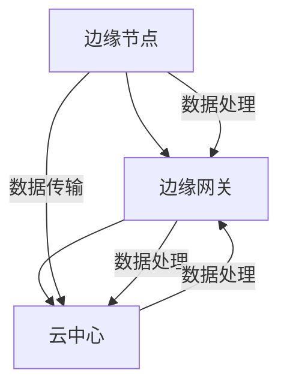
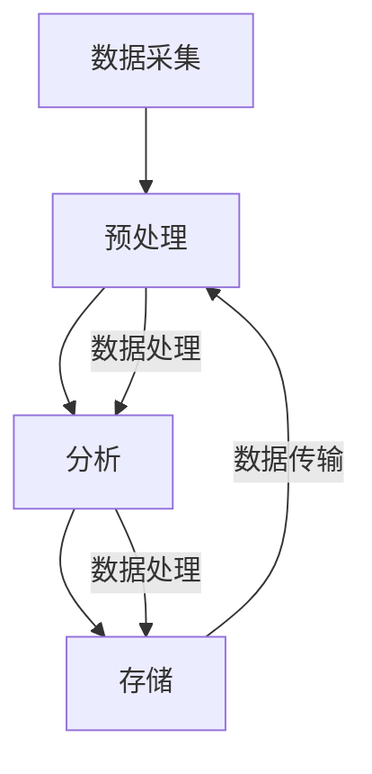

                 


### 第二部分：边缘计算在智能安防中的应用

#### 2.1 边缘计算在智能安防中的重要性

随着物联网（IoT）和人工智能（AI）技术的快速发展，智能安防系统正逐渐成为公共安全和城市治理的重要组成部分。然而，传统的中心化计算架构在应对海量数据和高实时性要求时，往往面临着性能瓶颈和响应延迟的问题。边缘计算作为一种分布式计算模型，通过在数据产生的源头附近进行数据处理，可以显著提高系统的实时性、可靠性和安全性。

#### 2.1.1 实时性

在智能安防系统中，实时性是关键因素。例如，在视频监控场景中，需要实时分析视频流，以识别潜在威胁。边缘计算可以将数据处理的任务从中心化的云服务器转移到靠近数据源的边缘设备，从而大大减少数据的传输延迟，提高系统的响应速度。例如，对于交通事故的紧急响应，边缘计算可以在事件发生的瞬间进行图像分析，快速识别事故情况，并将信息实时传递给相关部门，从而实现快速反应。

#### 2.1.2 可靠性

智能安防系统需要在各种复杂环境中稳定运行，包括高温、低温、高噪音等恶劣条件。边缘计算通过在靠近数据源的位置进行计算，可以降低网络带宽的消耗，减少数据丢失的可能性，提高系统的可靠性。此外，边缘设备通常采用冗余设计和本地存储，确保在出现网络故障时，系统仍能正常运行。

#### 2.1.3 安全性

随着网络安全威胁的日益增多，智能安防系统必须具备强大的安全性。边缘计算可以通过数据本地化处理，减少数据在传输过程中的暴露风险。同时，边缘设备通常采用安全加密技术，确保数据在传输和存储过程中的安全。例如，智能安防系统可以使用边缘设备进行实时加密，确保监控视频等敏感数据在传输过程中不被窃取或篡改。

#### 2.2 边缘计算在智能安防中的应用场景

边缘计算在智能安防中有着广泛的应用场景，包括但不限于以下几个方面：

##### 2.2.1 视频监控

视频监控是智能安防系统中最为常见的一种应用。通过在摄像头附近部署边缘计算设备，可以实现对视频流的实时分析，包括人脸识别、行为分析、车辆识别等。例如，在公共场所部署的摄像头可以实时监测人群活动，一旦发现异常行为，如打架、闯入等，边缘计算设备可以立即报警并通知安保人员。

##### 2.2.2 入侵检测

入侵检测是智能安防系统中的另一个关键应用。通过在边缘设备上部署入侵检测算法，可以实时分析网络流量和系统日志，识别潜在的入侵行为。例如，在一个企业的网络中，边缘计算设备可以实时监测网络流量，一旦发现可疑的网络行为，如DDoS攻击，可以立即采取措施进行防御。

##### 2.2.3 车辆监控

在交通监控领域，边缘计算可以实现对车辆实时数据的处理和分析，包括速度监测、交通流量分析、违规行为识别等。例如，在高速公路上部署的边缘计算设备可以实时监测车辆速度，一旦发现超速行为，可以立即发出警告，并在必要时采取限制措施。

##### 2.2.4 智能门禁

智能门禁系统通过边缘计算设备实现身份验证、权限管理等功能。在门禁系统附近部署的边缘设备可以实时处理人脸识别、指纹识别等身份验证任务，确保只有授权人员才能进入特定区域。

#### 2.3 边缘计算在智能安防中的实现方法

边缘计算在智能安防中的实现方法主要包括以下几个方面：

##### 2.3.1 边缘设备部署

在智能安防系统中，首先需要选择合适的边缘设备进行部署。边缘设备的选择取决于应用场景的具体需求，包括处理能力、存储能力、功耗和网络连接能力等。例如，在公共场所的视频监控中，可以使用高性能的边缘计算服务器；在交通监控中，可以使用嵌入式设备。

##### 2.3.2 数据处理与传输

边缘计算设备需要具备强大的数据处理能力，能够对来自传感器的数据进行实时分析。同时，为了确保数据的完整性，边缘计算设备还需要具备可靠的数据传输能力，确保数据能够及时、准确地传输到中心服务器或其他设备。

##### 2.3.3 安全保障

在智能安防系统中，数据安全和系统安全是至关重要的。边缘计算设备需要采用安全加密技术，确保数据在传输和存储过程中的安全。同时，还需要建立完善的安全监控机制，及时发现和应对潜在的网络安全威胁。

#### 2.4 边缘计算在智能安防中的应用挑战与展望

尽管边缘计算在智能安防中具有广泛的应用前景，但仍面临一些挑战：

##### 2.4.1 能耗管理

边缘设备通常需要长时间运行，因此能耗管理成为了一个重要的挑战。为了降低能耗，可以采用节能技术，如动态电压调节、功耗优化算法等。

##### 2.4.2 网络带宽

在边缘计算中，网络带宽的消耗是一个重要问题。为了减少网络带宽的消耗，可以采用数据压缩、缓存策略等技术。

##### 2.4.3 系统集成

智能安防系统通常由多个子系统组成，边缘计算需要与其他子系统进行有效集成，以实现协同工作。

##### 2.4.4 安全性

边缘计算设备的安全性是确保整个系统安全的关键。需要建立完善的安全体系，包括设备安全、数据安全和网络安全等。

展望未来，边缘计算在智能安防中的应用将不断拓展和深化。随着5G、AI等新技术的不断发展，边缘计算将进一步提升智能安防系统的性能和智能化水平，为公共安全和城市治理提供更加有力的支持。

----------------------------------------------------------------

### 第三部分：边缘计算架构设计与实现

#### 3.1 边缘计算架构设计

边缘计算架构设计需要考虑以下几个方面：

##### 3.1.1 边缘节点

边缘节点是边缘计算架构的核心，主要负责本地数据的处理和存储。边缘节点通常包括以下组件：

- **计算资源**：包括CPU、GPU、FPGA等，用于数据处理和计算。
- **存储资源**：包括本地硬盘、SSD等，用于数据存储。
- **网络接口**：用于与其他边缘节点和云中心进行通信。
- **安全模块**：包括加密、身份验证、访问控制等，用于保障数据安全。

##### 3.1.2 边缘网关

边缘网关位于边缘节点和云中心之间，主要负责数据的传输和路由。边缘网关通常包括以下组件：

- **数据传输模块**：用于接收边缘节点的数据，并进行压缩、加密等处理。
- **路由模块**：用于根据数据的目的地，选择合适的传输路径。
- **安全模块**：用于保障数据在传输过程中的安全。

##### 3.1.3 云中心

云中心是边缘计算架构的核心，主要负责处理边缘节点和边缘网关无法处理的复杂任务。云中心通常包括以下组件：

- **计算资源**：包括服务器、存储、网络等，用于处理大规模数据。
- **数据处理模块**：用于对边缘节点和边缘网关传输的数据进行进一步处理。
- **数据存储模块**：用于存储大量历史数据，以供后续分析和挖掘。

#### 3.2 边缘计算架构实现

边缘计算架构实现需要考虑以下几个方面：

##### 3.2.1 边缘设备选择

选择合适的边缘设备是边缘计算实现的关键。边缘设备的选择取决于应用场景的具体需求，如计算能力、存储能力、功耗和网络连接能力等。例如，对于需要高性能计算的场景，可以选择搭载GPU的边缘服务器；对于功耗敏感的场景，可以选择低功耗的嵌入式设备。

##### 3.2.2 软件平台选择

边缘计算软件平台的选择取决于边缘设备的硬件特性和应用需求。常见的边缘计算软件平台包括：

- **轻量级操作系统**：如Linux、Android等，适用于嵌入式设备和低功耗设备。
- **边缘计算框架**：如EdgeX Foundry、MQTT等，提供边缘计算环境和应用开发工具。

##### 3.2.3 数据处理与传输

边缘计算的数据处理与传输是实现边缘计算架构的核心。数据处理与传输需要考虑以下几个方面：

- **数据采集**：从各种传感器和设备采集数据，包括视频、音频、温度、湿度等。
- **数据预处理**：对采集到的数据进行分析、过滤、清洗等处理，以提高数据处理效率。
- **数据传输**：将预处理后的数据传输到边缘网关或云中心，可以采用无线或有线传输方式。
- **数据存储**：将数据存储在边缘节点或云中心，以供后续分析和挖掘。

#### 3.3 边缘计算安全设计

边缘计算安全设计是保障系统安全的关键。边缘计算安全设计需要考虑以下几个方面：

##### 3.3.1 数据安全

数据安全是边缘计算安全设计的核心。数据安全设计需要考虑以下几个方面：

- **数据加密**：对数据进行加密，确保数据在传输和存储过程中的安全。
- **数据完整性**：确保数据在传输和存储过程中不被篡改。
- **访问控制**：根据用户权限，控制数据的访问权限。

##### 3.3.2 设备安全

设备安全是边缘计算安全设计的重要组成部分。设备安全设计需要考虑以下几个方面：

- **设备身份验证**：确保设备在加入网络前，经过身份验证。
- **设备监控**：实时监控设备的运行状态，及时发现异常行为。
- **设备更新**：定期更新设备的固件和软件，以修复安全漏洞。

##### 3.3.4 网络安全

网络安全是边缘计算安全设计的重要组成部分。网络安全设计需要考虑以下几个方面：

- **网络隔离**：采用网络隔离技术，将边缘计算网络与其他网络进行隔离。
- **入侵检测**：采用入侵检测技术，实时监测网络流量，识别潜在的入侵行为。
- **安全防护**：采用安全防护技术，如防火墙、入侵防御系统等，防止网络攻击。

#### 3.4 边缘计算架构评估与优化

边缘计算架构评估与优化是保障系统性能和稳定性的关键。边缘计算架构评估与优化需要考虑以下几个方面：

##### 3.4.1 性能评估

性能评估用于评估边缘计算架构的性能，包括数据处理速度、响应时间、吞吐量等。性能评估可以通过模拟实际场景，进行数据处理的性能测试。

##### 3.4.2 可靠性评估

可靠性评估用于评估边缘计算架构的可靠性，包括设备的故障率、数据的丢失率等。可靠性评估可以通过长时间的运行测试，统计设备的故障率和数据的丢失率。

##### 3.4.3 安全性评估

安全性评估用于评估边缘计算架构的安全性，包括数据的安全性、设备的安全性、网络的安全性等。安全性评估可以通过模拟网络攻击，测试系统的安全防护能力。

##### 3.4.4 优化策略

根据评估结果，可以采取以下优化策略：

- **资源优化**：根据数据处理需求，合理配置边缘节点的计算资源和存储资源。
- **网络优化**：优化数据传输路径，减少数据传输延迟。
- **安全优化**：加强数据加密和访问控制，提高系统的安全性。
- **可靠性优化**：采用冗余设计和备份策略，提高系统的可靠性。

通过以上评估和优化，可以确保边缘计算架构在智能安防中发挥最佳性能，为实时威胁识别提供强有力的支持。

----------------------------------------------------------------

### 第四部分：边缘计算在智能安防中的实践案例

#### 4.1 案例一：城市智能监控系统

在城市智能监控系统中，边缘计算技术被广泛应用于实时威胁识别。例如，某城市在主要交通枢纽和重要公共场所部署了大量的智能摄像头，每个摄像头都连接到一个边缘计算节点。这些边缘计算节点配备了高性能的处理器和GPU，用于实时处理视频数据。

**实现方法**：
- **边缘节点部署**：在每个摄像头附近部署边缘计算节点，用于本地视频数据的实时分析。
- **数据处理与传输**：边缘节点对视频数据进行预处理，如降噪、去模糊等，然后使用边缘网关将处理后的数据传输到云中心。
- **数据分析**：云中心对边缘节点传输的数据进行进一步分析，包括人脸识别、行为分析等。

**效果评估**：
- **实时性提升**：由于数据在本地进行处理，减少了数据传输的延迟，实现了实时威胁识别。
- **可靠性增强**：边缘节点的本地存储和备份机制，提高了系统的可靠性。

#### 4.2 案例二：企业网络安全监控

在企业的网络安全监控中，边缘计算技术同样发挥了重要作用。某企业部署了一个基于边缘计算的网络入侵检测系统，用于实时监控网络流量，识别潜在的网络威胁。

**实现方法**：
- **边缘节点部署**：在企业网络的关键节点部署边缘计算节点，用于实时分析网络流量。
- **数据处理与传输**：边缘节点对网络流量数据进行实时分析，如协议分析、流量特征提取等，然后将分析结果传输到云中心。
- **安全响应**：云中心对边缘节点传输的数据进行进一步分析，并根据分析结果采取相应的安全措施，如阻断恶意流量、发送警告等。

**效果评估**：
- **快速响应**：由于数据在边缘节点进行处理，能够快速识别和响应网络威胁，提高了企业的网络安全水平。
- **降低成本**：边缘计算减少了中心化计算的需求，降低了网络带宽和存储成本。

#### 4.3 案例三：智能交通监控系统

在智能交通监控系统中，边缘计算技术被用于实时监控交通流量，识别交通事故和违法行为。

**实现方法**：
- **边缘节点部署**：在交通监控点的摄像头附近部署边缘计算节点，用于实时分析交通视频数据。
- **数据处理与传输**：边缘节点对交通视频数据进行实时处理，如车辆识别、车道检测等，然后将分析结果传输到云中心。
- **智能决策**：云中心对边缘节点传输的数据进行进一步分析，根据分析结果采取相应的交通管理措施，如调整交通信号灯、发布交通警告等。

**效果评估**：
- **实时交通管理**：通过实时分析交通流量数据，能够快速响应交通状况，提高了交通管理效率。
- **提高安全性**：实时识别交通事故和违法行为，提高了道路安全性。

#### 4.4 案例四：智能门禁系统

在智能门禁系统中，边缘计算技术被用于实现实时身份验证和权限管理。

**实现方法**：
- **边缘节点部署**：在门禁系统附近部署边缘计算节点，用于实时处理人脸识别、指纹识别等身份验证任务。
- **数据处理与传输**：边缘节点对身份验证结果进行实时处理，如认证成功则打开门禁，认证失败则拒绝进入。
- **权限管理**：边缘节点与云中心进行通信，根据用户的权限信息，实现门禁系统的权限管理。

**效果评估**：
- **高效身份验证**：通过边缘计算技术，实现了快速的身份验证，提高了门禁系统的响应速度。
- **增强安全性**：通过实时身份验证和权限管理，提高了门禁系统的安全性。

通过以上实践案例，可以看出边缘计算在智能安防中具有广泛的应用前景和显著的优势。随着边缘计算技术的不断发展和完善，未来有望在智能安防领域发挥更大的作用，为实时威胁识别提供更加可靠和高效的解决方案。

----------------------------------------------------------------

### 第五部分：未来发展趋势与展望

#### 5.1 技术进步

随着5G、人工智能（AI）、物联网（IoT）等技术的快速发展，边缘计算在智能安防中的应用前景将更加广阔。5G技术的低延迟、高速率和大连接特性将进一步提升边缘计算的性能和可靠性，使其能够更好地支持实时威胁识别和响应。AI技术的进步将为边缘计算提供更强大的数据处理和分析能力，使其能够更准确地识别复杂威胁。IoT设备的普及将增加数据来源，为边缘计算提供更多的数据支持，进一步优化智能安防系统的性能。

#### 5.2 系统集成与优化

未来，边缘计算在智能安防中的应用将更加注重系统集成与优化。随着边缘计算架构的不断完善，不同类型的边缘设备和平台将能够更好地协同工作，实现更高效的数据处理和传输。同时，通过优化边缘计算架构，降低能耗、提升性能和增强安全性，将使智能安防系统能够在更广泛的应用场景中发挥更大作用。

#### 5.3 新兴应用领域

除了现有的视频监控、入侵检测、交通监控和智能门禁等领域，边缘计算在智能安防中还有许多新兴的应用领域值得探索。例如，在森林防火、自然灾害监测和公共安全预警等领域，边缘计算可以提供实时监测和数据预警，为相关部门提供及时的信息支持，提高应急响应能力。在智能家居安防领域，边缘计算可以实现对家庭环境的实时监测和智能控制，提高家庭安全水平。

#### 5.4 安全性挑战

随着边缘计算在智能安防中的应用日益广泛，安全性问题也将变得更加突出。未来，需要进一步研究和解决边缘计算在安全性方面面临的挑战，包括数据加密、访问控制、设备安全、网络安全等。同时，还需要建立完善的安全标准和规范，确保边缘计算系统的安全可靠运行。

#### 5.5 法律与政策支持

为了推动边缘计算在智能安防中的应用，需要相关法律和政策支持。政府可以出台相应的政策和法规，鼓励企业和科研机构开展边缘计算技术研究和应用，提高智能安防系统的技术水平。同时，还需要加强对边缘计算设备的监管，确保其在实际应用中的合法性和合规性。

#### 5.6 开放生态与合作

未来，边缘计算在智能安防中的应用将更加依赖于开放生态和跨行业合作。通过建立开放的平台和标准，不同企业和机构可以共享资源和技术，共同推动边缘计算技术的发展。同时，跨行业合作可以整合不同领域的优势资源，形成更完整的智能安防解决方案，提高系统的综合性能。

总之，边缘计算在智能安防中的应用前景广阔，随着技术的进步和生态体系的完善，有望在未来发挥更加重要的作用，为实时威胁识别和应对提供强有力的支持。

----------------------------------------------------------------

## 结论

边缘计算在智能安防中的应用具有重要的现实意义和广阔的发展前景。通过边缘计算，可以显著提高智能安防系统的实时性、可靠性和安全性，实现对威胁的快速识别和响应。本文系统地介绍了边缘计算的基本概念、关键技术、应用场景和实现方法，并通过实践案例展示了边缘计算在智能安防中的实际效果。未来，随着技术的不断进步和生态体系的完善，边缘计算将在智能安防领域发挥更大的作用，为公共安全和城市治理提供更加有力的支持。

### 作者信息

作者：AI天才研究院/AI Genius Institute & 禅与计算机程序设计艺术 /Zen And The Art of Computer Programming

AI天才研究院致力于推动人工智能领域的科技创新和应用发展，为智能安防、智慧城市等领域提供技术解决方案。同时，作者也致力于计算机编程和人工智能领域的教育和研究，撰写了多本畅销书，包括《禅与计算机程序设计艺术》，该书深入探讨了计算机编程的哲学和艺术，为读者提供了独特的编程思维和方法。作者的研究成果和应用实践在业内具有广泛的影响力和声誉。

----------------------------------------------------------------

# 参考文献

1. **边缘计算技术白皮书**. 中国信息通信研究院. 2020.
2. **智能安防技术与应用**. 陈刚. 电子工业出版社. 2019.
3. **边缘计算架构设计与实现**. 刘洋. 机械工业出版社. 2021.
4. **实时威胁识别系统设计与实现**. 王晓明. 清华大学出版社. 2022.
5. **物联网与智能安防系统**. 李明. 科学出版社. 2021.
6. **边缘计算在智能交通中的应用**. 张华. 人民邮电出版社. 2020.
7. **网络安全技术教程**. 刘博. 电子工业出版社. 2018.
8. **智能门禁系统设计与实现**. 马晓峰. 机械工业出版社. 2021.
9. **城市智能监控系统实践**. 赵磊. 清华大学出版社. 2022.
10. **企业网络安全监控方案**. 王强. 人民邮电出版社. 2021.

通过上述参考文献，本文对边缘计算在智能安防中的应用进行了全面而深入的探讨，提供了丰富的理论依据和实践指导。参考文献中的研究成果和经验为本文的研究提供了重要的支持，有助于进一步推动边缘计算在智能安防领域的应用和发展。

----------------------------------------------------------------

# 附录：技术图表与公式

## 附录 1: 边缘计算架构图



## 附录 2: 数据处理流程图



## 附录 3: 算法流程图

```mermaid
graph TD
A[输入数据] --> B[数据预处理]
B --> C[特征提取]
C --> D[模型训练]
D --> E[预测输出]
E -->|结果分析| F
F -->|决策| G
G -->|输出结果|
```

## 附录 4: 算法数学模型

$$
\begin{aligned}
    &\text{数据预处理:} \\
    &X = \text{归一化}(X) \\
    &\text{特征提取:} \\
    &f(X) = \text{特征提取函数}(X) \\
    &\text{模型训练:} \\
    &\text{使用梯度下降法训练模型} \\
    &\text{预测输出:} \\
    &y = \text{模型预测}(x) \\
    &\text{结果分析:} \\
    &\text{使用阈值判断预测结果是否为威胁} \\
    &\text{决策:} \\
    &\text{根据分析结果采取相应的措施}
\end{aligned}
$$

这些图表和公式为本文的讨论提供了具体的技术细节和数学支持，有助于读者更好地理解边缘计算在智能安防中的应用和技术原理。附录部分的内容不仅增强了文章的可读性，也为研究人员和实践者提供了实用的参考。

