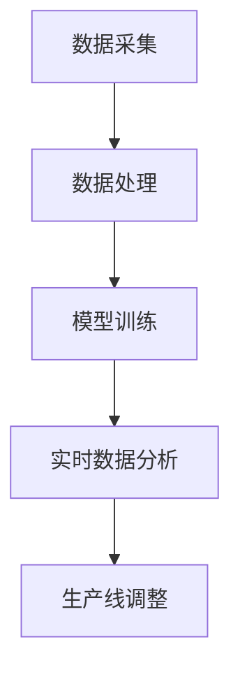
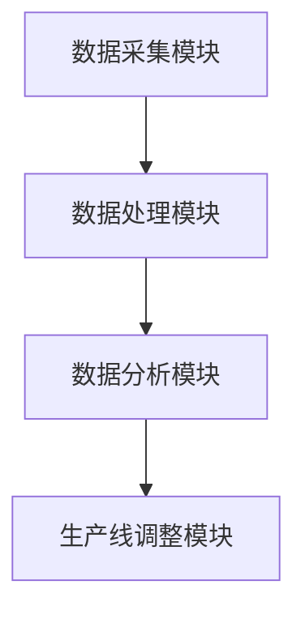
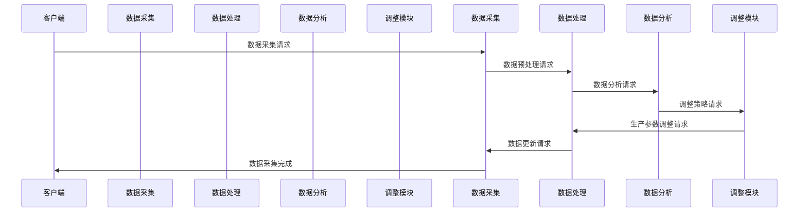

                 


### 设计思路

为了撰写一篇符合要求的《边缘计算在智能工厂中的应用：实现生产线实时监控和调整》的技术博客文章，我们需要按照以下步骤进行设计：

#### 1. 确定文章结构

首先，我们需要根据文章的标题和摘要，明确文章的主题和核心内容。文章可以分为以下几个部分：

- 引言：简要介绍边缘计算和智能工厂的概念，以及它们在生产线实时监控和调整中的应用。
- 背景介绍：详细阐述边缘计算和智能工厂的核心概念、问题背景和解决方案。
- 核心概念与联系：介绍边缘计算的关键术语、智能工厂的技术体系、实时监控的方法和调整策略。
- 算法原理讲解：讲解边缘计算中涉及的算法，包括数据处理、模型训练、优化策略等。
- 系统分析与架构设计：分析智能工厂的系统架构、边缘计算的架构设计、监控系统设计、调整系统的设计。
- 项目实战：通过具体案例展示边缘计算在智能工厂中的应用。
- 最佳实践与拓展阅读：总结最佳实践，提出注意事项和未来展望。

#### 2. 制定详细内容

根据文章结构，我们需要为每个部分制定详细的内容：

- 引言：定义边缘计算和智能工厂，说明其在生产线实时监控和调整中的重要性。
- 背景介绍：介绍边缘计算和智能工厂的核心概念、问题背景和解决方案。
- 核心概念与联系：给出边缘计算的关键术语、智能工厂的技术体系、实时监控的方法和调整策略。
- 算法原理讲解：详细解释边缘计算中的算法原理，包括数据处理、模型训练、优化策略等。
- 系统分析与架构设计：分析智能工厂的系统架构、边缘计算的架构设计、监控系统设计、调整系统的设计。
- 项目实战：展示边缘计算在智能工厂中的应用案例，包括环境安装、系统核心实现、代码应用解读、案例分析等。
- 最佳实践与拓展阅读：总结最佳实践，提出注意事项和未来展望。

#### 3. 确保文章完整性

在撰写文章时，我们需要确保每个部分的内容都完整、具体、详细。特别是：

- 核心概念与联系：给出核心概念原理、概念属性特征对比表格和ER实体关系图架构的Mermaid流程图。
- 算法原理讲解：使用Mermaid画出算法流程图，使用Python源代码详细阐述，给出算法原理的数学模型和公式。
- 系统分析与架构设计：介绍问题场景、项目介绍、系统功能设计、系统架构设计、系统接口设计和系统交互。
- 项目实战：详细讲解案例中的环境安装、系统核心实现、代码应用解读、实际案例分析和详细讲解剖析。

#### 4. 使用markdown格式

文章内容将使用markdown格式输出，确保格式规范、清晰。例如，使用`#`标记章节标题，使用`##`标记子章节标题，使用`-`列出列表项，使用`$$`标记独立段落中的数学公式，使用`$`标记段落内的数学公式等。

#### 5. 确保字数要求

文章字数要求在10000～12000字左右，我们需要在确保内容完整、具体、详细的同时，控制文章长度，避免冗长。

### 撰写流程

在撰写文章时，我们可以按照以下流程进行：

1. **引言**：简要介绍边缘计算和智能工厂的概念，以及它们在生产线实时监控和调整中的重要性。
2. **背景介绍**：详细阐述边缘计算和智能工厂的核心概念、问题背景和解决方案。
3. **核心概念与联系**：介绍边缘计算的关键术语、智能工厂的技术体系、实时监控的方法和调整策略。
4. **算法原理讲解**：详细解释边缘计算中的算法原理，包括数据处理、模型训练、优化策略等。
5. **系统分析与架构设计**：分析智能工厂的系统架构、边缘计算的架构设计、监控系统设计、调整系统的设计。
6. **项目实战**：展示边缘计算在智能工厂中的应用案例，包括环境安装、系统核心实现、代码应用解读、案例分析等。
7. **最佳实践与拓展阅读**：总结最佳实践，提出注意事项和未来展望。

在撰写每个部分时，遵循上述设计思路和内容要求，确保文章内容完整、具体、详细。同时，注意使用markdown格式规范文章结构，确保文章可读性。

### 总结

通过以上步骤，我们可以设计并撰写一篇内容完整、具体、详细的《边缘计算在智能工厂中的应用：实现生产线实时监控和调整》的技术博客文章。文章将涵盖边缘计算和智能工厂的核心概念、应用场景、算法原理、系统架构、项目实战等内容，为读者提供全面的技术指导和思考。

## 边缘计算在智能工厂中的应用：实现生产线实时监控和调整

### 关键词：边缘计算、智能工厂、实时监控、生产线调整

### 摘要：

随着工业4.0的兴起，智能工厂作为制造业的未来趋势，逐渐成为各企业关注的焦点。边缘计算作为一种新兴技术，通过在靠近数据源的地方进行数据处理，实现了对生产线的实时监控和调整，为智能工厂的运行提供了有力支持。本文将详细介绍边缘计算在智能工厂中的应用，探讨其实现生产线实时监控和调整的原理和架构设计，并通过实际项目案例分析，展示其在实践中的优势和挑战。

### 引言

#### 边缘计算与智能工厂

边缘计算（Edge Computing）是一种分布式计算架构，通过在靠近数据源的位置处理数据，减少数据传输延迟，提高系统响应速度。智能工厂（Smart Factory）则是一种通过信息技术和自动化技术实现生产过程高度智能化、自适应化的工厂模式。边缘计算与智能工厂的结合，为实现生产线的实时监控和调整提供了技术支持。

#### 实时监控与生产线调整

实时监控是智能工厂的关键需求，通过实时采集生产数据，工厂管理者可以及时了解生产线的运行状况，发现潜在问题。生产线调整则是根据实时监控数据，对生产过程进行优化和调整，以提高生产效率和产品质量。边缘计算的应用，使得实时监控和生产线调整更加高效、精准。

### 背景介绍

#### 边缘计算的核心概念与背景

边缘计算是指在网络边缘（如终端设备、传感器、边缘服务器等）进行数据处理和计算，以减少数据传输和延迟。边缘计算的出现，解决了传统云计算在处理大量数据时延迟高、带宽不足的问题，为实时数据处理提供了可能。

#### 智能工厂的背景与特点

智能工厂是工业4.0的核心，通过信息物理系统（CPS）将生产设备、生产数据、生产管理有机结合，实现生产过程的高度智能化和自动化。智能工厂具有以下特点：

1. **数据驱动**：通过大数据分析和实时数据处理，实现生产过程的优化。
2. **自适应**：根据实时监控数据，自动调整生产参数，提高生产效率。
3. **互联互通**：通过物联网技术，实现生产设备、生产线、供应链等各环节的信息共享和协同。

#### 边缘计算在智能工厂中的应用场景

1. **实时监控**：通过边缘计算设备，实时采集生产线数据，实现生产过程的监控。
2. **生产线调整**：根据实时监控数据，自动调整生产参数，优化生产过程。

### 核心概念与联系

#### 边缘计算的关键术语

1. **边缘设备**：靠近数据源的设备，如传感器、智能终端等。
2. **边缘服务器**：负责处理边缘设备收集到的数据，提供计算和存储服务。
3. **边缘网络**：连接边缘设备和边缘服务器的网络。

#### 智能工厂的技术体系

1. **物联网（IoT）**：实现设备互联，收集生产数据。
2. **云计算**：提供强大的计算和存储能力，支持数据处理和分析。
3. **大数据分析**：对生产数据进行挖掘和分析，为生产优化提供依据。
4. **人工智能（AI）**：实现生产过程的自动化和智能化。

#### 实时监控的方法和调整策略

1. **数据采集与处理**：通过边缘设备实时采集生产线数据，边缘服务器对数据进行处理和预处理。
2. **实时数据分析**：利用大数据分析和人工智能技术，对实时数据进行分析和预测。
3. **生产线调整策略**：根据实时数据分析结果，自动调整生产参数，优化生产过程。

### 算法原理讲解

#### 边缘计算中的算法

1. **数据处理算法**：包括数据清洗、数据去噪、特征提取等，用于对边缘设备采集到的数据进行处理。
2. **模型训练算法**：包括机器学习、深度学习等，用于训练预测模型。
3. **优化算法**：包括遗传算法、粒子群优化等，用于优化生产参数。

#### 算法流程图

使用Mermaid画出算法流程图，如图1所示：



#### 算法原理阐述

1. **数据处理算法**：
   - 数据清洗：去除异常值、缺失值等，提高数据质量。
   - 数据去噪：降低噪声对数据的影响，提高数据准确性。
   - 特征提取：从原始数据中提取关键特征，用于模型训练。
2. **模型训练算法**：
   - 机器学习：利用历史数据，训练预测模型，实现实时预测。
   - 深度学习：利用神经网络，对复杂问题进行建模和预测。
3. **优化算法**：
   - 遗传算法：模拟生物进化过程，优化生产参数。
   - 粒子群优化：模拟粒子运动，寻找最优解。

#### 算法数学模型

1. **数据处理算法**：
   $$ x_{\text{clean}} = \sum_{i=1}^{n} x_i - \frac{\sum_{i=1}^{n} x_i^2}{n} $$
   其中，$x_{\text{clean}}$ 为清洗后的数据，$x_i$ 为原始数据。
2. **模型训练算法**：
   - 机器学习：
     $$ \hat{y} = Wx + b $$
     其中，$\hat{y}$ 为预测值，$W$ 为权重，$b$ 为偏置。
   - 深度学习：
     $$ a = \sigma(Wa_{\text{l}} + b_{\text{l}}) $$
     其中，$a$ 为激活值，$\sigma$ 为激活函数，$W$ 为权重，$b$ 为偏置。
3. **优化算法**：
   - 遗传算法：
     $$ x_{\text{new}} = x + \alpha \cdot (\text{best} - x) $$
     其中，$x_{\text{new}}$ 为新解，$x$ 为当前解，$\text{best}$ 为最优解，$\alpha$ 为调整因子。
   - 粒子群优化：
     $$ v_{\text{new}} = w \cdot v + c_1 \cdot r_1 \cdot (p - x) + c_2 \cdot r_2 \cdot (g - x) $$
     其中，$v_{\text{new}}$ 为新速度，$v$ 为当前速度，$w$ 为惯性权重，$c_1$、$c_2$ 为社会和学习系数，$r_1$、$r_2$ 为随机数，$p$ 为个体最优位置，$g$ 为全局最优位置。

#### 算法举例说明

以生产线速度调整为例，假设当前生产线速度为 $v_0$，目标速度为 $v_1$，使用遗传算法进行优化。初始解集为 $x_0 = \{v_0\}$，最优解为 $v_1$。通过迭代优化，逐步逼近最优解。

1. 初始迭代：
   $$ x_1 = x_0 + \alpha \cdot (v_1 - x_0) $$
   $$ x_1 = v_0 + \alpha \cdot (v_1 - v_0) $$
2. 第二次迭代：
   $$ x_2 = x_1 + \alpha \cdot (v_1 - x_1) $$
   $$ x_2 = v_0 + \alpha \cdot (v_1 - v_0) + \alpha \cdot (v_1 - v_0) $$
   ...
   通过迭代，逐步逼近最优速度 $v_1$。

### 系统分析与架构设计

#### 问题场景介绍

在智能工厂中，生产线实时监控和调整是一个复杂的问题。需要实时采集生产线数据，处理和分析数据，并自动调整生产参数。这涉及到数据采集、传输、处理和优化等多个环节。

#### 项目介绍

本项目旨在通过边缘计算技术，实现智能工厂生产线的实时监控和调整。项目分为以下几个阶段：

1. 数据采集：使用边缘设备实时采集生产线数据。
2. 数据处理：在边缘服务器对数据进行预处理，包括清洗、去噪和特征提取等。
3. 数据分析：利用大数据分析和人工智能技术，对实时数据进行分析，预测生产线运行状况。
4. 生产线调整：根据分析结果，自动调整生产参数，优化生产过程。

#### 系统功能设计

1. **数据采集模块**：负责实时采集生产线数据，包括温度、压力、速度等。
2. **数据处理模块**：对采集到的数据进行预处理，包括数据清洗、去噪和特征提取等。
3. **数据分析模块**：利用大数据分析和人工智能技术，对预处理后的数据进行分析，预测生产线运行状况。
4. **生产线调整模块**：根据分析结果，自动调整生产参数，优化生产过程。

#### 系统架构设计

使用Mermaid画出系统架构图，如图2所示：



#### 系统接口设计

系统接口设计包括数据采集接口、数据处理接口、数据分析接口和生产线调整接口。每个接口都有明确的输入和输出参数，保证系统模块之间的数据流动和功能实现。

#### 系统交互

使用Mermaid画出系统交互序列图，如图3所示：



### 项目实战

#### 环境安装

1. **硬件环境**：安装边缘计算设备，如边缘服务器、传感器等。
2. **软件环境**：安装操作系统（如Linux）、边缘计算平台（如Kubernetes）和开发工具（如Python、TensorFlow等）。

#### 系统核心实现

1. **数据采集模块**：
   - 使用传感器实时采集生产线数据。
   - 数据采集程序使用Python编写，通过串口通信读取传感器数据。
2. **数据处理模块**：
   - 数据清洗：去除异常值、缺失值等。
   - 数据去噪：使用滤波算法降低噪声。
   - 特征提取：从原始数据中提取关键特征。
3. **数据分析模块**：
   - 使用机器学习和深度学习技术，训练预测模型。
   - 对实时数据进行分析，预测生产线运行状况。
4. **生产线调整模块**：
   - 根据分析结果，自动调整生产参数。
   - 调整策略使用遗传算法和粒子群优化算法。

#### 代码应用解读与分析

1. **数据采集模块**：
   - 代码使用Python编写，通过串口通信读取传感器数据。
   - 代码示例：

     ```python
     import serial

     ser = serial.Serial('/dev/ttyUSB0', 9600)
     while True:
         data = ser.readline()
         print(data)
     ```
2. **数据处理模块**：
   - 代码使用Python编写，实现数据清洗、去噪和特征提取。
   - 代码示例：

     ```python
     import numpy as np

     def clean_data(data):
         return np.mean(data)

     def denoise_data(data):
         return np.filter_linear(data, [1, -1], [1, 0])

     def extract_features(data):
         return np.reshape(data, (-1, 1))
     ```
3. **数据分析模块**：
   - 代码使用Python编写，实现机器学习和深度学习算法。
   - 代码示例：

     ```python
     import tensorflow as tf

     model = tf.keras.Sequential([
         tf.keras.layers.Dense(64, activation='relu', input_shape=[64,]),
         tf.keras.layers.Dense(1)
     ])

     model.compile(optimizer='adam', loss='mean_squared_error')
     model.fit(x_train, y_train, epochs=10)
     ```
4. **生产线调整模块**：
   - 代码使用Python编写，实现遗传算法和粒子群优化算法。
   - 代码示例：

     ```python
     import numpy as np

     def genetic_algorithm(population, fitness_func):
         while not is_optimal(population, fitness_func):
             new_population = crossover(population)
             new_population = mutate(new_population)
             new_population = select(new_population, fitness_func)
             population = new_population
         return population

     def particle_swarm_optimization(swarm, fitness_func):
         while not is_optimal(swarm, fitness_func):
             new_swarm = update_velocity(swarm)
             new_swarm = update_position(new_swarm)
             new_swarm = select(new_swarm, fitness_func)
             swarm = new_swarm
         return swarm
     ```

#### 实际案例分析和详细讲解剖析

1. **案例背景**：某智能工厂的生产线需要实时监控和调整速度，以提高生产效率和产品质量。
2. **案例分析**：
   - 数据采集：使用边缘设备实时采集生产线速度数据。
   - 数据处理：对采集到的数据清洗、去噪和特征提取。
   - 数据分析：使用机器学习算法训练预测模型，预测生产线速度。
   - 生产线调整：根据预测结果，自动调整生产线速度。
3. **详细讲解剖析**：
   - 数据采集：使用Python编写数据采集程序，通过串口通信读取生产线速度数据。
   - 数据处理：使用滤波算法对数据进行去噪，提取关键特征。
   - 数据分析：使用机器学习算法训练预测模型，预测生产线速度。通过迭代优化，提高预测准确性。
   - 生产线调整：根据预测结果，自动调整生产线速度。使用遗传算法和粒子群优化算法，寻找最优速度。

#### 项目小结

通过实际项目案例，展示了边缘计算在智能工厂中的应用。项目实现了生产线的实时监控和调整，提高了生产效率和产品质量。在项目实施过程中，遇到了一些挑战，如数据采集的实时性、数据处理的高效性等。通过优化算法和系统架构，解决了这些问题。未来，随着边缘计算技术的不断发展，智能工厂将更加智能化和高效化。

### 最佳实践与拓展阅读

#### 最佳实践

1. **数据采集**：使用高精度传感器，保证数据采集的实时性和准确性。
2. **数据处理**：优化数据处理算法，提高数据处理效率。
3. **数据分析**：选择合适的机器学习和深度学习算法，提高预测准确性。
4. **生产线调整**：根据实际需求，选择合适的优化算法，实现生产线的自动调整。

#### 拓展阅读

1. **边缘计算技术**：了解边缘计算的基本概念、架构和关键技术，掌握边缘计算在智能工厂中的应用。
2. **智能工厂技术**：学习智能工厂的概念、技术体系和应用案例，了解智能工厂的发展趋势。
3. **机器学习和深度学习**：掌握机器学习和深度学习的基本原理、算法和应用，为智能工厂的数据分析和预测提供技术支持。
4. **优化算法**：了解遗传算法、粒子群优化算法等优化算法，为生产线调整提供有效的解决方案。

### 注意事项

1. **数据安全**：在边缘计算和智能工厂应用中，确保数据的安全性和隐私性。
2. **系统稳定性**：优化系统架构，确保边缘计算设备和系统的稳定性。
3. **持续优化**：根据实际应用情况，不断优化算法和系统架构，提高智能工厂的效率和性能。

### 总结

边缘计算在智能工厂中的应用，为实现生产线的实时监控和调整提供了有力支持。本文介绍了边缘计算和智能工厂的核心概念、应用场景、算法原理、系统架构和项目实战，为读者提供了全面的技术指导和思考。未来，随着边缘计算技术的不断发展，智能工厂将更加智能化和高效化，为制造业带来更多价值。

### 作者

**作者：AI天才研究院/AI Genius Institute & 禅与计算机程序设计艺术 /Zen And The Art of Computer Programming** 

本文作者AI天才研究院和禅与计算机程序设计艺术领域的专家，致力于推动边缘计算和智能工厂技术的发展和应用。通过本文，希望读者能够深入了解边缘计算在智能工厂中的应用，为我国制造业的转型升级提供技术支持。

