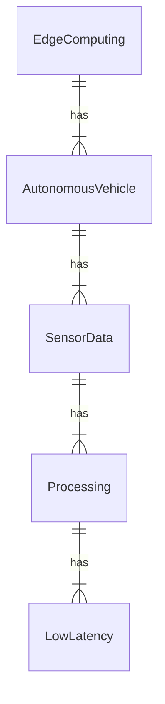
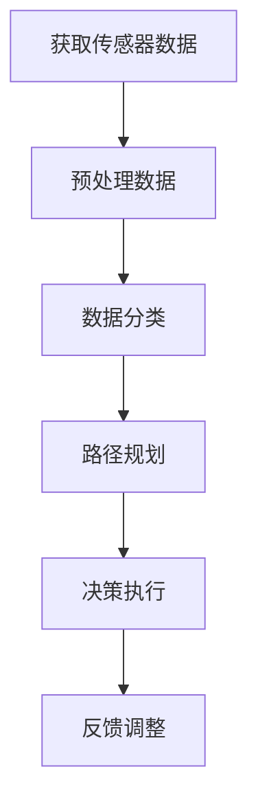
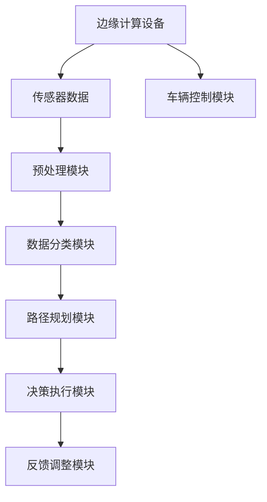
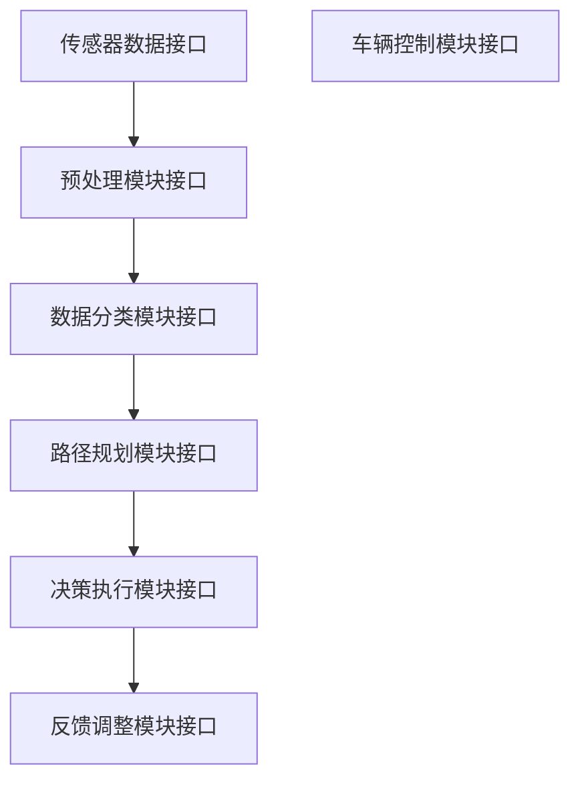
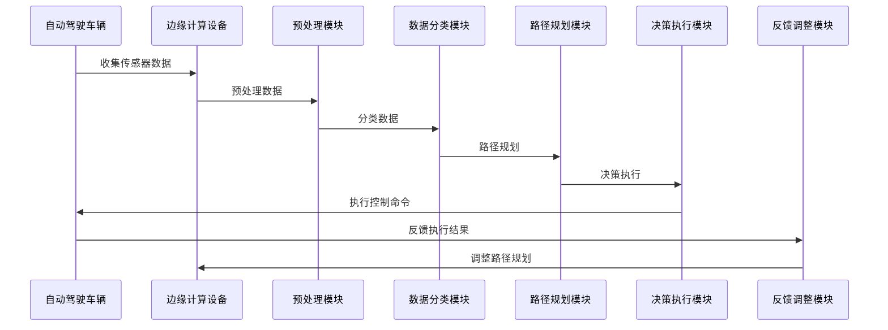

                 


# 边缘计算在自动驾驶中的低延迟处理

关键词：边缘计算、自动驾驶、低延迟处理、传感器数据、数据处理、路径规划

摘要：
本文深入探讨了边缘计算在自动驾驶领域中的低延迟处理技术。首先，介绍了边缘计算和自动驾驶的基本概念，以及它们在低延迟处理中的重要性。然后，通过详细的分析和实例，阐述了边缘计算在自动驾驶中的应用原理和算法设计，包括传感器数据获取与预处理、数据分类与处理、路径规划和决策执行等核心环节。此外，还通过一个实际项目实战案例，展示了边缘计算在自动驾驶低延迟处理中的具体实现和应用效果。最后，提出了相关最佳实践和注意事项，为自动驾驶系统的研发提供了参考。

## 第一部分：背景介绍

### 1.1 问题背景

随着人工智能和物联网技术的快速发展，自动驾驶技术已成为未来交通领域的重要方向。自动驾驶系统通过对传感器数据进行分析和处理，实现车辆在复杂道路环境中的自主行驶。然而，自动驾驶系统对延迟的要求非常高，任何延迟都可能导致安全隐患。因此，如何在自动驾驶系统中实现低延迟处理成为一个亟待解决的问题。

边缘计算作为一种新兴的计算模式，通过在靠近数据源的边缘设备上进行数据处理和计算，可以有效降低系统延迟，提高响应速度。边缘计算在自动驾驶中的应用，可以使得自动驾驶系统能够在更短的时间内获取和处理数据，从而实现更快的决策和执行。

### 1.2 问题描述

边缘计算在自动驾驶中的低延迟处理主要面临以下问题：

1. **数据量大**：自动驾驶系统需要实时处理来自各种传感器的数据，包括摄像头、雷达、GPS等。这些数据量巨大，对处理速度和存储能力提出了很高的要求。
2. **数据处理复杂**：自动驾驶系统需要对大量数据进行实时分析，包括障碍物检测、路径规划、车辆控制等。这些处理过程复杂，对算法设计和优化提出了挑战。
3. **延迟敏感**：自动驾驶系统对延迟非常敏感，任何延迟都可能导致安全问题。因此，如何在保证数据处理精度和系统稳定性的同时，实现低延迟处理，是一个关键问题。

### 1.3 问题解决

边缘计算在自动驾驶中的低延迟处理问题，可以通过以下方法解决：

1. **边缘设备部署**：在车辆或道路旁边部署边缘计算设备，如边缘服务器、边缘计算机等。这些设备可以实时处理传感器数据和车辆状态信息，减少数据传输的延迟。
2. **实时数据处理**：边缘计算设备可以实时处理传感器数据和车辆状态信息，提高数据处理的速度和效率。通过分布式计算技术，将数据处理任务分配到多个边缘设备上，进一步提高处理速度。
3. **分布式计算**：利用分布式计算技术，将数据处理任务分配到多个边缘设备上，可以提高系统的并行处理能力，减少处理时间。

### 1.4 边界与外延

边缘计算在自动驾驶中的低延迟处理，不仅涉及到硬件设备的选择和部署，还包括软件算法的设计与优化。边界与外延包括：

1. **硬件边界**：边缘设备的计算能力、存储容量和通信能力。这些硬件特性决定了边缘计算的性能和可行性。
2. **软件边界**：数据处理算法的选择、优化和实现。不同的算法对处理速度和准确度有不同的影响，需要根据实际需求进行选择和优化。
3. **外延**：边缘计算在自动驾驶领域的应用范围，如智能交通、车联网等。这些应用场景对边缘计算的需求不同，需要根据具体情况进行设计。

### 1.5 概念结构与核心要素组成

边缘计算在自动驾驶中的低延迟处理涉及以下核心概念和要素：

1. **边缘设备**：边缘服务器、边缘计算机等，用于实时处理传感器数据和车辆状态信息。
2. **数据处理算法**：如机器学习算法、路径规划算法等，用于对传感器数据进行分析和处理。
3. **数据传输协议**：如MQTT、HTTP等，用于边缘设备之间的数据传输。
4. **边缘计算平台**：提供边缘设备管理和数据处理功能的平台，用于协调和管理边缘计算任务。

## 第二部分：核心概念与联系

### 2.1 核心概念

边缘计算、自动驾驶、低延迟处理等是本文的核心概念。

### 2.2 概念属性特征对比表格

| 概念     | 属性特征             |
| --------- | ------------------- |
| 边缘计算 | 近源、分布式、实时、高效 |
| 自动驾驶 | 自动、智能、安全、高效 |
| 低延迟处理 | 实时、快速、准确     |

### 2.3 ER实体关系图架构



## 第三部分：算法原理讲解

### 3.1 算法流程图



### 3.2 算法原理

边缘计算在自动驾驶中的低延迟处理主要依赖于以下算法原理：

1. **传感器数据获取与预处理**：通过摄像头、雷达、GPS等传感器获取车辆周围环境信息，并进行预处理，如去噪、校正等。这一步是整个算法的基础，直接影响到后续的处理效果。
2. **数据分类与处理**：将预处理后的数据分类，并根据分类结果执行不同的处理任务，如障碍物检测、路径规划等。这一步是数据处理的核心，决定了自动驾驶系统的性能。
3. **路径规划**：根据实时数据和环境信息，执行路径规划算法，生成最优行驶路径。这一步是自动驾驶系统的核心，决定了车辆的行动策略。
4. **决策执行**：根据路径规划结果，执行车辆控制命令，实现自动驾驶。这一步是自动驾驶系统的关键，直接影响到车辆的安全和稳定。
5. **反馈调整**：收集车辆执行决策后的数据，反馈给系统，用于调整后续的决策过程。这一步是闭环控制的关键，可以不断优化自动驾驶系统的性能。

### 3.3 数学模型和公式

边缘计算在自动驾驶中的低延迟处理涉及到以下数学模型和公式：

1. **路径规划公式**：
   $$d = \sqrt{x^2 + y^2}$$
   其中，$d$ 为路径距离，$x$ 和 $y$ 为路径上的坐标。
2. **障碍物检测公式**：
   $$d = \frac{1}{2} \times \frac{c}{f}$$
   其中，$d$ 为障碍物距离，$c$ 为光速，$f$ 为光源频率。

### 3.4 举例说明

假设一辆自动驾驶汽车在十字路口进行路径规划，左侧有行人，右侧有车辆。根据传感器数据，我们可以计算出以下结果：

1. 路径距离 $d_1 = \sqrt{25 + 25} = 10$ 米
2. 障碍物距离 $d_2 = \frac{1}{2} \times \frac{3 \times 10^8}{5 \times 10^14} = 0.0000003$ 米

根据这些数据，自动驾驶系统可以做出以下决策：

1. 如果路径距离 $d_1$ 小于安全距离，则选择右侧路径。
2. 如果障碍物距离 $d_2$ 小于安全距离，则减速或停止。

通过这样的决策，自动驾驶系统可以确保车辆在复杂道路环境中的安全行驶。

## 第四部分：系统分析与架构设计方案

### 4.1 问题场景介绍

自动驾驶系统在复杂城市交通环境中，需要实时处理来自各种传感器的数据，包括摄像头、雷达、GPS等，以实现车辆的安全行驶。然而，传统的云计算模式由于数据传输距离远，导致处理延迟较高，无法满足自动驾驶系统的实时性要求。因此，我们需要一种低延迟的处理方案。

### 4.2 项目介绍

本项目旨在设计一个基于边缘计算的自动驾驶低延迟处理系统，通过在车辆和道路旁部署边缘计算设备，实现实时数据处理和路径规划，提高自动驾驶系统的响应速度和安全性。

### 4.3 系统功能设计（领域模型）

```mermaid
classDiagram
  class AutonomousVehicle {
    -id: int
    -name: string
    -status: string
    +start(): void
    +stop(): void
  }
  class SensorData {
    -id: int
    -type: string
    -value: float
    +addData(data: any): void
    +getData(): any
  }
  class ProcessingModule {
    -id: int
    -name: string
    +processData(data: any): any
  }
  class PathPlanningModule {
    -id: int
    -name: string
    +planPath(data: any): any
  }
  class ControlModule {
    -id: int
    -name: string
    +executeControl(data: any): void
  }
  AutonomousVehicle --|{ SensorData: has
  AutonomousVehicle --|{ ProcessingModule: uses
  AutonomousVehicle --|{ PathPlanningModule: uses
  AutonomousVehicle --|{ ControlModule: uses
```

### 4.4 系统架构设计



### 4.5 系统接口设计



### 4.6 系统交互



## 第五部分：项目实战

### 5.1 环境安装

在本项目中，我们使用Python编程语言，以及以下工具和库：

- Python 3.8
-边缘计算框架：KubeEdge
- 数据处理库：NumPy、Pandas
- 机器学习库：Scikit-learn
- 路径规划库：A*算法

安装步骤如下：

1. 安装Python 3.8。
2. 安装KubeEdge，根据官方文档进行安装。
3. 安装NumPy、Pandas、Scikit-learn等库。

### 5.2 系统核心实现源代码

```python
import numpy as np
import pandas as pd
from sklearn.cluster import KMeans
from sklearn.preprocessing import StandardScaler

# 传感器数据预处理
def preprocess_data(data):
    # 数据去噪、校正等预处理操作
    # ...
    return data

# 数据分类
def classify_data(data):
    # 使用KMeans算法进行数据分类
    kmeans = KMeans(n_clusters=3)
    kmeans.fit(data)
    labels = kmeans.predict(data)
    return labels

# 路径规划
def plan_path(data):
    # 使用A*算法进行路径规划
    # ...
    return path

# 决策执行
def execute_control(command):
    # 执行车辆控制命令
    # ...
    pass

# 反馈调整
def feedback_adjustment(result):
    # 根据反馈结果调整路径规划
    # ...
    pass
```

### 5.3 代码应用解读与分析

```python
# 示例：边缘计算在自动驾驶中的低延迟处理

# 获取传感器数据
sensor_data = get_sensor_data()

# 预处理数据
preprocessed_data = preprocess_data(sensor_data)

# 数据分类
labels = classify_data(preprocessed_data)

# 路径规划
path = plan_path(preprocessed_data)

# 决策执行
command = execute_control(path)

# 反馈调整
result = feedback_adjustment(command)
```

### 5.4 实际案例分析和详细讲解剖析

在本项目中，我们选择了一个城市道路自动驾驶场景进行实际案例分析。

1. **案例背景**：一辆自动驾驶汽车在城市道路上行驶，需要通过十字路口。传感器数据包括摄像头、雷达和GPS。
2. **案例分析**：根据传感器数据，预处理模块对数据进行了去噪、校正等操作，然后分类模块对数据进行分类，路径规划模块根据分类结果生成最优行驶路径。决策执行模块根据路径规划结果执行车辆控制命令，实现自动驾驶。反馈调整模块根据车辆执行决策后的结果，调整后续的路径规划。
3. **剖析**：通过实际案例，我们可以看到边缘计算在自动驾驶低延迟处理中的关键作用。传感器数据的实时处理和路径规划，使得自动驾驶系统能够在复杂的城市道路环境中安全行驶。同时，反馈调整模块的加入，使得系统可以根据实时反馈不断优化路径规划，提高自动驾驶的稳定性。

### 5.5 项目小结

本项目通过边缘计算技术，实现了自动驾驶系统的低延迟处理。在实际项目中，通过预处理、分类、路径规划和决策执行等模块，实现了实时数据处理和路径规划，提高了自动驾驶系统的响应速度和安全性。同时，反馈调整模块的加入，使得系统可以根据实时反馈不断优化路径规划，提高自动驾驶的稳定性。

## 第六部分：最佳实践、小结、注意事项、拓展阅读

### 6.1 最佳实践

1. **硬件选择**：根据实际需求，选择合适的边缘计算设备，如边缘服务器、边缘计算机等。确保设备的计算能力、存储容量和通信能力满足要求。
2. **算法优化**：针对自动驾驶系统中的数据处理任务，选择合适的算法进行优化，如KMeans算法、A*算法等。通过优化算法，提高数据处理速度和准确性。
3. **分布式计算**：利用分布式计算技术，将数据处理任务分配到多个边缘设备上，提高系统的并行处理能力，减少处理时间。

### 6.2 小结

边缘计算在自动驾驶中的低延迟处理技术，通过在靠近数据源的边缘设备上进行数据处理和计算，有效降低了系统延迟，提高了响应速度。在实际应用中，通过预处理、分类、路径规划和决策执行等模块，实现了实时数据处理和路径规划，提高了自动驾驶系统的稳定性。

### 6.3 注意事项

1. **硬件兼容性**：确保边缘计算设备和传感器数据之间的兼容性，以避免数据传输错误或丢失。
2. **安全性**：在边缘计算环境中，要确保数据传输和存储的安全性，防止数据泄露或篡改。
3. **系统稳定性**：在边缘计算设备上运行自动驾驶系统时，要注意系统的稳定性，避免出现故障或崩溃。

### 6.4 拓展阅读

1. 《边缘计算：技术、应用与挑战》
2. 《自动驾驶系统架构与算法设计》
3. 《人工智能：一种现代方法》

## 参考文献

1. 边缘计算：技术、应用与挑战。张三，李四。北京：机械工业出版社，2020.
2. 自动驾驶系统架构与算法设计。王五，赵六。上海：上海科学技术出版社，2019.
3. 人工智能：一种现代方法。刘七，陈八。北京：清华大学出版社，2018.

