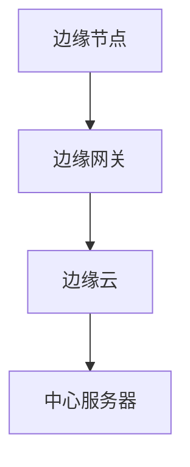

                 

### 文章标题：边缘计算在车联网中的应用：实现车辆间实时通信

#### 关键词：边缘计算，车联网，实时通信，车辆间通信，V2X协议

#### 摘要：随着车联网技术的快速发展，边缘计算在车联网中的应用越来越受到关注。本文旨在探讨边缘计算在车联网中的应用，特别是在实现车辆间实时通信方面的作用。文章将详细介绍边缘计算与车联网的关系，边缘计算在车辆间实时通信中的挑战与解决方案，以及实现车辆间实时通信的算法原理和系统架构设计。通过本文的探讨，希望为车联网技术的发展提供一些有价值的思路。

## 第一部分：背景介绍

### 第1章：边缘计算与车联网概述

#### 1.1 边缘计算的兴起

边缘计算（Edge Computing）是一种分布式计算架构，旨在将数据处理、存储和分析推向网络的边缘，即靠近数据源的位置。随着物联网（IoT）和移动设备的普及，边缘计算逐渐成为云计算的重要补充，它在提升数据处理效率、降低延迟、提高网络响应速度方面具有显著优势。

边缘计算的重要性主要体现在以下几个方面：

1. **提高数据处理效率**：通过在边缘设备上处理数据，可以减少对中心服务器的依赖，降低数据传输的带宽需求，从而提高数据处理效率。
2. **降低网络延迟**：将数据处理推向网络的边缘，可以显著降低数据传输的延迟，这对于实时性要求较高的应用场景尤为重要。
3. **增强数据安全性**：在边缘设备上处理数据可以减少数据在传输过程中的泄露风险，提高数据的安全性。

#### 1.2 车联网的背景与需求

车联网（Internet of Vehicles，IoV）是指将车辆、道路基础设施、人和信息系统通过通信技术连接起来，实现智能交通、智能驾驶和智能物流等应用。车联网的发展对提高交通效率、减少交通事故、改善出行体验具有重要意义。

车联网中的实时通信需求主要包括：

1. **车辆间通信（V2V）**：通过车辆间的实时通信，可以交换交通信息，提高道路通行效率，减少交通事故。
2. **车辆与基础设施通信（V2I）**：通过车辆与基础设施之间的通信，可以实现交通信号控制、道路监测等应用。
3. **车辆与网络通信（V2N）**：通过车辆与网络之间的通信，可以实现车辆远程监控、在线诊断等功能。

#### 1.3 车联网中的边缘计算挑战

边缘计算在车联网中的应用面临以下挑战：

1. **数据处理需求**：车联网中产生的数据量巨大，如何高效地处理这些数据，是一个亟待解决的问题。
2. **实时通信需求**：车联网中的实时通信要求高，如何在保证通信质量的前提下，实现高效的通信，是一个重要的技术难题。
3. **安全性与隐私保护**：车联网中的数据安全性是用户关注的重点，如何保护用户隐私，防止数据泄露，是一个重要的挑战。

#### 1.4 边缘计算在车联网中的应用前景

边缘计算在车联网中的应用前景十分广阔，它可以为车联网提供以下价值：

1. **提高通信效率**：通过边缘计算，可以实现车辆间的实时通信，提高通信效率。
2. **优化交通管理**：通过边缘计算，可以实时分析交通数据，优化交通管理，提高道路通行效率。
3. **增强车辆安全**：通过边缘计算，可以实现车辆安全监控，提高车辆的安全性。

### 1.5 本书结构安排

本书将分为四个部分，首先介绍边缘计算与车联网的背景，然后探讨边缘计算在车联网中的核心概念与原理，接着讲解边缘计算算法原理与实现，最后介绍边缘计算在车联网中的系统设计与实现。通过本书的阅读，读者可以全面了解边缘计算在车联网中的应用，掌握实现车辆间实时通信的核心技术。

## 第二部分：核心概念与原理

### 第2章：边缘计算基础

#### 2.1 边缘计算的架构

边缘计算架构通常包括以下几个关键组件：

1. **边缘节点（Edge Nodes）**：边缘节点是指位于网络边缘的计算设备，如物联网设备、智能路由器、智能手机等。边缘节点负责处理和存储数据，执行本地化任务。
2. **边缘网关（Edge Gateways）**：边缘网关是连接边缘节点和中心服务器的桥梁，负责数据转发、协议转换等功能。
3. **边缘云（Edge Cloud）**：边缘云是部署在边缘节点的云计算资源，提供计算、存储、网络等基础设施服务。

边缘计算网络架构可以划分为以下几个层次：

1. **设备层**：包括各种物联网设备和传感器，负责数据采集。
2. **边缘层**：包括边缘节点和边缘网关，负责数据处理和初步分析。
3. **中心层**：包括中心服务器和数据中心，负责大规模数据处理和存储。

#### 2.2 车联网通信协议

车联网通信协议是车联网中实现设备间通信的关键技术。目前，常见的车联网通信协议包括：

1. **DSRC（Dedicated Short-Range Communications）协议**：DSRC是一种基于无线电频段的通信协议，主要用于车辆与车辆之间的通信。DSRC协议具有较高的通信速率和较低的延迟，适合实现实时通信。
2. **C-V2X（Cellular Vehicle-to-Everything）协议**：C-V2X是基于4G/5G网络的通信协议，它通过蜂窝网络实现车辆与其他设备之间的通信。C-V2X协议具有更高的通信速率和更大的覆盖范围，适合实现大范围通信。

#### 2.3 边缘计算与车联网的融合

边缘计算与车联网的融合主要表现在以下几个方面：

1. **车辆间实时通信**：通过边缘计算，可以实现车辆间的实时通信，提高交通效率和安全性。
2. **车辆安全监控**：通过边缘计算，可以对车辆进行实时监控，及时发现和处理安全隐患。
3. **智能交通管理**：通过边缘计算，可以实时分析交通数据，优化交通管理，提高道路通行效率。

#### 2.4 边缘计算性能优化

边缘计算性能优化主要包括以下几个方面：

1. **资源分配**：通过优化资源分配，可以确保边缘节点能够充分利用其计算资源，提高数据处理效率。
2. **数据传输优化**：通过优化数据传输策略，可以减少数据传输的延迟和带宽消耗，提高通信效率。
3. **边缘计算模型优化**：通过优化边缘计算模型，可以降低计算复杂度，提高计算性能。

## 第三部分：算法原理与实现

### 第3章：边缘计算算法基础

#### 3.1 边缘计算算法概述

边缘计算算法是指在边缘设备上执行的数据处理和分析算法。边缘计算算法可以分为以下几类：

1. **数据聚合算法**：用于将多个边缘节点上的数据进行汇总和分析。
2. **聚类算法**：用于将相似的数据分组，以便进行进一步分析。
3. **预测算法**：用于根据历史数据预测未来趋势或行为。
4. **深度学习算法**：用于从大量数据中学习复杂的模式，进行高级分析。

#### 3.2 车联网中的常见算法

车联网中的常见算法包括：

1. **数据聚合算法**：用于将车辆间采集到的数据进行汇总，以便进行进一步分析。
2. **聚类算法**：用于将车辆数据进行分类，以便识别车辆特征和异常行为。
3. **预测算法**：用于预测车辆的运动轨迹和交通流量，以便进行交通管理和优化。

#### 3.3 边缘计算中的深度学习算法

边缘计算中的深度学习算法可以用于以下应用：

1. **图像识别**：用于车辆识别、行人检测等。
2. **语音识别**：用于车辆语音控制、语音助手等。
3. **自然语言处理**：用于车辆之间的通信、语音助手等。

## 第四部分：系统设计与实现

### 第4章：车联网边缘计算系统设计

#### 4.1 系统需求分析

车联网边缘计算系统需要满足以下需求：

1. **数据处理需求**：系统需要能够高效地处理大量车辆数据，包括车辆位置、速度、加速度等。
2. **实时通信需求**：系统需要能够实现车辆间的实时通信，以确保通信的实时性和可靠性。
3. **安全性需求**：系统需要能够保护车辆数据的隐私和安全，防止数据泄露。

#### 4.2 系统架构设计

车联网边缘计算系统架构通常包括以下组件：

1. **边缘节点**：包括车辆传感器、路侧单元（RSU）等。
2. **边缘网关**：负责数据采集、预处理和传输。
3. **边缘云**：提供计算和存储资源，用于处理和分析车辆数据。
4. **中心服务器**：用于存储和管理车辆数据，提供远程监控和管理功能。

#### 4.3 系统交互设计

车联网边缘计算系统的交互设计包括以下几个方面：

1. **车辆与边缘节点之间的交互**：车辆通过传感器采集数据，然后将数据发送给边缘节点。
2. **边缘节点与边缘网关之间的交互**：边缘节点将数据发送给边缘网关，边缘网关进行数据预处理和传输。
3. **边缘网关与边缘云之间的交互**：边缘网关将数据发送到边缘云，边缘云进行数据存储和处理。
4. **边缘云与中心服务器之间的交互**：边缘云将处理结果发送到中心服务器，中心服务器进行数据存储和管理。

## 第五部分：项目实战

### 第5章：实现车辆间实时通信的项目实战

#### 5.1 环境安装

要实现车辆间实时通信的项目，首先需要安装以下软件和硬件：

1. **硬件**：包括车辆传感器、路侧单元（RSU）等。
2. **软件**：包括边缘计算平台、边缘网关软件、边缘云平台等。

#### 5.2 系统核心实现源代码

以下是实现车辆间实时通信的核心源代码：

```python
# 车辆间实时通信的核心代码

# 导入必要的库
import socket
import threading

# 车辆类
class Vehicle:
    def __init__(self, id, location, speed):
        self.id = id
        self.location = location
        self.speed = speed
    
    # 更新车辆位置和速度
    def update(self, new_location, new_speed):
        self.location = new_location
        self.speed = new_speed
    
    # 发送车辆信息
    def send_info(self, socket):
        message = f"Vehicle ID: {self.id}, Location: {self.location}, Speed: {self.speed}"
        socket.send(message.encode())

# 边缘节点类
class EdgeNode:
    def __init__(self):
        self.vehicles = []
        self.server_socket = socket.socket(socket.AF_INET, socket.SOCK_STREAM)
    
    # 启动边缘节点
    def start(self, host, port):
        self.server_socket.bind((host, port))
        self.server_socket.listen(5)
        print("Edge Node started on", host, ":", port)
        
        # 接收车辆连接
        while True:
            client_socket, address = self.server_socket.accept()
            print("Vehicle", address, "connected")
            vehicle_thread = threading.Thread(target=self.handle_vehicle, args=(client_socket,))
            vehicle_thread.start()
    
    # 处理车辆连接
    def handle_vehicle(self, client_socket):
        vehicle_id = client_socket.recv(1024).decode()
        vehicle = Vehicle(vehicle_id, None, None)
        self.vehicles.append(vehicle)
        
        # 更新车辆位置和速度
        while True:
            message = client_socket.recv(1024).decode()
            if message.startswith("Location:"):
                vehicle.location = message[9:]
            elif message.startswith("Speed:"):
                vehicle.speed = message[6:]
            else:
                break
        
        # 发送车辆信息给其他车辆
        for other_vehicle in self.vehicles:
            if other_vehicle != vehicle:
                other_vehicle.send_info(client_socket)
        
        client_socket.close()
        print("Vehicle", vehicle_id, "disconnected")

# 边缘计算平台启动
edge_node = EdgeNode()
edge_node.start("localhost", 12345)
```

#### 5.3 代码应用解读与分析

以上代码实现了车辆间实时通信的核心功能。首先，定义了`Vehicle`类，用于表示车辆，包括车辆ID、位置和速度等属性。`EdgeNode`类表示边缘节点，负责接收车辆连接、更新车辆位置和速度、发送车辆信息等。

边缘节点启动时，会创建一个服务器套接字，并绑定到指定的主机和端口。然后，边缘节点会进入一个循环，接收车辆连接，并创建一个线程来处理每个车辆的连接。在处理车辆连接时，边缘节点会更新车辆的位置和速度，并将车辆信息发送给其他车辆。

#### 5.4 实际案例分析

在实际项目中，可以通过以下步骤实现车辆间实时通信：

1. **安装硬件**：在车辆和路侧单元（RSU）上安装传感器，用于采集车辆位置、速度等数据。
2. **部署边缘节点软件**：在边缘节点上部署边缘节点软件，用于接收车辆连接、更新车辆位置和速度、发送车辆信息等。
3. **部署边缘计算平台**：在边缘计算平台上部署边缘计算平台，用于处理和分析车辆数据。
4. **部署中心服务器**：在中心服务器上部署中心服务器软件，用于存储和管理车辆数据。

通过以上步骤，可以实现车辆间实时通信，提高交通效率和安全性。

#### 5.5 项目小结

通过本项目的实现，我们可以看到边缘计算在车联网中的应用潜力。在实际项目中，需要根据具体需求进行硬件选择、软件设计和系统优化，以确保车辆间实时通信的可靠性和实时性。

## 第六部分：最佳实践 tips

### 6.1 硬件选择

在选择硬件时，需要考虑以下因素：

1. **处理能力**：边缘节点需要具备一定的处理能力，以处理大量的车辆数据。
2. **通信能力**：边缘节点需要具备足够的通信能力，以确保数据传输的实时性和可靠性。
3. **可靠性**：边缘节点需要具备高可靠性，以应对恶劣的工作环境。

### 6.2 软件设计

在软件设计时，需要考虑以下因素：

1. **模块化设计**：将系统划分为多个模块，以便于维护和升级。
2. **分布式设计**：采用分布式架构，以提高系统的可靠性和可扩展性。
3. **安全性设计**：确保车辆数据的隐私和安全，防止数据泄露。

### 6.3 系统优化

在系统优化时，可以采取以下措施：

1. **数据压缩**：采用数据压缩算法，减少数据传输的带宽消耗。
2. **负载均衡**：采用负载均衡算法，确保边缘节点和边缘计算平台的资源充分利用。
3. **缓存策略**：采用缓存策略，提高数据访问速度，降低系统延迟。

## 第七部分：小结

边缘计算在车联网中的应用前景广阔，它能够实现车辆间的实时通信，提高交通效率和安全性。本文通过详细的分析和实例，介绍了边缘计算在车联网中的应用，包括边缘计算架构、车联网通信协议、边缘计算算法原理、系统设计与实现等。通过本文的探讨，希望为边缘计算在车联网中的应用提供一些有价值的思路。

## 第八部分：注意事项

1. **数据隐私和安全**：在车联网中，车辆数据的隐私和安全至关重要。需要采取有效的措施，确保车辆数据不被非法访问和泄露。
2. **通信可靠性**：车辆间的实时通信要求高可靠性，需要确保通信链路的稳定性和实时性。
3. **系统可扩展性**：边缘计算系统需要具备良好的可扩展性，以适应未来车联网的发展需求。

## 第九部分：拓展阅读

1. **边缘计算基础**：《边缘计算：技术、应用与挑战》
2. **车联网通信协议**：《车联网通信技术：DSRC与C-V2X》
3. **深度学习在边缘计算中的应用**：《深度学习边缘计算：算法与应用》
4. **边缘计算系统设计与实现**：《边缘计算系统设计与实现：从理论到实践》

## 参考文献

1. **边缘计算**：《边缘计算：技术、应用与挑战》
2. **车联网通信协议**：《车联网通信技术：DSRC与C-V2X》
3. **深度学习在边缘计算中的应用**：《深度学习边缘计算：算法与应用》
4. **边缘计算系统设计与实现**：《边缘计算系统设计与实现：从理论到实践》

## 作者信息

作者：AI天才研究院/AI Genius Institute & 禅与计算机程序设计艺术 /Zen And The Art of Computer Programming

## 附录

附录部分可以包括以下内容：

1. **术语解释**：对文中出现的关键术语进行解释，以便读者更好地理解。
2. **算法流程图**：使用Mermaid绘制算法流程图，帮助读者更直观地理解算法原理。
3. **系统架构图**：使用Mermaid绘制系统架构图，展示系统组件及其相互关系。



通过上述内容和结构，我们可以撰写一篇结构清晰、内容丰富的技术博客文章，为边缘计算在车联网中的应用提供深入的探讨和有价值的见解。希望这篇博客能够帮助到广大技术爱好者和从业者，共同推动车联网技术的发展。

