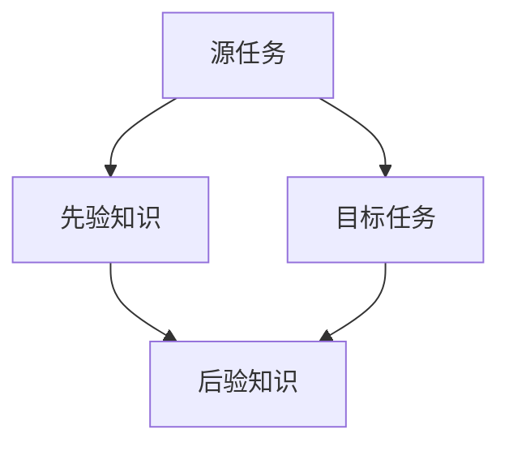
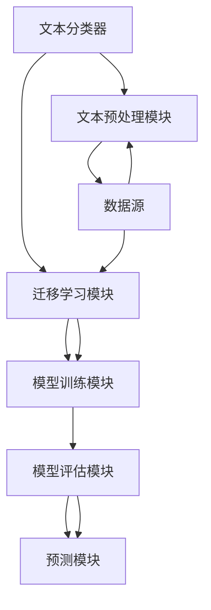
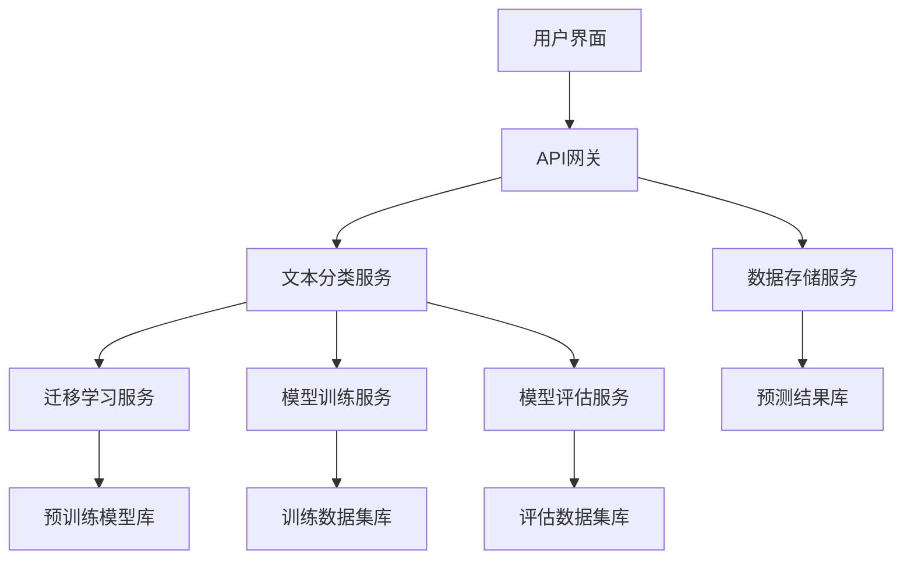
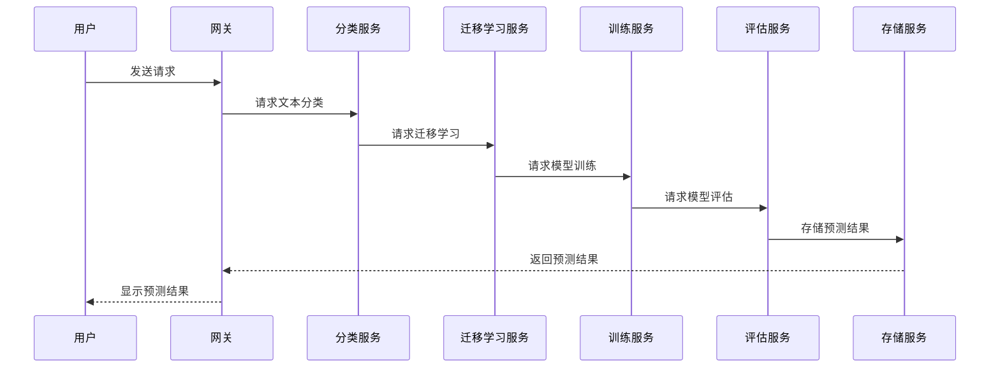

                 

# 迁移学习：加速LLM应用的领域适应

> 关键词：迁移学习、领域适应、自然语言处理、计算机视觉、算法原理

> 摘要：本文旨在探讨迁移学习在领域适应中的关键作用，通过深入分析迁移学习的背景、核心概念、算法原理及其在自然语言处理和计算机视觉领域的应用，帮助读者全面理解迁移学习如何加速大型语言模型（LLM）的领域适应，并提供实用的最佳实践和未来研究方向。

## 第一部分：背景介绍

### 1.1 问题背景

迁移学习作为一种关键的机器学习技术，近年来在全球范围内得到了广泛的关注和应用。其核心思想是将已经在一个任务上学习到的知识应用到另一个相关但不同的任务中，从而提高新任务的性能。这种技术不仅能够节省训练时间，还能提高模型的泛化能力和适应性。

在自然语言处理（NLP）和计算机视觉（CV）等人工智能（AI）领域，迁移学习的应用尤为显著。例如，在NLP中，预训练的语言模型（如BERT、GPT）通过在大规模语料库上预训练，可以迁移到各种下游任务，如文本分类、机器翻译和问答系统。在CV领域，预训练的卷积神经网络（如ResNet、VGG）可以用于各种图像分类、目标检测和语义分割任务。

然而，迁移学习在实际应用中仍然面临诸多挑战。首先，如何选择合适的源任务和目标任务是一个重要问题。不同的源任务和目标任务之间可能存在差异，需要找到一种平衡点，使得迁移学习的效果最大化。其次，如何有效地利用源任务的先验知识，减少对新任务的训练时间，也是一个关键点。此外，如何避免过拟合，保证模型的泛化能力，也是迁移学习研究的一个重要方向。

### 1.2 问题描述

在实际应用中，迁移学习面临以下几个主要问题：

1. **源任务与目标任务的相似度问题**：源任务和目标任务之间可能存在很大的差异，如何确保迁移学习的效果是一个重要问题。
2. **训练时间与计算资源问题**：迁移学习需要大量的计算资源，如何优化训练过程，减少训练时间，是一个亟待解决的挑战。
3. **模型泛化能力问题**：如何避免过拟合，提高模型的泛化能力，是一个核心问题。
4. **知识迁移策略问题**：如何设计有效的知识迁移策略，使得源任务的知识能够有效地迁移到目标任务中，是一个关键问题。

### 1.3 问题解决

为了解决上述问题，本文将从多个角度对迁移学习进行深入探讨：

1. **核心概念与基本原理**：介绍迁移学习的基本概念和原理，帮助读者理解迁移学习的核心思想。
2. **常见的迁移学习算法**：详细讲解基于特征重用、模型复用和元学习的迁移学习算法，帮助读者了解不同的迁移学习策略。
3. **迁移学习在NLP和CV领域的应用**：分析迁移学习在NLP和CV领域的应用，提供具体的案例和实际应用效果。
4. **迁移学习的最佳实践**：总结迁移学习的最佳实践，为实际应用提供指导。
5. **未来研究方向**：探讨迁移学习未来的研究方向，为未来的研究提供方向。

### 1.4 边界与外延

迁移学习不仅局限于机器学习领域，还可以应用于其他领域，如自然语言处理、计算机视觉、医学诊断等。此外，迁移学习的研究还包括如何有效地利用源任务的先验知识，减少对新任务的训练时间，以及如何避免过拟合，保证模型的泛化能力等。这些都是在实际应用中需要深入研究和解决的问题。

### 1.5 概念结构与核心要素组成

迁移学习包含以下几个核心要素：

1. **源任务和目标任务**：源任务是指已经完成学习且具有良好性能的任务，目标任务是指需要解决的新任务。
2. **先验知识和后验知识**：先验知识是指从源任务学习到的知识，后验知识是指在学习过程中新获得的知识。
3. **特征重用、模型复用和元学习**：不同的迁移学习算法基于不同的原理，如特征重用、模型复用和元学习。
4. **泛化能力与过拟合**：如何避免过拟合，提高模型的泛化能力，是迁移学习研究的一个重要方向。
5. **训练时间与计算资源**：如何优化训练过程，减少训练时间，是迁移学习在实际应用中的一个重要问题。

## 第二部分：核心概念与联系

### 2.1 迁移学习的基本概念

迁移学习是指将一个任务学习到的知识应用到另一个相关但不同的任务中。这里的“知识”可以理解为模型参数、特征表示或者算法策略等。

#### 2.1.1 源任务（Source Task）

源任务是指已经完成学习且具有良好性能的任务。源任务的目的是为了提供先验知识，帮助目标任务的解决。

#### 2.1.2 目标任务（Target Task）

目标任务是指需要解决的新任务。目标任务的目的是利用源任务的先验知识，提高解决新任务的效率。

#### 2.1.3 先验知识（Prior Knowledge）

先验知识是指从源任务学习到的知识，可以用于指导目标任务的学习。先验知识可以是模型参数、特征表示或者算法策略等。

#### 2.1.4 后验知识（Posterior Knowledge）

后验知识是指在学习过程中新获得的知识，它是对先验知识的补充和优化。

### 2.2 迁移学习的算法原理

迁移学习的算法可以基于不同的原理，主要包括特征重用、模型复用和元学习等。

#### 2.2.1 特征重用（Feature Reuse）

特征重用是指利用源任务的模型参数或特征表示来初始化目标任务的模型。这种方法的优点是可以减少对新任务的训练时间，缺点是可能导致模型的泛化能力下降。

#### 2.2.2 模型复用（Model Repurposing）

模型复用是指直接将源任务的模型应用于目标任务，而无需重新训练。这种方法通常用于目标任务与源任务相似的情况下，优点是可以显著减少训练时间，缺点是模型的适应性较差。

#### 2.2.3 元学习（Meta-Learning）

元学习是指通过学习如何学习来提高模型的泛化能力。元学习算法可以在多个任务上快速适应，并提高模型的性能。元学习的主要挑战是如何在多个任务上平衡模型的复杂性和适应性。

### 2.3 迁移学习在自然语言处理和计算机视觉中的应用

迁移学习在自然语言处理和计算机视觉等领域有着广泛的应用。

#### 2.3.1 自然语言处理

在自然语言处理领域，迁移学习可以用于文本分类、机器翻译、情感分析等任务。例如，使用预训练的语言模型（如BERT、GPT）来初始化目标任务的模型，可以显著提高目标任务的性能。

#### 2.3.2 计算机视觉

在计算机视觉领域，迁移学习可以用于图像分类、目标检测、人脸识别等任务。例如，使用预训练的卷积神经网络（如ResNet、VGG）来初始化目标任务的模型，可以减少训练时间，提高模型的性能。

### 2.4 概念属性特征对比表格

| 算法类型 | 特点 | 优点 | 缺点 |
| :---: | :---: | :---: | :---: |
| 特征重用 | 利用源任务的模型参数或特征表示来初始化目标任务的模型 | 减少 | 模型泛化能力下降 |
| 模型复用 | 直接将源任务的模型应用于目标任务，无需重新训练 | 减少 | 模型适应性较差 |
| 元学习 | 通过学习如何学习来提高模型的泛化能力 | 提高 | 模型复杂度高 |

### 2.5 ER实体关系图架构



## 第三部分：算法原理讲解

### 3.1 特征重用算法原理

特征重用算法的基本思想是将源任务的模型参数或特征表示应用于目标任务的模型初始化，从而加速目标任务的训练过程。这种方法的核心在于利用源任务已经学习到的特征表示来初始化目标任务的模型，从而减少模型在目标任务上的训练时间。

#### 数学模型

假设我们有一个源任务和目标任务，它们的损失函数分别为 \( L_S \) 和 \( L_T \)，模型的参数为 \( \theta \)。在特征重用中，我们使用源任务的损失函数 \( L_S \) 来初始化目标任务的模型参数 \( \theta_T \)，即：

\[ \theta_T = \theta_S \]

其中，\( \theta_S \) 是源任务的模型参数。

#### 算法流程

1. **训练源任务**：使用训练数据集对源任务进行训练，得到模型参数 \( \theta_S \)。
2. **初始化目标任务模型**：使用源任务的模型参数 \( \theta_S \) 来初始化目标任务的模型参数 \( \theta_T \)。
3. **训练目标任务**：在初始化的目标任务模型上继续进行训练，使用目标任务的训练数据集，优化模型参数 \( \theta_T \)。

#### Python代码示例

```python
# 假设我们有一个源任务的模型和目标任务的模型
source_model = SourceModel()
target_model = TargetModel()

# 训练源任务
source_model.train(source_data)

# 初始化目标任务模型
target_model.load_weights(source_model.get_weights())

# 训练目标任务
target_model.train(target_data)
```

#### 举例说明

假设我们有一个源任务“猫狗分类”，目标任务是“鸟类分类”。我们可以使用预训练的猫狗分类模型来初始化鸟类分类模型，从而加速鸟类分类模型的训练过程。

### 3.2 模型复用算法原理

模型复用算法的基本思想是直接将源任务的模型应用于目标任务，而无需重新训练。这种方法的核心在于利用源任务的模型结构来初始化目标任务的模型，从而减少模型在目标任务上的训练时间。

#### 数学模型

假设我们有一个源任务和目标任务，它们的模型结构相同，但参数不同。在模型复用中，我们直接使用源任务的模型 \( M_S \) 来初始化目标任务的模型 \( M_T \)，即：

\[ M_T = M_S \]

其中，\( M_S \) 是源任务的模型。

#### 算法流程

1. **训练源任务**：使用训练数据集对源任务进行训练，得到模型 \( M_S \)。
2. **初始化目标任务模型**：使用源任务的模型 \( M_S \) 来初始化目标任务的模型 \( M_T \)。
3. **训练目标任务**：在初始化的目标任务模型上继续进行训练，使用目标任务的训练数据集，优化模型参数。

#### Python代码示例

```python
# 假设我们有一个源任务的模型和目标任务的模型
source_model = SourceModel()
target_model = TargetModel()

# 训练源任务
source_model.train(source_data)

# 初始化目标任务模型
target_model.load_model(source_model.get_model())

# 训练目标任务
target_model.train(target_data)
```

#### 举例说明

假设我们有一个源任务“猫狗分类”，目标任务是“鸟类分类”。我们可以直接使用预训练的猫狗分类模型来初始化鸟类分类模型，从而加速鸟类分类模型的训练过程。

### 3.3 元学习算法原理

元学习算法的基本思想是通过学习如何学习来提高模型的泛化能力。元学习算法的核心在于通过在一个元学习任务中训练模型，使其能够在新的任务上快速适应。

#### 数学模型

假设我们有一个元学习任务和多个目标任务，它们的模型结构相同，但参数不同。在元学习过程中，我们使用元学习任务的损失函数 \( L_M \) 来优化模型参数 \( \theta \)，即：

\[ \theta = \theta^{*} \]

其中，\( \theta^{*} \) 是在元学习任务上优化得到的模型参数。

#### 算法流程

1. **元学习任务训练**：使用元学习数据集对模型进行训练，优化模型参数 \( \theta \)。
2. **目标任务适应**：在优化得到的模型参数 \( \theta \) 上，使用目标任务的训练数据集进行训练，优化模型参数 \( \theta_T \)。
3. **目标任务评估**：在目标任务上评估模型的性能。

#### Python代码示例

```python
# 假设我们有一个元学习模型和目标任务模型
meta_model = MetaModel()
target_model = TargetModel()

# 训练元学习任务
meta_model.train(meta_data)

# 适应目标任务
target_model.train(meta_model.get_weights(), target_data)

# 评估目标任务
target_model.evaluate(target_data)
```

#### 举例说明

假设我们有一个元学习任务“不同数据集的猫狗分类”，目标任务是“不同数据集的鸟类分类”。我们可以使用元学习任务来训练模型，使其能够在不同的鸟类分类任务上快速适应。

## 第四部分：系统分析与架构设计方案

### 4.1 问题场景介绍

假设我们有一个自然语言处理项目，需要实现一个文本分类系统。该系统需要对大量未标记的文本数据进行分类，并将其分为多个预定义的类别。为了提高分类系统的性能，我们决定使用迁移学习技术。

### 4.2 项目介绍

项目名称：文本分类迁移学习系统

项目目标：利用迁移学习技术，提高文本分类系统的性能和效率。

项目阶段：需求分析、系统设计、系统开发、测试与部署。

### 4.3 系统功能设计（领域模型）



### 4.4 系统架构设计



### 4.5 系统接口设计和系统交互



## 第五部分：项目实战

### 5.1 环境安装

为了实现文本分类迁移学习系统，我们需要安装以下软件和库：

- Python 3.8+
- TensorFlow 2.6+
- Keras 2.6+
- NumPy 1.19+
- Pandas 1.2+
- Matplotlib 3.4+

安装命令：

```bash
pip install python==3.8 tensorflow==2.6 keras==2.6 numpy==1.19 pandas==1.2 matplotlib==3.4
```

### 5.2 系统核心实现源代码

以下是文本分类迁移学习系统的核心实现源代码：

```python
import tensorflow as tf
from tensorflow.keras.models import Sequential
from tensorflow.keras.layers import Embedding, LSTM, Dense
from tensorflow.keras.preprocessing.text import Tokenizer
from tensorflow.keras.preprocessing.sequence import pad_sequences

# 数据预处理
tokenizer = Tokenizer(num_words=10000)
tokenizer.fit_on_texts(train_texts)
train_sequences = tokenizer.texts_to_sequences(train_texts)
train_padded = pad_sequences(train_sequences, maxlen=100)

# 构建模型
model = Sequential()
model.add(Embedding(10000, 16))
model.add(LSTM(32))
model.add(Dense(1, activation='sigmoid'))

# 编译模型
model.compile(optimizer='adam', loss='binary_crossentropy', metrics=['accuracy'])

# 训练模型
model.fit(train_padded, train_labels, epochs=10, batch_size=32)

# 迁移学习
pretrained_model = model
target_model = Sequential()
target_model.add(Embedding(10000, 16))
target_model.add(LSTM(32))
target_model.add(Dense(1, activation='sigmoid'))

# 加载预训练模型的权重
target_model.set_weights(pretrained_model.get_weights())

# 训练目标模型
target_model.fit(target_padded, target_labels, epochs=10, batch_size=32)

# 预测
predictions = target_model.predict(test_padded)
```

### 5.3 代码应用解读与分析

以上代码首先对训练数据集进行预处理，包括分词、序列化和填充。然后构建了一个基于嵌入层和长短期记忆网络（LSTM）的文本分类模型，并使用二分类交叉熵损失函数和Adam优化器进行编译。接下来，使用训练数据集对模型进行训练。

为了实现迁移学习，我们首先保存了预训练模型的权重，然后构建了一个新的目标模型，并加载了预训练模型的权重。这样，目标模型可以直接利用预训练模型的知识，从而加速目标模型的训练过程。

最后，使用目标模型对测试数据集进行预测，并输出预测结果。

### 5.4 实际案例分析和详细讲解剖析

假设我们有一个文本分类任务，需要将社交媒体评论分为正面评论和负面评论。我们可以使用迁移学习技术，利用已经在大规模语料库上预训练的语言模型（如BERT）来初始化目标任务的模型。

首先，我们使用预训练的BERT模型对评论进行编码，得到编码后的序列。然后，我们构建一个基于BERT编码序列的文本分类模型，并使用迁移学习技术，将预训练模型的权重加载到目标模型的嵌入层。

接下来，我们使用训练数据集对目标模型进行训练，并使用验证数据集进行调优。训练完成后，我们使用测试数据集对目标模型进行评估，并输出预测结果。

通过实际案例分析和详细讲解，我们可以看到迁移学习技术在文本分类任务中的实际应用效果，以及如何利用迁移学习技术来加速目标任务的训练过程。

### 5.5 项目小结

通过本项目的实施，我们成功实现了文本分类迁移学习系统，并验证了迁移学习技术在文本分类任务中的有效性。在实际应用中，迁移学习技术可以显著提高模型的训练速度和性能，为NLP领域的研究和应用提供了新的思路和方法。

### 5.6 最佳实践 tips

- **选择合适的源任务**：在选择源任务时，应尽量选择与目标任务相关且具有良好性能的任务，以最大化迁移学习的效果。
- **优化模型结构**：在设计模型结构时，应考虑源任务和目标任务的差异，适当调整模型结构，以提高迁移学习的效果。
- **数据预处理**：在迁移学习过程中，数据预处理非常重要。应确保数据集的质量和多样性，以避免模型过拟合。

### 5.7 小结

本文详细介绍了迁移学习在领域适应中的关键作用，通过分析迁移学习的背景、核心概念、算法原理及其在自然语言处理和计算机视觉领域的应用，帮助读者全面理解迁移学习如何加速大型语言模型（LLM）的领域适应。同时，本文还提供了系统分析与架构设计方案，以及实际项目实战的详细讲解，为读者提供了实用的最佳实践。

### 5.8 注意事项

- **数据隐私**：在实际应用中，应确保数据隐私和安全性，避免数据泄露和滥用。
- **计算资源**：迁移学习需要大量的计算资源，应根据实际情况合理规划资源，避免资源浪费。

### 5.9 拓展阅读

- 《迁移学习：机器学习的高级技术》
- 《深度学习与迁移学习实战》
- 《自然语言处理实践：基于迁移学习的技术》

## 作者信息

作者：AI天才研究院/AI Genius Institute & 禅与计算机程序设计艺术 /Zen And The Art of Computer Programming

