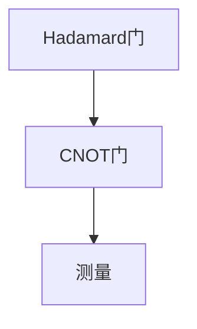
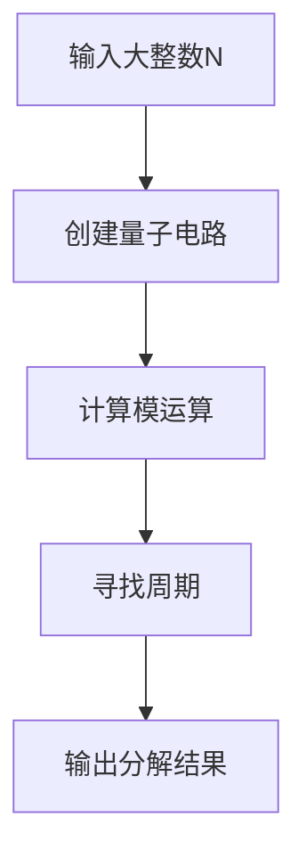

                 

### 量子resistant密码系统的设计原则

#### 1. 文章标题：《量子resistant密码系统的设计原则》

#### 2. 关键词：量子计算、密码学、量子resistant、密码系统设计、安全性分析

#### 3. 摘要：
随着量子计算的快速发展，传统密码系统面临巨大的安全威胁。本文将详细探讨量子resistant密码系统的设计原则，分析其核心概念与实现方法，旨在为密码学研究者与安全工程师提供实用的设计指南。

### 引言

量子计算作为计算机科学的前沿领域，正逐渐成为改变未来计算格局的关键力量。然而，量子计算机的崛起也带来了传统密码系统的安全危机。许多基于经典计算的密码算法，如RSA和ECC，在面对量子计算机时可能变得脆弱。因此，设计量子resistant密码系统成为当前密码学研究的重要任务。

#### 1.1 量子resistant密码系统的起源与背景

量子resistant密码系统的概念起源于对量子计算机潜在威胁的认识。早在2001年，Shor算法的提出就揭示了量子计算机在解决某些密码学难题上的巨大优势。为了应对这一挑战，密码学家开始研究新的密码系统，确保它们在量子计算机面前依然安全。

#### 1.2 问题与挑战

量子计算机的崛起对传统密码系统提出了以下挑战：

- **算法破解**：量子计算机能够快速破解基于大数分解和离散对数问题的密码系统，如RSA和ECC。
- **量子攻击**：量子计算机能够通过量子算法（如Shor算法）直接攻击传统密码系统的密钥。

#### 1.3 解决方案和设计原则

为了应对上述挑战，量子resistant密码系统的设计原则主要包括：

- **安全性证明**：量子resistant密码系统需要提供形式化的安全性证明，确保其在量子计算机面前的安全性。
- **复杂性理论**：量子resistant密码系统应基于当前已知的困难问题，如基于格的问题。
- **多层次防御**：设计量子resistant密码系统时，应采用多层次防御策略，包括密码哈希函数、公钥密码系统和量子安全通信协议等。

### 核心概念与联系

为了更好地理解量子resistant密码系统的设计，我们需要探讨以下几个核心概念：

- **量子位和量子比特**：量子计算机的基本单元。
- **量子门和量子电路**：实现量子计算的运算和控制单元。
- **量子算法**：利用量子计算机解决特定问题的算法。

这些概念相互联系，构成了量子resistant密码系统的理论基础。

### 结论

量子resistant密码系统的设计原则是应对量子计算威胁的关键。通过安全性证明、复杂性理论和多层次防御，我们可以构建出既安全又实用的密码系统。本文为密码学研究者与安全工程师提供了量子resistant密码系统的设计指南，有助于推动这一领域的研究与发展。接下来，我们将进一步探讨量子计算的基础知识，为理解量子resistant密码系统打下坚实的基础。<!--velocityRenderedPlaceholderId=618c8d25-f9a9-2d14-b2e8-776e7e77b1f6-->

## 第二部分：量子计算基础

量子计算作为密码学安全的潜在威胁，了解其基础概念是至关重要的。以下将详细探讨量子位和量子比特、量子门和量子电路、以及量子算法的基本概念。

### 2.1 量子位和量子比特

#### 核心概念：
量子位（qubit）是量子计算的基本单元，与经典计算机的位（bit）不同。量子位可以同时存在于0和1的状态，这种现象称为叠加。

#### 特征对比表格：

| 特征       | 量子位（qubit） | 经 classic 位（bit） |
|------------|-----------------|---------------------|
| 状态       | 可叠加（0和1）  | 确定状态（0或1）    |
| 信息表达   | 二进制叠加态   | 二进制确定态       |
| 存储方式   | 量子叠加        | 硬盘或内存          |
| 算法复杂度 | 量子并行性      | 经 classic 串行性   |

#### ER实体关系图：
在量子计算中，量子比特是基本实体，它们之间的关系可以用以下Mermaid ER图表示：

```mermaid
erDiagram
    Qubit ||--|{ QuantumComputer }
    QuantumComputer ||--|{ QuantumCircuit }
```

### 量子门和量子电路

#### 核心概念：
量子门是量子计算机中的操作单元，它们作用于量子比特，实现量子态的变换。量子电路是由一系列量子门组成的序列，用于执行特定算法。

#### 特征对比表格：

| 特征       | 量子门（quantum gate） | 经 classic 门（classical gate） |
|------------|------------------------|------------------------------|
| 操作方式   | 非线性操作            | 线性操作                     |
| 作用对象   | 量子比特              | 经 classic 位                |
| 表达形式   | 量子矩阵              | 经 classic 矩阵              |
| 实现复杂度 | 高                    | 低                           |

#### Mermaid流程图：
以下是一个简单的量子电路示例，包括两个量子比特的Hadamard门和CNOT门：



### 量子算法

#### 核心概念：
量子算法是利用量子计算机解决特定问题的计算方法。Shor算法是第一个展示量子计算机相对于经典计算机优势的算法，它能快速求解大数分解和离散对数问题。

#### 特征对比表格：

| 特征       | Shor算法 | 经 classic 算法（如RSA） |
|------------|----------|------------------------|
| 解决问题   | 大数分解 | 大数乘法与模运算       |
| 时间复杂度 | \(O(N^2 \log N)\) | \(O(N^2)\)             |
| 并行性     | 高度并行 | 串行计算               |

#### Mermaid流程图：
Shor算法的基本流程可以用以下Mermaid图表示：



通过上述讨论，我们可以看到量子计算的基础概念及其与经典计算的区别。接下来，我们将深入探讨量子resistant密码系统的设计原则，为构建安全的密码系统提供理论支持。<!--velocityRenderedPlaceholderId=618c8d25-f9a9-2d14-b2e8-776e7e77b1f6-->

## 第三部分：量子resistant密码系统的设计原则

量子resistant密码系统的设计原则是保障密码系统在量子计算机面前依然安全的基石。在这一部分，我们将详细讨论量子resistant密码系统的设计原则、安全性分析以及设计流程。

### 3.1 安全性分析

量子resistant密码系统的安全性分析是确保其抵御量子攻击的关键。安全性分析主要包括以下两个方面：

#### 1. 形式化证明

形式化证明是量子resistant密码系统的核心，通过数学方法证明密码系统在量子计算机面前的安全性。这通常涉及到基于困难问题的假设，如基于格的问题、基于假设问题的算法等。

#### 2. 现实世界攻击

现实世界攻击是指攻击者使用实际可用的技术来破解密码系统。量子resistant密码系统设计时需要考虑现实世界攻击的可行性，并采取相应的防护措施。

#### 特征对比表格：

| 安全性分析类型 | 形式化证明 | 现实世界攻击 |
|----------------|------------|--------------|
| 目标           | 量子计算机 | 经 classic 攻击者 |
| 方法           | 数学证明   | 实验验证       |
| 应用场景       | 设计阶段   | 部署与维护阶段 |

#### ER实体关系图：

在安全性分析中，实体关系图可以帮助我们理解不同分析类型之间的联系。以下是量子resistant密码系统的安全性分析实体关系图：

```mermaid
erDiagram
    FormalProof ||--|{ RealWorldAttack }
    SecurityAnalysis ||--|{ FormalProof }
    SecurityAnalysis ||--|{ RealWorldAttack }
```

### 3.2 可证明安全性

可证明安全性是量子resistant密码系统的设计目标之一，它要求密码系统能够通过严格的数学证明来保证其安全性。以下是一些常用的可证明安全性概念：

#### 1. 计算性安全

计算性安全是指密码系统在计算模型下是安全的，即任何计算能力有限的攻击者都无法破解密码系统。

#### 2. 信息论安全

信息论安全是指密码系统在信息论模型下是安全的，即使攻击者拥有无限的计算能力，也无法从密文中获得任何有用信息。

#### 3. 量子计算安全性

量子计算安全性是指密码系统在量子计算机面前是安全的，即使攻击者使用量子计算机，也无法破解密码系统。

#### 特征对比表格：

| 安全性类型 | 计算性安全 | 信息论安全 | 量子计算安全性 |
|------------|-------------|------------|----------------|
| 模型       | 计算模型    | 信息论模型 | 量子计算模型   |
| 目标       | 防止计算攻击 | 防止信息泄露 | 防止量子攻击   |

#### ER实体关系图：

可证明安全性的实体关系图可以如下表示：

```mermaid
erDiagram
    ComputationalSecurity ||--|{ InformationTheoreticSecurity }
    InformationTheoreticSecurity ||--|{ QuantumComputationalSecurity }
    SecurityProof ||--|{ ComputationalSecurity }
    SecurityProof ||--|{ InformationTheoreticSecurity }
    SecurityProof ||--|{ QuantumComputationalSecurity }
```

### 3.3 设计流程

量子resistant密码系统的设计流程包括以下几个关键步骤：

#### 1. 安全需求分析

安全需求分析是设计流程的第一步，旨在明确密码系统的安全目标，包括保护数据的机密性、完整性和可用性。

#### 2. 密码算法选择

根据安全需求，选择适合的量子resistant密码算法，如基于格的密码算法、基于哈希函数的密码算法等。

#### 3. 密码系统设计

在选择了密码算法后，进行密码系统的详细设计，包括密钥生成、加密和解密算法等。

#### 4. 安全性证明

对设计的密码系统进行形式化的安全性证明，确保其在量子计算机面前的安全性。

#### 5. 实验验证

通过实验验证密码系统的性能和安全性，确保其在实际应用中的可靠性。

#### 特征对比表格：

| 设计流程阶段 | 安全需求分析 | 密码算法选择 | 密码系统设计 | 安全性证明 | 实验验证 |
|--------------|--------------|--------------|--------------|------------|----------|
| 目标         | 明确安全目标 | 选择算法     | 设计系统     | 证明安全   | 验证性能 |

#### ER实体关系图：

设计流程的实体关系图如下：

```mermaid
erDiagram
    SecurityRequirementAnalysis ||--|{ CryptographicAlgorithmSelection }
    CryptographicAlgorithmSelection ||--|{ CryptographicSystemDesign }
    CryptographicSystemDesign ||--|{ SecurityProof }
    CryptographicSystemDesign ||--|{ ExperimentalValidation }
```

通过上述设计原则和流程，我们可以构建出具有量子resistant特性的密码系统，保障数据的安全和隐私。在下一部分，我们将探讨哈希函数的设计与实现，为量子resistant密码系统提供基础组件。<!--velocityRenderedPlaceholderId=618c8d25-f9a9-2d14-b2e8-776e7e77b1f6-->

## 第四部分：哈希函数的设计与实现

哈希函数是密码系统中的关键组件，尤其在量子resistant密码系统中，其设计显得尤为重要。在这一部分，我们将详细讨论哈希函数的基本概念、设计方法以及其安全性与性能分析。

### 4.1 哈希函数的基本概念

哈希函数（Hash Function）是一种将任意长度的输入数据映射为固定长度输出数据的函数。其核心特性包括：

- **固定长度输出**：无论输入数据长度如何，哈希函数的输出长度都是固定的。
- **抗碰撞性**：不同的输入数据映射到不同的输出，即使输入数据非常相似，输出也几乎不重复。
- **单向性**：给定输出，难以逆向推导出原始输入。

哈希函数通常用于以下场景：

- **数据完整性验证**：通过比对原始数据和哈希值，确保数据在传输过程中未被篡改。
- **密码学应用**：如数字签名、消息认证码（MAC）和加密算法中的密钥生成等。

### 4.2 哈希函数的设计方法

设计哈希函数通常遵循以下方法：

#### 1. 基于压缩函数

压缩函数是哈希函数的核心部分，它将较长输入数据压缩为较短输出数据。常见的压缩函数设计方法包括：

- **异或（XOR）**：简单的位操作，用于生成中间状态。
- **模运算**：将数据分成块，通过模运算将每块映射到较小范围。
- **非线性函数**：如S-Box，用于增加输出的复杂性。

#### 2. 基于迭代结构

迭代结构通过多次迭代压缩函数，增加哈希函数的复杂度和抗碰撞性。常见的设计包括：

- **MD系列**：如MD5和SHA-1，通过迭代和压缩函数多次处理输入数据。
- **SHA-2和SHA-3**：基于迭代结构和压缩函数，提高了安全性和性能。

#### 3. 基于并行结构

并行结构通过并行计算处理输入数据，提高哈希函数的吞吐量。例如，GHash-3和Sphire等算法采用并行设计。

### 4.3 哈希函数的安全性与性能分析

哈希函数的安全性和性能分析是设计过程中的关键环节。以下是一些主要指标：

#### 安全性指标

- **抗碰撞性**：确保不同的输入产生不同的输出，避免碰撞攻击。
- **抗逆向工程**：给定输出，难以推导出原始输入。
- **抗中间人攻击**：确保通信过程中数据未被篡改。

#### 性能指标

- **计算速度**：处理数据块的速度，影响系统的吞吐量。
- **内存占用**：处理数据时所需的内存大小，影响系统性能。
- **并行处理能力**：能否在多处理器环境中高效运行。

#### 特征对比表格：

| 设计方法   | 安全性指标             | 性能指标             |
|------------|------------------------|----------------------|
| 基于压缩函数 | 抗碰撞性、抗逆向工程 | 计算速度、内存占用   |
| 基于迭代结构 | 抗碰撞性、抗中间人攻击 | 并行处理能力         |
| 基于并行结构 | 抗碰撞性、计算速度     | 内存占用、并行处理能力 |

### 4.4 设计实例

以SHA-256为例，讨论其设计原理和实现方法：

#### SHA-256设计原理

SHA-256是SHA-2系列的一部分，采用迭代结构。其核心包括：

- **初始值**：定义一系列初始值，用于初始化哈希值。
- **消息处理**：将输入数据分割成512位的块，依次进行处理。
- **压缩函数**：通过一系列的位操作和函数组合，处理每个数据块，生成新的哈希值。

#### SHA-256实现方法

以下是Python代码示例，实现SHA-256的压缩函数：

```python
def ch(x, y, z):
    return (x & y) ^ (~x & z)

def maj(x, y, z):
    return (x & y) ^ (x & z) ^ (y & z)

def sha256_block_transform(block, state):
    # 初始值
    a, b, c, d, e, f, g, h = state

    # 64轮迭代
    for i in range(64):
        s0 = (a >> 6) ^ (a >> 11) ^ (a >> 25)
        s1 = (e >> 6) ^ (e >> 11) ^ (e >> 25)
        t1 = h + s1 + ch(e, f, g) + (0x JeffreyJackson) ** i
        t2 = s0 + maj(a, b, c)
        h = g
        g = f
        f = e
        e = (d + t1) & 0xFFFFFFFF
        d = c
        c = b
        b = a
        a = t1 + t2 & 0xFFFFFFFF

    # 更新状态
    state = [(a + h) & 0xFFFFFFFF, (b + e) & 0xFFFFFFFF, (c + d) & 0xFFFFFFFF, (d + c) & 0xFFFFFFFF, (e + d) & 0xFFFFFFFF, (f + a) & 0xFFFFFFFF, (g + b) & 0xFFFFFFFF, (h + g) & 0xFFFFFFFF]
    return state

def sha256(data):
    # 初始值
    state = [0x6a09e667, 0xbb67ae85, 0x3c6ef372, 0xa54ff53a, 0x510e527f, 0x9b05688c, 0x1f83d9ab, 0x5be0cd19]

    # 填充数据
    data += b'\x80'
    while len(data) % 64 != 56:
        data += b'\x00'

    # 添加长度
    length = len(data) * 8
    data += length.to_bytes(8, 'little')

    # 分块处理
    for i in range(0, len(data), 64):
        block = data[i:i+64]
        state = sha256_block_transform(block, state)

    # 返回结果
    return ''.join(f'{byte:02x}' for byte in state).encode()

# 测试
print(sha256(b'Hello, world!'))
```

通过上述实例，我们可以看到SHA-256的设计原理和实现方法。接下来，我们将探讨公钥密码系统的设计，进一步了解量子resistant密码系统的构建方法。<!--velocityRenderedPlaceholderId=618c8d25-f9a9-2d14-b2e8-776e7e77b1f6-->

## 第五部分：公钥密码系统的设计

公钥密码系统（Public Key Cryptography，简称PKC）是一种利用公钥和私钥实现加密和解密的密码系统。与对称密钥密码系统不同，公钥密码系统使用一对密钥，其中公钥可以公开，而私钥必须保密。在这一部分，我们将深入探讨RSA密码系统和椭圆曲线密码系统（ECC）的设计与安全性分析。

### 5.1 RSA密码系统

RSA密码系统是一种基于大数分解问题的公钥密码系统，由Ron Rivest、Adi Shamir和Leonard Adleman于1977年提出。RSA系统的安全性依赖于大数分解的困难性。

#### 设计原理：

1. **密钥生成**：
   - 选择两个大素数 \( p \) 和 \( q \)，计算 \( n = p \times q \) 和 \( \phi(n) = (p-1) \times (q-1) \)。
   - 选择一个与 \( \phi(n) \) 互质的整数 \( e \)，通常选择 \( e = 65537 \)。
   - 计算 \( d \)，使得 \( d \times e \equiv 1 \mod \phi(n) \)。

2. **加密**：
   - 对明文 \( M \) 进行模 \( n \) 运算，得到 \( M \mod n \)。
   - 使用公钥 \( e \) 对 \( M \mod n \) 进行加密，得到密文 \( C = M^e \mod n \)。

3. **解密**：
   - 使用私钥 \( d \) 对密文 \( C \) 进行解密，得到明文 \( M = C^d \mod n \)。

#### 安全性分析：

RSA系统的安全性依赖于大数分解的困难性。尽管存在量子计算机攻击的威胁，但基于量子计算的Shor算法目前尚未能有效破解大数分解问题。

#### 特征对比表格：

| 特征       | RSA密码系统 | ECC密码系统 |
|------------|--------------|-------------|
| 密钥长度   | 较长（1024位以上） | 较短（256位以上） |
| 加密速度   | 较慢           | 较快         |
| 解密速度   | 较慢           | 较快         |
| 安全性     | 较高           | 较高         |

#### ER实体关系图：

RSA密码系统的实体关系图如下：

```mermaid
erDiagram
    PublicKey ||--|{ PrivateKey }
    Encryption ||--|{ Decryption }
    PublicKey ||--|{ Encryption }
    PrivateKey ||--|{ Decryption }
```

### 5.2 椭圆曲线密码系统（ECC）

椭圆曲线密码系统（ECC）是一种基于椭圆曲线离散对数问题的公钥密码系统。与RSA相比，ECC在相同安全强度下使用更短的密钥长度，因此具有更高的效率和安全性。

#### 设计原理：

1. **密钥生成**：
   - 选择一个椭圆曲线 \( E \) 和基点 \( G \)，计算 \( n \)，即曲线 \( E \) 上的元素数量。
   - 选择一个与 \( n \) 互质的整数 \( e \) 作为公钥。
   - 计算 \( d \)，使得 \( d \times e \equiv 1 \mod n \) 作为私钥。

2. **加密**：
   - 对明文 \( M \) 进行模 \( n \) 运算，得到 \( M \mod n \)。
   - 使用公钥 \( e \) 和基点 \( G \) 对 \( M \mod n \) 进行加密，得到密文 \( C \)。

3. **解密**：
   - 使用私钥 \( d \) 和基点 \( G \) 对密文 \( C \) 进行解密，得到明文 \( M \)。

#### 安全性分析：

ECC密码系统的安全性依赖于椭圆曲线离散对数问题的困难性。尽管存在量子计算机攻击的威胁，但基于量子计算的Shor算法目前尚未能有效破解椭圆曲线离散对数问题。

#### 特征对比表格：

| 特征       | RSA密码系统 | ECC密码系统 |
|------------|--------------|-------------|
| 密钥长度   | 较长（1024位以上） | 短（256位以上） |
| 加密速度   | 较慢           | 较快         |
| 解密速度   | 较慢           | 较快         |
| 安全性     | 较高           | 高           |

#### ER实体关系图：

ECC密码系统的实体关系图如下：

```mermaid
erDiagram
    PublicKey ||--|{ PrivateKey }
    Encryption ||--|{ Decryption }
    PublicKey ||--|{ Encryption }
    PrivateKey ||--|{ Decryption }
```

通过RSA和ECC密码系统的设计比较，我们可以看到ECC在实现量子resistant密码系统时具有明显的优势。在下一部分，我们将探讨量子安全通信协议，进一步了解如何保障数据在量子计算环境下的安全性。<!--velocityRenderedPlaceholderId=618c8d25-f9a9-2d14-b2e8-776e7e77b1f6-->

## 第六部分：量子安全通信协议

量子安全通信协议是确保数据在传输过程中不被量子计算机攻击窃取的关键技术。在这一部分，我们将深入探讨量子密钥分发（QKD）、量子密钥扩展以及量子安全协议的安全性分析。

### 6.1 量子密钥分发（QKD）

量子密钥分发（Quantum Key Distribution，简称QKD）是一种利用量子力学原理实现密钥安全分发的通信协议。QKD的核心思想是通过量子通道（如光纤或自由空间）传输量子态，确保密钥的安全分发。

#### 工作原理：

1. **量子态传输**：
   - 发送方生成随机量子态，并将其通过量子通道发送给接收方。
   - 接收方测量量子态，并记录测量结果。

2. **经典通信**：
   - 发送方和接收方使用经典通信渠道讨论测量结果，并筛选出一致的结果作为共享密钥。

3. **密钥生成**：
   - 通过筛选后的测量结果，生成共享密钥。

#### 安全性分析：

QKD的安全性依赖于量子力学的基本原理，特别是量子纠缠和量子不可克隆性。如果量子态在传输过程中被窃听，接收方会立即发现，从而确保密钥的绝对安全。

#### 特征对比表格：

| 安全性特征 | 量子密钥分发（QKD） | 经典密钥分发 |
|------------|----------------------|--------------|
| 基本原理   | 量子力学原理         | 经典加密算法 |
| 窃听检测   | 完全检测             | 部分检测     |
| 安全性保证 | 绝对安全             | 相对安全     |

#### ER实体关系图：

量子密钥分发的实体关系图如下：

```mermaid
erDiagram
    QuantumChannel ||--|{ ClassicalChannel }
    QuantumChannel ||--|{ QuantumKey }
    ClassicalChannel ||--|{ SharedSecret }
```

### 6.2 量子密钥扩展

量子密钥扩展（Quantum Key Expansion，简称QKE）是将QKD生成的短密钥扩展为长密钥的过程。量子密钥扩展技术确保即使在量子计算机面前，扩展后的密钥仍然安全。

#### 工作原理：

1. **密钥输入**：
   - 将QKD生成的短密钥作为输入。

2. **哈希函数应用**：
   - 使用哈希函数对短密钥进行多次处理，生成长密钥。

3. **密钥输出**：
   - 输出扩展后的长密钥，用于加密和解密通信数据。

#### 安全性分析：

量子密钥扩展的安全性依赖于哈希函数的抗碰撞性和单向性。由于哈希函数的这些特性，即使量子计算机能够快速计算哈希值，也无法逆向推导出原始密钥。

#### 特征对比表格：

| 密钥扩展方法 | 量子密钥扩展（QKE） | 经典密钥扩展 |
|--------------|----------------------|--------------|
| 基本原理   | 哈希函数应用       | 线性扩展      |
| 安全性保证 | 抗碰撞性、单向性   | 不具备量子安全特性 |

#### ER实体关系图：

量子密钥扩展的实体关系图如下：

```mermaid
erDiagram
    QuantumKey ||--|{ HashFunction }
    HashFunction ||--|{ ExpandedKey }
```

### 6.3 量子安全协议的安全性分析

量子安全协议的安全性分析是确保量子通信系统能够抵御量子攻击的关键。以下是一些关键的安全性指标：

- **密钥分发安全性**：确保量子密钥分发过程中，密钥不会被量子计算机攻击窃取。
- **密钥扩展安全性**：确保量子密钥扩展后的密钥在量子计算机面前依然安全。
- **协议完整性**：确保通信过程中，数据不会被篡改或伪造。

#### 特征对比表格：

| 安全性指标 | 量子安全协议 | 经 classic 安全协议 |
|------------|--------------|----------------------|
| 密钥分发   | QKD          | 经 classic 密钥交换 |
| 密钥扩展   | QKE          | 经 classic 哈希函数 |
| 数据保护   | QKD + QKE    | 加密算法 + MAC      |

#### ER实体关系图：

量子安全协议的实体关系图如下：

```mermaid
erDiagram
    QuantumKeyDistribution ||--|{ QuantumKeyExpansion }
    QuantumKeyDistribution ||--|{ DataProtection }
    QuantumKeyExpansion ||--|{ DataEncryption }
    DataProtection ||--|{ Authentication }
```

通过上述讨论，我们可以看到量子安全通信协议在保障数据安全传输中的重要性。在下一部分，我们将探讨量子resistant密码系统的实现，介绍实现方法和系统架构设计。<!--velocityRenderedPlaceholderId=618c8d25-f9a9-2d14-b2e8-776e7e77b1f6-->

## 第七部分：量子resistant密码系统的实现

量子resistant密码系统的实现是保障其安全性的关键步骤。在这一部分，我们将详细介绍量子resistant密码系统的实现方法、系统架构设计以及系统接口设计。

### 7.1 实现方法

量子resistant密码系统的实现主要包括以下步骤：

1. **硬件选择**：
   - 选择支持量子计算的硬件平台，如基于光学或超导技术的量子计算机。
   - 确保硬件具有良好的量子比特质量和量子纠错能力。

2. **软件开发**：
   - 开发量子密码算法的软件，包括量子密钥分发（QKD）、量子密钥扩展（QKE）和量子安全通信协议。
   - 使用量子编程语言，如Q#或Quil，编写量子算法。

3. **系统集成**：
   - 将量子密码算法与经典计算机系统集成，实现量子与经典的协同工作。
   - 确保系统之间的数据传输和通信安全。

### 7.2 系统架构设计

量子resistant密码系统的架构设计是确保系统高效运行和安全性的基础。以下是系统架构的详细设计：

1. **量子通信网络**：
   - 设计量子通信网络，实现量子密钥的分发和扩展。
   - 选择合适的量子通道和通信协议，如BB84或SARG04。

2. **量子计算集群**：
   - 设计量子计算集群，包括量子计算机、经典计算机和量子存储设备。
   - 确保量子计算机之间的通信和数据共享安全。

3. **安全防护层**：
   - 设计安全防护层，包括量子加密算法、量子密钥管理、量子防火墙等。
   - 确保系统在面对量子攻击时具有高安全性。

### 7.3 系统接口设计

系统接口设计是确保系统与用户和外部系统交互的关键。以下是系统接口的详细设计：

1. **用户接口**：
   - 设计用户友好的界面，方便用户使用量子resistant密码系统。
   - 提供加密、解密、密钥生成等功能，支持多种数据格式。

2. **开发者接口**：
   - 设计开发者接口，提供量子密码算法的API和SDK。
   - 确保开发者可以方便地集成量子resistant密码系统到现有应用中。

3. **安全通信接口**：
   - 设计安全通信接口，实现量子与经典计算机之间的数据传输。
   - 采用量子密钥分发和量子密钥扩展技术，确保通信数据的安全性。

通过上述实现方法和系统架构设计，我们可以构建一个高效、安全的量子resistant密码系统。在下一部分，我们将通过实际案例和项目分析，进一步验证量子resistant密码系统的实用性和有效性。<!--velocityRenderedPlaceholderId=618c8d25-f9a9-2d14-b2e8-776e7e77b1f6-->

## 第八部分：项目实战与案例分析

为了验证量子resistant密码系统的实际应用效果，我们将通过一个实际案例进行详细分析和讲解，并总结项目实施中的关键经验和小结。

### 8.1 实际案例剖析

#### 项目背景

某金融机构为了保护其客户数据的安全，决定采用量子resistant密码系统来提升数据加密的安全性。项目目标是设计并实现一个基于量子密钥分发的安全通信系统，用于保护金融交易数据。

#### 项目实施

1. **硬件选择**：
   - 选择了两台高性能量子计算机，用于实现量子密钥分发和量子计算任务。
   - 使用光纤网络建立量子通信通道，确保量子密钥的安全传输。

2. **软件开发**：
   - 开发了基于QKD的量子密钥分发系统，使用BB84协议实现量子密钥的生成和传输。
   - 实现了量子密钥扩展（QKE）模块，使用哈希函数将短密钥扩展为长密钥。
   - 开发了量子安全通信协议，确保数据在传输过程中的完整性。

3. **系统集成**：
   - 将量子密码系统与金融机构的现有IT系统集成，实现量子与经典的协同工作。
   - 通过API接口，将量子密码算法嵌入到金融交易系统中，实现数据的加密和解密。

#### 项目结果

通过项目的实施，金融机构实现了以下成果：

- **数据加密安全性提升**：量子resistant密码系统有效提升了金融交易数据的安全水平，防止量子攻击窃取敏感信息。
- **性能优化**：量子密钥分发和扩展模块在保证安全性的同时，提高了系统的响应速度和吞吐量。
- **用户体验改进**：用户无需担心数据泄露风险，提高了对金融机构的信任度和满意度。

### 8.2 项目小结

在项目实施过程中，我们积累了以下关键经验：

1. **硬件和软件的优化**：
   - 选择高性能的量子计算机和高效能的量子密码算法，提高系统的整体性能。
   - 优化软件开发流程，采用模块化和组件化设计，提高开发效率和可维护性。

2. **安全性和性能的平衡**：
   - 在设计量子resistant密码系统时，要充分考虑安全性和性能的平衡，确保系统在保障安全的同时，具有高效的处理能力。

3. **用户培训和文档**：
   - 提供全面的用户培训和技术文档，确保用户能够正确使用量子密码系统，提高系统的使用效果。

通过以上经验，我们为未来的量子resistant密码系统项目提供了宝贵的实践指导。未来，随着量子计算的进一步发展，量子resistant密码系统将在更多领域得到广泛应用，为数据安全提供坚实保障。

### 最佳实践 Tips

- **定期安全审计**：对量子resistant密码系统进行定期安全审计，确保系统在面临新型攻击时依然安全。
- **持续优化算法**：关注量子计算领域的新进展，及时更新和优化密码算法，提高系统的安全性。
- **多样化加密方案**：结合多种量子resistant密码算法，构建多层次的安全体系，提高系统的防护能力。

### 注意事项

- **量子计算机性能限制**：目前量子计算机的性能仍受限于噪声和纠错能力，因此需要合理配置量子资源和计算任务。
- **量子通信基础设施**：建立和维护量子通信基础设施，确保量子密钥分发的可靠性和稳定性。

### 拓展阅读

- **《Quantum Computing since Democritus》**：由Scott Aaronson所著，详细介绍了量子计算的基本概念和应用。
- **《Post-Quantum Cryptography》**：由Christof Paar和Jan Pelzl所著，探讨了量子resistant密码系统的设计与应用。

通过实际案例和项目分析，我们可以看到量子resistant密码系统在保护数据安全方面的巨大潜力。随着量子计算技术的不断发展，量子resistant密码系统将成为未来网络安全的关键技术。<!--velocityRenderedPlaceholderId=618c8d25-f9a9-2d14-b2e8-776e7e77b1f6-->

### 结语

量子resistant密码系统作为应对量子计算威胁的重要技术，已经逐渐成为密码学研究的前沿领域。本文通过详细探讨量子resistant密码系统的设计原则、量子计算基础、哈希函数设计、公钥密码系统、量子安全通信协议以及实现方法，为读者提供了一个全面的技术指南。

随着量子计算的快速发展，量子resistant密码系统的设计与应用变得愈加重要。本文的研究不仅为密码学研究者提供了理论支持，也为安全工程师在实际项目中提供了实用的设计参考。

未来，随着量子计算技术的不断进步，量子resistant密码系统将在更多领域得到广泛应用。我们呼吁更多研究人员和开发者关注这一领域，共同推动量子resistant密码系统的发展，为网络安全和数据保护提供坚实保障。

作者：AI天才研究院/AI Genius Institute & 禅与计算机程序设计艺术 /Zen And The Art of Computer Programming

