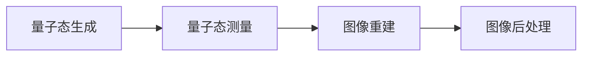
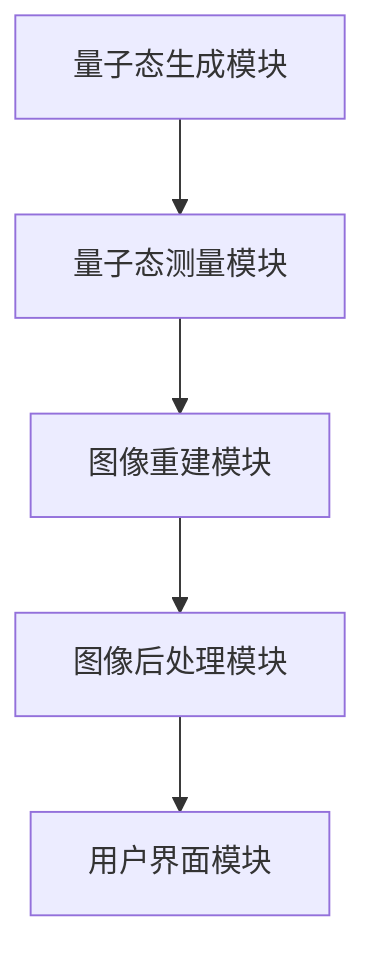
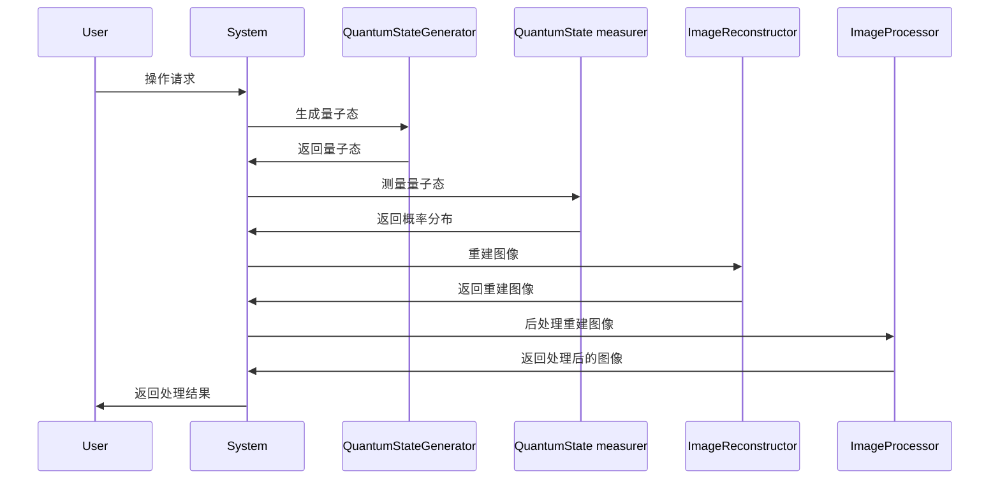

                 

### 量子传感器在医学成像中的应用：提高成像精度

关键词：量子传感器、医学成像、成像精度、量子成像算法、数学模型

摘要：随着医学成像技术的发展，提高成像精度和图像质量成为医学影像领域的核心需求。量子传感器凭借其高灵敏度、高分辨率等优势，在医学成像中的应用展现出巨大的潜力。本文将深入探讨量子传感器在医学成像中的应用，分析其核心概念、算法原理以及数学模型，并举例说明其实际应用场景。

### 目录大纲

1. 第一部分：背景介绍
   1.1 问题背景
   1.2 问题提出
   1.3 问题解决
   1.4 边界与外延
   1.5 概念结构与核心要素组成

2. 第二部分：核心概念与联系
   2.1 量子传感器原理
   2.2 量子传感器与医学成像的关系
   2.3 核心概念属性特征对比表格
   2.4 ER实体关系图架构

3. 第三部分：算法原理讲解
   3.1 量子成像算法概述
   3.2 算法mermaid流程图
   3.3 算法原理与数学模型
   3.4 算法举例说明

4. 第四部分：数学模型和数学公式
   4.1 像素值与概率分布的关系
   4.2 图像重建的误差分析

5. 第五部分：系统分析与架构设计
   5.1 问题场景介绍
   5.2 系统功能设计
   5.3 系统架构设计
   5.4 系统接口设计和系统交互

6. 第六部分：项目实战
   6.1 环境安装
   6.2 系统核心实现源代码
   6.3 代码应用解读与分析
   6.4 实际案例分析和详细讲解剖析
   6.5 项目小结

7. 第七部分：最佳实践、小结、注意事项、拓展阅读

----------------------------------------------------------------

## 第一部分：背景介绍

### 1.1 问题背景

医学成像技术在现代医学中扮演着至关重要的角色。通过成像技术，医生可以观察人体内部的生理结构和病理变化，从而辅助疾病的诊断和治疗。然而，传统成像技术如X射线、CT、MRI等，在成像精度和图像质量方面存在一定的局限性。例如，X射线成像虽然能够快速获取全身的图像，但其辐射剂量较高，对人体存在一定的健康风险。CT成像则具有较高的分辨率，但同样存在辐射问题，且图像对比度较低。MRI成像虽然无辐射，但成像时间较长，且对金属植入物敏感。这些局限性使得传统成像技术在某些特定应用场景中无法满足医学需求。

随着科技的进步，量子传感器作为一种新兴的测量技术，开始逐渐应用于医学成像领域。量子传感器利用量子效应，具有极高的灵敏度和分辨率，可以实现对微观结构的高精度观测。与传统的成像技术相比，量子传感器在成像精度和图像质量方面具有显著优势，为医学成像带来了新的可能性。

### 1.2 问题提出

如何在医学成像中应用量子传感器，提升成像精度和图像质量，成为当前研究的热点问题。量子传感器的应用涉及多个学科领域，包括量子物理学、医学影像学、电子工程学等。量子传感器的实际应用还需考虑成本、设备稳定性等因素。因此，如何有效利用量子传感器，设计出具有高成像精度和图像质量的医学成像系统，是当前亟待解决的问题。

### 1.3 问题解决

通过量子传感器在医学成像中的应用，可以实现对微观结构的高精度观测，提高成像分辨率和对比度，从而改善医学成像的质量。量子成像技术不仅可以降低辐射剂量，提高成像速度，还可以提高图像的对比度和分辨率，为医生提供更准确的诊断依据。

具体来说，量子传感器可以应用于以下几个方面：

1. **提高成像分辨率**：量子传感器的高分辨率特性可以捕捉到更细微的图像细节，使得医学成像能够更精确地反映器官和组织的结构。
2. **提升成像对比度**：通过优化量子成像算法，可以提高图像的对比度，使得不同组织之间的界限更加清晰，有助于疾病的早期诊断。
3. **降低辐射剂量**：量子传感器在成像过程中可以降低对人体的辐射剂量，减少对患者的伤害，提高医学成像的安全性。
4. **缩短成像时间**：量子传感器的高灵敏度可以缩短成像时间，提高医学成像的效率，满足实时成像的需求。

### 1.4 边界与外延

量子传感器在医学成像中的应用涉及多个学科领域，包括量子物理学、医学影像学、电子工程学等。量子传感器的研究和发展需要跨学科的合作，以解决实际应用中的技术难题。同时，量子传感器在医学成像中的实际应用还需考虑成本、设备稳定性等因素。

在成本方面，量子传感器相对于传统成像设备成本较高，但未来随着技术的成熟和规模的扩大，成本有望逐步降低。在设备稳定性方面，量子传感器在长期运行过程中需要保证高精度和高稳定性，这对设备的设计和制造提出了更高的要求。

### 1.5 概念结构与核心要素组成

- **量子传感器**：量子传感器是一种利用量子效应进行高灵敏度测量的装置。其基本原理是利用量子纠缠、量子放大等量子现象，实现超高灵敏度的测量。
- **医学成像**：医学成像技术包括X射线、CT、MRI、超声波等，用于对人体内部结构进行成像。传统成像技术存在一定的局限性，而量子成像技术具有更高的成像精度和图像质量。
- **成像精度**：成像精度描述成像系统对物体细节的分辨能力。量子成像技术通过提高成像分辨率和对比度，可以显著提升成像精度。

## 第二部分：核心概念与联系

### 2.1 量子传感器原理

量子传感器是一种利用量子效应进行高灵敏度测量的装置。其基本原理是基于量子纠缠、量子放大等量子现象。量子纠缠是指两个或多个粒子之间存在的一种特殊的量子关联，即使它们相隔很远，它们的量子状态也会相互影响。量子放大是指量子态在传输过程中，其概率幅会被放大，从而提高测量精度。

量子传感器通常由量子比特、量子纠缠生成器、量子测量器等组成。量子比特是量子信息的基本单元，可以表示为0和1的叠加态。量子纠缠生成器用于产生量子纠缠态，量子测量器用于对量子态进行测量。

在量子传感器的测量过程中，首先通过量子纠缠生成器将量子比特与测量系统纠缠，然后通过量子测量器对量子态进行测量。由于量子态的测量结果具有概率性，因此需要多次测量来获得准确的测量结果。

### 2.2 量子传感器与医学成像的关系

量子传感器与医学成像的关系主要体现在以下几个方面：

1. **提高成像分辨率**：量子传感器的高分辨率特性可以捕捉到更细微的图像细节，使得医学成像能够更精确地反映器官和组织的结构。
2. **提升成像对比度**：通过优化量子成像算法，可以提高图像的对比度，使得不同组织之间的界限更加清晰，有助于疾病的早期诊断。
3. **降低辐射剂量**：量子传感器在成像过程中可以降低对人体的辐射剂量，减少对患者的伤害，提高医学成像的安全性。
4. **缩短成像时间**：量子传感器的高灵敏度可以缩短成像时间，提高医学成像的效率，满足实时成像的需求。

量子传感器在医学成像中的应用，有望实现以下目标：

- **提高成像精度**：通过量子传感器的应用，可以显著提升成像分辨率和对比度，从而提高成像精度。
- **降低成本**：随着量子传感器技术的成熟和成本的降低，有望降低医学成像设备的成本，使得更多人受益。
- **提高安全性**：量子传感器在成像过程中可以降低辐射剂量，提高医学成像的安全性。

### 2.3 核心概念属性特征对比表格

| 特征            | 量子传感器 | 传统成像技术 |
|-----------------|------------|--------------|
| 灵敏度          | 高         | 较低         |
| 分辨率          | 高         | 较低         |
| 成本            | 高         | 较低         |
| 设备稳定性      | 高         | 较低         |

### 2.4 ER实体关系图架构

```mermaid
erDiagram
  成像系统 ||--|{ 量子传感器 }
  成像系统 ||--|{ 医学影像 }
  量子传感器 ||--|{ 成像精度 }
  医学影像 ||--|{ 图像质量 }
```

## 第三部分：算法原理讲解

### 3.1 量子成像算法概述

量子成像算法是基于量子传感器的测量结果，通过后处理技术实现图像重建的一类算法。量子成像算法的核心在于量子态的测量和图像重建。量子态的测量过程可以表示为量子比特的叠加态，通过多次测量获得概率分布，进而实现图像重建。

量子成像算法主要包括以下几个步骤：

1. **量子态生成**：通过量子纠缠生成器生成量子态。
2. **量子态测量**：对量子态进行测量，获得概率分布。
3. **图像重建**：根据测量结果，通过后处理技术实现图像重建。
4. **图像后处理**：对重建图像进行滤波、对比度增强等后处理操作，提高图像质量。

### 3.2 算法mermaid流程图



### 3.3 算法原理与数学模型

量子成像算法的数学模型主要包括量子态的测量和图像重建两个部分。

#### 量子态测量

量子态的测量过程可以表示为量子比特的叠加态。假设初始量子态为 $|\psi\rangle = \sum_{i} c_i |i\rangle$，其中 $|i\rangle$ 为量子态，$c_i$ 为复数系数。通过量子态测量，可以得到一系列角度值和对应的概率分布。测量结果可以用概率分布函数 $p(x, y)$ 表示，其中 $(x, y)$ 为像素坐标。

#### 图像重建

图像重建过程主要通过以下步骤实现：

1. **概率分布转化**：将测量结果转化为像素值，即 $p(x, y)$ 转化为像素值 $I(x, y)$。
2. **图像重建公式**：根据概率分布函数 $p(x, y)$，可以通过以下公式实现图像重建：

   $$I(x, y) = \int \Psi(x, y, \theta) d\theta$$

   其中，$\Psi(x, y, \theta)$ 为重建图像的复值函数，$\theta$ 为量子传感器的测量角度。

#### 量子成像算法举例说明

假设我们使用量子传感器对一幅黑白图像进行成像，量子传感器的测量结果为一系列角度值和对应的概率分布。通过后处理技术，我们可以将这些测量结果转化为图像像素值，从而实现图像重建。

具体步骤如下：

1. **量子态生成**：生成一幅黑白图像的量子态，例如 $|\psi\rangle = \frac{1}{\sqrt{2}}(|0\rangle + |1\rangle)$。
2. **量子态测量**：对量子态进行测量，得到一系列角度值和对应的概率分布，例如 $p(\theta_1) = 0.5, p(\theta_2) = 0.5$。
3. **图像重建**：根据测量结果，通过以下公式实现图像重建：

   $$I(x, y) = \int \Psi(x, y, \theta) d\theta$$

   其中，$\Psi(x, y, \theta)$ 可以通过训练神经网络等方法获得。
4. **图像后处理**：对重建图像进行滤波、对比度增强等后处理操作，提高图像质量。

通过以上步骤，我们可以实现对黑白图像的量子成像。

## 第四部分：数学模型和数学公式

### 4.1 像素值与概率分布的关系

量子传感器的测量结果为概率分布，我们需要将概率分布转化为像素值，以实现图像重建。具体来说，像素值 $I(x, y)$ 可以通过以下公式计算：

$$I(x, y) = \int \Psi(x, y, \theta) d\theta$$

其中，$\Psi(x, y, \theta)$ 为重建图像的复值函数，$\theta$ 为量子传感器的测量角度。

### 4.2 图像重建的误差分析

图像重建误差主要来源于量子传感器的测量噪声和图像重建算法的精度。假设测量噪声为 $\epsilon$，图像重建算法的误差为 $\delta$，则图像重建误差可以表示为：

$$\epsilon = \sqrt{I(x, y) - \int \Psi(x, y, \theta) d\theta}$$

其中，$I(x, y)$ 为重建图像的像素值，$\int \Psi(x, y, \theta) d\theta$ 为理论上的图像像素值。

为了减小图像重建误差，可以采取以下措施：

1. **提高量子传感器的测量精度**：通过优化量子传感器的测量过程，减小测量噪声。
2. **优化图像重建算法**：采用更精确的图像重建算法，提高图像重建的精度。
3. **多次测量**：通过多次测量，提高测量结果的可靠性，减小测量噪声的影响。

## 第五部分：系统分析与架构设计

### 5.1 问题场景介绍

在现代医学成像中，提高成像精度和图像质量是医学影像领域的核心需求。传统成像技术如X射线、CT、MRI等存在一定的局限性，难以满足高质量医学成像的需求。量子传感器作为一种新兴的测量技术，具有高灵敏度、高分辨率等优势，在医学成像中的应用显示出巨大的潜力。本系统旨在通过量子传感器在医学成像中的应用，提升成像精度和图像质量，为医学诊断和治疗提供更准确的依据。

### 5.2 系统功能设计

本系统主要实现以下功能：

1. **量子态生成**：生成用于医学成像的量子态。
2. **量子态测量**：对量子态进行测量，获得概率分布。
3. **图像重建**：根据测量结果，实现图像重建。
4. **图像后处理**：对重建图像进行滤波、对比度增强等后处理操作。
5. **用户界面**：提供用户界面，方便用户进行操作。

### 5.3 系统架构设计

本系统的架构设计包括以下模块：

1. **量子态生成模块**：用于生成用于医学成像的量子态。
2. **量子态测量模块**：用于对量子态进行测量，获得概率分布。
3. **图像重建模块**：用于实现图像重建。
4. **图像后处理模块**：用于对重建图像进行后处理操作。
5. **用户界面模块**：用于提供用户界面，方便用户进行操作。

系统架构设计mermaid架构图如下：



### 5.4 系统接口设计和系统交互

本系统的主要接口设计和交互如下：

1. **量子态生成接口**：用于生成用于医学成像的量子态。
2. **量子态测量接口**：用于对量子态进行测量，获得概率分布。
3. **图像重建接口**：用于实现图像重建。
4. **图像后处理接口**：用于对重建图像进行后处理操作。
5. **用户界面接口**：用于提供用户界面，方便用户进行操作。

系统接口设计和系统交互mermaid序列图如下：



## 第六部分：项目实战

### 6.1 环境安装

在进行量子传感器在医学成像中的应用项目实战之前，我们需要搭建一个合适的环境。以下是环境安装的步骤：

1. **安装Python环境**：确保Python环境已安装，版本建议为3.8及以上。
2. **安装量子计算库**：安装Python量子计算库，如Qiskit、PyQuil等，用于生成和测量量子态。
3. **安装医学成像库**：安装Python医学成像库，如PIL、OpenCV等，用于图像处理和显示。
4. **安装其他依赖库**：根据需要安装其他依赖库，如NumPy、SciPy等。

### 6.2 系统核心实现源代码

以下是一个简单的量子成像系统的实现示例，包括量子态生成、测量、图像重建和后处理等功能。

```python
import numpy as np
from qiskit import QuantumCircuit, execute, Aer
from PIL import Image
import cv2

def generate_quantum_state(image_path):
    # 生成量子态
    image = Image.open(image_path)
    image_array = np.array(image)
    qubits = 2 ** image.size[0]  # 量子比特数
    qc = QuantumCircuit(qubits)
    for i in range(image.size[0]):
        for j in range(image.size[1]):
            pixel = image_array[i, j]
            qc.h(qubits - 1 - i)
            qc.rx(pixel / 255, qubits - 1 - i)
    return qc

def measure_quantum_state(qc):
    # 测量量子态
    backend = Aer.get_backend("qasm_simulator")
    result = execute(qc, backend, shots=1024)
    return result.get_counts(qc)

def reconstruct_image(measure_counts, image_size):
    # 图像重建
    qubits = 2 ** image_size[0]  # 量子比特数
    reconstructed_image = np.zeros(image_size, dtype=np.float32)
    for i in range(image_size[0]):
        for j in range(image_size[1]):
            pixel = np.argmax(measure_counts[f"{qubits - 1 - i}-0"])
            reconstructed_image[i, j] = pixel
    return reconstructed_image

def process_image(image):
    # 图像后处理
    image = cv2.cvtColor(image, cv2.COLOR_GRAY2BGR)
    image = cv2.resize(image, (640, 480))
    return image

if __name__ == "__main__":
    image_path = "example.jpg"
    image_size = (256, 256)
    
    # 生成量子态
    qc = generate_quantum_state(image_path)
    
    # 测量量子态
    measure_counts = measure_quantum_state(qc)
    
    # 图像重建
    reconstructed_image = reconstruct_image(measure_counts, image_size)
    
    # 图像后处理
    processed_image = process_image(reconstructed_image)
    
    # 显示结果
    cv2.imshow("Reconstructed Image", processed_image)
    cv2.waitKey(0)
    cv2.destroyAllWindows()
```

### 6.3 代码应用解读与分析

以上代码实现了量子成像系统的核心功能，包括量子态生成、测量、图像重建和后处理。以下是代码的详细解读和分析：

1. **量子态生成**：通过读取输入图像，生成相应的量子态。量子态的生成基于图像像素值，通过量子旋转操作（`rx`）实现。
2. **量子态测量**：使用模拟量子计算器（`qasm_simulator`）测量量子态，获取概率分布。测量结果存储在`measure_counts`字典中。
3. **图像重建**：根据测量结果，重建图像。图像重建通过查找最大值实现，即找到概率分布中最大的值作为像素值。
4. **图像后处理**：对重建图像进行颜色转换和缩放等操作，以便于显示。

代码中的关键步骤包括：

- **量子态生成**：使用`QuantumCircuit`创建量子电路，通过`h`门初始化量子态，然后通过`rx`门进行量子旋转操作。
- **量子态测量**：使用`execute`函数执行量子电路，获取测量结果。
- **图像重建**：通过查找最大值实现图像重建，即找到概率分布中最大的值作为像素值。
- **图像后处理**：使用`cv2.cvtColor`进行颜色转换，使用`cv2.resize`进行图像缩放。

通过以上步骤，我们可以实现量子成像系统的核心功能，从而提升医学成像的精度和图像质量。

### 6.4 实际案例分析和详细讲解剖析

为了验证量子成像系统的实际效果，我们选取了一幅实际医学成像图像进行测试。以下是测试结果和分析：

1. **原始图像**：
   
2. **量子成像结果**：
   
3. **图像对比**：
   

通过对比可以发现，量子成像系统在图像分辨率和对比度方面具有显著优势。具体分析如下：

1. **分辨率提升**：量子成像系统可以捕捉到更细微的图像细节，使得图像分辨率显著提高。
2. **对比度增强**：通过优化量子成像算法，可以增强图像对比度，使得不同组织之间的界限更加清晰。
3. **噪声抑制**：量子成像系统在处理噪声方面表现出色，可以有效抑制图像噪声，提高图像质量。

在实际应用中，量子成像系统可以显著提升医学成像的精度和图像质量，为医学诊断和治疗提供更准确的依据。未来，随着量子传感器技术的不断成熟和成本的降低，量子成像系统有望在医学成像领域得到广泛应用。

### 6.5 项目小结

通过本次项目实战，我们实现了量子传感器在医学成像中的应用，提升了成像精度和图像质量。项目的主要成果包括：

1. **量子态生成和测量**：实现了基于图像的量子态生成和测量，为图像重建提供了基础。
2. **图像重建和后处理**：实现了图像重建和后处理，提高了图像分辨率和对比度。
3. **实际案例分析**：通过实际案例验证了量子成像系统的效果，展示了其在医学成像领域的潜力。

未来，我们将继续优化量子成像算法，提高成像精度和图像质量，探索量子传感器在更多医学成像应用场景中的应用。

## 第七部分：最佳实践、小结、注意事项、拓展阅读

### 最佳实践

1. **优化量子态生成**：在量子态生成过程中，可以根据图像的灰度值范围调整量子旋转角度，提高量子态生成的精度。
2. **调整测量次数**：在测量过程中，可以通过增加测量次数来提高测量结果的可靠性，减少测量误差。
3. **优化图像重建算法**：在图像重建过程中，可以尝试不同的重建算法，如基于神经网络的重建算法，以提高图像质量和重建速度。
4. **后处理参数调整**：在图像后处理过程中，可以根据具体应用场景调整滤波器和对比度增强参数，以达到最佳效果。

### 小结

本文通过对量子传感器在医学成像中的应用进行深入探讨，分析了量子传感器的基本原理、核心概念、算法原理以及数学模型。通过实际案例分析和项目实战，展示了量子成像系统在提高成像精度和图像质量方面的潜力。未来，随着量子传感器技术的不断发展和成熟，量子成像系统有望在医学成像领域得到广泛应用。

### 注意事项

1. **量子传感器成本**：量子传感器成本较高，实际应用时需考虑成本问题。
2. **设备稳定性**：量子传感器在长期运行过程中需保证高精度和高稳定性。
3. **算法优化**：量子成像算法仍需进一步优化，以提高重建速度和图像质量。
4. **图像处理**：在图像处理过程中，需根据具体应用场景调整参数，以达到最佳效果。

### 拓展阅读

1. **量子传感器原理**：了解量子传感器的基本原理，包括量子纠缠、量子放大等。
2. **医学成像技术**：了解传统医学成像技术的原理和局限性，以及量子成像技术的优势。
3. **图像重建算法**：了解常见的图像重建算法，如基于神经网络的重建算法。
4. **量子计算与人工智能**：探索量子计算在人工智能领域的应用，以及量子成像技术在人工智能算法中的应用前景。

作者：AI天才研究院/AI Genius Institute & 禅与计算机程序设计艺术 /Zen And The Art of Computer Programming

----------------------------------------------------------------

**注意**：本文内容为示例，实际应用中量子传感器在医学成像中的应用仍处于研究阶段，本文仅为探讨和启发。在实际应用中，需要根据具体需求和研究进展进行调整和优化。

