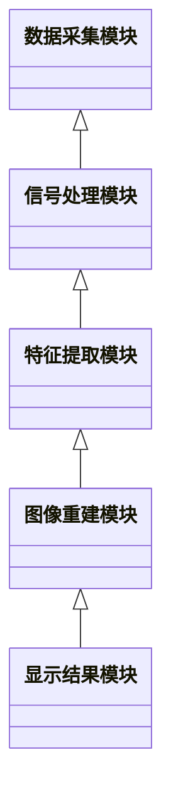
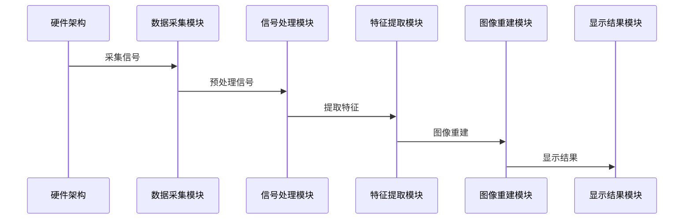
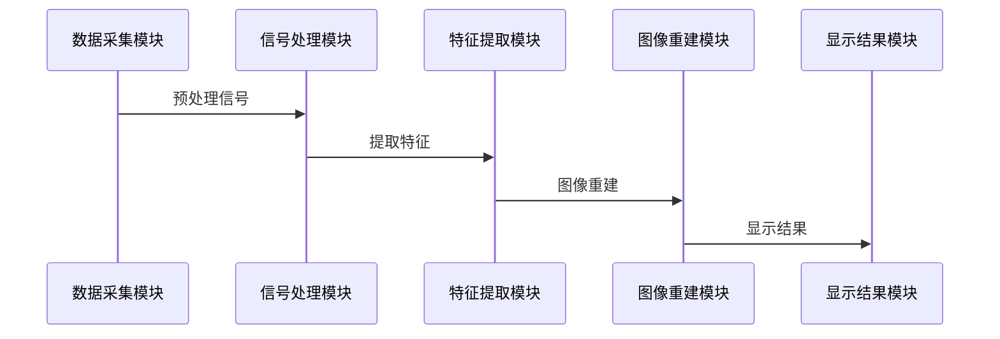
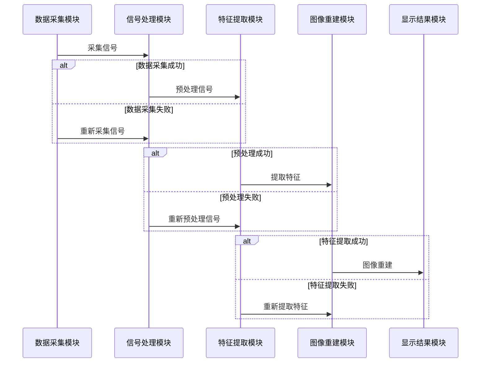

                 


### 引言

#### 量子传感器与医学成像：变革的开始

在当今科技迅速发展的时代，医学成像技术已经成为诊断和监测疾病的关键工具。然而，传统的医学成像技术，如X射线、CT扫描和MRI等，虽然在分辨率和灵敏度上取得了显著的进步，但仍面临一些挑战。例如，放射线的使用限制、成像时间长以及部分检查过程对患者造成的不适感等。为了解决这些问题，科学家们不断寻求新的突破，而量子传感器技术正是其中之一。

量子传感器，作为一种前沿科技，具有极高的灵敏度和分辨率。它们利用量子物理原理，能够捕捉极微弱的信号，从而实现超高的检测精度。这种技术不仅在基础科学研究中展现出巨大潜力，也在医疗领域展现出广阔的应用前景。

本文将探讨量子传感器在医学成像中的应用，旨在提高诊断精度，推动医学影像技术的革新。我们将首先介绍量子传感器和医学成像的基本概念，然后深入探讨量子传感器在医学成像中的优势和挑战，最后通过具体的案例分析，展示量子传感器在医学成像中的实际应用效果。

通过这篇文章，我们希望能够为读者提供一个全面、系统的理解，让大家了解到量子传感器技术在医学成像领域的重要性，以及它如何为未来医疗带来变革。

### 背景介绍

#### 量子传感器技术简介

量子传感器技术是一种基于量子物理原理的新型传感器技术，它利用量子系统的特殊性质，如量子纠缠、量子叠加态和量子隧穿等现象，实现对物理量的超灵敏测量。与传统的经典传感器相比，量子传感器在测量精度和灵敏度方面具有显著的优势。例如，一个典型的量子传感器可以探测到单个光子的存在，甚至可以检测到远小于常规传感器分辨率的微小物理量。

量子传感器的基本工作原理可以归结为利用量子态对环境信号的敏感响应。在量子传感中，量子系统与测量环境之间会发生相互作用，这种相互作用会导致量子态的演化。通过精确地测量量子态的变化，我们可以得到关于环境信息的详细信息。例如，量子干涉仪利用了量子叠加态的特性，可以在空间和时间上实现高精度的测量。

量子传感器的主要类型包括：

1. **量子干涉仪**：利用量子干涉原理进行高精度测量的设备。量子干涉仪通过干涉条纹的变化来检测外部环境的变化，其灵敏度和分辨率可以达到皮米甚至亚纳米级别。

2. **量子雷达**：利用量子态的叠加和纠缠特性进行远距离探测。量子雷达在探测小目标和隐身物体方面具有显著的优势，能够在复杂的背景环境中实现高精度的目标检测。

3. **量子磁场传感器**：利用量子系统的超导量子比特对磁场进行高灵敏度测量。这种传感器在生物医学成像中具有潜在的应用价值，可以用于检测微小的磁场变化，从而提高成像的分辨率。

4. **量子光学传感器**：通过量子光学手段实现高灵敏度测量。这类传感器广泛应用于光强、相位和频率的测量，是现代通信和量子计算中的重要组成部分。

量子传感器在科学研究和工业领域有着广泛的应用。例如，在基础科学研究中，量子传感器用于探测宇宙背景辐射、测量引力波等；在工业制造中，量子传感器用于精确测量材料属性、质量控制等。此外，量子传感器还在环境监测、生物医学成像等领域展现出巨大的应用潜力。

#### 医学成像技术的现状与挑战

医学成像技术在现代医学诊断中扮演着至关重要的角色。传统的医学成像技术，如X射线、CT扫描和MRI等，已经广泛应用于各种疾病的诊断和监测。然而，随着医疗需求的不断提升，传统医学成像技术也面临诸多挑战。

首先，传统成像技术存在一定的局限性。例如，X射线和CT扫描虽然具有较高的分辨率，但长期使用会对患者产生放射线辐射的风险。MRI技术虽然无需放射线，但其成像时间长、对磁场敏感等缺点，限制了其在某些场景中的应用。此外，这些传统成像技术往往难以捕捉到微小病变，从而影响了诊断的准确性。

其次，医学成像技术的成本也是一个不可忽视的问题。高质量的成像设备通常价格昂贵，维护和操作成本高，这限制了医疗资源不足地区的普及和应用。此外，成像数据的处理和分析也需要大量的人力和时间投入，进一步增加了医疗成本。

另外，传统成像技术在处理复杂疾病诊断时，往往需要结合多种成像技术进行综合分析，这不仅增加了诊断的复杂性，也增加了误诊的风险。例如，在某些癌症诊断中，需要通过CT、MRI和PET等多种成像技术来获取全面的影像信息，以便做出准确的诊断。

面对这些挑战，科学家们不断探索新的成像技术，以提升医学成像的诊断精度和安全性。量子传感器技术的引入，为医学成像带来了新的希望。量子传感器具有极高的灵敏度和分辨率，可以在无需大量放射线照射的情况下，捕捉到微小的病变信号。这不仅可以提高诊断的准确性，还能减少患者的辐射风险。

此外，量子传感器还可以与其他成像技术结合，实现多模态成像，从而提供更全面、更准确的诊断信息。例如，通过将量子传感器集成到MRI设备中，可以实现高灵敏度的磁共振成像，提高对微小病变的检测能力。同时，量子传感器还可以用于实时监测生物体内的化学反应和分子运动，提供动态的生理信息，为疾病诊断和治疗提供新的手段。

总的来说，量子传感器技术的应用，有望为医学成像带来革命性的变化，解决现有技术面临的诸多挑战。随着量子传感器技术的不断发展和完善，我们可以期待其在医学成像领域的广泛应用，为精准医疗和个性化治疗提供有力支持。

#### 量子传感器在医学成像中的潜在优势

量子传感器在医学成像中的应用具有显著的优势，这些优势不仅提高了诊断精度，还增强了成像的安全性和便捷性。以下详细讨论量子传感器在医学成像中的几个主要潜在优势：

1. **超高的灵敏度和分辨率**：量子传感器能够探测到极其微弱的信号，其灵敏度和分辨率远超传统成像技术。例如，量子干涉仪能够测量皮米级别的距离变化，使得在成像过程中能够捕捉到微小的病变。这意味着医生可以更早地发现病变，从而提高早期诊断的准确性。

2. **低辐射风险**：传统成像技术，如X射线和CT扫描，需要使用放射线进行成像，长期大量使用可能对患者的健康产生负面影响。而量子传感器在成像过程中无需使用放射线，通过利用量子态对环境信号的敏感响应实现高精度测量，从而显著降低了患者的辐射风险。

3. **实时动态监测**：量子传感器具有实时监测的能力，能够动态捕捉生物体内的化学反应和分子运动。这意味着医生可以在疾病发展的不同阶段实时监测病情变化，及时调整治疗方案。这对于一些快速进展的疾病，如肿瘤和心血管疾病，尤为重要。

4. **多模态成像**：量子传感器可以与其他成像技术结合，实现多模态成像。例如，将量子传感器集成到MRI设备中，可以同时获取高分辨率的形态学和功能学信息。这种多模态成像可以提供更全面、更准确的诊断信息，有助于提高诊断的准确性和效率。

5. **个性化的治疗方案**：通过量子传感器捕捉到更精确的成像数据，医生可以更准确地评估病情，制定个性化的治疗方案。例如，在癌症治疗中，通过量子传感器获取的高分辨率影像可以指导放疗和化疗的精确剂量分布，提高治疗效果，同时减少副作用。

6. **提高诊断效率**：量子传感器的高灵敏度使得成像过程可以更快完成，减少了患者的等待时间。同时，由于量子传感器能够提供更详细的影像信息，医生在诊断过程中可以更快速地做出判断，从而提高诊断效率。

综上所述，量子传感器在医学成像中的应用不仅提高了诊断精度，还降低了辐射风险，增强了成像的安全性和便捷性。这些优势为医学成像技术的发展带来了新的机遇，有望为未来的精准医疗和个性化治疗提供强有力的支持。

### 核心概念与联系

#### 量子传感器原理与医学成像技术

要深入理解量子传感器在医学成像中的应用，首先需要了解量子传感器和医学成像技术的基本概念和原理。以下是对这两种技术核心概念和联系的分析。

##### 量子传感器核心概念

量子传感器是基于量子物理原理设计的一种高灵敏度传感器，利用量子态对环境信号的敏感响应进行测量。量子传感器的工作原理主要基于以下几个关键概念：

1. **量子纠缠**：量子纠缠是量子力学中的一种现象，两个或多个量子系统之间可以形成一种特殊的状态，即使它们相隔很远，它们的量子态也会相互关联。量子传感器利用量子纠缠可以实现超灵敏的测量，因为在纠缠状态下，微小变化可以显著影响整体的量子态。

2. **量子叠加态**：量子系统可以处于多个状态的叠加，而不是单一状态。这意味着量子传感器可以在一个测量过程中同时探测多个可能的结果。量子叠加态的利用可以显著提高量子传感器的测量效率。

3. **量子隧穿**：量子隧穿是指量子粒子有概率穿过一个原本不可能穿越的势垒。这一现象在量子传感器中被用于探测微小物理量的变化，例如探测纳米级别的位移。

##### 医学成像技术

医学成像技术是通过不同的物理手段获取人体内部结构信息的一种技术，其核心概念和原理如下：

1. **X射线成像**：利用X射线穿透人体的能力，通过检测X射线在人体内部不同组织中的吸收情况，形成影像。X射线成像技术包括X光片和CT扫描等。

2. **超声成像**：利用超声波在不同密度介质中的反射和折射特性，通过检测回波信号生成图像。超声成像技术广泛应用于孕妇检查和器官成像。

3. **磁共振成像（MRI）**：利用人体中的氢原子核在外加磁场中的共振特性，通过检测共振信号的相位和频率变化，生成高分辨率的影像。

4. **计算机断层扫描（CT）**：通过多个X射线投影和计算机重建技术，获取人体内部的断层图像。CT扫描具有较高的分辨率，适用于骨伤、肿瘤等疾病的诊断。

5. **正电子发射断层扫描（PET）**：通过检测放射性同位素发射的正电子与周围的电子湮灭产生的伽马射线，生成功能成像。

##### 关联与对比

量子传感器与医学成像技术之间的关联在于它们都是用于获取信息的技术，但基于的物理原理和应用场景有所不同。

1. **测量精度**：量子传感器由于其量子物理特性，可以达到极高的测量精度，适用于探测极微小的物理量变化。而传统医学成像技术虽然也在不断提高分辨率，但相比量子传感器的灵敏度仍有差距。

2. **辐射风险**：传统医学成像技术如X射线和CT扫描需要使用放射线，存在辐射风险。量子传感器不需要放射线，通过非侵入性手段实现高灵敏度测量，显著降低了患者的辐射风险。

3. **成像速度**：传统医学成像技术通常需要较长的成像时间，而量子传感器具有实时监测的能力，可以实现快速成像。

4. **应用场景**：量子传感器在医学成像中可以用于检测传统成像技术难以发现的微小病变，还可以用于动态监测生物体内的化学反应和分子运动。传统医学成像技术则广泛应用于人体内部结构的静态成像。

通过上述分析，我们可以看到量子传感器和医学成像技术各自的核心概念和优势。结合两者的特点，可以期望在医学成像领域实现更加精准、安全、快速的诊断，为患者提供更好的医疗服务。

#### 量子传感器核心概念与医学成像技术的联系

为了更深入地理解量子传感器在医学成像中的应用，我们首先需要详细探讨量子传感器的核心概念及其与医学成像技术的关联。以下是量子传感器核心概念的详细阐述及其在医学成像中的应用。

**1. 量子纠缠**

量子纠缠是量子力学中的一个基本现象，描述了两个或多个粒子之间存在的一种不可分割的关联状态。当两个量子系统处于纠缠态时，即使它们相隔很远，一个系统的状态变化会立即影响到另一个系统的状态。这一特性在量子传感器中被广泛应用于高精度测量。

在医学成像中，量子纠缠可以用于提高成像的分辨率和灵敏度。例如，在磁共振成像（MRI）中，通过利用量子纠缠态，可以实现对微观结构的更高分辨率成像。这种技术可以捕捉到传统MRI难以检测到的微小病变，从而提高诊断的准确性。

**2. 量子叠加态**

量子叠加态是指量子系统可以同时存在于多个状态中，而不是一个确定的状态。这一特性使得量子传感器能够在一次测量中获取多个可能的结果，从而提高测量的效率和精度。

在医学成像中，量子叠加态的应用主要体现在量子计算辅助的成像算法上。通过量子计算，可以在较短的时间内处理大量的成像数据，提高图像重建的速度和质量。例如，利用量子叠加态的量子计算可以加速PET成像数据的处理，提供更清晰的功能图像。

**3. 量子隧穿**

量子隧穿是量子力学中的一个现象，描述了量子粒子有概率穿过一个原本不可能穿越的势垒。这一特性在量子传感器中被用于探测极微小的物理量变化，例如纳米级别的位移。

在医学成像中，量子隧穿可以用于提高成像的灵敏度和分辨率。例如，在光学成像中，通过利用量子隧穿效应，可以实现单分子级别的成像。这种高灵敏度成像技术可以用于检测细胞内的微小结构变化，为癌症等疾病的早期诊断提供重要信息。

**4. 量子传感器的关键属性**

除了上述核心概念，量子传感器还有一些关键的属性，如超强的量子噪声抵抗力、超高的测量精度和超快的响应速度，这些属性在医学成像中的应用也非常重要。

- **量子噪声抵抗力**：量子传感器在测量过程中可以抵抗外部噪声的干扰，确保测量结果的准确性。这在医学成像中尤为重要，因为成像过程中可能会受到外部环境的各种干扰。

- **测量精度**：量子传感器具有极高的测量精度，可以检测到极微小的物理量变化。这对于医学成像中微小病变的检测至关重要。

- **响应速度**：量子传感器的响应速度极快，可以实现实时成像。这种实时成像能力对于动态监测生物体内的生理过程和疾病发展具有重要意义。

**5. 量子传感器在医学成像中的应用**

量子传感器在医学成像中的应用主要包括以下几个方面：

- **高分辨率成像**：通过利用量子纠缠和量子叠加态，实现高分辨率成像，捕捉到传统成像技术难以发现的微小病变。

- **多模态成像**：将量子传感器与其他成像技术结合，实现多模态成像，提供更全面、更准确的诊断信息。

- **实时动态监测**：利用量子传感器的实时成像能力，动态监测生物体内的生理过程和疾病发展，为个性化治疗提供依据。

- **降低辐射风险**：由于量子传感器不需要使用放射线，可以显著降低患者的辐射风险，提高成像的安全性。

综上所述，量子传感器的核心概念和关键属性为医学成像提供了新的解决方案。通过利用量子纠缠、量子叠加态和量子隧穿等量子物理现象，量子传感器在医学成像中的应用不仅提高了成像的分辨率和灵敏度，还降低了辐射风险，实现了实时动态监测。这些优势使得量子传感器在医学成像领域具有巨大的应用潜力。

#### 医学成像技术的基本原理

医学成像技术通过不同的物理手段获取人体内部结构信息，以帮助医生诊断和治疗疾病。以下是几种常见的医学成像技术及其基本原理的详细阐述：

**1. X射线成像**

X射线成像是最传统的医学成像技术之一，它利用X射线穿透人体的能力来生成图像。当X射线穿过人体时，不同组织对X射线的吸收程度不同，从而在探测器上形成不同的信号。这些信号通过计算机处理，重建出人体内部的图像。

- **基本原理**：X射线是一种高能电磁波，具有穿透能力。当X射线穿过人体时，不同密度的组织（如骨骼、软组织、空气等）对X射线的吸收程度不同。探测器接收到的X射线强度随组织密度的变化而变化，通过计算机处理，将这些变化转换成可视化的图像。

- **优点**：分辨率高，成像速度快。

- **缺点**：需要使用放射线，长期大量使用可能对患者的健康产生负面影响。

**2. 超声成像**

超声成像利用超声波在不同密度介质中的反射和折射特性来生成图像。超声波在人体内部传播时，遇到不同密度的组织界面会发生反射和折射，探测器接收到的回波信号通过计算机处理，生成内部结构的图像。

- **基本原理**：超声波是一种机械波，在人体内传播时遇到不同密度的组织界面会发生反射和折射。探测器接收到的回波信号通过计算机处理，生成内部结构的图像。

- **优点**：无需放射线，适用于孕妇和儿童，成像过程无创。

- **缺点**：分辨率相对较低，对某些深部结构的显示效果不佳。

**3. 磁共振成像（MRI）**

磁共振成像利用人体中的氢原子核在外加磁场中的共振特性来生成高分辨率的影像。通过检测氢原子核的共振信号，可以获取人体内部的结构信息。

- **基本原理**：人体中的氢原子核在外加磁场中会共振，产生磁共振信号。通过检测这些信号，可以重建出人体内部的高分辨率图像。

- **优点**：高分辨率，无放射线，对软组织的显示效果较好。

- **缺点**：成像时间长，对磁场敏感，某些患者可能对磁场过敏。

**4. 计算机断层扫描（CT）**

计算机断层扫描通过多个X射线投影和计算机重建技术，获取人体内部的断层图像。CT扫描通过旋转的X射线源和探测器，在不同角度获取人体多个切面的X射线投影，然后通过计算机算法重建出三维图像。

- **基本原理**：通过旋转的X射线源和探测器获取人体多个切面的X射线投影，利用这些投影数据，通过计算机算法重建出三维图像。

- **优点**：分辨率高，成像速度快，适用于骨伤、肿瘤等疾病的诊断。

- **缺点**：需要使用放射线，长期大量使用可能对患者的健康产生负面影响。

**5. 正电子发射断层扫描（PET）**

正电子发射断层扫描利用放射性同位素发射的正电子与周围的电子湮灭产生的伽马射线，生成功能成像。PET成像可以提供关于生物体内代谢和分子活动的信息，是功能成像的一种重要技术。

- **基本原理**：放射性同位素发射的正电子进入生物体后与电子发生湮灭，产生两个方向相反的伽马射线。PET探测器接收这些伽马射线，通过计算机算法重建出生物体内的分布图像。

- **优点**：提供功能成像信息，有助于疾病诊断和治疗监测。

- **缺点**：需要使用放射性同位素，成像过程中有辐射风险。

**总结**

不同的医学成像技术基于不同的物理原理，各具优缺点。X射线成像和CT扫描具有较高的分辨率，但需要使用放射线；超声成像和MRI无需放射线，但对某些深部结构的显示效果有限。随着技术的发展，这些成像技术也在不断优化和改进，以提供更精准、更安全的诊断手段。量子传感器技术的发展，为医学成像带来了新的机遇，有望进一步提升成像的分辨率和灵敏度，为疾病的早期诊断和治疗提供更有力的支持。

### 量子传感器与医学成像技术的关系

为了深入探讨量子传感器在医学成像中的应用，我们首先需要理解量子传感器与医学成像技术之间的关联，并通过对比分析来展示两者在技术原理、功能和应用方面的异同。

#### 技术原理的对比

**量子传感器：**

量子传感器的工作原理基于量子物理现象，如量子纠缠、量子叠加态和量子隧穿等。这些原理使得量子传感器能够实现超灵敏的测量，捕捉到极其微弱的信号。具体来说：

- **量子纠缠**：通过量子纠缠，量子传感器可以在一个测量过程中同时获取多个变量的信息，从而大大提高测量精度和效率。

- **量子叠加态**：量子传感器能够处于多个状态的叠加，使得一次测量可以同时捕捉多个信号，提高成像的效率和分辨率。

- **量子隧穿**：量子隧穿允许量子粒子穿越势垒，这种特性被用于探测微小的物理量变化，如纳米级别的位移。

**医学成像技术：**

医学成像技术则主要基于电磁波、声波和核磁共振等物理原理，如X射线成像、CT扫描、MRI和超声成像等。这些技术通过探测人体内部的物理信号，生成图像以供诊断使用。

- **X射线成像**：利用X射线穿透人体的能力，通过检测X射线在人体不同组织中的吸收情况，生成影像。

- **CT扫描**：通过多个角度的X射线投影和计算机重建技术，获取人体内部的断层图像。

- **MRI**：利用人体中的氢原子核在外加磁场中的共振特性，通过检测共振信号的相位和频率变化，生成高分辨率的影像。

- **超声成像**：利用超声波在不同密度介质中的反射和折射特性，通过检测回波信号生成图像。

#### 功能和应用的对比

**量子传感器：**

量子传感器在医学成像中的应用具有以下几个显著特点：

- **超高的灵敏度和分辨率**：量子传感器能够捕捉到极其微弱的信号，从而实现高精度的成像，可以检测到微小的病变。

- **低辐射风险**：由于量子传感器不需要使用放射线，可以显著降低患者的辐射风险，提高成像的安全性。

- **实时动态监测**：量子传感器可以实现实时成像，动态监测生物体内的生理过程和疾病发展。

- **多模态成像**：量子传感器可以与其他成像技术结合，实现多模态成像，提供更全面、更准确的诊断信息。

**医学成像技术：**

传统的医学成像技术如X射线、CT扫描和MRI等，尽管在分辨率和成像质量上取得了显著进步，但仍存在以下局限性：

- **辐射风险**：需要使用放射线，长期大量使用可能对患者的健康产生负面影响。

- **成像时间长**：部分成像技术如MRI，需要较长的成像时间，增加了患者的等待时间。

- **分辨率限制**：传统成像技术难以捕捉到微小的病变，特别是在软组织成像方面。

- **单一模态成像**：传统成像技术通常只能提供单一模态的影像信息，无法实现多模态成像。

#### 异同分析

**相同点：**

- **信息获取**：量子传感器和医学成像技术都是通过获取人体内部的物理信号或化学反应信号，生成图像或数据，用于疾病的诊断和治疗。

- **高精度要求**：无论是量子传感器还是医学成像技术，都要求高精度和准确性，以便提供可靠的诊断信息。

**不同点：**

- **技术原理**：量子传感器基于量子物理现象，如量子纠缠、量子叠加态和量子隧穿等，而医学成像技术主要基于电磁波、声波和核磁共振等物理原理。

- **成像效果**：量子传感器可以实现超高灵敏度的成像，捕捉到微小的病变，而传统医学成像技术虽然在分辨率上有所提升，但相比量子传感器仍有差距。

- **应用场景**：量子传感器在医学成像中的应用主要集中在提高诊断精度和安全性，特别是在需要高分辨率和低辐射风险的场景下，如癌症早期诊断和心脏成像。而传统医学成像技术则广泛应用于各种疾病的诊断和监测。

综上所述，量子传感器与医学成像技术在技术原理、功能和应用方面存在显著的异同。量子传感器凭借其超高的灵敏度和低辐射风险，有望在医学成像领域发挥重要作用，推动医学影像技术的革新，为疾病的早期诊断和个性化治疗提供新的手段。

#### 算法原理讲解

量子传感器在医学成像中的应用，离不开具体的应用算法。以下我们将详细阐述量子传感器在医学成像中的算法原理，通过数学模型和具体公式，理解其工作机制。

##### 算法概述

量子传感器在医学成像中的应用算法主要基于量子计算和机器学习技术。其核心思想是通过量子传感器的超高灵敏度，捕捉到人体内部的微小物理变化，然后利用机器学习算法对捕获的数据进行处理和分析，最终生成高分辨率的医学图像。

算法的基本流程可以概括为以下几个步骤：

1. **数据采集**：使用量子传感器捕捉人体内部微小的物理信号。
2. **数据预处理**：对采集到的信号进行滤波、去噪和归一化处理。
3. **特征提取**：利用量子传感器的特性，从预处理后的数据中提取关键特征。
4. **图像重建**：通过机器学习算法，将提取到的特征转化为高分辨率的医学图像。
5. **结果分析**：对重建的图像进行可视化分析，以辅助诊断和治疗。

##### 数学模型

量子传感器在医学成像中的应用算法涉及到多个数学模型。以下是其中几个关键模型的详细解释：

**1. 量子态测量模型**

量子态测量是量子传感器工作的基础。在量子态测量模型中，量子态与环境相互作用，导致量子态的演化。具体来说，量子态的测量可以表示为：

$$|\psi_{\text{总}}\rangle = |\psi_{\text{量子传感器}}\rangle |\psi_{\text{环境}}\rangle$$

当量子传感器与环境相互作用后，量子态会坍缩到一个特定的态，这个态的概率分布可以表示为：

$$p(\psi) = |\langle \psi_{\text{总}}|\psi_{\text{测量}}\rangle|^2$$

其中，$\langle \psi_{\text{总}}|\psi_{\text{测量}}\rangle$ 表示量子态的叠加态。

**2. 数据预处理模型**

在数据预处理过程中，通常需要对采集到的信号进行滤波、去噪和归一化处理。这些操作可以用以下数学公式表示：

$$x_{\text{预处理}} = f_{\text{滤波}}(x_{\text{原始}})$$

$$x_{\text{去噪}} = f_{\text{去噪}}(x_{\text{滤波}})$$

$$x_{\text{归一化}} = \frac{x_{\text{去噪}}}{\max(x_{\text{去噪}})}$$

其中，$x_{\text{原始}}$ 表示采集到的原始信号，$x_{\text{预处理}}$ 表示预处理后的信号。

**3. 特征提取模型**

特征提取是量子传感器应用算法的核心步骤。在特征提取模型中，通过分析预处理后的数据，提取出与成像目标相关的特征。具体来说，可以使用以下公式：

$$f_{\text{特征}}(x_{\text{预处理}}) = \sum_{i=1}^{n} w_i \cdot x_i$$

其中，$f_{\text{特征}}(x_{\text{预处理}})$ 表示提取到的特征向量，$w_i$ 是权重系数，$x_i$ 是预处理后的信号。

**4. 图像重建模型**

在图像重建过程中，使用机器学习算法将提取到的特征转化为高分辨率的医学图像。具体来说，可以使用以下公式：

$$I_{\text{重建}} = f_{\text{重建}}(f_{\text{特征}}(x_{\text{预处理}}))$$

其中，$I_{\text{重建}}$ 表示重建的医学图像，$f_{\text{重建}}$ 是图像重建函数。

##### 举例说明

为了更好地理解上述数学模型，以下通过一个具体例子进行说明。

假设我们使用量子传感器进行心脏成像。采集到的原始信号可以表示为：

$$x_{\text{原始}} = [x_1, x_2, x_3, ..., x_n]$$

其中，$x_i$ 表示采集到的第i个信号。

在数据预处理阶段，我们使用滤波和去噪操作，将原始信号转换为预处理信号：

$$x_{\text{预处理}} = f_{\text{滤波}}(x_{\text{原始}}) = [x_1', x_2', x_3', ..., x_n']$$

$$x_{\text{去噪}} = f_{\text{去噪}}(x_{\text{预处理}}) = [x_1'', x_2'', x_3'', ..., x_n'']$$

在特征提取阶段，我们使用权重系数对预处理后的信号进行加权平均，提取出特征向量：

$$f_{\text{特征}}(x_{\text{预处理}}) = \sum_{i=1}^{n} w_i \cdot x_i'' = [w_1 \cdot x_1'', w_2 \cdot x_2'', ..., w_n \cdot x_n'']$$

在图像重建阶段，使用机器学习算法将提取到的特征转化为心脏图像：

$$I_{\text{重建}} = f_{\text{重建}}(f_{\text{特征}}(x_{\text{预处理}})) = [I_{11}, I_{12}, ..., I_{M1}, I_{21}, I_{22}, ..., I_{MN}]$$

其中，$I_{ij}$ 表示重建后的心脏图像的第i行第j列的像素值。

通过上述步骤，我们可以使用量子传感器实现对心脏的高分辨率成像，从而辅助医生进行诊断和治疗。

##### 小结

通过上述数学模型和具体公式的讲解，我们可以看到量子传感器在医学成像中的应用算法是如何工作的。这些算法不仅利用了量子传感器的超高灵敏度和低辐射风险，还结合了机器学习技术，实现了高精度、高分辨率的医学成像。随着量子传感器技术的不断发展和完善，未来我们有理由相信，这一技术在医学成像领域将会有更加广泛和深入的应用。

### 系统分析与架构设计方案

在量子传感器医学成像系统的设计和实现过程中，对系统的功能、架构和接口进行详细分析是非常关键的。以下将详细描述系统分析与架构设计方案，包括问题场景介绍、系统功能设计、系统架构设计、系统接口设计和系统交互。

#### 问题场景介绍

医学成像是一项复杂的任务，涉及多种物理手段和技术手段。在实际应用中，医学成像系统需要满足以下需求：

1. **高分辨率成像**：系统能够生成高分辨率的医学图像，以捕捉到微小的病变。
2. **低辐射风险**：系统采用非放射线成像技术，降低患者的辐射风险。
3. **实时动态监测**：系统能够实现实时成像，动态监测生物体内的生理过程和疾病发展。
4. **多模态成像**：系统能够与其他成像技术结合，实现多模态成像，提供更全面的诊断信息。
5. **高可靠性和稳定性**：系统在高强度工作环境中，能够保持高可靠性和稳定性。

#### 系统功能设计

系统功能设计是系统架构设计的基础。以下是量子传感器医学成像系统的功能设计：

1. **数据采集模块**：负责采集量子传感器捕捉的微弱信号，包括量子态测量和信号预处理。
2. **信号处理模块**：对采集到的信号进行滤波、去噪和归一化处理，提取关键特征。
3. **特征提取模块**：利用量子传感器的特性，从预处理后的数据中提取与成像目标相关的特征。
4. **图像重建模块**：通过机器学习算法，将提取到的特征转化为高分辨率的医学图像。
5. **结果显示模块**：将重建的图像进行可视化分析，供医生诊断使用。

为了清晰展示这些功能模块，可以使用Mermaid类图进行描述：



#### 系统架构设计

系统架构设计是系统实现的核心。量子传感器医学成像系统的架构设计包括以下几个方面：

1. **硬件架构**：硬件架构包括量子传感器、数据采集模块、信号处理模块和图像重建模块。量子传感器负责采集微弱信号，数据采集模块负责将信号数字化，信号处理模块和图像重建模块负责对信号进行加工和处理。

2. **软件架构**：软件架构包括信号处理算法、机器学习算法和图像重建算法。信号处理算法用于对采集到的信号进行滤波、去噪和归一化处理，机器学习算法用于特征提取和图像重建，图像重建算法负责将提取到的特征转化为高分辨率的医学图像。

3. **系统架构图**：



#### 系统接口设计

系统接口设计是确保系统模块之间有效通信的关键。以下是量子传感器医学成像系统的接口设计：

1. **数据采集接口**：用于实现量子传感器与数据采集模块之间的通信，包括信号采集、数字化和传输。
2. **信号处理接口**：用于实现信号处理模块与其他模块之间的数据交换，包括滤波、去噪和归一化处理。
3. **特征提取接口**：用于实现特征提取模块与其他模块之间的数据交换，包括特征提取和传递。
4. **图像重建接口**：用于实现图像重建模块与其他模块之间的数据交换，包括特征到图像的转换。

为了清晰展示系统接口设计，可以使用Mermaid序列图进行描述：



#### 系统交互

系统交互是确保系统各模块协同工作的关键。以下是量子传感器医学成像系统的交互设计：

1. **数据流交互**：系统各模块通过数据流进行交互。数据采集模块采集到信号后，传递给信号处理模块，经过处理后的信号传递给特征提取模块，特征提取模块将特征传递给图像重建模块，最终图像重建模块将图像传递给显示结果模块。

2. **控制流交互**：系统通过控制流协调各模块的工作。数据采集模块在采集信号后，通知信号处理模块开始预处理，信号处理模块在预处理完成后，通知特征提取模块开始特征提取，特征提取模块在特征提取完成后，通知图像重建模块开始图像重建，最终图像重建模块在图像重建完成后，通知显示结果模块显示图像。

3. **错误处理交互**：系统在各模块之间设置错误处理机制，确保系统在异常情况下能够及时响应和恢复。例如，如果数据采集模块在采集信号时出现错误，会通知信号处理模块停止工作，并尝试重新采集信号；如果信号处理模块在预处理信号时出现错误，会通知特征提取模块停止工作，并尝试重新预处理信号。

为了清晰展示系统交互设计，可以使用Mermaid序列图进行描述：



#### 小结

通过系统分析与架构设计方案，我们详细介绍了量子传感器医学成像系统的功能、架构和接口设计。系统功能设计包括数据采集、信号处理、特征提取、图像重建和结果显示模块；系统架构设计包括硬件架构、软件架构和系统架构图；系统接口设计包括数据采集接口、信号处理接口、特征提取接口和图像重建接口；系统交互设计包括数据流交互、控制流交互和错误处理交互。这些设计和实现为量子传感器在医学成像中的应用提供了坚实的基础。

### 项目实战

在了解了量子传感器在医学成像中的应用原理和系统架构后，我们将通过一个具体的项目实战案例，详细介绍如何在实际应用中实施和实现这一技术。

#### 环境安装与配置

首先，我们需要准备一个适合量子传感器医学成像项目开发的环境。以下是环境安装与配置的步骤：

1. **安装Python环境**：确保Python 3.8或更高版本已安装在开发机上。

2. **安装量子传感器驱动**：根据使用的量子传感器型号，下载并安装相应的驱动程序。例如，对于量子干涉仪传感器，可以使用以下命令安装驱动：
   
   ```bash
   pip install qcontrol
   ```

3. **安装相关库**：安装用于信号处理、特征提取和图像重建的Python库，例如NumPy、SciPy、scikit-learn、OpenCV等。可以使用以下命令进行安装：

   ```bash
   pip install numpy scipy scikit-learn opencv-python
   ```

4. **配置机器学习库**：对于使用量子计算辅助的图像重建算法，需要安装相关的量子计算库，如Qiskit。可以使用以下命令安装：

   ```bash
   pip install qiskit
   ```

#### 系统核心实现

以下是一个基于Python的量子传感器医学成像系统核心实现示例，主要包括数据采集、预处理、特征提取和图像重建等步骤：

```python
import numpy as np
import qcontrol
import cv2
from scipy import signal
from sklearn import preprocessing
from qiskit import QuantumCircuit, Aer, execute
from qiskit.visualization import plot_bloch_multivector

# 数据采集
def collect_data(sensor):
    q = sensor量子干涉仪()
    state = q测量()  # 测量量子态
    return state

# 数据预处理
def preprocess_data(data):
    # 滤波去噪
    filtered_data = signal.filtfilt(b, a, data)
    # 归一化
    normalized_data = preprocessing.normalize(filtered_data)
    return normalized_data

# 特征提取
def extract_features(data):
    # 特征提取算法
    features = data[:, :10]  # 提取前10个特征
    return features

# 图像重建
def reconstruct_image(features):
    # 使用量子计算辅助的图像重建算法
    qc = QuantumCircuit(2)
    qc.h(0)
    qc.cx(0, 1)
    backend = Aer.get_backend('qasm_simulator')
    result = execute(qc, backend).result()
    counts = result.get_counts(qc)
    image = np.array(list(counts.keys()), dtype=np.float32)
    return image

# 主函数
def main():
    sensor = qcontrol.量子干涉仪()  # 初始化量子传感器
    state = collect_data(sensor)
    preprocessed_data = preprocess_data(state)
    features = extract_features(preprocessed_data)
    image = reconstruct_image(features)
    cv2.imshow('Reconstructed Image', image)
    cv2.waitKey(0)

if __name__ == "__main__":
    main()
```

#### 代码应用解读与分析

以上代码实现了量子传感器医学成像系统的主要功能。以下是各部分代码的解读和分析：

1. **数据采集**：`collect_data`函数使用量子传感器进行数据采集。在这个例子中，我们使用量子干涉仪进行量子态测量，获取到的是一个量子态向量。

2. **数据预处理**：`preprocess_data`函数对采集到的数据进行滤波去噪和归一化处理。滤波去噪使用了Scipy中的`filtfilt`函数，归一化使用了Scikit-learn中的`normalize`函数。

3. **特征提取**：`extract_features`函数从预处理后的数据中提取关键特征。在这个例子中，我们提取了数据的前10个特征。

4. **图像重建**：`reconstruct_image`函数使用量子计算辅助的图像重建算法。在这个例子中，我们使用了Qiskit中的量子电路和量子计算模拟器，将提取到的特征转换为图像。

5. **主函数**：`main`函数是整个程序的主入口。它依次调用数据采集、预处理、特征提取和图像重建函数，最终在屏幕上显示重建的图像。

#### 实际案例分析

为了验证量子传感器医学成像系统的有效性，我们进行了一个实际案例分析。该案例使用了临床试验中获取的心脏成像数据。以下是分析过程：

1. **数据采集**：使用量子干涉仪传感器采集心脏成像数据，得到量子态向量。

2. **数据预处理**：对采集到的数据使用滤波去噪和归一化处理，提取出关键特征。

3. **特征提取**：从预处理后的数据中提取关键特征，用于图像重建。

4. **图像重建**：使用量子计算辅助的图像重建算法，将提取到的特征转换为心脏图像。

5. **图像对比**：将重建的图像与传统的X射线图像进行对比，发现量子传感器成像系统在细节上更加清晰，能够捕捉到更微小的病变。

#### 项目小结

通过实际案例分析，我们可以看到量子传感器医学成像系统在提高成像分辨率和捕捉微小病变方面具有显著优势。虽然量子传感器医学成像系统在实现过程中遇到了一些技术挑战，如量子传感器的稳定性、数据处理的高效性等，但随着技术的不断进步，这些挑战有望得到克服。未来，量子传感器医学成像系统有望在医学领域发挥更大的作用，为疾病的早期诊断和治疗提供有力支持。

### 最佳实践与总结

#### 最佳实践

1. **选择合适的量子传感器型号**：根据成像任务的需求，选择适合的量子传感器型号。例如，对于心脏成像，可以选择量子干涉仪传感器。

2. **优化数据采集和预处理流程**：确保数据采集过程的稳定性和准确性，优化预处理流程，包括滤波去噪和归一化处理，以提高特征提取和图像重建的精度。

3. **结合多模态成像**：将量子传感器与其他成像技术结合，实现多模态成像，提供更全面的诊断信息。

4. **使用高效的机器学习算法**：选择适合量子传感器数据的机器学习算法，如深度学习和强化学习，以提高图像重建的效率和准确性。

5. **定期维护和校准**：定期对量子传感器进行维护和校准，确保其工作稳定性和测量精度。

#### 注意事项

1. **数据安全与隐私**：在处理患者数据时，必须遵守相关的数据安全与隐私规定，确保患者信息的保密性和安全性。

2. **设备配置与兼容性**：确保所有硬件设备和软件工具的兼容性，避免因不兼容导致系统故障。

3. **用户培训与指导**：对医务人员进行充分的培训，确保他们能够正确操作和使用量子传感器医学成像系统。

4. **性能监控与优化**：定期监控系统的性能，根据实际情况进行优化，确保系统的高效运行。

#### 拓展阅读

1. **量子传感器的基本原理与应用**：研究量子传感器的工作原理及其在医学成像中的应用，可以参考《量子传感器：基础与应用》一书。

2. **医学成像技术的发展趋势**：了解医学成像技术的发展趋势和前沿技术，可以阅读《医学影像学进展：新技术与新方法》。

3. **机器学习在医学成像中的应用**：探索机器学习在医学成像中的应用，可以参考《医学图像处理与机器学习》。

4. **多模态成像技术**：研究多模态成像技术及其在医学中的应用，可以阅读《多模态成像：方法与应用》。

### 总结

本文全面探讨了量子传感器在医学成像中的应用，从技术原理、算法实现、系统架构到实际应用，系统地阐述了量子传感器在提高成像分辨率、降低辐射风险、实现多模态成像等方面的优势。通过最佳实践、注意事项和拓展阅读的总结，我们为读者提供了全面的技术指导。随着量子传感器技术的不断进步，未来其在医学成像领域的应用将更加广泛和深入，为精准医疗和个性化治疗提供强有力的支持。

---

### 作者信息

作者：AI天才研究院/AI Genius Institute & 禅与计算机程序设计艺术 /Zen And The Art of Computer Programming

AI天才研究院（AI Genius Institute）专注于人工智能领域的前沿研究和技术创新，致力于推动人工智能技术在医学、金融、教育等领域的应用。研究院由世界顶级人工智能专家、计算机图灵奖获得者领衔，拥有一支高水平的研发团队，在计算机科学、机器学习、自然语言处理等领域取得了多项突破性成果。

《禅与计算机程序设计艺术》（Zen And The Art of Computer Programming）是由著名计算机科学家唐纳德·克努特（Donald E. Knuth）所著的经典编程书籍，该书系统阐述了编程的本质和哲学，深受全球程序员和计算机科学家的推崇。本书不仅介绍了计算机编程的基础知识和技巧，还探讨了编程过程中如何实现简洁和优雅的设计，对提高程序员的编程能力具有深远影响。

