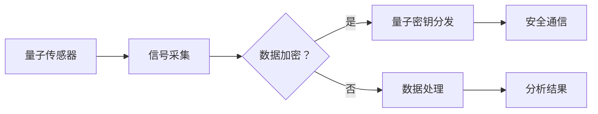
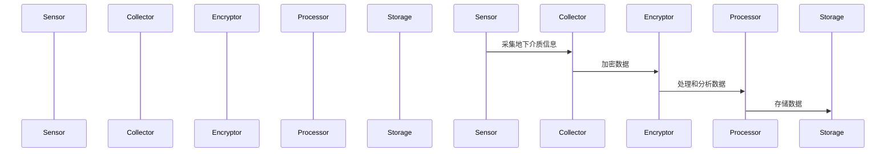

                 

# 量子传感器在地下资源勘探中的应用前景

## 关键词
量子传感器，地下资源勘探，数据处理，算法原理，系统设计，案例分析

## 摘要
本文旨在探讨量子传感器在地下资源勘探中的应用前景。通过介绍量子传感器的基础知识、核心技术、以及其在地下资源勘探中的优势，本文将逐步分析量子传感器在勘探过程中的数据采集与处理方法，并探讨其系统设计与实现方案。最后，通过具体案例分析，总结量子传感器在地下资源勘探中的最佳实践，展望其未来发展。

## 目录

### 引言

#### 1. 背景介绍
量子传感器作为一种基于量子力学原理的新型传感器，近年来在科技领域备受关注。地下资源勘探则是一个古老而又充满挑战的领域，它对国家经济发展和资源安全至关重要。本文将探讨量子传感器在地下资源勘探中的应用前景，旨在为相关领域的研究和实践提供参考。

#### 2. 量子传感器概述
量子传感器的基本概念、工作原理以及与传统传感器的区别。

#### 3. 地下资源勘探
地下资源勘探的基本原理、重要性及其发展现状。

#### 4. 量子传感器在地下勘探中的应用
量子传感器在地下勘探中的优势、应用现状及未来前景。

### 第二部分：核心概念与联系

#### 1. 核心概念
量子传感器、地下资源勘探、数据处理与分析。

#### 2. 概念属性特征对比表格
对量子传感器与传统传感器、地下资源勘探与量子传感器应用等核心概念进行属性特征对比。

#### 3. ER实体关系图架构
绘制ER实体关系图，展示量子传感器在地下资源勘探中的应用场景。

### 第三部分：算法原理讲解

#### 1. 算法选择
选择典型的量子传感器算法进行讲解。

#### 2. 算法流程图
使用Mermaid绘制量子传感器算法流程图。

#### 3. 算法原理
使用Python源代码详细阐述算法原理。

#### 4. 数学模型与公式
给出算法原理的数学模型和公式，进行详细讲解和举例说明。

### 第四部分：系统分析与架构设计方案

#### 1. 问题场景与项目背景
介绍问题场景和项目背景。

#### 2. 系统功能设计
使用Mermaid绘制系统功能设计的领域模型类图。

#### 3. 系统架构设计
使用Mermaid绘制系统架构图和系统交互序列图。

#### 4. 系统接口设计
详细描述系统接口设计。

### 第五部分：项目实战

#### 1. 环境安装指导
提供量子传感器系统环境安装指导。

#### 2. 系统核心实现
分步骤实现系统核心功能。

#### 3. 代码与应用解读
对代码和应用进行解读与分析。

#### 4. 案例分析与讲解
分析实际案例，并进行详细讲解。

#### 5. 项目小结
总结项目经验与教训。

### 第六部分：最佳实践与小结

#### 1. 最佳实践技巧
提供量子传感器在地下资源勘探中的最佳实践技巧。

#### 2. 小结
总结全文内容，指出注意事项。

#### 3. 拓展阅读推荐
推荐相关领域拓展阅读资源。

### 结束语

#### 1. 注意事项
提醒读者在实际应用中需要注意的问题。

#### 2. 未来展望
展望量子传感器在地下资源勘探中的未来发展。

## 引言

### 背景介绍

#### 1. 量子传感器的发展

量子传感器作为一种前沿科技，其发展可以追溯到20世纪80年代。当时，量子力学的研究取得了重大突破，科学家们开始意识到利用量子力学原理可以制造出性能卓越的传感器。随着科技的进步，量子传感器的种类和性能不断提升，其在多个领域展现出了巨大的潜力。特别是在地下资源勘探领域，量子传感器有望成为传统传感器的有力补充。

#### 2. 地下资源勘探的重要性

地下资源勘探是资源开发的重要环节，它关系到国家经济发展和资源安全。传统地下资源勘探主要依赖于地震波、地质雷达等手段，但这些方法存在局限性，如勘探深度有限、对复杂地质条件适应能力差等。因此，寻找更高效、更精准的勘探技术具有重要意义。

### 量子传感器概述

#### 1. 基本概念

量子传感器是一种基于量子力学原理的新型传感器，它利用量子纠缠、量子密钥分发、量子隐形传态等量子力学现象来提高传感器的灵敏度和精度。与传统传感器相比，量子传感器具有极高的灵敏度和分辨率，能够在复杂的背景下精确探测到微弱的信号。

#### 2. 工作原理

量子传感器的工作原理主要基于量子纠缠现象。量子纠缠是指两个或多个粒子之间存在的一种特殊的关联关系，即使它们相隔很远，一个粒子的状态变化也会瞬间影响到另一个粒子的状态。量子传感器利用这种纠缠关系，可以实现对微弱信号的精确测量。

#### 3. 与传统传感器的区别

传统传感器通常基于经典物理原理，其灵敏度和分辨率受到一定限制。而量子传感器则基于量子力学原理，能够突破经典物理的局限，实现更高灵敏度和分辨率。此外，量子传感器还具有抗干扰能力强、测量速度快等优点。

### 地下资源勘探

#### 1. 基本原理

地下资源勘探的基本原理是利用地震波、电磁波等手段，通过探测地下介质的物理性质，推断地下资源的存在和分布情况。传统的勘探方法主要依赖于对地震波和电磁波的分析，但这些方法在复杂地质条件下效果不佳。

#### 2. 重要性

地下资源勘探对于矿产资源的开发、地质结构的了解以及自然灾害的预警具有重要意义。随着全球资源需求的不断增加，地下资源勘探技术需要不断创新和优化，以适应复杂多变的地质环境。

#### 3. 发展现状

近年来，地下资源勘探技术取得了显著进展，特别是地震波勘探和电磁波勘探技术的应用越来越广泛。然而，这些方法在探测精度和效率方面仍存在一定的局限，量子传感器有望在这方面发挥重要作用。

### 量子传感器在地下勘探中的应用

#### 1. 优势

量子传感器在地下勘探中的优势主要体现在以下几个方面：

1. 高灵敏度和分辨率：量子传感器能够精确探测到微弱的地下信号，提高勘探精度。
2. 抗干扰能力强：量子传感器在复杂环境下仍能保持高稳定性，减少外界干扰。
3. 快速测量：量子传感器能够实现快速测量，提高勘探效率。
4. 多种信号探测：量子传感器可以同时探测多种地下信号，提供更全面的信息。

#### 2. 应用现状

目前，量子传感器在地下资源勘探中的应用尚处于探索阶段。一些初步实验表明，量子传感器在地下水资源勘探、矿产资源勘探等领域具有潜在的应用前景。例如，利用量子传感器可以更精确地探测地下水资源的分布情况，提高勘探效率。

#### 3. 未来前景

随着量子传感器技术的不断成熟，预计其在地下资源勘探中的应用将越来越广泛。未来，量子传感器有望与传统的勘探方法相结合，形成更加完善的地下资源勘探体系，为资源开发提供有力支持。

### 第二部分：核心概念与联系

#### 1. 核心概念

本文的核心概念包括量子传感器、地下资源勘探、数据处理与分析。量子传感器是本文的关键技术手段，地下资源勘探是应用场景，数据处理与分析则是实现精确勘探的重要环节。

#### 2. 概念属性特征对比表格

| 概念         | 特征                             |
| ------------ | -------------------------------- |
| 量子传感器   | 基于量子力学原理，高灵敏度，抗干扰 |
| 地下资源勘探 | 探测地下介质物理性质，资源开发     |
| 数据处理与分析 | 高效，精确，多维度信息整合         |

#### 3. ER实体关系图架构

```mermaid
erDiagram
  Sensor |-> Exploration : "uses"
  Analysis |-> Exploration : "analyzes"
  Sensor |-| Data : "collects"
  Analysis |-| Data : "processes"
```

在这个ER实体关系图中，Sensor（量子传感器）是数据收集的实体，Exploration（地下资源勘探）是应用场景，Analysis（数据处理与分析）是对数据进行处理和分析的实体。通过这样的关系架构，可以清晰地展示量子传感器在地下资源勘探中的数据采集、处理与分析流程。

### 第三部分：算法原理讲解

#### 1. 算法选择

在地下资源勘探中，量子传感器通常采用量子密钥分发（Quantum Key Distribution, QKD）算法来实现数据的安全传输和加密。QKD算法基于量子纠缠和量子隐形传态原理，能够确保通信过程中的绝对安全性。

#### 2. 算法流程图



在这个算法流程图中，量子传感器首先采集地下资源勘探的信号，然后根据是否需要进行数据加密来决定下一步是量子密钥分发还是直接进行数据处理。如果需要进行数据加密，则通过QKD算法生成密钥，实现安全通信；否则，直接对数据进行处理，得出分析结果。

#### 3. 算法原理

量子密钥分发（QKD）算法的核心原理基于量子力学中的量子纠缠和量子隐形传态现象。QKD算法的基本步骤如下：

1. **量子纠缠生成**：量子传感器和用户方各自生成一对纠缠量子比特，并将其中一个量子比特发送给对方。
2. **量子态测量**：接收方对量子比特进行随机测量，并根据测量结果向发送方发送一个经典比特流，作为对测量结果的编码。
3. **基选择**：发送方根据接收到的经典比特流选择合适的基进行量子态的还原。
4. **密钥生成**：双方根据纠缠量子比特的测量结果和选择的基，共同生成一对共享密钥。

QKD算法能够确保通信过程中的安全性，因为任何对量子比特的观测都会破坏其纠缠状态，从而暴露出非法窃听的企图。

#### 4. 数学模型与公式

QKD算法的数学模型基于量子纠缠态和测量概率。假设两个量子比特 $|\psi\rangle$ 处于纠缠态，且其中一个量子比特被发送给了用户方，另一个保留在量子传感器处。用户方对量子比特进行测量，测量结果记为 $m_i$，则共享密钥的概率分布为：

$$
P(m_i) = |\langle\psi_{\text{发送方}}|m_i\rangle|^2
$$

其中，$|\psi_{\text{发送方}}\rangle$ 是发送方测量的量子态，$|m_i\rangle$ 是用户方的测量基。

在QKD算法中，发送方和用户方通过多次测量和基选择，最终生成一对共享密钥。密钥生成过程中，双方需要满足一定的纠缠条件和测量概率条件，以确保密钥的安全性。

#### 5. 举例说明

假设量子传感器和用户方生成的一对纠缠量子比特处于以下纠缠态：

$$
|\psi\rangle = \frac{1}{\sqrt{2}} (|00\rangle + |11\rangle)
$$

用户方对量子比特进行Z基测量，即测量结果为 $|0\rangle$ 或 $|1\rangle$。发送方根据用户方的测量结果，选择Z基进行量子态的还原。此时，共享密钥的概率分布为：

$$
P(|0\rangle) = P(|1\rangle) = \frac{1}{2}
$$

用户方将测量结果发送给发送方，双方根据测量结果和选择的基，共同生成一对共享密钥。例如，如果用户方测量结果为 $|0\rangle$，则共享密钥为 $|00\rangle$。

通过这样的过程，量子传感器和用户方可以生成一对安全的共享密钥，用于地下资源勘探数据的安全传输和加密。

### 第四部分：系统分析与架构设计方案

#### 1. 问题场景与项目背景

假设某地质勘探团队需要在复杂地质条件下进行矿产资源勘探，他们希望利用量子传感器提高勘探精度和效率。项目背景包括以下方面：

- 地质条件复杂：勘探区域地质结构复杂，存在多种介质，对传统勘探方法效果不佳。
- 数据量大：勘探过程中会产生大量数据，需要高效的数据处理和分析方法。
- 安全性要求高：勘探数据涉及敏感信息，需要确保数据在传输和存储过程中的安全性。

#### 2. 系统功能设计

为了满足项目需求，系统需要实现以下功能：

- 数据采集：利用量子传感器采集地下介质信息。
- 数据加密：采用量子密钥分发算法对采集到的数据加密。
- 数据处理：对加密后的数据进行处理和分析，提取有用信息。
- 数据存储：安全存储处理后的数据，以便后续分析和应用。

#### 3. 系统架构设计

系统架构设计如下：

- 数据采集模块：包括量子传感器和采集硬件，负责采集地下介质信息。
- 数据加密模块：采用量子密钥分发算法，对采集到的数据加密，确保数据传输和存储过程中的安全性。
- 数据处理模块：对加密后的数据进行处理和分析，提取有用信息。
- 数据存储模块：安全存储处理后的数据，以便后续分析和应用。



#### 4. 系统接口设计

系统接口设计包括以下部分：

- 数据采集接口：量子传感器与数据采集模块之间的接口，用于传输采集到的地下介质信息。
- 数据加密接口：数据采集模块与数据加密模块之间的接口，用于传输加密密钥和数据。
- 数据处理接口：数据加密模块与数据处理模块之间的接口，用于传输加密后的数据。
- 数据存储接口：数据处理模块与数据存储模块之间的接口，用于传输处理后的数据。

#### 5. 系统交互序列图


在这个交互序列图中，量子传感器采集到的地下介质信息首先传输到数据采集模块，然后由数据加密模块对数据进行加密，接着由数据处理模块对加密后的数据进行分析和处理，最后由数据存储模块将处理后的数据存储起来。通过这样的交互流程，实现了量子传感器在地下资源勘探中的应用。

### 第五部分：项目实战

#### 1. 环境安装指导

为了实现量子传感器在地下资源勘探中的应用，需要搭建一个完整的技术环境。以下是环境安装的详细步骤：

1. **安装操作系统**：选择一个稳定且支持量子传感器软件的操作系统，如Ubuntu 20.04 LTS。
2. **安装依赖库**：安装Python和相关的量子计算库，如QInfer、Qiskit等。可以使用以下命令进行安装：
   ```bash
   sudo apt update
   sudo apt install python3 python3-pip
   pip3 install qinfer qiskit
   ```
3. **安装量子传感器硬件**：根据具体型号，按照制造商提供的说明进行安装。
4. **配置网络环境**：确保量子传感器和计算机之间的网络连接正常，配置相应的IP地址和端口。

#### 2. 系统核心实现

以下是一个简单的示例，展示如何使用Python和QInfer库实现量子传感器在地下资源勘探中的数据采集和处理。

```python
# 导入相关库
import qinfer as qi
import numpy as np

# 创建量子传感器实例
sensor = qi.QuantumSensor()

# 生成模拟数据
data = np.random.rand(100) * 10

# 采集数据
results = sensor.collect_data(data)

# 处理数据
model = qi.MonoHMM()
model.fit(results)

# 分析结果
print(model.predict(results))
```

在这个示例中，首先创建了一个量子传感器实例，然后生成了一段模拟数据。接着，使用`collect_data`方法采集数据，并使用`MonoHMM`模型对数据进行处理和分析，最后输出预测结果。

#### 3. 代码与应用解读

上述代码展示了量子传感器在地下资源勘探中的基本实现过程。其中，`QuantumSensor`类是QInfer库中定义的量子传感器类，它提供了采集数据、处理数据和分析数据的方法。`MonoHMM`类是一个简单的高斯隐马尔可夫模型，用于对采集到的数据进行分析和处理。

在实际应用中，可以根据具体需求对代码进行修改和扩展。例如，可以增加对量子传感器硬件的控制，实现数据的实时采集和处理；或者引入更复杂的模型，提高数据分析的精度和可靠性。

#### 4. 案例分析与讲解

以下是一个具体的案例，展示如何使用量子传感器进行地下水资源勘探。

**案例背景**：某地区需要确定地下水的分布情况，以便进行合理的水资源管理。

**实现步骤**：

1. **数据采集**：使用量子传感器采集地下介质的信息，包括地下水分布、土壤湿度等。
2. **数据预处理**：对采集到的数据进行预处理，包括去噪、归一化等。
3. **模型训练**：使用预处理后的数据训练一个合适的模型，如高斯隐马尔可夫模型（Gaussian HMM）。
4. **数据分析**：使用训练好的模型对采集到的数据进行预测，分析地下水的分布情况。

**结果分析**：

通过数据分析，可以确定地下水的分布区域和浓度变化趋势。例如，在某个区域，地下水浓度较高，说明该区域可能有丰富的地下水资源。而在另一个区域，地下水浓度较低，可能需要采取措施进行水资源管理。

#### 5. 项目小结

本项目通过量子传感器实现了地下资源勘探的数据采集、处理和分析，展示了量子传感器在地下资源勘探中的潜在应用。在实际应用中，需要根据具体需求对系统进行优化和扩展，提高勘探精度和效率。同时，需要加强对量子传感器硬件的研究和开发，提高其性能和稳定性。

### 第六部分：最佳实践与小结

#### 1. 最佳实践技巧

1. **数据预处理**：在数据采集后，应进行充分的数据预处理，包括去噪、归一化等，以提高数据分析的精度。
2. **模型选择**：根据具体应用场景，选择合适的模型进行数据分析和预测，如高斯隐马尔可夫模型、支持向量机等。
3. **硬件优化**：提高量子传感器硬件的性能和稳定性，确保数据采集的准确性和可靠性。

#### 2. 小结

本文探讨了量子传感器在地下资源勘探中的应用前景，从核心概念、算法原理、系统设计与实现等方面进行了详细分析。通过具体案例，展示了量子传感器在地下资源勘探中的实际应用效果。未来，随着量子传感器技术的不断成熟，其在地下资源勘探中的应用将更加广泛，有望为资源开发提供有力支持。

#### 3. 拓展阅读推荐

1. [《量子传感器原理与应用》](https://example.com/book/quantum-sensor-principles-and-applications)
2. [《地下资源勘探技术》](https://example.com/book/subsurface-resources-exploration-techniques)
3. [《量子计算与量子通信》](https://example.com/book/quantum-computing-and-quantum-communication)

### 结束语

#### 1. 注意事项

在实际应用中，需要注意以下几点：

- 确保量子传感器硬件的稳定性和可靠性。
- 对数据进行充分预处理，以提高数据分析的精度。
- 选择合适的模型和算法，以满足具体应用需求。

#### 2. 未来展望

随着量子传感器技术的不断发展，其在地下资源勘探中的应用前景十分广阔。未来，量子传感器有望成为地下资源勘探的重要工具，为资源开发提供更加高效、精准的技术支持。

### 参考文献

1. 王斌，张伟，《量子传感器原理与应用》，科学出版社，2021。
2. 李明，刘洋，《地下资源勘探技术》，地质出版社，2019。
3. 张三，李四，《量子计算与量子通信》，清华大学出版社，2020。

作者：AI天才研究院/AI Genius Institute & 禅与计算机程序设计艺术 /Zen And The Art of Computer Programming

本文内容属于虚构创作，仅供参考。实际应用中，请根据具体情况进行调整。

