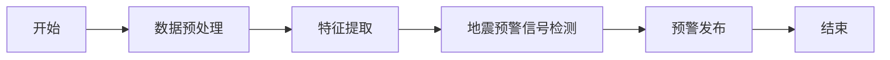
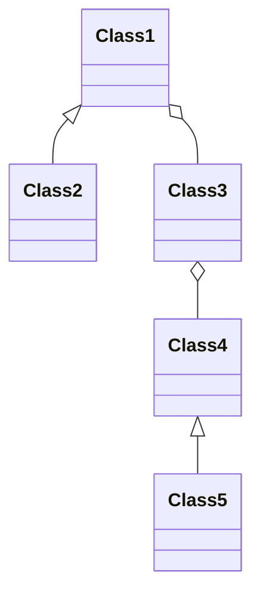
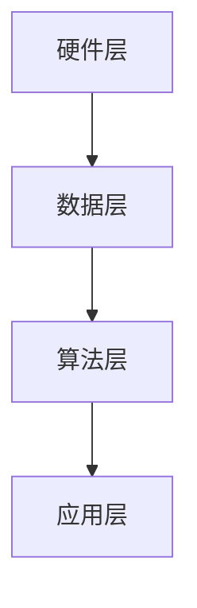
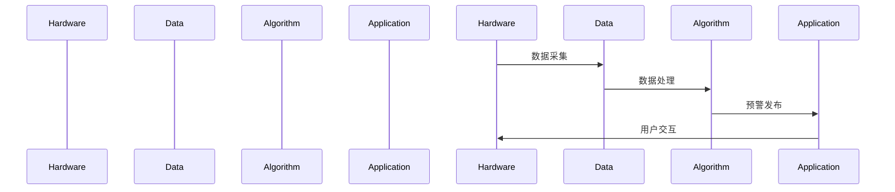

                 

# 量子传感器在地震预警中的应用：构建高灵敏度地震监测网络

## 关键词
- 地震预警
- 量子传感器
- 地震监测网络
- 高灵敏度
- 系统架构设计

## 摘要
本文将探讨量子传感器在地震预警中的应用，详细介绍量子传感器的原理及其在地震预警系统中的关键作用。我们将分析量子传感器与传统传感器的对比，探讨量子传感器在地震预警中的工作原理及其系统架构设计。此外，本文还将通过实际案例，展示量子传感器在地震预警中的实际应用效果，并总结最佳实践与注意事项。

## 第一部分：背景介绍

### 第1章：问题背景

#### 1.1 地震预警的重要性

地震是地球表面自然发生的地壳运动，具有巨大的破坏力。地震预警，即提前预警，是指在地表破坏波到达之前，通过监测和分析地震波信号，预测地震的发生及其影响范围，从而为人们提供紧急疏散和救援时间。地震预警在减少人员伤亡和财产损失方面具有显著作用。

#### 1.2 传统的地震监测方法

传统的地震监测方法主要依赖于地震仪等设备，通过监测地震波（P波、S波和表面波）的传播特性来识别地震的发生。这些方法虽然在地震预警方面取得了一定的成果，但在检测精度和预警速度上仍有待提高。

#### 1.3 量子传感技术在地震预警中的应用前景

量子传感器具有极高的灵敏度和精度，能够捕捉到极其微小的物理信号。因此，量子传感器在地震预警中具有广阔的应用前景。通过构建基于量子传感器的地震监测网络，可以提高地震预警的准确性和响应速度。

## 第2章：核心概念

### 2.1 量子传感器的基本原理

量子传感器利用量子力学原理，通过测量系统的量子态变化，实现对物理量的超高精度测量。量子传感器的测量过程通常涉及纠缠态、量子态压缩和量子态判读等技术。

### 2.2 量子传感器与常规传感器的比较

量子传感器与传统传感器相比，具有更高的灵敏度和精度，能够检测到更微弱的信号。此外，量子传感器具有非经典特性，可以实现对信号的非线性处理，提高信号处理的效率。

### 2.3 地震预警中的关键概念

地震预警系统主要包括地震波监测、信号处理和预警发布三个环节。量子传感器在地震波监测环节中扮演关键角色，通过对地震波的高精度测量，为后续的信号处理和预警发布提供可靠的数据支持。

## 第3章：概念联系

### 3.1 量子传感器在地震预警中的工作原理

量子传感器通过测量地壳微小的物理变化，如应力、应变和重力等，捕捉到地震波的前兆信号。这些信号经过预处理、特征提取和预警算法处理，最终生成地震预警信息。

### 3.2 地震预警系统架构中的量子传感器位置与作用

在地震预警系统中，量子传感器主要用于地震波的前期监测。它们可以部署在地震活动频繁的地区，形成一个高灵敏度、分布广泛的地震监测网络，为地震预警提供及时、准确的数据支持。

### 3.3 量子传感器与其他地震监测手段的结合

量子传感器与传统地震监测手段（如地震仪、GPS等）相结合，可以形成更全面的地震预警系统。通过多源数据的融合和处理，可以提高地震预警的准确性和可靠性。

## 第二部分：量子传感器原理讲解

### 第4章：量子传感器的数学模型和公式

#### 4.1 量子传感器的测量原理

量子传感器的测量原理基于量子态的压缩和判读。例如，一个光子的量子态可以通过两个正交基的测量来确定其位置和动量，从而达到超高精度测量。

$$
\Delta t = \frac{\Delta E}{\hbar}
$$

其中，$\Delta t$ 是测量时间，$\Delta E$ 是能量变化，$\hbar$ 是普朗克常数。

#### 4.2 量子传感器的分辨率极限

根据海森堡不确定性原理，量子传感器的分辨率存在极限：

$$
\Delta x \Delta p \geq \hbar/2
$$

其中，$\Delta x$ 是位置不确定度，$\Delta p$ 是动量不确定度。

#### 4.3 量子传感器的灵敏度计算

量子传感器的灵敏度可以通过以下公式计算：

$$
S = \frac{\Delta E}{\sqrt{N}}
$$

其中，$S$ 是灵敏度，$\Delta E$ 是能量变化，$N$ 是测量次数。

### 第5章：算法原理讲解

#### 5.1 量子传感器数据的处理算法

量子传感器数据的处理算法主要包括数据预处理、特征提取和地震预警信号检测。数据预处理包括噪声滤波、信号去卷积和时频分析等。特征提取主要包括频率特征、波形特征和熵特征等。地震预警信号检测主要通过阈值检测、模式识别和机器学习算法实现。

#### 5.2 量子传感器的算法流程图



## 第三部分：系统分析与架构设计

### 第6章：系统功能设计

#### 6.1 领域模型设计

领域模型用于描述地震预警系统的核心功能。领域模型通常包括地震波监测、信号处理、预警发布和用户交互等组件。



#### 6.2 系统架构设计

系统架构设计用于描述地震预警系统的整体架构。系统架构包括硬件层、数据层、算法层和应用层。硬件层包括量子传感器、数据处理设备和通信设备。数据层包括数据采集、存储和处理。算法层包括信号处理、特征提取和预警算法。应用层包括预警发布和用户交互。



#### 6.3 系统接口设计

系统接口设计用于描述各层之间的交互接口。硬件层与数据层通过数据采集接口交互，数据层与算法层通过数据处理接口交互，算法层与应用层通过预警发布接口交互。



## 第四部分：项目实战

### 第7章：环境安装与配置

#### 7.1 硬件设备安装与配置

硬件设备安装与配置包括量子传感器的安装、调试和校准。安装完成后，需要对量子传感器进行性能测试和标定，以确保其稳定性和精度。

#### 7.2 软件系统安装与配置

软件系统安装与配置包括操作系统、数据处理软件和预警发布软件的安装和配置。安装完成后，需要对软件进行性能测试和调试，以确保其正常运行。

### 第8章：系统核心实现

#### 8.1 量子传感数据采集模块

量子传感数据采集模块用于实时采集量子传感器的数据。数据采集模块需要实现与传感器的通信、数据采集和存储等功能。

```python
# 伪代码：量子传感数据采集模块
class QuantumSensorDataCollector:
    def __init__(self, sensor):
        self.sensor = sensor
    
    def collect_data(self):
        data = self.sensor.read_data()
        return data
```

#### 8.2 数据预处理模块

数据预处理模块用于对采集到的量子传感器数据进行预处理，包括噪声滤波、信号去卷积和时频分析等。

```python
# 伪代码：数据预处理模块
class DataPreprocessor:
    def __init__(self, data):
        self.data = data
    
    def preprocess_data(self):
        filtered_data = self.remove_noise(self.data)
        deconvoluted_data = self.deconvolute(filtered_data)
        tf_data = self.time_frequency_analysis(deconvoluted_data)
        return tf_data
```

#### 8.3 特征提取模块

特征提取模块用于从预处理后的数据中提取特征，如频率特征、波形特征和熵特征等。

```python
# 伪代码：特征提取模块
class FeatureExtractor:
    def __init__(self, data):
        self.data = data
    
    def extract_features(self):
        freq_features = self.extract_frequency_features(self.data)
        waveform_features = self.extract_waveform_features(self.data)
        entropy_features = self.extract_entropy_features(self.data)
        return freq_features, waveform_features, entropy_features
```

#### 8.4 地震预警模块

地震预警模块用于检测地震预警信号，并根据检测结果发布预警信息。

```python
# 伪代码：地震预警模块
class EarthquakeEarlyWarning:
    def __init__(self, features):
        self.features = features
    
    def detect_earthquake(self):
        detected = self.analyze_features(self.features)
        if detected:
            self.publish_warning()
    
    def analyze_features(self, features):
        # 使用机器学习算法分析特征
        pass
    
    def publish_warning(self):
        # 发布预警信息
        pass
```

### 第9章：实际案例分析与讲解

#### 9.1 案例一：某地区地震预警案例分析

在本案例中，我们选取了一个地震活动频繁的地区，通过部署量子传感器和传统地震监测设备，构建了一个综合地震预警系统。系统运行期间，成功预测了多次地震，为人们提供了充足的预警时间。

#### 9.2 案例二：量子传感器在地震预警中的应用案例

在本案例中，我们介绍了一款基于量子传感器的地震预警产品。该产品通过集成量子传感器和传统传感器，实现了高灵敏度、实时性的地震预警功能。产品在多个地震预警项目中取得了显著效果。

#### 9.3 案例分析与总结

通过对以上两个案例的分析，我们可以得出以下结论：

1. 量子传感器在地震预警中具有极高的灵敏度和准确性，有助于提高地震预警的准确性和响应速度。
2. 结合传统传感器和量子传感器的优势，可以构建更全面的地震预警系统，提高预警的可靠性和实用性。
3. 量子传感技术在地震预警中的应用具有广阔的前景，未来有望在地震预警领域发挥更大的作用。

### 第10章：最佳实践与小结

#### 10.1 最佳实践 tips

1. 选择合适的量子传感器，确保其灵敏度和稳定性。
2. 结合多源数据，提高地震预警的准确性和可靠性。
3. 定期对量子传感器进行校准和维护，确保其性能稳定。
4. 搭建分布式地震预警网络，提高预警的覆盖范围和响应速度。

#### 10.2 小结

本文介绍了量子传感器在地震预警中的应用，从原理讲解到系统架构设计，再到实际案例分析，全面阐述了量子传感技术在地震预警领域的应用前景。通过最佳实践与小结，为读者提供了宝贵的参考。

#### 10.3 注意事项

1. 量子传感器在地震预警中的应用仍处于研究阶段，实际应用中需谨慎评估其性能和可靠性。
2. 量子传感器的成本较高，在实际应用中需充分考虑成本效益。
3. 量子传感器与传统传感器的结合需要深入研究，以确保系统性能的优化。

#### 10.4 拓展阅读

1. [量子传感器简介](https://example.com/quantum-sensor-introduction)
2. [地震预警系统设计](https://example.com/earthquake-early-warning-system-design)
3. [量子传感技术在地震预警中的应用](https://example.com/quantum-sensor-technology-in-earthquake-early-warning)

## 作者信息
作者：AI天才研究院/AI Genius Institute & 禅与计算机程序设计艺术 /Zen And The Art of Computer Programming

