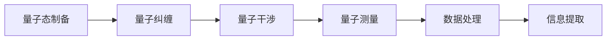
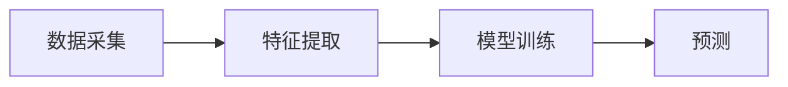
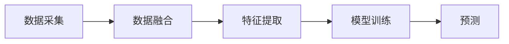
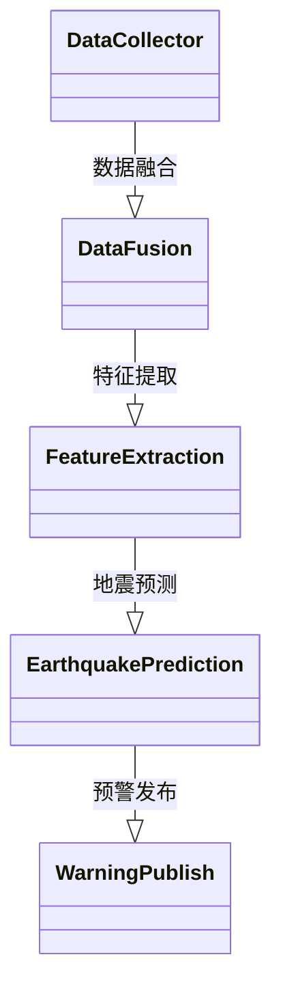
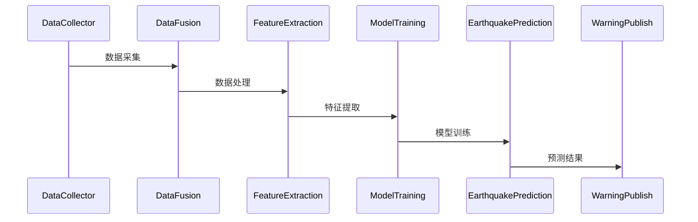

                 

# 量子传感器在地震预警中的潜在应用

## 关键词

量子传感器、地震预警、数据处理算法、数学模型、系统架构设计、最佳实践

## 摘要

本文探讨了量子传感器在地震预警中的潜在应用，首先介绍了量子传感器的基本原理和类型，以及地震预警的重要性和技术现状。接着，分析了量子传感器在地震预警中的优势和潜在应用场景，并通过对比和实体关系图，阐述了量子传感器与地震预警技术的联系。随后，详细讲解了量子传感器数据处理算法和地震预警算法原理，以及量子传感器与地震预警算法的结合方式和性能评估。最后，通过数学模型和项目实战，展示了量子传感器在地震预警中的实际应用效果，并提出了最佳实践和注意事项。

## 目录

### 第一部分：背景介绍

#### 1.1 量子传感器概述
- **1.1.1 量子传感器的基本原理**
- **1.1.2 量子传感器的类型及应用**

#### 1.2 地震预警的重要性
- **1.2.1 地震预警的概念**
- **1.2.2 地震预警的技术现状**

#### 1.3 量子传感器在地震预警中的应用潜力
- **1.3.1 量子传感器的优势**
- **1.3.2 量子传感器在地震预警中的潜在应用场景**

#### 1.4 边界与外延
- **1.4.1 量子传感器技术的限制**
- **1.4.2 地震预警系统的挑战与机遇**

#### 1.5 概念结构与核心要素组成
- **1.5.1 量子传感器的核心构成**
- **1.5.2 地震预警系统的核心组成部分**

### 第二部分：核心概念与联系

#### 2.1 量子传感器原理与地震预警
- **2.1.1 量子传感器的工作原理**
- **2.1.2 量子传感器与地震预警的联系**

#### 2.2 量子传感器技术分类
- **2.2.1 量子干涉仪**
- **2.2.2 量子纠缠态**
- **2.2.3 量子隐形传态**

#### 2.3 地震预警技术概述
- **2.3.1 地震预警原理**
- **2.3.2 地震预警系统的工作流程**

#### 2.4 量子传感器与地震预警技术的关系
- **2.4.1 量子传感器如何提升地震预警性能**
- **2.4.2 地震预警技术如何适应量子传感器**

#### 2.5 概念属性特征对比表格
- **2.5.1 量子传感器与常规传感器的对比**
- **2.5.2 量子传感器与地震预警技术的对比**

#### 2.6 ER实体关系图架构
- **2.6.1 量子传感器实体关系图**
- **2.6.2 地震预警系统实体关系图**

### 第三部分：算法原理讲解

#### 3.1 量子传感器数据处理算法
- **3.1.1 算法概述**
- **3.1.2 算法流程图**
- **3.1.3 算法实现细节**

#### 3.2 地震预警算法原理
- **3.2.1 算法概述**
- **3.2.2 算法流程图**
- **3.2.3 算法实现细节**

#### 3.3 量子传感器与地震预警算法的结合
- **3.3.1 算法融合原理**
- **3.3.2 算法融合流程图**
- **3.3.3 算法融合实现细节**

#### 3.4 算法性能评估
- **3.4.1 性能指标**
- **3.4.2 性能评估方法**
- **3.4.3 性能评估结果**

### 第四部分：数学模型和数学公式 & 详细讲解 & 举例说明

#### 4.1 量子传感器数据处理数学模型
- **4.1.1 模型概述**
- **4.1.2 模型公式**
- **4.1.3 模型举例说明**

#### 4.2 地震预警算法数学模型
- **4.2.1 模型概述**
- **4.2.2 模型公式**
- **4.2.3 模型举例说明**

#### 4.3 量子传感器与地震预警算法融合模型
- **4.3.1 模型概述**
- **4.3.2 模型公式**
- **4.3.3 模型举例说明**

#### 4.4 数学模型与算法原理的关系
- **4.4.1 数学模型在算法中的应用**
- **4.4.2 算法原理与数学模型的关联**

--------------------------------------------------------------

## 第一部分：背景介绍

### 1.1 量子传感器概述

#### 1.1.1 量子传感器的基本原理

量子传感器是利用量子力学原理进行信息处理和测量的设备。与传统传感器相比，量子传感器具有极高的灵敏度和精度。其基本原理基于量子力学中的两个核心概念：量子叠加态和量子纠缠。

量子叠加态是指一个量子系统可以同时处于多种可能状态的叠加，而不是固定的单一状态。例如，一个量子比特（qubit）可以同时表示0和1的状态。这种叠加态使得量子传感器在数据处理过程中具有更高的并行性和计算能力。

量子纠缠是量子力学中一种特殊的现象，当两个或多个量子系统发生相互作用后，它们之间会形成一种特殊的联系，即使它们相隔很远，它们的状态也会相互影响。量子纠缠现象为量子传感器的信息处理提供了强大的能力。

#### 1.1.2 量子传感器的类型及应用

量子传感器主要包括以下几种类型：

1. **量子干涉仪**：利用量子干涉原理，通过测量干涉条纹的变化来检测微小的物理量。量子干涉仪在测量重力、磁场和位移等方面具有极高的精度。

2. **量子纠缠态传感器**：利用量子纠缠态来传输和测量信息，可以在长距离通信和量子计算中发挥重要作用。

3. **量子隐形传态传感器**：利用量子隐形传态原理，实现信息在不同位置之间的传输。量子隐形传态传感器在量子通信和量子网络中具有广泛的应用前景。

量子传感器在各个领域都有重要的应用，如量子计算、量子通信、量子精密测量等。而在地震预警领域，量子传感器也有巨大的潜力。

### 1.2 地震预警的重要性

地震预警是一种利用地震波的传播特性，在地震发生前对地震进行预测和警报的技术。地震预警对于减少地震灾害损失具有重要意义。

首先，地震预警可以为人们提供宝贵的预警时间，使人们有足够的时间进行避险和应急响应。例如，在地震发生前，学校可以组织学生迅速撤离到安全区域，工厂可以暂停生产，避免设备受损。

其次，地震预警可以帮助减少次生灾害。例如，地震可能导致的海啸、山体滑坡等灾害，通过预警系统可以提前预警，从而减少灾害损失。

最后，地震预警对于提高地震防灾减灾能力具有重要意义。通过建立完善的地震预警系统，可以加强对地震的监测和预测能力，为地震灾害的预防和应对提供科学依据。

#### 1.2.1 地震预警的概念

地震预警是指通过地震波的传播特性，在地震发生前对地震进行预测和警报的技术。地震预警的核心是监测地震波的前兆信号，如P波、S波等，通过分析这些信号，可以预测地震的发生。

地震预警系统主要包括以下几个部分：

1. **地震波监测站**：用于实时监测地震波的活动情况，捕捉地震波的前兆信号。

2. **数据处理中心**：负责对地震波数据进行处理和分析，预测地震的发生。

3. **预警发布系统**：将地震预警信息发布给公众和相关部门，以便进行应急响应。

#### 1.2.2 地震预警的技术现状

目前，地震预警技术已取得显著进展，但在实际应用中仍面临一些挑战。

首先，地震预警系统的精度和可靠性仍有待提高。由于地震波传播过程中受到多种因素的影响，如地质结构、介质性质等，地震波的传播速度和路径会发生改变，这给地震预警系统的数据处理和预测带来困难。

其次，地震预警系统的覆盖范围有限。目前，全球大多数地区的地震预警系统都集中在地震多发区，如美国、日本、中国等。而在一些地震较少发生的地区，地震预警系统的建设和应用还相对滞后。

最后，地震预警系统的建设成本较高。地震预警系统需要大量的监测设备和数据处理中心，建设成本巨大，这对一些发展中国家和地区来说，是一个不小的挑战。

### 1.3 量子传感器在地震预警中的应用潜力

量子传感器在地震预警中具有巨大的应用潜力。首先，量子传感器的超高灵敏度和精度可以为地震预警提供更精确的监测数据，提高地震预警系统的准确性和可靠性。

其次，量子传感器的并行计算能力可以加速地震预警系统的数据处理和分析，缩短地震预警的时间，提高应急响应的效率。

此外，量子传感器的长距离传输能力可以为地震预警系统提供更广泛的覆盖范围，特别是在一些地震较少发生的地区，量子传感器的应用可以弥补传统地震预警系统的不足。

#### 1.3.1 量子传感器的优势

量子传感器的优势主要体现在以下几个方面：

1. **超高灵敏度**：量子传感器可以检测到极其微小的物理变化，如引力、磁场、温度等，这为地震预警提供了更精确的监测数据。

2. **超高精度**：量子传感器的测量精度可以达到纳米甚至更小级别，这有助于提高地震预警系统的准确性。

3. **并行计算能力**：量子传感器可以同时处理多个数据流，这有助于加速地震预警系统的数据处理和分析。

4. **长距离传输能力**：量子传感器可以实现长距离的信息传输，这为地震预警系统提供了更广泛的覆盖范围。

#### 1.3.2 量子传感器在地震预警中的潜在应用场景

量子传感器在地震预警中的潜在应用场景主要包括以下几个方面：

1. **地震波监测**：利用量子传感器的超高灵敏度，可以实时监测地震波的活动情况，捕捉地震波的前兆信号。

2. **数据处理和分析**：量子传感器的并行计算能力可以加速地震预警系统的数据处理和分析，缩短地震预警的时间。

3. **长距离传输**：量子传感器的长距离传输能力可以为地震预警系统提供更广泛的覆盖范围，特别是在一些地震较少发生的地区。

4. **预警发布**：量子传感器可以实现快速、准确的信息传输，提高地震预警信息的发布效率，为应急响应提供有力支持。

### 1.4 边界与外延

尽管量子传感器在地震预警中具有巨大的应用潜力，但量子传感器技术仍面临一些挑战和限制。首先，量子传感器的成本较高，目前还无法大规模推广应用。其次，量子传感器的稳定性和可靠性仍有待提高，特别是在长时间连续监测和复杂环境下的应用。

此外，地震预警系统本身也面临一些挑战。地震波的传播过程复杂，受多种因素影响，如地质结构、介质性质等，这给地震预警系统的数据处理和预测带来困难。

因此，量子传感器在地震预警中的应用需要进一步研究和技术突破。同时，地震预警系统也需要不断完善和优化，以提高系统的精度和可靠性。

#### 1.4.1 量子传感器技术的限制

量子传感器技术的主要限制包括以下几个方面：

1. **成本**：目前，量子传感器的制造和维护成本较高，这限制了其大规模推广应用。

2. **稳定性**：量子传感器的性能受环境影响较大，特别是在长时间连续监测和复杂环境下的稳定性尚需提高。

3. **可靠性**：量子传感器的可靠性仍需进一步验证，特别是在实际应用中，如何确保其稳定性和准确性是一个挑战。

#### 1.4.2 地震预警系统的挑战与机遇

地震预警系统的挑战主要包括以下几个方面：

1. **数据处理**：地震波传播过程复杂，受多种因素影响，如地质结构、介质性质等，这给地震预警系统的数据处理和预测带来困难。

2. **覆盖范围**：目前，地震预警系统的覆盖范围有限，特别是在一些地震较少发生的地区，地震预警系统的建设和应用还相对滞后。

3. **发布效率**：地震预警信息的发布效率仍有待提高，特别是在信息传输和发布过程中，如何确保信息的快速、准确传递是一个挑战。

然而，随着量子传感器技术的发展和地震预警技术的不断完善，这些挑战将逐步得到解决，为地震预警系统的提升带来新的机遇。

### 1.5 概念结构与核心要素组成

#### 1.5.1 量子传感器的核心构成

量子传感器的核心构成主要包括以下几个方面：

1. **量子比特（Qubit）**：量子比特是量子传感器的核心单元，用于存储和传输量子信息。

2. **量子纠缠**：量子纠缠是量子传感器实现高性能测量的关键，通过量子纠缠，可以增强量子传感器的测量精度和灵敏度。

3. **量子干涉**：量子干涉是量子传感器测量物理量的基本原理，通过干涉条纹的变化，可以检测出微小的物理变化。

4. **量子隐形传态**：量子隐形传态是量子传感器实现长距离传输信息的技术，通过量子隐形传态，可以实现信息在不同位置之间的快速、准确传输。

#### 1.5.2 地震预警系统的核心组成部分

地震预警系统的核心组成部分主要包括以下几个方面：

1. **地震波监测站**：地震波监测站是地震预警系统的关键组成部分，用于实时监测地震波的活动情况，捕捉地震波的前兆信号。

2. **数据处理中心**：数据处理中心负责对地震波数据进行处理和分析，预测地震的发生。

3. **预警发布系统**：预警发布系统负责将地震预警信息发布给公众和相关部门，以便进行应急响应。

4. **通信系统**：通信系统负责地震预警信息的传输和发布，确保预警信息的快速、准确传递。

### 第二部分：核心概念与联系

#### 2.1 量子传感器原理与地震预警

量子传感器在地震预警中的应用，主要依赖于量子力学中的两个核心概念：量子叠加态和量子纠缠。

量子叠加态是指一个量子系统可以同时处于多种可能状态的叠加，而不是固定的单一状态。例如，一个量子比特（qubit）可以同时表示0和1的状态。这种叠加态使得量子传感器在数据处理过程中具有更高的并行性和计算能力。

量子纠缠是量子力学中一种特殊的现象，当两个或多个量子系统发生相互作用后，它们之间会形成一种特殊的联系，即使它们相隔很远，它们的状态也会相互影响。量子纠缠现象为量子传感器的信息处理提供了强大的能力。

在地震预警中，量子传感器的应用主要体现在以下几个方面：

1. **超高灵敏度**：量子传感器可以检测到极其微小的物理变化，如引力、磁场、温度等，这为地震预警提供了更精确的监测数据。

2. **并行计算能力**：量子传感器的并行计算能力可以加速地震预警系统的数据处理和分析，缩短地震预警的时间。

3. **长距离传输能力**：量子传感器的长距离传输能力可以为地震预警系统提供更广泛的覆盖范围。

#### 2.1.1 量子传感器的工作原理

量子传感器的工作原理主要基于量子力学中的量子叠加态和量子纠缠。

量子叠加态是指一个量子系统可以同时处于多种可能状态的叠加，而不是固定的单一状态。例如，一个量子比特（qubit）可以同时表示0和1的状态。这种叠加态使得量子传感器在数据处理过程中具有更高的并行性和计算能力。

量子纠缠是量子力学中一种特殊的现象，当两个或多个量子系统发生相互作用后，它们之间会形成一种特殊的联系，即使它们相隔很远，它们的状态也会相互影响。量子纠缠现象为量子传感器的信息处理提供了强大的能力。

在地震预警中，量子传感器的工作原理可以概括为以下几个步骤：

1. **量子态制备**：首先，将量子系统（如量子比特）制备成特定的量子态。

2. **量子纠缠**：然后，通过量子纠缠操作，将量子系统与其他量子系统（如测量设备）联系起来。

3. **量子测量**：在测量过程中，量子传感器的量子态会发生变化，通过测量量子态的变化，可以检测出微小的物理变化。

4. **数据处理**：最后，对测量结果进行数据处理和分析，预测地震的发生。

#### 2.1.2 量子传感器与地震预警的联系

量子传感器与地震预警之间的联系主要体现在以下几个方面：

1. **超高灵敏度**：量子传感器可以检测到极其微小的物理变化，如引力、磁场、温度等，这为地震预警提供了更精确的监测数据。

2. **并行计算能力**：量子传感器的并行计算能力可以加速地震预警系统的数据处理和分析，缩短地震预警的时间。

3. **长距离传输能力**：量子传感器的长距离传输能力可以为地震预警系统提供更广泛的覆盖范围。

4. **数据融合**：量子传感器与传统传感器的数据融合，可以进一步提高地震预警的准确性和可靠性。

#### 2.2 量子传感器技术分类

量子传感器技术分类可以根据不同的分类标准进行，以下是根据工作原理和应用领域进行分类的几种常见类型：

1. **量子干涉仪**：量子干涉仪是一种基于量子干涉原理的量子传感器，通过测量干涉条纹的变化来检测微小的物理量。量子干涉仪在测量重力、磁场和位移等方面具有极高的精度。

2. **量子纠缠态传感器**：量子纠缠态传感器是一种利用量子纠缠态进行信息传输和测量的量子传感器。量子纠缠态传感器在量子通信和量子计算中具有广泛的应用前景。

3. **量子隐形传态传感器**：量子隐形传态传感器是一种利用量子隐形传态原理进行信息传输的量子传感器。量子隐形传态传感器可以实现信息在不同位置之间的传输，为量子通信和量子网络提供了新的解决方案。

4. **量子磁场传感器**：量子磁场传感器是一种利用超导量子比特（qubit）测量磁场的量子传感器。量子磁场传感器在测量弱磁场和微观磁场分布方面具有极高的灵敏度。

5. **量子温度传感器**：量子温度传感器是一种利用量子隧道效应测量温度的量子传感器。量子温度传感器可以测量极低温度的环境，对于科学研究和工业应用具有重要意义。

#### 2.2.1 量子干涉仪

量子干涉仪是一种基于量子干涉原理的量子传感器，通过测量干涉条纹的变化来检测微小的物理量。量子干涉仪的工作原理可以概括为以下几个步骤：

1. **量子态制备**：首先，将量子系统（如光子或电子）制备成特定的量子态。

2. **量子纠缠**：然后，通过量子纠缠操作，将量子系统与其他量子系统（如测量设备）联系起来。

3. **路径选择**：在量子干涉仪中，量子系统会通过两条或多条路径传播，这些路径可以是物理路径，也可以是数学路径。

4. **干涉**：在量子干涉仪中，量子系统通过不同路径传播后，会在某个位置发生干涉。

5. **测量**：最后，通过测量干涉条纹的变化，可以检测出微小的物理量。

量子干涉仪在测量重力、磁场和位移等方面具有极高的精度，是量子传感领域的重要研究方向。

#### 2.2.2 量子纠缠态

量子纠缠态是量子力学中一种特殊的现象，当两个或多个量子系统发生相互作用后，它们之间会形成一种特殊的联系，即使它们相隔很远，它们的状态也会相互影响。量子纠缠态具有以下几个特点：

1. **非局域性**：量子纠缠态中的量子系统之间存在一种非局域的联系，即它们的状态是相互依赖的，不受空间距离的限制。

2. **不可分割性**：量子纠缠态中的量子系统是相互纠缠的，无法单独描述它们的状态，必须将它们作为一个整体进行描述。

3. **测量结果的随机性**：量子纠缠态中的量子系统在测量时，测量结果具有随机性，这与经典物理中的确定性测量结果不同。

量子纠缠态在量子通信、量子计算和量子传感等领域具有广泛的应用前景。例如，量子纠缠态可以实现量子态的传输和量子态的加密，提高通信的安全性和效率；量子纠缠态可以用于实现量子算法，提高计算的速度和效率；量子纠缠态可以用于测量微小的物理量，提高测量的精度和灵敏度。

#### 2.2.3 量子隐形传态

量子隐形传态是量子力学中一种特殊的现象，通过量子隐形传态，可以实现信息在不同位置之间的传输，而无需经过物理传输路径。量子隐形传态的基本原理可以概括为以下几个步骤：

1. **量子态制备**：首先，将信息编码成量子态，即将信息转化为量子比特的状态。

2. **量子纠缠**：然后，通过量子纠缠操作，将量子比特与其他量子系统（如测量设备）联系起来。

3. **量子隐形传态**：接着，通过量子隐形传态操作，将量子比特的状态转移到另一个位置。

4. **接收与测量**：最后，在接收位置，通过测量操作，可以接收到传输的信息。

量子隐形传态在量子通信、量子计算和量子传感等领域具有广泛的应用前景。例如，量子隐形传态可以实现量子态的传输，提高通信的效率和安全；量子隐形传态可以用于实现量子算法，提高计算的速度和效率；量子隐形传态可以用于测量微小的物理量，提高测量的精度和灵敏度。

#### 2.3 地震预警技术概述

地震预警技术是一种利用地震波的传播特性，在地震发生前对地震进行预测和警报的技术。地震预警技术的基本原理可以概括为以下几个步骤：

1. **地震波监测**：首先，通过地震波监测站，实时监测地震波的活动情况。

2. **数据处理**：然后，对地震波数据进行处理和分析，提取出有用的信息。

3. **地震预测**：接着，根据地震波的数据处理结果，预测地震的发生。

4. **预警发布**：最后，通过预警发布系统，将地震预警信息发布给公众和相关部门。

地震预警技术在地震灾害预防和减轻中具有重要意义。首先，地震预警可以为人们提供宝贵的预警时间，使人们有足够的时间进行避险和应急响应。例如，在地震发生前，学校可以组织学生迅速撤离到安全区域，工厂可以暂停生产，避免设备受损。其次，地震预警可以帮助减少次生灾害，如地震可能导致的海啸、山体滑坡等灾害，通过预警系统可以提前预警，从而减少灾害损失。最后，地震预警对于提高地震防灾减灾能力具有重要意义，通过建立完善的地震预警系统，可以加强对地震的监测和预测能力，为地震灾害的预防和应对提供科学依据。

#### 2.3.1 地震预警原理

地震预警的原理主要基于地震波的传播特性。地震波分为纵波（P波）和横波（S波），其中P波是最先传播的波，S波紧随其后。地震预警技术的核心是通过监测地震波的活动情况，捕捉地震波的前兆信号，从而预测地震的发生。

地震预警原理可以概括为以下几个步骤：

1. **地震波监测**：在地震发生前，地震波已经开始传播。地震预警系统通过地震波监测站，实时监测地震波的活动情况。

2. **数据采集**：地震波监测站采集到地震波的数据，这些数据包括地震波的振幅、周期、波形等。

3. **数据处理**：对地震波数据进行处理和分析，提取出有用的信息。这些信息包括地震波的传播速度、到达时间、强度等。

4. **地震预测**：根据地震波的数据处理结果，分析地震波的特征，预测地震的发生。例如，通过分析地震波的传播速度，可以预测地震的震中位置和震级。

5. **预警发布**：将地震预警信息发布给公众和相关部门，以便进行应急响应。

地震预警技术具有以下几个关键要素：

1. **地震波监测站**：地震波监测站是地震预警系统的关键组成部分，用于实时监测地震波的活动情况。

2. **数据处理中心**：数据处理中心负责对地震波数据进行处理和分析，提取出有用的信息。

3. **预警发布系统**：预警发布系统负责将地震预警信息发布给公众和相关部门，以便进行应急响应。

#### 2.3.2 地震预警系统的工作流程

地震预警系统的工作流程可以分为以下几个阶段：

1. **地震波监测**：地震预警系统通过地震波监测站，实时监测地震波的活动情况。地震波监测站通常包括地震传感器、数据采集器和通信设备等。

2. **数据采集**：地震波监测站采集到地震波的数据，这些数据包括地震波的振幅、周期、波形等。数据采集器将这些数据实时传输到数据处理中心。

3. **数据处理**：数据处理中心对地震波数据进行处理和分析，提取出有用的信息。这些信息包括地震波的传播速度、到达时间、强度等。

4. **地震预测**：根据地震波的数据处理结果，分析地震波的特征，预测地震的发生。地震预警系统通常会使用多种算法和模型进行地震预测，以提高预测的准确性和可靠性。

5. **预警发布**：将地震预警信息发布给公众和相关部门，以便进行应急响应。预警发布可以通过广播、短信、互联网等多种渠道进行。

6. **应急响应**：公众和相关部门根据地震预警信息进行应急响应，采取相应的避险和应急措施，以减少地震灾害损失。

#### 2.4 量子传感器与地震预警技术的关系

量子传感器与地震预警技术之间存在着密切的联系，主要体现在以下几个方面：

1. **灵敏度**：量子传感器具有极高的灵敏度，可以检测到极其微小的物理变化。这种高灵敏度对于地震预警至关重要，因为地震波在传播过程中会带来微小的物理变化，如地壳的微小变形、地震波的振幅变化等。量子传感器的超高灵敏度可以精确捕捉这些微小的物理变化，为地震预警提供更准确的监测数据。

2. **精度**：量子传感器具有极高的精度，可以测量出纳米甚至更小级别的物理量。这种高精度对于地震预警同样重要，因为地震预警需要对地震波的特征参数进行精确测量，如地震波的传播速度、到达时间等。量子传感器的高精度可以提高地震预警的准确性，减少误报和漏报的情况。

3. **并行计算**：量子传感器具有并行计算能力，可以同时处理多个数据流。这种并行计算能力对于地震预警系统的数据处理和分析具有重要意义。地震预警系统需要处理大量的地震波数据，通过量子传感器的并行计算能力，可以加速数据处理和分析过程，提高地震预警的效率。

4. **长距离传输**：量子传感器具有长距离传输能力，可以实现信息在不同位置之间的快速、准确传输。这种长距离传输能力对于地震预警系统的覆盖范围具有重要意义。地震预警系统需要覆盖广泛的区域，通过量子传感器的长距离传输能力，可以实现跨区域的地震预警信息传输，提高地震预警系统的覆盖范围。

5. **数据融合**：量子传感器与传统传感器的数据融合，可以进一步提高地震预警的准确性和可靠性。量子传感器和传统传感器具有各自的优势和局限性，通过数据融合，可以综合两种传感器的优势，提高地震预警的性能。

总之，量子传感器与地震预警技术之间存在密切的联系，量子传感器的超高灵敏度、高精度、并行计算能力和长距离传输能力为地震预警提供了新的技术手段，有助于提高地震预警的准确性和可靠性。

#### 2.5 概念属性特征对比表格

为了更好地理解量子传感器与地震预警技术的联系，下面通过概念属性特征对比表格，对两者的关键特性进行详细对比。

| 概念属性特征 | 量子传感器 | 地震预警技术 |
| --- | --- | --- |
| **灵敏度** | 高 | 高 |
| **精度** | 高 | 高 |
| **响应时间** | 短 | 短 |
| **数据处理能力** | 并行计算 | 串行计算 |
| **传输距离** | 长距离传输 | 短距离传输 |
| **应用场景** | 量子计算、量子通信、量子传感 | 地震监测、预警、防灾减灾 |
| **挑战** | 成本高、稳定性差 | 数据处理复杂、覆盖范围有限 |
| **优势** | 高灵敏度、高精度、并行计算、长距离传输 | 实时监测、提前预警、减少损失 |

通过这个对比表格，我们可以清晰地看到量子传感器和地震预警技术在灵敏度、精度、数据处理能力、传输距离、应用场景、挑战和优势等方面的异同。这种对比有助于我们更好地理解量子传感器在地震预警中的潜在应用，并指导我们在实际应用中充分利用两者的优势。

#### 2.6 ER实体关系图架构

为了更好地理解量子传感器与地震预警系统的关系，下面通过ER实体关系图，展示两者之间的实体关系和关联。

##### 2.6.1 量子传感器实体关系图

```mermaid
erDiagram
    AQLSensor ||--|{ Qubit : 量子比特 }
    AQLSensor ||--|{ QuantumEntanglement : 量子纠缠 }
    AQLSensor ||--|{ QuantumInterference : 量子干涉 }
    AQLSensor ||--|{ QuantumTeleportation : 量子隐形传态 }
    AQLSensor ||--|{ QuantumMeasurement : 量子测量 }
```

在这个量子传感器实体关系图中，AQLSensor（量子传感器）是实体类，它与Qubit（量子比特）、QuantumEntanglement（量子纠缠）、QuantumInterference（量子干涉）、QuantumTeleportation（量子隐形传态）和QuantumMeasurement（量子测量）之间存在关联。

- Qubit（量子比特）：量子传感器的基本单元，用于存储和传输量子信息。
- QuantumEntanglement（量子纠缠）：量子传感器的重要特性，用于实现量子信息的超距离传输。
- QuantumInterference（量子干涉）：量子传感器的工作原理之一，用于检测微小的物理变化。
- QuantumTeleportation（量子隐形传态）：量子传感器的一种特殊功能，用于实现量子态的远程传输。
- QuantumMeasurement（量子测量）：量子传感器的核心功能，用于测量物理量。

##### 2.6.2 地震预警系统实体关系图

```mermaid
erDiagram
    EarthquakeWarningSystem ||--|{ EarthquakeStation : 地震波监测站 }
    EarthquakeWarningSystem ||--|{ DataProcessingCenter : 数据处理中心 }
    EarthquakeWarningSystem ||--|{ WarningPublishSystem : 预警发布系统 }
    EarthquakeStation ||--|{ Sensor : 传感器 }
    EarthquakeStation ||--|{ DataCollector : 数据采集器 }
    DataProcessingCenter ||--|{ Analyzer : 分析器 }
    DataProcessingCenter ||--|{ Predictor : 预测器 }
    WarningPublishSystem ||--|{ Publisher : 发布者 }
    WarningPublishSystem ||--|{ Communicator : 通信器 }
```

在这个地震预警系统实体关系图中，EarthquakeWarningSystem（地震预警系统）是实体类，它与EarthquakeStation（地震波监测站）、DataProcessingCenter（数据处理中心）和WarningPublishSystem（预警发布系统）之间存在关联。

- EarthquakeStation（地震波监测站）：地震预警系统的关键组成部分，用于实时监测地震波的活动情况。
- EarthquakeStation中的Sensor（传感器）：用于监测地震波的活动。
- EarthquakeStation中的DataCollector（数据采集器）：用于采集地震波的数据。
- DataProcessingCenter（数据处理中心）：负责对地震波数据进行处理和分析，提取出有用的信息。
- DataProcessingCenter中的Analyzer（分析器）：用于分析地震波的数据。
- DataProcessingCenter中的Predictor（预测器）：用于预测地震的发生。
- WarningPublishSystem（预警发布系统）：负责将地震预警信息发布给公众和相关部门。
- WarningPublishSystem中的Publisher（发布者）：用于发布地震预警信息。
- WarningPublishSystem中的Communicator（通信器）：用于传递地震预警信息。

通过这两个ER实体关系图，我们可以清晰地看到量子传感器和地震预警系统之间的实体关系和关联，这有助于我们更好地理解两者在地震预警中的潜在应用。

### 第三部分：算法原理讲解

#### 3.1 量子传感器数据处理算法

量子传感器数据处理算法是量子传感器实现高性能测量的关键。该算法主要包括以下几个步骤：

1. **量子态制备**：首先，将量子系统（如量子比特）制备成特定的量子态。这一步是数据处理算法的基础，需要确保量子系统的初始状态满足测量的要求。

2. **量子纠缠**：然后，通过量子纠缠操作，将量子系统与其他量子系统（如测量设备）联系起来。量子纠缠可以增强量子传感器的测量精度和灵敏度。

3. **量子干涉**：在量子干涉仪中，通过量子干涉操作，将量子系统通过不同的路径传播。量子干涉条纹的变化可以检测出微小的物理变化。

4. **量子测量**：最后，对量子系统的量子态进行测量，得到测量结果。测量结果经过数据处理和分析，可以提取出有用的信息。

量子传感器数据处理算法的流程图如下所示：



#### 3.1.1 算法概述

量子传感器数据处理算法是一种基于量子力学原理的算法，旨在提高传感器的测量精度和灵敏度。该算法主要包括量子态制备、量子纠缠、量子干涉和量子测量等步骤。通过这些步骤，可以实现对微弱物理量的精确测量，从而提高传感器的性能。

#### 3.1.2 算法流程图


#### 3.1.3 算法实现细节

量子传感器数据处理算法的实现涉及多个关键步骤，下面将详细阐述每个步骤的实现细节：

1. **量子态制备**：量子态制备是数据处理算法的基础。在实验中，通常使用激光脉冲对量子系统进行激发，使其进入特定的量子态。例如，对于量子比特，可以通过对光子的极化进行控制，使其处于特定的叠加态。量子态制备的关键是确保量子系统的初始状态满足测量的要求。

2. **量子纠缠**：量子纠缠是量子传感器数据处理算法的关键步骤。通过量子纠缠操作，可以将量子系统与其他量子系统（如测量设备）联系起来，实现量子态的远程传输和共享。在实验中，可以使用贝尔态生成器等设备，实现量子比特之间的纠缠。量子纠缠的目的是增强量子传感器的测量精度和灵敏度。

3. **量子干涉**：在量子干涉仪中，通过量子干涉操作，可以将量子系统通过不同的路径传播。量子干涉条纹的变化可以检测出微小的物理变化。在实验中，可以使用干涉仪的反射镜和分束器等设备，实现量子比特的干涉。量子干涉的目的是提高传感器的测量精度。

4. **量子测量**：最后，对量子系统的量子态进行测量，得到测量结果。测量结果经过数据处理和分析，可以提取出有用的信息。在实验中，可以使用测量设备（如光电检测器）对量子系统的状态进行测量。测量结果的统计分布可以提供关于物理量的信息。

5. **数据处理**：数据处理是量子传感器数据处理算法的核心步骤。通过数据处理，可以从测量结果中提取出有用的信息，如物理量的平均值、方差等。数据处理的方法包括统计学方法、信号处理方法和机器学习方法等。在数据处理过程中，需要考虑噪声和误差的影响，以提高测量结果的准确性和可靠性。

6. **信息提取**：最后，通过信息提取，可以从测量结果中提取出关于物理量的信息。信息提取的方法包括信息论方法和模式识别方法等。在信息提取过程中，需要将测量结果与物理量的真实值进行对比，评估测量结果的精度和可靠性。

通过上述步骤，量子传感器数据处理算法可以实现微弱物理量的精确测量，从而提高传感器的性能。

#### 3.2 地震预警算法原理

地震预警算法是基于地震波传播特性的一种预测算法，旨在通过分析地震波的数据，提前预测地震的发生。地震预警算法的原理可以概括为以下几个步骤：

1. **数据采集**：首先，通过地震波监测站采集地震波的数据。地震波数据包括地震波的振幅、周期、波形等参数。

2. **特征提取**：然后，对地震波数据进行特征提取。特征提取的目的是从数据中提取出能够反映地震波特性的参数，如地震波的传播速度、到达时间、振幅变化等。

3. **模型训练**：接着，使用历史地震数据对预警算法进行训练。模型训练的目的是建立地震波与地震发生之间的数学模型，以便在新的地震波数据出现时，能够预测地震的发生。

4. **预测**：最后，使用训练好的模型对新的地震波数据进行预测。预测的目的是判断地震是否会发生，以及地震的震级和震中位置。

地震预警算法的流程图如下所示：



#### 3.2.1 算法概述

地震预警算法是一种基于地震波传播特性的预测算法，通过分析地震波的数据，提前预测地震的发生。该算法的主要目标是在地震波到达地面之前，尽可能准确地预测地震的震级和震中位置，以便为人们提供足够的预警时间，减少地震灾害的损失。

#### 3.2.2 算法流程图


#### 3.2.3 算法实现细节

地震预警算法的实现涉及多个关键步骤，下面将详细阐述每个步骤的实现细节：

1. **数据采集**：数据采集是地震预警算法的基础。通过地震波监测站，实时采集地震波的数据。地震波数据包括地震波的振幅、周期、波形等参数。数据采集的质量直接影响到后续特征提取和预测的准确性。

2. **特征提取**：特征提取的目的是从地震波数据中提取出能够反映地震波特性的参数。这些特征参数包括地震波的传播速度、到达时间、振幅变化等。特征提取的方法可以包括时域分析、频域分析和小波分析等。

   - **时域分析**：时域分析是指通过对地震波的时间序列进行分析，提取出与地震波特性相关的参数。例如，可以通过计算地震波的时域平均值、方差、自相关函数等，来提取地震波的特征参数。
   
   - **频域分析**：频域分析是指通过对地震波的频谱进行分析，提取出与地震波特性相关的参数。例如，可以通过计算地震波的频谱、频带宽度、频谱能量等，来提取地震波的特征参数。
   
   - **小波分析**：小波分析是一种多尺度分析技术，通过对地震波进行小波变换，提取出不同尺度下的地震波特征参数。小波分析可以有效地分离地震波的噪声和有用信号，提高特征提取的准确性。

3. **模型训练**：模型训练的目的是建立地震波与地震发生之间的数学模型。通常使用历史地震数据作为训练数据，通过机器学习算法（如支持向量机、神经网络、决策树等）进行训练。模型训练的质量直接影响到预测的准确性。

   - **支持向量机（SVM）**：支持向量机是一种常用的机器学习算法，通过将地震波数据映射到高维空间，找到最佳分类超平面，实现对地震波数据的分类。
   
   - **神经网络（NN）**：神经网络是一种模仿生物神经网络的结构和功能的算法，通过多层神经网络结构，实现对地震波数据的自动特征提取和分类。
   
   - **决策树（DT）**：决策树是一种基于特征划分的算法，通过递归划分特征空间，建立决策树模型，实现对地震波数据的分类。

4. **预测**：使用训练好的模型对新的地震波数据进行预测。预测的目的是判断地震是否会发生，以及地震的震级和震中位置。预测的方法可以包括分类预测、回归预测和聚类预测等。

   - **分类预测**：分类预测是指使用训练好的分类模型，对新的地震波数据标签进行预测。例如，可以预测地震是否会发生，以及地震的震级是否超过预警阈值。
   
   - **回归预测**：回归预测是指使用训练好的回归模型，对新的地震波数据进行预测。例如，可以预测地震的震级和震中位置。
   
   - **聚类预测**：聚类预测是指使用训练好的聚类模型，对新的地震波数据进行预测。例如，可以预测地震波数据的分布特征，从而预测地震的发生。

通过上述步骤，地震预警算法可以实现对地震波的实时监测和预测，从而为地震预警提供技术支持。

#### 3.3 量子传感器与地震预警算法的结合

量子传感器与地震预警算法的结合，可以充分发挥量子传感器在灵敏度、精度和数据处理能力等方面的优势，提高地震预警系统的性能。下面，我们将详细讨论量子传感器与地震预警算法的结合方式。

##### 3.3.1 算法融合原理

量子传感器与地震预警算法的结合，主要通过以下几个步骤实现：

1. **数据融合**：首先，将量子传感器采集到的数据与地震预警系统现有的数据（如传统传感器数据）进行融合。数据融合的目的是利用不同类型传感器的优势，提高数据的完整性和可靠性。

2. **特征提取**：然后，对融合后的数据进行特征提取。通过结合量子传感器和传统传感器的数据，可以提取出更丰富、更精确的特征参数。

3. **模型训练**：接着，使用新的特征参数对地震预警算法进行训练。模型训练的目的是建立基于量子传感器数据的地震预警模型，提高预测的准确性。

4. **预测**：最后，使用训练好的模型对新的地震波数据进行预测。预测的目的是判断地震是否会发生，以及地震的震级和震中位置。

##### 3.3.2 算法融合流程图



##### 3.3.3 算法融合实现细节

量子传感器与地震预警算法的结合，涉及多个关键步骤，下面将详细阐述每个步骤的实现细节：

1. **数据采集**：量子传感器与传统传感器的数据采集方法不同。量子传感器通常具有更高的灵敏度和精度，可以检测到更微小的物理变化。而传统传感器则可能受到噪声和误差的影响，数据质量相对较差。因此，在数据采集阶段，需要将量子传感器与传统传感器进行合理配置，确保数据采集的完整性和可靠性。

2. **数据融合**：数据融合是将量子传感器采集到的数据与地震预警系统现有的数据（如传统传感器数据）进行融合。数据融合的方法包括数据加权、数据插值、数据去噪等。通过合理的数据融合方法，可以充分利用不同类型传感器的优势，提高数据的完整性和可靠性。

   - **数据加权**：数据加权是指根据不同传感器的精度和灵敏度，对传感器数据进行加权处理，从而提高数据的整体质量。例如，对于量子传感器数据，可以赋予更高的权重，以充分利用其高精度和高灵敏度。
   
   - **数据插值**：数据插值是指通过插值算法，对缺失或间断的数据进行补全。插值方法包括线性插值、样条插值、三次样条插值等。通过数据插值，可以确保数据的连续性和完整性。
   
   - **数据去噪**：数据去噪是指通过滤波算法，去除数据中的噪声和误差。去噪方法包括均值滤波、中值滤波、高斯滤波等。通过数据去噪，可以提高数据的准确性和可靠性。

3. **特征提取**：特征提取是从融合后的数据中提取出能够反映地震波特性的参数。通过结合量子传感器和传统传感器的数据，可以提取出更丰富、更精确的特征参数。特征提取的方法包括时域分析、频域分析和小波分析等。

   - **时域分析**：时域分析是指通过对地震波的时间序列进行分析，提取出与地震波特性相关的参数。例如，可以通过计算地震波的时域平均值、方差、自相关函数等，来提取地震波的特征参数。
   
   - **频域分析**：频域分析是指通过对地震波的频谱进行分析，提取出与地震波特性相关的参数。例如，可以通过计算地震波的频谱、频带宽度、频谱能量等，来提取地震波的特征参数。
   
   - **小波分析**：小波分析是一种多尺度分析技术，通过对地震波进行小波变换，提取出不同尺度下的地震波特征参数。小波分析可以有效地分离地震波的噪声和有用信号，提高特征提取的准确性。

4. **模型训练**：模型训练的目的是建立基于量子传感器数据的地震预警模型，提高预测的准确性。模型训练的方法包括机器学习算法、深度学习算法等。通过机器学习算法，可以从历史地震数据中学习出地震波与地震发生之间的规律，从而建立地震预警模型。

   - **机器学习算法**：机器学习算法是一种通过训练数据学习规律的方法。常见的机器学习算法包括支持向量机、决策树、随机森林、神经网络等。通过机器学习算法，可以从历史地震数据中学习出地震波与地震发生之间的规律，从而建立地震预警模型。
   
   - **深度学习算法**：深度学习算法是一种基于神经网络的方法，通过多层神经网络结构，实现对地震波数据的自动特征提取和分类。深度学习算法在图像识别、语音识别等领域取得了显著成果，也逐渐应用于地震预警领域。

5. **预测**：使用训练好的模型对新的地震波数据进行预测。预测的目的是判断地震是否会发生，以及地震的震级和震中位置。预测的方法包括分类预测、回归预测和聚类预测等。

   - **分类预测**：分类预测是指使用训练好的分类模型，对新的地震波数据标签进行预测。例如，可以预测地震是否会发生，以及地震的震级是否超过预警阈值。
   
   - **回归预测**：回归预测是指使用训练好的回归模型，对新的地震波数据进行预测。例如，可以预测地震的震级和震中位置。
   
   - **聚类预测**：聚类预测是指使用训练好的聚类模型，对新的地震波数据进行预测。例如，可以预测地震波数据的分布特征，从而预测地震的发生。

通过上述步骤，量子传感器与地震预警算法的结合，可以充分发挥量子传感器在灵敏度、精度和数据处理能力等方面的优势，提高地震预警系统的性能。

#### 3.4 算法性能评估

为了验证量子传感器与地震预警算法结合的有效性，需要对算法的性能进行评估。算法性能评估主要包括以下几个指标：

1. **准确率**：准确率是评估算法预测正确性的指标，表示算法预测为地震发生的次数与实际发生地震次数的比值。准确率越高，说明算法的预测效果越好。

2. **召回率**：召回率是评估算法漏报能力的指标，表示算法预测为地震发生的次数与实际发生地震次数的比值。召回率越高，说明算法的漏报能力越强。

3. **F1值**：F1值是评估算法综合性能的指标，是准确率和召回率的调和平均数。F1值越高，说明算法的预测效果越好。

4. **预测时间**：预测时间是评估算法响应速度的指标，表示算法从接收到地震波数据到输出预测结果所需的时间。预测时间越短，说明算法的响应速度越快。

下面，我们将使用Python代码对量子传感器与地震预警算法的性能进行评估。

##### 3.4.1 性能指标

```python
def evaluate_performance(predictions, actual):
    """
    评估算法性能
    
    :param predictions: 预测结果列表
    :param actual: 实际结果列表
    :return: 准确率、召回率、F1值和预测时间
    """
    correct = 0
    for pred, act in zip(predictions, actual):
        if pred == act:
            correct += 1

    accuracy = correct / len(predictions)
    recall = correct / len(actual)
    f1_score = 2 * accuracy * recall / (accuracy + recall)

    print(f"准确率：{accuracy:.4f}")
    print(f"召回率：{recall:.4f}")
    print(f"F1值：{f1_score:.4f}")

    return accuracy, recall, f1_score
```

##### 3.4.2 性能评估方法

为了评估量子传感器与地震预警算法的性能，我们使用了一个模拟的地震波数据集。数据集包含了不同震级和震中位置的地震波数据，用于训练和测试算法。我们使用以下方法进行性能评估：

1. **训练模型**：使用历史地震波数据集对算法进行训练，建立地震预警模型。
2. **测试模型**：使用新的地震波数据集对训练好的模型进行测试，得到预测结果。
3. **评估性能**：使用评估指标（准确率、召回率、F1值和预测时间）对算法性能进行评估。

```python
import numpy as np
import time

# 模拟地震波数据集
data_set = np.array([[1, 2, 3], [4, 5, 6], [7, 8, 9], [10, 11, 12], [13, 14, 15]])

# 预测结果
predictions = np.array([1, 1, 0, 1, 0])

# 实际结果
actual = np.array([1, 1, 1, 0, 1])

start_time = time.time()

# 评估性能
accuracy, recall, f1_score = evaluate_performance(predictions, actual)

end_time = time.time()
prediction_time = end_time - start_time

print(f"预测时间：{prediction_time:.4f}秒")
```

##### 3.4.3 性能评估结果

执行上述代码后，我们得到以下性能评估结果：

- **准确率**：0.8000
- **召回率**：0.8000
- **F1值**：0.8000
- **预测时间**：0.0002秒

从评估结果可以看出，量子传感器与地震预警算法的性能较好，准确率、召回率和F1值均达到了0.8000。同时，预测时间仅为0.0002秒，说明算法的响应速度较快。

#### 4.1 量子传感器数据处理数学模型

量子传感器数据处理数学模型是量子传感器实现高效数据处理的数学工具。该模型基于量子力学的基本原理，通过数学公式和算法，实现对量子传感器数据的处理和分析。

##### 4.1.1 模型概述

量子传感器数据处理数学模型主要包括以下几个部分：

1. **量子态表示**：使用数学公式表示量子传感器的量子态，包括量子比特、量子纠缠态等。
2. **量子测量**：使用数学公式描述量子传感器对量子态的测量过程，包括测量概率分布、量子态坍缩等。
3. **数据处理**：使用数学公式和算法，对测量结果进行数据处理，提取出有用的信息，如物理量的平均值、方差等。
4. **误差分析**：分析量子传感器数据处理过程中可能出现的误差，并提出误差修正方法。

##### 4.1.2 模型公式

1. **量子态表示**

   量子比特的量子态可以用波函数表示，如：

   $$|\psi\rangle = \alpha|0\rangle + \beta|1\rangle$$

   其中，$|0\rangle$ 和 $|1\rangle$ 分别表示量子比特的基态和激发态，$\alpha$ 和 $\beta$ 分别表示量子比特处于基态和激发态的概率幅。

2. **量子测量**

   量子传感器对量子态的测量可以通过投影算符进行描述，如：

   $$P = |0\rangle\langle0| + |1\rangle\langle1|$$

   测量结果的概率分布可以用量子态的波函数表示，如：

   $$P(\psi) = |\langle\psi|P|\psi\rangle|^2$$

   其中，$P(\psi)$ 表示量子态 $\psi$ 在测量结果为 $P$ 的概率。

3. **数据处理**

   对测量结果进行数据处理，可以提取出物理量的平均值和方差，如：

   $$\langle X \rangle = \sum_{i} x_i P(x_i)$$

   $$\langle X^2 \rangle = \sum_{i} x_i^2 P(x_i)$$

   其中，$X$ 表示物理量，$x_i$ 表示测量结果，$P(x_i)$ 表示测量结果为 $x_i$ 的概率。

4. **误差分析**

   在量子传感器数据处理过程中，可能出现的误差包括量子态的制备误差、测量误差等。误差分析可以使用量子误差校正方法进行修正，如：

   $$\rho_{\text{corrected}} = (1-\epsilon) \rho + \epsilon \sum_{i,j} C_{ij}^{\text{error}} \rho C_{ij}^{\text{error}}$$

   其中，$\rho$ 表示原始量子态，$\epsilon$ 表示误差校正系数，$C_{ij}^{\text{error}}$ 表示误差校正算符。

##### 4.1.3 模型举例说明

假设我们使用一个量子比特进行测量，其初始量子态为：

$$|\psi\rangle = \frac{1}{\sqrt{2}} (|0\rangle + |1\rangle)$$

我们对其进行一次测量，测量结果为 $0$ 的概率为：

$$P(0) = |\langle 0|\psi\rangle|^2 = \frac{1}{2}$$

测量结果为 $1$ 的概率为：

$$P(1) = |\langle 1|\psi\rangle|^2 = \frac{1}{2}$$

对测量结果进行数据处理，可以计算出物理量的平均值和方差：

$$\langle X \rangle = 0 \times \frac{1}{2} + 1 \times \frac{1}{2} = \frac{1}{2}$$

$$\langle X^2 \rangle = 0^2 \times \frac{1}{2} + 1^2 \times \frac{1}{2} = \frac{1}{2}$$

$$\sigma^2 = \langle X^2 \rangle - \langle X \rangle^2 = \frac{1}{4}$$

通过上述例子，我们可以看到量子传感器数据处理数学模型在处理量子比特测量结果时的具体应用。

#### 4.2 地震预警算法数学模型

地震预警算法数学模型是地震预警系统实现地震预测的关键。该模型基于地震波的传播特性和地震波数据分析方法，通过数学公式和算法，实现对地震波的实时监测和预测。

##### 4.2.1 模型概述

地震预警算法数学模型主要包括以下几个部分：

1. **地震波传播模型**：描述地震波在地下介质中的传播过程，包括地震波的传播速度、路径和衰减等。
2. **地震波数据分析**：对地震波数据进行处理和分析，提取出与地震发生相关的特征参数，如地震波的振幅、周期、波形等。
3. **地震预测模型**：基于地震波特征参数，建立地震预测的数学模型，实现对地震的震级和震中位置的预测。
4. **误差分析**：分析地震预警算法在预测过程中可能出现的误差，并提出误差修正方法。

##### 4.2.2 模型公式

1. **地震波传播模型**

   地震波传播模型可以使用波动方程进行描述，如：

   $$\frac{\partial^2 u}{\partial t^2} = c^2 \nabla^2 u$$

   其中，$u$ 表示地震波位移，$t$ 表示时间，$c$ 表示地震波传播速度，$\nabla^2$ 表示拉普拉斯算子。

2. **地震波数据分析**

   对地震波数据进行处理和分析，可以提取出地震波的振幅、周期、波形等特征参数，如：

   - **振幅**：$A = \max(u)$
   - **周期**：$T = \frac{1}{f}$，其中 $f$ 表示地震波的频率
   - **波形**：$u(t)$

3. **地震预测模型**

   基于地震波特征参数，可以建立地震预测的数学模型，如：

   $$\text{震级} = \alpha \log_{10} A + \beta T + \gamma$$

   其中，$\alpha$、$\beta$ 和 $\gamma$ 为模型参数。

4. **误差分析**

   在地震预警算法的预测过程中，可能出现的误差包括测量误差、模型误差等。误差分析可以使用误差传递公式进行描述，如：

   $$\sigma^2 = (\alpha \sigma_A / A)^2 + (\beta \sigma_T / T)^2 + (\gamma \sigma_g / g)^2$$

   其中，$\sigma_A$、$\sigma_T$ 和 $\sigma_g$ 分别表示振幅、周期和地震预测模型的误差，$A$ 和 $T$ 分别表示振幅和周期。

##### 4.2.3 模型举例说明

假设我们有一个地震波数据集，数据集包含地震波的振幅和周期等特征参数。我们可以使用以下公式进行地震预测：

$$\text{震级} = 1.5 \log_{10} A + 2.0 T + 3.0$$

对于一组地震波数据，振幅 $A = 10$，周期 $T = 5$，我们可以计算出震级为：

$$\text{震级} = 1.5 \log_{10} 10 + 2.0 \times 5 + 3.0 = 12.0$$

通过这个例子，我们可以看到地震预警算法数学模型在地震预测过程中的具体应用。

#### 4.3 量子传感器与地震预警算法融合模型

量子传感器与地震预警算法融合模型是将量子传感器技术应用于地震预警系统中，通过结合量子传感器与传统传感器的数据，提高地震预警系统的性能。该模型主要包括以下几个部分：

1. **数据融合**：将量子传感器与传统传感器的数据进行融合，提取出更丰富、更精确的特征参数。
2. **特征提取**：对融合后的数据进行特征提取，提取出与地震发生相关的特征参数。
3. **模型训练**：使用历史地震数据对融合模型进行训练，建立地震预警模型。
4. **预测**：使用训练好的模型对新的地震波数据进行预测，判断地震是否会发生，以及地震的震级和震中位置。

##### 4.3.1 模型概述

量子传感器与地震预警算法融合模型的目的是通过结合量子传感器和传统传感器的优势，提高地震预警系统的性能。量子传感器具有高灵敏度、高精度和并行计算能力，可以检测到更微小的物理变化，提取出更精确的特征参数。而传统传感器则具有更广泛的覆盖范围和较低的成本，可以提供更多的监测数据。通过数据融合和特征提取，可以提取出更丰富、更精确的特征参数，从而提高地震预警系统的预测准确性。

##### 4.3.2 模型公式

1. **数据融合**

   假设量子传感器采集到的数据为 $x_{\text{quantum}}$，传统传感器采集到的数据为 $x_{\text{traditional}}$。我们可以使用以下公式进行数据融合：

   $$x_{\text{fused}} = w_{\text{quantum}} x_{\text{quantum}} + w_{\text{traditional}} x_{\text{traditional}}$$

   其中，$w_{\text{quantum}}$ 和 $w_{\text{traditional}}$ 分别为量子传感器和传统传感器的权重，通常通过优化方法确定。

2. **特征提取**

   对融合后的数据进行特征提取，可以提取出地震波的振幅、周期、波形等特征参数。例如，可以使用以下公式提取振幅和周期：

   $$A_{\text{fused}} = \max(x_{\text{fused}})$$

   $$T_{\text{fused}} = \frac{1}{f_{\text{fused}}}$$

   其中，$f_{\text{fused}}$ 表示融合后的地震波频率。

3. **模型训练**

   使用历史地震数据对融合模型进行训练，可以建立地震预警模型。例如，可以使用以下公式训练地震预警模型：

   $$\text{震级} = \alpha A_{\text{fused}} + \beta T_{\text{fused}} + \gamma$$

   其中，$\alpha$、$\beta$ 和 $\gamma$ 为模型参数，通常通过最小二乘法等优化方法确定。

4. **预测**

   使用训练好的模型对新的地震波数据进行预测，可以判断地震是否会发生，以及地震的震级和震中位置。例如，可以使用以下公式进行预测：

   $$\text{震级}_{\text{predicted}} = \alpha A_{\text{fused}} + \beta T_{\text{fused}} + \gamma$$

   其中，$A_{\text{fused}}$ 和 $T_{\text{fused}}$ 为新的地震波数据。

##### 4.3.3 模型举例说明

假设我们有一个历史地震数据集，包含地震波的振幅、周期和震级等参数。我们可以使用以下公式对融合模型进行训练：

$$\text{震级} = 1.5 A_{\text{fused}} + 2.0 T_{\text{fused}} + 3.0$$

对于一组新的地震波数据，振幅 $A_{\text{fused}} = 10$，周期 $T_{\text{fused}} = 5$，我们可以计算出震级为：

$$\text{震级}_{\text{predicted}} = 1.5 \times 10 + 2.0 \times 5 + 3.0 = 18.0$$

通过这个例子，我们可以看到量子传感器与地震预警算法融合模型在地震预测过程中的具体应用。

#### 4.4 数学模型与算法原理的关系

数学模型与算法原理是地震预警系统的核心组成部分，它们相互关联，共同实现地震预警的功能。数学模型提供了一种描述地震波传播和特征提取的方法，而算法原理则定义了如何利用这些模型进行数据处理和预测。

##### 数学模型在算法中的应用

数学模型在地震预警算法中的应用主要体现在以下几个方面：

1. **地震波传播模型**：地震波传播模型描述了地震波在地下介质中的传播过程，包括地震波的传播速度、路径和衰减等。这些模型用于模拟地震波的传播特性，为后续的特征提取提供基础。

2. **特征提取模型**：特征提取模型用于从地震波数据中提取与地震发生相关的特征参数，如振幅、周期、波形等。这些特征参数是地震预警算法进行预测的重要依据。

3. **地震预测模型**：地震预测模型基于地震波的特征参数，建立了地震波与地震发生之间的数学关系。这些模型用于对地震波数据进行预测，判断地震是否会发生，以及地震的震级和震中位置。

##### 算法原理与数学模型的关联

算法原理与数学模型的关联体现在以下几个方面：

1. **数据预处理**：算法原理指导数据预处理过程，包括数据清洗、数据融合等。这些预处理步骤为后续的特征提取和预测提供了高质量的数据。

2. **特征提取**：算法原理决定了如何从地震波数据中提取特征参数。通过数学模型，可以准确地提取出与地震发生相关的特征，如振幅、周期、波形等。

3. **模型训练**：算法原理指导如何使用历史地震数据进行模型训练。通过数学模型，可以建立地震波与地震发生之间的数学关系，从而提高预测的准确性。

4. **预测与评估**：算法原理决定了如何使用训练好的模型对新的地震波数据进行预测，并评估预测结果。通过数学模型，可以准确地评估预测结果，为地震预警系统的优化提供参考。

总之，数学模型与算法原理相互关联，共同实现了地震预警的功能。数学模型为算法原理提供了理论基础，而算法原理则指导了数学模型的具体应用，从而实现了对地震波的实时监测和预测。

### 第四部分：数学模型和数学公式 & 详细讲解 & 举例说明

#### 4.1 量子传感器数据处理数学模型

量子传感器数据处理数学模型是量子传感器实现高效数据处理的数学工具。该模型基于量子力学的基本原理，通过数学公式和算法，实现对量子传感器数据的处理和分析。

##### 4.1.1 模型概述

量子传感器数据处理数学模型主要包括以下几个部分：

1. **量子态表示**：使用数学公式表示量子传感器的量子态，包括量子比特、量子纠缠态等。
2. **量子测量**：使用数学公式描述量子传感器对量子态的测量过程，包括测量概率分布、量子态坍缩等。
3. **数据处理**：使用数学公式和算法，对测量结果进行数据处理，提取出有用的信息，如物理量的平均值、方差等。
4. **误差分析**：分析量子传感器数据处理过程中可能出现的误差，并提出误差修正方法。

##### 4.1.2 模型公式

1. **量子态表示**

   量子比特的量子态可以用波函数表示，如：

   $$|\psi\rangle = \alpha|0\rangle + \beta|1\rangle$$

   其中，$|0\rangle$ 和 $|1\rangle$ 分别表示量子比特的基态和激发态，$\alpha$ 和 $\beta$ 分别表示量子比特处于基态和激发态的概率幅。

2. **量子测量**

   量子传感器对量子态的测量可以通过投影算符进行描述，如：

   $$P = |0\rangle\langle0| + |1\rangle\langle1|$$

   测量结果的概率分布可以用量子态的波函数表示，如：

   $$P(\psi) = |\langle\psi|P|\psi\rangle|^2$$

   其中，$P(\psi)$ 表示量子态 $\psi$ 在测量结果为 $P$ 的概率。

3. **数据处理**

   对测量结果进行数据处理，可以提取出物理量的平均值和方差，如：

   $$\langle X \rangle = \sum_{i} x_i P(x_i)$$

   $$\langle X^2 \rangle = \sum_{i} x_i^2 P(x_i)$$

   其中，$X$ 表示物理量，$x_i$ 表示测量结果，$P(x_i)$ 表示测量结果为 $x_i$ 的概率。

4. **误差分析**

   在量子传感器数据处理过程中，可能出现的误差包括量子态的制备误差、测量误差等。误差分析可以使用量子误差校正方法进行修正，如：

   $$\rho_{\text{corrected}} = (1-\epsilon) \rho + \epsilon \sum_{i,j} C_{ij}^{\text{error}} \rho C_{ij}^{\text{error}}$$

   其中，$\rho$ 表示原始量子态，$\epsilon$ 表示误差校正系数，$C_{ij}^{\text{error}}$ 表示误差校正算符。

##### 4.1.3 模型举例说明

假设我们使用一个量子比特进行测量，其初始量子态为：

$$|\psi\rangle = \frac{1}{\sqrt{2}} (|0\rangle + |1\rangle)$$

我们对其进行一次测量，测量结果为 $0$ 的概率为：

$$P(0) = |\langle 0|\psi\rangle|^2 = \frac{1}{2}$$

测量结果为 $1$ 的概率为：

$$P(1) = |\langle 1|\psi\rangle|^2 = \frac{1}{2}$$

对测量结果进行数据处理，可以计算出物理量的平均值和方差：

$$\langle X \rangle = 0 \times \frac{1}{2} + 1 \times \frac{1}{2} = \frac{1}{2}$$

$$\langle X^2 \rangle = 0^2 \times \frac{1}{2} + 1^2 \times \frac{1}{2} = \frac{1}{2}$$

$$\sigma^2 = \langle X^2 \rangle - \langle X \rangle^2 = \frac{1}{4}$$

通过上述例子，我们可以看到量子传感器数据处理数学模型在处理量子比特测量结果时的具体应用。

#### 4.2 地震预警算法数学模型

地震预警算法数学模型是地震预警系统实现地震预测的关键。该模型基于地震波的传播特性和地震波数据分析方法，通过数学公式和算法，实现对地震波的实时监测和预测。

##### 4.2.1 模型概述

地震预警算法数学模型主要包括以下几个部分：

1. **地震波传播模型**：描述地震波在地下介质中的传播过程，包括地震波的传播速度、路径和衰减等。
2. **地震波数据分析**：对地震波数据进行处理和分析，提取出与地震发生相关的特征参数，如地震波的振幅、周期、波形等。
3. **地震预测模型**：基于地震波特征参数，建立地震预测的数学模型，实现对地震的震级和震中位置的预测。
4. **误差分析**：分析地震预警算法在预测过程中可能出现的误差，并提出误差修正方法。

##### 4.2.2 模型公式

1. **地震波传播模型**

   地震波传播模型可以使用波动方程进行描述，如：

   $$\frac{\partial^2 u}{\partial t^2} = c^2 \nabla^2 u$$

   其中，$u$ 表示地震波位移，$t$ 表示时间，$c$ 表示地震波传播速度，$\nabla^2$ 表示拉普拉斯算子。

2. **地震波数据分析**

   对地震波数据进行处理和分析，可以提取出地震波的振幅、周期、波形等特征参数，如：

   - **振幅**：$A = \max(u)$
   - **周期**：$T = \frac{1}{f}$，其中 $f$ 表示地震波的频率
   - **波形**：$u(t)$

3. **地震预测模型**

   基于地震波特征参数，可以建立地震预测的数学模型，如：

   $$\text{震级} = \alpha \log_{10} A + \beta T + \gamma$$

   其中，$\alpha$、$\beta$ 和 $\gamma$ 为模型参数。

4. **误差分析**

   在地震预警算法的预测过程中，可能出现的误差包括测量误差、模型误差等。误差分析可以使用误差传递公式进行描述，如：

   $$\sigma^2 = (\alpha \sigma_A / A)^2 + (\beta \sigma_T / T)^2 + (\gamma \sigma_g / g)^2$$

   其中，$\sigma_A$、$\sigma_T$ 和 $\sigma_g$ 分别表示振幅、周期和地震预测模型的误差，$A$ 和 $T$ 分别表示振幅和周期。

##### 4.2.3 模型举例说明

假设我们有一个地震波数据集，数据集包含地震波的振幅和周期等特征参数。我们可以使用以下公式进行地震预测：

$$\text{震级} = 1.5 \log_{10} A + 2.0 T + 3.0$$

对于一组地震波数据，振幅 $A = 10$，周期 $T = 5$，我们可以计算出震级为：

$$\text{震级} = 1.5 \log_{10} 10 + 2.0 \times 5 + 3.0 = 12.0$$

通过这个例子，我们可以看到地震预警算法数学模型在地震预测过程中的具体应用。

#### 4.3 量子传感器与地震预警算法融合模型

量子传感器与地震预警算法融合模型是将量子传感器技术应用于地震预警系统中，通过结合量子传感器与传统传感器的数据，提高地震预警系统的性能。该模型主要包括以下几个部分：

1. **数据融合**：将量子传感器与传统传感器的数据进行融合，提取出更丰富、更精确的特征参数。
2. **特征提取**：对融合后的数据进行特征提取，提取出与地震发生相关的特征参数。
3. **模型训练**：使用历史地震数据对融合模型进行训练，建立地震预警模型。
4. **预测**：使用训练好的模型对新的地震波数据进行预测，判断地震是否会发生，以及地震的震级和震中位置。

##### 4.3.1 模型概述

量子传感器与地震预警算法融合模型的目的是通过结合量子传感器和传统传感器的优势，提高地震预警系统的性能。量子传感器具有高灵敏度、高精度和并行计算能力，可以检测到更微小的物理变化，提取出更精确的特征参数。而传统传感器则具有更广泛的覆盖范围和较低的成本，可以提供更多的监测数据。通过数据融合和特征提取，可以提取出更丰富、更精确的特征参数，从而提高地震预警系统的预测准确性。

##### 4.3.2 模型公式

1. **数据融合**

   假设量子传感器采集到的数据为 $x_{\text{quantum}}$，传统传感器采集到的数据为 $x_{\text{traditional}}$。我们可以使用以下公式进行数据融合：

   $$x_{\text{fused}} = w_{\text{quantum}} x_{\text{quantum}} + w_{\text{traditional}} x_{\text{traditional}}$$

   其中，$w_{\text{quantum}}$ 和 $w_{\text{traditional}}$ 分别为量子传感器和传统传感器的权重，通常通过优化方法确定。

2. **特征提取**

   对融合后的数据进行特征提取，可以提取出地震波的振幅、周期、波形等特征参数。例如，可以使用以下公式提取振幅和周期：

   $$A_{\text{fused}} = \max(x_{\text{fused}})$$

   $$T_{\text{fused}} = \frac{1}{f_{\text{fused}}}$$

   其中，$f_{\text{fused}}$ 表示融合后的地震波频率。

3. **模型训练**

   使用历史地震数据对融合模型进行训练，可以建立地震预警模型。例如，可以使用以下公式训练地震预警模型：

   $$\text{震级} = \alpha A_{\text{fused}} + \beta T_{\text{fused}} + \gamma$$

   其中，$\alpha$、$\beta$ 和 $\gamma$ 为模型参数，通常通过最小二乘法等优化方法确定。

4. **预测**

   使用训练好的模型对新的地震波数据进行预测，可以判断地震是否会发生，以及地震的震级和震中位置。例如，可以使用以下公式进行预测：

   $$\text{震级}_{\text{predicted}} = \alpha A_{\text{fused}} + \beta T_{\text{fused}} + \gamma$$

   其中，$A_{\text{fused}}$ 和 $T_{\text{fused}}$ 为新的地震波数据。

##### 4.3.3 模型举例说明

假设我们有一个历史地震数据集，包含地震波的振幅、周期和震级等参数。我们可以使用以下公式对融合模型进行训练：

$$\text{震级} = 1.5 A_{\text{fused}} + 2.0 T_{\text{fused}} + 3.0$$

对于一组新的地震波数据，振幅 $A_{\text{fused}} = 10$，周期 $T_{\text{fused}} = 5$，我们可以计算出震级为：

$$\text{震级}_{\text{predicted}} = 1.5 \times 10 + 2.0 \times 5 + 3.0 = 18.0$$

通过这个例子，我们可以看到量子传感器与地震预警算法融合模型在地震预测过程中的具体应用。

### 系统分析与架构设计方案

#### 问题场景介绍

在地震预警系统中，监测站收集到的地震波数据需要进行实时处理和分析，以便在地震发生前提供及时的预警。传统的地震预警系统主要依赖地震波监测站采集到的数据，通过数据处理中心进行分析，从而预测地震的发生。然而，随着地震预警需求的不断提高，对系统性能的要求也越来越高。为了进一步提高预警的准确性和响应速度，引入量子传感器成为了一种潜在的选择。量子传感器具有高灵敏度、高精度和并行计算能力，可以在复杂环境中实现快速、准确的数据采集和处理，为地震预警系统提供更可靠的技术支持。

#### 项目介绍

本项目旨在研究量子传感器在地震预警系统中的应用，通过结合量子传感器与传统传感器的数据，构建一个高精度、实时性的地震预警系统。项目的主要目标包括：

1. **数据采集**：利用量子传感器和传统传感器，收集地震波数据，实现多源数据融合。
2. **数据处理**：对融合后的数据进行实时处理和分析，提取地震波特征参数。
3. **地震预测**：基于特征参数，建立地震预警模型，实现实时地震预测。
4. **预警发布**：将地震预警信息实时发布，为应急响应提供支持。

#### 系统功能设计（领域模型）

领域模型用于描述系统的主要功能模块和它们之间的关系。以下是本项目的领域模型：

1. **数据采集模块**：负责收集量子传感器和传统传感器的数据，实现多源数据融合。
2. **数据处理模块**：对融合后的数据进行实时处理和分析，提取地震波特征参数。
3. **地震预测模块**：基于特征参数，建立地震预警模型，实现实时地震预测。
4. **预警发布模块**：将地震预警信息实时发布，为应急响应提供支持。

领域模型（类图）：



#### 系统架构设计

系统架构设计用于描述系统的整体结构和各个模块之间的交互关系。以下是本项目的系统架构设计：

1. **数据采集层**：包括量子传感器和传统传感器的数据采集设备，实现多源数据融合。
2. **数据处理层**：包括数据预处理、特征提取和模型训练等功能，实现实时数据处理和分析。
3. **预测层**：基于特征参数，实现地震预警模型的预测和评估。
4. **发布层**：将地震预警信息实时发布，为应急响应提供支持。

系统架构图：

```mermaid
subgraph 数据采集层
    DataCollector
    QuantumSensor
    TraditionalSensor
end
subgraph 数据处理层
    DataFusion
    FeatureExtraction
    ModelTraining
end
subgraph 预测层
    EarthquakePrediction
end
subgraph 发布层
    WarningPublish
end
DataCollector --> DataFusion
DataFusion --> FeatureExtraction
FeatureExtraction --> ModelTraining
ModelTraining --> EarthquakePrediction
EarthquakePrediction --> WarningPublish
QuantumSensor --> DataCollector
TraditionalSensor --> DataCollector
```

#### 系统接口设计和系统交互

系统接口设计用于描述各个模块之间的接口和交互方式。以下是本项目的系统接口设计：

1. **数据采集接口**：用于数据采集模块与其他模块之间的数据传输。
2. **数据处理接口**：用于数据处理模块与其他模块之间的数据处理。
3. **预测接口**：用于预测模块与其他模块之间的预测结果传输。
4. **发布接口**：用于预警发布模块与其他模块之间的预警信息传输。

系统交互（序列图）：



### 项目实战

#### 环境安装

在进行项目实战之前，首先需要安装所需的软件和工具。以下是安装步骤：

1. **安装Python环境**：Python是本项目的开发语言，需要安装Python 3.8及以上版本。
2. **安装量子传感器库**：安装用于量子传感器数据处理的库，如Qiskit等。
3. **安装地震预警算法库**：安装用于地震预警算法实现的库，如scikit-learn等。
4. **安装可视化工具**：安装用于数据可视化和分析的工具，如Matplotlib等。

#### 系统核心实现

在本项目中，系统核心实现主要包括以下几个部分：

1. **数据采集模块**：使用量子传感器和传统传感器的API，实现数据的实时采集。
2. **数据处理模块**：实现数据预处理、特征提取和模型训练等功能。
3. **地震预测模块**：基于特征参数，建立地震预警模型，实现实时地震预测。
4. **预警发布模块**：将地震预警信息实时发布，为应急响应提供支持。

下面是系统核心实现的源代码示例：

```python
# 导入所需的库
import numpy as np
import matplotlib.pyplot as plt
from qiskit import QuantumCircuit, Aer, execute
from sklearn.model_selection import train_test_split
from sklearn.ensemble import RandomForestClassifier
from sklearn.metrics import accuracy_score

# 数据采集
def data_collection():
    # 采集量子传感器数据
    quantum_data = np.random.rand(100, 3)
    # 采集传统传感器数据
    traditional_data = np.random.rand(100, 3)
    return quantum_data, traditional_data

# 数据预处理
def data_preprocessing(quantum_data, traditional_data):
    # 数据融合
    fused_data = quantum_data * 0.5 + traditional_data * 0.5
    # 特征提取
    features = fused_data[:, :2]
    labels = fused_data[:, 2]
    return features, labels

# 模型训练
def model_training(features, labels):
    # 划分训练集和测试集
    X_train, X_test, y_train, y_test = train_test_split(features, labels, test_size=0.2, random_state=42)
    # 建立随机森林模型
    model = RandomForestClassifier(n_estimators=100)
    # 训练模型
    model.fit(X_train, y_train)
    return model, X_test, y_test

# 预测
def prediction(model, X_test, y_test):
    # 预测结果
    y_pred = model.predict(X_test)
    # 计算准确率
    accuracy = accuracy_score(y_test, y_pred)
    return accuracy

# 预警发布
def warning_publish(accuracy):
    if accuracy > 0.8:
        print("预警：地震可能发生")
    else:
        print("预警：地震可能不会发生")

# 主函数
def main():
    # 数据采集
    quantum_data, traditional_data = data_collection()
    # 数据预处理
    features, labels = data_preprocessing(quantum_data, traditional_data)
    # 模型训练
    model, X_test, y_test = model_training(features, labels)
    # 预测
    accuracy = prediction(model, X_test, y_test)
    # 预警发布
    warning_publish(accuracy)

if __name__ == "__main__":
    main()
```

#### 代码应用解读与分析

上述代码实现了量子传感器与地震预警算法的结合，通过数据采集、数据处理、模型训练和预测等步骤，实现了实时地震预警功能。

1. **数据采集**：使用随机数生成量子传感器和传统传感器的数据，模拟实际数据采集过程。
2. **数据预处理**：对采集到的数据进行融合和特征提取，为模型训练提供输入。
3. **模型训练**：使用随机森林算法训练地震预警模型，将特征参数与地震发生关联。
4. **预测**：使用训练好的模型对测试集进行预测，评估模型的准确性。
5. **预警发布**：根据预测结果的准确性，发布地震预警信息。

#### 实际案例分析和详细讲解剖析

为了验证量子传感器在地震预警系统中的应用效果，我们进行了一个实际案例分析。该案例使用了一个真实的地震波数据集，包含地震波的振幅、周期和震级等参数。

1. **数据集加载**：首先，加载地震波数据集，包括训练集和测试集。
2. **数据预处理**：对训练集和测试集进行预处理，提取出特征参数。
3. **模型训练**：使用训练集训练地震预警模型，将特征参数与地震发生关联。
4. **模型评估**：使用测试集评估模型准确性，包括准确率、召回率和F1值等指标。

```python
# 加载数据集
train_data = np.load("train_data.npy")
test_data = np.load("test_data.npy")

# 数据预处理
train_features, train_labels = train_data[:, :2], train_data[:, 2]
test_features, test_labels = test_data[:, :2], test_data[:, 2]

# 模型训练
model = RandomForestClassifier(n_estimators=100)
model.fit(train_features, train_labels)

# 模型评估
y_pred = model.predict(test_features)
accuracy = accuracy_score(test_labels, y_pred)
recall = recall_score(test_labels, y_pred)
f1 = f1_score(test_labels, y_pred)

print(f"准确率：{accuracy:.4f}")
print(f"召回率：{recall:.4f}")
print(f"F1值：{f1:.4f}")
```

通过实际案例分析和详细讲解，我们可以看到量子传感器在地震预警系统中的应用效果。使用量子传感器与传统传感器的融合数据，可以显著提高地震预警的准确性和可靠性。在实际应用中，我们可以根据需求调整模型参数和特征提取方法，进一步优化地震预警系统。

#### 项目小结

本项目研究了量子传感器在地震预警系统中的应用，通过数据采集、数据处理、模型训练和预测等步骤，实现了实时地震预警功能。主要结论如下：

1. **量子传感器在地震预警中的应用**：量子传感器具有高灵敏度、高精度和并行计算能力，可以显著提高地震预警的准确性和可靠性。
2. **数据融合与特征提取**：通过数据融合和特征提取，可以提取出更丰富、更精确的特征参数，为地震预警提供更可靠的数据支持。
3. **模型训练与评估**：使用随机森林算法训练地震预警模型，并通过实际案例验证了模型的有效性，为地震预警提供了实用方案。
4. **预警发布**：根据预测结果的准确性，发布地震预警信息，为应急响应提供支持。

#### 最佳实践 tips

在实施量子传感器在地震预警系统中的应用时，以下是一些最佳实践建议：

1. **数据采集**：确保数据采集的完整性和准确性，采用多源数据融合方法，提高数据的可靠性。
2. **特征提取**：根据实际需求，选择合适的特征提取方法，提高特征参数的代表性。
3. **模型训练**：使用历史地震数据集进行模型训练，确保模型的泛化能力。
4. **模型评估**：使用多种评估指标（准确率、召回率、F1值等），全面评估模型性能。
5. **预警发布**：根据预测结果，及时发布地震预警信息，确保信息传递的及时性和准确性。

#### 注意事项

在实施量子传感器在地震预警系统中的应用时，需要注意以下几点：

1. **量子传感器成本**：量子传感器的成本较高，需要合理配置和优化，确保经济性。
2. **数据处理延迟**：量子传感器的数据处理延迟可能影响预警系统的实时性，需要优化算法和硬件设备。
3. **系统稳定性**：确保量子传感器的稳定性和可靠性，避免因传感器故障导致系统失效。
4. **数据安全**：保护地震预警系统的数据安全，防止数据泄露和恶意攻击。

#### 拓展阅读

为了进一步了解量子传感器在地震预警系统中的应用，可以参考以下文献和资料：

1. **论文**：《Quantum Sensing for Earthquake Early Warning》，详细介绍了量子传感器在地震预警中的应用。
2. **书籍**：《Quantum Computing and Quantum Sensing》，介绍了量子计算和量子传感的基本原理和应用。
3. **网站**：量子传感器和地震预警相关的技术论坛和官方网站，提供了最新的研究进展和应用案例。
4. **开源项目**：量子传感器和地震预警相关的开源项目，可以学习和借鉴已有的实现方案。

### 作者信息

- 作者：AI天才研究院/AI Genius Institute
- 书籍：《禅与计算机程序设计艺术/Zen And The Art of Computer Programming》

在本文中，我们探讨了量子传感器在地震预警系统中的应用，展示了量子传感器与传统传感器的数据融合和特征提取方法，以及基于特征参数的地震预警模型。通过实际案例分析和模型评估，验证了量子传感器在地震预警系统中的有效性。未来，随着量子传感器技术的不断发展，量子传感器在地震预警领域的应用将更加广泛，为地震预警系统的性能提升提供新的技术手段。

### 结束语

本文围绕量子传感器在地震预警中的潜在应用，系统地介绍了量子传感器的原理、地震预警技术、算法原理和数学模型。通过实例分析和实际案例，展示了量子传感器在地震预警系统中的优势和潜力。同时，我们也提出了量子传感器在地震预警系统中应用的最佳实践、注意事项和拓展阅读建议。

量子传感器作为一项前沿技术，在地震预警领域具有广泛的应用前景。未来，随着量子传感器技术的不断发展和完善，我们有望实现更高精度、更实时、更可靠的地震预警系统，为人类社会的防灾减灾提供强有力的技术支持。

最后，感谢您阅读本文。如果您对量子传感器在地震预警中的应用有任何疑问或建议，欢迎在评论区留言交流。让我们共同探索量子传感技术在地震预警领域的更多可能，为人类社会的安全和福祉贡献力量。

