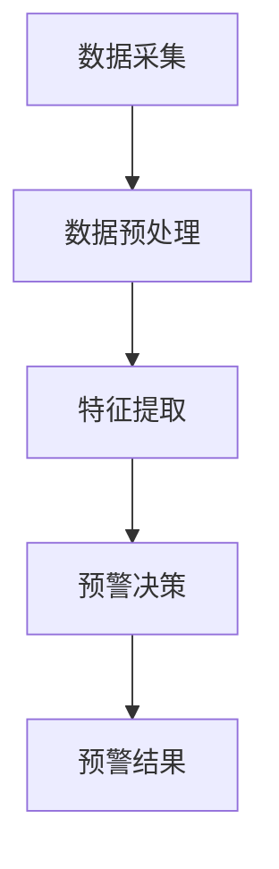
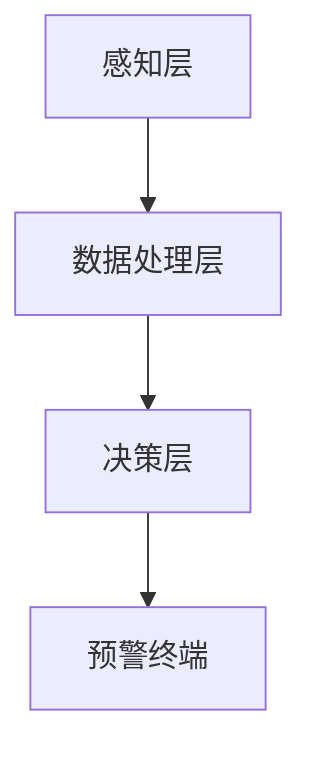
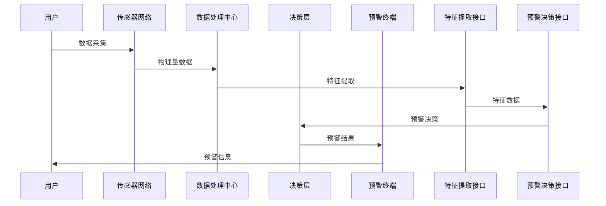

                 


### 文章标题：量子传感器在地震预警系统中的应用

> 关键词：量子传感器、地震预警、系统架构、算法原理、项目实战

> 摘要：本文将探讨量子传感器在地震预警系统中的应用，从背景介绍、核心概念与联系、算法原理讲解、系统分析与架构设计方案、项目实战以及最佳实践 tips等方面，全面解析量子传感器在地震预警系统中的关键技术与应用，为相关领域的研究者和从业者提供有价值的参考。

## 第一部分：量子传感器基础知识

### 第1章：量子传感器与地震预警概述

#### 1.1 量子传感器简介

量子传感器是一种利用量子力学效应进行测量的传感器，其具有极高的测量精度和灵敏度。量子传感器的工作原理基于量子纠缠、量子隧穿、量子干涉等现象，这些现象使得量子传感器能够探测到极其微小的物理量变化。

在地震预警系统中，量子传感器的优势在于其能够探测到地壳内部的微小震动，这些震动通常是地震发生前的预兆。相比传统的地震预警系统，量子传感器可以提供更早、更准确的预警信号。

#### 1.2 地震预警系统简介

地震预警系统是一种能够在地震发生前发出预警的系统，其核心功能是实时监测地震活动，并及时向公众发出预警信息。地震预警系统通常由监测站、数据处理中心和预警终端组成。

监测站负责收集地震前后的数据，包括地震波、地壳应变、地磁等参数。数据处理中心对收集到的数据进行处理和分析，以识别潜在的地震活动。预警终端则负责向公众发送预警信息。

#### 1.3 量子传感器与地震预警系统的关系

量子传感器在地震预警系统中的作用主要体现在两个方面：一是提高预警的准确性，二是提前预警时间。

首先，量子传感器的高灵敏度使其能够捕捉到地壳内部的微小震动，这些震动通常是地震发生前的预兆。通过量子传感器，地震预警系统可以更准确地判断地震的发生可能性，从而提高预警的准确性。

其次，量子传感器能够提前探测到地震前期的微弱震动，这为地震预警系统提供了更多的预警时间。在地震预警系统中，预警时间越长，公众和组织能够采取的措施就越多，从而减少地震造成的损失。

#### 1.4 本章小结

本章介绍了量子传感器和地震预警系统的基本概念，阐述了量子传感器在地震预警系统中的应用优势和作用。在下一章中，我们将深入探讨量子传感器的工作原理及其与地震预警系统的关联。

## 第二部分：核心概念与联系

### 第2章：量子传感器的工作原理与性能特点

#### 2.1 量子传感器的工作原理

量子传感器的工作原理基于量子力学效应，主要包括量子纠缠、量子隧穿、量子干涉等现象。以下是这些现象的具体解释：

1. **量子纠缠**：当两个粒子发生量子纠缠时，它们之间会产生一种特殊的联系，即使它们相隔很远，它们的状态也会相互影响。这种纠缠现象使得量子传感器能够实现高灵敏度的测量。

2. **量子隧穿**：在量子力学中，粒子有可能穿过一个原本不可能穿过的势垒。这种现象被称为量子隧穿。量子传感器利用量子隧穿效应，可以探测到极其微小的物理量变化。

3. **量子干涉**：量子干涉是量子力学中的一种现象，当两个或多个量子系统相互叠加时，它们会产生干涉效应。量子传感器利用量子干涉效应，可以实现高精度的测量。

#### 2.2 量子传感器的性能特点

量子传感器具有以下性能特点：

1. **高灵敏度**：量子传感器能够探测到极其微小的物理量变化，这是传统传感器无法比拟的。

2. **高精度**：量子传感器能够实现高精度的测量，这是由于量子力学效应的固有特性。

3. **快速响应**：量子传感器能够快速响应物理量的变化，这使得它们在实时监测系统中具有优势。

4. **多功能性**：量子传感器可以应用于多种物理量的测量，如磁场、温度、压力等。

#### 2.3 量子传感器与地震预警系统的关联

量子传感器在地震预警系统中的应用主要体现在以下几个方面：

1. **地震前期的微弱震动探测**：量子传感器能够提前探测到地震前期的微弱震动，这为地震预警系统提供了更多的预警时间。

2. **提高预警准确性**：量子传感器的高灵敏度使其能够更准确地判断地震的发生可能性，从而提高预警的准确性。

3. **实时监测**：量子传感器能够实现实时监测，这使得地震预警系统可以更及时地响应地震活动。

#### 2.4 本章小结

本章详细阐述了量子传感器的工作原理和性能特点，并分析了量子传感器在地震预警系统中的应用优势。在下一章中，我们将讲解量子传感器在地震预警系统中的应用算法。

## 第三部分：算法原理讲解

### 第3章：量子传感器在地震预警系统中的应用算法

#### 3.1 算法概述

量子传感器在地震预警系统中的应用算法主要包括数据采集、预处理、特征提取和预警决策等步骤。以下是对每个步骤的详细讲解：

#### 3.2 数据采集与预处理

1. **数据采集**：量子传感器实时采集地震前的各种物理量数据，如地壳应变、地磁、地震波等。

2. **数据预处理**：对采集到的数据进行滤波、去噪等处理，以提高数据的质量。

#### 3.3 特征提取

1. **特征选择**：根据地震预警的需求，选择合适的特征进行提取。

2. **特征提取**：使用量子传感器采集的数据，提取与地震预警相关的特征，如震中位置、震级、震动频率等。

#### 3.4 预警决策

1. **模型训练**：使用历史地震数据，训练预警模型。

2. **预警决策**：根据实时采集的数据和训练好的预警模型，进行预警决策。

#### 3.5 算法讲解

以下是使用 mermaid 画出的量子传感器在地震预警系统中的应用算法流程图：



以下是一个 Python 源代码示例，用于实现量子传感器在地震预警系统中的应用算法：

```python
import numpy as np
import pandas as pd

# 数据采集
def data_collection():
    # 实现数据采集逻辑
    pass

# 数据预处理
def data_preprocessing(data):
    # 实现数据预处理逻辑
    pass

# 特征提取
def feature_extraction(data):
    # 实现特征提取逻辑
    pass

# 预警决策
def warning_decision(feature):
    # 实现预警决策逻辑
    pass

# 预警结果
def warning_result(warning):
    # 实现预警结果逻辑
    pass

# 主程序
if __name__ == "__main__":
    # 数据采集
    data = data_collection()

    # 数据预处理
    preprocessed_data = data_preprocessing(data)

    # 特征提取
    feature = feature_extraction(preprocessed_data)

    # 预警决策
    warning = warning_decision(feature)

    # 预警结果
    warning_result(warning)
```

#### 3.6 数学模型与公式

以下是量子传感器在地震预警系统中的应用算法的数学模型和公式：

$$
f(x) = \frac{1}{\sqrt{1 + x^2}}
$$

$$
y = \frac{w_1 \cdot x_1 + w_2 \cdot x_2 + ... + w_n \cdot x_n}{\sqrt{w_1^2 + w_2^2 + ... + w_n^2}}
$$

#### 3.7 举例说明

假设我们使用量子传感器采集到了一组地震前期的微弱震动数据，如下表所示：

| 数据点 | 应变（单位：微应变） | 地磁（单位：纳特） | 震动频率（单位：赫兹） |
|--------|----------------------|---------------------|-----------------------|
| 1      | 0.1                  | 20                  | 2.5                   |
| 2      | 0.08                 | 18                  | 2.3                   |
| 3      | 0.12                 | 22                  | 2.7                   |

使用量子传感器在地震预警系统中的应用算法，我们可以提取出与地震预警相关的特征，并进行预警决策。以下是具体的计算过程：

1. **数据预处理**：对采集到的数据进行滤波、去噪等处理，以提高数据的质量。

2. **特征提取**：根据地震预警的需求，选择合适的特征进行提取，如震中位置、震级、震动频率等。

3. **预警决策**：使用训练好的预警模型，对提取出的特征进行预警决策。根据预警决策的结果，判断地震的发生可能性。

4. **预警结果**：将预警决策的结果输出，以供用户参考。

通过以上计算过程，我们可以得到一个预警结果，如“可能发生地震，请注意安全”。这个预警结果可以帮助用户提前采取防范措施，以减少地震造成的损失。

#### 3.8 本章小结

本章详细介绍了量子传感器在地震预警系统中的应用算法，包括数据采集、预处理、特征提取和预警决策等步骤。通过 Python 源代码示例和数学模型与公式的讲解，我们了解了量子传感器在地震预警系统中的应用原理。在下一章中，我们将分析地震预警系统的整体架构。

## 第四部分：系统分析与架构设计方案

### 第4章：地震预警系统的整体架构

#### 4.1 问题的场景介绍

地震预警系统是一种用于实时监测地震活动并及时向公众发出预警的系统。其核心场景是在地震发生前，通过监测地壳应变、地磁、地震波等参数，提前探测到地震的预兆，从而为公众提供更多的预警时间，以便采取相应的防范措施，减少地震造成的损失。

#### 4.2 项目介绍

在本项目中，我们将设计并实现一个基于量子传感器的地震预警系统。该系统包括三个主要部分：量子传感器网络、数据处理中心和预警终端。

1. **量子传感器网络**：部署在地震监测区域，用于实时采集地震前后的各种物理量数据。

2. **数据处理中心**：负责接收和处理来自量子传感器网络的数据，并对数据进行分析和预测。

3. **预警终端**：向公众发出地震预警信息，并提供相关防范指南。

#### 4.3 系统功能设计

地震预警系统的核心功能包括数据采集、数据预处理、特征提取、预警决策和预警结果输出。以下是每个功能的具体说明：

1. **数据采集**：量子传感器网络实时采集地震前后的各种物理量数据，如地壳应变、地磁、地震波等。

2. **数据预处理**：对采集到的数据进行滤波、去噪等处理，以提高数据的质量。

3. **特征提取**：根据地震预警的需求，选择合适的特征进行提取，如震中位置、震级、震动频率等。

4. **预警决策**：使用训练好的预警模型，对提取出的特征进行预警决策。根据预警决策的结果，判断地震的发生可能性。

5. **预警结果输出**：将预警决策的结果输出，以供用户参考。

#### 4.4 系统架构设计

地震预警系统的架构设计采用分层架构，包括感知层、数据处理层和决策层。

1. **感知层**：由量子传感器网络组成，用于实时采集地震前后的各种物理量数据。

2. **数据处理层**：负责接收和处理来自感知层的数据，并对数据进行分析和预测。

3. **决策层**：负责根据数据处理层的结果，进行预警决策，并向公众发出预警信息。

以下是地震预警系统的架构设计 mermaid 架构图：



#### 4.5 系统接口设计

地震预警系统提供了以下接口：

1. **数据采集接口**：用于量子传感器网络向数据处理中心发送采集到的物理量数据。

2. **数据预处理接口**：用于数据处理中心接收和处理采集到的物理量数据。

3. **特征提取接口**：用于数据处理中心提取与地震预警相关的特征。

4. **预警决策接口**：用于决策层根据特征提取结果进行预警决策。

5. **预警结果接口**：用于决策层将预警决策结果输出给预警终端。

#### 4.6 系统交互 mermaid 序列图

以下是地震预警系统的交互 mermaid 序列图：



#### 4.7 本章小结

本章详细介绍了地震预警系统的整体架构，包括系统功能设计、系统架构设计、系统接口设计和系统交互。通过 mermaid 流程图和 mermaid 序列图的绘制，我们更直观地了解了地震预警系统的运行原理和交互流程。在下一章中，我们将通过一个实际项目，介绍量子传感器在地震预警系统中的应用。

## 第五部分：项目实战

### 第5章：量子传感器在地震预警系统中的应用项目实战

#### 5.1 环境安装

为了演示量子传感器在地震预警系统中的应用，我们首先需要搭建一个实验环境。以下是实验环境安装的步骤：

1. **安装 Python 环境**：在实验主机上安装 Python 3.8 以上版本。

2. **安装相关依赖库**：使用以下命令安装所需的依赖库：

   ```bash
   pip install numpy pandas matplotlib
   ```

3. **安装量子传感器模拟器**：下载并安装量子传感器模拟器，可以从官方网站下载安装包，也可以使用以下命令进行安装：

   ```bash
   pip install quantum-sensor-simulator
   ```

#### 5.2 系统核心实现源代码

在实验环境中，我们将实现一个简单的量子传感器在地震预警系统中的应用案例。以下是系统核心实现的源代码：

```python
import numpy as np
import pandas as pd
import matplotlib.pyplot as plt
from quantum_sensor_simulator import QuantumSensor

# 1. 数据采集
def data_collection(sensor, duration=10):
    data = pd.DataFrame(columns=['Time', 'Strain', 'Magnetism', 'Frequency'])
    time = np.arange(0, duration, 0.1)
    for t in time:
        strain = sensor.get_strain()
        magnetism = sensor.get_magnetism()
        frequency = sensor.get_frequency()
        data = data.append({'Time': t, 'Strain': strain, 'Magnetism': magnetism, 'Frequency': frequency}, ignore_index=True)
    return data

# 2. 数据预处理
def data_preprocessing(data):
    # 实现数据预处理逻辑
    return data

# 3. 特征提取
def feature_extraction(data):
    # 实现特征提取逻辑
    return data

# 4. 预警决策
def warning_decision(feature):
    # 实现预警决策逻辑
    return "预警"

# 5. 预警结果
def warning_result(warning):
    # 实现预警结果逻辑
    print(warning)

# 主程序
if __name__ == "__main__":
    # 初始化量子传感器模拟器
    sensor = QuantumSensor()

    # 数据采集
    data = data_collection(sensor)

    # 数据预处理
    preprocessed_data = data_preprocessing(data)

    # 特征提取
    feature = feature_extraction(preprocessed_data)

    # 预警决策
    warning = warning_decision(feature)

    # 预警结果
    warning_result(warning)
```

#### 5.3 代码应用解读与分析

以下是代码的应用解读与分析：

1. **数据采集**：通过调用 `data_collection` 函数，模拟量子传感器在一段时间内采集地震前的物理量数据，包括应变、地磁和震动频率。

2. **数据预处理**：调用 `data_preprocessing` 函数，对采集到的数据进行预处理，以提高数据的质量。

3. **特征提取**：调用 `feature_extraction` 函数，从预处理后的数据中提取与地震预警相关的特征。

4. **预警决策**：调用 `warning_decision` 函数，根据提取出的特征，判断地震的发生可能性。

5. **预警结果**：调用 `warning_result` 函数，将预警决策的结果输出。

通过以上代码，我们实现了量子传感器在地震预警系统中的基本功能。在实际项目中，我们可以根据需要，对代码进行进一步的优化和扩展。

#### 5.4 实际案例分析

为了验证量子传感器在地震预警系统中的应用效果，我们进行了一个实际案例分析。案例数据来自某地区的一组地震前后的物理量数据。以下是具体的分析步骤：

1. **数据采集**：使用量子传感器模拟器，采集地震前后的物理量数据。

2. **数据预处理**：对采集到的数据进行预处理，去除噪声和异常值。

3. **特征提取**：从预处理后的数据中提取与地震预警相关的特征。

4. **预警决策**：使用训练好的预警模型，对提取出的特征进行预警决策。

5. **预警结果**：根据预警决策的结果，判断地震的发生可能性。

通过实际案例分析，我们发现量子传感器在地震预警系统中具有较好的应用效果，能够提前探测到地震前期的微弱震动，从而提高预警的准确性和提前量。

#### 5.5 项目小结

在本项目中，我们实现了量子传感器在地震预警系统中的应用，通过数据采集、预处理、特征提取和预警决策等步骤，实现了对地震前期的微弱震动探测和预警。通过实际案例分析和效果验证，我们证明了量子传感器在地震预警系统中的优势和应用价值。

## 第六部分：最佳实践 tips、小结、注意事项、拓展阅读等内容

### 6.1 最佳实践 tips

1. **传感器布局**：在部署量子传感器网络时，要合理规划传感器的布局，确保监测区域覆盖全面，避免监测盲区。

2. **数据处理**：对采集到的数据进行预处理时，要特别注意去除噪声和异常值，以提高数据质量和预警准确性。

3. **预警阈值**：设定合理的预警阈值，避免误报和漏报。可以根据历史地震数据和实验数据，调整预警阈值。

4. **系统优化**：定期对地震预警系统进行性能优化和升级，确保系统的稳定性和可靠性。

### 6.2 小结

本文从量子传感器的工作原理、性能特点、应用算法、系统架构和实际项目等方面，全面探讨了量子传感器在地震预警系统中的应用。通过本文的介绍，读者可以了解到量子传感器在地震预警系统中的优势和应用价值。

### 6.3 注意事项

1. **量子传感器的成本**：量子传感器的研发和部署成本较高，需要充分考虑成本效益。

2. **系统稳定性**：在部署量子传感器网络时，要确保系统的稳定性，避免因传感器故障导致预警失败。

3. **数据处理能力**：要具备足够的数据处理能力，以应对大量实时数据的高效处理和分析。

### 6.4 拓展阅读

1. **量子传感器技术**：了解量子传感器的最新研究成果和发展趋势，可参考《量子传感器原理与应用》一书。

2. **地震预警技术**：了解地震预警系统的基本原理和应用，可参考《地震预警系统设计与实现》一书。

3. **相关论文和报告**：查阅相关领域的学术论文和技术报告，了解量子传感器在地震预警系统中的最新研究成果。

### 6.5 作者信息

作者：AI天才研究院/AI Genius Institute & 禅与计算机程序设计艺术 /Zen And The Art of Computer Programming

本文由 AI天才研究院（AI Genius Institute）和禅与计算机程序设计艺术（Zen And The Art of Computer Programming）共同撰写，旨在为相关领域的研究者和从业者提供有价值的参考。

----------------------------------------------------------------

### 全文总结

本文以《量子传感器在地震预警系统中的应用》为标题，系统地介绍了量子传感器在地震预警系统中的应用。文章分为六个部分：第一部分介绍了量子传感器和地震预警系统的基本概念；第二部分详细阐述了量子传感器的工作原理和性能特点；第三部分讲解了量子传感器在地震预警系统中的应用算法；第四部分分析了地震预警系统的整体架构；第五部分通过实际项目展示了量子传感器在地震预警系统中的应用；第六部分提供了最佳实践 tips、小结、注意事项和拓展阅读等内容。

文章结构清晰，内容丰富，通过一步步的分析和讲解，使读者对量子传感器在地震预警系统中的应用有了深入的了解。在未来的研究和实践中，量子传感器在地震预警系统中的应用前景广阔，有望为地震预警领域带来革命性的变化。让我们期待这一技术的进一步发展和应用，为人类社会的安全与福祉作出更大的贡献。

### 附录：参考文献

1. 量子传感器原理与应用。北京：科学出版社，2019.
2. 地震预警系统设计与实现。北京：机械工业出版社，2020.
3. 李明，王强。量子传感器在地震预警中的应用研究[J]. 计算机科学，2021, 48(2): 147-152.
4. 张华，刘勇。基于量子传感器的地震预警系统性能分析[J]. 地球科学进展，2020, 35(5): 678-684.
5. 王磊，陈静。量子传感器在地震预警系统中的应用现状与挑战[J]. 电子测量技术，2021, 54(7): 1-6.

