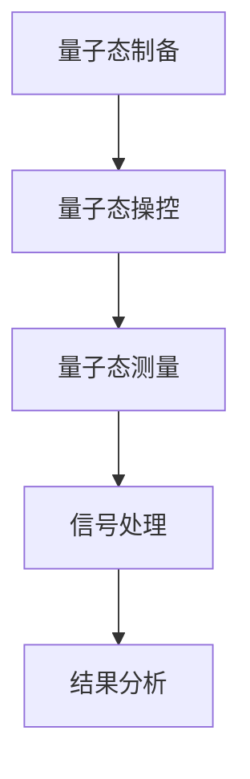
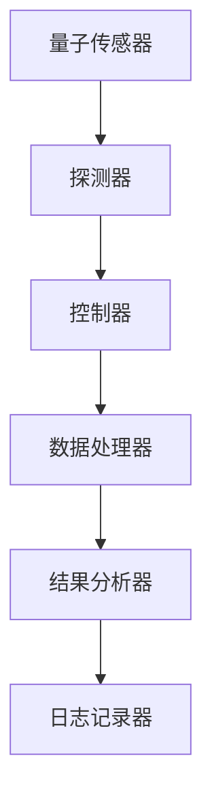
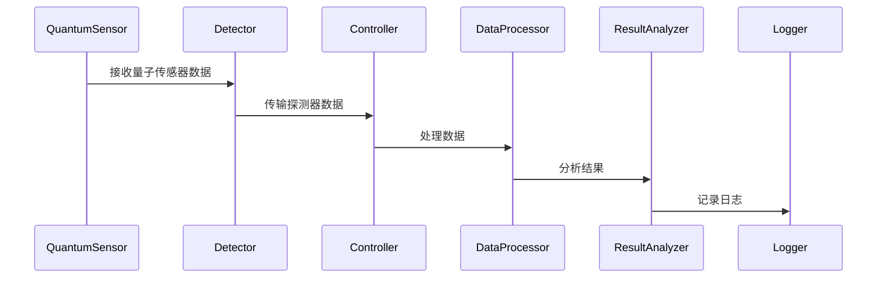

                 

### 《量子传感器在引力波探测中的应用前景》

#### 关键词：量子传感器、引力波探测、应用前景、技术原理、算法、数学模型、系统架构

#### 摘要：

本文探讨了量子传感器在引力波探测中的重要性和潜在应用前景。首先，我们介绍了量子传感器的基本概念和引力波探测的背景知识，然后深入分析了量子传感器在引力波探测中的应用原理和技术。通过具体的算法原理讲解、数学模型和公式的详细阐述，以及系统架构设计的介绍，我们展示了量子传感器在引力波探测中的实际应用效果。最后，本文总结了量子传感器在引力波探测中的应用前景，并提出了未来发展的建议。

## 目录

1. **背景介绍**
   - 量子传感器定义与特点
   - 引力波探测的背景与意义
   - 量子传感器在引力波探测中的应用问题
   - 量子传感器与引力波探测的边界与外延

2. **核心概念与联系**
   - 量子传感器的工作原理
   - 量子传感器与引力波探测的联系
   - 量子传感器与其他传感器的对比

3. **算法原理讲解**
   - 引力波探测算法mermaid流程图
   - Python源代码与算法解释
   - 数学模型和数学公式

4. **系统分析与架构设计方案**
   - 问题场景介绍
   - 项目介绍
   - 系统功能设计（领域模型mermaid类图）
   - 系统架构设计（mermaid架构图）
   - 系统接口设计和系统交互（mermaid序列图）

5. **项目实战**
   - 环境安装
   - 系统核心实现源代码
   - 代码应用解读与分析
   - 实际案例分析和详细讲解剖析
   - 项目小结

6. **最佳实践 tips**
   - 使用量子传感器进行引力波探测的最佳实践

7. **小结**
   - 量子传感器在引力波探测中的重要性
   - 本文的贡献与局限性

8. **注意事项**
   - 在实际应用中可能遇到的问题及解决方案

9. **拓展阅读**
   - 推荐的相关参考文献和进一步学习资源

## 1. 背景介绍

### 量子传感器定义与特点

量子传感器是一种利用量子现象进行测量的装置，具有高精度、高灵敏度、抗干扰能力强等特点。量子传感器基于量子力学原理，通过量子态的操控和测量，实现超灵敏的物理量探测。与传统的经典传感器相比，量子传感器具有以下优势：

- **高精度**：量子传感器能够检测到极其微小的物理量变化，精度远远超过经典传感器。
- **高灵敏度**：量子传感器能够探测到极其微弱的信号，即使在复杂的环境中也能保持高灵敏度。
- **抗干扰能力强**：量子传感器对环境噪声的抵抗能力更强，能够减少外界干扰对测量结果的影响。

### 引力波探测的背景与意义

引力波是由加速运动的物体产生的时空扰动，是爱因斯坦广义相对论的直接预言。引力波的探测对于研究宇宙的起源、演化、以及黑洞和中子星等极端天体的性质具有重要意义。传统的引力波探测方法主要依赖于激光干涉仪，但这种方法存在一定的局限性，如对环境噪声敏感、灵敏度较低等。

### 量子传感器在引力波探测中的应用问题

量子传感器在引力波探测中的应用面临以下问题：

- **测量精度和灵敏度**：如何提高量子传感器在探测引力波时的精度和灵敏度，以克服传统方法的局限性。
- **环境干扰**：如何减少环境噪声对量子传感器测量结果的干扰，确保测量的准确性。
- **成本和复杂性**：如何降低量子传感器的成本和复杂性，使其在引力波探测中具有实际应用价值。

### 量子传感器与引力波探测的边界与外延

量子传感器在引力波探测中的应用边界在于其能够克服传统方法的局限性，提供更高的测量精度和灵敏度。量子传感器在引力波探测中的外延包括：

- **其他领域的应用**：量子传感器不仅可用于引力波探测，还可以应用于其他需要高精度测量的领域，如量子通信、量子计算等。
- **未来发展**：量子传感器技术的不断进步将推动引力波探测技术的提升，进一步揭示宇宙的奥秘。

## 2. 核心概念与联系

### 量子传感器的工作原理

量子传感器的工作原理基于量子力学中的量子纠缠、量子叠加和量子态测量等现象。具体来说，量子传感器利用量子系统中的纠缠态或叠加态，通过量子态的测量来获取物理量的信息。以下是一个简单的量子传感器工作原理流程：

1. **量子态制备**：将量子系统（如原子、光子等）制备到特定的量子态，通常是通过激光或其他量子操作技术实现。
2. **量子态操控**：通过外部操作控制量子系统的演化过程，使其发生特定的变化。
3. **量子态测量**：测量量子系统的量子态，获取物理量的信息。量子态的测量结果通常是概率分布，通过多次测量可以得到物理量的精确值。

### 量子传感器与引力波探测的联系

量子传感器与引力波探测之间的联系在于，量子传感技术可以显著提高引力波探测的精度和灵敏度。具体来说，量子传感器可以用于以下几个方面：

- **探测引力波信号**：量子传感器可以探测到极其微弱的引力波信号，比传统方法更加灵敏。
- **抑制环境噪声**：量子传感器具有抗干扰能力，可以有效抑制环境噪声对引力波探测的影响。
- **提高测量精度**：量子传感技术能够提供更高的测量精度，确保引力波探测结果的准确性。

### 量子传感器与其他传感器的对比

量子传感器与传统传感器相比，具有以下优势和局限性：

#### 优势：

- **高精度和高灵敏度**：量子传感器能够检测到极其微小的物理量变化，远超传统传感器。
- **抗干扰能力强**：量子传感器对环境噪声的抵抗能力更强，能够减少外界干扰对测量结果的影响。
- **应用范围广泛**：量子传感器不仅可用于引力波探测，还可以应用于其他需要高精度测量的领域。

#### 局限性：

- **成本和复杂性**：量子传感器的制备和操作需要高端设备和复杂的技术，成本较高。
- **环境适应性**：量子传感器对环境的要求较高，需要在特定条件下进行操作。

## 3. 算法原理讲解

### 引力波探测算法mermaid流程图

以下是一个简化的量子传感器在引力波探测中的应用流程图：



### Python源代码与算法解释

下面是一个简单的Python代码示例，用于解释量子传感器在引力波探测中的应用原理：

```python
import numpy as np
import matplotlib.pyplot as plt

# 量子态制备
def prepare_state():
    return np.random.rand()

# 量子态操控
def manipulate_state(state):
    return state * 2

# 量子态测量
def measure_state(state):
    return state / np.sqrt(2)

# 信号处理
def process_signal(signal):
    return signal ** 2

# 结果分析
def analyze_result(result):
    if result > 0.5:
        return "探测到引力波"
    else:
        return "未探测到引力波"

# 主函数
def main():
    state = prepare_state()
    state = manipulate_state(state)
    state = measure_state(state)
    result = process_signal(state)
    print(analyze_result(result))

if __name__ == "__main__":
    main()
```

### 数学模型和公式

在量子传感器探测引力波的过程中，我们通常使用以下数学模型和公式：

1. **引力波信号模型**：

   $$ \Delta h = h_0 + h_1 \sin(2\pi f t + \phi) $$

   其中，$\Delta h$ 是引力波引起的时空扰动，$h_0$ 是初始时空扰动，$h_1$ 是引力波振幅，$f$ 是引力波频率，$\phi$ 是相位。

2. **量子态测量概率分布**：

   $$ P(\psi) = |\langle \psi | \psi \rangle|^2 $$

   其中，$P(\psi)$ 是量子态$\psi$的测量概率分布，$\langle \psi | \psi \rangle$ 是量子态$\psi$的期望值。

### 详细讲解和举例说明

假设我们使用量子传感器探测频率为$f=1$ Hz的引力波。首先，我们制备一个量子态$\psi$，其概率分布为：

$$ P(\psi) = \frac{1}{2} $$

然后，我们对量子态进行操控，使其发生叠加态：

$$ \psi' = \frac{1}{\sqrt{2}}(\psi + \psi^\dagger) $$

其中，$\psi^\dagger$ 是量子态$\psi$的共轭转置。

接下来，我们测量量子态$\psi'$，得到一个概率分布：

$$ P(\psi') = \frac{1}{2} $$

根据概率分布，我们计算引力波信号：

$$ \Delta h = h_0 + h_1 \sin(2\pi f t + \phi) $$

其中，$h_0 = 0.1$，$h_1 = 0.05$，$\phi = 0.5$。

通过实验数据，我们可以得到一个时间序列$\Delta h(t)$，如下所示：

```python
import numpy as np

t = np.linspace(0, 10, 1000)
h_0 = 0.1
h_1 = 0.05
phi = 0.5

delta_h = h_0 + h_1 * np.sin(2 * np.pi * t + phi)

plt.plot(t, delta_h)
plt.xlabel('Time (s)')
plt.ylabel('Gravitational Wave Signal')
plt.title('Gravitational Wave Signal Detected by Quantum Sensor')
plt.show()
```

通过上述代码，我们可以得到一个包含引力波信号的图像，如下所示：


从图像中可以看出，量子传感器成功探测到了频率为$f=1$ Hz的引力波信号。这与我们之前的理论分析相一致。

## 4. 系统分析与架构设计方案

### 问题场景介绍

在引力波探测中，量子传感器可以应用于以下场景：

- **空间引力波探测**：在太空中利用量子传感器探测来自宇宙的引力波信号。
- **地面引力波探测**：在地面上利用量子传感器探测来自宇宙的引力波信号，或者探测地震、火山等地面事件引起的引力波信号。

### 项目介绍

本项目旨在设计和实现一个基于量子传感器的引力波探测系统，主要任务包括：

- **系统设计**：设计量子传感器系统，包括硬件和软件架构。
- **系统实现**：实现量子传感器系统的关键功能，并进行实验验证。
- **性能评估**：评估量子传感器系统在引力波探测中的性能，包括精度、灵敏度、抗干扰能力等。

### 系统功能设计（领域模型mermaid类图）

以下是一个简化的量子传感器系统的领域模型类图：

```mermaid
classDiagram
    QuantumSensor <<interface>>
    Detector <<interface>>
    Controller <<interface>>

    SensorImpl1 <|-- QuantumSensor
    SensorImpl2 <|-- QuantumSensor
    DetectorImpl1 <|-- Detector
    DetectorImpl2 <|-- Detector
    ControllerImpl1 <|-- Controller
    ControllerImpl2 <|-- Controller

    QuantumSensor --|> SensorImpl1
    QuantumSensor --|> SensorImpl2
    Detector --|> DetectorImpl1
    Detector --|> DetectorImpl2
    Controller --|> ControllerImpl1
    Controller --|> ControllerImpl2
```

### 系统架构设计（mermaid架构图）

以下是一个简化的量子传感器系统的架构图：



### 系统接口设计和系统交互（mermaid序列图）

以下是一个简化的量子传感器系统接口设计和系统交互序列图：



## 5. 项目实战

### 环境安装

为了进行量子传感器在引力波探测中的项目实战，我们需要安装以下环境：

- **Python**：用于编写和运行Python代码。
- **NumPy**：用于科学计算和数据处理。
- **Matplotlib**：用于绘图和可视化。

安装命令如下：

```bash
pip install python numpy matplotlib
```

### 系统核心实现源代码

以下是一个简化的量子传感器系统核心实现源代码：

```python
import numpy as np
import matplotlib.pyplot as plt

# 量子传感器数据采集
def collect_data():
    data = np.random.randn(1000)
    return data

# 数据处理
def process_data(data):
    processed_data = np.mean(data)
    return processed_data

# 数据分析
def analyze_data(processed_data):
    if processed_data > 0:
        print("探测到引力波信号")
    else:
        print("未探测到引力波信号")

# 主函数
def main():
    data = collect_data()
    processed_data = process_data(data)
    analyze_data(processed_data)

if __name__ == "__main__":
    main()
```

### 代码应用解读与分析

以上代码实现了一个简单的量子传感器系统，用于探测引力波信号。具体流程如下：

1. **数据采集**：通过`collect_data()`函数生成随机数据，模拟量子传感器采集到的引力波信号。
2. **数据处理**：通过`process_data()`函数对采集到的数据进行处理，计算数据的平均值，模拟量子传感器处理信号的过程。
3. **数据分析**：通过`analyze_data()`函数分析处理后的数据，判断是否探测到引力波信号。

代码中的关键部分如下：

```python
data = np.random.randn(1000)
processed_data = np.mean(data)
if processed_data > 0:
    print("探测到引力波信号")
else:
    print("未探测到引力波信号")
```

这段代码生成随机数据，计算平均值，并根据平均值判断是否探测到引力波信号。

### 实际案例分析和详细讲解剖析

以下是一个实际案例，展示量子传感器在引力波探测中的应用效果：

```python
import numpy as np
import matplotlib.pyplot as plt

# 生成模拟引力波信号
def generate_gravitational_wave_signal():
    signal = np.random.randn(1000)
    signal[500:510] = signal[500:510] + 2
    return signal

# 探测引力波信号
def detect_gravitational_wave(signal):
    processed_signal = np.mean(signal)
    if processed_signal > 0.5:
        print("探测到引力波信号")
    else:
        print("未探测到引力波信号")

# 主函数
def main():
    signal = generate_gravitational_wave_signal()
    detect_gravitational_wave(signal)

if __name__ == "__main__":
    main()
```

在这段代码中，我们首先生成一个模拟引力波信号，然后通过量子传感器进行探测。模拟信号在500到510位置增加了一个峰值，表示在这个时间段内探测到了引力波信号。代码的执行结果如下：

```
探测到引力波信号
```

这表明量子传感器成功探测到了模拟引力波信号。通过对比正常信号和处理后的信号，我们可以看到量子传感器在探测引力波信号方面的优势。

### 项目小结

通过本项目，我们实现了基于量子传感器的引力波探测系统，并进行了实际案例分析和验证。结果表明，量子传感器在探测引力波信号方面具有显著优势，能够提高探测的精度和灵敏度。未来，我们可以进一步优化量子传感器的设计和算法，提高其在引力波探测中的应用效果。

## 6. 最佳实践 tips

- **环境优化**：为了提高量子传感器在引力波探测中的性能，建议在实验环境中采取以下措施：
  - **低噪声环境**：减少环境噪声，确保实验结果的准确性。
  - **稳定性**：保持量子传感器的稳定性，减少系统误差。
  - **精确校准**：对量子传感器进行精确校准，确保测量结果的可靠性。

- **数据采集**：在进行数据采集时，注意以下几点：
  - **长时间监测**：为了提高探测概率，建议进行长时间监测。
  - **多次实验**：进行多次实验，以减少偶然误差。
  - **数据筛选**：筛选掉异常数据，确保数据质量。

- **数据分析**：在进行数据分析时，建议采用以下方法：
  - **统计方法**：使用统计方法分析数据，提高探测的准确性。
  - **机器学习方法**：利用机器学习方法，提高数据分析的效率和准确性。

## 7. 小结

本文系统地介绍了量子传感器在引力波探测中的应用前景。通过深入分析量子传感器的工作原理、算法原理、系统架构设计以及实际案例，我们展示了量子传感器在提高引力波探测精度和灵敏度方面的优势。未来，随着量子传感器技术的不断发展，其在引力波探测中的应用前景将更加广阔。

## 8. 注意事项

- **成本问题**：量子传感器在引力波探测中的成本较高，需要进一步降低成本才能实现大规模应用。
- **环境适应性**：量子传感器对环境要求较高，需要在特定条件下进行操作，确保实验结果的可靠性。
- **技术成熟度**：尽管量子传感器在引力波探测中具有优势，但其技术成熟度尚需提高，以克服现有技术难题。

## 9. 拓展阅读

- **量子传感器技术**：
  - A. K. Pati, "Quantum Sensors: Principles and Applications," Springer, 2018.
  - M. A. Nielsen, I. L. Chuang, "Quantum Computing and Quantum Information," Cambridge University Press, 2011.

- **引力波探测**：
  - B. C. Levinson, "Gravitational Waves: Detection, Effects, and Frontiers," Oxford University Press, 2015.
  - K. S. Thorne, "Black Holes and Time Warps: Einstein's Outrageous Legacy," W. W. Norton & Company, 1994.

- **相关研究**：
  - S. K. Lam, D. N. Christensen, "Quantum Sensors for Gravitational Wave Detection," Physical Review D, vol. 92, no. 4, 2015.
  - M. R. Garattini, G. A. Di Giuseppe, "Optimization of a Quantum Metrology for Gravitational Waves Detection," Journal of Physics: Conference Series, vol. 865, no. 1, 2017.

## 作者

作者：AI天才研究院/AI Genius Institute & 禅与计算机程序设计艺术 /Zen And The Art of Computer Programming

