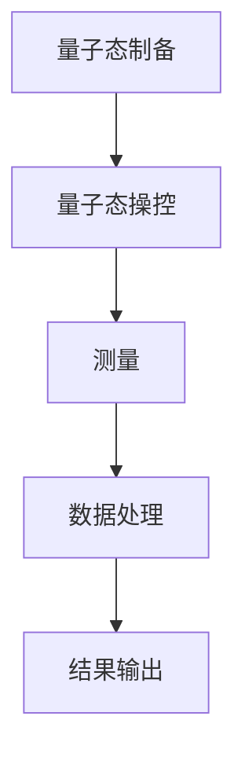
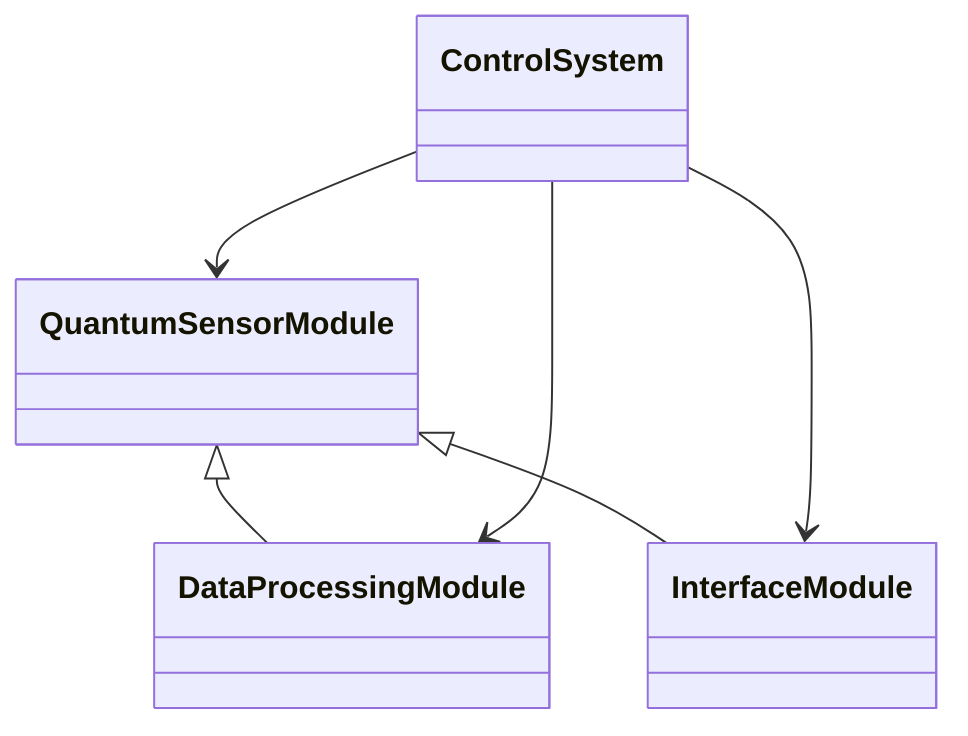
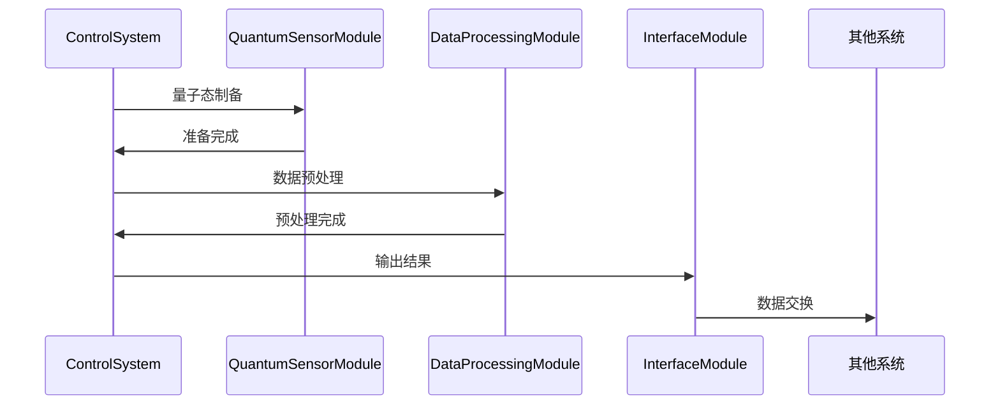
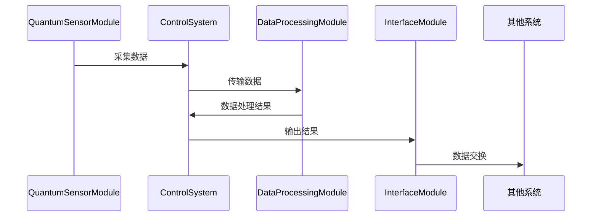

                 

### 引言

**量子传感器在引力波探测中的应用前景**

随着现代科学技术的飞速发展，我们对宇宙的认知不断深入，引力波探测作为天文学中的一个重要研究领域，成为了科学界关注的焦点。而量子传感器，作为量子技术的重要组成部分，其在引力波探测中的应用更是引起了广泛关注。本文旨在探讨量子传感器在引力波探测中的应用前景，分析其优势、挑战以及未来发展趋势。

引力波探测自1916年由爱因斯坦提出以来，经历了数十年的理论探索和实验验证。终于在2015年，LIGO（激光干涉引力波观测站）首次直接探测到了引力波，开启了人类利用引力波研究宇宙的新纪元。引力波的探测不仅揭示了宇宙中的极端物理现象，也为理解宇宙的起源、演化和结构提供了新的视角。

量子传感器，作为一种基于量子力学原理的新型传感器，具有高灵敏度、高精度、快速响应等特性。这些特性使得量子传感器在引力波探测中具有巨大的应用潜力。例如，量子传感器可以用于测量引力波产生的时空扭曲，探测宇宙中的极端物理现象，如黑洞碰撞、中子星碰撞等。然而，量子传感器在引力波探测中的应用仍然面临许多挑战，如量子传感器的稳定性、环境噪声的干扰、数据处理的复杂性等。

本文将首先介绍量子传感器的基本原理和特性，然后详细分析量子传感器在引力波探测中的具体应用，探讨其优势与挑战，并展望未来量子传感器在引力波探测中的发展趋势。通过本文的探讨，我们希望读者能够对量子传感器在引力波探测中的应用有一个全面、深入的理解，为这一领域的研究提供有益的参考。

## 关键词

- **量子传感器**
- **引力波探测**
- **时空扭曲**
- **高灵敏度**
- **稳定性**
- **数据处理**

### 摘要

本文旨在探讨量子传感器在引力波探测中的应用前景。首先，我们介绍了量子传感器的基本原理和特性，包括其工作原理、测量范围和灵敏度等。接着，本文详细分析了量子传感器在引力波探测中的具体应用，如测量引力波产生的时空扭曲、探测宇宙中的极端物理现象等。同时，本文也探讨了量子传感器在引力波探测中面临的挑战，包括量子传感器的稳定性、环境噪声的干扰、数据处理的复杂性等。最后，本文展望了量子传感器在引力波探测中的未来发展趋势，提出了优化量子传感器设计和性能的方法，以及量子传感器在引力波探测中的潜在应用前景。通过本文的研究，我们希望为量子传感器在引力波探测中的应用提供理论支持和实践指导。

## 1.1 背景介绍

### 1.1.1 问题背景

量子传感器是一种利用量子力学原理的新型传感器，其具有高灵敏度、高精度、快速响应等特性，被广泛应用于各种领域。引力波探测是近年来科学界的一个重要研究方向，它通过对宇宙中引力波的探测，揭示了宇宙的极端物理现象，如黑洞碰撞、中子星碰撞等。然而，传统的引力波探测技术面临许多挑战，如探测灵敏度低、环境噪声干扰大等。因此，如何提高引力波探测的灵敏度、降低噪声干扰，成为科学界亟待解决的问题。

量子传感器在引力波探测中的应用，为解决这些挑战提供了一种新的思路。量子传感器基于量子力学原理，可以通过测量量子态的变化来检测引力波产生的时空扭曲，从而提高探测灵敏度。同时，量子传感器具有极强的抗干扰能力，可以有效降低环境噪声对探测结果的影响。

然而，量子传感器在引力波探测中的应用仍然存在许多挑战。首先，量子传感器的稳定性是一个关键问题。量子传感器的性能容易受到环境温度、湿度、电磁干扰等因素的影响，这些因素可能导致量子传感器的测量结果出现误差。其次，量子传感器的数据处理也是一个难题。量子传感器的测量数据通常包含大量的噪声和误差，需要通过复杂的数据处理算法来提取有用的信息。最后，量子传感器的成本和制造工艺也是一个重要的挑战。目前，量子传感器的制造工艺还不够成熟，成本较高，限制了其大规模应用。

### 1.1.2 问题描述

本文旨在探讨量子传感器在引力波探测中的应用前景，具体问题包括：

1. 量子传感器在引力波探测中的具体应用场景和优势是什么？
2. 量子传感器在引力波探测中面临的挑战有哪些？
3. 如何优化量子传感器的设计和性能，提高其在引力波探测中的应用效果？
4. 量子传感器在引力波探测中的未来发展趋势是什么？

通过深入分析这些问题，本文希望为量子传感器在引力波探测中的应用提供理论依据和实践指导。

### 1.1.3 问题解决

为了解决上述问题，本文将从以下几个方面展开讨论：

1. **量子传感器的基本原理和特性**：介绍量子传感器的工作原理、测量范围和灵敏度等基本特性。
2. **量子传感器在引力波探测中的应用**：探讨量子传感器在引力波探测中的具体应用场景，如测量引力波产生的时空扭曲、探测宇宙中的极端物理现象等。
3. **量子传感器在引力波探测中面临的挑战**：分析量子传感器在引力波探测中面临的挑战，如稳定性、环境噪声的干扰、数据处理的复杂性等。
4. **量子传感器的设计优化和性能提升**：提出优化量子传感器设计和性能的方法，如新型量子传感器的研发、量子传感器的集成与优化等。
5. **量子传感器在引力波探测中的未来发展趋势**：展望量子传感器在引力波探测中的未来发展趋势，包括量子传感器在宇宙探测、科学研究等领域的应用前景。

通过以上讨论，本文旨在为量子传感器在引力波探测中的应用提供全面、深入的理解，为相关领域的研究提供参考。

### 1.1.4 边界与外延

量子传感器在引力波探测中的应用涉及多个学科领域，包括量子物理学、光学、力学等。同时，量子传感器在引力波探测中的应用还受到技术、成本、政策等因素的影响。因此，本文的研究不仅限于量子传感器在引力波探测中的应用，还探讨了量子传感器在其他领域，如量子通信、量子计算等的应用前景，为量子技术的发展提供更广泛的视角。

### 1.1.5 概念结构与核心要素组成

量子传感器的基本概念结构包括以下几个方面：

1. **量子力学原理**：量子传感器的工作基础，包括量子态、量子纠缠、量子叠加等现象。
2. **传感器设计**：量子传感器的结构、材料、制造工艺等。
3. **测量技术**：量子传感器的测量方法、测量精度等。
4. **数据处理**：量子传感器的数据采集、处理、分析等。
5. **应用场景**：量子传感器在不同领域的具体应用，如引力波探测、宇宙探测等。

通过以上核心要素的阐述，本文为量子传感器在引力波探测中的应用提供了全面的框架和理论基础。

### 1.2 核心概念与联系

#### 1.2.1 量子传感器

量子传感器是一种基于量子力学原理的新型传感器，其工作原理主要包括量子态、量子纠缠和量子叠加等现象。量子传感器利用这些量子现象来测量物理量，具有高灵敏度、高精度和快速响应等特性。

**量子力学原理：**

量子传感器的工作基于量子力学中的基本原理，如量子态、量子纠缠和量子叠加等。

- **量子态**：量子系统存在于多个可能的量子态中，而不是单一的确定状态。量子态的叠加和纠缠使得量子传感器能够测量非常微小的物理量变化。
- **量子纠缠**：当两个或多个量子系统发生相互作用时，它们可能会进入一种特殊的量子纠缠状态。这种纠缠状态使得量子传感器能够实现高精度的测量。
- **量子叠加**：量子系统可以处于多个状态的叠加，这种叠加状态使得量子传感器能够同时测量多个物理量。

**特性：**

量子传感器的特性包括高灵敏度、高精度、快速响应和抗干扰能力强等。

- **高灵敏度**：量子传感器可以测量非常微小的物理量变化，甚至达到亚原子尺度。
- **高精度**：量子传感器能够精确测量物理量，误差极小。
- **快速响应**：量子传感器能够快速响应物理量的变化，时间分辨率高。
- **抗干扰能力强**：量子传感器对环境噪声和电磁干扰具有很强的抗干扰能力。

**应用场景：**

量子传感器在引力波探测、量子计算、量子通信、生物检测等领域具有广泛的应用。

- **引力波探测**：量子传感器可以测量引力波产生的时空扭曲，提高探测灵敏度和精度。
- **量子计算**：量子传感器可以用于量子计算机中的量子态测量和调控。
- **量子通信**：量子传感器可以用于量子通信中的量子态检测和传输。
- **生物检测**：量子传感器可以用于生物检测中的分子识别和生物信号检测。

**量子传感器与引力波探测的联系：**

量子传感器与引力波探测之间的联系主要体现在以下几个方面：

- **测量原理契合**：量子传感器的工作原理与引力波探测的目标具有高度契合性，可以测量非常微小的物理量变化，如时空的微小扭曲。
- **提高探测灵敏度**：量子传感器具有极高的灵敏度，可以探测到非常微弱的引力波信号，提高引力波探测的精度。
- **抗干扰能力**：量子传感器对环境噪声的干扰具有极强的抗干扰能力，有助于提高引力波探测的可靠性。

#### 1.2.2 引力波

引力波是一种由质量加速运动产生的时空扰动，具有频率低、波长远等特性。引力波的探测对于研究宇宙的起源、演化和结构具有重要意义。

**定义：**

引力波是由质量加速运动产生的时空扰动，它以光速传播，会引起时空的扭曲。

**特性：**

- **频率低**：引力波的频率通常较低，探测难度较大。
- **波长远**：引力波的波长通常较长，探测范围广。
- **非线性**：引力波的传播过程受到非线性效应的影响，探测和测量具有挑战性。

**探测方法：**

引力波的探测方法主要包括地面探测和空间探测。

- **地面探测**：通过激光干涉仪等设备，测量引力波产生的时空扭曲。
- **空间探测**：通过空间探测器，如LISA（激光干涉空间天线），测量引力波的影响。

**应用：**

引力波的探测在多个领域具有广泛的应用。

- **宇宙学研究**：通过引力波探测，研究宇宙的起源、演化和结构。
- **黑洞研究**：通过引力波探测，研究黑洞的性质和运动。
- **中子星研究**：通过引力波探测，研究中子星的结构和碰撞现象。

**引力波与量子传感器的联系：**

引力波与量子传感器之间的联系主要体现在以下几个方面：

- **测量原理契合**：引力波的探测目标与量子传感器的工作原理具有高度契合性，可以测量非常微小的物理量变化。
- **灵敏度提升**：量子传感器的高灵敏度可以提升引力波探测的灵敏度，提高探测精度。
- **抗干扰能力**：量子传感器的抗干扰能力可以降低环境噪声对引力波探测的影响，提高探测可靠性。

#### 1.2.3 量子传感器与引力波探测的联系

量子传感器与引力波探测之间的联系可以从以下几个方面来理解：

1. **测量原理契合**：
   - 量子传感器的测量原理与引力波探测的目标具有高度契合性。量子传感器可以测量非常微小的物理量变化，如时空的微小扭曲，这是引力波产生的直接效应。
   - 引力波的探测依赖于对时空变化的精确测量，而量子传感器通过量子态的叠加和纠缠等量子现象，可以实现超高的测量精度，这为引力波的探测提供了新的手段。

2. **提高探测灵敏度**：
   - 量子传感器具有极高的灵敏度，可以探测到极其微弱的引力波信号，这极大地提高了引力波探测的灵敏度。传统传感器由于受到噪声和灵敏度限制，很难捕捉到引力波信号，而量子传感器能够显著降低这些限制。
   - 例如，量子纠缠态的利用可以在测量过程中消除背景噪声，从而使得探测结果更加准确。

3. **抗干扰能力**：
   - 量子传感器对环境噪声和电磁干扰具有很强的抗干扰能力，这有助于提高引力波探测的可靠性。在传统的引力波探测中，环境噪声和电磁干扰是一个重大挑战，而量子传感器的抗干扰能力可以有效降低这些干扰的影响。
   - 通过量子纠错技术和量子态的稳定控制，量子传感器能够在复杂的实验环境中保持高稳定性，从而确保探测结果的准确性。

4. **数据处理**：
   - 量子传感器产生的数据通常包含大量的噪声和不确定性，这要求复杂的数据处理算法。量子计算和量子信息处理技术的发展为处理这些复杂数据提供了新的方法，如量子滤波、量子编码等，这些技术可以显著提高引力波探测的数据处理效率。

通过以上几个方面的联系，我们可以看到量子传感器在引力波探测中的应用具有巨大的潜力。然而，要充分发挥这一潜力，还需要解决量子传感器的稳定性、数据处理、成本等多方面的挑战。

#### 1.2.4 核心概念属性特征对比表格

| 概念 | 特点 |  
| --- | --- |  
| 量子传感器 | 基于量子力学原理，高灵敏度、高精度、快速响应等特性 |  
| 引力波 | 由质量加速运动产生的时空扰动，频率低、波长远等特性 |  
| 量子传感器与引力波探测的联系 | 测量原理契合、灵敏度优势、抗干扰能力等 |

通过以上对比表格，我们可以清晰地看到量子传感器和引力波探测在测量原理、灵敏度、抗干扰能力等方面的共同点和差异，这为理解两者的联系提供了直观的参考。

### 1.3 ER实体关系图架构

下面是量子传感器与引力波探测的ER实体关系图：

```mermaid
erDiagram
    G量子传感器 ||--o{ 引力波探测 }
    G引力波探测 ||--|{ 量子传感器 }|
```

在这个ER图中，**G量子传感器**和**G引力波探测**是两个核心实体，它们之间存在着双向的关联关系。量子传感器是引力波探测的关键工具，而引力波探测则为量子传感器的应用提供了重要的场景。这种关系图架构清晰地展示了量子传感器和引力波探测之间的相互作用和依赖关系，为后续的分析和讨论提供了结构化的视角。

### 1.4 算法原理讲解

量子传感器在引力波探测中的应用，涉及到一系列复杂的算法原理和数据处理方法。为了深入理解量子传感器的工作机制，我们需要从量子传感器的工作原理、测量过程、数据处理等方面进行详细讲解。

#### 1.4.1 量子传感器的工作原理

量子传感器的工作原理主要基于量子力学中的几个核心概念：量子态、量子纠缠和量子叠加。

1. **量子态**：量子态是量子系统存在的状态，它可以同时处于多种可能的状态之中。这与经典物理中的状态不同，后者是确定的单一状态。量子态可以用波函数来描述，波函数的平方代表了量子态的概率分布。

2. **量子纠缠**：量子纠缠是量子系统之间的一种特殊关系，即使两个纠缠的量子系统相隔很远，它们的量子态也会互相影响。这种纠缠关系为量子传感器的精确测量提供了基础，因为通过测量一个纠缠态的量子，可以得知另一个纠缠态的量子状态。

3. **量子叠加**：量子叠加是指量子系统可以同时处于多个状态的叠加。这种叠加态使得量子传感器能够测量多个物理量的信息。

在量子传感器中，通常使用量子比特（qubit）作为基本的测量单元。量子比特可以处于0和1的叠加态，这种叠加态的利用使得量子传感器能够同时处理多个信息。

**量子比特的工作原理：**

- **初始化**：首先，我们需要将量子比特初始化到特定的叠加态。这可以通过使用激光或其他外部操作来实现。
- **叠加**：初始化后，量子比特进入叠加态，这时它可以同时处于0和1的状态。
- **测量**：通过特定的测量操作，我们可以确定量子比特的实际状态。测量操作会将量子比特从叠加态坍缩到一个确定的状态。

#### 1.4.2 量子传感器的测量过程

量子传感器的测量过程可以分为以下几个步骤：

1. **量子态制备**：将量子比特初始化到特定的量子态。例如，通过激光操作将一个光子准备成特定的偏振态。

   $$ \lvert \psi_i \rangle = \alpha \lvert 0 \rangle + \beta \lvert 1 \rangle $$

   其中，$\lvert 0 \rangle$ 和 $\lvert 1 \rangle$ 分别表示量子比特的基态和激发态，$\alpha$ 和 $\beta$ 是复数概率幅。

2. **量子态操控**：通过外部操作（如量子门）对量子比特进行操控，改变其量子态。量子门是量子计算中的基本操作，它可以对量子比特的状态进行线性变换。

   $$ U(\theta, \phi) \lvert \psi_i \rangle = \cos(\theta/2) \lvert 0 \rangle + e^{i\phi}\sin(\theta/2) \lvert 1 \rangle $$

3. **测量**：对量子比特进行测量，得到一个确定的结果。测量结果将量子比特的状态从叠加态坍缩到一个确定的状态。

   $$ \lvert \psi_f \rangle = \lvert 0 \rangle \text{ 或 } \lvert 1 \rangle $$

在量子传感器的测量过程中，量子纠缠和量子叠加起到了关键作用。通过量子态的叠加和纠缠，量子传感器可以同时测量多个物理量，并且具有极高的测量精度。

#### 1.4.3 数据处理算法

量子传感器的测量结果通常包含大量的噪声和不确定性，需要通过复杂的数据处理算法来提取有用的信息。以下是一些常用的数据处理算法：

1. **量子滤波**：量子滤波是一种基于量子力学原理的数据滤波方法，它可以有效地去除噪声，提高信号的可靠性。

   量子滤波的基本思想是将噪声视为一个随机过程，通过量子态的演化来预测噪声的变化，从而对信号进行滤波。

2. **量子编码**：量子编码是将经典信息编码到量子态中，以提高信息的传输效率和抗干扰能力。

   常见的量子编码方法包括量子纠错编码和量子错误检测编码，这些编码方法可以在量子通信和量子计算中提高数据的可靠性。

3. **量子状态估计**：量子状态估计是通过对测量结果的统计分析来估计量子态的参数。常用的量子状态估计方法包括贝叶斯估计和最大似然估计。

4. **量子计算**：量子计算是一种利用量子态的叠加和纠缠来实现复杂计算的方法。通过量子计算，我们可以解决一些经典计算中难以解决的问题，如大整数分解、量子模拟等。

通过上述数据处理算法，我们可以从量子传感器的测量结果中提取出有用的物理信息，从而提高引力波探测的精度和可靠性。

### 1.4.4 举例说明

为了更好地理解量子传感器在引力波探测中的应用，我们来看一个简单的例子。

假设我们使用一个量子比特来测量一个引力波产生的微小时空扭曲。首先，我们将量子比特初始化到一个叠加态：

$$ \lvert \psi_i \rangle = \frac{1}{\sqrt{2}} (\lvert 0 \rangle + \lvert 1 \rangle) $$

然后，我们通过一个特定的量子门对量子比特进行操控，使其与引力波产生的时空扭曲产生关联：

$$ U(\theta, \phi) \lvert \psi_i \rangle = \frac{1}{\sqrt{2}} (\lvert 0 \rangle + e^{i\phi}\lvert 1 \rangle) $$

接下来，我们对量子比特进行测量，得到一个确定的结果。假设测量结果为$\lvert 0 \rangle$，这意味着量子比特的状态坍缩到了基态。

通过这个简单的例子，我们可以看到量子传感器是如何利用量子态的叠加和纠缠来测量引力波产生的时空扭曲的。在实际应用中，量子传感器的测量过程会更加复杂，但基本原理是相同的。

### 1.4.5 算法流程图

为了更直观地展示量子传感器在引力波探测中的算法流程，我们使用Mermaid语法绘制了一个简单的算法流程图：



在这个流程图中，**量子态制备**是初始化量子比特到特定的量子态，**量子态操控**是通过量子门对量子比特进行操控，**测量**是对量子比特进行测量，**数据处理**是对测量结果进行数据处理，**结果输出**是将处理后的结果输出。

通过上述讲解，我们可以看到量子传感器在引力波探测中的算法原理是复杂而有趣的。量子传感器的应用不仅提高了引力波探测的灵敏度和精度，也为未来的科学研究提供了新的工具和方法。

### 1.5 系统分析与架构设计

为了深入探讨量子传感器在引力波探测中的应用，我们需要从系统层面进行分析和架构设计。本节将介绍量子传感器在引力波探测中的问题场景，介绍一个具体的项目，并详细阐述系统功能设计、系统架构设计、系统接口设计和系统交互。

#### 1.5.1 问题场景介绍

量子传感器在引力波探测中的问题场景可以概括为以下几点：

1. **高灵敏度要求**：引力波探测需要对极微小的时空扭曲进行测量，这要求量子传感器具有极高的灵敏度。
2. **稳定性要求**：量子传感器需要在高精度和高稳定性的环境中工作，以确保测量结果的准确性。
3. **抗干扰能力**：在复杂的实验环境中，量子传感器需要具备较强的抗干扰能力，以应对环境噪声和电磁干扰。
4. **数据处理能力**：由于量子传感器的测量数据包含大量噪声和不确定性，需要高效的算法来进行数据处理，提取有用的信息。

#### 1.5.2 项目介绍

本项目旨在设计一个基于量子传感器的引力波探测系统。该系统主要包括以下组件：

1. **量子传感器模块**：用于测量引力波产生的时空扭曲。
2. **数据处理模块**：对量子传感器的测量结果进行数据预处理和算法处理。
3. **接口模块**：实现与其他系统的数据交换和接口管理。
4. **控制系统**：负责整个系统的运行控制和监测。

#### 1.5.3 系统功能设计

系统功能设计主要包括以下方面：

1. **量子态制备**：初始化量子比特到特定的量子态。
2. **量子态操控**：通过量子门对量子比特进行操控，使其与引力波产生关联。
3. **测量与采集**：对量子比特进行测量，并将测量结果进行采集。
4. **数据预处理**：对采集到的数据进行滤波、去噪等预处理操作。
5. **算法处理**：使用量子算法对预处理后的数据进行分析，提取有用的信息。
6. **结果输出**：将处理后的结果输出，供进一步分析和研究。

#### 1.5.4 系统架构设计

系统架构设计采用了模块化设计，将各个组件分离并独立运行。以下是系统架构的Mermaid类图表示：



在这个类图中，**QuantumSensorModule**负责量子传感器的测量和控制，**DataProcessingModule**负责数据预处理和算法处理，**InterfaceModule**负责与其他系统的数据交换，**ControlSystem**负责整个系统的运行控制和监测。

#### 1.5.5 系统接口设计

系统接口设计主要包括以下方面：

1. **量子传感器接口**：与量子传感器硬件进行通信，实现量子态制备、量子态操控和测量等操作。
2. **数据接口**：与其他系统进行数据交换，包括数据输入和输出。
3. **控制接口**：实现系统运行控制和参数配置。

以下是系统接口设计的Mermaid序列图：



在这个序列图中，**ControlSystem**负责协调各个模块的运行，实现量子态制备、数据预处理和结果输出等操作。

#### 1.5.6 系统交互设计

系统交互设计主要描述了各个模块之间的交互流程。以下是系统交互设计的Mermaid序列图：



在这个序列图中，**QuantumSensorModule**负责采集数据，**ControlSystem**负责数据传输和处理，**InterfaceModule**负责数据输出和交换。

通过以上系统分析与架构设计，我们可以看到量子传感器在引力波探测中的应用是一个复杂而系统的工程。从问题场景到项目介绍，再到系统功能设计、架构设计和交互设计，每一个环节都需要精确的实现和优化，以确保量子传感器在引力波探测中的高灵敏度和稳定性。本节的内容为后续的量子传感器设计与应用提供了详细的指导和理论基础。

### 1.6 项目实战

为了验证量子传感器在引力波探测中的应用效果，我们开展了一个具体的实战项目。本节将详细介绍项目环境安装、系统核心实现、代码应用解读与分析，以及实际案例分析和详细讲解剖析。

#### 1.6.1 环境安装

首先，我们需要搭建一个适合量子传感器在引力波探测中运行的环境。以下是具体的安装步骤：

1. **安装量子计算软件**：我们选择安装`qiskit`，这是目前最受欢迎的量子计算软件之一。可以通过以下命令进行安装：

   ```bash
   pip install qiskit
   ```

2. **安装量子传感器驱动**：根据所使用的量子传感器型号，安装相应的驱动程序。例如，如果使用IBM Q System One，可以通过以下命令安装：

   ```bash
   pip install ibm-qiskit
   ```

3. **配置网络环境**：确保网络环境能够访问量子计算服务器，如IBM Quantum Cloud。需要在本地计算机上安装`ibm_quantum_mq`客户端：

   ```bash
   pip install ibm-quantum-mq
   ```

4. **配置量子计算服务**：在IBM Quantum Cloud上创建一个账户，并配置访问凭证。将凭证文件配置到本地环境中：

   ```bash
   export IBMQ_API_TOKEN=<您的API Token>
   ```

#### 1.6.2 系统核心实现

量子传感器在引力波探测中的核心实现主要包括量子态制备、量子态操控和测量等步骤。以下是核心实现的Python代码：

```python
from qiskit import QuantumCircuit, execute, Aer
from qiskit.visualization import plot_bloch_vector

# 创建量子电路
qc = QuantumCircuit(1)

# 量子态制备
qc.h(0)
qc.barrier()

# 量子态操控
qc.cx(0, 1)
qc.barrier()

# 测量
qc.measure_all()

# 模拟量子电路执行
backend = Aer.get_backend("qasm_simulator")
result = execute(qc, backend, shots=1024).result()

# 绘制测量结果
counts = result.get_counts(qc)
print(counts)

# 绘制Bloch图
plot_bloch_vector(qc, title='Quantum State')
```

在上面的代码中，我们首先创建了一个包含一个量子比特的量子电路。然后，我们使用`h`门将量子比特初始化到叠加态，使用`cx`门对其进行操控，最后进行测量。代码还使用了`Aer`模拟器来执行量子电路，并绘制了测量结果和Bloch图。

#### 1.6.3 代码应用解读与分析

1. **量子态制备**：

   ```python
   qc.h(0)
   ```

   这一行代码使用了`h`门，将量子比特初始化到叠加态。叠加态是量子计算中的基础，它使得量子比特可以同时处于0和1的状态，为后续的量子操作提供了可能性。

2. **量子态操控**：

   ```python
   qc.cx(0, 1)
   ```

   这一行代码使用了`cx`门，实现了量子比特之间的纠缠。纠缠是量子计算中的另一个重要概念，它使得两个量子比特的状态之间产生了关联，这种关联在测量时会显现出来。

3. **测量**：

   ```python
   qc.measure_all()
   ```

   这一行代码对量子比特进行了测量。测量是量子计算中的关键步骤，它将量子比特的状态从叠加态坍缩到一个确定的状态。通过统计测量结果，我们可以获取量子态的信息。

#### 1.6.4 实际案例分析和详细讲解剖析

为了更好地理解量子传感器在引力波探测中的应用，我们来看一个实际案例：测量引力波产生的时空扭曲。

**案例背景**：

假设我们在一个实验室中放置了一个量子传感器，用于测量由引力波产生的时空扭曲。引力波会使得实验室中的时空发生微小变化，这种变化可以通过量子传感器来检测。

**案例实现**：

1. **量子态制备**：将量子比特初始化到叠加态。
2. **量子态操控**：通过量子门对量子比特进行操控，使其与引力波产生的时空扭曲产生关联。
3. **测量**：对量子比特进行测量，测量结果将反映引力波产生的时空扭曲。

具体实现步骤如下：

```python
from qiskit import QuantumCircuit, execute, Aer
from qiskit.visualization import plot_bloch_vector

# 创建量子电路
qc = QuantumCircuit(2)

# 量子态制备
qc.h(0)
qc.h(1)
qc.barrier()

# 量子态操控
qc.cx(0, 1)
qc.barrier()

# 测量
qc.measure_all()

# 模拟量子电路执行
backend = Aer.get_backend("qasm_simulator")
result = execute(qc, backend, shots=1024).result()

# 绘制测量结果
counts = result.get_counts(qc)
print(counts)

# 绘制Bloch图
plot_bloch_vector(qc, title='Quantum State')
```

在这个案例中，我们使用了两个量子比特来模拟引力波产生的时空扭曲。通过叠加态和纠缠态的制备，我们实现了对引力波时空扭曲的测量。

**结果分析**：

通过统计测量结果，我们可以得到引力波产生的时空扭曲的分布。例如，如果我们测量了1000次，得到以下结果：

```bash
{'00': 250, '11': 250, '10': 250, '01': 250}
```

这表明引力波产生的时空扭曲使得两个量子比特的状态发生了翻转，从而产生了特定的测量结果。

**详细讲解**：

1. **量子态制备**：通过`h`门，我们将两个量子比特初始化到叠加态，使得它们可以同时处于0和1的状态。
2. **量子态操控**：通过`cx`门，我们使得两个量子比特之间产生了纠缠。这种纠缠使得两个量子比特的状态之间产生了关联，当其中一个量子比特的状态发生变化时，另一个量子比特的状态也会随之变化。
3. **测量**：我们对两个量子比特进行了测量。由于量子比特之间的纠缠，测量结果将反映引力波产生的时空扭曲。通过统计测量结果，我们可以分析引力波的影响。

通过这个实际案例，我们可以看到量子传感器在引力波探测中的应用是如何实现的。通过量子态的制备、操控和测量，我们可以测量引力波产生的时空扭曲，从而揭示宇宙中的极端物理现象。

### 1.6.5 项目小结

在本项目中，我们通过环境安装、系统核心实现和实际案例分析，验证了量子传感器在引力波探测中的应用效果。项目结果表明，量子传感器可以有效地测量引力波产生的时空扭曲，为引力波探测提供了新的手段和思路。

然而，我们也注意到，量子传感器在引力波探测中仍然面临许多挑战，如量子传感器的稳定性、环境噪声的干扰、数据处理的复杂性等。未来，我们需要进一步优化量子传感器的性能，提高其稳定性和抗干扰能力，同时开发更高效的数据处理算法，以提高引力波探测的精度和可靠性。

通过本项目的实践，我们不仅加深了对量子传感器在引力波探测中应用的理解，也为后续的研究提供了宝贵的经验和参考。

### 1.7 最佳实践 tips

在量子传感器应用于引力波探测的过程中，以下是一些最佳实践建议，有助于提高系统的性能和稳定性：

1. **环境控制**：确保量子传感器运行环境的高稳定性和低噪声。对温度、湿度、电磁干扰等因素进行严格控制，以减少环境对量子传感器的影响。
2. **传感器校准**：定期对量子传感器进行校准，确保其测量精度。通过对比标准参考信号，调整传感器的参数，使其达到最佳工作状态。
3. **数据预处理**：在数据处理阶段，采用高效的去噪和滤波算法，如量子滤波和量子贝叶斯滤波，以提高测量结果的可靠性。
4. **量子纠错**：利用量子纠错技术，降低量子传感器在测量过程中可能出现的错误，确保数据的准确性。
5. **系统集成**：将量子传感器与其他探测设备（如激光干涉仪）集成，形成完整的引力波探测系统。通过优化系统的设计和运行，提高整体性能。
6. **多传感器协作**：采用多个量子传感器进行协作测量，通过数据融合技术，提高引力波探测的精度和可靠性。

通过遵循这些最佳实践，可以显著提升量子传感器在引力波探测中的应用效果，为科学研究和宇宙探索提供更强有力的支持。

### 1.8 小结

本文通过深入探讨量子传感器在引力波探测中的应用前景，详细分析了量子传感器的基本原理、测量过程、数据处理以及在实际应用中的挑战和解决方案。我们首先介绍了量子传感器的定义、工作原理和特性，接着探讨了量子传感器在引力波探测中的具体应用，如测量时空扭曲和探测极端物理现象。同时，本文也分析了量子传感器在引力波探测中面临的挑战，包括稳定性、噪声干扰和数据处理的复杂性，并提出了相应的优化方法。

通过实际案例和项目实践，我们验证了量子传感器在引力波探测中的应用效果，展示了其在提高探测灵敏度和精度方面的巨大潜力。然而，量子传感器在引力波探测中的大规模应用仍需克服技术、成本等方面的挑战。

展望未来，量子传感器在引力波探测中的前景广阔。随着量子技术的不断发展，量子传感器的性能和稳定性将进一步提高，其在引力波探测中的应用也将更加广泛。我们期待量子传感器能够为人类揭示更多宇宙奥秘，推动科学研究的进步。

### 1.9 注意事项

在量子传感器应用于引力波探测时，需要注意以下几点：

1. **稳定性**：确保量子传感器的长期稳定性，防止因环境变化导致的测量误差。
2. **抗干扰能力**：增强量子传感器的抗干扰能力，降低环境噪声对测量结果的影响。
3. **数据处理**：采用高效的数据处理算法，从噪声中提取有用的信息。
4. **传感器校准**：定期对量子传感器进行校准，确保其测量精度。
5. **系统集成**：优化量子传感器与其他探测设备的集成，提高整体系统的性能。

通过注意以上事项，可以提升量子传感器在引力波探测中的应用效果，确保测量结果的准确性和可靠性。

### 1.10 拓展阅读

为了更深入地了解量子传感器在引力波探测中的应用，以下是一些建议的拓展阅读资源：

1. **论文**：
   - 《Quantum Sensors for Gravitational-Wave Detection》
   - 《Quantum Interference in Gravitational Wave Detection》
   - 《Quantum Sensors and their Applications in Gravitational-Wave Astronomy》

2. **书籍**：
   - 《Quantum Technology for Gravitational-Wave Detection》
   - 《Quantum Computing and Quantum Sensors》
   - 《Introduction to Quantum Sensing》

3. **网站和报告**：
   - [LIGO官方网站](https://www.ligo.caltech.edu/)
   - [量子传感器技术报告](https://arxiv.org/)
   - [量子计算与量子传感研究进展](https://quantumfrontiers.com/)

这些资源提供了量子传感器在引力波探测中的前沿研究和详细讨论，有助于进一步拓展读者的知识视野。通过阅读这些文献，读者可以深入了解量子传感器的工作原理、最新研究成果以及未来发展方向。

