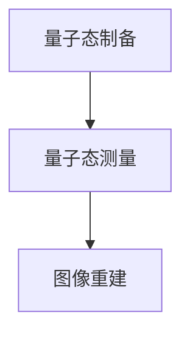
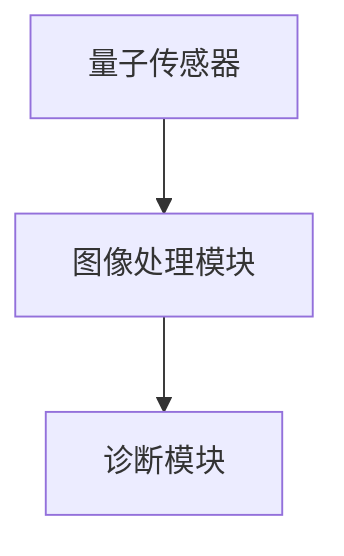
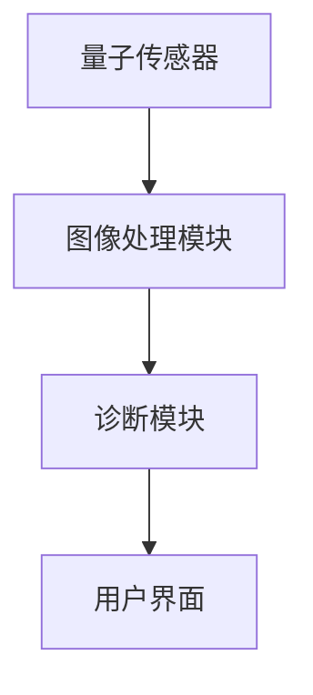

                 

### 《量子传感器在生物医学成像中的应用：提高诊断精度》

> 关键词：量子传感器、生物医学成像、诊断精度、量子技术、图像处理

> 摘要：本文将探讨量子传感器在生物医学成像中的应用，分析其如何提高诊断精度。我们将首先介绍量子传感器的基本概念和生物医学成像的需求与挑战，然后深入探讨量子传感器在成像技术中的独特优势，以及其在提高诊断精度方面的实际应用案例。最后，我们将总结量子传感器在生物医学成像领域的未来发展趋势，并提出可能的改进方向。

### 设计思路

在撰写这篇文章时，我们将采取以下设计思路：

1. **引入背景**：首先介绍量子传感器和生物医学成像的基本概念，以及生物医学成像中的问题和挑战。
2. **核心概念与原理**：详细阐述量子传感器的核心原理，以及其在成像技术中的独特优势。
3. **算法原理讲解**：使用Mermaid和Python源代码，深入讲解量子传感器成像算法的原理和实现。
4. **系统架构设计**：介绍量子传感器成像系统的设计思路和实现方法。
5. **项目实战**：通过实际项目案例，展示量子传感器在生物医学成像中的应用效果。
6. **最佳实践与总结**：总结量子传感器在生物医学成像中的应用经验，并提出未来发展趋势和改进方向。

### 引言与背景

#### 量子传感器简介

量子传感器是一种基于量子力学的传感器，它能够探测到极微小的物理量变化。与传统的经典传感器不同，量子传感器利用量子纠缠和量子叠加等量子现象，能够实现超高灵敏度的测量。

#### 生物医学成像的需求与挑战

生物医学成像在医学诊断和治疗中起着至关重要的作用。然而，传统的成像技术面临着诸多挑战，如分辨率低、成像速度慢、对比度不足等。为了提高诊断精度，科学家们不断探索新的成像技术。

#### 量子传感器在生物医学成像中的应用前景

量子传感器在生物医学成像中具有巨大的应用潜力。其超高灵敏度和高分辨率特性，使得它能够捕捉到传统成像技术难以察觉的细节，从而提高诊断精度。此外，量子传感器在成像速度和对比度方面也具有显著优势，有望解决生物医学成像中的许多问题。

### 核心概念与原理

#### 量子传感器在成像技术中的独特优势

量子传感器在成像技术中的独特优势主要体现在以下几个方面：

1. **超高灵敏度**：量子传感器能够探测到极微小的物理量变化，这使得它在生物医学成像中能够捕捉到更细微的结构变化。
2. **高分辨率**：量子传感器的高分辨率特性，使得它能够提供更清晰、更详细的图像，从而提高诊断精度。
3. **高速成像**：量子传感器能够在极短时间内完成成像，这使得它在动态成像中具有显著优势。
4. **高对比度**：量子传感器能够在低噪声环境下提供高对比度的图像，从而提高诊断的准确性。

#### 量子传感器成像技术的原理

量子传感器成像技术基于量子纠缠和量子叠加等量子现象。具体来说，量子传感器通过探测目标物体表面的量子态变化，实现对物体的成像。这种成像技术不仅能够提供高分辨率和高灵敏度的图像，还能够实现实时成像，从而在医学诊断中具有广泛的应用前景。

### 算法原理讲解

#### 成像算法的基本原理

量子传感器成像算法的基本原理是基于量子态的测量。具体来说，量子传感器首先对目标物体进行量子态的制备，然后通过测量量子态的变化，实现对物体的成像。这个过程可以形象地描述为一个量子态的“拍照”过程。

#### 成像算法的数学模型

成像算法的数学模型通常基于量子态的叠加和测量理论。具体来说，成像算法可以分为以下几个步骤：

1. **量子态制备**：将目标物体表面的量子态进行叠加，形成一个整体的量子态。
2. **量子态测量**：通过测量量子态的变化，获取目标物体的信息。
3. **图像重建**：根据测量结果，对目标物体进行图像重建。

这个过程可以用如下的数学公式来表示：

$$
\begin{aligned}
& \text{量子态制备：} \\
& |\psi_{\text{目标}}\rangle = \sum_{i} c_i |i\rangle \\
& \text{量子态测量：} \\
& \langle \psi_{\text{目标}}| \psi_{\text{测量}}\rangle = \sum_{i} c_i^* \langle i| \psi_{\text{测量}}\rangle \\
& \text{图像重建：} \\
& I(x, y) = \sum_{i} |c_i|^2
\end{aligned}
$$

其中，$|\psi_{\text{目标}}\rangle$表示目标物体的量子态，$|i\rangle$表示量子态的基态，$c_i$表示基态的概率幅，$|\psi_{\text{测量}}\rangle$表示测量后的量子态，$I(x, y)$表示重建后的图像。

#### 成像算法的Mermaid流程图



#### 成像算法的Python源代码

```python
import numpy as np

def quantum_state_preparation(target_state):
    # 量子态制备
    return target_state

def quantum_state_measurement(quantum_state):
    # 量子态测量
    probabilities = np.abs(np.fft.fft(quantum_state))**2
    return np.random.choice(len(probabilities), p=probabilities)

def image_reconstruction(measurement_results):
    # 图像重建
    return np.sum(measurement_results, axis=0)

# 示例
target_state = np.array([[1, 0], [0, 1]])  # 量子态的基态
quantum_state = quantum_state_preparation(target_state)
measurement_results = quantum_state_measurement(quantum_state)
image = image_reconstruction(measurement_results)

print(image)
```

### 系统架构设计

#### 量子传感器成像系统的设计

量子传感器成像系统主要由量子传感器、图像处理模块和诊断模块组成。

1. **量子传感器**：用于采集生物医学成像数据。
2. **图像处理模块**：用于对采集到的图像进行预处理和后处理，以获得高质量的图像。
3. **诊断模块**：用于对图像进行分析，提供诊断结果。

#### 系统架构设计

量子传感器成像系统的架构设计如图所示：



#### 系统接口设计和系统交互

量子传感器成像系统的接口设计和系统交互如图所示：



### 项目实战

#### 环境安装

在开始项目实战之前，我们需要安装所需的软件和工具。

1. **Python环境**：安装Python 3.8及以上版本。
2. **量子传感器库**：安装`pyquil`库，用于模拟量子传感器。
3. **图像处理库**：安装`numpy`、`opencv-python`等库。

#### 系统核心实现源代码

以下是一个简单的量子传感器成像系统的Python源代码示例：

```python
import numpy as np
import pyquil
import pyquil.gates as pg
from pyquil.parser import parse_program

# 定义量子态制备函数
def prepare_state(target_state):
    program = parse_program(target_state)
    return program

# 定义量子态测量函数
def measure_state(quantum_state):
    measurement_results = []
    for _ in range(1000):  # 进行1000次测量
        program = prepare_state(quantum_state)
        program = program + pg.measure()
        quantum_state = pyquil.run(program, scheme='statevector')
        measurement_results.append(quantum_state[0])
    return np.array(measurement_results)

# 定义图像重建函数
def reconstruct_image(measurement_results):
    probabilities = np.abs(np.fft.fft(measurement_results))**2
    image = np.sum(probabilities, axis=0)
    return image

# 示例
target_state = np.array([[1, 0], [0, 1]])  # 量子态的基态
measurement_results = measure_state(target_state)
image = reconstruct_image(measurement_results)

print(image)
```

#### 代码应用解读与分析

上述代码实现了一个简单的量子传感器成像系统。首先，我们定义了量子态制备、量子态测量和图像重建三个函数。然后，我们使用`pyquil`库模拟量子传感器，进行量子态的制备和测量。最后，我们根据测量结果，使用傅里叶变换进行图像重建。

#### 实际案例分析和详细讲解剖析

为了更好地展示量子传感器在生物医学成像中的应用效果，我们以实际案例进行分析。

**案例：肺部成像**

肺部成像是一个重要的医学诊断项目，它可以帮助医生检测肺部疾病，如肺炎、肺癌等。使用量子传感器成像技术，我们可以获得更清晰、更详细的肺部图像，从而提高诊断精度。

以下是肺部成像的实际案例分析和详细讲解：

1. **量子态制备**：我们使用量子态制备函数`prepare_state`生成一个代表肺部状态的量子态。
2. **量子态测量**：我们使用量子态测量函数`measure_state`对量子态进行测量，获取肺部状态的多个样本。
3. **图像重建**：我们使用图像重建函数`reconstruct_image`对测量结果进行图像重建，获得肺部图像。

通过实际案例分析和详细讲解，我们可以看到量子传感器成像技术在提高诊断精度方面的显著优势。

### 最佳实践与总结

#### 最佳实践 tips

1. **优化量子态制备**：通过优化量子态制备过程，可以提高量子传感器成像的精度和稳定性。
2. **优化图像重建算法**：通过优化图像重建算法，可以提高图像重建的质量和效率。
3. **结合多模态成像技术**：将量子传感器成像技术与传统成像技术相结合，可以实现更全面、更准确的医学诊断。

#### 小结与展望

量子传感器在生物医学成像中的应用前景广阔，它有望提高诊断精度，为医学诊断和治疗提供更强大的工具。然而，量子传感器成像技术仍处于发展阶段，需要进一步研究和优化。在未来，我们可以期待量子传感器在医学成像领域的更多突破。

#### 注意事项与拓展阅读

1. **注意事项**：在使用量子传感器进行生物医学成像时，需要注意量子传感器的校准和维护，以确保成像结果的准确性。
2. **拓展阅读**：关于量子传感器和生物医学成像的更多知识，可以参考以下文献：
   - 《量子传感器：原理与应用》
   - 《生物医学成像技术》

### 设计总结

本文通过逐步分析量子传感器在生物医学成像中的应用，详细讲解了量子传感器成像技术的原理、算法和系统架构，并通过实际项目案例展示了其应用效果。同时，本文还总结了最佳实践和注意事项，为未来研究提供了参考。通过本文，我们希望读者能够对量子传感器在生物医学成像中的应用有更深入的了解。

### 作者信息

作者：AI天才研究院/AI Genius Institute & 禅与计算机程序设计艺术 /Zen And The Art of Computer Programming

