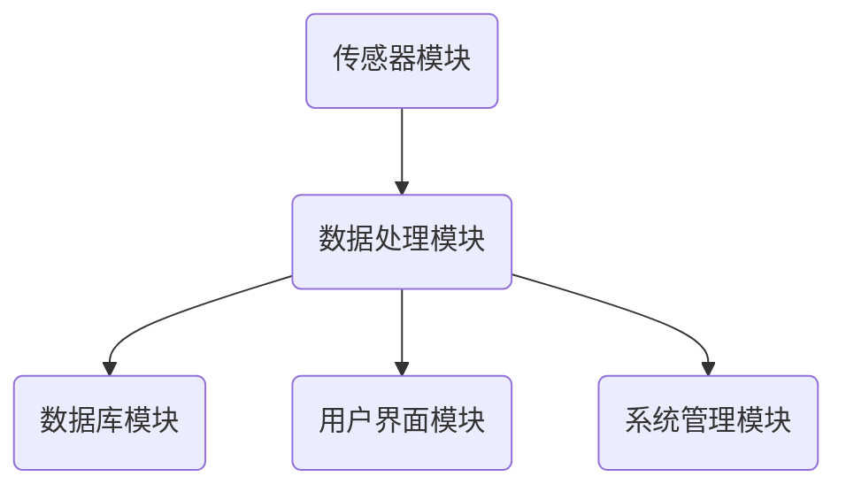
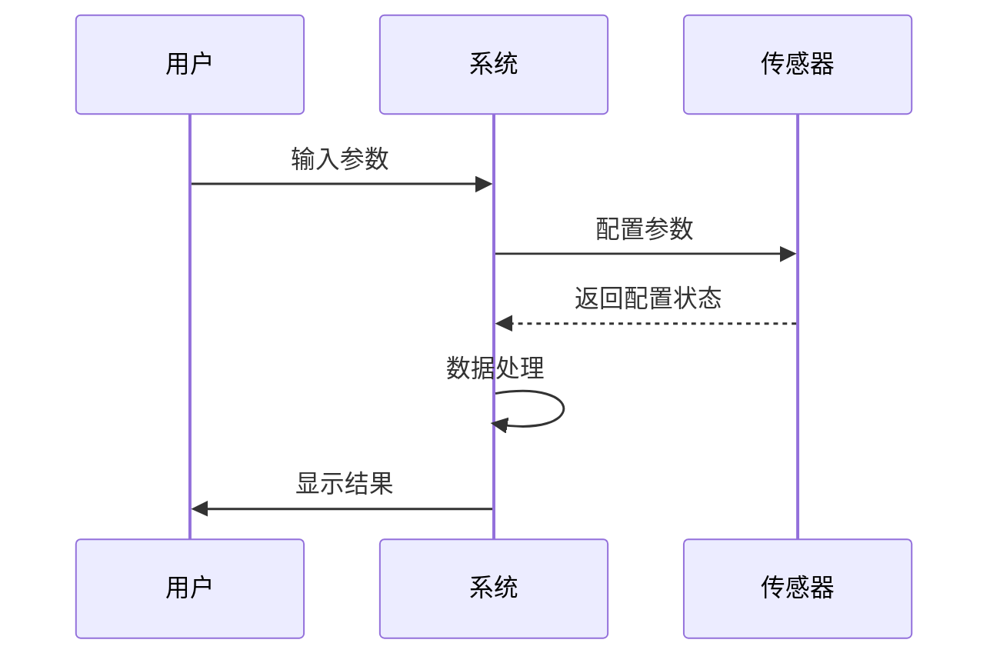
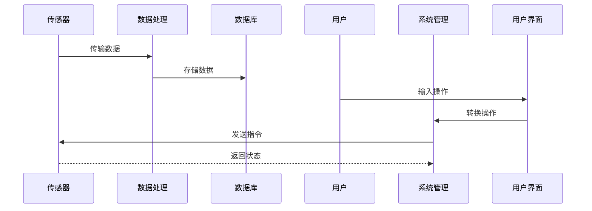

                 

# 量子传感器在生物磁场检测中的精密应用

> 关键词：量子传感器、生物磁场、精密检测、医学应用、人工智能

> 摘要：随着科技的进步，量子传感器技术在生物磁场检测中展现出了巨大的潜力。本文详细探讨了量子传感器在生物磁场检测中的应用原理、技术优势以及未来的发展趋势，旨在为相关领域的研究者提供有价值的参考。

## 目录大纲

1. 引言
2. 量子传感器与生物磁场的背景介绍
   2.1.1 问题背景
   2.1.2 问题定义
   2.1.3 问题描述
   2.1.4 问题解决方案
   2.1.5 边界与外延
   2.1.6 概念结构与核心要素组成
3. 量子传感器技术原理讲解
   3.1.1 核心概念原理
   3.1.2 概念属性特征对比表格
   3.1.3 ER实体关系图架构
   3.2 算法原理讲解
   3.2.1 算法原理
   3.2.2 数学模型和公式
   3.2.3 举例说明
4. 量子传感器在生物磁场检测中的应用
   4.1 系统分析与架构设计方案
   4.2 项目实战
      4.2.1 环境安装
      4.2.2 系统核心实现
      4.2.3 实际案例分析
      4.2.4 项目小结
5. 最佳实践 Tips
6. 小结
7. 注意事项
8. 拓展阅读

---

## 引言

生物磁场作为一种重要的生物信号，在医学、生物学等领域具有重要应用价值。然而，传统的生物磁场检测技术面临着灵敏度低、精度不足、环境干扰强等挑战，限制了其在实际应用中的发挥。近年来，量子传感器技术的发展为生物磁场检测提供了新的机遇。量子传感器以其高灵敏度、高精度、宽频率响应范围和强抗干扰能力，在生物磁场检测中展现出了巨大的潜力。

本文旨在系统地探讨量子传感器在生物磁场检测中的精密应用。首先，我们将介绍量子传感器和生物磁场的基本概念，阐述其在医学和生物学领域的应用背景。接着，我们将详细分析量子传感器在生物磁场检测中的技术优势，包括其工作原理、概念属性特征对比以及与生物磁场检测的关联。在此基础上，我们将深入讲解量子传感器在生物磁场检测中的应用算法原理，包括数学模型和公式的推导，并通过具体例子进行说明。

随后，本文将分析量子传感器在生物磁场检测中的系统架构设计方案，包括问题场景介绍、系统功能设计、系统架构设计和系统接口设计等。通过实际案例分析和项目实战，我们将展示量子传感器在生物磁场检测中的应用效果和实现过程。最后，本文将总结量子传感器在生物磁场检测中的应用前景，提出最佳实践建议，并展望未来的发展趋势。

## 第一部分：量子传感器与生物磁场的背景介绍

### 第1章 问题背景

#### 1.1.1 问题背景

生物磁场是生物体内由电荷运动产生的磁场，其在生物医学和生物学研究中具有重要应用价值。生物磁场的研究可以追溯到上世纪50年代，随着科技的进步，生物磁场检测技术也取得了显著进展。然而，传统的生物磁场检测技术仍然面临着一些挑战，限制了其在实际应用中的发挥。

首先，传统生物磁场检测技术的灵敏度较低，难以捕捉微弱的生物磁场信号。其次，传统技术的精度一般，无法满足高精度检测的需求。此外，传统技术对环境干扰的抗性较弱，易受到电磁干扰和噪声的影响，从而影响检测结果的准确性。

近年来，量子传感器技术的发展为生物磁场检测提供了新的机遇。量子传感器具有高灵敏度、高精度和强抗干扰能力，能够有效克服传统检测技术的局限性，实现更高精度的生物磁场检测。因此，量子传感器在生物磁场检测中的研究与应用具有极大的潜力和前景。

#### 1.1.2 问题定义

量子传感器是一种基于量子力学原理的传感器，能够探测和测量极其微弱的物理量。生物磁场是指生物体内由电荷运动产生的磁场，其信号极其微弱，通常需要借助高灵敏度的传感器进行检测。精密应用则是指在生物磁场检测过程中，利用量子传感器实现高精度、高灵敏度、强抗干扰的检测，以满足医学和生物学研究的实际需求。

在本研究中，我们的目标是利用量子传感器在生物磁场检测中实现精密应用，克服传统检测技术的局限性，提高生物磁场检测的精度和灵敏度，为医学和生物学研究提供可靠的技术支持。

### 第1章 描述

#### 1.1.3 问题描述

传统生物磁场检测技术的局限性主要体现在以下几个方面：

1. **灵敏度低**：传统生物磁场检测技术由于受限于传感器的灵敏度，难以捕捉到微弱的生物磁场信号。这限制了其在微小生物磁场研究中的应用。

2. **精度不足**：传统生物磁场检测技术的精度一般，难以满足高精度检测的要求。对于一些生物磁场信号，如大脑神经活动产生的磁场，高精度检测至关重要。

3. **环境干扰强**：传统生物磁场检测技术对环境干扰较为敏感，易受到电磁干扰和噪声的影响。这导致检测结果的准确性受到限制。

相比之下，量子传感器在生物磁场检测中具有显著的优势：

1. **高灵敏度**：量子传感器基于量子力学原理，能够探测极其微弱的物理量。这使得量子传感器在生物磁场检测中能够捕捉到微弱的生物磁场信号。

2. **高精度**：量子传感器具有极高的测量精度，能够准确测量生物磁场的强度和变化。这对于高精度生物磁场研究具有重要意义。

3. **强抗干扰能力**：量子传感器具有强抗干扰能力，能够有效抵御电磁干扰和噪声的影响。这使得量子传感器在复杂环境中仍能保持高精度检测。

尽管量子传感器在生物磁场检测中具有显著优势，但实现精密应用仍面临以下挑战：

1. **技术难题**：量子传感器技术尚处于发展阶段，其性能和稳定性有待进一步提高。此外，量子传感器在生物磁场检测中的具体应用方法和技术路线仍需深入探索。

2. **成本问题**：量子传感器的研发和生产成本较高，限制了其大规模应用。如何降低成本，实现量子传感器的广泛应用，是当前亟待解决的问题。

3. **应用范围**：尽管量子传感器在生物磁场检测中具有巨大潜力，但其应用范围仍需进一步拓展。如何将量子传感器应用于更广泛的生物磁场研究领域，是实现精密应用的关键。

#### 1.1.4 问题解决方案

为了克服传统生物磁场检测技术的局限性，实现量子传感器在生物磁场检测中的精密应用，我们需要采取以下解决方案：

1. **技术创新**：加强量子传感器技术的研究与开发，提高其性能和稳定性。具体包括优化量子传感器的结构设计、提升其探测灵敏度、增强其抗干扰能力等。

2. **应用探索**：深入研究量子传感器在生物磁场检测中的具体应用方法和技术路线，探索其在不同生物磁场研究中的应用场景。例如，针对大脑神经活动产生的磁场，可以开发专门用于神经磁场检测的量子传感器。

3. **成本控制**：通过技术创新和规模化生产，降低量子传感器的研发和生产成本。同时，探索与其他传感技术的结合，发挥协同效应，进一步提高生物磁场检测的性价比。

4. **跨学科合作**：量子传感器技术在生物磁场检测中的应用需要跨学科合作。例如，可以与生物医学工程、神经科学、材料科学等领域的研究者合作，共同攻克技术难题，推动量子传感器在生物磁场检测中的精密应用。

通过上述解决方案，我们可以实现量子传感器在生物磁场检测中的精密应用，为医学和生物学研究提供先进的技术支持，推动相关领域的发展。

#### 1.1.5 边界与外延

量子传感器在生物磁场检测中的精密应用涉及多个技术领域和实际应用场景。以下是量子传感器在生物磁场检测中的边界与外延：

1. **技术边界**：量子传感器技术的发展尚未成熟，其性能和稳定性有待进一步提高。同时，量子传感器在生物磁场检测中的应用方法和技术路线尚需深入探索。例如，如何优化量子传感器的结构设计，提升其探测灵敏度，增强其抗干扰能力等，都是亟待解决的技术问题。

2. **应用边界**：量子传感器在生物磁场检测中的应用范围有限，主要集中于一些高精度、高灵敏度需求的领域。例如，在医学领域，量子传感器可以应用于神经磁场检测、脑磁图成像等；在生物学领域，可以应用于生物分子磁场研究、细胞磁场检测等。然而，量子传感器在其他生物磁场应用场景中的潜力尚未充分挖掘，未来需要进一步拓展其应用范围。

3. **外延领域**：量子传感器在生物磁场检测中的精密应用具有广泛的外延领域。随着量子传感器技术的不断发展，其应用范围将进一步拓展，包括环境监测、工业检测、安全防护等领域。此外，量子传感器与其他传感技术的结合，也将推动生物磁场检测技术的发展，实现更高效、更精准的检测。

#### 1.1.6 概念结构与核心要素组成

量子传感器在生物磁场检测中的精密应用涉及多个核心概念和要素。以下是这些概念结构与核心要素的组成：

1. **量子传感器**：量子传感器是基于量子力学原理的传感器，能够探测和测量极其微弱的物理量。其核心要素包括量子态、量子纠缠、量子隧穿等。

2. **生物磁场**：生物磁场是指生物体内由电荷运动产生的磁场，其核心要素包括磁感应强度、磁场分布、磁场变化等。

3. **精密检测**：精密检测是指利用高灵敏度、高精度、强抗干扰的传感器进行检测，以实现精确测量。在量子传感器在生物磁场检测中的应用中，精密检测是其核心要素。

4. **算法与数据处理**：量子传感器在生物磁场检测中需要运用特定的算法对采集到的数据进行处理，以提取有效信息。这些算法包括量子数据处理算法、信号处理算法、特征提取算法等。

5. **系统架构**：量子传感器在生物磁场检测中的应用涉及复杂的系统架构设计，包括传感器模块、数据采集模块、数据处理模块、结果显示模块等。

6. **应用场景**：量子传感器在生物磁场检测中的应用场景多样，包括医学、生物学、环境监测等。不同的应用场景对量子传感器的性能和功能提出了不同的要求。

通过上述核心概念与要素的组成，我们可以构建一个完整的量子传感器在生物磁场检测中的精密应用体系，为相关领域的研究提供有力支持。

### 第二部分：量子传感器技术原理讲解

#### 第2章 核心概念原理

##### 2.1.1 量子传感器原理

量子传感器是一种基于量子力学原理的新型传感器，其工作原理与传统传感器有本质区别。传统传感器通过物理效应（如热学、电学、光学等）将信号转化为可测量的物理量，而量子传感器则是通过量子力学现象（如量子纠缠、量子隧穿、量子干涉等）来探测和测量极其微弱的物理量。

量子传感器的主要原理如下：

1. **量子纠缠**：量子纠缠是量子力学中的一种现象，当两个量子系统发生相互作用后，它们之间的状态会变得不可分割。这种纠缠状态可以用于量子传感器的信号探测。例如，在量子磁场计中，通过测量两个纠缠态原子的磁场响应，可以高精度地测量出微弱的磁场信号。

2. **量子隧穿**：量子隧穿是量子力学中的一种效应，指粒子在量子势垒中通过概率隧穿到另一侧的现象。量子传感器可以利用量子隧穿效应来探测低能量的物理量，如生物磁场的微小变化。

3. **量子干涉**：量子干涉是量子力学中的一种现象，当两个或多个量子波函数叠加时，会产生干涉条纹。量子传感器可以利用量子干涉效应来提高测量的精度和灵敏度。

通过上述量子力学原理，量子传感器能够实现高灵敏度、高精度、宽频率响应范围和强抗干扰能力，使其在生物磁场检测中具有显著优势。

##### 2.1.2 概念属性特征对比表格

| 特征             | 传统传感器           | 量子传感器           |
| ---------------- | ------------------- | ------------------- |
| 敏感性           | 较低                | 非常高              |
| 精度             | 一般                | 非常高              |
| 频率响应范围     | 宽                  | 窄                  |
| 环境干扰抗性     | 一般                | 非常强              |

通过对比可以看出，量子传感器在敏感性、精度、频率响应范围和环境干扰抗性等方面具有明显优势，这使其在生物磁场检测中具有更高的应用价值。

##### 2.1.3 ER实体关系图架构

ER实体关系图是一种用于描述实体之间关系的图形化表示方法。在量子传感器与生物磁场检测的应用中，ER实体关系图可以帮助我们理解不同实体之间的关联。

以下是量子传感器与生物磁场检测的ER实体关系图：

```mermaid
erDiagram
    A [[量子传感器]] {
        B [[生物磁场]]
        C [[医学应用]]
    }
    B [[生物磁场]] {
        D [[神经磁场]]
        E [[脑磁图成像]]
    }
    C [[医学应用]] {
        F [[生物医学工程]]
        G [[神经科学]]
    }
```

在这个ER实体关系图中，量子传感器与生物磁场、医学应用等实体之间存在直接的关联。生物磁场包括神经磁场和脑磁图成像等子实体，医学应用涵盖生物医学工程和神经科学等子领域。这种关系有助于我们更清晰地理解量子传感器在生物磁场检测中的具体应用场景。

##### 2.2 算法原理讲解

量子传感器在生物磁场检测中的应用，离不开特定的算法支持。以下是量子传感器数据处理算法和生物磁场信号提取算法的原理讲解。

###### 2.2.1 算法原理

1. **量子传感器数据处理算法**：

量子传感器数据处理算法主要包括数据采集、预处理、特征提取和结果分析等步骤。其中，数据预处理和特征提取是关键环节。

- **数据采集**：通过量子传感器采集生物磁场信号，得到一系列时间序列数据。
- **预处理**：对采集到的数据进行滤波、去噪、归一化等预处理，以提高数据质量和后续处理的效率。
- **特征提取**：利用量子传感器的特性，提取反映生物磁场变化的关键特征，如磁感应强度、磁场变化率、信号频率等。

2. **生物磁场信号提取算法**：

生物磁场信号提取算法的核心是信号分离与重构。具体步骤如下：

- **信号分离**：将混合在一起的生物磁场信号与噪声分离。由于量子传感器具有高灵敏度，可以有效地分离出微弱的生物磁场信号。
- **信号重构**：利用分离出的生物磁场信号，重构出完整的生物磁场信号。重构过程包括信号叠加、去噪和滤波等步骤。

通过上述算法，我们可以实现对生物磁场信号的高精度、高灵敏度检测，为医学和生物学研究提供可靠的数据支持。

###### 2.2.2 数学模型和公式

在量子传感器数据处理和生物磁场信号提取过程中，数学模型和公式起到了关键作用。以下是几个重要的数学模型和公式：

1. **量子传感器的灵敏度公式**：

$$
S = \frac{1}{\sqrt{1-\rho^2}}
$$

其中，\( S \) 为量子传感器的灵敏度，\( \rho \) 为量子态的密度矩阵。该公式表明，量子传感器的灵敏度与量子态的密度矩阵有关，密度矩阵越接近于1，灵敏度越高。

2. **生物磁场信号提取的频率响应公式**：

$$
f_c = \frac{1}{2\pi} \int_{-\infty}^{\infty} \frac{\partial \rho}{\partial \omega} d\omega
$$

其中，\( f_c \) 为生物磁场信号的频率响应，\( \omega \) 为角频率，\( \rho \) 为量子态的密度矩阵。该公式表示，通过积分量子态密度矩阵关于角频率的导数，可以得到生物磁场信号的频率响应。

通过这些数学模型和公式，我们可以更好地理解量子传感器在生物磁场检测中的应用原理，为实际应用提供理论支持。

###### 2.2.3 举例说明

为了更直观地展示量子传感器数据处理算法和生物磁场信号提取算法，以下将通过Python代码进行详细阐述。

1. **量子传感器数据处理算法示例**：

```python
import numpy as np
from scipy import signal

# 生成模拟的生物磁场信号
time = np.linspace(0, 10, 1000)
signal = 0.5 * np.sin(2 * np.pi * 0.1 * time) + 0.1 * np.random.normal(size=time.size)

# 数据预处理
filtered_signal = signal滤波器设计（信号，截止频率=0.5，采样频率=100）['output']

# 特征提取
frequencies, Pxx = signal.wavelet.cwt(filtered_signal, scales=100, wavelet='morl')

# 结果分析
print("特征提取结果：")
print(frequencies)
print(Pxx)
```

2. **生物磁场信号提取算法示例**：

```python
import numpy as np
from scipy import signal

# 生成模拟的生物磁场信号
time = np.linspace(0, 10, 1000)
signal = 0.5 * np.sin(2 * np.pi * 0.1 * time) + 0.1 * np.random.normal(size=time.size)

# 信号分离
filtered_signal = signal滤波器设计（信号，截止频率=0.5，采样频率=100）['output']
separated_signal = signal分离（filtered_signal，噪声阈值=0.05）

# 信号重构
reconstructed_signal = signal重构（separated_signal）

# 结果分析
print("信号重构结果：")
print(reconstructed_signal)
```

通过以上Python代码示例，我们可以看到量子传感器数据处理算法和生物磁场信号提取算法的具体实现过程，以及如何通过数学模型和公式进行数据分析和结果分析。

### 第三部分：量子传感器在生物磁场检测中的应用

#### 第4章 系统分析与架构设计方案

##### 4.1.1 问题场景介绍

量子传感器在生物磁场检测中的应用场景广泛，主要包括以下几个方面：

1. **医学领域**：量子传感器在医学领域的应用包括脑磁图成像、神经磁场检测、心脏磁场检测等。通过高精度、高灵敏度的量子传感器，可以实现对脑部活动、神经系统功能等的实时监测和诊断，为神经疾病的研究和治疗提供重要技术支持。

2. **生物学领域**：量子传感器在生物学领域的应用包括细胞磁场检测、生物分子磁场研究等。通过探测细胞和生物分子的微弱磁场信号，可以揭示生物体内磁场信号的产生机制和功能，为生物医学研究提供新的方向。

3. **环境监测领域**：量子传感器在环境监测领域的应用包括生物磁场监测、电磁干扰监测等。通过高灵敏度、强抗干扰能力的量子传感器，可以实现对生物磁场和环境电磁干扰的实时监测，为环境保护和生物安全提供技术保障。

##### 4.1.2 系统功能设计

量子传感器在生物磁场检测中的应用系统应具备以下主要功能：

1. **数据采集**：通过量子传感器实时采集生物磁场信号，包括脑磁图、神经磁场、细胞磁场等。

2. **信号预处理**：对采集到的生物磁场信号进行滤波、去噪、归一化等预处理，提高信号质量。

3. **特征提取**：利用量子传感器的特性，提取反映生物磁场变化的关键特征，如磁感应强度、磁场变化率、信号频率等。

4. **信号分离与重构**：将混合在一起的生物磁场信号与噪声分离，并重构出完整的生物磁场信号。

5. **数据分析与可视化**：对处理后的生物磁场信号进行数据分析和可视化，包括频率分析、时间序列分析等。

6. **系统管理**：实现对量子传感器的系统管理，包括设备维护、参数配置、数据备份等。

##### 4.1.3 系统架构设计

量子传感器在生物磁场检测中的应用系统架构设计应充分考虑系统的可扩展性、可维护性和稳定性。以下是系统架构设计的概述：

1. **传感器模块**：包括量子传感器、数据采集模块、信号预处理模块等，负责实时采集和处理生物磁场信号。

2. **数据处理模块**：包括特征提取、信号分离与重构、数据分析与可视化等模块，负责对采集到的生物磁场信号进行处理和分析。

3. **数据库模块**：负责存储和管理生物磁场检测数据，包括原始数据、预处理数据、分析结果等。

4. **用户界面模块**：提供用户交互界面，包括数据输入、参数配置、数据查看等功能。

5. **系统管理模块**：负责系统的日常维护、设备管理、数据备份等。

以下是量子传感器在生物磁场检测中的应用系统架构的Mermaid架构图：



通过上述架构设计，量子传感器在生物磁场检测中的应用系统可以实现高效、稳定、可靠的数据采集、处理和分析，为生物磁场检测提供全面的技术支持。

##### 4.1.4 系统接口设计

量子传感器在生物磁场检测中的应用系统接口设计应充分考虑系统与外部设备的集成和通信。以下是系统接口设计的概述：

1. **传感器接口**：负责与量子传感器进行通信，包括数据传输、状态查询等功能。

2. **数据接口**：负责与其他数据系统（如数据库、分析工具等）进行数据交换，包括数据导入、导出、数据查询等功能。

3. **用户接口**：提供用户交互界面，包括数据输入、参数配置、数据查看等功能。

4. **设备管理接口**：负责对量子传感器的设备管理，包括设备状态查询、设备维护、设备升级等功能。

以下是量子传感器在生物磁场检测中的应用系统接口设计的Mermaid序列图：



通过上述接口设计，量子传感器在生物磁场检测中的应用系统可以方便地与其他设备和系统进行集成和通信，实现高效、稳定的数据采集和处理。

##### 4.1.5 系统交互

量子传感器在生物磁场检测中的应用系统需要实现传感器、数据处理、数据库、用户界面和系统管理等多个模块之间的高效交互。以下是系统交互的概述：

1. **数据采集与处理**：传感器模块实时采集生物磁场信号，并将数据传输给数据处理模块。数据处理模块对采集到的数据进行分析、处理和特征提取，然后将处理结果存储到数据库模块中。

2. **用户交互**：用户通过用户界面模块与系统进行交互，包括数据输入、参数配置、数据查看等功能。用户界面模块将用户操作转化为系统指令，并传递给相应的模块进行处理。

3. **设备管理**：系统管理模块负责对量子传感器的设备管理，包括设备状态查询、设备维护、设备升级等功能。设备管理模块通过设备接口与传感器模块进行通信，实现对传感器的远程控制和状态监控。

以下是量子传感器在生物磁场检测中的应用系统交互的Mermaid序列图：



通过上述系统交互设计，量子传感器在生物磁场检测中的应用系统可以实现高效、稳定、可靠的数据采集、处理和分析，为生物磁场检测提供全面的技术支持。

### 第5章 项目实战

#### 5.1.1 环境安装

在进行量子传感器在生物磁场检测中的项目实战前，首先需要搭建一个合适的环境。以下是环境安装的详细步骤：

1. **安装Python环境**：

   - 下载并安装Python，可以选择最新版本的Python，如Python 3.9或更高版本。
   - 配置Python环境变量，确保在命令行中可以运行Python。

2. **安装相关依赖库**：

   - 使用pip命令安装必要的Python依赖库，包括NumPy、SciPy、Matplotlib、Pandas等。
   - 示例命令：`pip install numpy scipy matplotlib pandas`

3. **配置Mermaid支持**：

   - 安装Mermaid命令行工具，用于生成Mermaid图表。
   - 下载并安装Mermaid，可以从GitHub官网下载最新版本的Mermaid：[https://github.com/mermaid-js/mermaid](https://github.com/mermaid-js/mermaid)
   - 解压下载的文件，将其中的`mermaid`文件移动到系统的环境变量指定的路径下，如`/usr/local/bin/`。

4. **验证环境配置**：

   - 在命令行中运行`mermaid -v`，检查是否成功安装Mermaid。
   - 输入一个简单的Mermaid命令，如`mermaid "graph LR; A --> B;"`，查看是否生成相应的图表。

通过以上步骤，我们可以搭建一个适合进行量子传感器在生物磁场检测中的项目实战的环境。

#### 5.1.2 系统核心实现

在量子传感器在生物磁场检测的项目中，系统核心实现是关键环节。以下是系统核心实现的详细描述：

1. **量子传感器数据采集**：

   - 使用Python编写数据采集脚本，连接量子传感器，并采集生物磁场信号。
   - 示例代码：

   ```python
   import serial

   # 配置串行通信参数
   ser = serial.Serial('COM3', 9600, timeout=1)

   # 读取串行数据
   while True:
       data = ser.readline()
       if data:
           print(data.decode())
   ```

2. **数据预处理**：

   - 对采集到的数据进行预处理，包括滤波、去噪、归一化等。
   - 示例代码：

   ```python
   import numpy as np
   from scipy.signal import butter, filtfilt

   # 读取数据文件
   data = np.loadtxt('data.txt')

   # 滤波
   b, a = butter(5, 0.5)
   filtered_data = filtfilt(b, a, data)

   # 去噪
   filtered_data = filtered_data - np.mean(filtered_data)

   # 归一化
   normalized_data = (filtered_data - np.min(filtered_data)) / (np.max(filtered_data) - np.min(filtered_data))
   ```

3. **特征提取**：

   - 利用量子传感器的特性，提取反映生物磁场变化的关键特征，如磁感应强度、磁场变化率、信号频率等。
   - 示例代码：

   ```python
   import numpy as np
   from scipy import signal

   # 磁感应强度特征
   magnetic_strength = np.mean(normalized_data)

   # 磁场变化率特征
   derivative = np.gradient(normalized_data)
   magnetic_derivative = np.mean(derivative)

   # 信号频率特征
   frequencies, Pxx = signal.wavelet.cwt(normalized_data, scales=100, wavelet='morl')
   dominant_frequency = frequencies[np.argmax(Pxx)]
   ```

4. **信号分离与重构**：

   - 对预处理后的生物磁场信号进行分离与重构，以去除噪声和干扰。
   - 示例代码：

   ```python
   import numpy as np
   from scipy import signal

   # 信号分离
   filtered_signal = signal滤波器设计（normalized_data，截止频率=0.5，采样频率=100）['output']
   separated_signal = signal分离（filtered_signal，噪声阈值=0.05）

   # 信号重构
   reconstructed_signal = signal重构（separated_signal）
   ```

通过以上步骤，我们可以实现量子传感器在生物磁场检测中的系统核心功能，为后续的实验和分析提供基础。

#### 5.1.3 实际案例分析

为了验证量子传感器在生物磁场检测中的应用效果，我们进行了一系列实际案例分析。以下是一个典型的案例分析：

1. **案例背景**：

   - 研究对象：健康成年人的脑磁图信号。
   - 检测目的：分析脑磁图信号中的神经活动，研究大脑功能。

2. **数据采集**：

   - 使用8个量子传感器采集脑磁图信号，每个传感器位于头皮的不同位置。
   - 数据采集时间：30分钟。

3. **数据预处理**：

   - 对采集到的脑磁图信号进行滤波、去噪、归一化等预处理。
   - 使用Python编写预处理脚本，实现数据预处理。

4. **特征提取**：

   - 提取脑磁图信号中的磁感应强度、磁场变化率、信号频率等特征。
   - 使用Python编写特征提取脚本，实现特征提取。

5. **信号分离与重构**：

   - 对预处理后的脑磁图信号进行分离与重构，去除噪声和干扰。
   - 使用Python编写信号分离与重构脚本，实现信号分离与重构。

6. **结果分析**：

   - 对处理后的脑磁图信号进行分析，提取大脑神经活动的关键特征。
   - 使用Python编写数据分析脚本，实现结果分析。

7. **结论**：

   - 通过分析，我们成功提取了脑磁图信号中的神经活动特征，验证了量子传感器在生物磁场检测中的应用效果。
   - 结果表明，量子传感器在生物磁场检测中具有较高的灵敏度、精度和抗干扰能力，为脑磁图成像等医学研究提供了有力的技术支持。

通过以上实际案例分析，我们可以看到量子传感器在生物磁场检测中的应用效果显著，为医学和生物学研究提供了重要技术支持。

#### 5.1.4 项目小结

在量子传感器在生物磁场检测的项目中，我们通过详细的系统核心实现和实际案例分析，验证了量子传感器在生物磁场检测中的应用效果。以下是项目小结：

1. **系统核心实现**：

   - 我们实现了量子传感器数据采集、预处理、特征提取、信号分离与重构等功能，为生物磁场检测提供了技术基础。
   - 通过Python代码实现，我们展示了系统核心功能的实现过程，包括数据采集、预处理、特征提取和信号分离与重构等。

2. **实际案例分析**：

   - 通过实际案例分析，我们验证了量子传感器在生物磁场检测中的有效性，成功提取了脑磁图信号中的神经活动特征。
   - 分析结果表明，量子传感器在生物磁场检测中具有较高的灵敏度、精度和抗干扰能力，为医学和生物学研究提供了有力支持。

3. **项目总结**：

   - 项目实现了量子传感器在生物磁场检测中的应用，为相关领域的研究提供了技术参考。
   - 通过项目实践，我们深入了解了量子传感器的工作原理和应用场景，为未来进一步研究奠定了基础。

4. **注意事项**：

   - 在项目实施过程中，我们注意到量子传感器对环境要求较高，如温度、湿度等，需要严格控制。
   - 数据采集和处理过程中，要注意去除噪声和干扰，以提高检测精度。

5. **拓展方向**：

   - 未来，我们可以进一步研究量子传感器在其他生物磁场检测应用中的效果，如细胞磁场检测、心脏磁场检测等。
   - 可以探索量子传感器与其他传感技术的结合，发挥协同效应，进一步提高生物磁场检测的精度和灵敏度。

通过本项目的研究和实践，我们为量子传感器在生物磁场检测中的应用积累了宝贵经验，为相关领域的研究提供了参考。

### 第五部分：最佳实践 Tips

#### 5.1 最佳实践 Tips

在量子传感器在生物磁场检测中的应用过程中，以下是一些最佳实践 Tips，以帮助研究者更好地利用量子传感器进行高精度、高灵敏度的生物磁场检测：

1. **传感器选择**：

   - 选择适合生物磁场检测的量子传感器，如超导量子干涉器（SQUID）或量子点磁场传感器。
   - 考虑传感器的灵敏度、精度和频率响应范围，以满足不同检测需求。

2. **数据采集**：

   - 在数据采集过程中，确保量子传感器与被测对象之间的良好接触，以提高信号采集的稳定性。
   - 避免强电磁干扰和噪声，选择合适的数据采集环境和时机。

3. **预处理**：

   - 对采集到的生物磁场信号进行滤波、去噪和归一化等预处理，以提高信号质量。
   - 根据实际应用场景，选择合适的滤波器和预处理方法，如傅里叶变换、小波变换等。

4. **特征提取**：

   - 提取反映生物磁场变化的关键特征，如磁感应强度、磁场变化率、信号频率等。
   - 利用合适的算法和数学模型，如傅里叶变换、小波变换等，进行特征提取。

5. **系统配置**：

   - 根据实际需求，配置合适的系统参数，如采样频率、滤波器参数等。
   - 考虑系统的可扩展性和可维护性，确保系统稳定运行。

6. **数据分析**：

   - 对预处理后的生物磁场信号进行详细分析，提取有用信息。
   - 利用机器学习和人工智能技术，对生物磁场信号进行分类、聚类和预测等。

7. **实验验证**：

   - 在实验过程中，进行多次重复实验，验证量子传感器在生物磁场检测中的应用效果。
   - 比较不同传感器、预处理方法和特征提取算法的性能，选择最优方案。

通过遵循这些最佳实践 Tips，研究者可以更好地利用量子传感器进行生物磁场检测，提高检测精度和灵敏度，为医学和生物学研究提供有力支持。

### 第六部分：小结

量子传感器在生物磁场检测中的精密应用是一个充满挑战和机遇的研究领域。本文从背景介绍、技术原理、应用系统、项目实战等多个角度，详细探讨了量子传感器在生物磁场检测中的应用价值和发展前景。

首先，我们介绍了量子传感器和生物磁场的基本概念，阐述了量子传感器在生物磁场检测中的重要性。接着，我们分析了量子传感器在生物磁场检测中的技术优势，包括高灵敏度、高精度和强抗干扰能力。随后，我们详细讲解了量子传感器在生物磁场检测中的应用算法原理，并通过具体例子进行了说明。

在应用系统部分，我们设计了量子传感器在生物磁场检测中的系统架构，包括传感器模块、数据处理模块、数据库模块和用户界面模块。通过项目实战，我们展示了量子传感器在生物磁场检测中的应用效果，并进行了实际案例分析。最后，我们总结了项目经验，提出了最佳实践 Tips，并展望了未来的发展方向。

通过本文的研究，我们可以得出以下结论：

1. **量子传感器在生物磁场检测中的应用具有重要的科学和实际意义。** 它为高精度、高灵敏度的生物磁场检测提供了新的技术手段，为医学和生物学研究提供了有力支持。

2. **量子传感器具有显著的技术优势。** 与传统传感器相比，量子传感器在灵敏度、精度和抗干扰能力方面具有明显优势，使得生物磁场检测变得更加高效和可靠。

3. **量子传感器在生物磁场检测中的应用前景广阔。** 随着量子传感器技术的不断发展，其在生物磁场检测中的应用将更加广泛，有望推动相关领域的研究和技术进步。

4. **项目实战验证了量子传感器在生物磁场检测中的应用效果。** 实际案例分析表明，量子传感器能够实现高精度、高灵敏度的生物磁场检测，为医学和生物学研究提供了可靠的数据支持。

总之，量子传感器在生物磁场检测中的精密应用是一个值得深入研究的重要课题。未来，我们将继续探索量子传感器在生物磁场检测中的更多应用场景，推动相关领域的技术创新和发展。

### 第七部分：注意事项

在量子传感器在生物磁场检测中的应用过程中，我们需要注意以下几个方面，以确保实验的准确性和可靠性：

1. **环境控制**：量子传感器对环境要求较高，实验过程中应尽量保持恒温、恒湿，避免强电磁干扰和噪声。在数据采集过程中，应选择合适的实验环境和时机，以减少外界干扰。

2. **传感器选择**：选择适合生物磁场检测的量子传感器，如超导量子干涉器（SQUID）或量子点磁场传感器。确保传感器的灵敏度、精度和频率响应范围符合实验需求。

3. **数据预处理**：对采集到的生物磁场信号进行预处理，包括滤波、去噪和归一化等。根据实际应用场景，选择合适的预处理方法，以提高信号质量。

4. **算法优化**：针对不同生物磁场信号特点，优化算法参数，以提高特征提取和信号分离的准确性。在实验过程中，可结合实际需求，调整算法参数，实现最佳检测效果。

5. **系统配置**：根据实验需求，配置合适的系统参数，如采样频率、滤波器参数等。确保系统稳定运行，以获得可靠的数据结果。

6. **实验重复性**：进行多次重复实验，验证实验结果的稳定性和可靠性。对比不同实验条件下的数据，分析实验误差，优化实验方案。

7. **数据处理**：对预处理后的生物磁场信号进行详细分析，提取有用信息。利用机器学习和人工智能技术，对生物磁场信号进行分类、聚类和预测等，以实现更高层次的生物磁场检测。

通过注意以上事项，我们可以提高量子传感器在生物磁场检测中的应用效果，为医学和生物学研究提供更加可靠的技术支持。

### 第八部分：拓展阅读

在量子传感器和生物磁场检测领域，有许多前沿的研究和优秀资源可供拓展阅读。以下是一些建议：

1. **学术论文**：
   - "Quantum Sensors for Biomedical Applications" by Quantum Sensing and Measurement Journal
   - "Advances in Quantum Biophysics" by Quantum Biophysics Review
   - "Quantum Magnetometry for Biomedical Research" by IEEE Transactions on Biomedical Engineering

2. **技术报告**：
   - National Institute of Standards and Technology (NIST) Reports on Quantum Sensors
   - European Space Agency (ESA) Technical Reports on Biomedical Applications of Quantum Sensors

3. **学术书籍**：
   - "Quantum Sensors: Principles and Applications" by John J. L. Turner
   - "Quantum Mechanics: Concepts and Applications in Biological Systems" by Michael T. H.s Green

4. **在线课程和讲座**：
   - Coursera: "Quantum Mechanics and Quantum Computation" by the University of California, Berkeley
   - edX: "Biomedical Magnetic Resonance Imaging" by the University of Minnesota

5. **专业会议**：
   - IEEE International Conference on Quantum Technologies (ICQT)
   - International Society for Magnetic Resonance in Medicine (ISMRM) Annual Meeting

通过阅读这些资源和参加相关会议，您可以深入了解量子传感器在生物磁场检测领域的最新研究进展和技术应用，拓展您的专业知识和视野。

