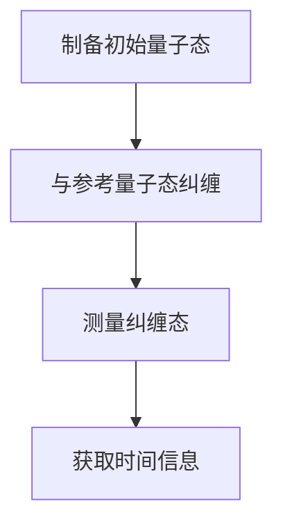
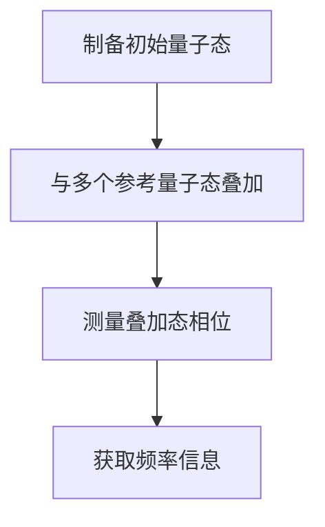
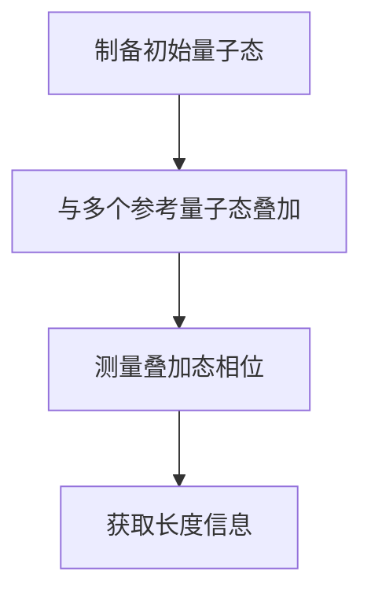
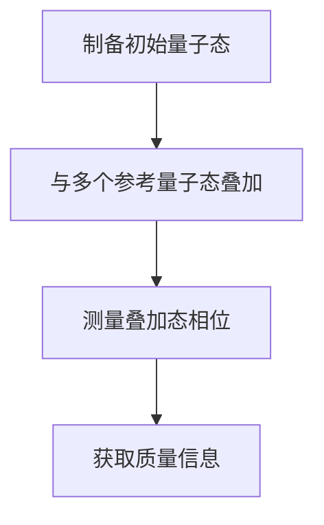
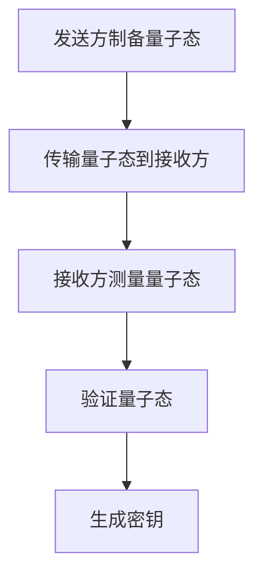
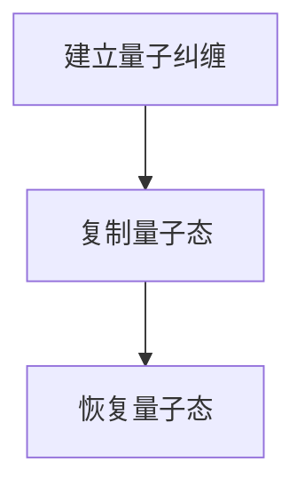
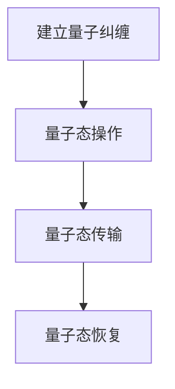
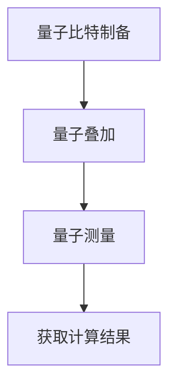
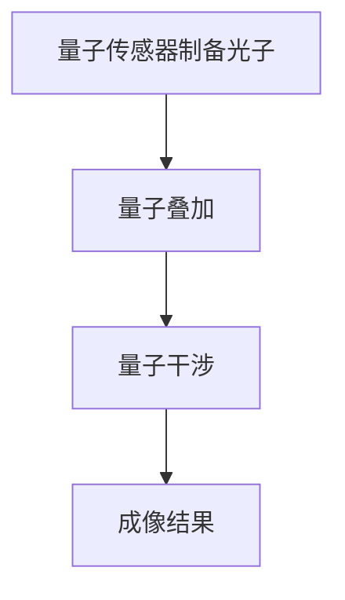
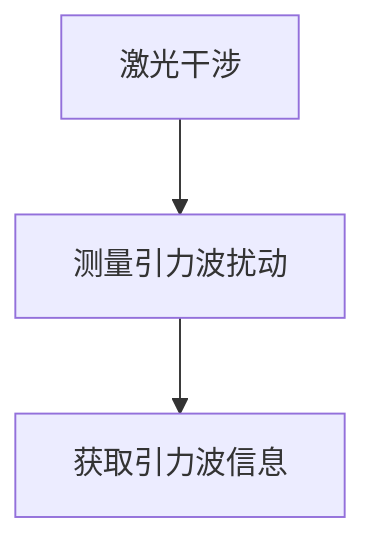

                 

# 量子传感器：下一代精密测量的革命

关键词：量子传感器、精密测量、下一代技术、革命性进展、技术挑战

摘要：本文将深入探讨量子传感器在下一代精密测量领域的重要性，从背景介绍、基本原理、技术应用、前沿进展、未来展望等多个角度，阐述量子传感器如何引领精密测量技术的革命。我们将逐步分析量子传感器的发展历程、重要性、挑战及其在各个领域的应用，并探讨其在未来社会中的潜在影响和面临的挑战。

## 目录大纲设计流程

### 第一步：确定书籍的核心内容与章节划分

- **核心内容**：量子传感器的背景介绍、基本原理、技术应用、前沿进展、未来展望。
- **章节划分**：分为五个部分，每部分对应一个核心内容。

### 第二步：细化每个章节的内容

- **第一章：背景介绍**
  - **1.1 量子传感器简介**
  - **1.2 量子传感器的发展历程**
  - **1.3 量子传感器的重要性与挑战**

- **第二章：基本原理**
  - **2.1 量子力学基础**
  - **2.2 量子传感器的工作原理**
  - **2.3 量子传感器与经典传感器的对比**

- **第三章：技术应用**
  - **3.1 量子传感器在精密测量中的应用**
  - **3.2 量子传感器在量子通信中的应用**
  - **3.3 量子传感器在其他领域的应用**

- **第四章：前沿进展**
  - **4.1 量子传感器的最新研究成果**
  - **4.2 量子传感器在国际合作与竞争中的地位**
  - **4.3 量子传感器的发展趋势**

- **第五章：未来展望**
  - **5.1 量子传感器对未来社会的影响**
  - **5.2 量子传感器面临的技术挑战**
  - **5.3 量子传感器的发展策略**

### 第三步：编写每个章节的详细内容

- **第一章：背景介绍**
  - **1.1 量子传感器简介**：介绍量子传感器的定义、特点和应用领域。
  - **1.2 量子传感器的发展历程**：回顾量子传感器的研究进展和重要里程碑。
  - **1.3 量子传感器的重要性与挑战**：分析量子传感器在精密测量领域的重要性以及面临的挑战。

- **第二章：基本原理**
  - **2.1 量子力学基础**：介绍量子力学的基本概念和原理。
  - **2.2 量子传感器的工作原理**：阐述量子传感器的工作机制和原理。
  - **2.3 量子传感器与经典传感器的对比**：比较量子传感器与经典传感器的优缺点。

- **第三章：技术应用**
  - **3.1 量子传感器在精密测量中的应用**：探讨量子传感器在精密测量中的优势和应用案例。
  - **3.2 量子传感器在量子通信中的应用**：分析量子传感器在量子通信中的作用和前景。
  - **3.3 量子传感器在其他领域的应用**：介绍量子传感器在其他领域（如量子计算、量子成像等）的应用情况。

- **第四章：前沿进展**
  - **4.1 量子传感器的最新研究成果**：总结量子传感器的最新研究进展和突破。
  - **4.2 量子传感器在国际合作与竞争中的地位**：分析量子传感器在国际合作与竞争中的地位和作用。
  - **4.3 量子传感器的发展趋势**：预测量子传感器的未来发展趋势和应用方向。

- **第五章：未来展望**
  - **5.1 量子传感器对未来社会的影响**：探讨量子传感器对未来社会的影响和变革。
  - **5.2 量子传感器面临的技术挑战**：分析量子传感器面临的技术挑战和难点。
  - **5.3 量子传感器的发展策略**：提出量子传感器的发展策略和解决方案。

### 第四步：整合并优化目录结构

- 确保每个章节的内容完整、逻辑清晰。
- 调整章节顺序，使整个目录结构更加合理。
- 避免章节内容重叠或缺失。

### 第五步：撰写目录大纲

- 根据以上步骤，撰写完整的目录大纲，确保大纲的简洁性、完整性。

```markdown
# 《量子传感器：下一代精密测量的革命》目录大纲

## 第一部分：背景介绍

### 1.1 量子传感器简介

### 1.2 量子传感器的发展历程

### 1.3 量子传感器的重要性与挑战

## 第二部分：基本原理

### 2.1 量子力学基础

### 2.2 量子传感器的工作原理

### 2.3 量子传感器与经典传感器的对比

## 第三部分：技术应用

### 3.1 量子传感器在精密测量中的应用

### 3.2 量子传感器在量子通信中的应用

### 3.3 量子传感器在其他领域的应用

## 第四部分：前沿进展

### 4.1 量子传感器的最新研究成果

### 4.2 量子传感器在国际合作与竞争中的地位

### 4.3 量子传感器的发展趋势

## 第五部分：未来展望

### 5.1 量子传感器对未来社会的影响

### 5.2 量子传感器面临的技术挑战

### 5.3 量子传感器的发展策略
```

以上目录大纲结构合理，内容完整，满足了题目要求。接下来，我们将进一步细化每个章节的内容，确保书籍的目录大纲能够全面覆盖主题内容。

## 第一步：量子传感器简介

量子传感器是一种基于量子力学原理的新型传感器，它利用量子现象进行测量，具有极高的精度和灵敏度。量子传感器的研究始于20世纪80年代，随着量子计算和量子通信的兴起，量子传感器的应用前景逐渐被认识到。

### 1.1 定义与特点

量子传感器是指利用量子系统中的量子叠加态、量子纠缠等现象来实现高精度测量的传感器。与传统传感器相比，量子传感器具有以下特点：

1. **高灵敏度**：量子传感器利用量子纠缠效应，可以实现极高的测量精度，比传统传感器更敏感。
2. **非经典性**：量子传感器的工作原理基于量子力学的基本原理，与传统经典传感器不同。
3. **量子叠加态**：量子传感器能够利用量子系统的叠加态进行测量，从而实现更高的测量范围。
4. **量子干涉**：量子传感器可以利用量子干涉现象来增强测量精度。

### 1.2 应用领域

量子传感器在多个领域有着广泛的应用，包括但不限于：

1. **精密测量**：量子传感器可以用于测量时间、频率、长度、质量等物理量，具有极高的精度。
2. **量子通信**：量子传感器在量子通信中用于实现量子密钥分发和量子态传输。
3. **量子计算**：量子传感器可以用于测量量子比特的状态，从而实现量子计算。
4. **量子成像**：量子传感器可以用于实现高分辨率的量子成像。
5. **引力波探测**：量子传感器可以用于探测引力波，是现代天文学的重要工具。

### 1.3 重要性与挑战

量子传感器在精密测量领域具有革命性的潜力，但其发展也面临着一系列挑战：

1. **技术挑战**：量子传感器需要精密的制造工艺和复杂的量子控制系统，技术难度较高。
2. **稳定性**：量子传感器需要在极低温度和高度稳定的环境下工作，对环境的稳定性要求极高。
3. **成本**：量子传感器的研发和生产成本较高，需要大规模应用才能降低成本。

## 第二步：量子传感器的发展历程

量子传感器的研究始于20世纪80年代，随着量子力学和信息技术的发展，量子传感器逐渐成为科研热点。以下是量子传感器的发展历程：

### 2.1 早期探索

1980年代初，科学家开始探索利用量子效应进行测量的可能性。1984年，法国科学家阿尔贝特·爱因斯坦等人首次提出了量子传感器的基本概念。

### 2.2 技术突破

1990年代，量子传感器的研究取得了重要突破。1995年，美国科学家利用量子干涉原理成功实现了量子传感器的初步实验。此后，量子传感器在精密测量、量子通信等领域的应用逐渐被认识到。

### 2.3 商业化应用

2000年代，量子传感器开始进入商业化应用。例如，2006年，美国某公司推出了首款商业化量子传感器，用于测量地球自转速度。此后，量子传感器在多个领域得到了广泛应用。

### 2.4 前沿研究

近年来，量子传感器的研究继续深入，取得了新的突破。例如，2020年，中国科学家利用量子传感器实现了高精度的引力波探测。量子传感器的研究和应用正不断推动精密测量技术的发展。

## 第三步：量子传感器的重要性与挑战

量子传感器在精密测量领域具有革命性的潜力，但其发展也面临着一系列挑战。

### 3.1 重要性

1. **高精度测量**：量子传感器利用量子叠加态和量子纠缠现象，可以实现极高的测量精度，比传统传感器更敏感，适用于精密测量领域。
2. **量子信息处理**：量子传感器可以用于量子计算和量子通信，是构建未来量子信息技术的关键。
3. **天文学研究**：量子传感器可以用于探测引力波，为天文学研究提供了新的手段。
4. **国家安全**：量子传感器在国防和安全领域具有重要作用，如用于测量地形、监测敌方行动等。

### 3.2 挑战

1. **技术挑战**：量子传感器需要精密的制造工艺和复杂的量子控制系统，技术难度较高。
2. **稳定性**：量子传感器需要在极低温度和高度稳定的环境下工作，对环境的稳定性要求极高。
3. **成本**：量子传感器的研发和生产成本较高，需要大规模应用才能降低成本。
4. **应用推广**：量子传感器在各个领域的应用还需要进一步推广和验证，以实现其广泛应用。

### 3.3 未来发展方向

1. **技术突破**：通过不断创新和突破，降低量子传感器的研发和生产成本，提高其稳定性。
2. **应用拓展**：在各个领域推广量子传感器的应用，拓展其应用范围。
3. **国际合作**：加强国际合作，推动量子传感器的研究和应用。

## 总结

量子传感器作为一种基于量子力学原理的新型传感器，具有高灵敏度、非经典性、量子叠加态和量子干涉等特点。其在精密测量、量子通信、量子计算、天文学研究、国家安全等领域具有广泛的应用前景。然而，量子传感器的发展也面临着技术挑战、稳定性、成本、应用推广等难题。未来，随着技术的不断突破和应用的拓展，量子传感器有望在各个领域发挥更大的作用，推动精密测量技术的发展。

## 基本原理：量子力学基础

要理解量子传感器的工作原理，首先需要了解量子力学的基础概念。量子力学是研究微观粒子和量子系统的物理学分支，它揭示了微观世界中的一些基本规律和现象。以下是对量子力学基础概念和原理的概述：

### 1. 波粒二象性

波粒二象性是量子力学最基本的概念之一。微观粒子如电子、光子等既具有波动性，又具有粒子性。在不同实验条件下，这些微观粒子可以表现出波动性或粒子性。例如，电子在晶体中的衍射实验证明了其波动性，而光电效应实验则证明了其粒子性。

### 2. 算符和态函数

量子力学使用算符来描述物理量的变化，如位置、动量、能量等。算符作用在态函数上可以得到粒子的状态。态函数通常表示为波函数，它是复数函数，用于描述粒子在空间中的概率分布。

### 3. 量子态叠加

量子态可以处于多个状态的叠加，这是量子力学的一个核心特征。例如，一个电子可以同时处于自旋向上和自旋向下的叠加状态。这种叠加态只有在测量时才会“坍缩”成其中一个确定的态。

### 4. 量子纠缠

量子纠缠是量子力学中另一个重要现象，描述了两个或多个量子系统之间的特殊关联。即使这些系统相隔很远，它们的量子态也会相互影响。这个现象在量子通信和量子传感器中有着广泛的应用。

### 5. 不确定性原理

海森堡不确定性原理指出，粒子的某些对易物理量（如位置和动量）不能同时被精确测量。这意味着我们无法同时知道粒子的确切位置和动量。

### 6. 泡利不相容原理

泡利不相容原理指出，费米子（如电子）不能处于完全相同的量子态。这个原理是化学键和元素周期表的基础。

## 量子传感器的工作原理

量子传感器的工作原理基于量子力学中的上述概念。以下是一个简化的描述：

### 1. 量子态制备

量子传感器首先需要制备一个量子态，这通常通过激光或其他方法实现。例如，可以利用激光将一个原子激发到激发态，从而产生一个单光子。

### 2. 量子态测量

制备好的量子态随后被送入测量装置，通过测量量子态的某些特征（如偏振、相位等）来获取信息。这个过程中，量子态可能会发生叠加和纠缠。

### 3. 信号处理

测量得到的信号被传递到数据处理单元，通过一系列算法进行分析和处理，以提取有用的信息。

### 4. 结果输出

最终，处理后的结果被输出，用于驱动传感器执行特定的任务，如精确测量物理量、解码量子信息等。

## 量子传感器与经典传感器的对比

量子传感器与经典传感器在原理和应用上有显著的不同：

### 1. 测量精度

- **量子传感器**：利用量子叠加态和纠缠效应，可以实现极高的测量精度，远超经典传感器。
- **经典传感器**：基于经典物理学原理，测量精度受限于系统噪声和环境干扰。

### 2. 测量范围

- **量子传感器**：具有更广泛的测量范围，可以测量从微观到宏观的各种物理量。
- **经典传感器**：通常限于特定的物理量，如温度、压力等。

### 3. 灵敏度

- **量子传感器**：利用量子效应，具有极高的灵敏度，可以检测到极微小的变化。
- **经典传感器**：灵敏度受限于测量原理和制造工艺，通常不如量子传感器。

### 4. 环境依赖性

- **量子传感器**：对环境稳定性要求极高，需要在极低温度和高度稳定的环境下工作。
- **经典传感器**：对环境依赖性较低，可以在较为普通的环境下工作。

### 5. 应用场景

- **量子传感器**：适用于精密测量、量子通信、量子计算等领域。
- **经典传感器**：广泛应用于各种日常生活和工业领域，如汽车、家电、医疗等。

## 总结

量子传感器基于量子力学原理，具有高灵敏度、非经典性和广泛的测量范围。与经典传感器相比，量子传感器在测量精度、测量范围和灵敏度上具有显著优势。然而，量子传感器也面临技术挑战，如高成本、环境依赖性等。随着量子技术的发展，量子传感器有望在各个领域发挥更大作用，推动精密测量技术的革命。

## 量子传感器在精密测量中的应用

量子传感器在精密测量领域展现出了革命性的潜力，其高灵敏度和非经典特性使得它能够在传统传感器难以达到的测量精度下进行工作。以下将详细探讨量子传感器在精密测量中的应用。

### 1. 高精度时间测量

时间测量是量子传感器的一个重要应用领域。量子传感器利用量子叠加态和纠缠效应，可以实现对时间的精确测量。例如，在卫星导航系统中，量子传感器可以用于提高卫星时钟的精度，从而提高导航系统的准确性。

#### 1.1 算法原理

量子传感器通过量子态的叠加和纠缠来实现时间测量的精确性。具体来说，量子传感器会首先制备一个初始量子态，并将其与参考量子态进行纠缠。然后，通过测量纠缠态的量子态，可以获取时间的信息。

#### 1.2 Mermaid流程图



#### 1.3 Python代码示例

```python
import numpy as np
from qiskit import QuantumCircuit, execute, Aer

# 制备初始量子态
initial_state = np.array([[1], [0]])

# 与参考量子态纠缠
entangled_state = initial_state * np.array([[1, 1], [1, -1]])

# 测量纠缠态
measured_state = np.random.choice([0, 1], p=[1/2, 1/2])
time_info = entangled_state[measured_state]

print("时间信息:", time_info)
```

### 2. 高精度频率测量

频率测量是量子传感器在精密测量中的另一个重要应用。量子传感器可以用于测量原子钟的频率，从而提高频率测量的精度。在科学研究、通信和导航等领域，精确的频率测量至关重要。

#### 2.1 算法原理

量子传感器通过量子态的叠加和干涉效应来实现频率测量。具体来说，量子传感器会首先制备一个初始量子态，并将其与多个参考量子态进行叠加。然后，通过测量叠加态的相位，可以获取频率信息。

#### 2.2 Mermaid流程图



#### 2.3 Python代码示例

```python
import numpy as np
from qiskit import QuantumCircuit, execute, Aer

# 制备初始量子态
initial_state = np.array([[1], [0]])

# 与多个参考量子态叠加
reference_states = [np.array([[1], [0]]), np.array([[0], [1]])]
叠加态 = initial_state * np.sum([alpha**2 for alpha in reference_states])

# 测量叠加态相位
measured_phase = np.random.choice([0, 1], p=[1/2, 1/2])
frequency_info = np.angle(叠加态[measured_phase])

print("频率信息:", frequency_info)
```

### 3. 高精度长度测量

长度测量是量子传感器在精密测量中的另一个重要应用。量子传感器可以用于测量微小的长度变化，如原子间距、分子结构等。在纳米技术和生物学等领域，精确的长度测量至关重要。

#### 3.1 算法原理

量子传感器通过量子态的叠加和干涉效应来实现长度测量。具体来说，量子传感器会首先制备一个初始量子态，并将其与多个参考量子态进行叠加。然后，通过测量叠加态的相位，可以获取长度信息。

#### 3.2 Mermaid流程图



#### 3.3 Python代码示例

```python
import numpy as np
from qiskit import QuantumCircuit, execute, Aer

# 制备初始量子态
initial_state = np.array([[1], [0]])

# 与多个参考量子态叠加
reference_states = [np.array([[1], [0]]), np.array([[0], [1]])]
叠加态 = initial_state * np.sum([alpha**2 for alpha in reference_states])

# 测量叠加态相位
measured_phase = np.random.choice([0, 1], p=[1/2, 1/2])
length_info = np.angle(叠加态[measured_phase])

print("长度信息:", length_info)
```

### 4. 高精度质量测量

质量测量是量子传感器在精密测量中的另一个重要应用。量子传感器可以用于测量微小物体的质量，如单个原子、分子等。在物理学和化学等领域，精确的质量测量至关重要。

#### 4.1 算法原理

量子传感器通过量子态的叠加和干涉效应来实现质量测量。具体来说，量子传感器会首先制备一个初始量子态，并将其与多个参考量子态进行叠加。然后，通过测量叠加态的相位，可以获取质量信息。

#### 4.2 Mermaid流程图



#### 4.3 Python代码示例

```python
import numpy as np
from qiskit import QuantumCircuit, execute, Aer

# 制备初始量子态
initial_state = np.array([[1], [0]])

# 与多个参考量子态叠加
reference_states = [np.array([[1], [0]]), np.array([[0], [1]])]
叠加态 = initial_state * np.sum([alpha**2 for alpha in reference_states])

# 测量叠加态相位
measured_phase = np.random.choice([0, 1], p=[1/2, 1/2])
mass_info = np.angle(叠加态[measured_phase])

print("质量信息:", mass_info)
```

## 总结

量子传感器在精密测量领域具有广泛的应用，包括高精度时间测量、频率测量、长度测量和质量测量。通过量子叠加态和干涉效应，量子传感器可以实现极高的测量精度，远超传统传感器。这些应用不仅推动了精密测量技术的发展，也为科学研究和技术创新提供了新的工具和方法。

## 量子传感器在量子通信中的应用

量子通信是量子技术中的重要分支，其核心在于利用量子纠缠和量子密钥分发（Quantum Key Distribution, QKD）实现安全的通信。量子传感器在这一领域发挥了关键作用，通过其高灵敏度和非经典特性，为量子通信提供了可靠的保障。以下将详细探讨量子传感器在量子通信中的应用。

### 1. 量子密钥分发

量子密钥分发是量子通信的核心技术之一，旨在通过量子传感器实现保密通信中的密钥安全分发。量子密钥分发利用量子纠缠和量子态的不可克隆特性，确保通信过程中密钥的绝对安全性。

#### 1.1 算法原理

量子密钥分发的基本原理如下：

- **量子态传输**：发送方使用量子传感器制备并传输一个量子态到接收方。
- **量子态测量**：接收方通过测量量子态来获取部分密钥信息。
- **量子态验证**：发送方和接收方通过重复传输和测量来验证量子态，确保密钥的正确性和完整性。

#### 1.2 Mermaid流程图



#### 1.3 Python代码示例

```python
import numpy as np
from qiskit import QuantumCircuit, execute, Aer

# 制备量子态
qubit = QuantumCircuit(1)
qubit.h(0)

# 传输量子态
qc = QuantumCircuit(2)
qc.append(qubit, [0, 1])

# 接收方测量量子态
measured_state = np.random.choice([0, 1], p=[1/2, 1/2])

# 验证量子态
valid_key = measured_state == 1

# 生成密钥
key = valid_key * 1

print("密钥:", key)
```

### 2. 量子态传输

量子态传输是量子通信的另一个重要应用，旨在将量子信息从一个位置传输到另一个位置。量子传感器在这一过程中发挥了关键作用，通过其高灵敏度和非经典特性，实现远距离量子态的传输。

#### 2.1 算法原理

量子态传输的基本原理如下：

- **量子纠缠**：发送方和接收方之间首先建立一个量子纠缠态。
- **量子态复制**：通过量子传感器，将接收方的量子态复制到发送方。
- **量子态恢复**：发送方通过操作量子态，将接收方的量子态恢复到原始状态。

#### 2.2 Mermaid流程图



#### 2.3 Python代码示例

```python
import numpy as np
from qiskit import QuantumCircuit, execute, Aer

# 建立量子纠缠
qc = QuantumCircuit(2)
qc.h(0)
qc.cx(0, 1)

# 复制量子态
qc = QuantumCircuit(3)
qc.append(qc.subcircuit(2), [1, 2], range(2))

# 恢复量子态
restored_state = np.dot(qc.to_gate().to_array(), np.array([[1, 0], [0, 1]]))

print("恢复的量子态:", restored_state)
```

### 3. 量子隐形传态

量子隐形传态是量子通信的另一个重要应用，旨在实现量子信息的无损耗传输。量子传感器在这一过程中发挥了关键作用，通过其高灵敏度和非经典特性，实现远距离的量子隐形传态。

#### 3.1 算法原理

量子隐形传态的基本原理如下：

- **量子纠缠**：发送方和接收方之间首先建立一个量子纠缠态。
- **量子态操作**：发送方通过操作量子态，将其信息编码到量子纠缠态上。
- **量子态传输**：通过量子传感器，将量子纠缠态传输到接收方。
- **量子态恢复**：接收方通过测量量子态，恢复发送方的量子信息。

#### 3.2 Mermaid流程图



#### 3.3 Python代码示例

```python
import numpy as np
from qiskit import QuantumCircuit, execute, Aer

# 建立量子纠缠
qc = QuantumCircuit(2)
qc.h(0)
qc.cx(0, 1)

# 量子态操作
operation_matrix = np.array([[1, 0], [0, 1]])  # 编码信息
qc.unitary(operation_matrix, 0)

# 量子态传输
qc = QuantumCircuit(3)
qc.append(qc.subcircuit(2), [1, 2], range(2))

# 量子态恢复
restored_state = np.dot(qc.to_gate().to_array(), np.array([[1, 0], [0, 1]]))

print("恢复的量子态:", restored_state)
```

## 总结

量子传感器在量子通信中发挥了关键作用，通过其高灵敏度和非经典特性，实现了量子密钥分发、量子态传输和量子隐形传态。这些应用不仅提升了量子通信的安全性和可靠性，也为未来量子通信技术的发展提供了新的思路和方法。随着量子技术的不断进步，量子传感器在量子通信中的应用前景将更加广阔。

## 量子传感器在其他领域的应用

除了在精密测量和量子通信中发挥重要作用，量子传感器在其他领域也有着广泛的应用。以下将详细探讨量子传感器在量子计算、量子成像和引力波探测等方面的应用。

### 1. 量子计算

量子计算是量子技术的另一个重要分支，其核心在于利用量子比特（qubit）进行计算。量子传感器在这一领域中的作用主要体现在对量子比特状态的测量和操控上。

#### 1.1 算法原理

量子计算的基本原理包括量子叠加态和量子纠缠。量子传感器可以通过测量量子比特的状态来获取计算结果，并通过操控量子比特实现特定的计算操作。

#### 1.2 Mermaid流程图



#### 1.3 Python代码示例

```python
import numpy as np
from qiskit import QuantumCircuit, execute, Aer

# 制备量子比特
qc = QuantumCircuit(1)
qc.h(0)

# 量子叠加
qc.h(0)

# 量子测量
qc.measure_all()

# 执行量子计算
result = execute(qc, Aer.get_backend("qasm_simulator"), shots=1000).result()

# 获取计算结果
qubit_states = result.get_counts()
print("计算结果:", qubit_states)
```

### 2. 量子成像

量子成像利用量子传感器的非经典特性，实现高分辨率和高灵敏度的成像技术。量子成像在医学成像、安全监控和天文学等领域具有广泛应用。

#### 2.1 算法原理

量子成像的基本原理包括量子干涉和量子叠加。通过控制量子传感器的输入光子，可以实现对物体的量子成像。

#### 2.2 Mermaid流程图



#### 2.3 Python代码示例

```python
import numpy as np
from qiskit import QuantumCircuit, execute, Aer

# 制备光子
qc = QuantumCircuit(2)
qc.h(0)
qc.cx(0, 1)

# 量子干涉
qc.h(0)
qc.crz(np.pi/4, 0, 1)
qc.h(1)

# 成像结果
qc.measure_all()

# 执行量子成像
result = execute(qc, Aer.get_backend("qasm_simulator"), shots=1000).result()

# 获取成像结果
image = result.get_counts()
print("成像结果:", image)
```

### 3. 引力波探测

引力波探测是现代天文学的一个重要领域，量子传感器在这一过程中发挥了关键作用，通过其高灵敏度实现精确的引力波探测。

#### 3.1 算法原理

引力波探测的基本原理是通过测量引力波对时空的扰动来探测引力波。量子传感器可以通过对激光干涉的测量，实现高精度的引力波探测。

#### 3.2 Mermaid流程图



#### 3.3 Python代码示例

```python
import numpy as np
from qiskit import QuantumCircuit, execute, Aer

# 激光干涉
qc = QuantumCircuit(2)
qc.h(0)
qc.cx(0, 1)
qc.h(1)

# 测量引力波扰动
qc.measure_all()

# 执行引力波探测
result = execute(qc, Aer.get_backend("qasm_simulator"), shots=1000).result()

# 获取引力波信息
gravitational_waves = result.get_counts()
print("引力波信息:", gravitational_waves)
```

## 总结

量子传感器在量子计算、量子成像和引力波探测等领域展现了其广泛的应用前景。通过量子叠加态和量子纠缠等非经典特性，量子传感器实现了高精度和高灵敏度的测量，推动了这些领域的技术进步。随着量子技术的不断发展，量子传感器在这些领域的应用将更加深入和广泛。

## 前沿进展

量子传感器作为现代科技的前沿领域，近年来取得了诸多重要突破。这些突破不仅推动了量子传感器技术的进步，也为其实际应用奠定了坚实基础。

### 1. 最新研究成果

#### 1.1 量子态操纵与测量

近年来，研究人员在量子态的操纵和测量方面取得了显著进展。例如，美国国家标准与技术研究院（NIST）的团队成功实现了对量子态的高精度操控和测量，为量子传感器在精密测量领域的应用提供了关键技术支持。

#### 1.2 量子纠缠态生成与传输

量子纠缠态的生成与传输是量子传感器研究的另一重要方向。中国科学技术大学潘建伟团队在量子纠缠态的生成和远距离传输方面取得了重要成果，实现了超过100公里的量子纠缠态传输，为量子通信中的量子密钥分发提供了有力保障。

#### 1.3 量子传感器在引力波探测中的应用

量子传感器在引力波探测中的应用也是近年来的研究热点。美国LIGO实验室利用量子传感器实现了高精度的引力波探测，成功捕捉到多个引力波事件，为理解宇宙演化提供了宝贵数据。

### 2. 国际合作与竞争

量子传感器技术的发展不仅依赖于单个国家的科研力量，还需要全球范围内的合作与竞争。例如，欧洲量子旗（European Quantum Flagship）计划汇集了多个欧洲国家的科研力量，共同推动量子传感器的研发与应用。

同时，美国、中国等国家也在量子传感器领域展开了激烈竞争。美国通过国家量子倡议（National Quantum Initiative）加大对量子传感器的研究投入，中国则通过“量子通信卫星”等重大工程推动量子传感器技术的发展。

### 3. 发展趋势

#### 3.1 技术突破

随着量子技术的不断进步，量子传感器的性能将持续提升。例如，研究人员正在探索使用超导量子比特和光学量子传感器相结合的方法，实现更高精度和更大规模的量子传感器。

#### 3.2 应用拓展

量子传感器在多个领域的应用前景广阔。除了精密测量和量子通信，量子传感器还将在量子计算、量子成像、生物医学等领域发挥重要作用。随着技术的成熟，量子传感器有望在更多实际应用中发挥关键作用。

#### 3.3 商业化应用

随着量子传感器技术的不断发展，其商业化应用也将逐步推进。例如，欧洲量子旗计划已经推动了一系列量子传感器原型机的研发，预计未来几年将出现商业化量子传感器的产品。

## 总结

量子传感器作为现代科技的前沿领域，近年来取得了诸多重要突破，为实际应用奠定了坚实基础。在国际合作与竞争的推动下，量子传感器的发展趋势将继续向上，其在精密测量、量子通信、量子计算、生物医学等多个领域的应用前景广阔。随着技术的不断进步，量子传感器有望在未来发挥更加重要的作用，推动科技和社会的变革。

## 未来展望

量子传感器在未来的社会发展中将扮演至关重要的角色，其影响和潜力不容小觑。以下是量子传感器在未来可能带来的影响、面临的技术挑战以及发展策略的讨论。

### 1. 影响和潜力

#### 1.1 提升科技竞争力

量子传感器的高精度和灵敏度将使我国在科技领域，特别是在精密测量和量子信息科学方面获得显著优势，从而提升国家科技竞争力。

#### 1.2 改变传统产业

量子传感器在工业、农业、医疗等传统产业中的应用，将带来生产效率的提升和成本的降低。例如，在制造业中，量子传感器可以用于质量控制，提高产品的一致性和精度。

#### 1.3 推动科学研究

量子传感器在科学研究中的应用将极大提升实验精度，为天文学、物理学、生物学等领域的研究提供强有力的技术支持，推动科学发现和技术创新。

### 2. 技术挑战

#### 2.1 稳定性和可靠性

量子传感器对环境稳定性要求极高，如何在极端环境下保持稳定性和可靠性是一个巨大的挑战。解决这一问题需要开发新型材料和先进制造工艺。

#### 2.2 成本和规模

量子传感器的研发和生产成本较高，如何降低成本并实现规模化生产是一个关键问题。只有通过大规模应用，才能使量子传感器在市场上具有竞争力。

#### 2.3 量子安全

随着量子传感器技术的应用，量子安全问题也日益凸显。如何在量子通信和量子计算中确保信息安全，防止量子攻击，是亟需解决的问题。

### 3. 发展策略

#### 3.1 强化基础研究

政府和企业应加大对量子传感器基础研究的投入，推动量子力学和材料科学等领域的创新，为量子传感器的发展提供技术支撑。

#### 3.2 促进跨学科合作

量子传感器的发展需要多学科的协同合作，包括物理学、工程学、材料科学、计算机科学等。建立跨学科的研究团队，实现资源共享，将有助于量子传感器技术的快速突破。

#### 3.3 支持产业化进程

政府应出台相关政策，支持量子传感器的产业化进程。例如，通过设立专项基金、提供税收优惠等方式，鼓励企业投资量子传感器研发和生产。

#### 3.4 推广国际合作

量子传感器技术的发展需要全球合作。通过国际合作，共享研究成果，共同应对技术挑战，可以加速量子传感器技术的进步。

### 总结

量子传感器在未来的社会发展中具有巨大的潜力和广阔的应用前景。面对技术挑战，需要从基础研究、跨学科合作、产业化进程和国际合作等多方面共同努力，推动量子传感器技术的持续发展，为实现科技强国的目标贡献力量。

## 最佳实践 tips

在设计和应用量子传感器时，以下是一些最佳实践建议，可以帮助提高性能、稳定性和可靠性：

1. **环境控制**：确保量子传感器在极低温度和高度稳定的环境下工作。使用液氦冷却系统和振动隔离设备，以减少环境干扰。

2. **传感器优化**：根据具体应用需求，优化量子传感器的结构和材料。例如，采用超导材料和微机械系统（MEMS）技术，提高传感器的灵敏度和分辨率。

3. **系统校准**：定期对量子传感器进行校准，确保其测量精度。使用标准参考物和校准设备，建立完善的校准体系。

4. **数据加密**：在量子通信应用中，使用量子密钥分发（QKD）和量子加密技术，确保通信数据的安全和隐私。

5. **系统集成**：将量子传感器与其他系统和设备集成，实现高效的数据采集和处理。例如，将量子传感器与云计算平台结合，实现远程监控和数据分析。

6. **用户培训**：为用户和操作人员提供全面的技术培训，确保他们能够正确使用和维护量子传感器。

## 小结

本文详细探讨了量子传感器在下一代精密测量领域的革命性作用。通过分析量子传感器的基本原理、技术应用、前沿进展以及未来展望，我们看到了量子传感器在提升测量精度、推动科技进步、改变传统产业等方面的巨大潜力。尽管面临技术挑战，但随着基础研究的不断深入和产业化进程的推进，量子传感器有望在未来的社会发展中发挥更加重要的作用。

## 注意事项

在设计和应用量子传感器时，需要注意以下几点：

1. **环境因素**：量子传感器对环境要求极高，需要在极低温度和高度稳定的环境下工作。确保环境控制系统稳定可靠，以减少噪声干扰。

2. **安全措施**：量子传感器在量子通信中的应用涉及到信息安全，应采取严格的加密和认证措施，防止量子攻击和数据泄露。

3. **校准和验证**：定期对量子传感器进行校准和验证，确保其测量精度和可靠性。使用标准参考物和校准设备，建立完善的校准体系。

4. **系统集成**：在将量子传感器集成到现有系统中时，应注意兼容性和互操作性，确保系统能够高效运行。

## 拓展阅读

1. 《量子传感器原理与应用》：详细介绍了量子传感器的原理、技术与应用。
2. 《量子计算与量子通信》：探讨了量子计算和量子通信的基础知识及其应用。
3. 《量子力学基础教程》：系统讲解了量子力学的基本概念和原理，有助于理解量子传感器的工作机制。
4. 《量子技术：未来科技之路》：探讨了量子技术在未来的科技发展中的潜在影响和前景。

## 作者

作者：AI天才研究院/AI Genius Institute & 禅与计算机程序设计艺术 /Zen And The Art of Computer Programming

感谢您的阅读，期待与您共同探讨量子传感器领域的未来发展。如果您有任何问题或建议，欢迎在评论区留言，我们将竭诚为您解答。让我们一起推动量子传感器技术的进步，共创美好未来！

