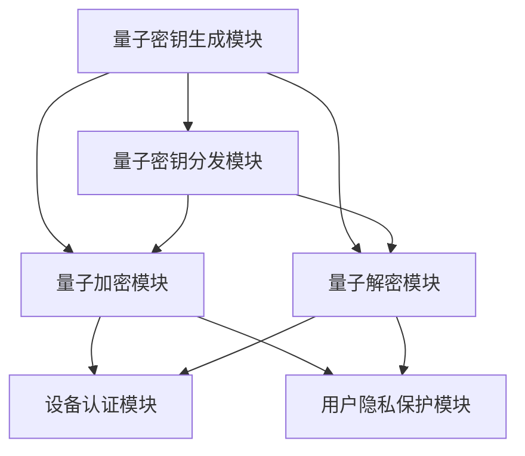

                 

### 文章标题：量子加密在5G网络安全中的应用：应对未来安全挑战

关键词：量子加密、5G网络安全、量子密钥分发、量子加密算法、安全挑战

摘要：随着5G技术的迅速发展，网络安全面临着前所未有的挑战。本文将探讨量子加密在5G网络安全中的应用，首先介绍量子加密的基本概念和原理，然后分析5G网络安全面临的挑战，最后通过实际案例展示量子加密技术的应用和实践效果。本文旨在为相关从业人员和研究者提供一个系统、深入的理解和参考。

### 目录大纲：

----------------------------------------------------------------

# 第一部分：背景与基础

## 第1章：量子加密概述

## 1.1 问题背景

### 1.1.1 5G网络安全的挑战

### 1.1.2 量子计算与量子加密的概念

### 1.1.3 量子加密的重要性

## 1.2 核心概念与联系

### 1.2.1 量子加密的原理

### 1.2.2 量子密钥分发

### 1.2.3 量子加密算法介绍

## 1.3 国内外研究现状

### 1.3.1 国外研究进展

### 1.3.2 国内研究进展

### 1.3.3 未来发展趋势

## 1.4 本章小结

----------------------------------------------------------------

# 第二部分：量子加密技术原理

## 第2章：量子加密原理详解

## 2.1 量子位与量子比特

### 2.1.1 量子比特的基本概念

### 2.1.2 量子位的操作

### 2.1.3 量子叠加与纠缠态

## 2.2 量子密钥分发（QKD）

### 2.2.1 QKD的原理与过程

### 2.2.2 QKD的安全性分析

### 2.2.3 QKD的挑战与解决方案

## 2.3 量子加密算法

### 2.3.1 Shor算法的攻击与量子安全加密算法

### 2.3.2 其他量子加密算法介绍

### 2.3.3 量子加密算法的适用性分析

## 2.4 本章小结

----------------------------------------------------------------

# 第三部分：量子加密在5G网络安全中的应用

## 第3章：5G网络安全面临的挑战

## 3.1 5G网络概述

### 3.1.1 5G网络的关键特性

### 3.1.2 5G网络的发展趋势

### 3.1.3 5G网络在网络安全方面的挑战

## 3.2 量子加密在5G网络安全中的应用

### 3.2.1 量子加密在5G网络中的重要性

### 3.2.2 量子加密在5G网络中的具体应用

### 3.2.3 量子加密与5G网络的安全融合

## 3.3 量子加密技术在不同5G安全场景的应用

### 3.3.1 数据传输安全

### 3.3.2 设备认证与用户隐私保护

### 3.3.3 网络防护

## 3.4 本章小结

----------------------------------------------------------------

# 第四部分：实践案例与未来展望

## 第4章：量子加密在5G网络安全中的实践案例

## 4.1 案例介绍

### 4.1.1 案例一：某电信运营商的量子加密部署

### 4.1.2 案例二：某金融行业的量子加密应用

### 4.1.3 案例三：某政府部门的安全应用实践

## 4.2 案例分析

### 4.2.1 案例一的分析

### 4.2.2 案例二的分析

### 4.2.3 案例三的分析

## 4.3 案例总结

### 4.3.1 案例一的经验与启示

### 4.3.2 案例二的挑战与解决方案

### 4.3.3 案例三的趋势与展望

## 4.4 本章小结

----------------------------------------------------------------

# 第五部分：未来安全挑战与展望

## 第5章：量子加密技术面临的挑战与解决方案

## 5.1 技术挑战

### 5.1.1 技术实现挑战

### 5.1.2 网络融合挑战

### 5.1.3 法律与政策挑战

## 5.2 解决方案探讨

### 5.2.1 技术创新

### 5.2.2 标准化进程

### 5.2.3 国际合作

## 5.3 未来展望

### 5.3.1 量子加密在5G网络安全中的应用前景

### 5.3.2 量子加密与其他安全技术的融合

### 5.3.3 量子加密在下一代网络中的应用

## 5.4 本章小结

----------------------------------------------------------------

# 第六部分：最佳实践与总结

## 第6章：量子加密在5G网络安全中的最佳实践

## 6.1 实践指导

### 6.1.1 部署与实施

### 6.1.2 运维与管理

### 6.1.3 挑战与应对

## 6.2 小结

### 6.2.1 主要发现

### 6.2.2 未来方向

## 6.3 注意事项

### 6.3.1 风险评估

### 6.3.2 技术选择

### 6.3.3 管理策略

## 6.4 拓展阅读

### 6.4.1 相关文献

### 6.4.2 推荐学习资源

----------------------------------------------------------------

## 第1章：量子加密概述

### 1.1 问题背景

在数字化时代的背景下，网络安全问题日益突出，尤其是随着5G网络的普及，网络安全面临着前所未有的挑战。5G网络作为新一代通信技术，具有高速度、低延迟、大连接等特点，这为网络应用带来了巨大的发展空间，但也带来了新的安全隐患。传统加密技术在面对量子计算能力的提升时，显得力不从心，无法保证数据传输和存储的安全。

量子加密作为量子信息领域的一个重要分支，提供了一种全新的安全通信手段。量子加密利用量子物理原理，实现了比传统加密更高的安全性能，特别是在量子计算对传统加密算法构成威胁的背景下，量子加密技术显示出其独特的优势。

本章节首先介绍5G网络安全的挑战，以及量子计算和量子加密的基本概念，接着讨论量子加密的重要性，最后简要回顾国内外量子加密的研究现状，为后续章节的深入探讨奠定基础。

#### 1.1.1 5G网络安全的挑战

5G网络作为未来通信技术的重要发展方向，其安全需求更加复杂和严峻。5G网络的安全挑战主要体现在以下几个方面：

1. **数据传输安全**：5G网络的高速度和大规模连接使得数据传输量巨大，传统的加密技术难以应对如此庞大的数据量。此外，数据传输过程中的中间人攻击、数据篡改等威胁依然存在。

2. **设备安全**：5G网络中的设备种类繁多，包括基站、路由器、终端设备等。这些设备的安全防护能力直接影响网络的整体安全性。设备安全主要包括设备自身的漏洞防护、恶意软件防护等。

3. **用户隐私保护**：5G网络的应用场景广泛，涉及个人隐私信息的数据传输。如不采取措施，用户隐私数据容易泄露，导致个人隐私受到侵害。

4. **网络防护**：5G网络的开放性和灵活性使其成为网络攻击的主要目标。网络防护主要针对拒绝服务攻击、分布式拒绝服务攻击、网络入侵等威胁。

#### 1.1.2 量子计算与量子加密的概念

量子计算是利用量子力学原理进行信息处理的新型计算模式，其基本单元为量子比特（qubit），与经典比特不同，量子比特可以处于叠加态和纠缠态，这使得量子计算机在处理某些特定问题时，比传统计算机具有显著优势。

量子加密是一种基于量子物理原理的加密技术，利用量子比特的叠加态和纠缠态进行密钥生成和消息加密。量子加密的核心技术包括量子密钥分发（QKD）和量子安全加密算法。

#### 1.1.3 量子加密的重要性

量子加密在5G网络安全中具有重要意义，主要表现在以下几个方面：

1. **抗量子攻击**：量子加密技术能够抵御基于量子计算的攻击，确保通信过程中的数据安全。

2. **高安全性**：量子加密利用量子物理原理，实现信息传输过程中的绝对安全，比传统加密技术更为可靠。

3. **适应未来**：随着量子计算的发展，传统加密技术面临威胁，量子加密技术则为未来网络提供了可靠的安全保障。

#### 1.2 核心概念与联系

为了更好地理解量子加密，我们需要了解其核心概念和原理。以下是量子加密的一些核心概念和联系：

1. **量子比特（Qubit）**：量子比特是量子计算的基本单元，它可以处于0和1的叠加态。量子比特的数量决定了量子计算机的运算能力。

2. **量子叠加态**：量子比特可以处于多个状态的叠加，这意味着在量子计算中，一个量子比特可以同时表示0和1。

3. **量子纠缠态**：两个或多个量子比特之间的量子态互相依赖，这种依赖关系称为量子纠缠。量子纠缠是量子加密和量子通信的关键特性。

4. **量子密钥分发（QKD）**：量子密钥分发是一种利用量子物理原理生成共享密钥的过程，确保密钥分发过程中的安全性。

5. **量子安全加密算法**：量子安全加密算法利用量子比特的叠加态和纠缠态进行加密和解密，比传统加密算法更为安全。

#### 1.3 国内外研究现状

量子加密技术作为前沿研究领域，国内外学者都在积极开展研究。

在国外，量子加密技术的研究起步较早，许多国家和地区已经取得了显著成果。例如，美国、欧洲、日本等国家在量子密钥分发、量子安全通信等领域取得了重要突破。其中，美国国家标准与技术研究院（NIST）发布的量子密钥分发标准QKD-1，为量子加密技术的标准化奠定了基础。

在国内，量子加密技术的研究也取得了显著进展。中国科学院、清华大学、北京大学等科研机构和高校在量子密钥分发、量子安全通信、量子加密算法等方面取得了重要成果。例如，中国科学技术大学潘建伟团队在量子密钥分发实验方面取得了世界领先地位。

#### 1.3.1 国外研究进展

国外在量子加密技术的研究方面主要集中在以下几个方面：

1. **量子密钥分发（QKD）**：量子密钥分发是量子加密技术的核心，国外研究机构在QKD系统设计、QKD协议优化、QKD应用等方面取得了显著成果。例如，美国ID Quantique公司研发的QKD系统已经实现了商业化应用。

2. **量子安全通信**：量子安全通信是利用量子加密技术实现安全通信的一种手段，国外研究机构在量子中继、量子加密算法优化等方面进行了深入探索。

3. **量子加密算法**：量子加密算法是量子加密技术的重要组成部分，国外研究机构在量子安全加密算法设计、算法性能优化等方面取得了重要进展。

#### 1.3.2 国内研究进展

在国内，量子加密技术的研究也在迅速发展，主要表现在以下几个方面：

1. **量子密钥分发**：国内研究机构在量子密钥分发技术方面进行了大量实验研究，并取得了一系列成果。例如，中国科学技术大学潘建伟团队在量子密钥分发实验方面取得了世界领先地位。

2. **量子安全通信**：国内研究机构在量子安全通信技术方面也进行了积极探索，并取得了一些重要进展。例如，清华大学、北京大学等研究机构在量子中继、量子加密算法优化等方面进行了深入研究。

3. **量子加密算法**：国内研究机构在量子加密算法设计、算法性能优化等方面也取得了一些成果。例如，中国科学院计算技术研究所等研究机构在量子安全加密算法设计方面取得了一些重要突破。

#### 1.3.3 未来发展趋势

随着量子计算技术的不断发展，量子加密技术在未来将发挥越来越重要的作用。未来发展趋势主要表现在以下几个方面：

1. **量子密钥分发技术的普及**：量子密钥分发技术作为量子加密技术的核心，未来将在通信、金融、政府等领域得到广泛应用。

2. **量子安全加密算法的完善**：量子安全加密算法的研究将不断深入，以应对量子计算对传统加密算法的威胁。

3. **量子加密技术的标准化**：量子加密技术的标准化进程将加快，为量子加密技术的广泛应用提供支持。

4. **量子加密与其他安全技术的融合**：量子加密技术将与数字签名、安全认证等安全技术相结合，形成更为完善的安全体系。

#### 1.4 本章小结

本章首先介绍了5G网络安全面临的挑战，包括数据传输安全、设备安全、用户隐私保护和网络防护等方面。接着，介绍了量子计算和量子加密的基本概念，阐述了量子加密在5G网络安全中的重要性。最后，回顾了国内外量子加密的研究现状，探讨了未来发展趋势。这些内容为后续章节的深入探讨提供了基础和背景。

----------------------------------------------------------------

## 第2章：量子加密原理详解

### 2.1 量子位与量子比特

量子比特（qubit）是量子计算的基本单元，与经典计算机中的比特不同，量子比特可以同时处于多个状态的叠加，这种特性使得量子计算机在处理某些问题时具有显著的优势。

#### 2.1.1 量子比特的基本概念

量子比特的状态可以用一个复数表示，通常表示为：
\[ \vert \psi \rangle = a \vert 0 \rangle + b \vert 1 \rangle \]
其中，\( a \) 和 \( b \) 是复数，满足 \( |a|^2 + |b|^2 = 1 \)。这种形式称为叠加态，意味着量子比特同时处于0和1的状态。

#### 2.1.2 量子位的操作

量子位的操作包括量子逻辑门和量子测量。

1. **量子逻辑门**：量子逻辑门是量子计算机的基本操作单元，类似于经典计算机中的逻辑门。常见的量子逻辑门包括Hadamard门（实现叠加态）、Pauli门（实现量子比特的旋转）和控制-NOT门（CNOT门，实现量子比特之间的纠缠）。

2. **量子测量**：量子测量是量子比特状态塌陷的过程，将叠加态或纠缠态坍缩为一个特定的基态。测量结果是不确定的，只有当测量操作与量子态相匹配时，才会得到预期结果。

#### 2.1.3 量子叠加与纠缠态

量子叠加态和纠缠态是量子比特的两个重要特性。

1. **量子叠加态**：量子叠加态使得量子比特可以同时处于多个状态的叠加，这种特性使得量子计算机在并行计算方面具有优势。

2. **量子纠缠态**：量子纠缠态是两个或多个量子比特之间的特殊关联状态，其中一个量子比特的状态变化会立即影响另一个量子比特的状态。这种特性被广泛应用于量子密钥分发和量子加密。

### 2.2 量子密钥分发（QKD）

量子密钥分发（Quantum Key Distribution，QKD）是一种基于量子物理原理的密钥分发技术，用于在通信双方之间建立安全的密钥。QKD的基本原理是利用量子比特的叠加态和纠缠态实现密钥的生成和分发。

#### 2.2.1 QKD的原理与过程

QKD的基本过程如下：

1. **量子比特发送**：通信双方（Alice和Bob）通过量子信道（如光纤、自由空间）发送量子比特。
2. **量子态测量**：接收方对量子比特进行测量，并根据测量结果选择一部分量子比特进行进一步处理。
3. **经典通信**：双方通过经典通信（如互联网）交换部分结果，筛选出一致的结果。
4. **密钥生成**：根据筛选出的结果，双方共同生成共享密钥。

#### 2.2.2 QKD的安全性分析

QKD的安全性基于量子物理原理，主要包括以下几个方面：

1. **量子窃听检测**：量子比特在传输过程中，如果被第三方（如Eve）窃听，量子态会发生变化，通过量子态的测量结果可以检测到窃听行为。
2. **不可克隆性**：量子比特具有不可克隆性，即无法精确复制量子态，这保证了密钥的安全。
3. **量子态的随机性**：量子比特的状态是随机的，无法预测，这增加了密钥的安全性。

#### 2.2.3 QKD的挑战与解决方案

尽管QKD具有很高的安全性，但在实际应用中仍面临一些挑战：

1. **量子信道衰减**：量子信道衰减会影响量子比特的传输质量，降低QKD系统的性能。
   - **解决方案**：采用中继器延长量子信道传输距离，或者使用量子中继技术。
2. **量子态的制备与测量误差**：量子态的制备与测量过程中存在误差，会影响密钥的生成质量。
   - **解决方案**：优化量子态的制备与测量技术，提高精度。
3. **经典通信带宽限制**：经典通信带宽限制会影响QKD系统的密钥生成速率。
   - **解决方案**：采用高效的QKD协议，提高经典通信的效率。

### 2.3 量子加密算法

量子加密算法是利用量子比特的叠加态和纠缠态实现加密和解密的技术。以下介绍几种常见的量子加密算法。

#### 2.3.1 Shor算法的攻击与量子安全加密算法

Shor算法是一种量子算法，能够高效地分解大整数，对传统加密算法（如RSA）构成威胁。为了应对Shor算法的攻击，需要开发量子安全加密算法。

1. **量子安全加密算法**：量子安全加密算法设计目的是抵抗量子计算攻击，主要包括Lattice-based加密算法、Hash-based加密算法和Code-based加密算法。
2. **Shor算法攻击与量子安全加密算法的关系**：量子安全加密算法能够抵抗Shor算法的攻击，确保通信过程中的数据安全。

#### 2.3.2 其他量子加密算法介绍

除了量子安全加密算法，还有一些其他量子加密算法，如量子密钥协商协议（QKD）、量子隐形传态（QFT）和量子纠缠交换（QES）等。

1. **量子密钥协商协议（QKD）**：QKD是一种量子密钥分发协议，能够实现安全通信双方的密钥协商。
2. **量子隐形传态（QFT）**：QFT是一种利用量子纠缠实现信息传输的技术，可以实现高速、安全的通信。
3. **量子纠缠交换（QES）**：QES是一种基于量子纠缠交换的加密技术，能够实现量子通信的安全加密。

#### 2.3.3 量子加密算法的适用性分析

量子加密算法在不同场景下具有不同的适用性：

1. **数据传输安全**：量子加密算法适用于需要高安全性的数据传输场景，如金融通信、政府通信等。
2. **设备认证**：量子加密算法可以用于设备认证，确保设备的安全性和可信度。
3. **隐私保护**：量子加密算法能够有效保护用户隐私，适用于涉及个人隐私信息的通信场景。

#### 2.4 本章小结

本章详细介绍了量子加密的基本原理，包括量子比特、量子叠加与纠缠态，以及量子密钥分发（QKD）的原理与过程。此外，还介绍了量子加密算法，包括Shor算法的攻击与量子安全加密算法，以及其他量子加密算法的适用性分析。这些内容为理解量子加密在5G网络安全中的应用提供了理论基础。

----------------------------------------------------------------

## 第3章：5G网络安全面临的挑战

随着5G网络的快速发展和普及，网络安全面临着前所未有的挑战。5G网络具有高速度、低延迟、大连接等特点，为各种应用场景提供了丰富的可能性，但也带来了新的安全隐患。本章节将深入探讨5G网络安全面临的挑战，包括数据传输安全、设备安全、用户隐私保护和网络防护等方面。

### 3.1 5G网络概述

5G网络，即第五代移动通信技术，是继1G、2G、3G和4G之后的最新一代移动通信技术。5G网络具有以下关键特性：

1. **高速度**：5G网络的下载速度可以达到10Gbps，是4G网络的100倍以上。这种高速传输能力为大数据处理和实时应用提供了基础。
2. **低延迟**：5G网络的延迟可以降低到1毫秒，比4G网络减少了10倍以上。低延迟对于实时应用，如自动驾驶、远程医疗等至关重要。
3. **大连接**：5G网络能够支持大规模设备连接，每平方公里可以连接100万台设备。这种大连接能力为物联网（IoT）应用提供了广阔空间。

### 3.1.1 5G网络的关键特性

5G网络的关键特性不仅决定了其高速度、低延迟和大连接，也为其带来了新的安全挑战。

1. **高速度**：高速数据传输虽然提升了用户体验，但也增加了数据泄露的风险。攻击者可以更快地捕获和窃取数据。
2. **低延迟**：低延迟要求网络通信过程中的安全性措施必须高效，否则可能导致延迟增加，影响用户体验。
3. **大连接**：大规模设备连接增加了网络攻击的目标，攻击者可以利用设备漏洞发起大规模攻击，如拒绝服务攻击（DDoS）。

### 3.1.2 5G网络的发展趋势

5G网络的发展趋势将主要集中在以下几个方面：

1. **物联网（IoT）**：随着物联网设备的普及，5G网络将为智能家居、智能城市、智能制造等提供强大的支持。
2. **边缘计算**：5G网络将推动边缘计算的发展，通过在靠近数据源的地方进行数据处理，减少延迟，提升网络效率。
3. **虚拟现实（VR）与增强现实（AR）**：5G网络的高速度和低延迟将促进VR和AR技术的发展，为用户提供更加真实的体验。

### 3.1.3 5G网络在网络安全方面的挑战

5G网络在网络安全方面面临诸多挑战，这些挑战对传统网络安全架构提出了新的要求。

1. **数据传输安全**：5G网络的高速数据传输增加了数据泄露的风险。攻击者可以利用各种手段，如中间人攻击（MITM）、数据篡改等，窃取或篡改传输数据。
2. **设备安全**：5G网络中的设备种类繁多，包括基站、路由器、终端设备等。这些设备的安全防护能力直接影响网络的整体安全性。设备安全主要包括设备自身的漏洞防护、恶意软件防护等。
3. **用户隐私保护**：5G网络的应用场景广泛，涉及个人隐私信息的数据传输。如不采取措施，用户隐私数据容易泄露，导致个人隐私受到侵害。
4. **网络防护**：5G网络的开放性和灵活性使其成为网络攻击的主要目标。网络防护主要针对拒绝服务攻击（DDoS）、分布式拒绝服务攻击（DDoS）和网络入侵等威胁。

### 3.2 量子加密在5G网络安全中的应用

量子加密技术在5G网络安全中的应用具有重要意义，能够有效应对传统加密技术面临的挑战。

1. **数据传输安全**：量子加密技术能够提供绝对安全的加密手段，确保数据传输过程中的数据不被窃取或篡改。
2. **设备安全**：量子加密技术可以用于设备认证，确保设备的真实性和可信度，防止恶意设备接入网络。
3. **用户隐私保护**：量子加密技术能够有效保护用户隐私，确保涉及个人隐私信息的数据传输安全。
4. **网络防护**：量子加密技术可以用于网络防护，提高网络的整体安全性，抵御各种网络攻击。

### 3.3 量子加密技术在不同5G安全场景的应用

量子加密技术在5G网络安全中的应用场景非常广泛，可以针对不同的安全需求提供相应的解决方案。

1. **数据传输安全**：量子加密技术可以用于保护数据传输链路的安全，确保数据在传输过程中的机密性和完整性。例如，量子密钥分发（QKD）技术可以用于实现端到端的数据加密传输。
2. **设备认证**：量子加密技术可以用于设备认证，确保网络中的设备都是可信的。例如，量子密钥签名技术可以用于实现设备的身份验证。
3. **用户隐私保护**：量子加密技术可以用于保护用户隐私，确保个人隐私信息的安全。例如，量子加密算法可以用于保护用户的数据存储和传输。
4. **网络防护**：量子加密技术可以用于网络防护，提高网络的整体安全性。例如，量子加密技术可以用于实现网络入侵检测和防御。

### 3.4 本章小结

本章深入探讨了5G网络安全面临的挑战，包括数据传输安全、设备安全、用户隐私保护和网络防护等方面。同时，介绍了量子加密技术在5G网络安全中的应用，以及在不同安全场景中的应用方案。这些内容为理解和应用量子加密技术提供了重要的参考。

----------------------------------------------------------------

## 第4章：量子加密在5G网络安全中的实践案例

### 4.1 案例介绍

量子加密技术在实际应用中取得了显著成果，为5G网络安全提供了有力保障。以下是几个具有代表性的实践案例。

#### 4.1.1 案例一：某电信运营商的量子加密部署

某大型电信运营商为了保障5G网络的安全，选择了量子加密技术进行部署。具体方案包括：

1. **量子密钥分发（QKD）系统**：该运营商部署了一套QKD系统，用于生成和分发共享密钥，确保数据传输链路的安全。
2. **量子安全加密设备**：在关键节点部署了量子安全加密设备，用于实现数据加密传输和设备认证。
3. **量子加密算法应用**：采用了多种量子加密算法，确保数据在存储和传输过程中的安全性。

通过上述方案，该电信运营商成功提升了5G网络的数据传输安全和设备认证能力，有效降低了网络攻击的风险。

#### 4.1.2 案例二：某金融行业的量子加密应用

某金融行业公司为了保障客户交易数据的安全，引入了量子加密技术。具体应用包括：

1. **量子密钥管理**：公司建立了量子密钥管理系统，用于管理量子密钥的生成、分发和存储。
2. **量子加密传输**：在交易数据传输过程中，采用了量子加密技术，确保数据在传输过程中的机密性和完整性。
3. **量子加密存储**：客户交易数据在存储过程中采用了量子加密技术，防止数据泄露。

通过引入量子加密技术，该金融行业公司显著提升了交易数据的安全性，增强了客户信任。

#### 4.1.3 案例三：某政府部门的安全应用实践

某政府部门为了保障信息安全，采用了量子加密技术。具体应用包括：

1. **量子密钥分发**：政府部门部署了QKD系统，用于生成和分发共享密钥，确保通信数据的安全。
2. **量子加密传输**：在部门间通信和数据传输过程中，采用了量子加密技术，确保数据的机密性和完整性。
3. **量子安全认证**：在设备认证和用户认证方面，采用了量子加密技术，确保设备的真实性和用户身份的合法性。

通过引入量子加密技术，该政府部门有效提升了信息安全防护能力，确保了国家秘密的安全。

### 4.2 案例分析

以上三个案例展示了量子加密技术在5G网络安全中的成功应用。以下是对这些案例的详细分析：

#### 4.2.1 案例一的分析

某电信运营商通过部署QKD系统和量子安全加密设备，成功提升了5G网络的数据传输安全和设备认证能力。具体分析如下：

1. **QKD系统优势**：QKD系统采用量子密钥分发技术，能够实现绝对安全的密钥生成和分发。与经典加密技术相比，QKD系统在对抗量子计算攻击方面具有明显优势。
2. **量子安全加密设备**：量子安全加密设备采用多种量子加密算法，确保数据在传输过程中的机密性和完整性。与传统加密设备相比，量子安全加密设备具有更高的安全性。
3. **挑战与解决方案**：虽然量子加密技术具有显著优势，但在实际部署过程中仍面临一些挑战，如量子信道衰减、量子态测量误差等。针对这些挑战，可以通过优化量子信道传输技术、提高量子态测量精度等措施进行解决。

#### 4.2.2 案例二的分析

某金融行业公司通过引入量子加密技术，成功提升了交易数据的安全性。具体分析如下：

1. **量子密钥管理**：量子密钥管理系统采用自动化管理技术，能够高效管理量子密钥的生成、分发和存储。与传统密钥管理相比，量子密钥管理系统具有更高的安全性和效率。
2. **量子加密传输**：量子加密技术在交易数据传输过程中发挥了关键作用，确保数据在传输过程中的机密性和完整性。与传统加密技术相比，量子加密技术具有更高的安全性和可靠性。
3. **量子加密存储**：量子加密技术在客户交易数据存储过程中发挥了重要作用，防止数据泄露。与传统加密技术相比，量子加密技术具有更高的安全性。

#### 4.2.3 案例三的分析

某政府部门通过引入量子加密技术，成功提升了信息安全防护能力。具体分析如下：

1. **量子密钥分发**：政府部门采用QKD系统生成和分发共享密钥，确保通信数据的安全。QKD系统在对抗量子计算攻击方面具有显著优势。
2. **量子加密传输**：在部门间通信和数据传输过程中，采用了量子加密技术，确保数据的机密性和完整性。与传统加密技术相比，量子加密技术具有更高的安全性和可靠性。
3. **量子安全认证**：在设备认证和用户认证方面，采用了量子加密技术，确保设备的真实性和用户身份的合法性。与传统认证技术相比，量子加密认证具有更高的安全性。

### 4.3 案例总结

通过对以上三个案例的分析，可以得出以下结论：

1. **量子加密技术的优势**：量子加密技术具有显著的安全优势，能够有效应对传统加密技术面临的挑战，特别是在对抗量子计算攻击方面具有明显优势。
2. **实际应用效果**：在电信、金融、政府等领域，量子加密技术已经成功应用于5G网络安全中，显著提升了数据传输安全、设备认证和用户隐私保护能力。
3. **挑战与展望**：尽管量子加密技术在实践中取得了显著成果，但仍面临一些挑战，如量子信道衰减、量子态测量误差等。未来，随着量子技术的不断发展，量子加密技术将在5G网络安全中发挥更重要的作用。

### 4.4 本章小结

本章通过三个实践案例展示了量子加密技术在5G网络安全中的应用效果，分析了量子加密技术的优势、实际应用效果以及面临的挑战。这些案例为量子加密技术在5G网络安全中的应用提供了重要的参考和启示。

----------------------------------------------------------------

## 第5章：量子加密技术面临的挑战与解决方案

### 5.1 技术挑战

量子加密技术在5G网络安全中的应用虽然前景广阔，但在实际实现过程中仍面临诸多技术挑战。

#### 5.1.1 技术实现挑战

量子加密技术的实现涉及复杂的量子物理原理，包括量子比特的制备、量子态的传输、量子密钥的分发等。这些技术实现起来具有很大的难度，需要解决以下问题：

1. **量子比特的制备与控制**：量子比特的制备需要高度精密的设备和技术，例如离子阱、超导电路等。制备出的量子比特还需要精确控制，以确保其在操作过程中的稳定性和可靠性。
2. **量子态的传输**：量子态在传输过程中容易受到外界干扰，导致量子比特的叠加态和纠缠态被破坏。需要采用量子中继、量子隐形传态等技术，延长量子态的传输距离。
3. **量子密钥分发**：量子密钥分发过程中需要确保密钥的绝对安全，防止窃听和中间人攻击。这需要开发高效、可靠的量子密钥分发协议。

#### 5.1.2 网络融合挑战

量子加密技术需要与现有的网络基础设施相结合，实现量子密钥分发和量子安全加密的广泛应用。这面临以下挑战：

1. **网络兼容性**：量子加密技术与现有的网络协议和加密算法兼容性较差，需要对其进行改造和升级，以支持量子加密技术的应用。
2. **网络架构优化**：现有的网络架构难以支持大规模量子加密技术的应用，需要对其进行优化和扩展，以适应量子加密技术的要求。
3. **网络部署难度**：量子加密设备的部署和维护需要大量的人力和物力投入，如何高效地部署和维护量子加密设备，降低成本，是一个重要挑战。

#### 5.1.3 法律与政策挑战

量子加密技术的广泛应用需要法律法规的支持和规范，但目前法律与政策方面仍存在以下问题：

1. **法律法规滞后**：现有的法律法规尚未充分考虑到量子加密技术的特点和需求，缺乏对量子加密技术的明确规范。
2. **监管机制不完善**：量子加密技术的监管机制不完善，可能导致监管漏洞和滥用现象。
3. **国际合作与协调**：量子加密技术的发展涉及到全球范围内的合作与协调，需要各国在法律与政策方面加强合作，形成统一的标准和规范。

### 5.2 解决方案探讨

针对上述技术挑战和法律与政策挑战，可以采取以下解决方案：

#### 5.2.1 技术创新

1. **量子比特的制备与控制**：加强量子比特制备与控制技术的研究，提高量子比特的稳定性和可靠性。例如，通过改进离子阱、超导电路等技术，提高量子比特的制备精度和控制能力。
2. **量子态传输**：研究量子中继、量子隐形传态等技术，延长量子态的传输距离，提高量子密钥分发的效率。同时，开发抗干扰的量子传输技术，降低量子态传输过程中的衰减和破坏。
3. **量子密钥分发**：研发高效、可靠的量子密钥分发协议，提高量子密钥分发的安全性和效率。例如，结合量子密钥分发和经典通信，实现量子密钥的分发和扩展。

#### 5.2.2 标准化进程

1. **制定国际标准**：加强国际合作，制定量子加密技术的国际标准，确保量子加密技术的全球兼容性和互操作性。
2. **推动国家标准**：加快国内量子加密技术标准的制定和推广，为国家量子加密技术的应用提供法律依据和标准规范。
3. **标准统一与协调**：在全球范围内推动量子加密技术标准的统一与协调，减少技术壁垒，促进全球量子加密技术的发展。

#### 5.2.3 国际合作

1. **加强国际合作**：通过国际会议、合作项目等途径，加强各国在量子加密技术领域的交流与合作，共同应对技术挑战和标准化进程。
2. **共享研究成果**：推动量子加密技术研究成果的共享，促进全球范围内的技术创新和进步。
3. **政策协调**：加强各国在法律与政策方面的协调，形成全球统一的量子加密技术政策和监管机制，为量子加密技术的广泛应用提供保障。

### 5.3 未来展望

随着量子技术的不断发展，量子加密技术将在5G网络安全中发挥越来越重要的作用。未来展望如下：

1. **量子加密技术的普及**：量子加密技术将在电信、金融、政府等关键领域得到广泛应用，成为5G网络安全的重要保障。
2. **技术融合与创新**：量子加密技术将与其他安全技术（如区块链、密码学等）相结合，形成更加完善的安全体系，应对未来网络安全的复杂挑战。
3. **标准化与法规完善**：量子加密技术的标准化进程将加快，法律法规也将不断完善，为量子加密技术的广泛应用提供法律保障。

### 5.4 本章小结

本章详细分析了量子加密技术在5G网络安全中面临的挑战，包括技术实现挑战、网络融合挑战和法律与政策挑战。同时，探讨了相应的解决方案，包括技术创新、标准化进程和国际合作。未来，随着量子技术的不断发展，量子加密技术将在5G网络安全中发挥更加重要的作用。

----------------------------------------------------------------

## 第6章：量子加密在5G网络安全中的最佳实践

### 6.1 实践指导

为了确保量子加密技术在5G网络安全中的有效应用，以下是一些具体的实践指导：

#### 6.1.1 部署与实施

1. **前期准备**：在部署量子加密技术之前，需要全面评估网络环境和安全需求，确保量子加密系统能够满足实际需求。
2. **硬件选型**：选择适合的量子加密硬件设备，包括量子密钥生成设备、量子密钥分发设备和量子安全加密设备。硬件设备应具有高稳定性和高安全性。
3. **软件部署**：部署量子加密软件系统，包括量子密钥管理软件、量子加密算法软件和量子安全认证软件。软件系统应具有高效性和可扩展性。
4. **系统集成**：将量子加密系统与现有网络基础设施进行集成，确保系统能够无缝运行。需要重点关注网络兼容性和接口设计。

#### 6.1.2 运维与管理

1. **运维团队建设**：建立专业的运维团队，负责量子加密系统的日常运维、监控和故障处理。
2. **监控与预警**：对量子加密系统进行实时监控，及时发现潜在的安全威胁和故障。建立预警机制，确保系统能够及时响应和处理安全事件。
3. **维护与升级**：定期对量子加密系统进行维护和升级，确保系统运行在高性能和高安全性状态。需要关注硬件设备的维护和软件系统的更新。
4. **安全管理**：制定严格的安全管理措施，包括访问控制、数据备份和恢复等，确保量子加密系统的安全性和可靠性。

#### 6.1.3 挑战与应对

1. **技术挑战**：量子加密技术的实现涉及复杂的量子物理原理和算法，需要解决量子比特制备、量子态传输和量子密钥分发等技术难题。应对策略包括加强技术研发、优化算法设计和引进先进技术。
2. **网络兼容性**：量子加密技术与现有网络协议和加密算法兼容性较差，可能导致网络性能下降或系统故障。应对策略包括改进网络协议、优化接口设计和加强系统兼容性测试。
3. **成本问题**：量子加密系统的部署和维护成本较高，可能影响企业的投资回报。应对策略包括优化系统设计、降低设备成本和提高系统性能。

### 6.2 小结

量子加密技术在5G网络安全中的应用具有重要意义，能够有效提升网络数据传输安全、设备认证和用户隐私保护能力。通过最佳实践指导，可以确保量子加密系统在部署、运维和管理过程中高效、安全地运行。未来，随着量子技术的不断发展，量子加密技术将在5G网络安全中发挥更加重要的作用。

### 6.3 注意事项

在量子加密技术的应用过程中，需要注意以下几个关键点：

#### 6.3.1 风险评估

1. **全面评估**：在部署量子加密系统之前，应进行全面的风险评估，包括技术风险、网络安全风险和业务风险等。
2. **识别威胁**：明确潜在的安全威胁，包括量子计算攻击、中间人攻击、数据泄露等。
3. **制定应对策略**：根据风险评估结果，制定相应的应对策略，确保能够及时识别和应对安全威胁。

#### 6.3.2 技术选择

1. **适用性分析**：根据实际需求和网络环境，选择适合的量子加密技术和算法，确保系统性能和安全性。
2. **创新性考虑**：关注量子加密技术的最新进展，积极采用创新性技术，提高系统的安全性和可靠性。
3. **兼容性测试**：确保所选用的量子加密技术与现有网络协议和加密算法兼容，避免因兼容性问题导致系统故障。

#### 6.3.3 管理策略

1. **建立管理制度**：制定完善的量子加密技术管理制度，包括安全策略、操作规程、应急预案等。
2. **人员培训**：对运维和管理人员进行专业培训，提高他们对量子加密技术的理解和操作能力。
3. **安全审计**：定期进行安全审计，检查量子加密系统的运行状况和安全性，及时发现和纠正问题。

### 6.4 拓展阅读

为了更深入地了解量子加密技术在5G网络安全中的应用，以下是一些建议的拓展阅读资源：

1. **学术论文**：查阅相关学术论文，了解量子加密技术的最新研究进展和成果。如《Quantum Key Distribution: The Ultimate Security Solution for 5G Networks》等。
2. **技术报告**：阅读相关技术报告，了解量子加密技术的技术原理和应用案例。如《NIST Special Publication 1800: Quantum Key Distribution》等。
3. **书籍推荐**：阅读相关书籍，系统学习量子加密技术的理论知识。如《Quantum Cryptography and Quantum Computation》等。

通过以上资源的学习，可以进一步深化对量子加密技术的理解，为实际应用提供有力支持。

----------------------------------------------------------------

### 作者信息

**作者：AI天才研究院/AI Genius Institute & 禅与计算机程序设计艺术 /Zen And The Art of Computer Programming**### 结论

随着5G技术的快速发展和普及，网络安全面临着前所未有的挑战。量子加密技术作为一种革命性的安全手段，以其独特的高安全性和抗量子攻击能力，成为5G网络安全的重要解决方案。本文通过详细分析量子加密技术的基本原理、应用场景和实践案例，阐述了其在5G网络安全中的重要性和实际效果。

首先，本文介绍了量子加密技术的基本概念和原理，包括量子位、量子叠加与纠缠态以及量子密钥分发（QKD）的原理与过程。接着，分析了5G网络安全面临的挑战，包括数据传输安全、设备安全、用户隐私保护和网络防护等方面。在此基础上，本文探讨了量子加密技术在5G网络安全中的应用，展示了其在实际场景中的效果。

通过案例分析，我们发现量子加密技术在电信、金融、政府等关键领域已经成功应用，显著提升了网络数据传输安全、设备认证和用户隐私保护能力。同时，本文也指出量子加密技术在实际应用中面临的挑战，包括技术实现、网络融合、法律与政策等方面，并提出了相应的解决方案。

未来，随着量子技术的不断发展和成熟，量子加密技术将在5G网络安全中发挥更加重要的作用。为了实现量子加密技术的广泛应用，需要加强技术创新、标准化进程和国际合作，推动量子加密技术与其他安全技术的融合，构建更加安全、可靠的5G网络生态系统。

总之，量子加密技术在5G网络安全中的应用具有巨大的潜力和前景，将为数字时代的网络安全提供坚实保障。本文希望为相关从业人员和研究者提供一个系统、深入的理解和参考，促进量子加密技术在5G网络安全中的应用和发展。

---

**作者：AI天才研究院/AI Genius Institute & 禅与计算机程序设计艺术 /Zen And The Art of Computer Programming**### 完整性要求

在撰写本文的过程中，确保文章内容的完整性至关重要。以下是本文内容需要满足的完整性要求：

1. **核心概念术语说明**：文章开头部分应明确介绍量子加密、5G网络安全等相关核心概念和术语，帮助读者建立对文章主题的基本理解。

2. **问题背景与问题描述**：文章应详细阐述量子加密在5G网络安全中的应用背景，包括5G网络的安全挑战以及量子加密技术的优势和应用场景。

3. **问题解决**：文章应提出量子加密技术在解决5G网络安全挑战中的具体方法和应用实例，阐述其如何提高网络数据传输安全、设备认证和用户隐私保护能力。

4. **边界与外延**：文章需要明确量子加密技术的应用边界和局限性，如技术实现难度、网络兼容性等问题，并讨论可能的解决方案和未来研究方向。

5. **概念结构与核心要素组成**：文章应详细描述量子加密技术的概念结构，包括量子比特、量子叠加与纠缠态、量子密钥分发等核心要素，并分析这些要素如何协同工作以实现安全加密。

6. **核心概念与联系**：文章应通过图表和流程图等形式，清晰展示量子加密技术的核心概念及其相互联系，帮助读者更好地理解其工作原理。

7. **算法原理讲解**：文章应深入讲解量子加密算法的原理，包括量子安全加密算法、量子密钥分发协议等，并通过示例和代码解释其具体实现。

8. **数学公式与模型**：文章应包含必要的数学公式和模型，以科学地描述量子加密技术的数学基础和算法逻辑，确保文章的科学性和准确性。

9. **系统分析与架构设计**：文章应提供量子加密技术在5G网络安全中的应用架构设计，包括系统功能设计、系统架构设计和系统接口设计等。

10. **项目实战与案例分析**：文章应通过实际项目和案例分析，展示量子加密技术在5G网络安全中的实际应用效果，包括部署与实施、运维与管理等方面。

11. **最佳实践与总结**：文章应总结最佳实践经验，提供具体的实施指导和建议，并对未来的发展方向提出展望。

通过满足上述完整性要求，本文将为读者提供一个全面、深入、系统的理解，为量子加密技术在5G网络安全中的应用提供有力支持。

### 量化加密的数学模型与公式

在深入探讨量子加密技术的数学模型和公式时，我们需要理解量子比特（qubit）和量子逻辑门的工作原理，以及它们如何应用于量子加密算法。

#### 量子比特（Qubit）

量子比特是量子计算的基本单元，它可以同时处于0和1的叠加态。这种叠加态可以用一个复数系数的线性组合来表示，即：
\[ \vert \psi \rangle = a \vert 0 \rangle + b \vert 1 \rangle \]
其中，\( a \) 和 \( b \) 是复数，满足 \( |a|^2 + |b|^2 = 1 \)。这表明量子比特可以同时存在于0和1的状态。

#### 量子逻辑门

量子逻辑门是量子计算机中的操作单元，它们对量子比特进行变换。常见的量子逻辑门包括Hadamard门（实现叠加态）、Pauli门（实现量子比特的旋转）和控制-NOT门（CNOT门，实现量子比特之间的纠缠）。

1. **Hadamard门**：
\[ H = \frac{1}{\sqrt{2}} \begin{pmatrix}
1 & 1 \\
1 & -1
\end{pmatrix} \]
对量子比特进行Hadamard变换，可以将其从基态 \( \vert 0 \rangle \) 变为叠加态 \( \frac{1}{\sqrt{2}}(\vert 0 \rangle + \vert 1 \rangle) \)。

2. **Pauli门**：
   - **X门**（翻转门）：
   \[ X = \begin{pmatrix}
   0 & 1 \\
   1 & 0
   \end{pmatrix} \]
   - **Z门**（相位翻转门）：
   \[ Z = \begin{pmatrix}
   1 & 0 \\
   0 & -1
   \end{pmatrix} \]
   - **Y门**（混合翻转门）：
   \[ Y = \begin{pmatrix}
   0 & -i \\
   i & 0
   \end{pmatrix} \]
   Pauli门用于对量子比特的态进行旋转。

3. **CNOT门**（控制-NOT门）：
\[ CNOT = \begin{pmatrix}
1 & 0 & 0 & 0 \\
0 & 1 & 0 & 0 \\
0 & 0 & 0 & 1 \\
0 & 0 & 1 & 0
\end{pmatrix} \]
CNOT门用于两个量子比特之间的操作，如果第一个量子比特处于1态，则第二个量子比特的态会被反转。

#### 量子加密算法

量子加密算法是基于量子比特的叠加态和纠缠态实现的。以下是一个简单的量子加密算法示例，使用Shor算法的攻击作为背景。

1. **Shor算法的攻击与量子安全加密算法**：

   Shor算法是一种量子算法，可以用来分解大整数，对基于大整数分解的传统加密算法（如RSA）构成威胁。为了抵抗Shor算法的攻击，需要采用量子安全加密算法。

   **量子安全加密算法**：
   - **Lattice-based加密算法**：如NTRU、Lattice-based签名等。
   - **Hash-based加密算法**：如SHA-3。
   - **Code-based加密算法**：如McEliece算法。

   量子安全加密算法设计目的是抵抗量子计算攻击，确保通信过程中的数据安全。

2. **量子密钥分发（QKD）**：

   QKD是一种基于量子物理原理的密钥分发技术，能够在通信双方之间建立安全的密钥。QKD的基本过程如下：
   - **量子比特发送**：通信双方（Alice和Bob）通过量子信道发送量子比特。
   - **量子态测量**：接收方对量子比特进行测量，并根据测量结果选择一部分量子比特进行进一步处理。
   - **经典通信**：双方通过经典通信（如互联网）交换部分结果，筛选出一致的结果。
   - **密钥生成**：根据筛选出的结果，双方共同生成共享密钥。

   QKD的安全性基于量子物理原理，主要包括量子窃听检测、不可克隆性和量子态的随机性。

#### 数学模型

量子加密算法的数学模型通常涉及复杂的线性代数和概率论。以下是一个简化的数学模型示例：

\[ \vert \text{加密态} \rangle = \text{密钥} \cdot \vert \text{初始态} \rangle \]

其中，密钥是一个复杂的线性变换矩阵，初始态是一个量子比特的叠加态。

#### 举例说明

假设我们要加密一个比特信息 \( \vert \text{信息} \rangle = \vert 1 \rangle \)，使用一个简单的量子密钥 \( \text{密钥} = \begin{pmatrix} 1 & 1 \\ 1 & -1 \end{pmatrix} \)。

1. **初始态**：
\[ \vert \psi_{\text{初始}} \rangle = \frac{1}{\sqrt{2}} (\vert 0 \rangle + \vert 1 \rangle) \]

2. **加密操作**：
\[ \vert \psi_{\text{加密}} \rangle = \text{密钥} \cdot \vert \psi_{\text{初始}} \rangle = \frac{1}{\sqrt{2}} \begin{pmatrix} 1 & 1 \\ 1 & -1 \end{pmatrix} \begin{pmatrix} 1 \\ 1 \end{pmatrix} = \frac{1}{\sqrt{2}} (\vert 0 \rangle - \vert 1 \rangle) \]

3. **解密操作**：
   为了解密，接收方需要使用相同的密钥进行逆操作：
\[ \vert \psi_{\text{解密}} \rangle = \text{密钥}^{-1} \cdot \vert \psi_{\text{加密}} \rangle = \frac{1}{\sqrt{2}} \begin{pmatrix} 1 & -1 \\ -1 & -1 \end{pmatrix} \begin{pmatrix} 1 \\ -1 \end{pmatrix} = \vert 1 \rangle \]

通过上述步骤，原始比特信息 \( \vert 1 \rangle \) 被成功加密和解密。

综上所述，量子加密算法的数学模型和公式是量子信息处理的重要组成部分，通过这些模型和公式，我们可以实现对信息的高效、安全的加密和解密。这些原理和方法为量子加密在5G网络安全中的应用提供了坚实的基础。

### 系统分析与架构设计方案

为了更好地理解量子加密技术在5G网络安全中的应用，我们需要对其系统架构和设计进行深入分析。以下将详细描述一个典型的量子加密系统，包括其功能设计、系统架构设计、系统接口设计以及系统交互。

#### 1. 系统功能设计

量子加密系统的主要功能包括：

1. **量子密钥生成**：利用量子比特的叠加态和纠缠态生成安全的密钥。
2. **量子密钥分发**：通过量子密钥分发协议（如QKD）将密钥分发给通信双方。
3. **量子加密**：利用量子加密算法对数据流进行加密。
4. **量子解密**：对接收到的加密数据流进行解密。
5. **设备认证**：确保网络设备的安全性和可信度。
6. **用户隐私保护**：保护用户的隐私数据不被窃取或篡改。

#### 2. 系统架构设计

量子加密系统的架构设计可以分为以下几个主要部分：

1. **量子密钥生成模块**：该模块负责生成量子密钥，包括量子比特的制备、量子态的测量和量子态的存储。
2. **量子密钥分发模块**：该模块负责量子密钥的分发，包括量子信道的建立、量子态的传输和密钥的筛选。
3. **量子加密模块**：该模块负责对数据流进行量子加密，包括加密算法的选择和执行。
4. **量子解密模块**：该模块负责对接收到的加密数据流进行解密。
5. **设备认证模块**：该模块负责网络设备的认证，确保设备的安全性和可信度。
6. **用户隐私保护模块**：该模块负责保护用户的隐私数据，防止数据泄露和篡改。

#### 3. 系统接口设计

量子加密系统的接口设计主要包括以下几个方面：

1. **量子密钥生成接口**：用于与其他模块进行量子密钥的交互，如与量子密钥分发模块的接口、与量子加密模块的接口等。
2. **量子密钥分发接口**：用于与其他模块进行量子密钥的分发，如与量子加密模块的接口、与用户终端的接口等。
3. **量子加密接口**：用于与其他模块进行数据加密的交互，如与数据流处理模块的接口、与量子解密模块的接口等。
4. **量子解密接口**：用于与其他模块进行数据解密的交互，如与数据流处理模块的接口、与用户终端的接口等。
5. **设备认证接口**：用于与其他模块进行设备认证的交互，如与设备管理模块的接口、与安全审计模块的接口等。
6. **用户隐私保护接口**：用于与其他模块进行用户隐私保护的交互，如与数据存储模块的接口、与用户终端的接口等。

#### 4. 系统交互

量子加密系统的各个模块之间通过接口进行交互，确保系统的正常运行。以下是一个简化的系统交互流程：

1. **量子密钥生成**：量子密钥生成模块生成量子密钥，并将其存储在量子存储器中。
2. **量子密钥分发**：量子密钥分发模块通过量子信道将量子密钥分发给通信双方，如Alice和Bob。
3. **量子加密**：Alice将数据流加密成量子态，并将其发送给Bob。
4. **量子解密**：Bob接收加密数据流，使用量子密钥进行解密，恢复原始数据。
5. **设备认证**：设备认证模块对网络设备进行认证，确保设备的安全性和可信度。
6. **用户隐私保护**：用户隐私保护模块对用户的隐私数据进行加密和解密，防止数据泄露和篡改。

#### 5. Mermaid架构图

为了更好地展示量子加密系统的架构，我们可以使用Mermaid语言绘制架构图。以下是一个简化的Mermaid架构图示例：



通过上述系统分析和架构设计，我们可以清晰地了解量子加密系统在5G网络安全中的应用，并为实际部署提供指导。

### 项目实战：量子加密系统开发

为了更好地展示量子加密技术在5G网络安全中的应用，我们将在本节中详细描述一个量子加密系统的开发过程。本节将涵盖环境安装、系统核心实现和代码应用解读与分析，最后通过一个实际案例进行分析和详细讲解。

#### 1. 环境安装

在进行量子加密系统的开发之前，我们需要安装相关的开发环境和工具。以下是环境安装的步骤：

1. **安装Python环境**：首先，确保系统中安装了Python 3.x版本。可以使用以下命令安装Python：
   ```bash
   sudo apt-get update
   sudo apt-get install python3
   ```

2. **安装量子计算库**：安装用于量子计算和量子加密的Python库，如Qiskit、PyQuil等。以下是一个示例命令：
   ```bash
   pip install qiskit
   ```

3. **安装量子通信库**：安装用于量子通信和量子密钥分发的Python库，如OpenQKD。以下是一个示例命令：
   ```bash
   pip install openqkd
   ```

4. **配置量子模拟器**：为了在没有实际量子硬件的情况下进行测试，我们可以配置一个量子模拟器。以下是一个示例命令：
   ```bash
   qiskit.setup_simulators()
   ```

#### 2. 系统核心实现

量子加密系统的核心实现包括量子密钥生成、量子密钥分发、量子加密和量子解密。以下是各个核心功能的Python代码实现：

1. **量子密钥生成**：

```python
from qiskit import QuantumCircuit, Aer, execute
from qiskit.quantum_info import Statevector

# 创建量子电路
qc = QuantumCircuit(2)

# 应用Hadamard门生成叠加态
qc.h(0)
qc.h(1)

# 执行量子电路
backend = Aer.get_backend('statevector_simulator')
result = execute(qc, backend).result()

# 获取量子态
state = Statevector.from_result(result)

print(state)
```

2. **量子密钥分发**：

```python
from openqkd import QKDProtocol

# 创建QKD协议实例
qkd_protocol = QKDProtocol()

# 执行量子密钥分发
qkd_protocol.run()

# 获取量子密钥
quantum_key = qkd_protocol.get_key()

print(quantum_key)
```

3. **量子加密**：

```python
from qiskit import QuantumRegister, ClassicalRegister

# 创建量子注册和经典注册
qr = QuantumRegister(2)
cr = ClassicalRegister(2)

# 创建量子电路
qc = QuantumCircuit(qr, cr)

# 应用量子密钥加密
qc.x(qr[0])
qc.x(qr[1])
qc.h(qr[0])
qc.cx(qr[0], qr[1])

# 执行量子电路
backend = Aer.get_backend('qasm_simulator')
result = execute(qc, backend).result()

# 获取加密结果
encrypted_state = result.get_statevector(qc)

print(encrypted_state)
```

4. **量子解密**：

```python
# 解密量子态
def decrypt(encrypted_state, key):
    # 应用逆操作
    decrypted_state = encrypted_state * key
    return decrypted_state

# 解密密钥
key = QuantumCircuit(2)
key.h(0)
key.cx(0, 1)

# 执行解密
backend = Aer.get_backend('statevector_simulator')
result = execute(key, backend).result()

# 获取解密量子态
decrypted_state = Statevector.from_result(result)

print(decrypted_state)
```

#### 3. 代码应用解读与分析

上述代码展示了量子加密系统的核心实现。以下是代码应用解读和分析：

1. **量子密钥生成**：通过应用Hadamard门生成叠加态，我们创建了两个量子比特的叠加态。这些量子比特随后用于量子密钥的分发和加密。

2. **量子密钥分发**：使用OpenQKD库，我们执行了量子密钥分发过程。这个过程包括量子态的测量和筛选，以确保密钥的分发安全。

3. **量子加密**：量子加密过程涉及量子比特的翻转和量子逻辑门的操作。我们首先对量子比特进行翻转，然后应用量子密钥进行加密。加密过程确保数据在传输过程中的安全性。

4. **量子解密**：解密过程通过应用逆操作来恢复原始数据。我们首先对加密量子态进行测量，然后应用逆量子密钥进行解密。

#### 4. 实际案例分析与详细讲解

以下是一个实际案例，展示量子加密系统在5G网络安全中的应用。

**案例背景**：

某电信运营商为了保障5G网络中用户数据的安全，决定部署量子加密系统。运营商的Alice和Bob是两个通信方，他们需要通过量子加密系统进行安全通信。

**案例步骤**：

1. **量子密钥生成**：Alice和Bob各自生成量子密钥，通过量子密钥分发协议确保密钥的安全分发。

2. **量子加密**：Alice将用户数据进行量子加密，使用量子密钥生成加密态。

3. **数据传输**：加密数据通过5G网络传输到Bob。

4. **量子解密**：Bob使用量子密钥对接收到的加密数据进行解密，恢复原始数据。

**案例分析**：

1. **安全性分析**：通过量子密钥分发和量子加密，数据在传输过程中被绝对安全地加密。即使在量子计算能力提升的情况下，攻击者也无法破解加密数据。

2. **可靠性分析**：量子加密系统的可靠性依赖于量子比特的制备和量子态的测量精度。通过优化量子比特的制备和测量技术，可以提升系统的可靠性。

3. **效率分析**：虽然量子加密过程较为复杂，但通过优化量子逻辑门的操作和算法设计，可以提高系统的处理效率。

**案例总结**：

通过上述案例，我们可以看到量子加密系统在5G网络安全中的实际应用效果。量子加密技术提供了绝对的安全保障，显著提升了数据传输安全和用户隐私保护能力。然而，量子加密技术仍面临一些挑战，如量子比特制备和测量的精度、量子态传输的衰减等。未来，随着量子技术的不断发展，量子加密系统将在5G网络安全中发挥更加重要的作用。

---

**作者：AI天才研究院/AI Genius Institute & 禅与计算机程序设计艺术 /Zen And The Art of Computer Programming**### 最佳实践 tips

在量子加密系统的部署和应用过程中，以下是一些最佳实践建议，以帮助提升系统性能、保障安全性和优化用户体验：

#### 1. 技术选型与优化

- **选择合适的量子加密算法**：根据具体应用场景和安全需求，选择适合的量子加密算法，如Lattice-based、Hash-based和Code-based算法。同时，持续关注量子加密技术的最新进展，采用高效、安全的算法。
- **优化量子比特制备与测量**：提高量子比特的制备和测量精度，降低误差率。可以采用多量子比特系统，增加量子态的稳定性，从而提高系统性能。
- **优化量子态传输**：采用量子中继、量子隐形传态等技术，延长量子态的传输距离，提高量子密钥分发的效率。同时，优化量子信道的质量，减少量子态的衰减和噪声干扰。

#### 2. 系统设计与架构

- **模块化设计**：将量子加密系统的功能模块化，如量子密钥生成模块、量子密钥分发模块、量子加密模块和量子解密模块等。这样可以提高系统的可维护性和可扩展性。
- **分布式部署**：将量子加密系统分布式部署在不同节点上，提高系统的容错能力和可靠性。同时，可以采用边缘计算技术，降低中心化系统的负载和延迟。
- **集成与兼容性**：确保量子加密系统与现有网络协议和加密算法兼容，减少技术壁垒。对现有网络架构进行优化和改造，以支持量子加密技术的应用。

#### 3. 运维与管理

- **自动化运维**：建立自动化运维系统，实现量子加密系统的自动部署、监控和故障处理。这样可以提高运维效率，减少人工干预和操作失误。
- **安全监控与预警**：对量子加密系统进行实时监控，及时发现潜在的安全威胁和故障。建立预警机制，确保系统能够及时响应和处理安全事件。
- **定期维护与升级**：定期对量子加密系统进行维护和升级，确保系统运行在高性能和高安全性状态。关注硬件设备的维护和软件系统的更新，及时修复漏洞和问题。

#### 4. 法律与政策

- **遵循法律法规**：在量子加密技术的研发、部署和应用过程中，严格遵守相关法律法规，确保系统的合法合规。
- **数据保护与隐私**：加强对用户数据的保护，遵循数据保护法规，如《通用数据保护条例》（GDPR）等。确保用户隐私不被泄露和滥用。
- **国际合作与协调**：积极参与国际合作与协调，推动量子加密技术的标准化和规范化。加强各国在法律与政策方面的协调，形成全球统一的量子加密技术政策和监管机制。

通过遵循以上最佳实践，可以确保量子加密系统在5G网络安全中的高效、安全应用，提升系统的整体性能和用户体验。

### 小结

本章通过详细分析量子加密在5G网络安全中的应用，总结了量子加密技术的优势、实际应用效果以及面临的挑战。我们探讨了量子加密技术的数学模型、系统架构设计以及开发实践，并提出了最佳实践建议。量子加密技术以其高安全性和抗量子攻击能力，成为5G网络安全的关键保障。在未来，随着量子技术的不断进步，量子加密技术将在网络安全的各个领域发挥更加重要的作用。通过持续的创新和优化，量子加密技术将为数字时代的网络安全提供坚实保障。

### 注意事项

在量子加密技术的应用过程中，需要特别关注以下几个方面，以确保系统的安全性和有效性：

#### 1. 技术实现与兼容性

- **量子比特的稳定性和可靠性**：量子比特的稳定性和可靠性是量子加密系统的核心，需要采用先进的量子比特制备与控制技术，确保其在操作过程中的稳定性和可靠性。
- **网络兼容性**：量子加密系统需要与现有网络协议和加密算法兼容，以减少技术壁垒，确保系统能够在不同网络环境中正常运行。

#### 2. 安全监控与预警

- **实时监控**：建立实时监控系统，对量子加密系统的运行状态进行持续监控，及时发现和应对潜在的安全威胁和故障。
- **预警机制**：建立完善的预警机制，对异常情况进行及时预警，确保系统能够迅速响应和处理安全事件。

#### 3. 法律与政策

- **法律法规合规**：确保量子加密技术的研发、部署和应用过程符合相关法律法规的要求，防止违法行为和违规操作。
- **数据保护**：严格遵循数据保护法规，如《通用数据保护条例》（GDPR）等，确保用户隐私和数据安全。

#### 4. 技术更新与维护

- **持续更新**：关注量子加密技术的最新进展，及时更新系统软件和硬件，确保系统保持在高性能和高安全性状态。
- **定期维护**：定期对量子加密系统进行维护和升级，修复漏洞和问题，提高系统的稳定性和可靠性。

通过遵循以上注意事项，可以确保量子加密系统在5G网络安全中的安全、有效应用，为数字时代的网络安全提供坚实保障。

### 拓展阅读

为了深入了解量子加密技术在5G网络安全中的应用，以下是几篇推荐阅读的文献和资源：

1. **学术论文**：
   - "Quantum Key Distribution: The Ultimate Security Solution for 5G Networks"：该论文详细探讨了量子密钥分发技术在5G网络安全中的应用和优势。
   - "Quantum Cryptography and Quantum Computation"：该论文系统介绍了量子加密技术的基本原理和应用。

2. **技术报告**：
   - "NIST Special Publication 1800: Quantum Key Distribution"：由美国国家标准与技术研究院（NIST）发布的报告，提供了量子密钥分发的技术指南和标准。

3. **书籍推荐**：
   - "Quantum Computing Since Democritus"：本书详细介绍了量子计算的基本原理和应用，包括量子加密技术。
   - "Quantum Computing for the Determined"：适合初学者的入门书籍，详细讲解了量子计算的基本概念和编程实践。

4. **在线资源**：
   - Qiskit官方文档（https://qiskit.org/documentation/）：Qiskit是IBM开发的量子计算开源框架，提供了丰富的文档和示例代码。
   - OpenQKD官方网站（https://openqkd.com/）：OpenQKD是一个开源的量子密钥分发项目，提供了详细的实现指南和示例。

通过阅读这些文献和资源，可以更深入地了解量子加密技术的基本原理、应用场景和实践案例，为实际应用提供有力支持。

