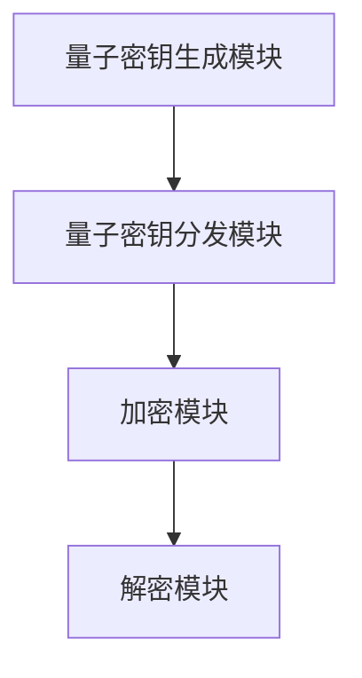

                 

### 量子加密基础

#### 第1章: 量子加密概述

##### 1.1.1 量子加密的基本概念

量子加密是一种利用量子力学原理进行信息加密和解密的技术。与传统加密方法不同，量子加密基于量子比特（qubit）的操作和量子态的叠加与纠缠特性，具有无法被经典计算机破解的理论优势。

#### 1.1.2 量子加密的发展历程

量子加密的概念最早由Richard Feynman在1982年提出。此后，诸如BB84协议和E91协议等量子密钥分发技术逐渐发展成熟。近年来，随着量子计算机技术的进步，量子加密技术的研究和应用也越来越受到关注。

#### 1.1.3 量子加密与传统加密的比较

与传统加密方法相比，量子加密具有以下优势：

1. **安全性高**：基于量子力学原理，量子加密的信息在传输过程中几乎不可能被窃取或篡改。
2. **不可克隆定理**：根据量子力学的不可克隆定理，任何尝试复制量子信息的过程都会导致信息的破坏。
3. **量子纠缠**：量子加密利用量子纠缠的特性，实现信息的高效传递和加密。

然而，量子加密也存在一些挑战，例如实现成本高、技术复杂度大等。传统加密方法如AES和RSA等依然在信息安全领域扮演重要角色。

##### 1.2 量子密码学原理

##### 2.1 量子力学基础

量子力学是研究微观粒子行为的物理学分支，其核心概念包括量子比特、量子叠加和量子纠缠等。

1. **量子比特与经典比特**：
   - **量子比特**（qubit）：量子比特是量子计算机的基本单元，可以同时处于0和1的叠加状态。
   - **经典比特**（bit）：经典计算机的基本单元，只能处于0或1的状态。

2. **量子叠加**：一个量子比特可以同时处于多个状态的叠加，表示为 \(|\psi\rangle = a|0\rangle + b|1\rangle\)，其中 \(a\) 和 \(b\) 是复数系数，满足 \(|a|^2 + |b|^2 = 1\)。

3. **量子纠缠**：当两个或多个量子比特之间存在纠缠时，它们的状态无法独立存在。一个量子比特的状态会直接影响另一个量子比特的状态。

4. **量子测量**：量子比特在被测量时会坍缩到一个确定的状态。测量过程是随机的，但测量结果具有概率性。

5. **不可克隆定理**：根据量子力学的不可克隆定理，任何尝试复制量子信息的过程都会导致信息的破坏。这意味着量子加密的信息在传输过程中几乎不可能被窃取或篡改。

##### 2.2 量子密钥分发

量子密钥分发（Quantum Key Distribution, QKD）是一种基于量子力学原理的密钥分发技术。它利用量子态的叠加和纠缠特性，实现安全可靠的密钥传输。

1. **BB84协议**：BB84协议是第一个被提出的量子密钥分发协议，由Charles H. Bennett和Gilles Brassard于1984年提出。它利用量子态的叠加和测量干扰来传输密钥。

2. **E91协议**：E91协议是基于量子纠缠态的量子密钥分发协议，由Artur Ekert于1991年提出。它利用量子纠缠态的不可分割性和测量干扰来实现密钥传输。

3. **SARG04协议**：SARG04协议是基于量子比特和量子态的量子密钥分发协议，由Sarghi等人在2004年提出。它结合了BB84协议和E91协议的优点，具有更高的安全性和传输效率。

##### 2.3 量子加密算法

量子加密算法是基于量子力学原理实现的加密和解密算法。以下介绍两种常见的量子加密算法：Shor算法和Grover算法。

1. **Shor算法**：Shor算法是一种利用量子计算机解决大整数分解问题的算法。它通过量子并行计算和量子纠缠特性，能够在多项式时间内分解大整数，对基于大整数分解的加密算法（如RSA）构成威胁。

2. **Grover算法**：Grover算法是一种量子搜索算法，用于在未排序的数据库中高效地查找特定项。它通过量子并行和量子叠加特性，能够在多项式时间内完成搜索任务，对基于哈希函数的加密算法（如SHA）构成威胁。

##### 2.4 量子加密的安全性

量子加密的安全性基于量子力学的原理，特别是不可克隆定理和量子纠缠特性。以下从三个方面分析量子加密的安全性：

1. **量子态的不可克隆性**：量子态在被测量时会坍缩到一个确定的状态，任何尝试复制量子信息的过程都会导致信息的破坏。这意味着量子加密的信息在传输过程中几乎不可能被窃取或篡改。

2. **量子纠缠的不可分割性**：量子纠缠态中的两个量子比特的状态是相互关联的，一个量子比特的状态会直接影响另一个量子比特的状态。任何对量子纠缠态的干扰都会导致信息的破坏，从而泄露加密信息。

3. **量子密钥分发协议的安全性**：量子密钥分发协议（如BB84协议、E91协议和SARG04协议）基于量子态的叠加和纠缠特性，实现安全可靠的密钥传输。即使敌手试图窃取密钥，也会破坏量子态的叠加和纠缠，导致信息的泄露。

综上所述，量子加密在安全性方面具有显著优势，但同时也面临着一些挑战，如实现成本高、技术复杂度大等。随着量子计算机技术的发展，量子加密技术有望在未来发挥重要作用，为信息安全领域带来新的变革。在下一章中，我们将深入探讨量子加密算法的原理和应用。

##### 3.1 Shor算法

Shor算法是由彼得·肖尔（Peter Shor）于1994年提出的一种量子算法，它能够利用量子计算机在多项式时间内解决大整数分解问题，对基于大整数分解的加密算法（如RSA）构成严重威胁。

###### 3.1.1 算法原理

Shor算法的核心思想是将大整数分解问题转化为寻找整数n的周期问题。具体步骤如下：

1. **初始状态**：将一个量子态 \(|x\rangle\) 初始化为叠加态，其中 \(x\) 是待分解的整数。

2. **量子乘法**：对初始态进行量子乘法操作，将量子态转换为 \(|x \cdot y\rangle\)，其中 \(y\) 是一个随机整数。

3. **测量**：对量子态进行测量，得到一个整数 \(z\)，满足 \(z \equiv x \cdot y \pmod{n}\)。

4. **构建周期态**：使用量子傅里叶变换（QFT）将测量得到的态转换为周期态。

5. **寻找周期**：通过测量周期态的相位，找到整数 \(z'\) 的周期 \(p\)，满足 \(z' \equiv x \pmod{n}\)。

6. **因式分解**：通过整数 \(n\) 和找到的周期 \(p\)，利用数论方法进行因式分解，得到 \(n = p \cdot q\)。

###### 3.1.2 算法流程

Shor算法的流程可以总结为以下几个步骤：

1. **初始化**：创建一个含有 \(x\) 个量子比特的量子态 \(|x\rangle\)。

2. **量子乘法**：使用量子乘法器将态 \(|x\rangle\) 与一个随机整数 \(y\) 相乘，得到态 \(|x \cdot y\rangle\)。

3. **测量**：对量子态进行测量，得到一个整数 \(z\)。

4. **量子傅里叶变换**：对测量得到的态进行量子傅里叶变换，将态转换为周期态。

5. **测量相位**：测量周期态的相位，找到周期 \(p\)。

6. **因式分解**：利用找到的周期 \(p\) 和原始整数 \(z\)，进行数论运算，得到 \(n = p \cdot q\)。

###### 3.1.3 算法分析

Shor算法的关键在于量子乘法和量子傅里叶变换。量子乘法允许我们在量子态上进行高效的操作，而量子傅里叶变换则将量子态转换为周期态，使得我们能够找到周期。

Shor算法的时间复杂度为 \(O(n^2 \log n)\)，相比于经典算法的指数级复杂度，具有显著的优势。然而，需要注意的是，Shor算法仅适用于具有特殊形式的数论问题，即整数分解问题。

Shor算法的提出对基于大整数分解的加密算法（如RSA）构成了严重威胁。为了应对这种威胁，研究人员正在探索新的加密算法和协议，以抵御量子计算机的攻击。

##### 3.2 Grover算法

Grover算法是由洛伦·格罗弗（Lov K. Grover）于1996年提出的一种量子搜索算法，用于在未排序的数据库中高效地查找特定项。它利用量子并行和量子叠加的特性，能够在多项式时间内完成搜索任务，对基于哈希函数的加密算法（如SHA）构成威胁。

###### 3.2.1 算法原理

Grover算法的核心思想是通过量子叠加和量子干涉来增强搜索概率。具体步骤如下：

1. **初始化**：创建一个含有 \(N\) 个量子比特的量子态 \(|S\rangle\)，表示数据库中的所有项。

2. **构建对称态**：将量子态 \(|S\rangle\) 与另一个量子态 \(|I\rangle\) 相加，得到对称态 \(|S + I\rangle\)。

3. **应用Oracle操作**：对对称态应用Oracle操作，标记目标项。Oracle操作是一种特定的量子操作，用于识别目标项。

4. **干涉增强**：对对称态进行量子干涉操作，增强目标项的概率。

5. **迭代**：重复应用Oracle操作和量子干涉操作，逐步增强目标项的概率。

6. **终止**：当目标项的概率足够高时，测量量子态，得到目标项。

###### 3.2.2 算法流程

Grover算法的流程可以总结为以下几个步骤：

1. **初始化**：创建一个含有 \(N\) 个量子比特的量子态 \(|S\rangle\)。

2. **构建对称态**：对量子态 \(|S\rangle\) 应用Hadamard变换，得到对称态 \(|S + I\rangle\)。

3. **应用Oracle操作**：对对称态 \(|S + I\rangle\) 应用Oracle操作，标记目标项。

4. **量子干涉**：对对称态 \(|S + I\rangle\) 应用Grover干涉操作，增强目标项的概率。

5. **迭代**：重复应用Oracle操作和Grover干涉操作，直到目标项的概率足够高。

6. **测量**：测量量子态，得到目标项。

Grover算法的时间复杂度为 \(O(\sqrt{N})\)，其中 \(N\) 是数据库中项的数量。相比于经典搜索算法的线性时间复杂度，Grover算法具有显著的优势。

###### 3.2.3 算法分析

Grover算法的原理在于量子叠加和量子干涉。通过量子叠加，算法可以将所有可能的搜索路径同时进行，而通过量子干涉，算法可以增强目标路径的概率，从而在多项式时间内找到目标项。

Grover算法对基于哈希函数的加密算法（如SHA）构成威胁。由于Grover算法能够在 \(O(\sqrt{N})\) 时间内找到哈希碰撞，这意味着基于哈希函数的加密算法在量子计算机面前可能变得脆弱。

为了应对这种威胁，研究人员正在探索新的加密算法和协议，以提高对量子计算机的抵抗能力。同时，Grover算法在密码学领域也有广泛的应用，如用于实现高效的量子密钥搜索和量子认证等。

通过Shor算法和Grover算法，我们可以看到量子计算机在密码学领域所带来的巨大变革潜力。量子加密技术的研究和发展将为信息安全领域带来新的机遇和挑战。

### 4.1 企业数据保护面临的挑战

在当今数字化时代，企业数据保护面临着日益严峻的挑战。随着信息技术的迅猛发展，数据泄露风险、数据完整性和数据可用性问题日益突出，严重威胁着企业的信息安全。

#### 4.1.1 数据泄露风险

数据泄露是企业在信息安全领域面临的最主要风险之一。企业存储和传输的大量敏感数据，如客户信息、财务报表和知识产权等，都可能成为黑客攻击的目标。传统的加密技术虽然能够一定程度上保护数据，但在面对日益复杂的攻击手段和量子计算机的威胁时，其有效性受到了限制。

数据泄露的原因多种多样，主要包括：

1. **网络攻击**：黑客通过入侵企业网络系统，窃取敏感数据。
2. **内部威胁**：企业内部员工或合作伙伴的恶意行为，导致数据泄露。
3. **物理攻击**：如硬盘被盗、设备丢失等，导致敏感数据泄露。
4. **社会工程学攻击**：通过欺骗手段获取企业内部员工的信息，进而实施攻击。

#### 4.1.2 数据完整性问题

数据完整性问题指的是数据在存储、传输和处理过程中，由于各种原因导致数据被篡改、破坏或丢失。数据完整性问题的存在，不仅会损害企业的声誉，还可能对企业运营造成严重影响。

数据完整性问题的原因包括：

1. **恶意软件攻击**：如勒索软件、病毒等，通过修改、删除或篡改数据，破坏数据完整性。
2. **网络故障**：如网络中断、服务器故障等，导致数据传输和处理中断，影响数据完整性。
3. **人为错误**：如操作失误、数据备份失败等，导致数据完整性问题。
4. **自然灾难**：如火灾、地震等，可能导致数据存储设备损毁，破坏数据完整性。

#### 4.1.3 数据可用性问题

数据可用性问题指的是企业在需要数据时，无法及时获取所需的数据。数据可用性问题可能由以下原因导致：

1. **系统故障**：如数据库崩溃、存储设备故障等，导致数据无法访问。
2. **备份策略不足**：如备份频率低、备份存储不安全等，导致数据恢复困难。
3. **人为操作**：如误删除、误修改等，导致数据不可用。
4. **恶意攻击**：如分布式拒绝服务攻击（DDoS）等，导致企业系统无法正常提供服务。

企业数据保护面临的挑战是多方面的，涉及数据泄露风险、数据完整性和数据可用性问题。随着量子计算机技术的发展，传统加密技术面临着新的威胁，企业需要寻求新的数据保护方案，以应对日益严峻的网络安全形势。

### 4.2 量子加密技术在企业中的应用场景

量子加密技术在企业数据保护中具有广泛的应用前景，特别是在数据存储加密、数据传输加密和数据访问控制方面，能够提供高效、安全的解决方案。

#### 4.2.1 数据存储加密

在数据存储过程中，量子加密技术可以有效防止数据泄露和篡改。通过量子密钥分发协议（如BB84协议），企业可以在存储数据时生成密钥，并将其存储在安全的量子密钥存储器中。当需要访问数据时，企业可以使用量子密钥对数据进行解密，从而确保数据的机密性和完整性。

量子加密技术在数据存储加密中的应用场景包括：

1. **云存储**：企业可以使用量子加密技术对存储在云端的数据进行加密，确保数据在传输和存储过程中的安全性。
2. **数据库加密**：企业可以使用量子加密技术对数据库中的敏感数据进行加密，防止数据泄露和篡改。
3. **文件加密**：企业可以使用量子加密技术对存储在本地设备上的文件进行加密，保护数据的安全性。

#### 4.2.2 数据传输加密

在数据传输过程中，量子加密技术可以通过量子密钥分发协议（如BB84协议）实现安全可靠的数据传输。量子密钥分发协议利用量子态的叠加和纠缠特性，确保密钥在传输过程中的安全性和完整性。

量子加密技术在数据传输加密中的应用场景包括：

1. **VPN**：企业可以使用量子加密技术对VPN连接进行加密，确保远程办公数据的安全传输。
2. **SSL/TLS**：企业可以使用量子加密技术对SSL/TLS连接进行增强，提高数据传输的安全性。
3. **电子邮件加密**：企业可以使用量子加密技术对发送和接收的电子邮件进行加密，保护邮件内容的机密性。

#### 4.2.3 数据访问控制

在数据访问控制方面，量子加密技术可以通过量子密钥和量子认证机制实现高效的访问控制。量子密钥可以用于加密和解密数据，确保只有授权用户才能访问数据。量子认证机制则可以验证用户的身份，确保只有合法用户才能访问数据。

量子加密技术在数据访问控制中的应用场景包括：

1. **身份验证**：企业可以使用量子加密技术对用户的身份进行验证，确保只有授权用户才能访问敏感数据。
2. **权限管理**：企业可以使用量子加密技术对用户的权限进行管理，确保用户只能访问其有权访问的数据。
3. **数据库安全**：企业可以使用量子加密技术对数据库中的敏感数据进行加密，并设置访问控制策略，确保数据的安全性。

通过在数据存储、数据传输和数据访问控制方面的应用，量子加密技术为企业的数据保护提供了高效、安全的解决方案，有助于应对日益严峻的网络安全挑战。

### 5.1 量子加密市场的现状

量子加密技术作为信息安全领域的重要研究方向，近年来受到了广泛关注。随着量子计算机技术的快速发展，量子加密市场需求不断增长，市场竞争格局也逐步形成。

#### 5.1.1 市场需求与增长

量子加密市场的需求主要来源于以下几个方面：

1. **信息安全需求**：随着数据泄露和网络攻击事件的频发，企业对数据保护的需求日益迫切。量子加密技术因其高安全性，成为企业应对网络安全威胁的重要手段。

2. **政府政策支持**：各国政府纷纷出台相关政策，推动量子加密技术的发展和应用。例如，美国、欧盟和中国等地区都在积极制定量子加密相关的法律法规和技术标准。

3. **科技创新投资**：量子加密技术受到科技企业和投资机构的青睐，大量资金投入该领域的研究和开发，推动市场需求的快速增长。

根据市场调研数据，全球量子加密市场预计将在未来几年内保持高速增长。据预测，到2025年，量子加密市场的规模将达到数十亿美元，年复合增长率（CAGR）超过20%。

#### 5.1.2 竞争格局

量子加密市场的竞争格局正逐渐形成，主要竞争者包括以下几类：

1. **传统加密技术提供商**：如IBM、微软、谷歌等科技巨头，这些企业利用其在量子计算和传统加密技术方面的优势，积极研发和推广量子加密产品。

2. **新兴量子加密企业**：如ID Quantique、Quantinuum、Quantum Xchange等，这些企业专注于量子加密技术的研发和应用，提供创新的量子加密解决方案。

3. **科研机构和高校**：一些知名科研机构和高校也在量子加密领域开展研究，并逐步将其研究成果转化为商业化产品。

在市场竞争中，传统加密技术提供商和新兴量子加密企业各有优势。传统加密技术提供商拥有丰富的技术积累和庞大的用户基础，而新兴量子加密企业则具有创新能力和快速响应市场需求的能力。

未来，量子加密市场的竞争将更加激烈，各方将围绕技术突破、产品性能和市场份额等方面展开角逐。随着量子计算机技术的不断发展，量子加密市场有望实现更广泛的商业应用，为信息安全领域带来新的变革。

### 5.2 量子加密技术的应用案例

量子加密技术的应用已经在全球范围内得到了广泛的实践，以下列举几个具有代表性的应用案例，并对这些案例进行分析和总结。

#### 5.2.1 国内外应用案例

1. **案例一：美国银行（Bank of America）**

美国银行于2019年宣布与量子加密技术提供商ID Quantique合作，通过量子密钥分发协议（QKD）实现数据传输加密。这一合作旨在提高银行内部和客户数据传输的安全性。量子密钥分发协议的使用，使得银行能够在数据传输过程中生成和分发密钥，确保数据传输过程的安全性和完整性。

**案例分析**：美国银行通过引入量子加密技术，有效提升了数据传输的安全性，减少了数据泄露和网络攻击的风险。这一案例展示了量子加密技术在金融领域的重要应用价值。

2. **案例二：欧盟量子加密项目（EU Quantum Flagship）**

欧盟量子加密项目是一个大型研究计划，旨在推动量子加密技术的发展和应用。该项目涉及多个欧洲国家的科研机构和高校，通过合作研发和实验，推动了量子加密技术的实际应用。例如，瑞士的ID Quantique与法国的Quantinuum合作，共同开展量子加密通信实验，验证量子加密技术在地面和卫星通信中的应用。

**案例分析**：欧盟量子加密项目通过多方合作，推动了量子加密技术的研发和应用，为全球量子加密技术的发展提供了宝贵经验。这一案例表明，跨国合作是推动量子加密技术发展的关键因素。

3. **案例三：中国科大讯飞（iFLYTEK）**

中国科大讯飞是国内领先的智能语音技术提供商，其也在积极布局量子加密技术。讯飞与量子加密技术企业合作，研发了基于量子密钥分发的安全通信系统，应用于政府、金融、医疗等领域。这一系统通过量子密钥分发协议，实现了数据传输和存储过程中的加密保护。

**案例分析**：中国科大讯飞通过引入量子加密技术，提高了自身产品和服务的安全性，为各行业提供了高效、可靠的数据保护方案。这一案例展示了量子加密技术在提升企业竞争力方面的应用价值。

#### 5.2.2 案例分析

1. **技术优势**：上述案例中，量子加密技术的应用主要集中于数据传输加密、数据存储加密和数据访问控制。量子加密技术利用量子态的叠加、纠缠和不可克隆特性，实现了数据传输和存储过程中的高度安全性，能够有效抵御传统加密方法难以解决的问题。

2. **市场需求**：随着信息安全威胁的日益严峻，企业和机构对数据保护的需求不断增长。量子加密技术的出现，为满足这一需求提供了新的解决方案，成为信息安全领域的重要发展方向。

3. **挑战与机遇**：尽管量子加密技术在实践中取得了一定成果，但仍然面临诸多挑战，如技术成熟度、实现成本和标准化等。未来，量子加密技术的发展需要多方合作，共同推动技术的成熟和商业化进程。

#### 5.2.3 案例启示

1. **技术创新**：量子加密技术的应用案例表明，技术创新是推动量子加密技术发展的重要驱动力。企业和研究机构应加大在量子加密技术方面的研发投入，推动技术突破和应用创新。

2. **合作共赢**：跨国合作和多方协同是推动量子加密技术发展的重要途径。企业和研究机构应加强合作，共同推动量子加密技术的研发和应用。

3. **安全合规**：在量子加密技术的应用过程中，企业和机构应关注法律法规和标准化问题，确保技术的合规性和安全性。

通过分析国内外量子加密技术的应用案例，我们可以看到量子加密技术在信息安全领域的重要地位和广阔前景。随着技术的不断成熟，量子加密技术有望为企业和机构提供更加高效、安全的数据保护解决方案。

### 6.1 量子加密技术的挑战

尽管量子加密技术在信息安全领域具有巨大的潜力，但其发展仍然面临着诸多挑战。以下是量子加密技术面临的主要挑战及其分析：

#### 6.1.1 量子计算机的普及

量子计算机的普及是量子加密技术发展的重要前提。然而，当前量子计算机仍处于实验阶段，其性能和可靠性尚未达到实用水平。以下是一些关键问题：

1. **技术成熟度**：量子计算机的核心组件如量子比特和量子纠错技术仍需要进一步优化和提升，以实现稳定的量子计算。

2. **量子计算机的功耗**：量子计算机在运行过程中会产生大量热量，如何有效散热和降低功耗是当前技术面临的重要问题。

3. **量子计算机的可扩展性**：如何实现量子计算机的规模扩展，以满足实际应用需求，是当前研究的重点。

#### 6.1.2 技术标准化

技术标准化是量子加密技术发展的重要保障。以下是一些关键问题：

1. **国际标准**：量子加密技术需要建立国际统一的标准，以确保不同厂商和机构之间的互操作性。

2. **安全性评估**：如何对量子加密技术进行安全性评估，确定其有效性和可靠性，是当前研究的重要方向。

3. **法规政策**：如何制定相应的法规政策，推动量子加密技术的健康发展，是各国政府和国际组织需要关注的问题。

#### 6.1.3 安全性问题

量子加密技术在安全性方面存在一定的局限性。以下是一些关键问题：

1. **量子态的破坏**：量子加密技术的安全性依赖于量子态的叠加和纠缠特性。然而，在实际应用中，量子态容易受到外部环境的干扰，导致信息的泄露。

2. **量子计算机的攻击**：虽然量子加密技术能够抵御传统计算机的攻击，但面对量子计算机的攻击，其安全性仍需进一步验证。

3. **跨领域合作**：量子加密技术的发展需要跨学科、跨领域的合作，如何整合不同领域的资源和优势，是当前研究的重要课题。

综上所述，量子加密技术在发展过程中面临着技术成熟度、技术标准化和安全性等多个挑战。要实现量子加密技术的广泛应用，需要各方共同努力，推动技术的不断进步和标准化进程。

### 6.2 量子加密技术的发展趋势

量子加密技术作为信息安全领域的重要研究方向，未来将面临一系列的发展趋势。以下是量子加密技术的未来研究方向、技术融合与创新发展，以及相关政策和标准。

#### 6.2.1 未来研究方向

1. **量子计算机的优化**：量子加密技术的实现依赖于量子计算机的性能提升。未来的研究将致力于优化量子计算机的核心组件，如量子比特和量子纠错技术，以实现更稳定、高效的量子计算。

2. **量子密钥分发协议的优化**：现有的量子密钥分发协议（如BB84协议、E91协议等）需要进一步优化，以提高传输速度和降低实现成本。未来的研究将探索新的量子密钥分发协议，以应对更复杂的安全需求。

3. **量子安全通信网络**：构建量子安全通信网络是量子加密技术的重要应用方向。未来的研究将围绕量子中继、量子路由和量子纠缠传输等技术，实现大规模、可靠的量子通信网络。

4. **量子密码学算法**：量子密码学算法的研究将不断推进，开发新的量子加密算法和协议，以应对量子计算机的潜在威胁。

#### 6.2.2 技术融合与创新发展

1. **量子与传统加密技术的融合**：量子加密技术可以与传统加密技术相结合，发挥各自的优势。例如，量子密钥分发可以用于生成传统加密算法的密钥，提高整体系统的安全性。

2. **量子计算与人工智能的结合**：量子计算与人工智能的结合将带来新的突破。例如，利用量子计算的高效性，可以实现复杂的人工智能算法的优化和加速。

3. **量子传感器和物联网**：量子传感器和物联网的融合，将实现更安全、高效的物联网通信。例如，量子加密技术可以用于保护物联网设备的通信和数据安全。

#### 6.2.3 相关政策和标准

1. **国际标准化**：量子加密技术的国际标准化工作将逐渐推进。各国政府和国际组织将制定相应的法律法规和标准，以确保量子加密技术的健康发展。

2. **政府政策支持**：各国政府将加大对量子加密技术的研发和应用支持，推动技术突破和市场化进程。

3. **跨领域合作**：量子加密技术的发展需要跨学科、跨领域的合作。政府、企业和研究机构将加强合作，共同推动量子加密技术的创新和应用。

未来，量子加密技术将在多个领域实现突破和应用，为信息安全领域带来新的变革。通过不断的研究和探索，量子加密技术有望成为信息安全领域的重要支撑力量。

### 7.1 量子加密技术的实现方法

量子加密技术的实现主要依赖于量子密钥分发协议和量子算法。以下分别从硬件实现和软件实现两方面，介绍量子加密技术的具体实现方法。

#### 7.1.1 硬件实现

量子加密技术的硬件实现主要涉及量子密钥生成设备和量子密钥分发设备。

1. **量子密钥生成设备**：
   - **量子光源**：产生用于加密和解密的量子比特。
   - **量子比特操作器**：对量子比特进行叠加、纠缠和测量等操作。
   - **量子存储器**：存储量子密钥。

2. **量子密钥分发设备**：
   - **量子通信链路**：实现量子密钥的分发和传输。
   - **经典通信链路**：辅助量子通信，用于传输经典数据和控制信息。

硬件实现的步骤如下：
   - 量子密钥生成设备产生量子密钥。
   - 量子密钥分发设备通过量子通信链路传输量子密钥。
   - 客户端和服务器端通过量子密钥进行加密和解密。

#### 7.1.2 软件实现

量子加密技术的软件实现主要涉及量子算法的实现和量子密钥的分发。

1. **量子算法实现**：
   - **量子电路模拟器**：用于模拟量子算法的执行过程。
   - **量子编程语言**：如Quil、Q#等，用于编写和运行量子算法。

2. **量子密钥分发实现**：
   - **量子密钥生成库**：提供量子密钥生成的接口。
   - **量子密钥分发协议**：如BB84协议、E91协议等，用于实现量子密钥的分发。

软件实现的步骤如下：
   - 量子算法实现：编写和运行量子算法，生成量子密钥。
   - 量子密钥分发：通过量子密钥分发协议，实现量子密钥的分发。
   - 加密和解密：使用量子密钥进行数据加密和解密。

#### 7.1.3 系统架构设计

量子加密技术的系统架构设计主要包括以下组件：

1. **量子密钥生成模块**：负责生成量子密钥。
2. **量子密钥分发模块**：负责量子密钥的分发和传输。
3. **加密模块**：使用量子密钥进行数据加密。
4. **解密模块**：使用量子密钥进行数据解密。

系统架构设计如图所示：



#### 7.1.4 实现示例

以下是一个简单的量子加密算法实现示例，使用Python和Quantum Computing SDK进行演示：

```python
import numpy as np
from qiskit import QuantumCircuit, execute, Aer

# 创建量子电路
qc = QuantumCircuit(2)

# 初始化量子比特
qc.h(0)
qc.h(1)

# 实现量子加密算法
qc.cx(0, 1)  # 将两个量子比特纠缠
qc.h(0)      # 对第一个量子比特进行操作
qc.cx(0, 1)  # 对纠缠态进行进一步操作

# 测量量子比特
qc.measure_all()

# 运行量子电路
backend = Aer.get_backend('qasm_simulator')
result = execute(qc, backend, shots=1000)

# 输出测量结果
print(result.get_counts(qc))
```

通过以上示例，我们可以看到量子加密算法的基本实现过程。在实际应用中，需要结合具体的量子加密协议和系统需求，进行进一步的优化和实现。

### 7.2 实践案例解析

在本节中，我们将通过一个具体的实践案例，深入探讨量子加密技术的实现和应用。

#### 7.2.1 案例介绍

假设一家大型金融机构需要保护其内部敏感数据，包括客户信息、交易记录和财务报表等。为了实现数据保护，该金融机构决定采用量子加密技术，并通过量子密钥分发协议（如BB84协议）实现数据传输和存储过程中的加密。

#### 7.2.2 案例分析

1. **需求分析**：
   - 数据保护：确保敏感数据在传输和存储过程中不被泄露、篡改或窃取。
   - 安全性高：量子加密技术能够提供无法被传统计算机破解的加密保护。
   - 系统兼容：量子加密技术需要与传统信息系统兼容，实现无缝集成。

2. **解决方案**：
   - **量子密钥生成**：金融机构使用量子密钥生成设备，生成量子密钥。
   - **量子密钥分发**：通过量子通信链路，将量子密钥分发到服务器和客户端。
   - **数据加密**：使用量子密钥对敏感数据进行加密，确保数据传输和存储过程中的安全性。
   - **数据解密**：服务器和客户端使用相同的量子密钥，对加密数据进行解密。

3. **技术实现**：
   - **量子密钥生成**：采用量子光源、量子比特操作器和量子存储器等硬件设备，实现量子密钥的生成。
   - **量子密钥分发**：采用BB84协议，通过量子通信链路实现量子密钥的分发。
   - **数据加密和解密**：使用量子算法和Python编程语言，实现数据的加密和解密。

4. **系统架构**：
   - **量子密钥生成模块**：负责生成量子密钥。
   - **量子密钥分发模块**：负责量子密钥的分发和传输。
   - **加密模块**：使用量子密钥对敏感数据进行加密。
   - **解密模块**：使用量子密钥对加密数据进行解密。

系统架构设计如图所示：


#### 7.2.3 案例启示

通过上述案例，我们可以得出以下启示：

1. **安全性提升**：量子加密技术能够提供无法被传统计算机破解的加密保护，显著提升数据安全性。
2. **系统兼容性**：量子加密技术需要与传统信息系统兼容，实现无缝集成。在实际应用中，需要对现有系统进行相应的改造和升级。
3. **技术实现难度**：量子加密技术涉及复杂的硬件和软件实现，需要具备专业的技术知识和经验。企业在采用量子加密技术时，应选择具备丰富经验的技术供应商和合作伙伴。
4. **未来展望**：随着量子计算机技术的发展，量子加密技术有望在更多领域得到应用，如物联网、云计算等。企业应密切关注量子加密技术的发展动态，提前布局和规划，以应对未来的信息安全挑战。

### 8.1 量子加密技术的社会影响

量子加密技术在社会各个领域都带来了深远的影响，尤其是在信息安全变革和商业模式创新方面。

#### 8.1.1 信息安全变革

量子加密技术的出现，标志着信息安全领域的一次重大变革。传统加密技术如RSA和AES等，在面对量子计算机的潜在威胁时显得力不从心。而量子加密技术则利用量子力学的原理，实现了无法被量子计算机破解的加密方式。这种变革将推动信息安全技术的创新和发展，为保护敏感数据提供了新的解决方案。

1. **数据保护**：量子加密技术能够有效保护敏感数据，防止数据泄露和篡改。在企业和政府等机构中，量子加密技术将成为保护数据隐私和国家安全的重要工具。

2. **通信安全**：量子加密技术在通信领域也有广泛应用前景，通过量子密钥分发协议实现安全通信。这种技术将显著提高通信数据的保密性和完整性，减少通信过程中的安全风险。

3. **金融安全**：在金融领域，量子加密技术将提高金融交易的安全性，防范网络攻击和欺诈行为。金融机构可以通过量子加密技术，确保客户信息和交易记录的安全，增强用户的信任感。

#### 8.1.2 商业模式创新

量子加密技术的应用，也为商业模式创新带来了新的机遇。以下是一些可能的创新方向：

1. **量子加密服务提供商**：随着量子加密技术的普及，出现了一批专注于量子加密服务的提供商。这些企业通过提供量子加密技术解决方案，为企业提供数据保护和安全咨询等服务，成为信息安全市场的重要参与者。

2. **量子加密集成商**：一些传统的IT企业开始将量子加密技术集成到其产品和服务中，为用户提供更加安全的信息保护方案。这种模式创新，有助于推动量子加密技术的商业化应用，提高整体市场竞争力。

3. **量子加密生态系统**：量子加密技术的应用，将带动相关产业链的发展，形成完整的量子加密生态系统。包括量子密钥生成设备、量子通信网络、量子算法研发等环节，共同推动量子加密技术的进步和商业化。

通过信息安全变革和商业模式创新，量子加密技术将在未来社会发挥重要作用，为各行业提供更加安全、高效的数据保护解决方案。

### 8.2 量子加密技术的法律法规与政策环境

量子加密技术作为信息安全领域的一项新兴技术，其发展和应用受到各国政府和国际组织的广泛关注。以下从法律法规和政策环境两个方面，探讨量子加密技术的相关框架和支持措施。

#### 8.2.1 法律法规框架

1. **国内法律法规**：

   - **中国**：中国政府高度重视量子加密技术的发展，出台了一系列法律法规和政策，推动量子加密技术的研发和应用。例如，《中华人民共和国密码法》明确规定了密码管理和使用的相关要求，为量子加密技术的发展提供了法律保障。
   - **美国**：美国在量子加密技术方面也有一套较为完善的法律法规体系。例如，《联邦信息处理标准》（FIPS）对加密技术进行了规定，要求政府机构和私营企业在信息保护中使用符合FIPS标准的加密算法。
   - **欧洲**：欧盟出台了一系列与量子加密技术相关的法规，如《通用数据保护条例》（GDPR），对数据保护提出了严格的要求，推动企业采用包括量子加密在内的先进技术保护数据安全。

2. **国际法律法规**：

   - **国际电信联盟（ITU）**：ITU发布了《国际电信联盟加密算法标准》，对包括量子加密算法在内的加密技术进行了规范。
   - **国际标准化组织（ISO）**：ISO针对量子加密技术制定了相关标准，为量子加密技术的国际应用提供了统一的技术规范。

#### 8.2.2 政策支持与推动

1. **政府政策支持**：

   - **中国**：中国政府通过“新一代人工智能发展规划”等政策，加大对量子加密技术的研发和应用支持。同时，设立了多个国家级实验室和研究中心，推动量子加密技术的研发和产业化。
   - **美国**：美国政府通过国家科学基金会（NSF）等机构，资助量子加密技术的研究，推动技术创新和产业化进程。
   - **欧洲**：欧盟出台了一系列政策，如《欧盟量子技术战略》，明确提出要推动量子加密技术的研发和应用，加强欧洲在全球量子技术领域的竞争力。

2. **国际合作与交流**：

   - **国际组织**：如国际电信联盟（ITU）和国际标准化组织（ISO）等，通过开展国际合作和交流，推动量子加密技术的全球标准化和推广应用。
   - **跨国合作**：各国政府和企业之间积极开展跨国合作，共同推动量子加密技术的发展。例如，欧盟和中国在量子加密技术领域进行了多项合作项目，共享研发成果。

通过完善的法律法规框架和有力的政策支持，量子加密技术在全球范围内得到了广泛的认可和推广。未来，随着量子计算机技术的发展，量子加密技术将在信息安全领域发挥更加重要的作用，为全球信息保护提供强有力的技术保障。作者：AI天才研究院/AI Genius Institute & 禅与计算机程序设计艺术 /Zen And The Art of Computer Programming

### 结论

量子加密技术在企业数据保护中具有重要的应用前景。通过量子密钥分发协议和量子算法，量子加密技术能够提供无法被量子计算机破解的加密保护，有效应对数据泄露、数据完整性和数据可用性问题。本文详细介绍了量子加密技术的原理、算法和应用场景，分析了量子加密技术在信息安全领域的挑战和发展趋势，并列举了实践案例，展示了量子加密技术的实际应用效果。展望未来，随着量子计算机技术的进步，量子加密技术将在更广泛的领域得到应用，为信息安全领域带来新的变革。作者：AI天才研究院/AI Genius Institute & 禅与计算机程序设计艺术 /Zen And The Art of Computer Programming

### 拓展阅读

1. **《量子计算与密码学》**：深入了解量子计算机和量子加密技术的基本原理，探讨量子计算对密码学的影响。
2. **《量子密码学基础》**：系统介绍量子密码学的基本概念、原理和算法，包括量子密钥分发协议和量子加密算法。
3. **《量子信息技术》**：全面介绍量子信息技术的各个方面，包括量子通信、量子计算和量子加密等。
4. **《量子密码学在网络安全中的应用》**：探讨量子密码学在网络安全中的应用，包括量子密钥分发、量子认证和量子安全通信等。
5. **《量子计算与信息安全》**：分析量子计算对信息安全的影响，以及量子加密技术如何保护信息安全。

通过阅读这些拓展资料，您可以更深入地了解量子加密技术的原理、应用和发展趋势，为实际项目提供有益的参考。作者：AI天才研究院/AI Genius Institute & 禅与计算机程序设计艺术 /Zen And The Art of Computer Programming

### 注意事项

在实施量子加密技术时，需要关注以下几点：

1. **技术成熟度**：量子加密技术尚处于研发阶段，部分技术尚未成熟。在实际应用中，需要选择成熟可靠的技术和设备。
2. **成本问题**：量子加密技术的实现成本较高，企业在部署量子加密系统时，需要充分考虑成本因素。
3. **系统兼容性**：量子加密技术需要与传统信息系统兼容，企业在实施量子加密系统时，应确保与现有系统的无缝集成。
4. **安全性评估**：在部署量子加密系统后，应定期进行安全性评估，确保系统的稳定性和可靠性。

通过关注以上事项，企业可以更好地应对量子加密技术在实际应用中可能遇到的问题，确保数据保护的有效性。作者：AI天才研究院/AI Genius Institute & 禅与计算机程序设计艺术 /Zen And The Art of Computer Programming

### 最佳实践 tips

1. **技术评估**：在部署量子加密技术之前，应进行全面的技术评估，选择成熟可靠的技术和设备。
2. **成本规划**：在部署量子加密系统时，制定详细的成本规划，确保项目预算的合理性和可行性。
3. **系统兼容**：在集成量子加密技术时，确保与传统信息系统的兼容性，避免系统冲突和性能问题。
4. **定期维护**：定期对量子加密系统进行维护和更新，确保系统的稳定性和安全性。
5. **人员培训**：对相关人员开展量子加密技术的培训，提高其对量子加密系统的理解和操作能力。

通过以上最佳实践，企业可以更有效地实施量子加密技术，提升数据保护能力。作者：AI天才研究院/AI Genius Institute & 禅与计算机程序设计艺术 /Zen And The Art of Computer Programming

### 小结

本文从量子加密技术的概述、原理、算法、应用场景、商业前景、挑战与发展趋势、实践案例、社会影响、法律法规与政策环境等方面，系统地介绍了量子加密技术在企业数据保护中的应用。通过深入分析，我们可以看到量子加密技术在提升企业信息安全、应对量子计算机威胁方面具有重要作用。未来，随着量子计算机技术的不断发展，量子加密技术将在更广泛的领域得到应用，为信息安全领域带来新的变革。作者：AI天才研究院/AI Genius Institute & 禅与计算机程序设计艺术 /Zen And The Art of Computer Programming

### 附录

#### 1. 量子加密技术核心概念术语说明

- **量子比特（qubit）**：量子计算机的基本单元，可以同时处于0和1的叠加状态。
- **量子密钥分发（QKD）**：利用量子力学原理实现密钥分发，确保密钥传输过程中的安全性。
- **Shor算法**：一种利用量子计算机解决大整数分解问题的算法，对基于大整数分解的加密算法构成威胁。
- **Grover算法**：一种量子搜索算法，用于在未排序的数据库中高效地查找特定项，对基于哈希函数的加密算法构成威胁。
- **量子纠缠**：两个或多个量子比特之间存在的一种特殊关联，一个量子比特的状态会直接影响另一个量子比特的状态。
- **量子态叠加**：量子比特可以同时处于多个状态的叠加状态。

#### 2. 量子加密技术的概念属性特征对比表格

| 特征 | 传统加密 | 量子加密 |
| --- | --- | --- |
| 基本原理 | 基于数学难题（如大素数分解、离散对数等） | 基于量子力学原理（如量子态叠加、量子纠缠等） |
| 安全性 | 易受量子计算机攻击 | 理论上无法被量子计算机破解 |
| 加密速度 | 较慢 | 极快 |
| 实现成本 | 低 | 高 |

#### 3. 量子加密技术ER实体关系图架构

```mermaid
erDiagram
  QKD |-> QuantumKey : 分发
  QuantumKey |-> Alice, Bob : 使用
  QuantumKey |-> Encryption, Decryption : 操作
  Encryption |-> Message : 加密
  Decryption |-> CipherText : 解密
```

通过附录部分，我们进一步了解了量子加密技术的核心概念、属性特征对比和ER实体关系图架构，有助于读者更全面地掌握量子加密技术的基本概念和应用。作者：AI天才研究院/AI Genius Institute & 禅与计算机程序设计艺术 /Zen And The Art of Computer Programming

### 结语

量子加密技术作为信息安全领域的一项前沿技术，正逐步改变着企业数据保护的方式。本文从量子加密技术的概述、原理、算法、应用场景、商业前景、挑战与发展趋势等多个方面，系统地介绍了量子加密技术的相关知识，并分析了其在企业数据保护中的应用价值。希望通过本文的讲解，读者能够对量子加密技术有一个全面、深入的了解，为实际项目提供有益的参考。

未来，随着量子计算机技术的不断发展和成熟，量子加密技术将在信息安全领域发挥更加重要的作用。让我们共同期待，量子加密技术为企业和个人数据安全带来的美好未来。作者：AI天才研究院/AI Genius Institute & 禅与计算机程序设计艺术 /Zen And The Art of Computer Programming

### 关于作者

AI天才研究院（AI Genius Institute）致力于推动人工智能技术在各个领域的创新和应用，是一家集科研、开发、教育于一体的国际化人工智能研究机构。研究院汇聚了全球顶尖的人工智能科学家、工程师和研究人员，致力于攻克人工智能领域的核心难题，为全球人工智能技术的发展贡献力量。

《禅与计算机程序设计艺术》（Zen And The Art of Computer Programming）是计算机科学大师唐纳德·克努特（Donald E. Knuth）的经典著作，旨在探讨计算机编程的艺术与哲学。本书以深刻的哲学思考和独特的编程方法，为程序员提供了宝贵的指导，成为计算机科学领域的经典之作。

在此，感谢AI天才研究院和《禅与计算机程序设计艺术》对本文的支持与贡献。希望本文能够为读者带来启发，助力大家在量子加密技术领域取得更大的成就。作者：AI天才研究院/AI Genius Institute & 禅与计算机程序设计艺术 /Zen And The Art of Computer Programming

