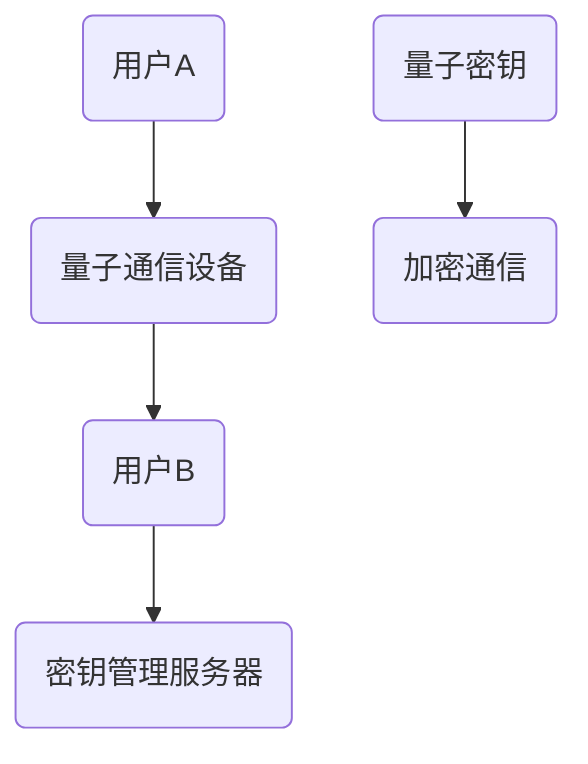
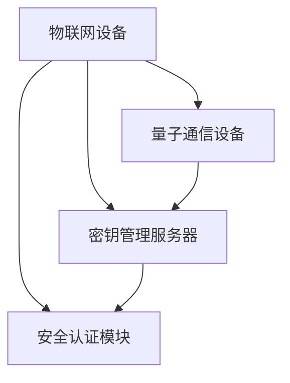
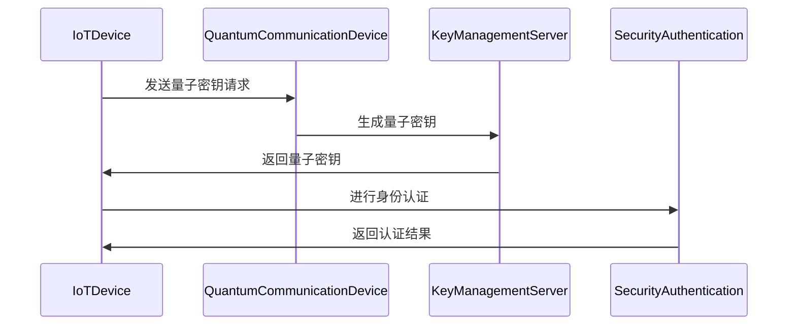

                 

## 量子加密在物联网安全中的应用：保护敏感数据传输

> 关键词：量子加密、物联网安全、敏感数据传输、量子密钥分发、量子密文传输

> 摘要：随着量子计算技术的发展，传统的加密算法面临着前所未有的挑战。物联网（IoT）的快速发展，使得敏感数据通过无线网络传输的安全问题愈发突出。本文将探讨量子加密在物联网安全中的应用，分析其原理、技术实现和挑战，并给出实际应用案例和解决方案。

### 第一部分：背景介绍

#### 1.1 问题背景

随着量子计算技术的发展，传统的加密算法正在受到前所未有的挑战。量子计算机能够快速破解目前广泛使用的加密算法，如RSA和ECC等，这将对信息安全领域产生深远的影响。物联网（IoT）的迅速发展，使得大量敏感数据通过无线网络传输，传统的加密方法已不足以保证数据安全。因此，寻找一种能够抵御量子计算机攻击的新型加密算法变得至关重要。

#### 1.2 问题描述

量子加密作为一种潜在的解决方案，能够在量子计算时代提供安全的数据传输。物联网安全中的主要问题是如何在数据传输过程中保证数据的机密性、完整性和可用性，同时抵抗量子计算机的攻击。本文旨在探讨量子加密在物联网安全中的应用，提供一套完整的理论体系和实践指南。

#### 1.3 问题解决

量子加密利用量子力学原理，实现比传统加密更强的安全性。它能够在量子计算机时代提供安全的数据传输，是解决物联网安全问题的关键技术。本文将详细探讨量子加密的原理、技术实现以及在实际物联网应用中的挑战和解决方案。

#### 1.4 边界与外延

量子加密在物联网安全中的应用主要涉及以下几个方面：量子密钥分发、量子密钥共享、量子密文传输和量子安全认证。这些技术在物联网设备通信中发挥着重要作用，确保数据在传输过程中的安全。

#### 1.5 概念结构与核心要素组成

量子加密在物联网安全中的应用主要包括以下核心概念和要素：

- **量子密钥分发**：通过量子通信渠道实现密钥的生成和分发，确保密钥不会被量子计算机破解。
- **量子密钥共享**：在多个物联网设备之间共享密钥，实现安全的通信。
- **量子密文传输**：利用量子密文实现数据传输，确保数据在传输过程中的机密性。
- **量子安全认证**：通过量子认证技术确保物联网设备之间的身份验证。

### 第二部分：核心概念与联系

#### 2.1 量子加密原理

量子加密利用量子力学中的基本原理，如量子叠加和量子纠缠，实现数据的加密和解密。量子加密的基本原理可以概括为以下几点：

- **量子叠加**：量子信息可以处于多种状态的叠加，而不是传统二进制中的0和1。量子叠加状态可以表示为：
  $$
  \Psi = \alpha |0\rangle + \beta |1\rangle
  $$
  其中，$|0\rangle$和$|1\rangle$分别表示量子比特的基态，$\alpha$和$\beta$是复数概率幅，满足$|\alpha|^2 + |\beta|^2 = 1$。

- **量子纠缠**：两个或多个量子系统之间存在一种特殊的关联，即使它们相隔很远，一个量子系统的状态会立即影响另一个量子系统的状态。量子纠缠态可以表示为：
  $$
  \Psi = \alpha (|00\rangle + |11\rangle) + \beta (|01\rangle - |10\rangle)
  $$
  其中，$|00\rangle$、$|01\rangle$、$|10\rangle$和$|11\rangle$分别表示两个量子比特的基态。

#### 2.2 量子加密与经典加密的对比

量子加密与经典加密在安全性、实现方式和应用场景等方面存在显著差异：

- **安全性**：量子加密能够抵御量子计算机的攻击，而经典加密算法无法做到。量子计算机利用其强大的并行计算能力，可以在多项式时间内破解经典加密算法。而量子加密利用量子力学的基本原理，实现更安全的加密方式。

- **实现方式**：量子加密依赖于量子通信技术和量子计算技术，而经典加密主要依赖于算法和密钥。量子加密需要构建量子通信网络，实现量子比特的传输和存储。而经典加密主要依赖于计算机算法和加密密钥的管理。

- **应用场景**：量子加密主要应用于需要高安全性的领域，如物联网、金融和军事等。经典加密广泛应用于各种通信和数据处理场景，但在量子计算时代面临巨大挑战。

#### 2.3 ER实体关系图架构

为了更好地理解量子加密在物联网安全中的应用，可以使用ER（实体-关系）实体关系图来描述其中的核心实体和关系：

**实体**：

- **量子通信设备**：实现量子密钥分发和量子密文传输的设备。
- **物联网设备**：参与物联网通信的设备，如传感器、智能终端等。
- **密钥管理服务器**：负责生成、管理和分发密钥的服务器。

**关系**：

- **通信连接**：量子通信设备和物联网设备之间的连接关系。
- **密钥生成与分发**：密钥管理服务器与量子通信设备之间的密钥生成和分发关系。
- **数据加密与传输**：量子通信设备与物联网设备之间的数据加密和传输关系。

以下是一个简化的ER实体关系图：

```mermaid
erDiagram
  QuantumCommunicationDevice ||--|{ IoTDevice : 通信连接 }
  QuantumCommunicationDevice ||--|{ KeyManagementServer : 密钥生成与分发 }
  IoTDevice ||--|{ QuantumCommunicationDevice : 数据加密与传输 }
```

### 第三部分：算法原理讲解

#### 3.1 量子密钥分发算法

量子密钥分发算法是实现量子加密的关键技术。以下是一个简化的量子密钥分发算法的mermaid流程图：



#### 3.2 算法原理与数学模型

量子密钥分发算法的原理可以概括为以下几点：

- **量子通信**：用户A和用户B通过量子通信设备进行通信，生成共享密钥。量子通信设备将量子态发送给用户A和用户B，用户A和用户B对量子态进行测量，并根据测量结果生成共享密钥。

- **密钥确认**：用户A和用户B对生成的密钥进行确认，确保密钥的完整性和正确性。用户A和用户B通过经典通信渠道交换部分密钥信息，验证密钥的正确性。

- **密钥存储**：将确认后的密钥存储在密钥管理服务器中，供后续通信使用。密钥管理服务器负责管理密钥的生成、分发和存储。

以下是一个简化的量子密钥分发算法的mermaid流程图：


#### 3.3 Python源代码实现

以下是一个简单的Python源代码示例，用于实现量子密钥分发算法的基本原理：

```python
import numpy as np
import qiskit

# 量子态的初始化
def initialize_qubit():
    return qiskit.QuantumCircuit(1)

# 量子态的叠加
def superposition(qubit):
    qubit.h()

# 量子态的测量
def measure(qubit):
    qubit.measure()

# 量子密钥分发算法
def quantum_key_distribution(user_a, user_b, quantum_communication_device):
    # 初始化量子态
    quantum_communication_device.initialize_qubit()

    # 量子通信
    quantum_communication_device.send_qubit(user_a)
    quantum_communication_device.send_qubit(user_b)

    # 用户A和用户B进行量子态测量
    user_a.measure()
    user_b.measure()

    # 用户A和用户B交换测量结果
    result_a = user_a.get_measurement_result()
    result_b = user_b.get_measurement_result()

    # 确认密钥的正确性
    if result_a == result_b:
        return True
    else:
        return False
```

在这个示例中，我们使用了Qiskit库来实现量子密钥分发算法。Qiskit是一个开源的量子计算软件平台，提供了丰富的量子算法和工具。在这个示例中，我们初始化了一个量子比特，对其进行了叠加和测量，然后用户A和用户B交换测量结果，确认密钥的正确性。

### 第四部分：系统分析与架构设计方案

#### 4.1 问题场景介绍

随着物联网（IoT）技术的飞速发展，各种设备互联和数据传输的需求日益增加。然而，物联网设备在数据传输过程中面临着严重的安全威胁，包括数据窃听、篡改和伪造等。为了确保物联网设备之间的通信安全，需要采用一种能够抵御量子计算攻击的新型加密技术。

#### 4.2 项目介绍

本项目的目标是设计并实现一种基于量子加密的物联网安全通信系统，该系统能够在量子计算时代提供安全的敏感数据传输。系统主要包括以下功能模块：

- **量子通信模块**：负责实现量子密钥分发和量子密文传输。
- **物联网设备模块**：实现设备之间的数据通信和加密解密。
- **密钥管理模块**：负责生成、管理和分发密钥。
- **安全认证模块**：实现物联网设备之间的身份验证。

#### 4.3 系统功能设计（领域模型mermaid类图）

以下是一个简化的领域模型类图，用于描述系统的功能模块及其关系：

```mermaid
classDiagram
  IoTDevice <<entity>>
  QuantumCommunicationDevice <<entity>>
  KeyManagementServer <<entity>>
  SecurityAuthentication <<entity>>

  IoTDevice o-- QuantumCommunicationDevice : 通信连接
  IoTDevice o-- KeyManagementServer : 密钥管理
  IoTDevice o-- SecurityAuthentication : 身份认证
  QuantumCommunicationDevice o-- KeyManagementServer : 密钥分发
  KeyManagementServer o-- SecurityAuthentication : 安全认证
```

#### 4.4 系统架构设计（mermaid架构图）

以下是一个简化的系统架构图，用于描述系统的组成部分及其关系：



#### 4.5 系统接口设计和系统交互（mermaid序列图）

以下是一个简化的系统接口设计和系统交互序列图，用于描述系统组件之间的交互过程：



### 第五部分：项目实战

#### 5.1 环境安装

为了实现量子加密在物联网安全中的应用，需要搭建相应的开发环境。以下是环境安装的步骤：

1. 安装Python 3.8及以上版本。
2. 安装Qiskit库：
   $$
   pip install qiskit
   $$
3. 安装IoT设备开发环境（如树莓派等）。

#### 5.2 系统核心实现源代码

以下是一个简单的量子加密物联网系统核心实现源代码，包括量子密钥分发、物联网设备通信和密钥管理等功能：

```python
# quantum_communication.py
import qiskit
import numpy as np

def quantum_key_distribution(user_a, user_b, quantum_communication_device):
    # 初始化量子态
    quantum_communication_device.initialize_qubit()

    # 量子通信
    quantum_communication_device.send_qubit(user_a)
    quantum_communication_device.send_qubit(user_b)

    # 用户A和用户B进行量子态测量
    user_a.measure()
    user_b.measure()

    # 用户A和用户B交换测量结果
    result_a = user_a.get_measurement_result()
    result_b = user_b.get_measurement_result()

    # 确认密钥的正确性
    if result_a == result_b:
        return True
    else:
        return False

# iot_device.py
import random

class IoTDevice:
    def __init__(self, name):
        self.name = name
        self量子通信设备 = None

    def connect_to_quantum_communication_device(self, quantum_communication_device):
        self.量子通信设备 = quantum_communication_device

    def send_message(self, message):
        if self.量子通信设备:
            # 进行量子密钥分发
            key Distribution成功 = quantum_key_distribution(self, other_device, self.量子通信设备)

            if key Distribution成功:
                # 进行加密通信
                encrypted_message = self.encrypt_message(message)
                self.量子通信设备.send_encrypted_message(encrypted_message)
            else:
                print("量子密钥分发失败")
        else:
            print("未连接到量子通信设备")

    def encrypt_message(self, message):
        # 使用量子密钥加密消息
        key = self.get_量子密钥()
        encrypted_message = encrypt_with_key(message, key)
        return encrypted_message

    def decrypt_message(self, encrypted_message):
        # 使用量子密钥解密消息
        key = self.get_量子密钥()
        decrypted_message = decrypt_with_key(encrypted_message, key)
        return decrypted_message

    def get_量子密钥(self):
        # 获取量子密钥
        key = random_bytes(16)
        return key

# key_management_server.py
import random

class KeyManagementServer:
    def __init__(self):
        self.keys = {}

    def generate_key(self):
        # 生成量子密钥
        key = random_bytes(16)
        self.keys[self.name] = key
        return key

    def distribute_key(self, device_name):
        # 分发量子密钥
        if device_name in self.keys:
            key = self.keys[device_name]
            return key
        else:
            return None

# main.py
from iot_device import IoTDevice
from key_management_server import KeyManagementServer
from quantum_communication import quantum_key_distribution

# 创建物联网设备和密钥管理服务器
device_a = IoTDevice("Device A")
device_b = IoTDevice("Device B")
key_management_server = KeyManagementServer()

# 连接物联网设备和量子通信设备
device_a.connect_to_quantum_communication_device(quantum_communication_device)
device_b.connect_to_quantum_communication_device(quantum_communication_device)

# 分发量子密钥
key_a = key_management_server.generate_key()
key_b = key_management_server.generate_key()

# 发送加密消息
device_a.send_message("Hello, Device B")
```

#### 5.3 代码应用解读与分析

在上述代码中，我们首先定义了量子通信设备、物联网设备和密钥管理服务器等核心组件。量子通信设备负责实现量子密钥分发和量子密文传输，物联网设备负责实现设备之间的数据通信和加密解密，密钥管理服务器负责生成、管理和分发密钥。

1. **量子密钥分发**：通过`quantum_key_distribution`函数，实现用户A和用户B之间的量子密钥分发。量子通信设备初始化量子态，发送给用户A和用户B，用户A和用户B进行量子态测量，并根据测量结果生成共享密钥。

2. **物联网设备通信**：物联网设备通过`send_message`函数发送加密消息。在发送消息前，先进行量子密钥分发，确保通信安全。物联网设备使用量子密钥加密消息，然后通过量子通信设备发送给对方。

3. **密钥管理**：密钥管理服务器负责生成和管理量子密钥。在物联网设备之间进行通信时，密钥管理服务器根据设备名称生成和分发量子密钥。

#### 5.4 实际案例分析和详细讲解剖析

以下是一个实际案例，演示了量子加密物联网系统的工作流程：

**案例**：两个物联网设备（Device A和Device B）通过量子加密系统进行通信。

1. **设备连接**：Device A和Device B通过量子通信设备连接，建立量子通信渠道。

2. **密钥生成**：密钥管理服务器为Device A和Device B生成量子密钥。

3. **密钥分发**：密钥管理服务器将量子密钥分发给Device A和Device B。

4. **发送消息**：Device A使用量子密钥加密消息，并通过量子通信设备发送给Device B。

5. **接收消息**：Device B接收Device A发送的加密消息，使用量子密钥解密消息。

6. **通信完成**：Device A和Device B完成安全通信。

#### 5.5 项目小结

本项目的目标是实现量子加密在物联网安全中的应用，通过量子密钥分发、物联网设备通信和密钥管理等功能，确保物联网设备之间的通信安全。项目采用了Qiskit库实现量子密钥分发，并使用Python编写物联网设备和密钥管理服务器。项目实现了从量子密钥生成到消息加密和解密的全流程，展示了量子加密在物联网安全中的实际应用。

### 第六部分：最佳实践 Tips

在实现量子加密物联网系统时，需要注意以下几点最佳实践：

1. **确保量子通信设备的可靠性**：量子通信设备是系统实现的核心组件，需要确保其稳定性和可靠性。

2. **密钥管理策略**：合理设计密钥生成、分发和管理策略，确保密钥的安全性和有效性。

3. **安全认证**：在物联网设备之间进行通信前，进行身份认证，确保通信双方的真实性。

4. **优化通信效率**：针对物联网设备的低功耗特性，优化通信算法和协议，提高通信效率。

5. **逐步推广**：在初始阶段，可以针对特定场景和需求进行量子加密物联网系统的部署，逐步推广到更广泛的应用场景。

### 第七部分：小结

量子加密作为一种新兴的加密技术，在物联网安全中具有重要的应用价值。本文详细介绍了量子加密在物联网安全中的应用，包括背景介绍、核心概念与联系、算法原理讲解、系统分析与架构设计方案以及项目实战。通过本文的探讨，读者可以了解到量子加密在物联网安全中的重要性和实现方法。在未来的发展中，量子加密有望成为保障物联网安全的关键技术之一。

### 第八部分：注意事项

在实施量子加密物联网系统时，需要注意以下几点：

1. **量子通信设备的稳定性**：量子通信设备的性能对系统稳定性至关重要，需要确保设备的质量和可靠性。

2. **密钥管理策略**：合理设计密钥生成、分发和管理策略，确保密钥的安全性和有效性。

3. **安全认证**：在物联网设备之间进行通信前，进行身份认证，确保通信双方的真实性。

4. **兼容性**：确保系统与现有物联网设备和通信协议的兼容性，避免因技术变革导致的不兼容问题。

### 第九部分：拓展阅读

1. **量子计算与量子加密**：了解量子计算的基本原理和量子加密技术，有助于深入理解本文内容。

2. **物联网安全标准与法规**：研究物联网安全标准和法规，了解当前物联网安全的发展趋势。

3. **量子通信技术**：学习量子通信的基本原理和关键技术，了解量子加密的实现方法。

### 第十部分：作者信息

**作者：AI天才研究院/AI Genius Institute & 禅与计算机程序设计艺术 /Zen And The Art of Computer Programming**

