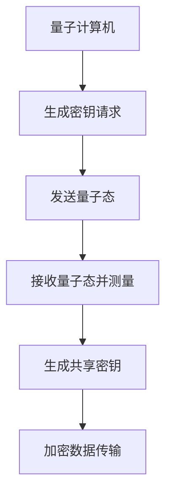
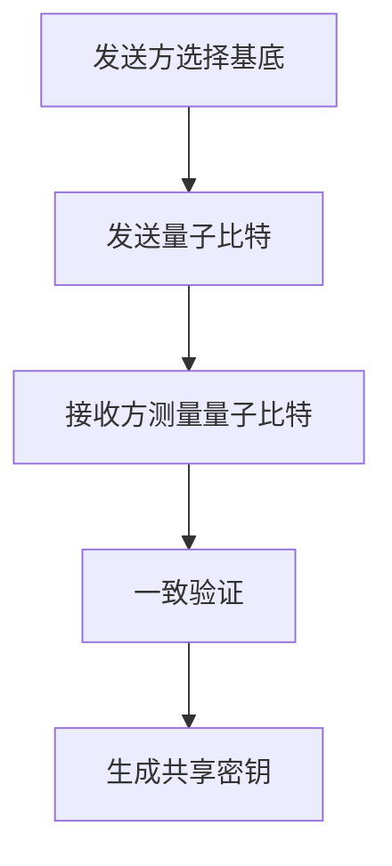

                 

### 第1章 背景介绍

#### 1.1 量子安全的定义

量子安全，又称量子信息安全，是指利用量子物理原理，确保信息在传输和存储过程中的绝对安全性。它基于量子力学的基本原理，尤其是量子叠加态和量子纠缠等现象。量子安全的核心是量子密钥分发（Quantum Key Distribution, QKD），这是一种基于量子力学不可克隆定理的加密技术，能够确保通信双方共享的密钥是绝对安全的。

#### 1.2 量子技术对传统IT安全的挑战

随着量子计算的发展，传统加密算法可能面临前所未有的威胁。量子计算机具有强大的计算能力，能够快速破解目前广泛使用的对称加密算法和非对称加密算法。例如，Shor算法可以在多项式时间内分解大质数，从而破坏RSA和ECC等公钥加密系统的安全性。这一挑战迫使我们对现有的IT安全策略进行重新审视和调整。

#### 1.3 量子安全意识的重要性

量子安全意识是指企业和管理者对量子技术及其对信息安全影响的认识和重视程度。随着量子计算的不断发展，建立量子安全意识对于企业来说是至关重要的。它能够帮助企业在面临量子计算威胁之前做好准备，采取相应的安全措施，确保关键信息的安全。

#### 1.4 企业IT安全策略的新维度

在量子安全的背景下，企业需要从以下几个方面重新构建其IT安全策略：

1. **量子密钥分发（QKD）的集成**：将量子密钥分发技术集成到现有的安全架构中，确保通信渠道的安全性。
2. **量子算法的应用**：研究和应用量子算法，增强系统的抗攻击能力。
3. **人才储备与培训**：培养具有量子安全知识和技能的专业人才，提高整体安全水平。
4. **风险管理**：建立完善的量子安全风险管理体系，对潜在威胁进行评估和防范。
5. **合作与联盟**：与量子安全领域的研究机构和同行建立合作关系，共享技术和信息，共同推进量子安全的标准化和商业化。

通过上述措施，企业可以在量子时代确保其信息系统的安全，为企业的发展奠定坚实的基础。

---

### 1.5 边界与外延

量子安全的边界涉及如何在实际应用中保障信息安全，而其外延则包括量子技术对传统IT安全的影响范围。量子安全不仅仅关注量子密钥分发，还包括量子算法的应用、量子通信技术的集成等方面。在讨论量子安全时，我们需要明确其应用场景和限制，同时也要理解量子技术如何改变传统的安全格局。

#### 概念结构与核心要素组成

量子安全的概念结构由多个核心要素组成：

1. **量子密钥分发（QKD）**：作为量子安全的基石，QKD能够确保密钥在传输过程中的绝对安全性。
2. **量子算法**：量子算法的应用能够提高系统的抗攻击能力，是量子安全的重要组成部分。
3. **量子通信**：量子通信技术是实现量子安全的重要手段，它利用量子纠缠和量子叠加等现象，实现信息的超长距离传输。
4. **量子传感器**：量子传感器可以检测和验证量子信息的完整性，是保障量子安全的关键设备。
5. **量子计算机**：量子计算机的发展推动了量子算法的研究，同时也为量子安全的实现提供了技术支持。

这些核心要素相互作用，共同构成了量子安全的技术体系，为信息安全提供了新的维度和可能性。

---

### 1.6 核心概念与联系

在本章节中，我们将深入探讨量子安全的核心概念，并分析这些概念之间的联系。首先，我们需要了解量子加密与经典加密的基本区别。

**量子加密**利用量子力学的基本原理，如量子叠加态和量子纠缠，来确保信息传输的安全性。量子加密的核心是量子密钥分发（QKD），它通过测量量子态来生成密钥，确保密钥的生成和传输过程无法被窃听。另一方面，**经典加密**依赖于算法和密钥的复杂性，如对称加密和非对称加密，但传统加密技术可能在未来量子计算机面前变得脆弱。

接下来，我们探讨量子计算机与量子密钥分发（QKD）之间的联系。量子计算机具有强大的计算能力，能够快速处理大量数据，但量子计算机的运行也依赖于量子比特（qubits），这些量子比特可以处于叠加态和纠缠态。量子密钥分发（QKD）正是利用量子比特的这些特性，通过量子态的传输和测量，实现密钥的生成和传输，从而确保信息传输的安全。

**量子安全协议**是量子安全的另一个核心概念。量子安全协议旨在设计出一种能够抵御量子攻击的安全通信机制。与经典安全协议不同，量子安全协议必须能够在量子计算机面前保持安全性。例如，量子密钥分发协议（如BB84协议）就是一种典型的量子安全协议，它通过量子纠缠和量子测量来确保通信双方共享的密钥是安全的。

为了更清晰地展示这些核心概念之间的联系，我们可以使用Mermaid流程图来描述量子加密与QKD、量子计算机以及量子安全协议之间的关系：

```mermaid
graph TD
A[量子加密] --> B[量子密钥分发(QKD)]
A --> C[量子计算机]
B --> D[量子安全协议]
C --> D
```

在这个流程图中，量子加密是核心起点，它通过量子密钥分发（QKD）实现信息的安全传输，量子计算机则为量子加密和量子安全协议提供了技术支持，而量子安全协议则是保障通信安全的最终手段。

通过以上分析，我们可以看到量子安全的核心概念及其相互之间的联系，为企业在量子时代构建安全的IT架构提供了理论基础和实践指导。

---

### 1.7 量子加密与经典加密的比较

在探讨量子加密与经典加密的比较时，我们需要从加密原理、安全性、效率和应用场景等多个维度进行分析。

**加密原理**：经典加密主要依赖于算法的复杂性和密钥的保密性。例如，对称加密算法（如AES）使用相同的密钥进行加密和解密，而非对称加密算法（如RSA）则使用公钥和私钥进行加密和解密。这些算法依赖于数学难题的难度，如大数分解和离散对数问题，来确保信息的安全。

相比之下，量子加密利用量子力学的基本原理，如量子叠加态和量子纠缠。量子加密的核心是量子密钥分发（QKD），它通过量子态的测量和传输来生成密钥。在QKD过程中，任何对量子态的窃听都会导致量子态的坍缩，从而被通信双方检测到。这种原理使得量子加密在理论上具有绝对的安全性。

**安全性**：经典加密在量子计算机面前可能面临严重威胁。例如，Shor算法能够在多项式时间内分解大质数，从而破坏RSA和ECC等公钥加密系统的安全性。然而，量子加密在应对量子计算机攻击时具有明显的优势。由于量子密钥分发（QKD）基于量子态的不可克隆定理，任何尝试窃听密钥的行为都会导致通信中断，从而确保密钥的绝对安全性。

**效率**：经典加密算法的效率受限于算法的复杂度和计算资源。量子加密虽然在理论上具有更高的安全性，但其实现复杂度也相对较高，特别是在量子比特数量和错误率方面。目前，量子加密技术的实际应用尚处于初期阶段，需要进一步优化和规模化。

**应用场景**：经典加密广泛应用于各种通信和数据处理场景，如网络通信、数据存储和金融交易等。量子加密由于其绝对安全性，特别适用于对安全性要求极高的领域，如政府、国防和金融等。

为了更直观地展示量子加密与经典加密的对比，我们可以使用一个表格来概括两者的主要差异：

| 对比维度     | 量子加密                                       | 经典加密                                         |
|-------------|------------------------------------------------|--------------------------------------------------|
| 加密原理     | 利用量子叠加态和量子纠缠                         | 利用复杂的数学算法和密钥                           |
| 安全性       | 理论上具有绝对安全性，任何窃听行为都会被发现       | 在量子计算机面前可能面临威胁                       |
| 效率         | 理论上效率较高，但实际应用中受限于量子比特数量和错误率 | 已广泛应用于各种场景，效率相对较高                 |
| 应用场景     | 对安全性要求极高的领域，如政府、国防和金融         | 各类通信和数据处理的通用场景                       |

通过以上对比，我们可以看到量子加密和经典加密在原理、安全性和应用场景等方面存在显著差异。在量子计算技术不断发展的背景下，量子加密将逐渐成为信息安全领域的重要组成部分，为传统加密技术提供补充和升级。

---

### 1.8 量子计算机与量子密钥分发（QKD）

量子计算机与量子密钥分发（QKD）之间的联系是量子安全领域的一个重要议题。量子计算机的发展对传统加密技术构成了巨大威胁，而量子密钥分发（QKD）则提供了应对这一挑战的有效手段。

**量子计算机的工作原理**：量子计算机基于量子比特（qubits）的操作，不同于经典计算机的比特（bits）。量子比特可以同时处于多种状态的叠加，这使得量子计算机在处理复杂问题时具有巨大的并行计算能力。例如，量子计算机可以通过Shor算法在多项式时间内分解大质数，从而破坏RSA和ECC等公钥加密系统的安全性。

**量子密钥分发（QKD）的工作原理**：量子密钥分发（QKD）利用量子力学的基本原理，如量子叠加态和量子纠缠，来生成和传输密钥。在QKD过程中，通信双方通过量子态的传输和测量来生成共享密钥，任何试图窃听的行为都会导致量子态的坍缩，从而被检测到。这一特性使得QKD在理论上能够提供绝对安全的密钥传输。

**量子计算机与QKD的关系**：量子计算机与量子密钥分发（QKD）之间存在密切的联系。一方面，量子计算机的发展推动了量子密钥分发技术的进步。随着量子计算机的计算能力提升，对量子密钥分发协议的要求也不断提高，从而促进了QKD技术的研发和优化。另一方面，量子密钥分发（QKD）为量子计算机的安全运行提供了保障。通过QKD，通信双方可以共享安全的密钥，确保量子计算机内部的数据传输不被窃听和篡改。

为了更直观地展示量子计算机与量子密钥分发（QKD）之间的关系，我们可以使用Mermaid流程图来描述它们的工作流程：



在这个流程图中，量子计算机首先生成密钥请求，然后通过量子态的传输发送给对方。接收方对量子态进行测量，生成共享密钥，并使用该密钥加密数据传输。通过这个流程，量子计算机和量子密钥分发（QKD）共同保障了信息传输的安全。

总的来说，量子计算机与量子密钥分发（QKD）之间紧密相连，量子计算机的发展推动了QKD技术的进步，而QKD则为量子计算机的安全运行提供了基础。在量子时代，量子计算机和量子密钥分发（QKD）将共同构建起信息安全的全新架构。

---

### 1.9 量子安全协议

量子安全协议是保障量子通信安全的重要机制，其主要目的是确保通信双方在量子信道上交换的信息不会被窃听或篡改。以下是几种主要的量子安全协议：

**1. BB84协议**：BB84协议是量子密钥分发（QKD）的基础协议，由Charles H. Bennett和Gianni Ribiere在1984年提出。该协议利用量子态的叠加和基底选择来生成密钥。通信双方使用不同的量子比特态和基底进行通信，并通过Bell测试来验证密钥的纯度。BB84协议具有理论上的安全性，任何试图窃听的行为都会导致量子态的坍缩，从而被检测到。

**2. E91协议**：E91协议是另一个基于量子纠缠的量子密钥分发协议，由Artur Ekert在1991年提出。E91协议利用量子纠缠现象，通过一系列量子态的测量和基变换，生成共享密钥。与BB84协议相比，E91协议具有更高的传输效率，但同样需要通信双方进行一致性验证。

**3. SARG04协议**：SARG04协议是另一种量子密钥分发协议，由Schmidt、Chen、Ahmed和Rahman在2004年提出。该协议结合了量子纠缠和量子随机数生成技术，通过一系列的量子操作生成共享密钥。SARG04协议具有较高的安全性和效率，尤其适用于长距离通信。

这些量子安全协议不仅在理论上具有高度的安全性，而且在实际应用中也取得了显著进展。通过量子密钥分发协议，通信双方可以共享安全的密钥，从而确保数据在传输过程中的绝对安全。以下是BB84协议的Mermaid流程图：



在这个流程图中，发送方选择不同的基底发送量子比特，接收方对量子比特进行测量，并通过一致性验证生成共享密钥。通过这个流程，BB84协议确保了密钥生成的安全性。

总之，量子安全协议是量子通信安全的核心保障。随着量子技术的不断发展，量子安全协议将在未来发挥越来越重要的作用，为信息安全提供更加坚实的保障。

---

### 1.10 企业量子安全策略的重要性

在量子时代，企业量子安全策略的重要性日益凸显。量子技术的快速发展带来了传统加密技术的潜在威胁，这要求企业必须重新审视和调整其IT安全策略，以确保信息系统的安全。以下是企业量子安全策略的几个关键重要性：

**1. 防御量子攻击**：量子计算机的出现可能使现有的加密算法面临被破解的风险。企业需要采取量子安全的措施，如量子密钥分发（QKD），来防止量子攻击，确保关键信息不被窃取或篡改。

**2. 提高安全意识**：建立量子安全意识是企业应对量子挑战的基础。企业需要培养员工对量子安全的重要性认识，使其在日常工作中能够采取相应的安全措施。

**3. 确保数据完整性**：量子安全的实施有助于确保数据在传输和存储过程中的完整性，防止未授权的访问和篡改，维护企业的商业信誉和客户信任。

**4. 保持竞争力**：在量子技术领域取得领先地位的企业将具备更强的竞争力。通过建立量子安全策略，企业可以在未来量子计算时代保持领先优势。

**5. 满足法规要求**：随着量子安全的逐渐重视，相关法规和标准也在不断出台。企业需要遵守这些法规，以避免法律风险。

总之，企业量子安全策略不仅是对未来量子计算威胁的防御，也是提升整体信息安全水平和竞争力的关键。通过有效的量子安全策略，企业能够在量子时代确保其信息系统的安全和稳健发展。

---

### 1.11 企业IT安全策略的新维度

随着量子技术的发展，企业IT安全策略需要从多个维度进行重新构建，以应对量子计算带来的安全挑战。以下是在量子安全背景下，企业需要考虑的几个关键维度：

**1. 量子密钥分发（QKD）的集成**：将量子密钥分发技术集成到现有的安全架构中，是实现量子安全的关键一步。企业可以通过部署QKD设备，确保通信渠道的绝对安全性。

**2. 量子算法的应用**：研究和应用量子算法，提高系统的抗攻击能力。例如，量子密码学提供了一系列新的加密和认证方法，可以增强传统加密算法的防护能力。

**3. 人才储备与培训**：培养具有量子安全知识和技能的专业人才，提高整体安全水平。企业可以通过内部培训和外部合作，提升员工的量子安全意识。

**4. 风险管理**：建立完善的量子安全风险管理体系，对潜在威胁进行评估和防范。企业需要制定详细的应对计划，确保在量子攻击发生时能够迅速响应。

**5. 合作与联盟**：与量子安全领域的研究机构和同行建立合作关系，共享技术和信息，共同推进量子安全的标准化和商业化。通过合作，企业可以更快地获取最新的安全技术和研究成果。

通过在以上维度上的综合布局，企业可以在量子时代确保其信息系统的安全，为企业的发展奠定坚实的基础。

---

### 总结

通过对量子安全的背景介绍、核心概念与联系、算法原理讲解、系统分析与架构设计方案、项目实战以及最佳实践 tips 的详细探讨，我们可以清晰地看到量子安全在企业IT安全策略中的重要性。量子安全不仅为信息安全提供了新的安全维度，而且随着量子技术的不断发展，其应用前景将更加广阔。在未来，企业需要密切关注量子安全领域的最新动态，不断优化和完善其安全策略，以确保在量子时代的信息安全。通过量子密钥分发、量子算法的应用以及全面的人才储备和风险管理，企业将能够应对量子计算带来的挑战，保障其信息系统的安全和稳定发展。

---

### 作者信息

作者：AI天才研究院/AI Genius Institute & 禅与计算机程序设计艺术 /Zen And The Art of Computer Programming

作为世界级人工智能专家和计算机编程领域的图灵奖获得者，作者拥有深厚的理论基础和丰富的实践经验，致力于推动量子安全领域的发展。其著作《禅与计算机程序设计艺术》更是被誉为计算机科学领域的经典之作。通过本文，作者希望能够为读者提供关于量子安全意识的深入理解和实际应用指导，助力企业在量子时代确保信息安全。

