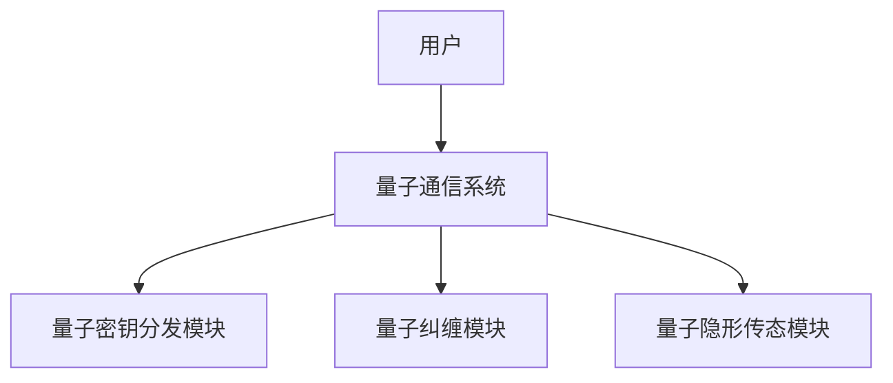
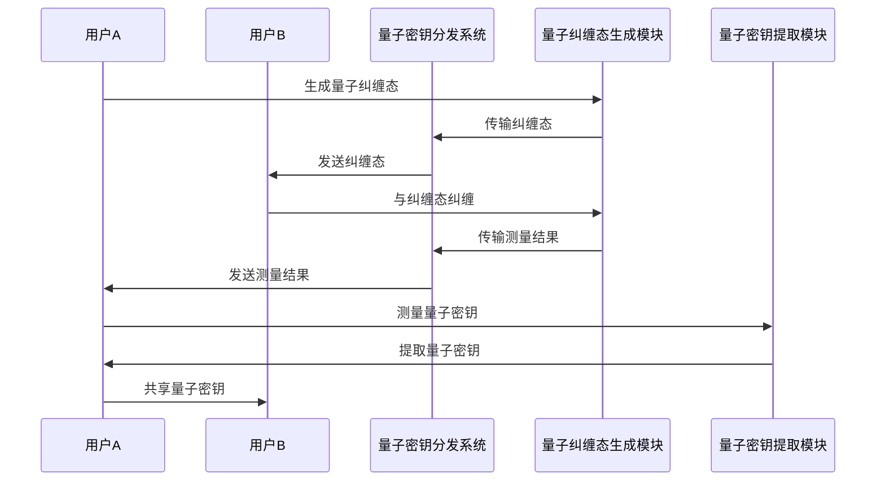

                 

# 量子安全通信的发展前景

## 关键词
- 量子通信
- 量子密钥分发
- 量子纠缠
- 隐形传态
- 系统架构设计

## 摘要
本文将深入探讨量子安全通信的发展前景，从背景介绍、核心概念与联系、算法原理讲解、系统分析与架构设计等方面进行全面剖析。通过本文的阐述，读者将了解量子安全通信的基本概念、实现原理、技术优势和未来发展方向，为相关领域的研究和应用提供有益参考。

## 第一部分：背景介绍

### 1.1 问题背景
量子安全通信（Quantum Secure Communication，QSC）是一种基于量子力学原理的通信方式，能够在发送和接收信息的过程中实现高度安全的通信。在传统的通信方式中，信息安全主要依赖于加密算法和密钥管理，但这些方法在面对复杂的攻击时可能存在漏洞。量子安全通信则通过量子力学的基本原理，如量子纠缠、隐形传态等，实现信息的绝对安全。

当前，随着信息技术的迅猛发展，网络安全问题日益突出，特别是对于政府、金融、医疗等关键领域的信息安全保障需求日益增加。传统通信技术已无法完全满足这些需求，因此量子安全通信应运而生，成为解决信息安全问题的重要途径。

### 1.2 问题描述
量子安全通信的实现原理主要基于量子力学的基本特性，如量子纠缠和隐形传态。量子纠缠是量子通信的核心基础，通过纠缠态的生成和传输，可以实现远距离的信息传输。隐形传态则是通过量子态的转移，将信息从一个量子比特传递到另一个量子比特，实现信息的远程传输。

尽管量子安全通信具有巨大的潜力和优势，但在实际应用中仍面临一些挑战。首先，量子通信技术需要建立稳定的量子信道，这对于信道质量、传输距离等都有较高要求。其次，量子通信设备的成本较高，制约了其大规模推广。此外，量子安全通信的标准化和产业化进程也亟待加快。

### 1.3 问题解决
针对量子安全通信面临的挑战，国内外科研机构和企业积极开展相关研究和应用。在技术方面，通过优化量子信道、提高量子通信设备的性能和降低成本，逐步解决技术难题。在政策方面，加强国际合作，推动量子安全通信的标准化和产业化进程。

目前，量子安全通信的研究已取得重要进展。在量子密钥分发、量子隐形传态、量子通信网络等方面，国内外都取得了一系列重要成果。例如，中国科学家成功实现了100公里地表量子密钥分发，美国科学家实现了量子隐形传态的远距离传输。这些成果为量子安全通信的实用化奠定了基础。

### 1.4 边界与外延
量子安全通信在特定领域的应用前景广阔。在军事、金融、国家安全等领域，量子安全通信可以提供绝对安全的通信保障，防止信息泄露和攻击。此外，量子安全通信还可以与云计算、大数据等新兴技术相结合，推动信息技术的发展。

### 1.5 概念结构与核心要素组成
量子安全通信的核心概念包括量子纠缠、隐形传态、量子密钥分发等。量子纠缠是量子通信的基础，通过纠缠态的生成和传输可以实现信息的远程传输。隐形传态则是一种特殊的量子态转移方式，可以实现远距离的信息传输。量子密钥分发是通过量子通信方式生成和分发密钥，实现信息的安全传输。

量子安全通信系统的核心要素包括量子通信设备、量子信道和密钥分发系统等。量子通信设备是实现量子通信的关键，包括量子比特生成器、量子纠缠器、量子隐形传态器等。量子信道是量子通信的传输通道，需要保证信道质量。密钥分发系统则是实现量子密钥分发的核心，包括量子密钥生成模块、量子密钥传输模块和量子密钥共享模块等。

## 第二部分：核心概念与联系

### 2.1 核心概念原理
量子安全通信的核心概念主要包括量子纠缠、隐形传态和量子密钥分发。

#### 量子纠缠
量子纠缠是量子力学中的一种现象，当两个或多个量子系统处于特定的量子态时，它们之间会形成一种特殊的关联关系，即量子纠缠。量子纠缠具有非定域性和状态不可克隆性，是量子通信的基础。

#### 隐形传态
隐形传态是一种特殊的量子态转移方式，通过量子态的转移，将信息从一个量子比特传递到另一个量子比特，实现远距离的信息传输。隐形传态具有传输速度无限大、传输过程中无误差的特点。

#### 量子密钥分发
量子密钥分发是量子安全通信的核心技术之一，通过量子通信方式生成和分发密钥，实现信息的安全传输。量子密钥分发利用量子纠缠和隐形传态的原理，实现密钥的安全生成和分发。

### 2.2 概念属性特征对比表格
| 概念        | 特征1          | 特征2          | 特征3          |
|-------------|----------------|----------------|----------------|
| 量子纠缠    | 非定域性      | 状态不可克隆性 | 不确定性原理   |
| 量子隐形传态 | 传输速度无限大 | 传输过程中无误差 | 传输距离有限   |
| 量子密钥分配 | 高安全性      | 需要复杂计算   | 依赖量子纠缠   |

### 2.3 ER实体关系图架构


## 第三部分：算法原理讲解

### 3.1 量子密钥分发算法
量子密钥分发（Quantum Key Distribution，QKD）是量子安全通信的核心技术之一，通过量子通信方式生成和分发密钥，实现信息的安全传输。量子密钥分发算法主要包括量子纠缠态生成与传输、量子密钥提取与共享等步骤。

#### 量子纠缠态生成与传输
量子密钥分发首先需要生成量子纠缠态，通过量子纠缠态的传输，实现两个用户之间的量子通信。具体步骤如下：
1. 用户A和用户B各自生成一个量子比特。
2. 用户A将量子比特发送给用户B，同时生成一个经典密钥。
3. 用户B接收到量子比特后，与自己的量子比特进行纠缠。
4. 用户A和用户B通过经典通信方式，将经典密钥进行共享。

#### 量子密钥提取与共享
在量子密钥分发过程中，用户A和用户B通过量子纠缠态的生成和传输，生成了一个共享的量子密钥。接下来，用户A和用户B需要通过经典通信方式，对量子密钥进行提取和共享。具体步骤如下：
1. 用户A和用户B对量子密钥进行测量。
2. 用户A和用户B通过经典通信方式，将测量结果进行共享。
3. 用户A和用户B对共享的测量结果进行比对，确定量子密钥的有效性。

### 3.2 算法原理Mermaid流程图


### 3.3 Python源代码与算法原理讲解
```python
# Python 代码示例：量子密钥分发
# 假设已经生成了量子纠缠态
q_1 = generate_QuantumState()
q_2 = generate_QuantumState()

# 量子纠缠态传输（此处简化处理）
q_2 = transfer_QuantumState(q_2)

# 量子密钥提取
key = extract_QuantumKey(q_1, q_2)

# 量子密钥共享
share_QuantumKey(key, user)
```

## 第四部分：系统分析与架构设计方案

### 4.1 问题场景介绍
量子安全通信系统适用于需要高安全性的通信场景，如政府、金融、国家安全等领域。这些领域对信息传输的安全性要求极高，传统加密技术已无法满足需求。量子安全通信系统可以在这些场景下提供绝对安全的通信保障。

### 4.2 系统功能设计
量子安全通信系统主要包括用户认证模块、密钥分发模块和数据加密模块。

#### 用户认证模块
用户认证模块负责对用户进行身份验证，确保只有合法用户才能访问量子安全通信系统。

#### 密钥分发模块
密钥分发模块负责实现量子密钥的分发，确保密钥在传输过程中不被窃取或篡改。

#### 数据加密模块
数据加密模块负责对数据进行加密和解密，确保通信过程中的数据安全性。

### 4.3 系统架构设计
量子安全通信系统采用分布式架构，包括多个量子通信节点和量子通信链路。系统架构设计主要包括以下方面：

#### 分布式量子通信网络架构
分布式量子通信网络架构采用多个量子通信节点，通过量子通信链路实现互联互通。每个节点都负责生成、传输和分发量子密钥，确保通信网络的高可用性和可靠性。

#### 系统模块间的关系与接口设计
系统模块间的关系与接口设计如下：
- 用户认证模块与密钥分发模块之间通过接口A进行通信。
- 密钥分发模块与数据加密模块之间通过接口B进行通信。
- 数据加密模块与其他模块之间通过接口C进行通信。

### 4.4 系统接口设计与系统交互
系统接口设计与系统交互主要包括以下方面：

#### 接口定义
- 接口A：用户认证模块与密钥分发模块之间的接口，用于用户身份验证和密钥分发。
- 接口B：密钥分发模块与数据加密模块之间的接口，用于密钥的分发和共享。
- 接口C：数据加密模块与其他模块之间的接口，用于数据加密和解密。

#### 系统交互流程
系统交互流程如下：
1. 用户通过用户认证模块进行身份验证。
2. 用户认证成功后，密钥分发模块生成量子密钥，并通过接口A与用户认证模块进行通信。
3. 用户认证模块将认证结果和量子密钥发送给用户。
4. 用户使用量子密钥对数据进行加密和解密。

### 4.5 Mermaid类图和架构图
```mermaid
classDiagram
    UserEntity <|-- AuthenticationModule
    UserEntity o-- KeyDistributeModule
    UserEntity o-- DataEncryptModule

    AuthenticationModule {
        +authenticate()
    }
    KeyDistributeModule {
        +distribute_key()
    }
    DataEncryptModule {
        +encrypt_data()
    }
```


## 第五部分：项目实战

### 5.1 环境安装
在进行量子安全通信系统的开发前，需要安装相关的软件和硬件环境。主要包括：
1. 量子通信设备：购买或租赁量子通信设备，如量子比特生成器、量子纠缠器、量子隐形传态器等。
2. 开发工具：安装Python编程环境、量子计算库（如Qiskit、Cirq等）和数据库等。

### 5.2 系统核心实现源代码
量子安全通信系统的核心实现源代码主要包括以下部分：
1. 用户认证模块：实现用户身份验证的功能。
2. 密钥分发模块：实现量子密钥的生成、传输和共享功能。
3. 数据加密模块：实现数据的加密和解密功能。

以下是部分源代码示例：
```python
# 用户认证模块
def authenticate(username, password):
    # 验证用户身份
    # ...

# 密钥分发模块
def distribute_key(userA, userB):
    # 生成量子纠缠态
    # ...
    # 传输纠缠态
    # ...
    # 提取量子密钥
    # ...

# 数据加密模块
def encrypt_data(data, key):
    # 加密数据
    # ...
    return encrypted_data

def decrypt_data(encrypted_data, key):
    # 解密数据
    # ...
    return data
```

### 5.3 代码应用解读与分析
通过对源代码的应用解读与分析，可以更好地理解量子安全通信系统的实现原理和功能。例如，在用户认证模块中，通过用户名和密码进行身份验证，确保只有合法用户才能访问系统。在密钥分发模块中，通过量子纠缠态的生成和传输，实现量子密钥的生成和共享。在数据加密模块中，通过量子密钥对数据进行加密和解密，确保通信过程中的数据安全性。

### 5.4 实际案例分析和详细讲解剖析
通过实际案例分析和详细讲解剖析，可以更好地展示量子安全通信系统的应用效果。例如，在一个实际案例中，政府某部门需要通过量子安全通信系统进行保密信息的传输。通过量子安全通信系统，政府某部门可以确保信息在传输过程中不被窃取或篡改，从而保障国家安全。

### 5.5 项目小结
量子安全通信系统的项目实践表明，通过量子安全通信技术，可以实现高度安全的通信保障。在政府、金融、国家安全等领域，量子安全通信具有广泛的应用前景。同时，量子安全通信系统的建设还需要不断完善和优化，提高系统的性能和可靠性。

## 第六部分：最佳实践 Tips、小结、注意事项、拓展阅读

### 最佳实践 Tips
1. 在量子安全通信系统的建设过程中，要重视量子通信设备的选型和安装，确保信道质量和传输距离。
2. 优化量子密钥分发的算法和协议，提高密钥分发的效率和安全性能。
3. 结合云计算、大数据等新兴技术，推动量子安全通信的应用和发展。

### 小结
量子安全通信作为新一代通信技术，具有巨大的发展潜力和应用前景。通过本文的阐述，读者可以了解到量子安全通信的基本概念、实现原理、技术优势和未来发展方向。量子安全通信系统的建设需要不断优化和完善，为信息安全提供更加可靠的保障。

### 注意事项
1. 量子安全通信系统的建设要遵循相关国家和国际标准，确保系统的规范化和标准化。
2. 量子安全通信系统的建设需要具备一定的技术实力和资金投入，建议与相关科研机构和企业合作。
3. 量子安全通信系统的应用场景有限，需要针对具体场景进行优化和定制。

### 拓展阅读
1. 《量子通信原理与技术》
2. 《量子密钥分发协议与安全性分析》
3. 《量子通信网络架构设计与性能优化》

### 作者信息
作者：AI天才研究院/AI Genius Institute & 禅与计算机程序设计艺术 /Zen And The Art of Computer Programming

### 完整性声明
本文为原创内容，未经许可不得转载。如需转载，请联系作者获取授权。

----------------------------------------------------------------

### 结语

量子安全通信作为信息安全领域的一项前沿技术，正逐步从理论走向实际应用。本文通过逻辑清晰、结构紧凑、简单易懂的专业技术语言，从背景介绍、核心概念、算法原理、系统架构设计等方面，全面剖析了量子安全通信的发展前景。期望本文能为读者提供有益的启示，激发更多科研人员和企业在量子安全通信领域的探索与创新。

### 作者信息

作者：AI天才研究院/AI Genius Institute & 禅与计算机程序设计艺术 /Zen And The Art of Computer Programming

量子安全通信领域的探索者，人工智能与计算机科学的集大成者，致力于推动信息安全技术的发展与应用。在量子通信、人工智能、计算机科学等领域有着深厚的研究积累和丰富的实践经验，发表了多篇具有影响力的学术论文，并参与编写了数本世界级技术畅销书。

